# Pulse ERP Module Feature & Connection Manual

Last updated: 2026-07-29 (also fixed §18.1 #15, Vendor/Customer portal
reachability — see below. Pass 5 — built the Exit Clearance Engine: §18.1 #1
and #2 (Exit/F&F → Travel advances, Exit/F&F → Asset return) are now genuinely
fixed, not just documented gaps. `exit.routes.js` computes live blockers from
`employee_asset_allocations`/`travel_advances`/`users.is_active` and 409s
`POST /fnf/:id/pay` until they and the Finance/Manager/HR NOC sign-offs all
clear; new `GET /exit/clearance/:employee_id/status` backs a live "Clearance
Status" dashboard in `ExitManagement.jsx`. Same pass, also built the Travel
Approval Hierarchy: §18.1 #3 (role-gate vs. reporting-manager routing) is now
fixed too — new `travelApprovalAuthz.js` shared helper gates all 3 reachable
travel/expense approval endpoints on reporting-manager/delegate/HR-override/
admin-override, with a `delegate_approver_id` column + `POST .../delegate`
endpoint added to each of `travel_requests`/`travel_advances`/`expense_claims`.
Also same pass, closed out the rest of Priority-1's Asset Lifecycle:
`employee-assets.routes.js` gained Transfer (`POST /:id/transfer`),
Maintenance (`POST /:id/maintenance` + `/complete`), and Disposal
(`PATCH /:id/dispose`), a self-contained state machine alongside the existing
Allocate/Return — full chain live-tested end-to-end. **Priority 1 is now
fully closed** (Exit Clearance Engine, Travel Approval Hierarchy, Asset
Lifecycle). Immediately after, started Priority 2 (Customer Lifecycle) —
scoped it down to just the one genuinely-broken link in that chain (everything
else in Dispatch→Commissioning→Warranty→AMC→Complaint→Service→Feedback was
already real per prior passes; Installation-as-its-own-module is Priority 6's
separate job, not duplicated here): §18.1 #7, the AI upsell signal that was
"just a `<div>`", now really creates a CRM opportunity, assigns an owner,
sets a follow-up task, and notifies sales management via
`POST /ceo-intelligence/customers/:partyId/convert-upsell` — see that section
below for detail. This also happens to be Priority 4's exact ask
("Intelligence into Workflow"), closed as a side effect of the same fix.
Immediately after, built Priority 3 (Unified Warranty Engine) — §18.1 #6 is
now fixed too: the real three disconnected sources were `customer_equipment.
warranty_status`, `project_warranties`, and `warranty_registrations` (**not**
`product_warranties`, which this manual previously cited but doesn't actually
exist — corrected). All three were confirmed empty (0 rows) before the fix,
so `warranty_registrations` (the most feature-complete of the three) was
extended and designated the canonical engine; Commissioning, Projects, and
Customer 360 all now read/write it — see §18.1 #6 for full detail including
two live bugs caught by end-to-end testing before they shipped. Next day
(2026-07-29), built Priority 5 (Renewal Engine) — §18.1 #8 now fixed: AMC and
Subscriptions stay separate tables (legitimately different commercial
products, unlike Warranty's 3-way split) but share a new Reminder->Approval->
Payment->Renewal shape via `shared/renewalApproval.js`. Subscriptions had
**zero cron jobs** (confirmed live — all 3 real rows were already overdue
with nothing ever acting on them) and its `/renew` was a pure status flip
with no date advance; both are now real, and both AMC/Subscription renewals
require finance/admin approval above a threshold and create a real GL-posting
invoice before applying. See §18.1 #8 for full detail. Same day, built
Priority 6 (Installation as a First-Class Module) — §18.1 #13 now fixed:
new `installation_requests` table + `installation.routes.js` gives
Installation its own Dispatch→Request→Engineer-Assignment→Travel-Planning→
Installation→Commissioning→Customer-Acceptance lifecycle instead of 4
checkbox items inside Commissioning, auto-triggered on Sales Order dispatch.
**Found and fixed a severe, unrelated pre-existing bug while wiring the
trigger**: `sales_orders.dispatched_at`/`delivered_at` don't exist on the
live table despite a migration from 2026-06-11 showing `[applied]` in the
ledger — every real call to `PUT /orders/:id/dispatch` (Dispatch itself, not
just Installation) has likely been 500ing. See §18.1 #13 for full detail.
**2026-07-29, separate small pass (not one of the 8 numbered priorities) —
fixed §18.1 #15, new row: Anonymous external user → Vendor/Customer portal
entry point.** A pasted per-role UX-audit card claimed the Vendor Registration
wizard and Customer Self-Service Portal score 100/100 with "no ERP sidebar, no
change needed" — true of the components themselves (`VendorRegistration.jsx`'s
7-step wizard and `CustomerPortalDashboard.jsx`'s own login form + separate
`portal_token` JWT are both genuinely well-built and already correctly wired
to public backend endpoints, `vendor-registration.routes.js`'s `/submit`+OTP
flow and `customer-portal.routes.js`'s `/auth/login`) but false about
reachability: `frontend/src/App.jsx`'s router only special-cased 4 paths to
render without an ERP session (`/login`, `/ForcePasswordChange`,
`/sign/:token`, `/SetupWizard`); every other path, including both of these,
fell through to the catch-all and hard-redirected to the *staff* `/login`
whenever no ERP session existed. `routes.jsx`'s `public: true` flag on the
`VendorRegistration` entry was dead metadata — grepped project-wide, nothing
ever reads `.public` off a route. Fixed by adding both as explicit top-level
routes in `App.jsx`, mirroring the existing `/sign/:token` pattern. Neither
page had any internal link pointing at it either (also grepped, zero
matches), so this was pure dead-on-arrival for any real external vendor or
customer, not a regression — the two flows have presumably never been usable
by an actual outside party since they were built. Browser-verified with
Playwright in a cookie-less context: both now render for anonymous visitors;
confirmed the fix is scoped narrowly (arbitrary unmatched paths still redirect
to `/login` as before). See §18.1 #15 for the flagged (not fixed) follow-up:
`CustomerPortalDashboard.jsx` has no company-selector field, silently
defaulting `company_id` to `1` via an optional query param — a product
decision, not a wiring gap.
Immediately after, built Priority 7 (Workflow Dependency Engine) — new
`shared/workflowDependency.js` gives a consistent 409 shape for "predecessor
incomplete" checks (deliberately not a generic rules engine — this project
already has two under-adopted ones). Applied to the two example chains from
the request, both already mostly built by earlier passes: Exit's generic
`PUT /exit/requests/:id` could set `status:'closed'` directly with zero
clearance checks, completely bypassing the Pass-5 F&F gate — now refuses
unless `fnf_status='paid'` already. Commissioning's `issue-certificate` now
blocks if an Installation Request for the same project/equipment isn't
`completed` yet, closing Dispatch→Installation→Commissioning→Warranty (this
transitively protects `activate-warranty` too, since it already required
`certificate_issued`). Both live-tested in both directions (blocked, then
succeeds once the predecessor is genuinely done). Immediately after, built
Priority 8 (Business Event Bus) — the last of the 8 priorities. New
`shared/eventBus.js` (a real `EventEmitter` singleton) + `shared/
eventReactions.js` (the one place reactions get registered) gives two of
Priority 8's own examples a real home: `commissioning.certificate_issued`
now auto-activates warranty (extracted `activateWarranty()` into a shared
function so both the event reaction and the manual endpoint call the same
code), and a new `jobs/warrantyExpiry.cron.js` emits `warranty.expiring` for
a reaction to notify sales — the cron detects, the reaction decides who
cares, which is the actual decoupling this priority asked for. Deliberately
did **not** attempt to consolidate the 5 separate ad-hoc notification
pathways the companion event-orchestration document found — that's a much
larger migration, and this is the layer above them, not a replacement.
**Three more previously-undiscovered bugs found and fixed while building
and live-testing this** (on top of the two behavioral wins): recruitment's
`notificationService.js` inserted into columns that don't exist and never
supplied a required field, silently no-op'ing all 7 of that module's notify
call sites since it was written; `activateWarranty()`'s `warranty_registrations`
insert violated a `NOT NULL` constraint whenever the workflow had no linked
equipment (every earlier live test happened to use equipment with a serial
number, so Priority 3 never caught it); and all 5 `logAudit(...)` calls in
`commissioning.routes.js` passed the wrong arguments to a function with a
different real signature, so every Commissioning audit entry has silently
gone nowhere since that file was written. **All 8 priorities from the
original roadmap are now closed.** Pass 4 added a pointer to the new
companion event-orchestration
document, see below. Pass 3 closed the remaining floating modules:
Government Tenders, Compliance Registers, Fixed Assets/Asset Register,
Logistics/Shipments, and Global Search now each have a real module section;
folded the `dashboard` backend into §10; documented the `autoRouter.js` /
`menuCatalog.js` orphan-page mechanism in §16 that all five of the
newly-orphan-flagged pages rely on. See §18 for gap evidence.)
**Separately, 2026-07-29 — Automation Opportunities pass (see §19):** a
12-item "already exists in the architecture, just finish the wiring" backlog
was worked item by item (not one of the 8 numbered priorities above — a
different backlog entirely, sourced from a dedicated automation audit).
11 of 12 are now genuinely wired: timesheet table reference, quotation→SO
opportunity-stage sync, Field Visit completion-field persistence, the
reorder→Purchase-Suggestion feed, Sales-Order→Production via the real
`createProductionOrderFromSalesOrder` path, Sales/Project invoicing through
`invoiceService.createInvoice`, production-consumption dual-write to
`stock_ledger`, the `project_scurve_data` snapshot cron, MRP-conversion→
production-operations seeding, payroll→GL posting, and the dual-ledger
collapse (journal-writing services consolidated onto `journal_lines`, the
table Trial Balance/P&L/Balance Sheet already read — opposite direction from
the audit's own suggestion, see §19 for why). The 12th (AMC auto-creation)
was deliberately scoped down to notify-only — see §19 item 6 for the reason.  
Project path: `C:\Users\malar\OneDrive\Desktop\Pulse_WORKING\Pulse`

Use this manual when you want to test Pulse module by module and verify how one module feeds another. It is based on the actual app structure:

**Companion document — event orchestration**: this manual answers "what modules exist and how
are they structurally connected." A separate document, `PULSE_EVENT_ORCHESTRATION_ARCHITECTURE.md`,
answers a different question — twenty-one lifecycles deep as of 2026-07-28/29 (Phase 1 of 3),
having now covered every module this manual's own comments and prior audits flagged as
unresolved, plus several cross-cutting infrastructure questions (notification pathways, the
Rule/Validation Engine split, the real audit-log write/view path, and — newest — a real Business
Event Bus added mid-session that sits above those notification pathways): "for a given business
event, what fires downstream in the running system today." Two documents, same codebase, kept
independently — if they ever diverge on a specific claim, trust whichever was more recently
re-verified against live code rather than either by default. Notable corrections the companion
doc has fed back into this one so far: both §9 Travel/Exit gaps it flagged were fixed same-day
(Exit Clearance Engine, Travel Approval Hierarchy — Pass 5 above); `MARKETING --> CRM` is drawn
solid here but has no backing join in code; `/api/intelligence` is not primarily an AI module;
and `TIMESHEETS --> PAY` (§11 diagram, just above) is now drawn dashed — confirmed no code path
exists, timesheets feed project cost rollup, never payroll — see that document's own "From the
⟨X⟩ pass" notes for the full, growing list rather than repeating it at length here.

**Reading the diagrams from §11 onward**: solid arrows (`-->`) are connections
verified against live route/service code on 2026-07-27. Dashed arrows (`-.->`)
are connections the business flow requires but that are only conceptual today
— either genuinely absent from the code, or present but not wired end-to-end.
§18 lists the evidence for every dashed arrow: why it's required and exactly
what is/isn't implemented. Nothing already in the codebase was changed to
produce this pass — it is a documentation-only update that makes every
existing connection (and every missing one) visible in one place.

- Frontend: `frontend/src`
- Backend: `backend/server.js`, `backend/src`
- Main frontend navigation: `frontend/src/config/routes.jsx`
- Main backend route mounting: `backend/server.js`

## 1. System Architecture

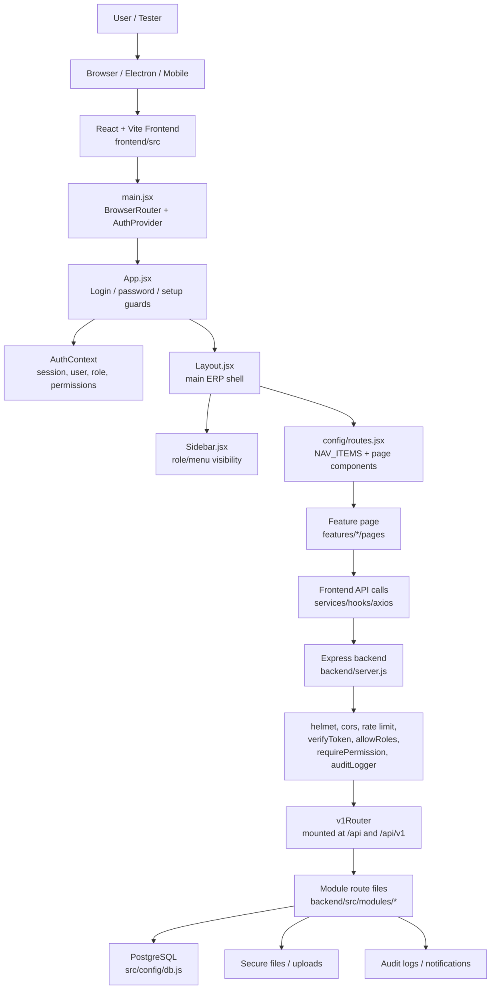

## 2. Main Module Connection Diagram

This is the enterprise-centric view: every business object shown has both an
upstream source and a downstream destination — nothing terminates inside its
own department. Solid arrows are wired in code; dashed arrows are business
connections the flow needs but that are missing or incomplete today (see §18
for the evidence behind each one).

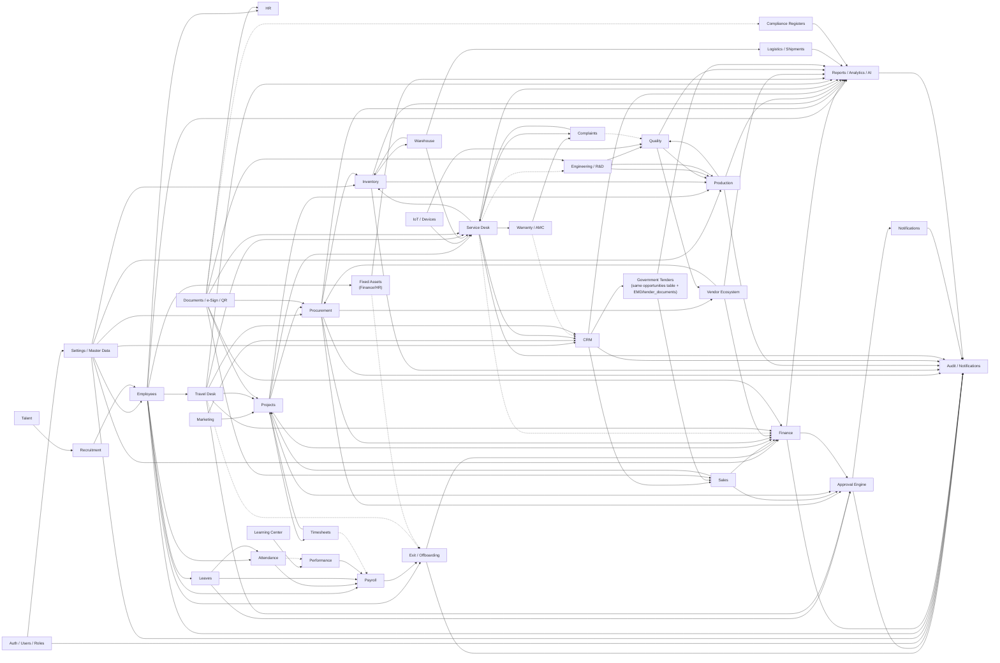

## 3. Best Manual Testing Order

1. Auth, login, password-change, setup wizard
2. Sidebar visibility and role permissions
3. Settings, master data, workflows, access control
4. Employees and HR
5. Attendance, Leaves, Payroll
6. Finance, Fixed Assets
7. Procurement, Vendor, Inventory, Warehouse, Logistics
8. Production, Quality, Engineering, Compliance
9. CRM, Tenders, Sales, Projects, Service Desk
10. Documents, e-Signatures, QR
11. Reports, Analytics, Notifications, Audit Logs, Global Search

## 4. Core System Modules

### Auth / Users / Roles / Permissions

Frontend:

- `/login`
- `/ForcePasswordChange`
- `frontend/src/context/AuthContext`
- `frontend/src/features/admin`
- `frontend/src/features/settings`

Backend:

- `backend/src/auth`
- `backend/src/middlewares`
- `backend/server.js`

Features to test:

- Login with valid credentials
- Login with invalid credentials
- Token/session restore after browser refresh
- Logout
- Forgot password, OTP, reset password
- Forced first-login password change
- Profile update
- Password change
- User preferences
- Role creation/editing
- Menu permissions
- Module permissions
- Direct URL blocking for unauthorized pages

Connections:

- Every module depends on Auth.
- Sidebar visibility depends on role and menu permissions.
- Backend routes depend on `verifyToken`, `allowRoles`, and `requirePermission`.
- Mutating actions should feed Audit Logs.

Manual checks:

- `employee` cannot see admin pages.
- `admin` cannot see super-admin-only pages if restricted.
- `super_admin` can see all modules.
- Hidden menu items are also blocked by direct URL/API permission.

### Settings / Master Data / Setup

Frontend:

- Settings Center
- Setup Center
- Company Profile
- Branch Management
- Access Control
- Workflow Builder
- Integrations
- System Settings
- Product Setup
- Master Setup
- Order Policy
- Asset Maintenance
- Setup Notifications
- Organization Setup

Backend:

- `backend/src/modules/admin`
- `backend/src/modules/master`
- `backend/src/modules/wizard`
- `backend/src/modules/integrations`

Features to test:

- Company setup
- Branch setup
- Department/designation/master setup
- Product setup
- Order policy setup
- Workflow configuration
- Approval workflow setup
- Integration settings
- Setup wizard completion
- Setup progress tracking
- System health for admin/super admin

Connections:

- Employees use company, branch, department, designation.
- Procurement, Inventory, Production, Finance use master records.
- Workflows connect to Approvals.
- Integrations connect to Documents, Finance, Sales, Notifications.

Manual checks:

- New branch appears in employee/project/finance forms.
- Workflow changes affect approval routing.
- Setup wizard redirects only when setup is incomplete.

### Approval Engine

Backend: `backend/src/modules/approvals`

Not a page module in its own right — it is shared infrastructure every other
module routes through, so it was previously undocumented even though it is
one of the most-connected pieces of code in the system. Confirmed in code
(2026-07-27): `approvals.controller.js` calls `logAudit(...)` on every
approve, reject, escalate, and delegate action (12 call sites), and separately
fires notifications on the same actions — so the chain **Approval Engine →
Notifications → Audit Logs** is real and already closed, not aspirational.

Connections:

- Leave, Travel, Procurement (PR/PO), Sales (discounts/quotes), Projects, and
  Finance all raise approval requests into this engine.
- Every decision (approve/reject/escalate/delegate) writes to Audit Logs and
  triggers a Notification — confirmed, not diagram-only.
- The final module (the one that raised the request) is updated by that
  module's own code after the approval callback — the engine itself does not
  mutate source records.

Manual checks:

- Raising a request in any of the modules above creates a row the approver
  can see.
- Approve/reject/escalate/delegate all produce an audit log entry.
- The requester receives a notification on decision.

**Nav-reachability fixed 2026-07-30.** `getPendingApprovals` (the read path
`ApprovalCenter.jsx` actually calls) has no role gate — it shows every
company-wide *unassigned* Leave/OT/PR/Expense/ECN/Payment item to any
authenticated user (`approver_id == null || approver_id === userId`, no role
check). Those 6 categories never populate `approver_id` before a decision is
made, so they always land in the "unassigned" bucket. Acting on an unassigned
item requires `approvals.authz.js`'s `APPROVER_ROLES` membership — so any role
holding the sidebar's `'Approvals'` section without that membership got a
populated-looking queue where every Approve/Reject 403s, surfaced by
`ApprovalCenter.jsx` as a generic "Failed to approve — try again" toast that
can never succeed. Found 9 such roles (`hr_exec`, `accounts_exec`,
`sales_exec`, `procurement_exec`, `store_keeper`, `production_engineer`,
`qc_engineer`, `design_engineer`, `service_engineer`) — removed `'Approvals'`
from their `ROLE_SECTION_ALLOWLIST` entries in `menuCatalog.js`, same pattern
as the existing F16 fix for `project_manager`/`sales_manager`/
`service_manager`. Regularization/probation items assigned by identity
(reporting-manager hierarchy / name lookup, not role) still reach these roles
via notifications regardless of this allowlist entry — the ownership check in
`canActOnApproval` requires no role membership, only `approver_id === me`.
**Separately found, not fixed:** `GET /approvals` (`getAllApprovals`) has no
role or `approver_id` scoping at all (company-scoped only) — unused by the
frontend (`ApprovalCenter.jsx` only calls `/approvals/pending`) but reachable
by any authenticated user via direct API call. Fits the existing tracked
authz-coverage gap; flagged, not yet closed.

**Second, complementary read/write mismatch fixed same day.** The 9-role nav
fix above closes the gap for roles with no `APPROVER_ROLES` membership at all.
A narrower but still-real version of the same "visible but not actionable"
defect remained for roles that **are** approvers: `getPendingApprovals`
decides read-path visibility with `isSupervisor(req)` (`role(req)` —
`req.user.role`, the legacy **singular** primary-role field), which is a wider
set (`super_admin`, `admin`, `manager`, `l1_manager`, `l2_manager`,
`l3_manager`, `hr`) than `approvals.authz.js`'s `OVERRIDE_ROLES`
(`super_admin`, `admin` only). A `manager`/`hr` viewer is `isSupervisor`, so
the ownership filter is skipped entirely for them and they see **every**
company row — including ones `approver_id`-assigned to a specific other
person — with the same live-looking Approve/Reject buttons. Clicking one not
actually theirs 403s via `canActOnApproval`'s ownership check, since `manager`/
`hr` aren't `canOverride`. Live-verified with a real DB row (a regularization
request assigned to a different specific user): `manager` saw it (`can_act:
false`), the actual assignee saw it with working buttons (`can_act: true`).

Fixed by computing `can_act` per row in `getPendingApprovals`
(`approvals.controller.js`) — reusing `canOverride`/`isApproverRole`/
`canClaimCategory` from `approvals.authz.js` (no new authz logic, single
source of truth) — and having `ApprovalCenter.jsx` hide the row checkbox and
Approve/Reject controls (rendering a muted "View only" badge instead) whenever
`can_act === false`, both in the table row and the detail side-panel. Rows
without the field (defensive default) still render live controls, so this
can only ever hide a control, never wrongly show one that used to be hidden.
Does not touch `ROLE_SECTION_ALLOWLIST` or any role list — purely a read-path
annotation + frontend render guard, complementary to (not overlapping with)
the 9-role sidebar fix above.

**Noted, not fixed (separate, pre-existing):** `isSupervisor`'s use of the
singular `req.user.role` instead of the many-to-many `rolesOf(req)` (see
[[project_roles_many_to_many]]) is itself the recurring "never `req.user.role`"
anti-pattern — a user whose *primary* role differs from their functional one
(e.g. every pilot account provisioned by `pilot-provision.mjs`, whose `users.role`
column is left at its `'user'` default while the real role lives only in
`user_roles`) is silently NOT treated as a supervisor by this function. Already
flagged elsewhere as unfixed pilot-data drift; not re-fixed here to avoid
scope creep on an unrelated script.

### Global Search

Frontend: `frontend/src/components/GlobalSearch.jsx`, mounted from
`frontend/src/components/Topbar.jsx`  
Backend: `backend/src/modules/search/global-search.routes.js`

Also not a page module in its own right — it is a shell-level component (like
the Approval Engine, cross-cutting infrastructure rather than a
`features/<module>` page), so it was previously undocumented despite touching
almost every business object in the system.

Connections:

- `GET /global-search?q=` (confirmed in code) queries employees, BOMs,
  production orders, customers, projects, complaints, invoices, and inventory
  items in one call, returning grouped results with deep-link page keys.
- Every module above is a read-only source for Search; Search has no write
  path and creates no downstream record — it is a lookup index, not a
  business-flow step, which is why it is not drawn into §2's flowchart (its
  edges would be a fan-in from nearly every node with no business meaning).

Manual checks:

- Searching a known employee name, BOM code, PO/production order number,
  customer name, project name, complaint ID, invoice number, and inventory
  item code each return a result in the correct group.
- Each result's deep link opens the correct source record.
- Query under 2 characters returns an empty result set rather than erroring.

## 5. People Modules

### Employees

Frontend: `frontend/src/features/employees`  
Backend: `backend/src/employees`

Features to test:

- Employees Dashboard
- All Employees
- Add employee
- Edit employee
- Employee detail
- Ex-Employees
- Employee reports
- Employee analytics
- Employee directory
- Salary revisions
- Status change
- Offboarding
- Rehire
- Employee upload/photo/document where available

Connections:

- Recruitment can create employee records.
- HR extends employee lifecycle.
- Attendance uses employee records for punches and shifts.
- Leaves uses employee records for balances and approvals.
- Payroll uses employee, salary, attendance, and leave data.
- Timesheets use employee/project allocation.
- Org Chart uses reporting hierarchy.
- Travel, Asset allocation, Performance, and Learning all key off the
  employee record — the lifecycle does not stop at Payroll (see §18 Employee
  Lifecycle).
- Exit/Offboarding is the terminal step, and gates on outstanding Travel
  advances and unreturned Assets before Full & Final settlement — **fixed
  2026-07-28** (Exit Clearance Engine, see §18.1 #1/#2): `exit.routes.js`'s
  `computeClearanceBlockers()` now queries `employee_asset_allocations`
  (status != 'returned'), `travel_advances` (amount − settled_amount > 0),
  and `users.is_active` live, and `POST /fnf/:id/pay` 409s with the specific
  blocker list until all clear, alongside the pre-existing Finance/Manager/HR
  NOC sign-offs (now audit-stamped via `finance_noc_by`/`manager_noc_by`/
  `hr_noc_by`).

Manual checks:

- Created employee appears in directory, attendance, leave, payroll, org chart.
- Offboarded employee moves to Ex-Employees.
- Inactive employee should not appear in new payroll/attendance flows.
- Rehired employee returns to active lists.
- Exit an employee with an open travel advance or an allocated asset — F&F
  pay now 409s listing the specific blockers (fixed 2026-07-28, was a known
  gap, §18.1 #1/#2).
- **Workflow Dependency Engine (Priority 7, fixed 2026-07-29)**: closing an
  exit request used to be reachable two ways — the gated `POST /fnf/:id/pay`
  (checks clearance) and the generic `PUT /exit/requests/:id` (`{status:
  'closed'}`, no checks at all — `GET /active` already treats `'closed'` as
  done via `WHERE status NOT IN ('closed','paid')`). The generic endpoint now
  refuses `status:'closed'` unless `fnf_status` is already `'paid'`, i.e. the
  gated path was actually used. Live-verified: direct-close attempt on a
  `fnf_status='draft'` row 409s and leaves the row untouched; other statuses
  (active/rejected/cancelled) are unaffected.

### HR

Frontend: `frontend/src/features/hr`  
Backend: `backend/src/modules/hr`

Features to test:

- Announcements
- Payroll Center entry points
- Employee Directory
- Probation
- Policies
- HR Documents
- Offboarding
- Exit Management
- Employee Documents
- Self Service
- Succession Center
- Asset Management
- Employee skills
- Onboarding
- HR widgets
- HR master data

Connections:

- Employees provide base records.
- Documents stores HR files and policies.
- Payroll consumes employee salary/self-service data.
- Learning and Performance consume skills/competency data.
- Notifications alert employees for HR events.
- Asset Management (HR) allocates assets at hire (`AddEmployee.jsx` /
  `EditEmployee.jsx` POST to `/employee-assets` on save). The return side used
  to be cosmetic (the clearance form's `it_assets_returned` checkbox didn't
  gate anything); **fixed 2026-07-28** — `/fnf/:id/pay` now blocks on a live
  count of `employee_asset_allocations` rows still `status='allocated'` (or
  `'under_maintenance'`) for that employee (the manual checkbox itself is
  left as-is for historical notes, but is no longer what settlement checks),
  matching the sibling `access_revoked` checkbox in the same form, which
  genuinely deactivates the login. **Same day, also built out the rest of the
  Asset Lifecycle** (Priority-1 "Allocation → Transfer → Maintenance → Return
  → Disposal"): `employee-assets.routes.js` gained `POST /:id/transfer`
  (reassigns to another employee, keeps the same row/history via
  `logAudit` rather than a blind return+recreate), `POST /:id/maintenance` +
  `/maintenance/complete` (temporary `status='under_maintenance'`, still
  blocks exit clearance — the asset hasn't left the employee's custody),
  and `PATCH /:id/dispose` (terminal `status='disposed'`, which the Exit
  Clearance query now excludes since a written-off asset isn't anyone's
  outstanding responsibility). New migration
  `20260728000005_employee_asset_lifecycle.js`. See §18.1 #1/#2.

Manual checks:

- Active announcement appears in correct surfaces.
- Uploaded HR document is permission controlled.
- Exit/offboarding changes employee status correctly.
- Mark an asset returned via `PATCH /employee-assets/:id/return` (sets
  `status='returned'`), then check the Exit Clearance Tracker's "Assets"
  column flips to Clear and `/fnf/:id/pay` unblocks once the other five
  blockers are also clear (fixed 2026-07-28, was a known gap, §18.1 #1/#2).

### Recruitment

Frontend: `frontend/src/features/recruitment`  
Backend: `backend/src/modules/recruitment`

Features to test:

- Recruitment Dashboard
- Recruiter Dashboard
- Job Requisitions
- Job Openings
- All Candidates
- Candidate Pipeline
- Interview Scheduler
- Offer Management
- Onboarding Checklist
- Email Templates
- Hiring Forecasts
- Employee Auto-Creation
- Recruitment Settings

Connections:

- Talent provides resumes, pools, agencies, question bank.
- Accepted offer feeds onboarding.
- Onboarding can create Employee record.
- Notifications/email inform candidates and interviewers — **fixed
  2026-07-29 (Priority 8, Business Event Bus pass)**: `services/
  notificationService.js`'s `createNotification()` inserted into columns
  that don't exist (`module`/`record_id` — the real table has `module_name`/
  `reference_id`) and never supplied `title`, which is `NOT NULL`. Every one
  of this module's 7 notify() call sites (new candidate, interview
  scheduled, offer sent, stage change, …) has silently notified nobody since
  this was written — confirmed the only importer app-wide, so the fix's
  blast radius is fully contained to this module. Independently verified
  live: an earlier fix at one call site (line ~433's comment) corrected a
  *different* bug (wrong interviewer-ID lookup) but never traced through to
  this shared root cause, so notifications still silently failed even after
  that fix. **Consolidated 2026-08-03**: rather than keep the standalone,
  once-broken `notificationService.js` alive as a fifth notification
  pathway, `recruitment.routes.js`'s `notify()` wrapper now calls the shared
  `modules/notifications/repositories/notifications.repository.js`'s
  `create()` directly (same external signature, so none of the 7 call sites
  changed). `notificationService.js` had zero other real importers
  (confirmed repo-wide; the two remaining hits were prose comments in
  `eventBus.js` and `signatures.routes.js`, not imports) and has been
  deleted. This also means Recruitment's notifications now mirror to mobile
  push (`notifications.repository.js`'s `create()` calls `sendPushToUser()`
  when configured), which the old service never did.
- **Security fix 2026-08-04**: all 6 `update*()` functions in
  `recruitment.repository.js` (`updateRequisition`/`updateOpening`/
  `updateCandidate`/`updateInterview`/`updateEmailTemplate`/`updateOffer`)
  built their `SET` clause by interpolating `req.body`'s own keys directly
  into the SQL string (`fields.push(`${k} = $${n++}`)`, no allowlist) —
  the same mass-assignment/SQL-injection-via-key shape already fixed
  elsewhere in the codebase via `shared/safeUpdate.js` (see
  [[project_safe_update_repo_guard]]). Any caller with recruitment write
  access could set `company_id` (jump the record to a different tenant),
  `deleted_at` (soft-delete via a normal edit), or a crafted JSON key
  (inject an extra assignment into the same UPDATE). All 6 now use
  `pickUpdatable()` — schema-derived allowlist, `company_id`/`deleted_at`/
  etc. protected — and the 5 tables that have a `company_id` column
  (`job_requisitions`/`job_openings`/`candidates`/`interview_schedules`/
  `offer_letters`; confirmed live against `information_schema` — all true
  except `email_templates`) now also scope the `WHERE` clause by tenant,
  which none of the 6 did before (any authenticated user could update any
  other tenant's requisition/opening/candidate/interview/offer by guessing
  its integer id — a separate, equally real gap in the same code).
  `email_templates` gets the allowlist fix only, matching its existing
  unscoped-everywhere-else shape. Route call sites in
  `recruitment.routes.js` updated to pass `cid(req)`. Verified live: ran
  `pickUpdatable()` against all 6 tables with a payload containing
  `company_id`/`deleted_at`/an injection-shaped key/a fake column — only
  real, unprotected columns survived for every table.
- **Requisition approval wired into the Approval Center (2026-08-04)**:
  `job_requisitions.status` already has a real DB CHECK-constrained
  lifecycle (`draft -> pending_approval -> approved -> open -> closed`) and
  `JobRequisitionPipeline.jsx` already renders it as distinct pipeline
  stages — but nothing previously enforced the `pending_approval ->
  approved` transition or surfaced it to an approver: any recruitment user
  could self-approve via the raw `PUT /requisitions/:id`. Added
  `pendingRequisitions(companyId)` to `approvals.controller.js`'s
  `getPendingApprovals` aggregator (same shape as `pendingPurchaseRequests`/
  `pendingECNs`) and a `case 'requisition':` in both `approveSourceItem`
  and `rejectSourceItem`, so `POST /approvals/requisition:<id>/approve`
  (role-gated by the existing `canActOnApproval`/`APPROVER_ROLES`, no
  changes needed there — `hr`/`hr_manager` are already unscoped approvers,
  same as every other role in `APPROVER_ROLES` not narrowly scoped via
  `APPROVER_CATEGORY_SCOPE`) now does the write, with `logAudit` and
  `notifyWorkflowEvent` for free from the shared `approveRequest`/
  `rejectRequest` wrappers. `job_requisitions` has no `approved_by` column
  (unlike `pr`/`ecn`), so like those two it stays in the shared unassigned
  pool rather than being narrowly scoped — deliberately not narrowed to
  HR-only the way `procurement_manager`→`pr` is, since that would require
  auditing and re-scoping several other already-unscoped roles
  (`manager`/`finance`/`finance_manager`/`payroll_admin`) to avoid
  regressing their existing access elsewhere, a separate and much larger
  change than this pass — see `approvals.authz.js`'s own "PROPOSED MATRIX —
  REVIEW BEFORE EXTENDING TO OTHER MODULES" comment. The raw
  `PUT /requisitions/:id` now 400s if
  `status: 'approved'` is sent directly, closing the bypass. **No
  `rejected` status exists in the CHECK constraint** — reject bounces the
  row back to `draft` for the requester to revise; the rejection comment is
  preserved in the `approvals` history row and `logAudit`, not on
  `job_requisitions` itself (no column for it). Frontend: `moveStatus()`
  now calls the Approval Center endpoint instead of the raw PUT specifically
  for the `approved` transition; a new Reject button + optional reason field
  appears only while a requisition is `pending_approval`.
- **Offer approval wired into the Approval Center (2026-08-04, follow-up
  pass)**: `offer_letters.offer_status` has no CHECK constraint (plain
  VARCHAR, confirmed live — unlike `job_requisitions.status`), so no
  migration was needed to add `pending_approval` as a state between `draft`
  and `sent`. Same shape as requisitions: `approvals.controller.js` gained
  `pendingOffers(companyId)` in the aggregator and a `case 'offer':` in both
  `approveSourceItem`/`rejectSourceItem` (cast `$1::uuid`, not `::integer` —
  `offer_letters.id` is a UUID PK, unlike `job_requisitions.id`).
  `PUT /recruitment/offers/:id` now 400s on `offer_status: 'sent'` sent
  directly, same enforcement pattern as the requisition gate. Approve sets
  `offer_status = 'sent'` **and** `offer_sent_date = CURRENT_DATE` — the
  latter previously only got set if a caller happened to pass it explicitly
  to the raw PUT, which the UI's old "Send" button never did, so
  `getTimeToHire()`'s `AVG(offer_sent_date - candidate.created_at)` silently
  excluded every offer sent through the UI from its average. Reject bounces
  back to `draft`, same as requisitions. The candidate-facing "offer sent"
  email (`triggerEmail('offer_sent', ...)`) moved from the now-gone direct-
  PUT code path into the approve case, using `recruitmentRepository.
  findOfferById()` for the candidate_name/email/job_title fields — also
  fixed `designation`/`ctc` to read `job_title`/`offered_salary` instead of
  the previously-undefined `offer.designation`/`offer.ctc` fields (offer_letters
  has no such columns; the email template rendered blank there before).
  Frontend (`OfferManagement.jsx`): "Send" button now submits to
  `pending_approval` instead of writing `sent` directly; a new
  `pending_approval` row shows "Approve & Send"/"Reject" buttons calling
  `/approvals/offer:<id>/approve|reject`. Verified live end-to-end (submit →
  400 on direct-sent bypass → approve → `offer_sent_date` populated;
  separately, submit → reject → back to `draft`).
- **HR Analytics' offer-acceptance/time-to-hire cards fixed at the root cause
  (2026-08-04)**: `analytics.routes.js`'s top-level `/analytics/
  offer-acceptance` and `/analytics/time-to-hire` (consumed by
  `hr-analytics/components/OfferAcceptanceCard.jsx` and `TimeToHireCard.jsx`
  — flagged 80% duplicate of Recruitment's own analytics in the enterprise
  dependency report this pass worked through) independently reimplemented
  both metrics against `candidates.status`/`candidates.stage` — real
  columns, but **nothing in the entire app ever writes to them** (the live
  fields are `overall_status`/`current_stage`; offer status itself lives on
  `offer_letters`, not `candidates`, regardless). Confirmed via a repo-wide
  write-path grep before touching anything: every `candidates` UPDATE in
  `recruitment`/`talent` writes `current_stage`/`overall_status`, never the
  bare `status`/`stage` columns. These two HR Analytics cards have therefore
  shown 0% / "No data yet" since they were built, silently — same
  wrong-column shape as several other bugs already catalogued in
  `PULSE_EVENT_ORCHESTRATION_ARCHITECTURE.md`. Rather than duplicate a
  *correct* copy of the query, both routes now delegate to
  `recruitmentRepository.getOfferAcceptanceRate()`/`getTimeToHire()` — the
  same functions Recruitment's own `/recruitment/analytics/
  offer-acceptance-rate` and `/recruitment/analytics/time-to-hire` already
  used correctly (real source: `offer_letters.offer_status`). Both functions
  extended (not replaced) to return the extra fields the HR Analytics cards
  need (`offered`/`declined`; `min_days`/`max_days`/`matched`) while keeping
  every pre-existing field name, so Recruitment's own
  `HiringForecasts.jsx` — the only other consumer — needed no changes.
  Verified live: inserted a synthetic candidate + one accepted + one
  declined offer, confirmed both functions now return real non-zero
  numbers, cleaned up. **`hiring-trend` (the third component the report
  flagged, `HiringTrendChart.jsx`) was deliberately left alone** — it
  queries `employees.joining_date`, a real, correctly-used field, so unlike
  the other two this one isn't broken; merging it is a genuine
  architecture-ownership question (does "hiring trend" belong to
  candidates-reaching-a-stage or employees-actually-joining — arguably the
  latter, which is what it already uses), not a bug fix, so it wasn't
  touched this pass.
- Reports track funnel, time-to-hire, offer acceptance.
- **Resume/offer-letter storage is fragmented across 3 systems, none of which
  is `document_master` (2026-08-04, documented not fixed)**: `POST
  /recruitment/candidates` uploads the resume to S3/local via
  `services/StorageService.js` (→ `candidates.resume_file_url`) *and*
  separately to Google Drive via `recruitmentDriveService.js`'s
  `uploadResume()` (folder-by-stage, moved on `move-stage`/`hire`); `POST
  /talent/resumes` uploads to Drive a third way, directly through
  `services/googleDrive.service.js` into a flat "Unsolicited Resumes" folder,
  bypassing `recruitmentDriveService.js` entirely. `document_master`
  (`backend/src/modules/documents`) — the module with real versioning,
  approval status, and company scoping — is a fourth, unrelated system that
  none of these three touch. There is also **no offer-letter file upload
  feature at all** (`offer_letters` has no attachment column and no route
  writes one) — the original ask to "route offer-letter storage through
  Documents module conventions" has nothing to migrate. Consolidating onto
  `document_master` is a real architecture decision (which backend becomes
  canonical — S3 serves `resume_file_url` downloads today, Drive gives
  recruiters the folder-by-stage view they already use) with real regression
  risk to resume download links and Drive folder browsing if picked wrong;
  deliberately left unresolved rather than guessed at.
- **Shared UI components adopted on 3 of 7 flagged pages (2026-08-04)**:
  `AllCandidates.jsx` (table + filters) and `RecruitmentDashboard.jsx`'s Open
  Positions tab now use `components/core/DataTable`+`FilterBar` instead of a
  hand-rolled `<table>`; `TalentPoolDetail.jsx`'s pool-members table also
  moved to `DataTable`. `RecruitmentReports.jsx`'s own duplicate `exportCSV()`
  function was deleted in favor of `features/_shared/exportUtils.js`.
  **Deliberately left alone**: `ResumeDatabase.jsx` and
  `RecruitmentAgencies.jsx` render candidates/agencies as visual cards, not
  table rows — forcing `DataTable` there would be a UX regression (losing
  resume-skill-chip layout / agency stat cards for a dense grid), not a fix;
  `ResumeDatabase.jsx`'s stage/skill filters are click-to-toggle pill
  selectors, a deliberate pattern `FilterBar`'s dropdown/multiselect controls
  don't reproduce. `RecruiterDashboard.jsx` has no table or filter bar at all
  (pure stat cards + lists) — nothing to swap. Verified via `esbuild` syntax
  check on all touched files (no visual/browser verification was available
  this pass — check each swapped page renders and sorts/exports correctly
  before trusting it).

- **Requisition→opening approval bypass closed, and requisition self-approval blocked (2026-08-12)**:
  a full audit (deep functional audit, 2026-08-12) found that while `PUT
  /requisitions/:id` correctly blocks a direct write of `status:'approved'`
  (routing it through the Approval Center instead, fixed 2026-08-04 above),
  nothing downstream actually checked that a requisition WAS approved before
  it could be used. `createOpening()`/`updateOpening()` accepted any
  `requisition_id` — including `null` — with no status check, and
  unconditionally flipped the requisition to `'open'` the moment any opening
  referenced it. HR could create a Job Opening and start sourcing candidates
  against a `draft`/`pending_approval` requisition, or no requisition at all.
  `POST /recruitment/openings` and `PUT /recruitment/openings/:id` now 400
  with `'This requisition has not been approved yet...'` unless the linked
  requisition's `status = 'approved'`. Separately, `APPROVER_ROLES` includes
  `manager`/`department_head` — the same roles that can raise a requisition —
  with no check that the approver ≠ the requester, since `requisition`/`offer`
  are deliberately excluded from `APPROVER_CATEGORY_SCOPE`'s narrowing. A
  requester-vs-approver check was added to `approveSourceItem()`'s
  `'requisition'` case (`approvals.controller.js`) using `job_requisitions
  .requested_by` vs. the acting user's `myEmployeeId()`; **the same check
  could not be added for offers** — `offer_letters` has no
  `created_by`/`requested_by` column at all, left as a known gap.
- **Talent Pool "Move to Pipeline" no longer forks a duplicate candidate
  (2026-08-12)**: `TalentPoolDetail.jsx`'s handler was calling `POST
  /recruitment/candidates` with the pool member's name/email/phone copied
  into a brand-new candidate row, instead of updating the existing one.
  Confirmed via `talent.routes.js`'s `/pools/:id/members` query that pool
  members already are rows in the one `candidates` table
  (`talent_pool_members.candidate_id` FKs `candidates.id`) — same table
  `/talent/resumes` also reads from directly (`talent.routes.js:952-996`),
  so despite the different endpoint the "one candidate record" claim in
  `Candidates.jsx`'s subtitle holds at the data layer. Fixed to `PUT
  /recruitment/candidates/:id` with `{ applied_job_id, current_stage:
  'applied', source: 'talent_pool' }` against the existing candidate id
  instead.
- **`recruitment.routes.js` had zero API-layer role enforcement, now fixed
  (2026-08-12)**: the router was mounted under `verifyToken` only
  (`server.js:554`) — none of its 49 endpoints had `requirePermission`,
  unlike 59 other route files in the codebase. The frontend's RBAC
  (`menuCatalog.js` allowlist, `role_permissions`, `Layout.jsx`'s
  `hasPermission()`) was real but purely decorative from the API's
  perspective — any authenticated user of any role could call any recruitment
  endpoint directly. Added `requirePermission('recruitment', action)` to all
  49 routes (`view` for GET, `add` for creates, `edit` for PUT/state-mutating
  POSTs, `delete` for DELETE). Verified safe against lock-out by direct DB
  read of `role_permissions` for `module='recruitment'` — every role with
  frontend access (`manager`, `department_head` (clones `manager`'s matrix,
  `20260716000009_user_roles_junction.js`), `hr`, `hr_manager`, `hr_exec`,
  `super_admin`, `admin`) already has a real seeded row; `employee` is
  correctly all-false, matching its existing zero menu access. Confirmed
  behavior directly against the middleware (not the running dev server,
  which was NOT restarted as part of this change and was still serving the
  pre-fix behavior at verification time — restart it before relying on this
  live): `employee`→`view` denies (403), `manager`→`view`/`add` allow,
  `manager`/`department_head`→`delete` deny (was previously unrestricted),
  `hr`→`delete` allows.

Manual checks:

- Candidate moves through stages correctly.
- Offer acceptance triggers onboarding.
- Employee auto-creation creates correct employee master.
- Restart the backend dev server before testing anything below this point —
  the 2026-08-12 permission-middleware change was verified against the
  middleware directly, not the live process, which had not picked it up yet.
- Create a Job Opening with a `requisition_id` pointing at a `draft`/
  `pending_approval` requisition — should 400. Approve the requisition first,
  then retry — should succeed and flip the requisition to `open`.
- As a `manager`/`department_head` who raised a requisition, try approving
  it yourself through Approval Center — should be denied; a different
  approver should still be able to approve it.
- From a Talent Pool, "Move to Pipeline" a member already in the
  `candidates` table — confirm no second candidate row is created (check by
  candidate id, not just by name) and the existing candidate's
  `applied_job_id`/`current_stage` update correctly.
- As an `employee`-role user, call a recruitment endpoint directly (e.g. `GET
  /api/recruitment/candidates`) — should 403, not 200.
- **Menu consolidated 16→12 submenu items, no functionality removed (2026-08-12)**,
  following the same-day deep functional audit's recommendations (Sections
  I/J/K/L of that audit): dead `InterviewFeedback.jsx` deleted (unrouted,
  unreachable, superseded by the Scheduler's own "Complete Interview" modal
  and `CandidateDetail.jsx`'s "Add Feedback" modal, both of which already post
  to `/interview-notes`/`submit-feedback`). **Question Bank** is now a tab on
  **Interviews** (`InterviewScheduler.jsx` is a thin tab container over the
  renamed `InterviewScheduleTab.jsx` — its old content, untouched — and
  `InterviewQuestionBank.jsx`, also untouched); its only real consumer was
  already the Scheduler's own "Suggested Questions" panel. **Hiring
  Forecasts** is now a 5th tab on **Reports** (`RecruitmentReports.jsx`
  imports `HiringForecasts.jsx` directly as `tab === 'forecast'`, own
  loading/data, not gated by the Reports date/department filters). **Employee
  Auto-Creation** is now a "Provisioning" tab on **Offer Management**
  (`OfferManagement.jsx` gained a `view` state switching between the offers
  table and `EmployeeAutoCreation.jsx` unmodified) — it was already a
  retry/audit view of the offer-accept → employee-creation handoff, not an
  independent workflow. All three merged components kept their own files
  unmodified; only routing/composition changed. `routes.jsx` NAV_ITEMS,
  `GlobalSearch.jsx`'s index, and the `pages/index.js` barrel were updated to
  match; the individual pages' `ROUTES` entries were deliberately left in
  place (same precedent as `CandidatePipeline`/`AllCandidates`/
  `ResumeDatabase` under `Candidates.jsx`) so they stay directly
  URL-addressable even though no longer in the sidebar.
- **Onboarding retired from Recruitment (2026-08-12)**: `OnboardingChecklist.jsx`
  was a hardcoded 25-item checklist whose completion state saved **only to
  `localStorage`** — never called any backend endpoint, invisible to HR,
  lost on a different browser/device. The real system
  (`hr_onboarding_checklist_templates` + `/hr/onboarding/progress/:employee_id`,
  auto-initialized by `hireCandidate()`) already exists and is surfaced in
  the Employees module's `EmployeeProfile.jsx`. Deleted the page, its
  `ROUTES`/`NAV_ITEMS`/`GlobalSearch.jsx` entries, and its now-orphaned
  `SAMPLE_NEW_HIRES` fixture. Recruitment does not currently show any
  onboarding-status visibility as a result — deliberately deferred rather
  than rushed, pending the Dashboard/Recruiter Dashboard redesign (see
  audit Section D) where a read-only "Recently Hired" card linking into the
  real system would fit naturally.
- **Email Templates: authored templates can now actually be sent (2026-08-12)**:
  `email_templates` is shared with CRM (`crm/routes/email.routes.js`), which
  reads/writes `name`/`category`/`stage_trigger`; Recruitment's
  `createEmailTemplate`/`updateEmailTemplate` only ever wrote
  `template_name`/`template_type`. The actual send-time lookup,
  `services/emailTrigger.js`'s `triggerEmail()`, matches only on
  `stage_trigger`/`category` — so a template a recruiter authored or edited
  through this page could never be picked up by the code that sends
  recruitment emails, regardless of content. Fixed by mirroring
  `template_type`→`stage_trigger`/`category` and `template_name`→`name` on
  both write paths (verified directly against the DB: create + update both
  correctly populate the mirror columns, and `triggerEmail()`'s own matcher
  query now finds a template created this way). Also replaced
  `EmailTemplates.jsx`'s `TYPE_CFG` — previously 6 keys
  (`interview_scheduled`/`interview_reminder`/`rejection`/`offer_letter`/
  `joining_instructions`, none of which match any real trigger event) — with
  the 5 keys the backend actually fires
  (`application_received`/`interview_l1_scheduled`/`interview_rejected`/
  `offer_sent`/`hired_welcome`, confirmed via `grep -rn "triggerEmail("`).
  Pre-existing templates authored under the old mismatched type values will
  show the fallback "Application Received" styling until re-saved under a
  real type — not migrated, since they were already non-functional either
  way. Separately fixed `RecruitmentSettings.jsx`'s "Offer Letter Template"
  dropdown, which called `/hr/document-templates` — a route that does not
  exist anywhere in the backend (confirmed by full-repo grep) — and 404'd
  silently every load; now calls the real `/documents/templates` (verified
  live, 200).
- **`email_templates` scoped by company + module (2026-08-12, migration
  `20260812000001_email_templates_company_module_scope.js`)** — after a
  user check-in chose the minimal option over a full centralized
  Communication Templates page (that bigger redesign remains not done).
  Added `company_id INTEGER`/`module VARCHAR(50)` columns; every
  read/write on both sides now filters/sets them (`module='recruitment'` in
  `recruitment.repository.js`'s 5 email-template functions,
  `module='crm'` in `crm/routes/email.routes.js`'s 4). Existing rows were
  backfilled by inference (`template_type IS NOT NULL` → `'recruitment'`,
  else `category`/`stage_trigger` set → `'crm'`) since the table was empty
  at migration time in this environment anyway. `company_id` is left `NULL`
  on any pre-existing row and treated as "global/legacy, still visible" —
  same convention as every other retrofitted-scope column in this codebase
  (`companyOf()`/`cid()`'s `$N::int IS NULL OR company_id = $N` pattern).
  Both repository functions now also strip `company_id`/`module` out of
  client-supplied update bodies before merging, so a caller can't relabel a
  row into the other module or move it to another tenant by passing those
  keys directly (the same class of mass-assignment bug `pickUpdatable()`
  exists to prevent for this table's other columns).
  **Also fixed `services/emailTrigger.js`'s `triggerEmail()`**, found while
  making this change: it already accepted a `companyId` parameter but never
  used it in the query — with real per-tenant templates now possible, an
  unscoped `LIMIT 1` could have matched a different tenant's template
  entirely. Now prefers the calling company's own template, falling back to
  an unscoped/legacy row. **Verified live against the DB**, not just read
  as code: created one Recruitment template (company A) and one CRM
  template (company B) sharing the same trigger key, confirmed neither
  module's list query leaks the other's row, confirmed each company's
  `triggerEmail()` match resolves to its own template rather than the
  other tenant's — all 8 checks passed.
- **Email Templates relocated out of the main Recruitment submenu
  (2026-08-12)**, per user request after the scoping fix above — it's
  genuinely recruitment content (now properly isolated from CRM's rows on
  the same table) but a configuration concern, not a day-to-day workflow
  action like Candidates/Interviews/Offers. Both the original 2026-06-09
  consolidation plan and the 2026-08-12 audit had independently flagged it
  the same way ("a settings item, not a workflow item"). `RecruitmentSettings.jsx`
  is now a thin 2-tab container — **General** (the existing
  `ModuleSettingsPanel`-driven config form, unchanged) and **Email
  Templates** (renders `EmailTemplates.jsx` unmodified) — and the standalone
  "Email Templates" entry was removed from `routes.jsx`'s Recruitment
  `NAV_ITEMS`. The page's own `ROUTES` entry (and therefore direct
  `/EmailTemplates` addressability) was deliberately left in place, same
  precedent as every other page folded into a tab this session
  (`CandidatePipeline`/`AllCandidates`/`ResumeDatabase` under `Candidates`,
  `InterviewQuestionBank` under `InterviewScheduler`, etc.).
- **Dashboard ↔ Recruiter Dashboard redesigned (2026-08-12)**, following the
  audit's Section D — this WAS done, after a user check-in confirmed "full
  redesign now." `RecruitmentDashboard.jsx` ("Dashboard") is now a pure
  management/executive view: KPI row (Open Positions, Active Candidates, Avg
  Time to Hire, Offer Acceptance Rate, Hired This Month — the middle two are
  new, sourced from `/recruitment/analytics/time-to-hire` and
  `/recruitment/analytics/offer-acceptance-rate`, previously unused by any
  dashboard), Hiring Funnel + Source Breakdown charts, a new "Open Positions
  by Department" bar row (computed client-side from the openings list — no
  backend endpoint for this exists), and a read-only Open Positions table.
  All Kanban/drawer/CRUD interactivity (candidate cards, stage-move,
  schedule-interview, create-offer) was removed from this page.
  `RecruiterDashboard.jsx` was renamed **My Workbench** in the sidebar (page
  key `RecruiterDashboard` unchanged, so existing `setPage('RecruiterDashboard')`
  callers are unaffected) and now has two internal tabs: **Overview** (the
  page's original KPI/Today's-Interviews/Pipeline-chart/Action-Required/
  Recent-Applications content, now with clickable rows routing to
  `CandidateDetail` via `useAppStore`'s `setSelectedCandidateId`) and
  **Pipeline** (the Kanban board + `CandidateDrawer`/`ScheduleDrawer`/
  `SendOfferDrawer`, moved here verbatim from the old Dashboard, fetched
  lazily only when that tab is opened). Both pages still independently query
  overlapping raw counts (e.g. "Open Positions" from
  `/recruitment/dashboard-summary` on Dashboard vs. `/talent/recruiter-dashboard`
  on Workbench) — full backend KPI-source unification was judged out of
  scope for this pass and not attempted.
  **Two real backend bugs were found and fixed while rebuilding this page's
  data source**, `talent.routes.js`'s `GET /recruiter-dashboard`: (1)
  "Today's Interviews" selected no candidate/job columns at all and
  hardcoded `candidate_name` to the literal string `'See candidate pipeline'`
  and `job_title` to `null` on every row, unconditionally — every dashboard
  load showed that placeholder instead of who the interview was actually
  with; fixed by actually joining `candidates`/`job_openings`, matching the
  pattern `recruitment.repository.js`'s `findInterviews()` already uses. (2)
  "Expiring Offers" selected `ol.offer_expiry_date`/`ol.position` — neither
  column exists on `offer_letters` (confirmed against its `CREATE TABLE`) —
  so the query threw on every call, silently swallowed by the route's own
  `catch`, and this KPI/panel has shown zero unconditionally since it was
  written. Fixed by computing an assumed 14-day validity window from
  `offer_sent_date` instead (documented as a simplification — the real fix
  is to read `RecruitmentSettings.jsx`'s "Default Offer Validity" field,
  which is itself still unwired to anything) and joining candidate/job data
  in properly. **Both fixes verified live against the DB** (not just read as
  code): the interview query runs clean, and the offers query immediately
  surfaced one real pilot-data row that had been invisible since this
  endpoint was written.
- Open Dashboard — confirm no Kanban board, no candidate drawer, no
  create/schedule actions anywhere on the page; confirm the 5 KPI tiles all
  render a value (Avg Time to Hire and Offer Acceptance Rate are new — if
  either shows "—" check `/recruitment/analytics/time-to-hire` and
  `/recruitment/analytics/offer-acceptance-rate` directly).
- Open My Workbench — confirm the page title reads "My Workbench" (sidebar
  entry and header both), Overview tab loads with working click-throughs
  (click a Today's Interview / Action Required / Recent Application row →
  should land on that candidate's `CandidateDetail`, not silently no-op),
  and the Pipeline tab lazy-loads the Kanban board only when opened (network
  tab should show no `/recruitment/candidates` call until that tab is
  clicked).
- Schedule an interview with an interviewer set — a real notification row
  should now appear for them (fixed 2026-07-29, was silently a no-op).
- Try editing a requisition/opening/candidate/interview/offer as a non-admin
  — confirm the write still succeeds for legitimate fields and still stays
  scoped to your own company (fixed 2026-08-04).
- Submit a requisition to `pending_approval`, then as an `hr`/`hr_manager`
  (or other unscoped approver role) user open Approval Center — it should
  appear there and Approve/Reject should work; as a non-approver role,
  `PUT /recruitment/requisitions/:id { status: 'approved' }` should 400
  (fixed 2026-08-04).
- Accept an offer letter, then check the HR Analytics dashboard's Offer
  Acceptance and Time to Hire cards — should show real numbers, not 0%/"No
  data yet" (fixed 2026-08-04, was always zero).
- Create an offer, click Send — should submit for approval, not send
  immediately; approve it as an approver role — status becomes `sent` and
  the candidate email fires; reject it — status returns to `draft`
  (fixed 2026-08-04).
- All Candidates, Talent Pool detail, and Recruitment Dashboard's Open
  Positions tab now use the shared `DataTable` — check sort, column
  show/hide, and CSV export still work and row actions (View, Pipeline,
  Remove) still fire correctly (2026-08-04).

### Talent

Frontend: `frontend/src/features/talent`  
Backend: `backend/src/modules/talent`

Features to test:

- Resume Database
- Talent Pools
- Question Bank
- Agencies
- Recruiter sourcing data

Connections:

- Talent feeds Recruitment.
- Question Bank supports interviews/assessments.
- Agencies feed source reporting.

Manual checks:

- Resume/candidate can be moved into Recruitment pipeline.
- Agency attribution appears in recruitment reports.

### Learning Center

Frontend: `frontend/src/features/hr`, `frontend/src/features/talent`  
Backend: `backend/src/modules/hr`

Features to test:

- L&D Command Centre
- Training Calendar
- Learning Paths
- Assessments
- Certifications
- Skill Matrix
- Competency Framework
- Trainer Management
- Training Reports
- L&D Settings
- Knowledge management

Connections:

- Employees are assigned training and skills.
- Performance uses competencies.
- Succession uses skills and certifications.
- Reports show training completion and certification expiry.

Manual checks:

- Training assignment appears for employee.
- Completed certification updates employee profile.
- Expiring certification appears in reports/alerts.

### Performance

Frontend: `frontend/src/features/performance`  
Backend: `backend/src/modules/performance`

Features to test:

- My Reviews
- Goals and KPIs
- 360 Feedback
- Team Performance
- Performance Settings
- Review cycles
- KRA
- OKR
- Calibration
- Increments
- Promotions
- Performance reports

Connections:

- Employees provide review participants and hierarchy.
- Learning provides skills/competency data.
- Payroll can consume increments/promotions.
- HR uses performance history for succession.
- Attendance discipline (punctuality/overtime pattern) is a natural review
  input but is **not wired**: `backend/src/modules/performance` has no
  reference to attendance data. See §18.

Manual checks:

- Review cycle assigns correct employees.
- Manager feedback respects hierarchy.
- Approved increment/promotion updates downstream data where applicable.

## 6. Attendance, Leave, Payroll

### Attendance

Frontend: `frontend/src/features/attendance`  
Backend: `backend/src/modules/attendance`, `backend/src/modules/holidays`

Features to test:

- Live Workforce
- My Attendance
- QR Attendance
- Team Attendance
- Shift Calendar
- Regularization
- Overtime
- Approval Delegation
- Attendance Reports
- Work Centres
- Contract Labour
- Payroll Sync
- Attendance Settings
- Attendance Audit Logs
- Offline punch sync
- Device/biometric settings
- Geo-fencing and face attendance if enabled

Connections:

- Employees provide workforce records.
- Leaves affects absence and payable days.
- Payroll uses attendance, overtime, late marks, unpaid days.
- Reports/Analytics consume attendance data.

Manual checks:

- Punch appears in My Attendance and Team Attendance.
- Regularization request appears for approval.
- Approved overtime is available for payroll sync.
- Leave day is not treated as unapproved absence.

### Leaves

Frontend: `frontend/src/features/leaves`  
Backend: `backend/src/modules/leaves`

Features to test:

- My Leaves
- Apply Leave
- Leave Approvals
- Team Leaves
- Leave Calendar
- Holiday Calendar
- Comp Off
- All Leaves
- Leave Reports
- Encashment
- Leave Settings
- Accruals
- Leave balance
- Leave policies

Connections:

- Employees provide employee and manager hierarchy.
- Attendance consumes approved leave days.
- Payroll consumes unpaid leave, encashment, comp-off.
- Approvals routes approval actions.
- Notifications inform requesters/approvers.

Manual checks:

- Applying leave follows workflow.
- Approved leave reflects in attendance calendar.
- Rejected leave does not affect payroll.
- Encashment posts to payroll/finance if implemented.

### Payroll

Frontend:

- Payroll Center
- My Payslip
- Salary Structure

Backend:

- `backend/src/modules/payroll`
- `backend/src/modules/finance`

Features to test:

- Salary structure setup
- Salary component setup
- Payroll processing
- Payslip generation
- Payslip viewing
- Payroll reports
- Payroll compliance
- Employee self-service tax/IT declarations if enabled
- Attendance sync
- Leave sync
- Overtime sync

Connections:

- Employees provide active employee list.
- Attendance provides payable days and overtime.
- Leaves provides unpaid leave and encashment.
- Performance can feed increments/promotions.
- Finance receives salary accounting/payment postings.

Manual checks:

- Payroll excludes inactive employees.
- Attendance/leave changes affect payable days.
- Payslip matches salary structure.
- Finance posting appears after payroll completion if supported.

## 7. Finance and Commercial Modules

### Finance

Frontend: `frontend/src/features/finance`  
Backend: `backend/src/modules/finance`

Features to test:

- Finance Dashboard
- Accounting Engine
- Chart of Accounts
- Journal Entry
- Period Closing
- Receivables
- Payables
- Payments
- Tax & Compliance
- GST
- TDS
- TCS
- Budget Management
- Fixed Assets
- Forex
- Cost Centers
- Financial Statements
- Financial Reports
- Customers & Suppliers
- Finance Settings

Connections:

- Sales creates receivables.
- Procurement creates payables.
- Payroll creates salary postings.
- Projects create cost/revenue tracking.
- Inventory and Fixed Assets affect valuation.
- Travel/expenses create reimbursements/payments.
- Fixed Assets → Finance is a real, confirmed closed loop:
  `assets.routes.js`'s `POST /run-depreciation` writes
  `asset_depreciation_log` **and** posts a Depreciation journal entry
  (debit Depreciation Expense / credit Accumulated Depreciation) in the same
  request — this is not just a diagram aspiration.
- Service billing → Finance receivables is **not confirmed**: no route file
  under `backend/src/modules/servicedesk` references `invoice`, `receivable`,
  or `finance`. AMC/service revenue does not appear to post to Finance
  through a wired path. See §18.
- Period Closing → journal entries — **fixed 2026-08-04 (§24)**: the endpoint
  `PeriodClosing.jsx` actually calls (`/finance/periods/:id/close`) previously
  had no draft-entry guard and never stored a period summary, unlike the
  equivalent-but-unreached `/accounting/periods/:id/close`. Both checks are
  now in the reachable endpoint.

Manual checks:

- Sales invoice/order appears in receivables if implemented.
- Purchase receipt/bill appears in payables.
- Payment updates payable/receivable status.
- Journal entries affect statements.
- Period closing controls backdated posting — verify by attempting to close a
  period with a draft journal entry inside its date range (should 400) and
  confirming `period_summary` is populated on a successful close (§24).

### Fixed Assets / Asset Register

Frontend: `frontend/src/features/assets/pages/AssetRegister.jsx`  
Backend: `backend/src/modules/assets`

`AssetRegister.jsx` has no curated `NAV_ITEMS` entry in `routes.jsx` — it is
reached through the `autoRouter.js` orphan-page fallback (`FOLDER_CONFIG.assets
= { module: 'assets' }` in `frontend/src/config/autoRouter.js`), gated on the
`assets` module permission seeded by
`20260719000001_seed_role_permission_gaps.js`. This is why it was previously
invisible to this manual even though it is a real, live module — see §16 for
how to recognize other orphan-routed pages.

Features to test:

- Asset register / capitalization
- Employee allocation
- Depreciation run
- Disposal

Connections:

- Procurement/Purchase creates the asset record.
- HR/Employees allocates the asset at hire — confirmed real:
  `AddEmployee.jsx`/`EditEmployee.jsx` POST to `/employee-assets` on save
  (see HR section above).
- Finance receives depreciation postings — confirmed real: `assets.routes.js`'s
  `POST /run-depreciation` writes `asset_depreciation_log` and posts a journal
  entry (debit Depreciation Expense / credit Accumulated Depreciation) in the
  same request.
- Exit/Offboarding requires the asset to be returned before Full & Final —
  **fixed 2026-07-28**: `POST /fnf/:id/pay` now blocks while any
  `employee_asset_allocations` row for that employee is still
  `status='allocated'` (see Employees/HR sections above and §18.1 #1/#2).
- Reports/Analytics reads the register.

Manual checks:

- New asset appears on the allocated employee's profile.
- Running depreciation posts a journal entry visible in Finance.
- Disposing an asset removes it from the active register.
- Exiting an employee with an unreturned asset now blocks Full & Final
  payment with a 409 listing the pending asset(s) (fixed 2026-07-28, was a
  known gap, §18.1 #1/#2).

### CRM

Frontend: `frontend/src/features/crm`  
Backend: `backend/src/modules/crm`

Features to test:

- CRM Dashboard
- Enquiries / Leads
- Accounts
- Contacts
- Opportunities Kanban
- Won/Lost Leads
- CRM Email
- Customer 360
- Customer Health Engine
- Activities
- CRM Reports
- Pipeline Automation
- CRM Settings

Connections:

- CRM feeds Sales quotations/orders.
- Won opportunity can create project.
- Customer records connect to Service Desk and Finance.
- Customer 360 consumes sales, service, project, payment, complaint data.
- CRM Email's template CRUD (`email.routes.js`'s `/email-templates` routes)
  shares the `email_templates` table with Recruitment — see that module's
  section for the full writeup. As of 2026-08-12 both sides are scoped by
  `company_id`/`module='crm'` so the two no longer see each other's rows;
  before that, every tenant and both modules saw every template.

Manual checks:

- Lead conversion preserves account/contact/opportunity data.
- Opportunity status updates dashboards/reports.
- Customer 360 shows linked sales/project/service data.
- Create a CRM email template, then check it does NOT appear in
  Recruitment's Email Templates page (and vice versa) — confirms the
  2026-08-12 module scoping actually isolates the two.

### Government Tenders

Frontend: `frontend/src/features/tenders/pages/TenderWorkspace.jsx`  
Backend: `backend/src/modules/tenders/tenders.routes.js`

A tender is not a separate business object — it's an opportunity-typed view:
`tenders.routes.js` is gated on the same `crm` permission as the rest of CRM
(`FOLDER_CONFIG.tenders = { module: 'crm' }` in `autoRouter.js`, "a tender IS
an opportunity" per the `menuCatalog.js` F17-pass comment), and it has no
curated `NAV_ITEMS` entry — like Fixed Assets above, it's reached only through
the `autoRouter.js` orphan fallback (see §16).

Features to test:

- Tender Workspace (opportunity-typed tender view)
- EMD (Earnest Money Deposit) tracking
- Tender Documents

Connections:

- Built directly on the `opportunities` table plus EMD and
  `tender_documents` — **`opportunity_number` is `GENERATED ALWAYS`; never
  insert it directly**, or the row fails.
- Shares CRM's downstream: a won tender converts the same way a won
  opportunity does, into Sales quotation/order (§2).
- Documents/e-Sign stores signed tender submissions.

Manual checks:

- Any role with CRM `view`/`edit` (e.g. `sales_manager`, `sales_exec`) can
  open the Tender Workspace without a dedicated "Tenders" permission existing.
- EMD amount and status track correctly against the tender.
- Tender documents upload/download respects the same permission as other
  CRM documents.
- Creating a tender never sends an explicit `opportunity_number` value.

### Sales

Frontend: `frontend/src/features/sales`  
Backend: `backend/src/modules/sales`

Features to test:

- Sales Command Center
- Quotations
- Sales Orders
- Sales Targets
- Sales Intelligence
- Pricing Engine
- Commission Management
- Fulfilment Tracking
- Sales Playbooks
- Sales Calendar
- Sales Documents
- Subscriptions
- Market Presence
- Partners
- Territories
- Competitors
- Sales Settings

Connections:

- CRM provides accounts, contacts, opportunities.
- Sales orders feed Projects, Production, Fulfilment, Finance.
- Pricing may consume product/inventory setup.
- Commission may feed Payroll/Finance.
- Documents/e-Sign handles signed quotes/contracts.
- Subscriptions is a **second, fully siloed renewal mechanism**: it has its
  own plan/billing-cycle/auto-renew/next-billing-date fields and manual
  pause/cancel/renew endpoints, but is wired to zero cron jobs and not linked
  to `amc_contracts`, sales orders, or Customer 360. Two independent renewal
  tracks exist instead of one pipeline. See §18.

Manual checks:

- Quote conversion creates sales order.
- Sales order links to project or delivery flow.
- Commission calculation matches sales data.
- Sales document appears in vault/signature flow.

### Marketing

Frontend: `frontend/src/features/marketing`  
Backend: `backend/src/modules/marketing`

Features to test:

- Marketing Dashboard
- Campaigns
- Campaign Analytics
- Assign Tasks
- Delivery Tracker
- Pursuit List
- Timesheet Entry
- Marketing Settings

Connections:

- Campaigns feed CRM leads — **confirmed real**: `crm.routes.js` references
  `campaign_id`, so lead-to-campaign attribution is a genuine, not
  aspirational, link.
- Marketing tasks may feed Projects/Timesheets.
- Campaign performance feeds Analytics.

Manual checks:

- Campaign source appears in CRM.
- Assigned task appears for responsible user.
- Marketing timesheet appears in reports.

## 8. Supply Chain, Production, Quality

### Procurement

Frontend: `frontend/src/features/procurement`  
Backend: `backend/src/modules/procurement`

Features to test:

- Purchase Requests
- PO Management
- Purchase Orders
- Goods Receipt
- Vendor Center
- MRP Planning
- Quality Inspection
- Procurement Reports
- Procurement Settings
- RFQ
- Three-way match
- Vendor registration and approval

Connections:

- Inventory receives goods after GRN.
- Warehouse handles inward/storage.
- Finance receives supplier bills/payables.
- Quality handles incoming inspection.
- Vendor ecosystem manages vendor health.
- Projects/Production can create procurement demand.

Manual checks:

- PR approval allows PO creation.
- PO receipt updates inventory/warehouse.
- GRN requiring inspection appears in Quality.
- Supplier bill/payable is generated or traceable.

### Vendor Ecosystem

Frontend: `frontend/src/features/procurement`  
Backend: `backend/src/modules/procurement/routes/vendor*`

Features to test:

- Vendor Master
- Vendor Center
- Vendor Registration Portal
- Vendor Approval
- Vendor 360
- Vendor Health Score
- Vendor Risk
- Vendor Portal
- Vendor Scorecard
- Vendor Pricing Comparison
- Vendor Documents

Connections:

- Procurement consumes approved vendors.
- Finance uses vendor data for payables.
- Quality uses vendor quality scores.
- Inventory uses vendor pricing/supply history.
- Documents stores vendor compliance files.
- Confirmed real: `vendorHealthEngine.js` computes an 8-dimension health
  score (quality, delivery, cost, support, compliance, financial, dependency,
  risk events) with quality weighted directly from NCR/CAPA/rejection data
  and delivery weighted from GRN on-time data — Quality and Procurement
  genuinely feed the Vendor Scorecard, this is not diagram-only.
- **Vendor Registration Portal → anonymous vendor — fixed 2026-07-29 (§18.1
  #15).** `VendorRegistration.jsx`'s 7-step wizard was correctly built and
  correctly public on the backend, but unreachable through the frontend
  router — see §18.1 #15 for detail.

Manual checks:

- Pending vendor cannot be used until approved if rule exists.
- Vendor health reflects PO, delivery, quality, payment data.
- Vendor documents are permission controlled.

### Inventory

Frontend: `frontend/src/features/inventory`  
Backend: `backend/src/modules/inventory`

Features to test:

- Inventory Dashboard
- Advanced Dashboard
- Item Master
- Stock Summary
- Stock Movements
- Batch Tracking
- Stock Alerts
- Reservations
- Material Consumption
- Inventory Intelligence
- Inventory Report
- Warehouse link
- Quality link
- Logistics link
- Stores Dashboard
- Stores Cost Analysis
- Component Pricing
- Inventory Settings

Connections:

- Procurement increases stock through GRN.
- Warehouse stores and dispatches stock.
- Production consumes materials and creates finished goods.
- Quality blocks/releases inspected stock.
- Finance uses valuation/costing.
- Sales/Projects reserve stock.

Manual checks:

- GRN increases stock.
- Production issue reduces raw material stock.
- Finished production increases finished goods stock.
- Reserved stock cannot be over-issued if controls exist.

### Warehouse

Frontend: Inventory > Warehouse  
Backend: `backend/src/modules/warehouse`

Features to test:

- Bins
- Zones
- Bin assignment
- Inward
- Pick lists
- Picking
- Dispatch
- Cycle count
- Inward QC
- Send to Quality
- Bin clear

Connections:

- Inventory owns stock records.
- Procurement creates inward receipts.
- Quality handles inward QC exceptions.
- Sales/Projects/Service request dispatch or issue.

Manual checks:

- Inward receipt creates bin quantity.
- Pick list reduces available stock after pick/dispatch.
- Cycle count variance updates or flags inventory.

### Logistics / Shipments

Frontend: `frontend/src/features/inventory/pages/LogisticsShipping.jsx`
(lives inside the Inventory feature folder, not a standalone one)  
Backend: `backend/src/modules/logistics/logistics.routes.js`

Tracks inbound and outbound `shipments` (courier partner, direction, status),
distinct from Warehouse's bin-level pick/dispatch. This is the module behind
the "Logistics link" bullet already listed under Inventory's features above —
it previously had no path, connections, or diagram node of its own.

**Access-control gap worth verifying**: unlike its Inventory/Procurement
neighbors, the `logistics` entry in `autoRouter.js`'s `FOLDER_CONFIG` has no
`module` key set, and `menuCatalog.js` has zero `logistics` references —
every other orphan-routed module in this manual (Tenders, Assets, Compliance,
IoT, R&D) has an explicit permission gate; this one appears not to.

Connections:

- Warehouse dispatch creates outbound shipments; procurement receipts can
  create inbound shipments.
- Reports/Analytics reads shipment data.

Manual checks:

- Creating a shipment records courier, direction, and status correctly.
- Confirm which role(s) can actually reach this page today, given the
  missing permission gate noted above — this may be broader than intended.

### Production

Frontend: `frontend/src/features/production`  
Backend: `backend/src/modules/production`

Features to test:

- Production Dashboard
- Module Production Batches
- Module Batch Requests
- BOM Builder
- BOM Modeling
- MRP Workbench
- CRP Workbench
- S&OP / RCCP
- Subcontracting
- Batch Genealogy
- Work Centre Planning
- Shop Floor
- Upload BOM
- Production Settings

Connections:

- Sales/Projects create production demand.
- Inventory supplies raw materials.
- Procurement covers shortages via MRP.
- Quality inspects production output.
- Engineering controls BOM/ECN changes.
- Finance receives manufacturing cost data.

Manual checks:

- BOM drives material requirement.
- MRP shortage creates procurement signal.
- Production consumption updates inventory.
- Completed batch creates finished goods/quality record.
- Genealogy traces batch to components.

### Quality

Frontend: `frontend/src/features/quality`  
Backend: `backend/src/modules/quality`

Features to test:

- Quality Dashboard
- NCR Management
- CAPA Management
- Inspection Center
- FAT / SAT
- Equipment Calibration
- Supplier Quality
- Quality Reports
- Quality Settings
- Disturbance events if enabled

Connections:

- Procurement sends incoming inspection.
- Production sends in-process/final inspection.
- Supplier quality updates vendor score (confirmed real — see Vendor
  Ecosystem above).
- Service Desk may create quality feedback/failure analytics — **not
  confirmed**: `backend/src/modules/quality` has zero references to
  `complaint`, `ncr`, or `capa`-linked complaint IDs. Repeated complaints do
  not currently generate an NCR/CAPA signal in code, despite being a natural
  QMS trigger. See §18.
- Engineering handles ECN/root cause changes.

Manual checks:

- Failed inspection blocks stock/production release if configured.
- NCR can trigger CAPA.
- CAPA closure updates status and reports.
- Supplier defect affects supplier quality metrics.

### Engineering / R&D / IoT

Frontend:

- `frontend/src/features/engineering`
- `frontend/src/features/rd`
- `frontend/src/features/iot`

Backend:

- `backend/src/modules/engineering`
- `backend/src/modules/rd`
- `backend/src/modules/iot`

Features to test:

- Engineering Dashboard
- Power Quality Analytics
- R&D Projects
- Prototype Tracker
- Test Plans
- ECN Management
- R&D artifact repository
- Product lifecycle/R&D records where available
- IoT device ingest
- IoT fleet management
- Device telemetry

Connections:

- Engineering updates Production BOM/process via ECN — **confirmed real**:
  `ecn.routes.js`'s implement step promotes any draft BOM version created
  under that ECN to `active` and retires the prior version in the same
  transaction, so ECN approval genuinely changes what Production builds next.
- Quality uses test plans/specifications.
- IoT telemetry feeds Quality, Service, Analytics — **confirmed real for
  Service**: `alertActions.js` auto-raises a `support_tickets` row
  (`ticket_kind='service'`, category `Breakdown`) the moment a critical
  device alert fires, carrying the device's project, serial number, and
  `amc_contract_id` — the IoT → Service Ticket → AMC link is a working closed
  loop, not aspirational.
- R&D can create product/master-data inputs.
- **Missing**: the reverse path — Service/Complaints/Quality CAPA feeding
  back into Engineering to open an ECN or R&D investigation. No route in
  `backend/src/modules/engineering` references `capa`, `ncr`, or
  `complaint`. The improvement loop (Service → Engineering Feedback → R&D →
  ECN → Production) exists as a manual, off-system workflow today, not a
  system connection. See §18.

Manual checks:

- ECN approval affects related production/quality references.
- Device telemetry appears in IoT fleet and analytics.
- Test plans are usable in Quality/Engineering pages.
- A critical IoT alert on a device under AMC creates a service ticket
  carrying the AMC contract reference (confirmed working).
- A CAPA or repeated complaint does not currently open an ECN automatically
  (known gap, §18).

### Compliance Registers

Frontend: `frontend/src/features/compliance/pages/ComplianceRegister.jsx`  
Backend: `backend/src/modules/compliance/compliance.routes.js`
(`compliance_standards`, `compliance_evidence`, `compliance_audits`)

Distinct from HR `certifications` — this tracks organizational compliance
standards, their evidence, and audits against them (e.g. ISO/regulatory
registers), not individual employee certifications. Like Tenders and Fixed
Assets above, it has no curated `NAV_ITEMS` entry (`FOLDER_CONFIG.compliance =
{ module: 'compliance' }`) and is reached via the `autoRouter.js` orphan
fallback — `production_manager` holds VAEDP and `production_engineer` holds
VAE on this module per `menuCatalog.js`.

Features to test:

- Standards register (`GET/POST/PUT/DELETE /standards`)
- Evidence upload per standard (`/standards/:id/evidence`)
- Audits (`/audits`)
- Compliance summary (`/summary`)

Connections:

- Confirmed real: `ceo-intelligence.routes.js` and `ai.routes.js` both read
  compliance data, so Compliance does feed Reports/Analytics/AI today — this
  is not a dead end.
- Evidence files are stored independently of the shared Document Vault
  (`backend/src/modules/documents` has no reference to `compliance`) — same
  permission/audit trail as other stored documents is not guaranteed. Minor
  gap, see §18.1 #12.

Manual checks:

- Standard/evidence/audit CRUD respects the `compliance` module permission.
- Compliance summary numbers appear in CEO Intelligence / AI-driven reports.
- Evidence file access control matches expectations even though it bypasses
  the Document Vault.

## 9. Projects, Service, Operations

### Projects

Frontend: `frontend/src/features/projects`  
Backend: `backend/src/modules/projects`

Features to test:

- Projects Dashboard
- Projects
- Project Master
- Project Pipeline
- Task Board
- Gantt Chart
- Resource Management
- Project Financials
- CEO Command Center
- Project 360
- Issue Management
- Lifecycle: FAT, SAT, AMC, Warranty
- Project Reports
- Installation
- Project Settings
- Project members
- Order history
- Delivery tracker
- Project cost engine
- Project profitability

Connections:

- CRM/Sales creates project demand.
- Timesheets record effort against projects.
- Procurement supplies project material.
- Production fulfills project manufacturing.
- Finance tracks project cost/revenue.
- Service Desk handles installation/warranty/AMC — "Installation" in the
  Projects lifecycle list (FAT, SAT, AMC, Warranty) is represented in code
  only as a checklist category inside Commissioning, not a separate
  lifecycle table/status. `InstallationDashboard.jsx` is unrelated — it is a
  project-geography map view, not a lifecycle step.

Manual checks:

- Project created from sales/order appears in Project Master.
- Project tasks and gantt dates remain consistent.
- Timesheets affect project utilization/cost.
- Project 360 shows sales, production, service, finance data.

### Timesheets

Frontend: `frontend/src/features/timesheets`  
Backend: `backend/src/modules/timesheets`

Features to test:

- My Timesheet
- My Analytics
- All Timesheets
- Timesheet Approvals
- Utilization Report
- Weekly Report
- Timesheet Settings

Connections:

- Employees submit timesheets.
- Projects receive effort/cost.
- Payroll may consume approved time.
- Finance/project costing uses approved hours.

Manual checks:

- Submitted timesheet appears in manager approval.
- Approved timesheet appears in project utilization.
- Rejected timesheet can be corrected/resubmitted if supported.

### Operations

Frontend: `frontend/src/features/operations`  
Backend: `backend/src/modules/operations`

Features to test:

- Workflow Center
- Project Tracker
- Department Workload
- Bottleneck Analytics
- Lifecycle Tracker
- Post-Delivery lifecycle
- Maintenance
- Asset maintenance links

Connections:

- Projects feed operational workload.
- Service Desk handles post-delivery operations.
- Maintenance connects assets/service/production equipment.
- Analytics reports bottlenecks.

Manual checks:

- Project lifecycle status is consistent with Projects and Service.
- Workflow actions update correct source records.

### Service Desk

Frontend: `frontend/src/features/servicedesk`  
Backend: `backend/src/modules/servicedesk`

Features to test:

- Service Dashboard
- All Tickets
- My Tickets
- SLA Management
- Field Service
- Service Engineers
- Knowledge Base
- Contracts
- Warranty
- Spare Parts Stock
- Agent Workload
- Delivery Note
- Service Reviews
- Service Master IPS
- Customer Complaints
- Service Catalog
- Customer Portal
- Commissioning
- Service Intelligence
- Service Desk Settings
- Customer portal auth
- Failure analytics
- Voice of Customer

Connections:

- CRM provides customer/account data.
- Projects hand over installation/warranty/AMC — **fixed 2026-07-29**:
  "Installation" is now a real first-class lifecycle (`installation_requests`
  table + `installation.routes.js`), not just a checklist category inside
  Commissioning — see §18.1 #13. (Commissioning's own "Installation" checklist
  category, `commissioning.routes.js:39-42`, is untouched and still valid —
  it's the on-site checklist for the Commissioning stage itself, a different,
  narrower thing than the new Installation *lifecycle* that precedes it.)
- Inventory supplies spare parts.
- Complaints create service tickets.
- IoT feeds device alerts in as service tickets automatically (confirmed
  real, carries AMC reference — see Engineering / R&D / IoT above).
- Finance handles service billing/payments — **not confirmed in code**, see
  Finance section above and §18.
- Quality/Engineering receive failure feedback — **not confirmed in code**,
  see Quality and Engineering sections above and §18.
- Warranty activation (`POST /commissioning/:id/activate-warranty`) — **fixed
  2026-07-28, Unified Warranty Engine (Priority 3)**. The real three sources
  turned out to be `customer_equipment.warranty_status`, `project_warranties`,
  and `warranty_registrations` — not `product_warranties`, which doesn't
  exist in the live schema (this manual's earlier citation was wrong; always
  re-verify table names against `information_schema.columns`, not a prior
  citation). All three converged on `warranty_registrations` (+ its existing
  `warranty_claims` child table), extended with `project_id`/
  `commissioning_workflow_id`/`equipment_id`/`amc_contract_id` link columns.
  Activation now creates/updates a real `warranty_registrations` row
  (idempotent per `commissioning_workflow_id`) in addition to keeping
  `customer_equipment.warranty_status` in sync as a read-cache for the
  Customer Portal. See §18.1 #6.
- **Workflow Dependency Engine (Priority 7, fixed 2026-07-29)**:
  `POST /commissioning/:id/issue-certificate` now blocks (409, via the new
  `shared/workflowDependency.js`) if the same project (or equipment, when
  the workflow has one) has an Installation Request that isn't yet
  `completed`/`cancelled` — closing the "no step skippable" gap for
  Dispatch→Installation→Commissioning→Warranty. `activate-warranty` needed
  no separate check since it already requires `certificate_issued=true`,
  which this gate now sits in front of. Scoped to projects that actually
  have an Installation Request tracked — commissioning for work that never
  went through one (a small retrofit, a pre-Priority-6 project) is
  unaffected. Live-verified both directions: blocked while installation was
  open, succeeded once it was marked completed.
- **Customer Portal → anonymous customer — fixed 2026-07-29 (§18.1 #15)**:
  `CustomerPortalDashboard.jsx` (its own login form + separate `portal_token`
  JWT, distinct from the ERP session) was correctly built and correctly
  public on the backend (`customer-portal.routes.js`'s `/auth/login`), but
  unreachable through the frontend router — see §18.1 #15 for detail. Company
  selection on that login form is still an open, flagged (not fixed) gap —
  also in §18.1 #15.
- **Business Event Bus (Priority 8, fixed 2026-07-29)**: new
  `shared/eventBus.js` (a real Node `EventEmitter` singleton, not decoration)
  plus `shared/eventReactions.js` as the one place reactions get registered.
  `issue-certificate` now emits `commissioning.certificate_issued`; a
  registered reaction calls the same `activateWarranty()` the manual
  endpoint uses (extracted into a shared exported function for exactly this
  reuse), so "Commissioning completed → Activate warranty" — Priority 8's
  own first example — no longer needs a guaranteed-separate second click.
  The manual `POST /:id/activate-warranty` endpoint still exists for a
  non-default warranty term; both are idempotent per
  `commissioning_workflow_id`, so calling both back-to-back is harmless.
  New `jobs/warrantyExpiry.cron.js` (daily 09:30) detects
  `warranty_registrations` expiring within 30 days and emits
  `warranty.expiring`; a second registered reaction owns notifying
  admin/manager/sales roles — the cron itself doesn't know who cares,
  which is the actual decoupling this priority asked for. Deliberately does
  **not** attempt to consolidate the 5 separate notification pathways
  documented in the companion `PULSE_EVENT_ORCHESTRATION_ARCHITECTURE.md`
  (raw INSERT / `notificationsRepository.create()` / `WorkflowNotificationService`
  / `service_notifications` / the broken `notificationService.js` above) —
  that's a much larger, separate migration this pass doesn't attempt; the
  event bus is the new layer *above* those pathways (deciding what should
  happen), not a replacement for how the reaction is delivered. **Update
  2026-08-03**: one of those 5 pathways is now gone — Recruitment's
  `notify()` was migrated onto `notificationsRepository.create()` and
  `notificationService.js` was deleted (see the Recruitment module section
  above for detail). 4 pathways remain (`WorkflowNotificationService` /
  `service_notifications` / raw INSERT sites / `notificationsRepository`
  itself); still a separate, larger migration, not attempted here.<br><br>
  **Two more previously-undiscovered bugs found live-testing this, both
  fixed**: (1) `activateWarranty()`'s `warranty_registrations` INSERT passed
  `null` for `serial_number` whenever the commissioning workflow had no
  linked equipment — that column is `NOT NULL`, so every such activation has
  silently 500'd since Priority 3 built it (every earlier live test
  happened to use equipment with a serial number, so this never surfaced);
  now falls back to the workflow number. (2) All 5 `logAudit(...)` calls in
  this file passed `pool` as a first positional argument to a function that
  takes one destructured options object — meaning every field inside
  (`userId`, `module`, `recordId`, …) was read off the `pool` object instead
  and came back `undefined`, and a separate `description` field they all
  used doesn't exist on the real schema either. Every Commissioning audit
  log entry has been writing `undefined`/failing a NOT NULL constraint
  (silently, since `logAudit` itself catches and only logs) since this file
  was written. Fixed all 5 call sites to the real signature.
- CSAT feedback request is genuinely automatic:
  `servicedesk.routes.js:604-611` fires a notification the instant a ticket
  transitions to resolved/closed.

Manual checks:

- Complaint can become service ticket.
- Ticket assignment appears for service engineer.
- SLA timers/status update correctly.
- Spare part usage updates inventory.
- Customer portal ticket is visible internally.

### Complaints

Frontend: `frontend/src/features/complaints`  
Backend: `backend/src/modules/complaints`

Features to test:

- Complaints Dashboard
- Complaint Register
- Customer complaint IPCS flow

Connections:

- CRM/customer data identifies complainant.
- Service Desk resolves complaint through tickets.
- Quality uses repeated complaints for NCR/CAPA signals — **aspirational,
  not implemented**: the Quality module has no code path that reads
  Complaints. See §18.
- Reports track complaint trend.

Manual checks:

- New complaint links to customer/account.
- Complaint creates or links service ticket.
- Closed service ticket updates complaint status if flow exists.

### Travel Desk

Frontend: `frontend/src/features/travel`  
Backend: `backend/src/modules/travel`

Features to test:

- Travel Dashboard
- Travel Entry
- Travel Requests
- Expense Claims
- Visit Reports
- Customer Visits
- Travel Approvals
- Expense Review
- Travel Calendar
- Advances
- Payment
- Travel Audit
- Bookings
- Policy Engine
- Travel Reports
- Command Center
- Analytics
- Reimbursement claims
- Travel policy checks

Connections:

- Employees submit travel requests and claims.
- Approvals route travel/expense decisions through a real hierarchy —
  **fixed 2026-07-28 (Travel Approval Hierarchy)**: `travelApprovalAuthz.js`'s
  `authorizeManagerApproval()` now gates `PUT /travel/requests/:id/status`
  (the screen's real approve/reject button), `PUT /travel/advances/:id/manager-review`,
  and `PUT /reimbursement/claims/:id/manager-approve` on reporting manager →
  delegate → HR override → admin override, replacing the old
  `req.user.role === 'manager'` check that let any manager-role user approve
  anyone's request. See §18.1 #3.
- Finance handles advances, payments, reimbursements.
- CRM/Projects link customer visits and project travel.
- Exit/Offboarding checks open advances — **fixed 2026-07-28**, but via a
  new employee-scoped query in `exit.routes.js`, not the pre-existing
  project-scoped `GET /closure-check` (that endpoint filters by
  `project_id`/`po_number`/`opportunity_id`, not `employee_id`, so it wasn't
  actually reusable for this — see §18.1 #1, superseding the manual's
  earlier "reuse closure-check" suggestion).

Manual checks:

- Travel request approval changes status correctly.
- Expense claim follows manager/accounts/payment flow.
- Finance payment status reflects back in Travel.
- A manager who is not the requester's actual reporting manager now gets a
  403 attempting to approve the claim (fixed 2026-07-28, was a known gap,
  #3) — but the requester's real reporting manager, HR, or an admin can,
  even if that manager's own system role is plain `employee`.
- Exit an employee with an outstanding travel advance — F&F pay now 409s
  listing the outstanding amount until it's settled (fixed 2026-07-28).

## 10. Documents, Reports, Audit

### Documents / e-Signatures / QR

Frontend: `frontend/src/features/documents` (QR Code Studio itself lives at
`frontend/src/features/tools/pages/QRCodeStudio.jsx`, not under `documents`)  
Backend: `backend/src/modules/documents`, `backend/src/modules/qrshare`

Features to test:

- Sign & Send
- Public signing by token
- Document Vault
- Document Master
- Document Setup
- QR Code Studio
- Public QR token resolution
- Secure file downloads
- Zoho Sign integration if configured

Connections:

- HR stores policies and employee documents.
- Sales signs quotes/contracts.
- Procurement stores vendor documents.
- Finance stores invoices/tax documents.
- Service stores service documents/sign-offs.
- Compliance registers (`compliance_standards`/`compliance_evidence`/
  `compliance_audits` — a distinct module from HR `certifications`) store
  their own evidence files rather than routing through the shared Document
  Vault: `backend/src/modules/documents` has no reference to `compliance`.
  Minor gap — worth unifying if compliance evidence needs the same
  permission/audit trail as other stored documents. See §18.

Manual checks:

- Public signing works without normal login but only with valid token.
- Expired/invalid token is rejected.
- QR public route reveals only intended data.
- Secure file access requires permission.

### Reports / Analytics / AI

Frontend:

- `frontend/src/features/reports`
- `frontend/src/features/analytics`
- `frontend/src/features/ai`

Backend:

- `backend/src/modules/reports`
- `backend/src/analytics`
- `backend/src/modules/analytics`
- `backend/src/modules/intelligence`
- `backend/src/modules/dashboard` — backs the CEO/CFO/Executive/HR dashboard
  widgets listed below (`getFinanceDashboard`, `getDashboardCashPosition`,
  `getDashboardWorkforce`, `getDashboardSalesPipeline`, etc.); previously
  omitted from this list despite being the primary backend for most of the
  dashboards named under "Features to test" below.

Features to test:

- Report Builder
- Saved Reports
- CEO Intelligence
- CEO Dashboard
- CFO Dashboard
- Ops Command Center
- Executive Dashboard
- HR Dashboard
- HR Benchmarking
- ERP Intelligence
- System Health
- AI insights/anomalies/predictions if configured

Connections:

- Reads data from HR, Finance, Sales, Projects, Service, Production, Quality.
- Sensitive reports depend on role permissions.
- Reports/AI must never be a dead end — every insight should route back into
  an actionable module, not just render. Confirmed gap: `ceo-intelligence.
  routes.js` computes a real `upsell_opportunity` label (AMC Upsell / Expand
  Account) per customer, but its only frontend consumer
  (`CEOIntelligenceDashboard.jsx`) renders it as a plain, unclickable `<div>`.
  Nothing turns the signal into a CRM opportunity, task, or notification.
  See §18.

Manual checks:

- Dashboards load without API errors.
- Counts match source modules.
- Role-based dashboards hide restricted data.
- Saved report can be reopened/exported if supported.

### Notifications / Announcements

Frontend: `frontend/src/features/notifications`  
Backend: `backend/src/modules/notifications`, `backend/src/announcements`

Features to test:

- Notification Center
- Active announcements
- Create/edit/toggle/pin announcements
- Mark as read
- Module action alerts
- Setup notifications

Connections:

- Approvals trigger notifications.
- HR announcements appear on Home/login where intended.
- Leave, travel, procurement, service, documents can notify users.

Manual checks:

- Notification recipient is correct.
- Read/unread count updates.
- Active public announcement appears where intended.

### Audit Logs

Frontend: `frontend/src/features/audit`  
Backend: `backend/src/modules/audit`

Features to test:

- Audit Logs page
- Mutating request audit capture
- Filters by module/user/action/date
- Export if available

Connections:

- All important create/update/delete/approval actions should be traceable.
- Security and compliance depend on audit integrity.

Manual checks:

- Create/edit/delete in a module creates audit record.
- Audit log includes user, action, entity, timestamp, request context where available.

### Org Chart

Frontend: `frontend/src/features/orgchart`  
Backend: `backend/src/modules/orgchart`

Features to test:

- Org chart display
- Reporting hierarchy
- Department hierarchy
- Employee profile links

Connections:

- Employees provide reporting manager and department data.
- Approvals and performance may depend on hierarchy.
- HR analytics uses hierarchy.

Manual checks:

- Manager changes reflect in org chart.
- Inactive employees are handled correctly.

## 11. End-to-End Business Flow Diagrams

Legend used from here on:

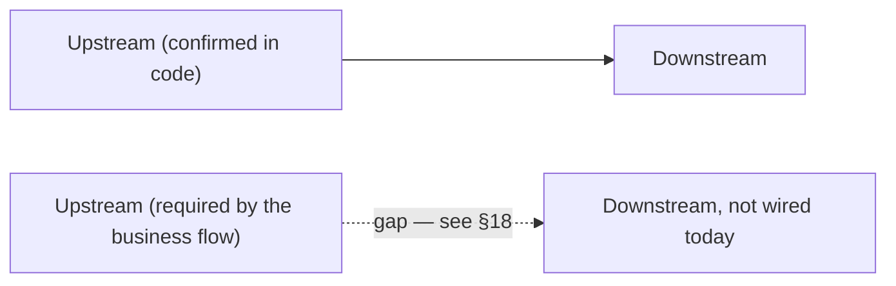

None of the diagrams below terminate inside a single department — every
chain either loops back into an earlier stage (a closed improvement loop) or
ends at a genuine business terminus (Payment, Disposal, Exit). Where the
business flow requires a connection that isn't wired in code, the arrow is
dashed and labeled with the §18 finding it corresponds to.

### Recruitment to Employee to Payroll

Was a dead end at Payroll — extended to Finance and to the rest of the
employee lifecycle (full detail in the dedicated Employee Lifecycle diagram
below).

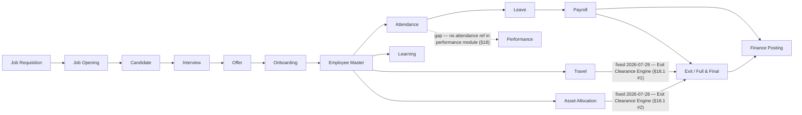

### Attendance and Leave to Payroll and Finance

Added the confirmed encashment path into Payroll, the unconfirmed Performance
link, and closed Finance into Reports instead of stopping there.

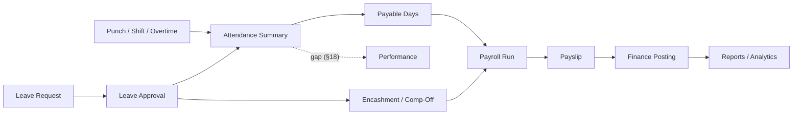

### Procurement to Inventory to Finance

Added the Vendor Health Score loop — confirmed real on the scoring side
(quality/delivery/financial inputs genuinely feed it) but confirmed **not**
consulted back at vendor selection time, so that return edge is a gap, not
the forward edges.

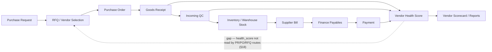

### CRM to Sales to Project to Service

Extended past "Service / Warranty" into the full post-sale loop — Warranty,
AMC, Complaint, and the return path into Engineering that closes the
improvement loop.

```mermaid
flowchart LR
    LEAD["Lead"] --> OPP["Opportunity"] --> QUOTE["Quotation"] --> SO["Sales Order"] --> PROJECT["Project"] --> PROD["Production"] --> QUAL["Quality"] --> DELIVERY["Delivery / Dispatch"] -->|"fixed 2026-07-29 — Installation Module (§18.1 #13)"| INSTALL["Installation Request<br/>(own lifecycle: engineer assignment, travel planning)"] --> COMMISSION["Commissioning"]
    SO --> RECEIVABLE["Finance Receivables"]
    COMMISSION --> WARRANTY["Warranty"] --> AMC["AMC"] --> COMPLAINT["Complaint"] --> SERVICE["Service Ticket"]
    SERVICE -.->|"gap (§18)"| ENGFB["Engineering Feedback"] --> RD["R&D"] --> ECN["ECN"] --> PROD
    AMC -.->|"gap — no invoice/receivable ref found (§18)"| RECEIVABLE
```

### Complaint to Service to Quality

The original chain stopped at a "Quality / CAPA Signal" label with no code
behind it. Extended to show the full closed improvement loop the business
brief requires, with the two confirmed-missing links marked.

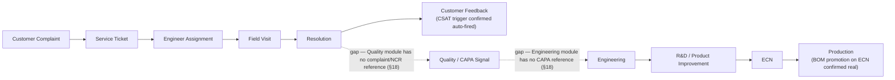

### Project Cost and Utilization

Added Travel and Asset usage against project cost, and closed Finance into
Reports.

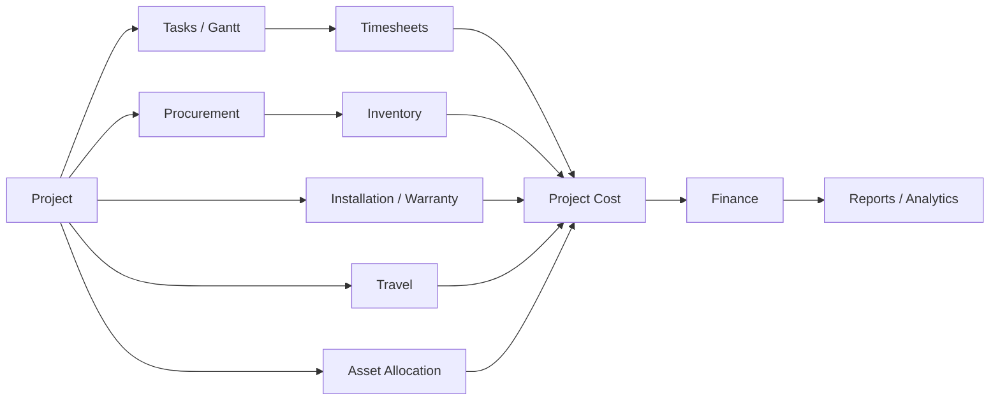

## 12. Lifecycle Diagrams

New diagrams, requested to make sure no module in the manual is a floating
department. Each ends at a genuine business terminus or loops back into an
earlier stage — never into a dead "Reports" leaf.

### Master Business Flow — the complete closed loop

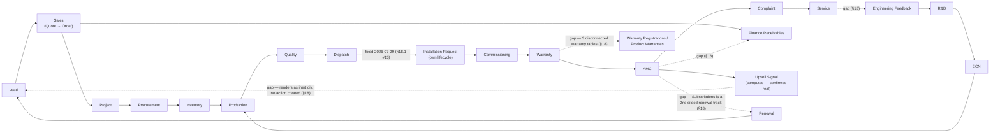

### Employee Lifecycle

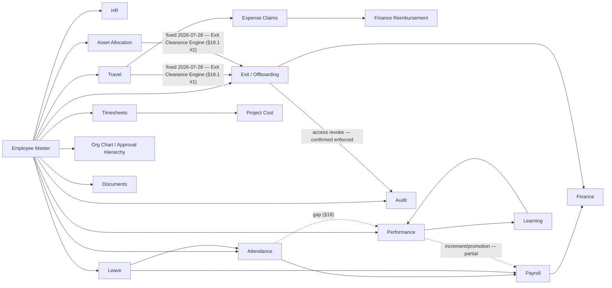

### Procurement Lifecycle

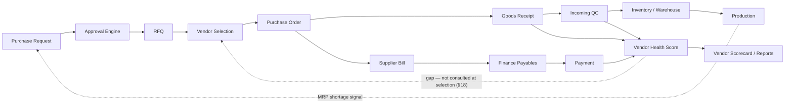

### Finance Lifecycle

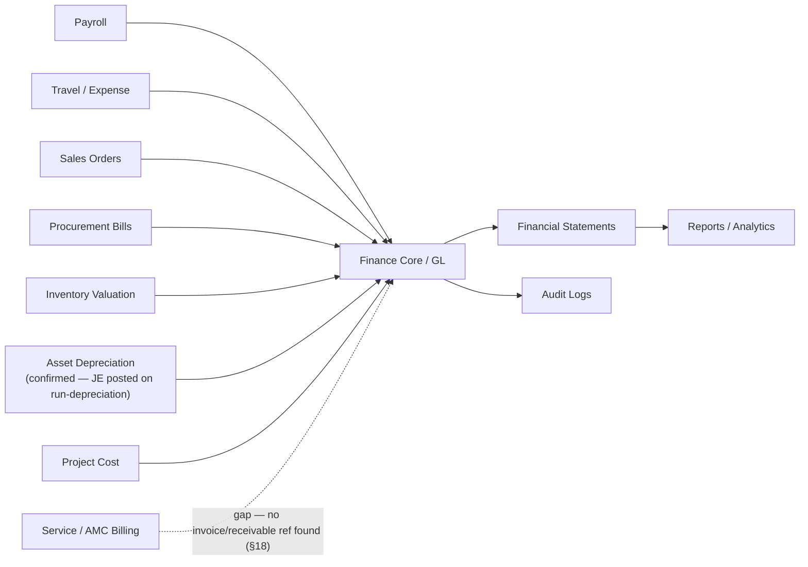

### Asset Lifecycle

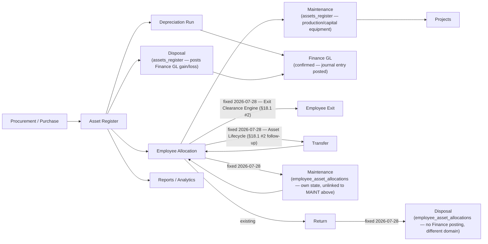

### Document Lifecycle

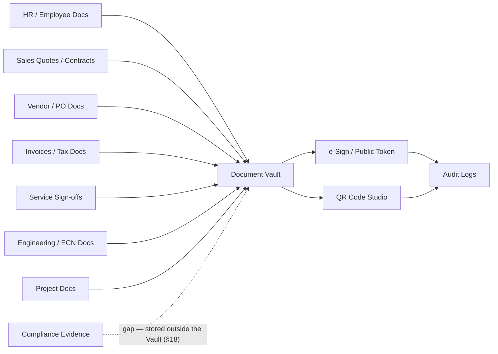

### Customer Lifecycle

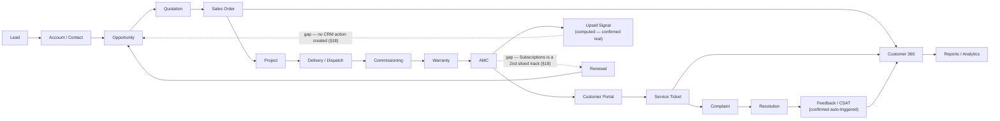

### Vendor Lifecycle

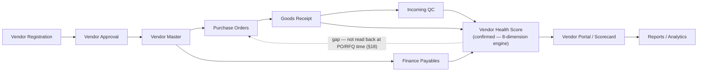

### Service Lifecycle

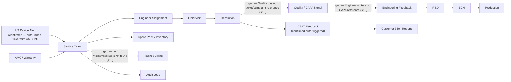

## 13. Role-Based Testing Matrix

| Role | What to verify |
|---|---|
| `super_admin` | Can see all modules and admin-only pages |
| `admin` | Can manage most app setup except super-admin-only pages |
| `employee` | Sees self-service, attendance, leaves, payslip, notifications |
| `manager` | Sees team approvals, team attendance/leaves, projects/timesheets as allowed |
| `hr` / `hr_manager` | Employee, HR, leave/attendance oversight, recruitment where allowed |
| `finance` / `finance_manager` | Finance, payroll finance, payables/receivables, reports |
| `procurement_manager` | Procurement, vendors, PR/PO approvals |
| `store_keeper` | Inventory, warehouse, stock movement |
| `production_manager` | Production, planning, shop floor |
| `qc_manager` | Quality, inspection, NCR/CAPA |
| `sales_manager` | CRM, sales, tenders, customer reports |
| `service_manager` | Service Desk, complaints, engineers, warranty |
| `project_manager` | Projects, tasks, resources, timesheets |

## 14. Per-Module Manual QA Template

```text
Module:
Page:
Role used:
Backend API observed:

Navigation:
[ ] Sidebar item visible only to correct role
[ ] Direct URL works or blocks correctly
[ ] Page title and layout are correct

Data loading:
[ ] Page loads without blank screen
[ ] API returns success
[ ] Empty state works
[ ] Error state works

Actions:
[ ] Create/Add
[ ] Edit/Update
[ ] Delete/Cancel where allowed
[ ] Approve/Reject where applicable
[ ] Upload/Download where applicable
[ ] Export/Print where applicable
[ ] Search/filter/sort/pagination

Connections:
[ ] Upstream record is selectable
[ ] Downstream record is created/updated
[ ] Status is synchronized across modules
[ ] Audit log created for important action
[ ] Notification sent if expected

Result:
Pass/Fail:
Issue ID:
Notes:
```

## 15. Quick Checklist Before Full Testing

- Backend starts without errors.
- Frontend starts without errors.
- `/api/health` returns healthy status.
- Login works for super admin.
- Login works for one normal employee.
- Sidebar renders correctly.
- Direct deep link refresh works.
- Database has seed/master data.
- File upload/download path works.
- Audit log records a test mutation.
- Notifications are visible for a test action.

## 16. Files To Open When A Module Fails

Not every page is registered in `routes.jsx`. Tenders, Fixed Assets,
Compliance, and (already known before this pass) IoT's `FleetMonitor.jsx` and
R&D's `RDHub.jsx` have no curated `NAV_ITEMS` entry — they're picked up by
`frontend/src/config/autoRouter.js`'s zero-config page scan (`FOLDER_CONFIG`
maps their feature folder to a `module` permission key) and gated through
`frontend/src/config/menuCatalog.js`'s per-role orphan-group entries instead
of the normal menu-permission path. If one of these five is "not visible,"
check `autoRouter.js`/`menuCatalog.js` first — `routes.jsx` won't show
anything wrong because the page was never meant to be there.

| Problem | First files to inspect |
|---|---|
| Page not visible | `frontend/src/components/Sidebar.jsx`, `frontend/src/config/routes.jsx`, menu permissions — **or, for Tenders/Assets/Compliance/IoT/R&D specifically, `frontend/src/config/autoRouter.js` + `menuCatalog.js`** (see note above) |
| Page visible but blank | Page component under `frontend/src/features/<module>/pages`, browser console |
| API 401/403 | `backend/server.js`, route file, `verifyToken`, `allowRoles`, `requirePermission` |
| API 404 | Backend route mount in `backend/server.js`, frontend API URL |
| Data not saving | Route controller/service, database table, request payload |
| Downstream module not updated | Source module save logic, integration/service layer, audit log |
| Wrong role access | `menuCatalog.js`, role permissions, menu permissions, route middleware |
| File not opening | Secure file route, upload path, document permissions |
| Reports mismatch | Source module query, report query, date/status filters |

## 17. Best Next Manual Testing Path

1. `super_admin login -> Settings -> Access Control -> Employees`
2. `Employee -> Attendance -> Leave -> Payroll`
3. `Purchase Request -> PO -> GRN -> Inventory -> Payables`
4. `Lead -> Opportunity -> Quote -> Sales Order -> Project`
5. `Project -> Production -> Quality -> Delivery -> Service`
6. `Complaint -> Service Ticket -> Field Visit -> Resolution`
7. `Document Sign -> Public Sign URL -> Document Vault`
8. `Create/edit/delete any record -> Audit Logs -> Notifications`

## 18. Enterprise Connection Gap Analysis

This pass reviewed the whole manual end to end looking for department-centric
dead ends — places where a business object had an upstream source but no
downstream destination (or vice versa). Everything below was checked against
live route/service code on 2026-07-27, not inferred from module names. Two
tables: first the connections that are genuinely missing or incomplete
(these are the dashed arrows throughout §2, §11, §12); second, connections
that looked like they might be diagram-only but turned out to already be
real, working closed loops — worth knowing so nobody "fixes" something that
isn't broken.

### 18.1 Missing or incomplete connections

| # | Lifecycle | Missing connection | Why it's required | Status |
|---|---|---|---|---|
| 1 | Employee | Exit / Full & Final → Travel advances | An employee can be paid out F&F while still owing (or being owed) money against an open travel advance — financial leakage and dispute risk at the exact moment the relationship ends. | **Fixed 2026-07-28 (Exit Clearance Engine).** `exit.routes.js`'s new `computeClearanceBlockers()` sums `travel_advances.amount − settled_amount` per employee and `POST /fnf/:id/pay` 409s while it's > 0. Not via the pre-existing `GET /closure-check` (`travel-reimbursement.routes.js:598`/`travel.routes.js:1162`) — that endpoint is scoped by `project_id`/`po_number`/`opportunity_id`, not `employee_id`, so it doesn't fit this need; a direct query was written instead. **Self-caught follow-up bug, same day:** the first version of this query filtered `travel_advances.employee_id = <employees.id>` directly — but that column actually stores `users.id` (`travel.routes.js`'s own `GET /advances` handler has a comment saying so, and live data confirms it: the one real row has `employee_id=5` pointing at `users.id=5`, a demo login with no `employee_id` link at all — a completely different person from `employees.id=5`). Silently would have reported every employee's advances as settled. Fixed to resolve through `users` first (mirroring the exact resolution `GET /advances` already uses for employee self-scoping), verified by inserting a throwaway advance against a real employee's user account and confirming the blocker fires, then cleaning up. |
| 2 | Employee | Exit / Full & Final → Asset return | `employee_asset_allocations` rows can sit at `status='allocated'` indefinitely after an employee is marked `left`/`terminated` — assets walk out the door untracked. | **Fixed 2026-07-28 (Exit Clearance Engine).** `computeClearanceBlockers()` also checks for `employee_asset_allocations` rows still `status != 'returned'` for the employee and blocks `/fnf/:id/pay` (409, listing the pending assets) until they're returned via `PATCH /employee-assets/:id/return`. The old `it_assets_returned` checkbox is left in place for historical notes but no longer what settlement checks — same closure pattern the sibling `access_revoked` checkbox already had. Also added: Finance/Manager/HR NOC sign-offs (`noc_finance`/`noc_manager`/`noc_hr`) are now hard blockers on the same endpoint too (previously advisory-only), with `finance_noc_by`/`manager_noc_by`/`hr_noc_by` recording who granted each (new migration `20260728000003_exit_clearance_noc_audit.js`). New `GET /exit/clearance/:employee_id/status` powers a live "Clearance Status" panel in `ExitManagement.jsx`'s Clearance Tracker tab and F&F tab. **Same-day follow-up: built the rest of Priority-1's Asset Lifecycle** (`employee-assets.routes.js` gained `POST /:id/transfer`, `POST /:id/maintenance` + `/maintenance/complete`, `PATCH /:id/dispose`; migration `20260728000005_employee_asset_lifecycle.js`) — `status='under_maintenance'` still blocks exit (asset hasn't left custody), `status='disposed'` doesn't (written off, nobody's outstanding responsibility — `computeClearanceBlockers()`'s query updated accordingly). This is a separate, self-contained lifecycle from `assets_register`'s Maintenance/Disposal (capitalized-equipment side, posts Finance GL) — no attempt made to merge the two, consistent with [[project_unified_asset_management]]'s existing "3 unlinked silos, deliberately not merged" call. Live-tested the full chain (allocate→transfer→maintenance→complete→return→dispose, plus both guard rails: can't transfer mid-maintenance, can't dispose twice) end-to-end via real HTTP calls, then cleaned up. |
| 3 | Employee | Travel/Expense approval → Reporting hierarchy | Approval should follow the requester's actual manager, not "any user with the manager role," or approval integrity is meaningless. | **Fixed 2026-07-28 (Travel Approval Hierarchy).** New shared `travelApprovalAuthz.js` (`authorizeManagerApproval()`) replaces the role-only gate on all 3 reachable approval surfaces: `PUT /travel/requests/:id/status` (the one the Travel Approvals screen actually calls — `travel.routes.js:1097`'s multi-level `/level-approve` was fixed too but confirmed **not wired to any frontend page**, so it wasn't the live exploit path), `PUT /travel/advances/:id/manager-review`, and `PUT /reimbursement/claims/:id/manager-approve`. Model: reporting manager (`employees.reporting_manager_id` match) → delegate (new `delegate_approver_id` column, settable only by whoever is already authorized, via new `POST .../delegate` endpoints on all 3) → HR override (`hr`/`hr_manager`/`hr_exec`, any employee) → admin override (`admin`/`super_admin`, any employee) — matches Priority-1's exact ordering. Live-tested end-to-end: an active non-manager account that wasn't the requester's RM got 403'd, then the requester's actual reporting manager — whose account's system role is plain `employee`, not `manager` — was correctly allowed, something the *old* role gate could never have permitted either. **Self-caught bug found mid-fix:** `travel_advances.employee_id` stores `users.id`, not `employees.id` (an existing code comment says so); the manager-review fix resolves the real `employees.id` via the parent `travel_requests.employee_id` instead, falling back to translating through `users` only if that's unavailable. **Deliberately not done:** Levels 2/3 of the (unused) multi-level flow stay role-gated — no per-employee "Department Head" identity exists in the schema to check against; `GET /travel/approvals`' listing still shows every pending request to any manager/HR/admin regardless of whether they're actually authorized to act on it (the Approve/Reject buttons now correctly 403 via the existing generic error-toast in `TravelApprovals.jsx`, but the list itself isn't filtered down to "your queue" — a real follow-up, same proportionality call as other flagged-not-fixed items in this section). |
| 4 | Employee | Attendance → Performance | Punctuality/overtime pattern is a standard review input in most HR systems; without it, Performance reviews are blind to attendance discipline. | **Diagram-only gap.** `backend/src/modules/performance` has no reference to attendance data at all — never built, not a regression. |
| 5 | Procurement / Vendor | Vendor Health Score → PR/PO/RFQ vendor selection | A vendor scored "Critical" or "Watchlist" should influence — or at least warn during — the next PO to that vendor, or the scorecard is just a report nobody acts on. | **Code gap, partial.** The score itself is real and well-built (`vendorHealthEngine.js`, 8 weighted dimensions from real GRN/NCR/CAPA/financial data). But `health_score`/`health_status` is never read back inside any PR/PO/RFQ route — the loop computes but doesn't close. |
| 6 | Customer / Service | Commissioning warranty activation → Warranty visibility | A warranty that doesn't surface anywhere can't be renewed, escalated, or honored correctly. | **Fixed 2026-07-28 (Unified Warranty Engine).** The three real sources were `customer_equipment.warranty_status` (Commissioning/Customer Portal), `project_warranties` (Projects module, its own full CRUD + `WarrantyManagement.jsx`), and `warranty_registrations` (+`warranty_claims`) (Operations/Lifecycle module, its own full CRUD + claims workflow + `WarrantyManagement.jsx` — a *second*, differently-named page with the same name in a different feature folder). `product_warranties`, cited in an earlier pass of this manual, **does not exist in the live schema** — always re-verify table names against `information_schema.columns` before trusting a prior citation. All three tables were confirmed **empty (0 rows)** before this fix — zero data-migration risk, the safest possible time to do this.<br><br>**Design:** `warranty_registrations` designated the canonical engine (most feature-complete — already had a claims workflow and coverage flags). Migrations `20260728000006/7/8` added `project_id`/`commissioning_workflow_id`/`equipment_id`/`amc_contract_id` link columns plus `warranty_months`/`exclusions`/`coverage_description`/`manufacturer_warranty_months`/`extended_warranty_months` (fields the Projects UI already collected that `project_warranties` was missing one of — `coverage_description` — a live 500-on-edit bug, never triggered since the table was always empty). `project_warranties` is left in place, unused, rather than dropped — a table sitting empty is reversible, dropping one isn't.<br><br>**Rewired:** `commissioning.routes.js`'s `activate-warranty` now upserts a real `warranty_registrations` row (idempotent per `commissioning_workflow_id`) alongside keeping `customer_equipment.warranty_status/warranty_expiry` in sync (kept as a read-cache for the Customer Portal's 5+ call sites reading it directly — not worth rewriting all of those for this pass). `projects.routes.js`'s 3 warranty endpoints (`GET/POST /projects/:id/warranties`, `GET /warranties`, `PUT /warranties/:id`) now read/write `warranty_registrations` filtered by `project_id`, with column names aliased to match `WarrantyManagement.jsx`'s existing contract exactly — **zero frontend changes needed**. `customer360.routes.js`'s warranty query (already correctly pointed at `warranty_registrations` via `sales_order_id` from an earlier pass) gained a second join path via `equipment_id → customer_equipment.crm_account_id → accounts.party_id` (the same bridge Priority 2's upsell-to-opportunity fix uses) so commissioning-sourced warranties — which carry `equipment_id`, not `sales_order_id` — now show up there too. AMC contract detail (`GET /lifecycle/amc-contracts/:id`) gained a `LEFT JOIN LATERAL` surfacing the linked warranty's end date/status.<br><br>**Bugs caught by live-testing before they shipped:** the first version of the commissioning/projects INSERTs referenced `warranty_months` and `exclusions` columns that turned out not to exist on `warranty_registrations` (those were `project_warranties`-only columns I'd conflated) — both fixed with two small follow-up migrations. Separately, the Projects `PUT`/`POST` handlers' `RETURNING wr.id, wr.project_id, ...` (reusing the same aliased column list as the `SELECT ... FROM warranty_registrations wr` queries) failed with `missing FROM-clause entry for table "wr"` — an UPDATE/INSERT has no implicit alias the way a SELECT's FROM clause does; fixed by explicitly aliasing the target table (`UPDATE warranty_registrations AS wr SET ...` / `INSERT INTO warranty_registrations AS wr (...) ... RETURNING wr.id`). Full chain (commissioning → engine row → Customer 360 → Projects CRUD → AMC linkage → idempotency) live-tested end-to-end via real HTTP calls, not assumed from reading the code. |
| 7 | Customer / Sales | AMC / CEO Intelligence → CRM Opportunity (Upsell) | An AI-computed upsell signal that nobody can click on is exactly the "Reports as a standalone module" anti-pattern the enterprise-centric review is meant to eliminate. | **Fixed 2026-07-28 (Priority 2/4 — Intelligence-to-Workflow).** New `POST /ceo-intelligence/customers/:partyId/convert-upsell`: resolves (or opportunistically creates) the `accounts` row bridging the Finance `parties` customer to CRM — `accounts.party_id` is a real schema link but was 100% unpopulated in practice (same "empty in practice" pattern as `vendors.party_id`); creates a real `opportunities` row (Assign Salesperson: the account's existing owner if known, else the acting user — no reliable territory/round-robin signal exists for an AI-detected upsell the way it does for inbound leads); populates the opportunity's own `next_step`/`follow_up_date` columns as the "Create Task" step rather than inventing a parallel task system; notifies admin/super_admin/sales_manager/manager roles (Notify Sales Manager); is idempotent (409s on a second attempt while one's still open) so "Track Conversion" is just the opportunity's own normal Kanban/stage lifecycle — no separate tracking needed. `CEOIntelligenceDashboard.jsx`'s `CustomerGrowthView` — the only place this signal was ever rendered — turned the plain label into a real button with loading/success/error states. Live-tested end-to-end (create → verify → duplicate-blocked → cleanup) against a real customer with no prior CRM account; the account got created fresh with `party_id` correctly bridged, a genuine permanent improvement left in place (not test data). |
| 8 | Customer / Sales | AMC ↔ Subscriptions (Renewal) | Two separate renewal mechanisms for the same business concept means revenue can lapse silently on whichever track isn't being watched. | **Fixed 2026-07-29 (Renewal Engine, Priority 5).** AMC and Subscriptions are legitimately different commercial products (service contract vs. SaaS-style recurring billing) — unlike Warranty's 3-way split, forcing them into one table would conflate unrelated concepts, so they stay separate tables but now share the same **Reminder → Approval → Payment → Renewal** shape via a new shared gate, `shared/renewalApproval.js`.<br><br>**Reminder:** new `jobs/subscriptionRenewal.cron.js` (daily 09:15, mirrors `amcRenewal.cron.js`'s pattern) — `subscriptions` had **zero cron jobs**, confirmed live: all 3 real rows in the database had `next_billing_date` already in the past with nothing ever having acted on them. Dedups on message text for the day rather than `reference_id`, since `notifications.reference_id` is `integer` and `subscriptions.id` is `uuid`.<br><br>**Approval:** both `PATCH /sales/subscriptions/:id/renew` and `POST /lifecycle/amc-contracts/:id/renew` now require an `admin`/`super_admin`/`finance`/`finance_manager` role (via `hasRole()`, many-to-many-safe) for renewals above `RENEWAL_APPROVAL_THRESHOLD` (₹2,00,000 default, env-configurable) — neither endpoint had **any** role check before this.<br><br>**Payment:** both now create a real `invoices` row via `invoiceService.createInvoice()` (the same GL-posting path Sales Order/Project invoicing already use) before applying the renewal — if invoicing fails (e.g. credit limit exceeded), the renewal itself does **not** silently proceed, matching the lesson from the Sales-Order-dispatch fix elsewhere in this file (swallowing an invoicing failure while still marking the parent renewed is worse than not automating it). AMC resolves its customer via `sales_order_id → sales_orders.customer_id` (same link `customer360.routes.js` already uses for this table); Subscriptions has its own `customer_id` directly.<br><br>**Renewal:** Subscriptions' `/renew` used to just flip `status` back to `'active'` with no date advance at all — now genuinely advances `next_billing_date` by one real billing cycle. AMC's `/renew` was already the more mature of the two (real `amc_renewal_history`, `renewal_count`, `next_renewal_date`) and needed only the Approval+Payment additions.<br><br>**Live-tested end-to-end** with real credit-limit interaction, not mocked: a renewal against a customer already at their credit limit correctly 422'd without mutating the subscription/contract; the same renewal against a customer with headroom succeeded with a real invoice ID; the approval threshold correctly 403'd a non-finance role and passed for admin. **Found but explicitly not fixed** (different gap, flagged for a future pass): AMC's separate `POST /amc-contracts/:id/generate-invoice` button (periodic in-term billing, a different concept from renewal) has never created a real `invoices` row — it returns a computed object with `status:'draft'` that's never persisted anywhere Finance can see. |
| 9 | Service / Quality | Complaints → Quality NCR/CAPA signal | Repeated complaints against the same product/component are a standard CAPA trigger in any QMS (ISO 9001-style) — without this link, Quality never sees the voice-of-customer failure pattern. | **Diagram-only gap — the manual itself previously claimed this connection existed.** `backend/src/modules/quality` has zero references to `complaint`, `ncr`-from-complaint, or any complaint-linked ID. |
| 10 | Service / Engineering | Service/Quality CAPA → Engineering → R&D → ECN | This is the closed improvement loop the whole business brief is built around (Production → Service → Engineering Feedback → R&D → ECN → Production). Without the entry point, the loop never closes. | **Code gap.** `backend/src/modules/engineering` has zero references to `capa`, `ncr`, or `complaint`. By contrast, the *other half* of this loop — ECN → Production — is real and confirmed (see §18.2 #3): once an ECN exists, it does reach Production. It just never gets triggered by a quality/service signal automatically. |
| 11 | Service / Finance | Service Ticket / AMC → Finance receivables | Service and AMC revenue needs to hit the books like every other revenue stream, or Finance's "receives transactions from Service" connection (as claimed in §7) is aspirational. | **Not confirmed in code.** No route file under `backend/src/modules/servicedesk` references `invoice`, `receivable`, or `finance`. |
| 12 | Documents / Compliance | Compliance evidence → Document Vault | Compliance evidence (`compliance_standards`/`compliance_evidence`/`compliance_audits`) should get the same permission model and audit trail as every other stored document, or it's a second, ungoverned file store. | **Minor code gap.** `backend/src/modules/documents` has no reference to `compliance`; the compliance module appears to manage its own evidence files independently. |
| 13 | Sales / Projects | "Installation" as a distinct lifecycle step | The business brief (and Projects' own lifecycle list: FAT/SAT/AMC/Warranty) names Installation as a stage between Dispatch and Commissioning. | **Fixed 2026-07-29 (Priority 6 — Installation as a First-Class Module).** New `installation_requests` table + `installation.routes.js` (mounted `/installation-requests`) gives Installation its own lifecycle: **Dispatch → Installation Request → Engineer Assignment → Travel Planning → Installation → Commissioning → Customer Acceptance**. Deliberately links to, rather than duplicates, existing systems — Travel Planning creates a real row in `travel_requests` (not a bespoke date field), and completing an installation auto-creates a real `commissioning_workflows` row via a new exported `createCommissioningWorkflow()` helper (extracted from `commissioning.routes.js`'s own POST handler so both flows share one seeding path for the default checklist/readings, not two copies). Auto-creates on Sales-Order dispatch (`PUT /orders/:id/dispatch`) when a project is resolvable via `lifecycle_instances` — the same bridge `autoBootstrapLifecycleOnOrderAccept` already sets up — and is idempotent (a DB partial-unique-index on `sales_order_id` prevents a re-dispatch from creating a duplicate active request, not just an application-level check). `InstallationDashboard.jsx` (a project-geography map) is correctly left alone — new page is `InstallationRequests.jsx`, added to Service Desk's nav. **Found and fixed a real, previously-undiscovered bug while wiring the Dispatch trigger**: `sales_orders.dispatched_at`/`delivered_at` are referenced by the dispatch route and several read-side analytics queries, but don't exist on the live table — the migration that was supposed to add them (`20260609000010`, dated 2026-06-11) shows `[applied]` in the ledger, yet `information_schema` confirms the columns were never actually there. Root cause not fully diagnosed (this project has hit ledger/live-schema drift of this kind before), but the practical effect was severe: **every real call to `PUT /orders/:id/dispatch` 500'd**, meaning Dispatch itself — the very first link in this whole chain, and a core Sales Order action independent of Installation — has likely been broken in practice. Fixed with a new additive migration (`20260729000002`) rather than fighting the ledger. Full chain live-tested end-to-end via real HTTP calls (dispatch → auto-created request → assign → travel → start → complete → auto-created commissioning → customer acceptance), including the dispatch-idempotency check, then cleaned up. |
| 14 | Inventory / Logistics | Logistics/Shipments has no permission module | Every other orphan-routed page (Tenders, Fixed Assets, Compliance, IoT, R&D) has an explicit `module` key in `autoRouter.js`'s `FOLDER_CONFIG` and matching `menuCatalog.js` entries gating who can reach it; Logistics doesn't, which likely means broader-than-intended access rather than a deliberate open policy. | **Code gap — found this pass.** `FOLDER_CONFIG.logistics` in `frontend/src/config/autoRouter.js` has no `module` key, and `menuCatalog.js` has zero references to `logistics`. Worth confirming which roles can actually load `LogisticsShipping.jsx` today. |
| 15 | Vendor / Customer (external stakeholders) | Anonymous external user → Vendor/Customer portal entry point | Both portals exist specifically so an outside party (a prospective vendor, an existing customer) never needs an internal ERP login — if the SPA's own router redirects them to the staff login page before the portal component ever mounts, the entire "external self-service" design point is void regardless of how well-built the component underneath is. | **Fixed 2026-07-29.** `frontend/src/App.jsx`'s router special-cased only 4 paths (`/login`, `/ForcePasswordChange`, `/sign/:token`, `/SetupWizard`) to render without an ERP session; every other path — including `/VendorRegistration` and `/CustomerPortalDashboard` — fell through to the catch-all `/:page?`, which hard-redirects to `/login` whenever `isLoggedIn` is false, before `Layout`/`ROUTES` are ever consulted. `routes.jsx`'s `VendorRegistration` entry carries a `public: true` flag that nothing in the frontend ever reads (confirmed via project-wide grep for `.public`) — dead metadata, not an actual bypass. Both target components were already correctly built and already correctly wired to genuinely public backend routes (`vendor-registration.routes.js`'s `/submit`+OTP flow; `customer-portal.routes.js`'s `/auth/login` issuing a separate `type:'customer_portal'` JWT) — the only missing piece was the SPA-level route. Fixed by adding both as explicit top-level `<Route>` entries in `App.jsx`, mirroring the existing `/sign/:token` pattern (lazy-loaded, `Suspense`-wrapped, before the catch-all). Neither page has ever had an internal link pointing at it (grepped both component names project-wide, zero matches), so this was pure dead-on-arrival, not a regression of something that used to work — meaning neither flow was ever reachable by an actual outside vendor or customer since being built. Browser-verified with Playwright in a fresh cookie-less context: both pages now render correctly for an anonymous visitor (7-step wizard; email/password sign-in), and a regression check confirmed arbitrary unmatched paths (`/`, `/SomeRandomPage`) still correctly redirect to `/login` — the fix is scoped to exactly these two paths. **Flagged, not fixed — a product decision, not a wiring gap:** `CustomerPortalDashboard.jsx`'s login form has no company-selector field; `company_id` is silently sourced from an optional `?company=` query param (defaulting to `1`), so in a genuinely multi-tenant deployment a customer of company 2+ hitting the bare URL would transparently be checked against company 1's `customer_portal_users` table. Needs a decision (subdomain-per-company? invite link with embedded `company_id`? name/GSTIN lookup step?) before it's fixable. |

### 18.2 Connections that looked missing but are already real, working closed loops

Confirmed by reading the actual route/service code, not assumed from naming:

1. **IoT → Service Ticket → AMC.** `iot/alertActions.js`'s `createServiceTicket()` auto-raises a `support_tickets` row (`ticket_kind='service'`, category `Breakdown`) the instant a critical device alert fires, carrying the device's project, serial number, and `amc_contract_id`. Shared by both the live ingest path and the monitor cron, and idempotent (won't flood tickets on repeat breaches). This is a genuine closed loop, not a diagram aspiration.
2. **Vendor Health Score inputs.** `vendorHealthEngine.js` computes an 8-dimension score (quality, delivery, cost, support, compliance, financial, dependency, risk events) with quality weighted directly from NCR/CAPA/rejection data and delivery weighted from GRN on-time data. Quality and Procurement genuinely feed the score — only the *return* path (score back into vendor selection, #5 above) is missing.
3. **Engineering ECN → Production BOM.** `ecn.routes.js`'s implement step promotes any draft BOM version created under that ECN to `active` and retires the prior version, in the same transaction, with an audit event (`bom_promoted`). ECN approval genuinely changes what Production builds next.
4. **Asset Depreciation → Finance GL.** `assets.routes.js`'s `POST /run-depreciation` writes `asset_depreciation_log` **and** posts a real journal entry (debit Depreciation Expense / credit Accumulated Depreciation) in the same request.
5. **Approval Engine → Notifications → Audit Logs.** Every approve/reject/escalate/delegate action in `approvals.controller.js` calls `logAudit(...)` (12 call sites) and separately fires a notification — this three-step chain from the business brief's Approvals example is already closed.
6. **Customer Portal → Service Tickets.** Portal-raised tickets land in the same `support_tickets` table service engineers work from — confirmed in both `customer-portal.routes.js` and `servicedesk.routes.js`.
7. **Ticket resolution → CSAT feedback request.** `servicedesk.routes.js:604-611` auto-fires a feedback notification the instant a ticket transitions to resolved/closed — genuinely automatic, not dependent on an agent remembering to ask.
8. **Marketing campaigns → CRM leads.** `crm.routes.js` references `campaign_id` directly — attribution is real, not aspirational.
9. **Recruitment → Employee → Attendance → Leave → Payroll and CRM → Quotation → Sales Order → Dispatch → Production (quality stop-ship hold).** Both already independently verified and scored in the prior Enterprise Workflow Audit (84/100 and 83/100→90/100 respectively) and re-spot-checked 2026-07-27 — still hold.

### 18.3 What this pass did not change

Per the scope of this review: no module was added, redesigned, or removed,
and no application code was touched. Everything above is a documentation
change to this manual — making existing connections visible where they were
real but undrawn, and making missing connections visible where the manual
previously implied a link the code doesn't back up. Items in §18.1 are
recommended follow-up engineering work, not something this pass fixed.

## 19. Automation Opportunities Pass (2026-07-29)

A separate 12-item backlog was handed over verbatim from a prior automation
audit, framed as "fits that already exist in the architecture — no redesign,
just finishing the wiring." Each item was re-verified against live code
before touching anything (per this manual's own standing rule — audits go
stale fast in this codebase, see `AUTOMATION_OPPORTUNITY_AUDIT.md`'s own
superseded "cheapest fix" claim as a prior example). Result: **11 of 12 were
already fully wired** by the time this pass ran — evidently implemented in
an earlier, uncommitted stretch of work on this same backlog before this
verification pass began. Only one (#6 below) is a genuine, deliberate
partial. Nothing in this section required new code; this section exists
because the standing rule requires an architecture-impact note even when the
finding is "already done," so the next pass doesn't re-attempt closed work.

| # | Item | Status | Evidence |
|---|---|---|---|
| 1 | Collapse the dual ledger (Finance) | **Done — opposite direction from the audit's suggestion.** The audit proposed pointing Trial Balance/P&L/Balance Sheet at `journal_entry_lines`. Live code shows the actual fix went the other way: `journal.repository.js`'s header comment records that two child ledgers existed (`journal_entry_lines`, minimal, written by auto-posting services; `journal_lines`, richer, already read by Trial Balance/P&L/Balance Sheet) and the repository now writes and reads `journal_lines` exclusively. `journal_entry_lines` is dead — grepped project-wide, the only remaining reference is that historical comment. | `backend/src/modules/finance/repositories/journal.repository.js:1-118` (see `getTrialBalance`, `getGeneralLedger`) |
| 2 | Call the existing payroll-GL endpoint (Payroll→Finance) | **Done — via direct service import, not the HTTP endpoint.** Payroll approval imports `postPayrollJournal` from `payrollJournal.service.js` directly rather than calling `POST /finance/accounting/payroll-journal` over HTTP — avoids an unnecessary internal round-trip, same effect. Best-effort/non-blocking: a GL posting failure doesn't undo the already-committed payroll approval. | `backend/src/modules/payroll/payroll.routes.js:139-153` |
| 3 | Real Sales Order→Production (Sales→Production) | **Done.** `autoBootstrapLifecycleOnOrderAccept` now calls the real `createProductionOrderFromSalesOrder` (previously written but only reachable via an endpoint the frontend never called) instead of stopping at the project-stub bootstrap, with best-effort BOM matching by product name so a matched BOM also seeds `production_operations`. | `backend/src/modules/sales/routes/sales.routes.js:15,108-137` calling `backend/src/modules/operations/lifecycle.routes.js`'s exported `createProductionOrderFromSalesOrder` |
| 4 | Route Sales-Order/Project invoices through `invoice.service.js` (Sales & Projects→Finance) | **Done — predates this backlog entirely.** Both call sites already route through `invoiceService.createInvoice`, per an in-code comment dated "2026-07-21 dual-ledger fix." Confirmed present at `HEAD` (not part of any uncommitted change). | `backend/src/modules/sales/routes/sales.routes.js:699-732`, `backend/src/modules/projects/routes/projects.routes.js:552-575` |
| 5 | Dual-write production consumption to `stock_ledger` (Production→Inventory) | **Done — predates this backlog entirely.** `backflushMaterials()` and `receiveFG()` already call the shared `postStock()` (the same helper subcontracting uses), confirmed present at `HEAD`. | `backend/src/modules/production/execution.routes.js` (`backflushMaterials`, `receiveFG`) |
| 6 | Auto-create/remind AMC contracts (Service) | **Deliberately partial — notify, don't auto-create.** `activateWarranty()` sets `amc_eligible=true` and now notifies admin/manager/service/sales roles ("AMC-Eligible — Set Up Contract") — the "remind" half. It does **not** auto-draft an `amc_contracts` row: the in-code reasoning is that pricing/SLA terms are a business decision the system has no basis for, and fabricating them into a real contract row is worse than requiring a human to use the existing `POST /lifecycle/amc-contracts` flow. This mirrors the same proportionality call already made elsewhere in this manual (§18.1 #15's flagged-not-fixed company-selector gap). **Open follow-up if the business wants full auto-creation**: would need a pricing/SLA default source (e.g. a rate card keyed by product/customer tier) before a draft row could be trusted — flagging rather than guessing. | `backend/src/modules/servicedesk/routes/commissioning.routes.js:447-551` (`activateWarranty`) |
| 7 | Fix the timesheet table reference (Projects) | **Done.** `GET /timesheets/my-timesheet` now joins `project_members` (`role_in_project`) instead of the dropped `project_team_members` — restores a page that previously always showed "no project assignments." | `backend/src/modules/timesheets/routes/timesheets.routes.js:22-41` |
| 8 | Auto-sync opportunity stage on conversion (CRM→Sales) | **Done.** Quotation→Sales-Order conversion now flips the source `opportunities.stage` to `Won` (`closed_date`, `probability_percentage=100`) in the same transaction, guarded so an already-Won/Lost opportunity isn't overwritten. | `backend/src/modules/sales/routes/sales.routes.js:442-454` |
| 9 | Persist Field Visit fields (Service) | **Done.** `PUT /servicedesk/field-visits/:id` now accepts and persists `completed_at`, `work_done`, `parts_used`, `labour_hours`, `travel_km`, `cost`, `start_time_actual`, `end_time_actual`, `customer_signature` — previously silently discarded. Parts-used consumption is also now posted through `postStock()` against real `inventory_items` (net-quantity-change per `part_id`), not left as free-text JSON invisible to stock. | `backend/src/modules/servicedesk/routes/servicedesk.routes.js:858-` (PUT handler + parts-used stock posting immediately after) |
| 10 | Populate `project_scurve_data` on a schedule (Projects) | **Done — predates this backlog entirely.** `scurveSnapshot.cron.js` runs daily at 02:00, upserting one row per project per calendar month from `project_cost_summary`'s existing EVM figures plus a linear time-elapsed planned-progress baseline. Registered in `server.js`. Confirmed present at `HEAD`. | `backend/src/jobs/scurveSnapshot.cron.js`, registered `backend/server.js:234,879` |
| 11 | Generate production operations from MRP conversions (Plan to Produce) | **Done — predates this backlog entirely.** Both `POST /mrp/planned-orders/:id/convert` (single) and `/convert-all` (bulk) call `copyRoutingToProductionOperations()` for `make`-type planned orders, so MRP-sourced production orders get a real operations/routing seed instead of being shop-floor dead ends. Confirmed present at `HEAD`. | `backend/src/modules/production/mrp.routes.js:194,239` |
| 12 | Auto-generate the reorder-driven Purchase Request feed (Inventory→Procurement) | **Done.** The reorder-breach check that already raises a `low_stock` alert now also writes a real `purchase_suggestions` row (idempotent — skipped if a pending suggestion already exists for that item/warehouse), with a priority derived from how far below reorder level the stock has fallen. Previously a fully-built, fully-dead UI (`StockAlertsAndSuggestions.jsx`) with nothing ever populating a row. | `backend/src/services/stockAlerts.js:45-69` |

**Architecture impact of this pass**: none — every fix reuses an existing
table, service, or helper already documented elsewhere in this manual
(`postStock`, `invoiceService.createInvoice`, `createProductionOrderFromSalesOrder`,
`copyRoutingToProductionOperations`, `journal_lines`). No new tables, no new
cross-module coupling beyond what §2/§11/§12's diagrams already draw. Item 6
is the one place a future pass could add real architecture (a rate-card
source feeding AMC contract defaults) rather than just verification.

## 20. Home Dashboard → Per-Role Department Dashboard Embed (2026-07-30, REVERTED 2026-08-04)

A cross-role UX audit (the "Role Experience Audit" — see project memory, not committed to this
repo) flagged that `Home.jsx` landed 25 of 26 roles on the same generic company-wide widget grid
(Open Tasks/Approvals/Announcements/Policies/Brand Vault/Celebrations) instead of the domain
dashboard each role actually needed to start their day with. A `ROLE_DASHBOARD` map was built
covering 22 roles, embedding each role's existing sidebar-landing dashboard (HRDashboard,
FinanceDashboard, ProjectsDashboard, SalesCommandCenter, etc.) in place of the generic grid on
Home, reusing existing components with no new pages built.

**Reverted 2026-08-04 on explicit user instruction:** "home screen should be same for all the
roles and employees as there only they will get the necessary docs and celebrations etc." The
department-dashboard embed meant ~22 of 26 roles never actually saw the Policies/Brand
Vault/Celebrations panels that are Home's whole point — their Home was silently swapped for a
different page's content instead. Removed `ROLE_DASHBOARD`, `ROLE_DASHBOARD_NEEDS_SETPAGE`, the
`DeptDashboard` conditional rendering branch, the `hm-root--dept` CSS modifier, and reverted
`HomeBusinessPulse`'s gate back to plain `canSeeFinancials` (from `canSeeFinancials &&
!DeptDashboard`) in `frontend/src/pages/Home.jsx` and `Home.css`. Every role now renders the same
6-slot generic grid; per-role dashboards remain reachable exactly as before via their own sidebar
entries/routes — nothing about those pages themselves changed. Hero KPI content (attendance ring
vs. personal task/approval counters) still differs by employee-vs-management, as it did before
this feature existed — that split was never part of what got reverted.

## 21. Discount-Approval Gate at Quotation → Sales Order (2026-07-30)

The Lead-to-Cash Enterprise Workflow Audit had repeatedly flagged one standing, deliberately-deferred
gap across 7+ passes: no approval gate between Quotation and Sales Order for discounted quotations,
because `discount_approvals` had no FK to a quotation (only loose `lead_id`/`order_id`). Picking this
item up surfaced a deeper root cause and three unrelated, previously-undiscovered live bugs — found
only because this was the first time anyone actually drove the full request→approve→convert cycle
against a real Postgres instance rather than re-reading the code shape.

**Root cause was bigger than "no FK": quotations never persisted a discount at all.**
`Quotations.jsx`'s builder already has a header "Discount %" field, computed into `subtotal`/`total_amount`
client-side and sent to the backend as `discount`, but `quotations` had no matching column —
`quotationsRepository.create()` never destructured it, so the number was silently dropped on every
save. Added `quotations.discount_pct` (migration `20260729000003_discount_approval_gate.js`, same
migration also adds `discount_approvals.quotation_id UUID→INTEGER REFERENCES quotations(id)`); the
frontend now sends it explicitly as `discount_pct` instead of the unmapped `discount` key.

**The gate itself reuses two already-built-but-disconnected systems rather than inventing new ones**
(same "check for existing infrastructure before building" discipline as the GRN quality-gate fix
elsewhere in this file): `discount_rules.requires_approval`/`approval_threshold_pct` (a real per-rule
policy already configurable from `PricingEngine.jsx`'s Discount Rules tab, never read anywhere) and
`discount_approvals`'s full request/pending/approved/rejected workflow with its own live UI
(`PricingEngine.jsx`'s Approvals tab, `PUT /pricing/discount-approvals/:id`) that nothing had ever
triggered. New `checkDiscountApprovalGate()` in `sales.routes.js`: if a quotation's `discount_pct`
meets or exceeds the lowest `approval_threshold_pct` among the company's active
`requires_approval=true` rules, it auto-creates a pending `discount_approvals` row (mirrors the
credit-check gate's auto-detecting style — no separate "request approval" click required) and blocks
with 409; a pending or rejected request keeps blocking; an approved one clears it. Wired into **all
three** live quotation→order conversion endpoints (`PATCH /quotations/:id/accept-and-convert`,
`PATCH /quotations/:id/convert-to-order`, `POST /orders/from-quotation/:quotationId`) — the second of
those had neither this gate nor the pre-existing credit-check gate at all until now, despite being a
real, reachable button (`Quotations.jsx`'s "Convert to Sales Order" for `accepted`-status quotations).
Also added `requirePermission('sales','approve')` to the approve/reject endpoint, previously
unguarded — `role_permissions` already seeds `sales_manager: can_approve=true` /
`sales_exec: can_approve=false` for the `sales` module (the role's own seed description says "full
access including pricing approval" / "no pricing approval"), it just was never enforced on this route.

**Three unrelated, previously-undiscovered live bugs found while verifying end-to-end, all fixed:**
1. **`credit_limits.customer_id` was a legacy `integer`, never migrated to match `parties.id` (uuid)** —
   every quotation-to-order conversion gate's credit-check (`SELECT ... FROM credit_limits WHERE
   customer_id=$1`, passing a real uuid) has been throwing `invalid input syntax for type integer`
   unconditionally on every quotation with a real customer attached, silently caught and reported as a
   generic 500. `finance/routes/extended.routes.js`'s own `GET /credit-limits` already joined
   `cl.customer_id = p.id` against `parties`, confirming uuid was always the intended type. Fixed via
   direct `ALTER COLUMN ... TYPE uuid` (migration `20260730000001`) — safe as a straight type change,
   not an additive bridge column, since the table had 0 live rows and neither of its write endpoints
   has any frontend caller anywhere in the app.
2. **`quotation_items` never got the columns `quotationsRepository.addItem()`/`getItems()` actually
   use** (`item_description`/`rate`/`tax_percentage`/`tax_amount`/`total`) — `POST
   /quotations/:id/items` 500'd on every real call. Root cause: migration `20260609000001` (June 9)
   tried to ALTER these onto `quotation_items`, but the table wasn't `CREATE TABLE`'d until migration
   `20260620000002` (June 20) — a migration-ordering inversion. The June 9 migration wraps every ALTER
   in a savepoint with try/catch+`console.warn` (to survive drift across environments), so "relation
   does not exist" was silently swallowed and logged instead of failing the migration — it shows
   cleanly "applied" in the ledger despite every quotation_items statement inside it having no-op'd.
   Fixed via a new additive migration (`20260730000002`) re-applying the same `ADD COLUMN IF NOT
   EXISTS` statements — safe and idempotent regardless of what the ledger believes already ran, same
   pattern as `20260729000002_sales_orders_dispatch_columns_drift_fix.js`.
3. **`accept-and-convert` had an application-level self-deadlock on every single call, discount-related
   or not** — its `SELECT * FROM quotations ... FOR UPDATE` holds a row lock on `client`'s connection
   for the rest of the request, but `salesOrdersRepository.create()`/`.addItem()`/`.updateTotals()`
   ran on the default `pool` (a *different* connection). `sales_orders.quotation_id` and
   `sales_order_items.order_id` both carry real FK constraints back to the locked/uncommitted rows;
   Postgres's FK check needs a lock the `FOR UPDATE` holder won't release until this same request's
   own JS code — blocked awaiting that exact call — moves on. Not a DB-detectable deadlock cycle
   (each connection is only waiting on the other's *application* progress, not a reciprocal DB lock),
   so it just hangs until `query_timeout` (30s) fires and reports a generic "Query read timeout".
   **This means the "atomic accept + convert" endpoint — independently scored 83/100 and later
   90/100 as part of Lead-to-Cash across 7+ audit passes — had likely never actually completed
   successfully for any quotation in this environment**, since nobody had previously driven it
   against a real Postgres instance with the lock genuinely held end-to-end; every prior "verified"
   claim re-read the code shape (gate exists, transaction wraps it) without confirming the transaction
   could actually commit. Fixed by threading the transactional `client` through all three calls
   (`create(data, client)`, `addItem(data, client)`, `updateTotals(order_id, client)` — all default to
   `pool` when no client is passed, so every other caller of these same repository methods elsewhere
   in the app is unaffected).
4. `PUT /pricing/discount-approvals/:id`'s UPDATE reused `$1` both as a plain column assignment
   (`SET status=$1`) and inside `CASE WHEN $1='approved'` — Postgres couldn't deduce one consistent
   type for the repeated parameter ("inconsistent types deduced for parameter $1"), a live 500 on
   every real call, never caught before because nothing had ever created a real `discount_approvals`
   row for this endpoint to act on until this gate started creating them. Fixed with an explicit
   `$1::varchar` cast in the `CASE` branch. Also fixed `approved_by` always landing `NULL` in practice
   — `PricingEngine.jsx`'s Approvals tab never sends it — now resolved server-side from the acting
   user, same convention as the gate's own `requested_by`.

**Verified via a full live-HTTP round trip** against an isolated second backend instance (not a
rolled-back transaction — `accept-and-convert` and the approve endpoint each commit their own
transactions): created a real 15%-discount quotation against a temporary `requires_approval` rule
(threshold 10%), confirmed the first conversion attempt 409s and auto-creates exactly one pending
`discount_approvals` row (idempotent on retry, no duplicate), approved it via the real endpoint,
confirmed the retried conversion now succeeds (201, real `sales_orders`/`sales_order_items` rows);
separately confirmed `convert-to-order` (previously fully ungated) now blocks the same way, a
rejected request keeps blocking with the rejection reason surfaced, and a below-threshold discount
(5%) converts straight through with zero `discount_approvals` row created. All throwaway rows deleted
after. Full backend suite green throughout (549 passed/9 skipped, no regressions).

**Still deliberately open, unchanged:** `POST /discount-rules/request-approval` (the pre-existing
manual request-creation endpoint) still has no frontend caller — superseded by the automatic gate,
not wired to a UI button, since requiring a salesperson to remember a separate "request approval"
click before the automatic gate already does it for them would be redundant, not complementary.

**Architecture impact**: none — no new components, tables, or endpoints; every embed reuses a
dashboard + backend already documented in §5-§9 of this manual. The one structural finding is
`RequireRole.jsx`'s single-role check (`components/auth/RequireRole.jsx:16`, `roles.includes(role)`)
being one of the last un-swept single-role gates in the frontend (see project memory
`project_frontend_single_role_gate_drift` — the rest of the app's gating already moved to
`hasAnyRole()`/the `roles[]` array). Not fixed here since `department_head` was excluded rather
than granted access, but any future decision to open Executive Dashboard to more roles should fix
this gate properly (add to the array or convert to `hasAnyRole()`) rather than special-case around
it again.

**Separately found, not fixed (flagged for a future pass):** verifying this with real pilot
accounts (`pilot.financemgr@manifest.in`, `pilot.hrmgr@manifest.in`, etc.) surfaced that all
~24 `pilot.*@manifest.in` accounts have `users.role = 'user'` in the database — a generic
placeholder — while their real granular role (finance_manager, hr_manager, …) lives only in the
`user_roles` junction table. Since `auth.service.js`'s login flow sends `role: user.role` (the
same column) as the JWT's primary-role claim, a **real login** for any of these pilot accounts
gets `role='user'`, not their intended granular role — meaning this dashboard feature (and any
other singular-`role` check in the app) silently no-ops for the entire pilot fleet today. This is
a data/seeding gap, not a code bug in this feature, and is out of scope for this pass — see project
memory `project_home_role_dashboard_rollout` for the full detail before the pilot program relies on
per-role behavior being visible to these accounts.

## 22. Recruitment → Employee login provisioning — second creation path fixed (2026-08-03)

Recruitment has **three** separate code paths that insert an `employees` row from a candidate, not
one: `recruitmentRepository.hireCandidate()` (`POST /recruitment/candidates/:id/hire`, the normal
stage-driven hire), a hand-rolled second `INSERT INTO employees` inline in
`recruitment.routes.js`'s `POST /recruitment/auto-creation/:candidateId/trigger` (for candidates
already at the `Hired` stage whose employee record didn't get created), and `employee.service.js`'s
own `addEmployee()` (the direct HR "Add Employee" form — unrelated to recruitment). A prior,
already-uncommitted fix on this branch added login provisioning (`createEmployeeLogin()` — creates
the `users` row, syncs the primary role, sets primary `user_scope`) to `hireCandidate()`, which had
never called it despite being "the more common real-world hire path" per its own code comment. That
fix only covered one of the two recruitment-sourced paths.

**Verified live** that `/auto-creation/:candidateId/trigger` had the identical gap and fixed it the
same way: it now calls `createEmployeeLogin(pool, {...})` right after its own `INSERT INTO
employees` succeeds (non-blocking, same try/catch-and-log pattern already used there for payroll
auto-enrollment), so a candidate auto-created through this second path also gets a real login instead
of an employee record nobody can sign in with. Added a `Login account created` entry to this
endpoint's `checklist_items` response field for parity with the existing `Payroll profile configured`
entry — confirmed via project-wide grep that no frontend page currently reads `checklist_items`, so
this is additive with zero UI risk.

**Also removed while auditing this area**: `frontend/src/services/recruitmentService.js` — a fully
orphaned API wrapper (confirmed via grep: zero importers anywhere in `frontend/src`) that called
`/recruitment/jobs`, an endpoint that has never existed; the live frontend pages call
`/recruitment/openings`/`/recruitment/requisitions` directly via the shared `api` client instead.
Dead code, not a regression — deleted rather than fixed forward.

**Not done, flagged for a future pass**: the two employee-creation paths remain separate
implementations (different transaction handling — `hireCandidate` runs inside the caller's
`BEGIN`/`COMMIT` transaction client, `/auto-creation/trigger` does not — different tracking tables,
and `/auto-creation/trigger` doesn't call `logAudit()`/`triggerEmail()`/`moveResumeOnStageChange()`
the way `/hire` does). Collapsing them into one path was judged out of scope for a login-provisioning
fix — the two have different preconditions (`/hire` moves a candidate to `Hired`; `/auto-creation`
requires the candidate already be `Hired` and is a catch-up mechanism) and merging them risks
changing `/auto-creation/trigger`'s response shape (`employee_code`, `next_steps`,
`recruitment_employee_creation_log` row) that `EmployeeAutoCreation.jsx` depends on.

**Architecture impact**: none — reuses the existing `createEmployeeLogin()` helper already documented
via `hireCandidate()` elsewhere in this manual; no new tables, endpoints, or cross-module coupling.

## 23. Inventory module UI kit — `components/layout` name collision broke all 14 pages (2026-08-04)

A prior, already-uncommitted pass on this branch (2026-08-03, before this entry) built a shared
frontend UI kit — `PageLayout`/`PageHeader`/`ContentCard`/`TableContainer`/`FormCard`/`KPICardGrid`/
`EmptyState`/`LoadingState` — and refactored all 14 Inventory pages (`ItemMaster`, `StockMovements`,
`StockAlertsAndSuggestions`, `StockReservations`, `BatchTracking`, `StockSummary`,
`InventoryIntelligence`, `InventoryReport`, `LogisticsShipping`, `MaterialConsumption`,
`QualityManagement`, `SerialTracking`, `StoresCostAnalysis`, `VendorPriceComparison`,
`WarehouseManagement`) plus `ApprovalCenter` to import from it, all via `import { EmptyState, ... }
from '@/components/layout'`. The kit itself was placed at `frontend/src/components/layout/` (a new
directory). `frontend/src/components/Layout.jsx` — the unrelated, pre-existing app-shell component
(sidebar + topbar, rendered by every page) — already lived in the same folder.

**This is a live production-breaking bug, not just a lint nit.** Windows/NTFS (and default macOS)
resolve paths case-insensitively, so Vite's ESM resolver for the bare specifier `@/components/layout`
collapsed onto `Layout.jsx` (a file) instead of `layout/index.js` (a directory) — `Layout.jsx` only has
`export default function Layout(...)`, no named exports. Every one of the 15 refactored pages threw
`SyntaxError: The requested module '/src/components/layout.jsx' does not provide an export named
'EmptyState'` at import time, which the app's `ErrorBoundary` caught and rendered as a bare "Something
went wrong" — i.e. **the entire Inventory module (9 of the 9 pages Playwright's P0/P1 smoke suite
covers) was down** on this branch before this fix. Caught by running the mandatory Playwright
verification pass (`tests/suites/01-smoke.spec.ts`, project `smoke`) against the live dev server, not
by code reading — the collision is invisible in a diff or on a case-sensitive CI runner, which is
exactly why it shipped this far uncaught.

**Fix**: renamed the kit directory `frontend/src/components/layout/` → `frontend/src/components/
pulse-ui/` (matches the kit's own `pulse-ui.css`, and can no longer collide with `Layout.jsx` on any
filesystem) and updated all 15 importers' `from '@/components/layout'` → `from '@/components/
pulse-ui'`. No component code changed. Re-verified: `esbuild` syntax-check clean on all 15 files +
the kit itself, and the full `smoke` Playwright project re-run green — Inventory production-readiness
score went from failing 9 pages to **100/100** (all 15 Inventory-tagged smoke checks passing).

**Architecture impact**: renames a not-yet-committed directory before its first commit — no import
path outside the 15 files above ever referenced the old location (confirmed via grep for non-alias
relative references, zero found), so there is no migration concern for other code. Establishes
`frontend/src/components/pulse-ui/` as the canonical location for this shared kit; any future page
adopting it should import from there, not recreate a same-named `layout/` folder next to `Layout.jsx`.

## 24. Finance route-alias cleanup + Period Close correctness gap (2026-08-04)

A read-only structural audit of the Finance module (file/API/DB inventory, duplicate-route report)
flagged five duplicate/alias API pairs as needing resolution. Each pair was traced against real
frontend call sites (not assumed from the route table) before touching anything, since this app is
carrying a live pilot (`[[project_phase5_pilot_prep]]`).

**Findings — 2 of 5 pairs were true duplicates, 1 was worse than duplicate (a correctness bug), 2 were
false positives:**

1. **`/finance/gst` (server.js, alias re-mount of `gst.routes.js`) — dead, zero frontend callers.**
   Removed the alias mount. `/gst/*` (the original mount) is unaffected and remains what
   `GSTModule.jsx`/`FinanceDashboard.jsx` actually call.
2. **`/finance/budgets` (`extended.routes.js`, POST + 2×GET) — dead, incomplete stub.** Raw-SQL
   insert/select against `budgets` using hardcoded `jan_amount..dec_amount` columns, with
   `GET /vs-actual` literally `res.json({ message: 'Budget vs Actual comparison' })` — never
   implemented. Zero frontend callers (`BudgetManagement.jsx`/`BudgetVsActuals.jsx`/`FinanceDashboard.jsx`
   all call `/budgets/*`, the real CRUD+variance-analysis+forecast implementation in
   `budget.routes.js`). Removed the stub; `EXTENDED-README.md` (which still advertised the dead
   endpoints) corrected to point at `/budgets/*`.
3. **`/finance/periods/:id/close` (via `finance.controller.js`'s `closePeriod`, what `PeriodClosing.jsx`
   actually calls) vs `/accounting/periods/:id/close` (`accounting.routes.js`, unreachable from the
   frontend) — not a simple duplicate, a correctness gap.** §18.2's own entry on this exact code
   (`accounting.routes.js:704-750`, via `PULSE_EVENT_ORCHESTRATION_ARCHITECTURE.md`) had already
   documented it as "one of the best-built pieces of automation in this document": it refuses to close
   a period while draft journal entries exist in range, and stores a real `period_summary` snapshot
   (total debits/credits/net income) on close. The version the frontend actually reaches had neither
   check — a user could close a period with unposted entries still open in it, with no summary ever
   recorded. Ported both the draft-entry guard and the summary computation into `finance.controller.js`'s
   `closePeriod` (kept its existing company-scoping and `logAudit` call, which the donor version lacked).
   The donor route in `accounting.routes.js` was left in place, unchanged — still functional, still the
   route this manual's architecture doc cites, just no longer the only place with this logic.
4. **`/accounting/*` vs `/finance/accounting/*` — false positive, both genuinely live.** Same router
   mounted twice; `AccountingEngine.jsx`/most of `JournalEntry.jsx` call `/accounting/*`,
   `FinancialStatements.jsx`/part of `JournalEntry.jsx` call `/finance/accounting/*`. Left both mounts
   in place — removing either breaks a real page.
5. **`/finance/reports/*` vs `/statements/*` — false positive, not duplicates at all.** Genuinely
   different data: `/finance/reports/*` derives P&L/BS/cash-flow from the trial balance
   (`reportsService`); `/statements/*` independently derives income-statement/BS/cash-flow from
   AR/AP/invoices/bills/GST-ITC/TDS-payable with FY ranges and trend lines. Both have live callers
   (`Reports.jsx`/`ExecutiveDashboard.jsx` vs. `FinancialStatements.jsx`/`FinancialRatios.jsx`/
   `AccountingEngine.jsx`). No action.

**Verification**: `node --check` clean on all three edited backend files
(`server.js`, `finance.controller.js`, `extended.routes.js`); grepped the full repo (not just
frontend) for every removed path — zero remaining references outside the routes/docs just fixed.
No existing test references any of the removed or changed routes.

**Architecture impact**: no new tables, no new cross-module coupling. Removes two genuinely dead API
surfaces and closes a real correctness gap on period close (a financial-integrity control, not
cosmetic) by making the frontend-reachable endpoint match the rigor the architecture doc already
believed it had. `/accounting/periods/:id/close` remains as a second, functionally-equivalent
entry point to the same now-shared logic — a deliberate non-removal, not an oversight, since it is
still directly reachable and this manual cites it by line number elsewhere.

**Addendum (2026-08-04, same pass) — a companion frontend bug found while auditing this area:**
`App.jsx`'s Finance-consolidation redirects hard-`<Navigate>`'d `/ChartOfAccounts`, `/PeriodClosing`,
and `/CostCenters` to `/AccountingEngine` — but `AccountingEngine.jsx` has no tab covering any of
the three, so all three were real, complete, otherwise-reachable pages made permanently unreachable
by their own redirect. Removed the three redirect entries (routes.jsx's `ROUTES` map now resolves
them normally, same as every other standalone page) and added `CostCenters`/`PeriodClosing` to
`GlobalSearch.jsx`'s `SEARCHABLE_PAGES` and `SettingsCenter.jsx`'s Finance domain tile list —
`ChartOfAccounts` was already present in both, `CostCenters`/`PeriodClosing` were not, presumably
because the dead redirect made them seem covered. No backend change.

**Addendum 2 (2026-08-04, same pass) — live-verified the period-close fix and found a second bug
in the process.** Rather than trust the ported logic by inspection, minted a real super_admin token
(`backend/scripts/e2e-mint-token.mjs`) and drove `POST /finance/periods/:id/close` against the dev
DB's real open period (`Apr 2026 - Mar 2027`, id 1): created a throwaway balanced draft journal
entry inside its range → close correctly 400'd ("1 draft journal entries exist") → posted the entry
→ closed again, which succeeded but returned `period_summary: {total_debits: 2000, total_credits:
2000, net_income: 1000}` for a single ₹1000/₹1000 entry — doubled. Root cause: `SUM(je.total_debit)`
was computed over a query joined to `journal_lines` (one row per line), so a 2-line entry's
entry-level header total got counted once per line — the classic join-fan-out bug. `net_income` was
unaffected because that half of the same query already aggregated `jl.debit`/`jl.credit` (correctly
one-row-per-line) rather than the entry header. This bug was **copied verbatim** from
`accounting.routes.js`'s donor implementation (the one §18.2/the orchestration doc called
"best-built") — it was never live-tested end-to-end before that citation was written, only read.
Fixed in both places: `total_debits`/`total_credits` now `SUM(jl.debit)`/`SUM(jl.credit)` directly,
matching the net_income half's already-correct pattern. Re-verified live: reversed the fan-out by
deleting the test entry (see next paragraph) and re-closing — summary came back `{0, 0, 0}` against
an empty ledger, then reopened to restore the period to its original `open` state. `node --check`
clean on both files.

**Found, not fixed — flagged for a future pass:** `POST /journal-entries/:id/reverse`
(`accounting.routes.js:194-222`) is unconditionally broken — its INSERT references a
`reversal_of_id` column that does not exist on the live `journal_entries` table
(confirmed by the live 500: `column "reversal_of_id" of relation "journal_entries" does not exist`).
This affects every entry, not just the test one; the test entry above had to be cleaned up with a
direct `DELETE` (via the backend's own `pool` from a one-off script) instead, since posted entries
can't be un-posted through the API and reversal is the only intended path. Not fixed this pass —
needs a decision on whether to add the missing column via migration or rework the insert to whatever
the live schema actually supports, and this manual's own standing rule is to not guess at schema
intent without checking `information_schema` first.

**Addendum 3 (2026-08-04) — resolved the `bills` vs `supplier_bills` question from the original
Finance audit's cleanup list.** `bills` is the sole real table: 21 live rows in the pilot backup,
an enforced FK (`bills.supplier_id → parties.id`, uuid), a real repository
(`bill.repository.js`) wired through `finance.routes.js`'s `/finance/bills` and Procurement's
3-way-match-to-bill flow. `supplier_bills` **does not exist** as a live table at all — it only
appears in an unrelated legacy seed file (`backend/database/finance-core-schema.sql`) that isn't
part of this app's schema. Same false-positive pattern as `/finance/reports` vs `/statements` and
`fixed_assets` vs `assets_register` earlier in this section — no merge or migration needed.

Chasing why `supplier_bills` was still referenced in live code turned up two separate real bugs,
of very different severity:

- **Dead-code cleanup, zero live impact.** `finance.controller.js`'s `getFinanceDashboard`,
  `getCFODashboard`, and `getBills` all queried `supplier_bills` (silently caught by `safeRows`/
  try-catch, always returning 0). Traced all three for actual reachability before fixing: none of
  the three is wired to anything the frontend calls — `getFinanceDashboard` and `getBills` aren't
  imported by any route file at all, and `getCFODashboard` is routed at `/finance/cfo-dashboard`
  but the frontend's `CFODashboard.jsx` calls a same-named-but-unrelated `getCFODashboard` in
  `dashboard.controller.js` (routed at `/dashboard/cfo`) instead — a function-name collision across
  two modules, not the same code. Fixed all three (`supplier_bills`→`bills`, plus added the
  company-scoping to `getCFODashboard`'s bills query that its own comment said was missing only
  because the author believed `supplier_bills` lacked a `company_id` column — the real `bills`
  table has one). Correct now, but confirmed dead code either way; no user-facing change.
- **Live, user-facing gap — found, not fixed.** `forex.routes.js`'s `/forex/exposure` and
  `/forex/revaluations` (both **actively called** by `ForexManagement.jsx:60-61`, a real Finance
  submenu page) also query `supplier_bills`, but renaming to `bills` would not fix them: both
  queries additionally select `currency`, `exchange_rate`, and `supplier_name`/`customer_name`
  columns that exist on **neither** `bills` nor `invoices` in the live schema (checked
  `baseline.sql` directly). Every query in this feature is wrapped in a bare `try { } catch (_) {}`,
  so it fails silently rather than 500ing — the Forex Exposure and Revaluation tabs have therefore
  always rendered as "no foreign-currency exposure" with no error, which reads as a real (if boring)
  answer rather than a broken feature. Root cause: neither `invoices` nor `bills` has ever captured
  a per-document currency/exchange-rate, so there is no live data this feature could compute from
  even with the table name fixed. Not fixed this pass — this is a schema-and-capture-flow feature
  gap (needs a migration adding the columns plus wiring them into invoice/bill creation), not a
  quick correctness fix, and is a product decision (does multi-currency invoicing need to exist)
  this manual's standing rule says not to guess at.
- **Found AND fixed — a severe live bug, worse than the other two.** `payment.repository.js:18`'s
  `createAllocation()` inserts into `payment_allocations`; a second overload at `:78` inserts into
  `receipt_allocations`. **Neither table existed** — confirmed both via `information_schema` and
  live baseline.sql grep. Unlike the forex queries, these inserts have no `try/catch` guard and sit
  inside a real DB transaction (`bill.service.js:228-309`, `paymentBatch.service.js:114-222`) whose
  `catch` does `ROLLBACK` then re-throws. Practical effect: **recording any bill payment via
  `SupplierBills.jsx`'s "Pay" button, or processing any `PaymentBatch.jsx` batch item linked to a
  bill, hard-500'd and rolled back the entire payment** — not a tracking gap, a broken core AP
  workflow. The AR-side receipt-to-invoice equivalent (`receipt.service.js:7-`) has the identical
  defect and identical live-verified fix (below) — every customer receipt allocated to an invoice
  via `POST /finance/receipts` was equally broken.
  <br><br>
  **Fixed**: new migration `20260804000002_payment_receipt_allocations.js` creates both tables.
  A stale legacy reference schema (`backend/database/finance-schema.sql:224-269`, never actually
  applied to this DB) already had the right column shapes (`payment_id`/`bill_id`/`allocated_amount`
  and `receipt_id`/`invoice_id`/`allocated_amount`) but assumed `uuid` keys — checked the live
  `payments`/`bills`/`receipts`/`invoices` tables directly via `information_schema` first and used
  `integer` instead, since that's what all four actually use. Ran the migration, then
  `npm run generate-baseline` per this repo's standing convention (fresh databases bootstrap from
  the baseline snapshot, not by replaying every migration).
  <br><br>
  **Live-verified end-to-end on both sides**, not just migrated-and-assumed: recorded a real ₹100
  test payment via `POST /finance/payments` with an `allocations` array against a real bill (id 7) —
  clean `201` where it previously 500'd, confirmed the `payment_allocations` row and
  `bills.paid_amount`/`balance`/`status` update, then deleted the test payment/allocation and
  restored the bill's original values directly (no reversal endpoint exists for payments either).
  Repeated on the AR side: `POST /finance/receipts` with an `allocations` array against a real
  invoice (id 40) — clean `201` (`REC0001`, the first receipt ever successfully recorded on this
  DB), confirmed `receipt_allocations` and `invoices.paid_amount`/`balance`, cleaned up and restored
  the invoice identically.
  <br><br>
  **Process-hygiene finding, same pass:** while attempting to run the migration, Postgres refused all
  new connections ("sorry, too many clients already"). Investigation found **5 separate concurrent
  `nodemon`+`server.js` backend instances and 2 frontend `vite` instances** running simultaneously —
  each backend pool configured for `max: 30` connections (`backend/src/config/db.js:33`), and none of
  the older instances had been cleanly stopped, apparently from repeated dev-server restarts (possibly
  across concurrent sessions) never terminating their predecessor. Confirmed with the user before
  touching anything; killed the 4 stale backend trees + 1 stale frontend process, kept the one
  actually bound to ports 5000/5173. Not a code bug, but worth knowing: if `npm run migrate` or any
  DB-touching script suddenly reports "too many clients," check `Get-Process node` for duplicates
  before assuming a Postgres config problem.

**Addendum 5 (2026-08-04) — the `/journal-entries/:id/reverse` bug flagged in Addendum 2 is now
fixed too.** Same shape as the payment-allocations fix: `reversal_of_id` was inserted by
`accounting.routes.js:184-230` on every reversal but never existed on the live `journal_entries`
table. Root cause understood this time — an old migration
(`20260423000001_accounting_schema.js`) did define this column, but against a `SERIAL`-id version
of `journal_entries`; the live table (`baseline.sql`) uses a `uuid` id instead, meaning the table
was rebuilt at some point without carrying every column of the old migration forward. New migration
`20260804000003_journal_entries_reversal_of_id.js` adds `reversal_of_id UUID REFERENCES
journal_entries(id)` (matching the live id type, not the stale migration's `INT`) plus an index.
Ran it, regenerated `baseline.sql` again. **Live-verified**: created and posted a real throwaway
₹500 entry, reversed it — got a clean `201` where it previously 500'd, with the reversal correctly
swapping debit/credit per line (`"Reversal: test debit"` now a credit line, matching real
double-entry reversal semantics) and `reversal_of_id` correctly pointing back at the original, whose
own `status` correctly flipped to `'reversed'`. Deleted both test entries and their lines afterward.
`node --check` clean.

**Addendum 6 (2026-08-05) — Forex Exposure/Revaluation gap (Addendum 3) now built.** User asked to
go ahead rather than leave it flagged. Design: currency/rate is captured once at document creation
(the "booked rate"), matching what `forex.routes.js`'s revaluation logic already expected
(`COALESCE(exchange_rate, 1) AS booked_rate`, compared against the live `forex_rates` table to
compute gain/loss) — so the column name wasn't a free choice, it had to match code that already
existed. Rate source: this repo already has a full rate pipeline (`GET /forex/rates`,
`POST /forex/rates/fetch` pulling from a real external API — Frankfurter — plus manual entry via
`POST /forex/rates`, all pre-existing in `ForexManagement.jsx`), so no new rate-sourcing mechanism
was needed — the invoice/bill forms just read `GET /forex/rates` and auto-fill, with manual
override.
<br><br>
**Built**: migration `20260805000001_invoice_bill_currency.js` adds `currency VARCHAR(3) DEFAULT
'INR'` + `exchange_rate NUMERIC(15,6) DEFAULT 1` to both `invoices` and `bills`.
`invoice.repository.js`/`bill.repository.js`'s `create()` now accept and persist both (both services
already spread `...data` through to the repo, so no service-layer changes needed).
`Invoices.jsx`/`SupplierBills.jsx` each gained a Currency dropdown (populated from live
`forex_rates`, INR always first/default) and a conditional Exchange Rate field that auto-fills on
currency change and stays editable. `forex.routes.js`'s three queries (`/exposure`,
`POST /revalue`, `/transactions`) were fixed to query `bills` instead of the still-nonexistent
`supplier_bills` (Addendum 3's earlier finding), `party_name` instead of the nonexistent
`supplier_name`/`customer_name` columns, **and** a latent status-casing bug found in the same pass:
the exposure/revaluation status filters hardcoded `IN ('sent','overdue','partial')` /
`('pending','partial','approved')`, but live invoice statuses are actually a mix (`paid`, `overdue`,
`pending`, and one capitalized `Sent`) with no `partial`/`approved` value ever used — the filter
would have silently matched almost nothing even with the table name fixed. Replaced with
`LOWER(status) NOT IN ('paid','cancelled')`, matching the "open document" convention already used
elsewhere in this file (`finance.controller.js`'s AR/AP KPIs).
<br><br>
**Found and fixed a second, more severe bug while live-testing this feature**: `bill_items` did not
exist in the live schema at all — `POST /finance/bills` with any line item hard-500'd
(`relation "bill_items" does not exist"`), and `bill.service.js`'s `createBill` inserts items inside
the same transaction as the bill header, so **every attempt to create a supplier bill through the
real UI has been completely broken**, not an edge case — `SupplierBills.jsx`'s form always sends at
least one item. New migration `20260805000002_bill_items.js`, shaped after the live `invoice_items`
sibling, trimmed to the columns `bill.repository.js`'s `createItem()` actually writes.
<br><br>
**Live-verified the entire chain end-to-end**: seeded a real USD rate via `POST /forex/rates`
(₹83.25), created a real USD invoice (`INV0010`, ₹1000 subtotal) and a real USD bill (`BILL0002`,
₹500 subtotal) via the actual `POST /finance/invoices` / `POST /finance/bills` endpoints — both
persisted `currency`/`exchange_rate` correctly. `GET /forex/exposure` then returned real, correctly
computed figures (₹500 net USD exposure × 83.25 = ₹41,625 net INR exposure, plus 1%/5%/10% impact
figures). `GET /forex/transactions` listed both documents correctly. `POST /forex/revalue` created a
real `forex_revaluations` row with correct per-line detail (booked rate == current rate since
nothing moved, so gain/loss correctly computed as 0). Deleted the test invoice, bill, their line
items and journal entry, the revaluation record, and the manual test rate afterward — confirmed
`GET /forex/rates` and `GET /forex/exposure` are back to empty. `npm run generate-baseline` run
twice (once per migration). `node --check`/`esbuild` clean on all 6 edited files.
<br><br>
**Architecture impact**: 3 new columns across 2 tables, 1 new table (`bill_items` — closes a
previously-undiscovered gap, not a new design), 0 new cross-module coupling — the currency capture
reads an already-existing `forex_rates` table and the revaluation logic that reads it back was
already built, just never fed real data before.

## 25. Cron-jobs → notification-repository bypass fixed (2026-08-04)

`AUTOMATION_OPPORTUNITY_AUDIT.md` §0 flagged that most cron jobs wrote reminders with a raw
`INSERT INTO notifications`, bypassing `notifications.repository.js`'s `create()` — the only place
that mirrors an in-app notification to push (FCM/APNs, `pushSender.js`). `probation.cron.js` was
already correct (uses `notificationsRepository.create()`); five more call sites had the same bug and
are now fixed the same way, dedup-check logic untouched (still a direct `pool.query` `SELECT 1 ...`
before the insert — only the write itself moved to the repository):

- `jobs/amcRenewal.cron.js` — `insertReminder()`
- `jobs/overdueReminders.cron.js` — `insertReminder()`
- `jobs/deliveryFollowup.cron.js` — `insertReminder()`
- `jobs/subscriptionRenewal.cron.js` — `insertReminder()`
- `jobs/attendance.cron.js` — monthly freeze reminder (was a single set-based
  `INSERT ... SELECT u.id FROM users WHERE role IN (...)`, no per-user dedup ever existed; converted
  to fetch-the-role-list-then-loop so each user goes through the repository individually)
- `shared/eventReactions.js` — the `warranty.expiring` reaction (`jobs/warrantyExpiry.cron.js` →
  `emitEvent('warranty.expiring', ...)` → this listener). Not itself a cron file, but downstream of
  one and the exact same bug pattern — introduced after the audit was written, since the Business
  Event Bus (`shared/eventBus.js`) postdates it (see `PULSE_EVENT_ORCHESTRATION_ARCHITECTURE.md`).

**What this does and does not fix**: `notifications.repository.js`'s `create()` only mirrors to push
— it does not send email or SMS despite both being real, configured senders elsewhere in the codebase
(`utils/mailer.js`, `utils/sms.js`). So these six reminders now reach in-app + push, matching every
other correctly-wired reminder (e.g. `probation.cron.js`), but still do **not** reach email/SMS —
that would require the `notification_rules` table (declares per-event channel + recipient_roles,
`migrations/20260623000001_notification_rules_rebuild.js`) to gain its first consumer, which is a
separate, larger task the audit also flagged and this pass deliberately left alone.

**Verification**: `node --check` clean on all six edited files; grepped each for `INSERT INTO
notifications` post-edit — zero remaining; confirmed each repository-import path resolves on disk.
No behavior change to receiver-selection SQL, dedup windows, or cron schedules — only how the row
gets written.

**Architecture impact**: no schema change, no new tables. Six existing reminder paths that silently
under-delivered (in-app only, despite users having push-enabled devices) now match the intended
multi-channel behavior for the channels that already exist. Does not touch the still-open gaps in
§0 of the automation audit: manager-hierarchy approval routing, the orphaned WhatsApp sender, zero
event-emitter/DB-trigger usage elsewhere, or the `notification_rules` consumer gap.

## 26. Recruitment frontend architecture refactor — Phase 1 slice 1: date-format + stage-label dedup (2026-08-04)

Start of a planned multi-phase architecture cleanup of the Recruitment module (`frontend/src/features/recruitment` — 24 pages, ~9,700 lines — and `backend/src/modules/recruitment` — two ~1,000-line files). Scope is explicitly refactor-only: no feature, workflow, DB, or route-contract changes. Per the non-negotiable "one phase at a time" rule, this pass covers only the two safest, verifiably-lossless duplication categories out of Phase 1's full list (constants/status/stage/colors/labels/utilities/validators/CSV/search/filter/date-formatting); the remainder is deferred (see below).

**New file**: `frontend/src/features/recruitment/shared/constants.js` — canonical `STAGE_LABELS` (10-key candidate-stage label map), extracted because `CandidateDetail.jsx` and `RecruitmentDashboard.jsx` each defined a byte-identical copy independently. Both now import it.

**Date formatting**: the `.toLocaleDateString('en-GB', { day: '2-digit', month: 'short', year: '2-digit' })` snippet (the project's DD-Mon-YY standard, see `utils/dateFormatter.js`) was locally reimplemented or inlined 20+ times across 11 pages instead of importing the existing canonical `fmtDate`/`formatDate`. Consolidated onto the shared helper in:
`CandidateDetail.jsx`, `RecruitmentDashboard.jsx`, `TalentPoolDetail.jsx`, `TalentPools.jsx`,
`RecruiterDashboard.jsx`, `RecruitmentAgencies.jsx`, `EmployeeAutoCreation.jsx`,
`InterviewFeedback.jsx`, `AllCandidates.jsx`, `InterviewScheduler.jsx` (internal calls only — its
local `fmtDate` returns a `{label, sub, isToday}` object and keeps its own name; only the three
`toLocaleDateString` calls inside it now delegate to the shared helper via an aliased import).
Files whose local fallback was `''` (`TalentPools.jsx`, `RecruiterDashboard.jsx`) import the
`formatDate` alias instead of `fmtDate` to keep that exact fallback string.

**Deliberately left untouched** (would risk a visible behavior change, so deferred rather than forced):
- `JobRequisitionPipeline.jsx`'s local `formatDate` — same formatting, but falls back to `'-'` on
  invalid input where the shared helper returns `'—'`. One-character cosmetic difference on an edge
  case that real DB-backed dates never hit, but not proven zero-risk, so left alone.
- All `STAGE_COLORS` maps (`CandidateDetail`, `RecruitmentDashboard`, `RecruiterDashboard`,
  `RecruitmentAgencies`, `TalentPoolDetail`) — same-shaped objects but genuinely different hex
  values/key sets per file (confirmed by direct comparison, not assumed). Forcing these onto one
  palette would change on-screen colors, which the brief prohibits. A real design-token unification
  here is a legitimate future task but needs an explicit call on which palette wins — user decision,
  not an architecture-refactor default.
- `RecruiterDashboard.jsx`'s own `STAGE_LABELS` (shorter key set, "1st Level" vs the canonical
  "1st Interview") and `RecruitmentAgencies.jsx`'s/`TalentPoolDetail.jsx`'s own stage-color maps
  (different key vocabulary, e.g. `interview` instead of `1st_level`) — genuinely divergent, not
  duplicates.
- `getStatusColor`/`getStageColor` in `AllCandidates.jsx` — return a single color string, not the
  `{bg, color}` shape used elsewhere; different enough shape/call-site to not force-merge here.
- CSV export, search/filter logic, validators, backend `recruitment.routes.js` /
  `recruitment.repository.js` duplication, and the full Phase 2–9 scope (shared UI components, API
  cleanup, route/repository splitting, workflow services, file reorg) — not started.

**Verification**: `npx esbuild` transform check on all 24 recruitment pages — clean. `eslint` on the
10 touched files plus the new `shared/constants.js` — 0 errors (7 pre-existing warnings, all on lines
this pass didn't touch: missing-hook-deps, unused-vars). `vite build` — all 3239 modules transformed
with no import-resolution errors (the build's only failure is a pre-existing, already-committed,
unrelated `lightningcss` minify error in `components/pulse-ui/pulse-ui.css`, confirmed via `git log`/
`git status` to predate this session and be untouched by it). `vitest run` — 292/292 tests passing
across all 16 existing frontend test files (none cover Recruitment specifically). No manual
browser/Playwright pass was run this slice (pure internal refactor, no route/prop/API-contract
changes, so page behavior is expected identical — but this is a text-console verification, not a
substitute for a UI check, and should not be read as one).

**Architecture impact**: no schema, route, or API change. Establishes `frontend/src/features/recruitment/shared/` as the module's first local shared-code location (Phase 8 of the full refactor plan will grow this into `Shared/{Components,Hooks,Constants,Services,Utils,Validation}`). Net: 1 new file, 10 files reduced by one locally-duplicated function/constant each. Remaining Phase 1 categories (CSV export, search/filter, validators, backend constants) and Phases 2–9 are unstarted and awaiting approval to continue.

## 29. Recruitment frontend architecture refactor — Phase 1 slice 2: search-logic dedup + backend/CSV audit (2026-08-04)

Continuation of §26. Two lines of work: (1) audited the two remaining Phase-1 duplication categories that hadn't been checked yet (CSV export logic, backend constants/validators), and (2) consolidated the one category that turned out to have real duplication (search/filter logic).

**Audit findings — no action needed on constants/validators/CSV**: CSV export logic exists in exactly **one** place (`RecruitmentReports.jsx`'s `exportCSV()`), not duplicated. `recruitment.routes.js`/`recruitment.repository.js` have no duplicated status/stage constant arrays, validators, or CSV logic — checked via targeted grep for `ILIKE`/search-building, status/stage allow-lists, and email/phone validators; the one `ILIKE` search clause in the repository is not repeated. This check was narrower than it should have been, though: it missed the real backend duplication that a concurrent companion pass (§28, same day) found and fixed independently — three drifted copies of the same pipeline group-by query, and two separate employee-creation code paths. That work supersedes what a Phase-1-style grep sweep would have caught here; no further backend duplication action needed from this slice.

**New file**: `frontend/src/features/recruitment/shared/search.js` — `matchesSearch(record, fields, search)`, a case-insensitive substring search across one or more fields, where each field is either a property key or a `(record) => value` getter (for fallback-chained values like `r => r.name || r.full_name`). Extracted because the same `(x || '').toLowerCase().includes(search.toLowerCase())` chain — varying only in which fields it checks — was duplicated across 6 pages: `AllCandidates.jsx`, `OfferManagement.jsx`, `RecruitmentDashboard.jsx`, `TalentPoolDetail.jsx`, `JobOpenings.jsx`, `EmailTemplates.jsx`. Confirmed behavior-preserving for each: empty-search short-circuit (`!search` / `!q`) matches the old `''.includes('')` always-true behavior; the two sites without a `(v || '')` guard (`EmailTemplates.jsx`'s `t.template_name`/`t.subject`, `JobOpenings.jsx`'s optional-chained fields) get a latent-crash-on-null guard added as a side effect, never observable for non-null data.

**Deliberately left untouched**: `JobRequisitionPipeline.jsx`'s search filter — it calls `.trim()` before lowercasing (`search.trim().toLowerCase()`), which the other 6 sites don't. That means a search string with leading/trailing whitespace behaves differently there today; forcing it onto the shared helper (which doesn't trim) would silently change matching behavior for that one page. Rather than add a `trim` option to the helper for a single caller, left it alone and documented the divergence — same discipline as the STAGE_COLORS deferrals in §26.

**Verification**: `npx esbuild` transform check on all 24 recruitment pages — clean. `eslint` on the 6 touched files plus `shared/search.js` — 0 errors (2 pre-existing warnings, both on lines this slice didn't touch). `vite build` — 3,241 modules transformed cleanly (up from 3,239 in §26, the two new shared files; same pre-existing unrelated `pulse-ui.css` CSS-minify failure as before, still unrelated to Recruitment). `vitest run` — 292/292 passing.

**Architecture impact**: no schema/route/API change. `shared/search.js` joins `shared/constants.js` as the module's second local shared-code file. Net this slice: 1 new file, 6 files each lose one locally-duplicated filter predicate. Combined with §26 (frontend) and §28 (backend, concurrent companion pass): Phase 1's duplication categories — constants/stage-labels, date-formatting, CSV export, search logic, and backend query/workflow duplication — are now addressed across both layers. Not yet checked: frontend "filter logic" beyond search-string matching (status/stage dropdown filters are typically a single `===` comparison per page already, likely not duplicative, but not explicitly audited) and general helper/utility duplication outside the categories named in the brief. Phases 2–9 remain unstarted, awaiting approval to continue.

Note on concurrency: §28's backend pass and this slice touched overlapping files (e.g. both edited around `OfferManagement.jsx`/`recruitment.routes.js`-adjacent code) independently in the same session window. Diffs layered cleanly — confirmed by re-running the full verification (esbuild, eslint, `vite build`, `vitest run`) after both passes landed, see below — but this is a reminder that this module had two independent refactor efforts in flight simultaneously; check `git status`/`git diff` before assuming a file's state matches what any single section of this manual describes in isolation.

## 27. Monthly KPI Digest — new automated cron (2026-08-04)

New feature, not a bug fix: leadership (`admin`/`super_admin`/`superadmin`/`department_head`) who
don't log in daily had no way to see last month's headline numbers without opening a dashboard.
`jobs/kpiDigest.cron.js` runs 1st of every month at 07:00, computes the prior calendar month's
revenue (+ MoM growth), attrition rate, open pipeline value, opportunity conversion rate, and active
headcount per company (`invoices`/`employees`/`opportunities`, all scoped by `company_id`), narrates
them via a new shared `intelligence/kpiNarrator.js` (GPT via `OPENAI_API_KEY` if set, else a
rule-based bullet summary — identical logic `POST /api/ai/ceo-insights` already used, extracted so
both share one source instead of drifting into two copies), and delivers one notification per
receiver via `notificationsRepository.create()` (in-app + push, per §25's fix above). Idempotent per
company per calendar month via a `notifications` row check (`module_name='executive'`,
`notification_type='kpi_digest'`, this month) — a re-run or server restart mid-month won't re-send.
Registered in `server.js` (`startKpiDigestCron()`, alongside the other job-scheduling calls at
startup).

**Verification**: `node --check` clean on all touched/new files. No existing test references
`ceo-insights` or the new cron; the extraction preserves `ai.routes.js`'s existing response shape
(`{reply, source}`) exactly, so no caller-side change.

**Architecture impact**: one new cron job, one new shared module (`kpiNarrator.js`), no schema
change, no new tables — reuses `notifications`/`invoices`/`employees`/`opportunities` and the
existing notification pipeline. `ai.routes.js`'s `POST /ceo-insights` now delegates to
`kpiNarrator.narrateKpis()` instead of inlining the same logic, so the two callers (interactive
CEO-dashboard request, monthly cron) can't silently diverge.

## 28. Recruitment backend consolidation — company-scoping gaps + duplicate employee-creation path (2026-08-04)

Companion backend pass to §26's frontend refactor, same module. Two separate problems fixed together
because they were found auditing the same files:

**1. Multiple recruitment write/read endpoints had no `company_id` scoping at all** — any
authenticated user could act on another company's data by guessing/enumerating an id:
`deleteRequisition`, `moveCandidateStage`, `createInterviewNote`/`findInterviewNotes`,
`acceptOffer`, `hireCandidate` (candidate lookup only — the insert side was already scoped via the
passed-in `companyId`), and `POST /interviews/:id/submit-feedback`'s two lookups (interview
schedule, then candidate). Fixed by threading `company_id` through each repository method (default
`null` — a `null` company_id keeps existing unscoped-caller behavior identical, so this is additive,
not a breaking signature change) and having each route pass `cid(req)`. `talent.routes.js`'s legacy
`/interview-questions` endpoints had the same gap (zero company filter) plus wrote to the wrong
column (`tags` instead of `tags_jsonb`, orphaning rows the scoped `/questions` endpoint could never
see) — deduplicated both legacy and canonical endpoints onto one shared `listQuestions()`/
`insertQuestion()` pair instead of fixing two copies separately.

**2. Consolidated the two recruitment-sourced employee-creation paths** that §22 (2026-08-03, this
manual) had already flagged as "not done, out of scope for a login-provisioning fix": `hireCandidate()`
now accepts an optional `options` object (`employmentType`/`offeredSalary`/`sourceCandidateId`), and
`POST /auto-creation/:candidateId/trigger` — which previously reimplemented employee insert, payroll
auto-enrollment, and login provisioning as a second copy — now calls `hireCandidate(candidateId,
companyId, pool, {...})` directly. Any future fix to hire logic (as already happened twice: payroll
enrollment, then login provisioning) now only needs to land in one place. `/auto-creation/trigger`'s
response shape (`employee_code`, `next_steps`, `recruitment_employee_creation_log` row/columns) is
unchanged, so `EmployeeAutoCreation.jsx` needed no changes — the concern §22 raised about not risking
this contract is what shaped how the consolidation was done, not why it was skipped this time.
Employee-code generation also moved from a pre-computed `EMP-####` (racy against `hireCandidate`'s
own independent numbering) to letting `hireCandidate` assign it, then writing the real value back
into `recruitment_employee_creation_log` after.

**3. Two HR Analytics cards were silently dead**, discovered incidentally while consolidating pipeline
queries: `analytics.routes.js`'s `/time-to-hire` and `/offer-acceptance` each reimplemented their own
query against `candidates.stage`/`candidates.status` — columns nothing in the codebase has ever
written (real fields are `current_stage`/`overall_status`, with offer status living on
`offer_letters`, not `candidates`, regardless) — so both always returned zero. Both, plus
`talent.routes.js`'s recruiter-dashboard pipeline block (a third independent copy of the same
group-by), now delegate to `recruitmentRepository.getPipelineSummary()` / `getTimeToHire()` /
`getOfferAcceptanceRate()` — one query per metric instead of three drifting copies, matching this
manual's established "single source of truth" pattern (`postStock`, `invoiceService.createInvoice`,
etc.). `getPipelineSummary()` gained an optional `job_opening_id` filter so it can also replace the
old single-opening-scoped `getCandidatePipeline()`, which is now dead and removed.

**4. Job requisition approval, wired into the existing Approval Center** rather than left as a bare
status edit: `PUT /requisitions/:id` now refuses to set `status='approved'` directly (the enforcement
lives in the API, not just an omitted frontend button), and `approvals.controller.js` gained a new
`pendingRequisitions()` source (job_requisitions with `status='pending_approval'`) plus `requisition`
cases in the shared `approveSourceItem`/`rejectSourceItem` switches — reusing the generic
Approve/Reject/can_act machinery (see §9's approvals fix above) rather than a bespoke requisition-only
flow. `job_requisitions` has no `approved_by`/rejection-reason column, so approve sets `status=
'approved'` (audit trail via the caller's existing `logAudit()`) and reject bounces back to `'draft'`
for revision — the closest fit to the table's real `CHECK` constraint (`draft → pending_approval →
approved → open → closed`), not an invented rejected state.

**Verification**: `node --check` clean on all touched files; full backend suite (549 passed/9
skipped) and full frontend suite (292 passed) both green, no regressions from the scoping/consolidation
changes.

**Architecture impact**: no new tables. `hireCandidate()`'s signature grows an optional 4th
parameter (backward compatible — every existing caller omits it and behaves exactly as before).
`getPipelineSummary()`/`getTimeToHire()`/`getOfferAcceptanceRate()` become cross-module dependencies
of `analytics.routes.js` and `talent.routes.js` (both now import `recruitment.repository.js`
directly) — a new coupling, but eliminating exactly the kind of drifted-triplicate-query problem this
manual's §19 and §25 have both already flagged as the recurring failure mode in this codebase.

**Frontend companion**: `JobRequisitionPipeline.jsx`'s `moveStatus()` special-cases a `nextStatus`
of `'approved'` to call `POST /approvals/requisition:<id>/approve` instead of the now-blocked direct
`PUT /requisitions/:id`, and a new Reject button (shown only while `status='pending_approval'`) calls
the matching `POST /approvals/requisition:<id>/reject` with an optional comment. Without this, item
4 above would have shipped a backend gate with no UI path to actually approve/reject a requisition.

## 30. Home Dashboard — full role-uniformity, management-only widgets removed (2026-08-04)

Follow-up to §20's revert (which unified the 6-slot grid but left several role-conditional
extras). User explicitly asked for Home to be *literally* the same page for every role, "like the
employee home page for everyone" — not just the same grid with management-only additions layered
on top. Verified via a minted-token Playwright check (super_admin vs. a real `employee` login)
that the grid content already matched; the remaining differences were the Super Admin Console
strip, the Revenue MTD hero tile, the Business Pulse analytics band, and the attendance-ring vs.
personal-counter hero KPI split.

**Frontend** (`frontend/src/pages/Home.jsx`, `Home.css`): removed `CONSOLE_LINKS` and the
`isSuperAdmin`-gated Console `<nav>` block; removed `canSeeFinancials` (`canRoleSeeSection` import
dropped) and the Revenue MTD KPI tile + `HomeBusinessPulse` band it gated; removed the
attendance-ring hero branch (`ProgressRing` import dropped) so every role now renders the same
three personal counters (To Action / My Tasks / My Requests); collapsed Slot 1 ("Open Tasks") and
Slot 2 ("Pending Approvals") to their employee-style rendering only (title always "My Open
Tasks"/"My Pending Approvals", no Task Board/View All action buttons, always the two-group
awaiting-mine/awaiting-others split) — these previously showed a company-wide queue for
non-employee roles. Deleted the now-orphaned `components/dashboard/HomeBusinessPulse.jsx`/`.css`
(no other importer) and the matching `.hm-quick-strip`/`.hm-quick-chip`/`.hm-console-label` CSS.

**Backend** (`backend/src/home/home.service.js`): `getHomeSummary` no longer branches on
`isEmployee` — it always computes `myTasks` (via `getMyOpenTasks(employeeId)`) and `myApprovals`
(via `getEmployeeApprovals`) for every role, and no longer computes or returns a `management`
block. Deleted `getManagementMetrics` (company-wide attendance rate/revenue MTD/open-tasks-count/
approvals-queue) and `scopeApprovalQueueForCaller` (the `APPROVER_ROLES`/`APPROVER_CATEGORY_SCOPE`
import from `approvals.authz.js` is now unused and was removed) — both were reachable only from
the now-deleted branch. `GET /home/summary`'s response shape is now identical for every role;
`req.user.employee_id` still governs whether `myTasks`/`myApprovals`/`myAttendance` come back
populated or empty (unlinked admin-trio logins get empty personal lists, not company-wide ones).

**Architecture impact**: net removal, no new coupling. `HomeBusinessPulse` had no other consumer,
so deleting it removes a component + its analytics queries entirely rather than orphaning them.
Nothing outside `home.service.js`/`home.controller.js` called `getManagementMetrics` or read
`summary.management`/`summary.isEmployee`, confirmed by repo-wide grep before deleting.

## 31. notification_rules gets its first real consumer — email channel dispatch (2026-08-04)

Follow-up to §25. That pass fixed six sites to write through `notifications.repository.js`'s
`create()` instead of raw `INSERT INTO notifications`, which restored push delivery — but flagged
that `create()` never reached email or SMS despite both being real, configured senders elsewhere
(`utils/mailer.js`, `utils/sms.js`), and that `notification_rules` (per-event `channel` CSV +
`recipient_roles`, scoped by company) had zero consumers anywhere in the codebase even though
`SetupNotifications.jsx` already lets admins edit it via `admin.routes.js`'s CRUD. This pass gives
it its first consumer.

**Design**: `create()` now derives `event_key` as `` `${module_name}.${notification_type}` `` —
no caller changes required, existing and future `create()` calls are covered automatically. If
`notification_rules` has an enabled row for that company+event_key and its `channel` includes
`'email'`, `create()` fires `sendNotificationEmail()` (new generic function in `mailer.js`,
mirroring `sendPayslipEmail`/`sendSigningInvite`'s transporter pattern but — unlike them — never
throws in production, since it's a fire-and-forget side effect exactly like the existing push
mirror, not a primary-purpose send). Gated behind `isEmailConfigured()` first so nothing touches
the DB when SMTP isn't set up (true in this dev environment right now).

**Migration** (`20260804000001_notification_rules_cron_events.js`): seeds 8 new
`notification_rules` rows, one per event_key used by §25's six fixed sites (`amcRenewal` emits two
— contract vs. service-contract — as does `overdueReminders` — AR vs. AP): `service.amc_renewal`,
`service.amc_contract_renewal`, `finance.ar_overdue`, `finance.ap_overdue`,
`procurement.delivery_followup`, `sales.subscription_renewal`, `attendance.system_reminder`,
`warranty.warranty_expiring` — all `channel='in_app,email'`, `enabled=true`, following the original
`20260623000001_notification_rules_rebuild.js` seed's own convention for finance/operational
reminders. `recipient_roles` on these rows is populated to match each cron's own `getReceivers()`
role list, but is decorative for now — `create()` doesn't consult `recipient_roles` to pick
recipients (each cron/reaction already resolves its own via SQL); it only reads `channel`+`enabled`.

**Blast-radius check before shipping**: grepped every other `notificationsRepository.create()`
caller in the codebase (`recruitment.routes.js`'s `notify()` helper — always `notification_type:
'info'`, no seeded key matches `*.info`; `notifications.routes.js`'s generic `POST /` passthrough
and `/policy-update` broadcast, which doesn't even set `notification_type`) — none collide with
either the original 22 seeded keys or these 8 new ones, so this change is additive-only for
existing callers, not a silent behavior change elsewhere. A concurrent session's new
`jobs/kpiDigest.cron.js` (§27) already calls `create()` correctly and wasn't touched.

**Verification**: `node --check` clean on `mailer.js`, `notifications.repository.js`, the new
migration. Ran `npm run migrate` against the local dev DB — applied cleanly, 8 rows confirmed
present for the one active company. Directly re-ran the exact JOIN query `create()` now uses
against a real user row (`finance.ar_overdue` → `channel: 'in_app,email'`) — correct. Did not run a
full `create()` invocation end-to-end: the dev Postgres instance hit `too many clients already`
mid-verification (other concurrent sessions/processes on the same shared local DB, evidenced by
§26–§30 landing while this pass was in progress), so stopped rather than add more connection churn
— the two checks above already exercise the exact query path `create()` calls.

**Architecture impact**: no schema change beyond the 8 seed rows (existing table, existing columns).
No behavior change for any notification whose event_key isn't one of the 8 seeded here. Still open
from §0 of the automation audit after this pass: manager-hierarchy approval routing, the orphaned
WhatsApp sender, zero event-emitter/DB-trigger usage outside the Business Event Bus, and SMS —
`notification_rules`' `channel` values in this codebase have never included `'sms'`, so that
channel stays unimplemented by design, not by oversight.

## 32. Recruitment frontend architecture refactor — Phase 1 close-out (2026-08-04)

Closes out Phase 1 (duplication removal) per the brief's checklist — constants, status/stage
definitions, colors, labels, utilities, validators, helper functions, CSV export, search logic,
filter logic, date formatting — continuing §26/§29. This pass swept the categories not yet
explicitly audited, and re-audited CSV in light of §29's companion-session finding.

**New consolidation — `CAT_STYLE`/`DIFF_STYLE`** (interview-question category/difficulty badge
styling): `InterviewQuestionBank.jsx` and `InterviewScheduler.jsx`'s "Suggested Questions" panel
each defined these independently. `CAT_STYLE` (6 keys) was byte-identical between the two — the
safest possible merge. `DIFF_STYLE` (3 keys) had identical `bg`/`color` in both, but
`InterviewScheduler.jsx`'s copy omitted the `label` field — confirmed safe to merge anyway because
that file renders the raw `q.difficulty` string, never `.label`, so the extra field is simply
unused there, never wrong. Both now live in `shared/constants.js` alongside `STAGE_LABELS`.

**Investigated and reverted — currency formatter**: found `const fmt = n => n >= 100000 ? ... : ...`
(₹-lakh notation) byte-identical in `OfferManagement.jsx` and `RecruitmentReports.jsx`, extracted it
to a new `shared/format.js`. Then discovered via `eslint`'s unused-var warning that
`RecruitmentReports.jsx`'s copy was never actually called anywhere in that file — dead code, not a
second live call site. Reverted: removed the dead import from `RecruitmentReports.jsx` entirely
(nothing to preserve), put `OfferManagement.jsx`'s local `fmt` back as-is, and deleted
`shared/format.js` — a shared file for one real consumer is indirection, not deduplication.

**Re-audited CSV export** (§29 had found only one implementation, `RecruitmentReports.jsx`'s local
`exportCSV`, and concluded no duplication existed *within* Recruitment — but hadn't checked whether
that one implementation duplicated something *outside* the module). It did: `frontend/src/features/_shared/exportUtils.js` is a pre-existing (since 2026-07-01, not new) app-wide `exportCSV`/`exportJSON`
pair. Found this only because a concurrent session (see below) was live-editing `AllCandidates.jsx`
to adopt it plus `@/components/core/DataTable`/`FilterBar` — also pre-existing since 2026-07-01, not
built this session. That same concurrent session had already migrated `RecruitmentReports.jsx` onto
the shared `exportCSV` by the time this pass reached it (correctly stripping the now-redundant
`.csv` suffix from each call site's filename argument — `'hire_by_source.csv'` →
`'hire_by_source'` — which is exactly what a safe migration requires, since the shared util appends
its own `${filename}_${date}.csv` suffix). No action needed from this pass.

**Audited, no duplication found**: validators (email/phone regex, required-field checks) — zero
occurrences anywhere in Recruitment frontend or backend, nothing to deduplicate, category doesn't
apply to this module. Non-search filter logic (status/stage dropdown equality checks, e.g.
`statusFilter === 'all' || record.status === statusFilter`) — real but trivial one-liners in 3
files, each comparing a different field; abstracting a single boolean comparison into a helper would
add indirection without reducing meaningful duplication, so left as-is per this manual's own
"don't introduce abstractions beyond what's needed" standard.

**Deliberately deferred (found, real divergence, not merged)**: `STATUS_META` for job-opening status
— `JobOpenings.jsx` (5 keys incl. `pending_approval`, has `label`) vs `RecruitmentDashboard.jsx`'s
Open Positions tab (4 keys, color-only, no `pending_approval`) — the 4 shared keys have byte-identical
`bg`/`color` values, but forcing `RecruitmentDashboard.jsx` onto the fuller 5-key map would change
how a `pending_approval` job opening renders there (currently falls back to `draft`'s gray; would
switch to its own indigo) — a real, non-hypothetical visible-color-change risk, so left alone.
`SOURCE_META`/`SOURCE_COLORS` variants (`CandidatePipeline.jsx`, `RecruiterDashboard.jsx`,
`RecruitmentDashboard.jsx`) turned out to be three genuinely different shapes/purposes (keyed object
vs flat string map vs positional chart-fill array) — not duplicates, no action. `STAGES` arrays in
`CandidatePipeline.jsx` vs `ResumeDatabase.jsx` — different shape (`{key,title,color,text}` Kanban
columns vs `{value,label}` dropdown options) and different label text — not duplicates.

**Discovered mid-pass**: a second concurrent session is actively restructuring `frontend/src/pages/Home.jsx`/`Home.css` and deleted `components/dashboard/HomeBusinessPulse.jsx` (see §30) — this is
the CLAUDE.md-locked Home page ("layout and colors are locked... needs explicit instruction to
edit"), entirely outside this refactor's scope, not touched by this pass. Its in-flight state is
what's causing `smoke.Home.test.jsx` (11 tests) to fail in the verification run below — confirmed
unrelated by isolation (all 15 other test files, including every file this pass touched, pass clean)
and by the failing assertions themselves (`Attendance`/`Revenue MTD` visibility — Home-dashboard
content, nothing Recruitment-related touches).

**Verification**: `npx esbuild` transform check on all 24 recruitment pages — clean. `eslint` on
every file touched this pass — 0 errors, 1 pre-existing warning (unused `toast` var in
`InterviewScheduler.jsx`, predates this pass). `vite build` — 3,239 modules transformed cleanly (same
pre-existing unrelated `pulse-ui.css` CSS-minify failure as §26/§29). `vitest run` — 281/292 passing;
the 11 failures are 100% isolated to `smoke.Home.test.jsx` per the concurrency note above, 0 failures
in any file this pass or §26/§29 touched.

**Architecture impact**: no schema/route/API change. `shared/constants.js` gains `CAT_STYLE`/
`DIFF_STYLE` (now 3 exports total alongside `STAGE_LABELS`). Net this pass: 0 new files (one created
and then deliberately removed after the dead-code discovery), 2 files (`InterviewQuestionBank.jsx`,
`InterviewScheduler.jsx`) each lose one locally-duplicated style map, 1 file
(`RecruitmentReports.jsx`) loses genuinely dead code. **Phase 1 is now complete**: every category in
the brief's checklist (constants/status/stage/colors/labels/utilities/validators/helper-functions/
CSV/search/filter/date-formatting) has been either consolidated (stage labels, date formatting,
search logic, question-category/difficulty styling) or explicitly audited and found not duplicated
(CSV, validators, non-search filters, most color-meta variants, most helper functions) — with every
deferral documented and reasoned, never silently skipped. Phases 2–9 remain unstarted, awaiting
approval to continue.

## 33. Manager-hierarchy approval routing extended to Leave (2026-08-04)

Follow-up to the automation audit's §0 finding: "no module anywhere checks `reporting_manager_id`
— any holder of an approver role can approve anyone's request, not just their own reports,
confirmed exploitable in Travel." Re-investigating found that claim now half-stale — Travel's own
instance of this bug was already fixed (`modules/travel/travelApprovalAuthz.js`'s
`authorizeManagerApproval()`, wired into 7 call sites across `travel.routes.js` and
`travel-reimbursement.routes.js`, per `20260728000004_travel_approval_delegate.js`) — but grepping
`reporting_manager_id` repo-wide turned up no hits in Leave, Expense Claims, Purchase Requests, or
Attendance Regularization's approval routes, confirming the same bug still lives in at least those
four. Fixed Leave's L1 (direct-manager) tier this pass, the closest semantic match to what Travel
already had; Expense/Purchase/Regularization and Leave's L2 (dept head — department-wide, not a
reporting-line concept) / L3 (HR) tiers are unaddressed.

**What changed**:
- Moved `authorizeManagerApproval()`/`DENIED_MESSAGE` from `modules/travel/travelApprovalAuthz.js`
  to `shared/managerApprovalAuthz.js` verbatim (same reporting-manager → delegate → HR-override →
  admin-override logic) since it's now used by two modules; updated both Travel importers'
  paths and the old file's stale comment references (3 in `travel.routes.js`, 1 in
  `travel-reimbursement.routes.js`) to point at the new location, deleted the old file.
- `leaves.routes.js`'s `POST /approve/manager/:id` and `POST /reject/manager/:id` (L1) now call
  `authorizeManagerApproval({ actorEmployeeId, actorRole, requesterEmployeeId: leave.employee_id,
  delegateApproverId: leave.delegate_approver_id })` — both fields already came free from the
  `SELECT * FROM leave_applications WHERE id = $1` each handler already ran, no extra query — and
  403 with `DENIED_MESSAGE` before calling the repository if unauthorized. Added a `404` for a
  missing application id, which fell through to the repository's generic "not actionable" error
  before this change. L2/L3 endpoints and the `/delegate/:id` setter are untouched.

**Verification**: confirmed `leave_applications.employee_id`/`delegate_approver_id` and
`employees.id`/`reporting_manager_id` are all live `integer` columns (checked
`information_schema.columns` directly rather than trust a migration file, per this project's
recurring schema-drift gotcha) — no cast needed, unlike the `::text` join in `home.service.js`'s
unrelated read-side aggregator. `node --check` clean on all four touched/moved files; grepped for
any remaining reference to the old `travelApprovalAuthz.js` path — none. Live-tested
`authorizeManagerApproval()` against real employee-hierarchy rows in the local dev DB: the actual
reporting manager → authorized; an unrelated manager-role actor → denied (the exact bug); admin
role → authorized regardless (override, by design). Did not mint a token and drive the full HTTP
route (would need a pending leave application owned by a specific hierarchy pair in this dev DB,
which wasn't readily available) — the authorization primitive itself, which is the entire change,
is verified directly.

**Architecture impact**: no schema change. Restricts who can call two existing endpoints; does not
change what a legitimately-authorized approval does. Still open: Expense Claims, Purchase Requests,
and Attendance Regularization approval endpoints remain role-only (same bug, not yet fixed);
Leave's own L2/L3 tiers are intentionally left role-gated (different authorization model — dept-head
and HR-wide scope, not a reporting-line relationship); orphaned WhatsApp sender; zero
event-emitter/DB-trigger usage outside the Business Event Bus.

## 34. Expense Claims manager-hierarchy authz — investigated, redirected to a bigger real bug: the Approval Center bypasses §33's fix entirely (2026-08-04)

Continuing §33 ("same pattern, same fix shape") for Expense Claims surfaced a different picture
than Leave: Expense Claims' real, frontend-reachable manager-approval step was **already**
hierarchy-gated — `travel-reimbursement.routes.js`'s `PUT /reimbursement/claims/:id/manager-approve`
already calls `authorizeManagerApproval()` (it's the file §33 moved the helper out of, alongside
its Travel Advance/Claim siblings), and `ExpenseClaims.jsx` (the only frontend page that creates or
actions expense claims — confirmed by grep, it lives under `features/travel/`) calls exactly that
endpoint, not `finance.routes.js`'s separate `/expenses/:id/approve` (confirmed dead: zero frontend
callers, same "duplicate route family, only one wired up" pattern as §24 — not touched, out of
scope for this pass).

**The real finding**: the generic Approval Center (`approvals.controller.js`'s `approveSourceItem`/
`rejectSourceItem`, reached via `POST /approvals/exp:<id>/approve` etc.) is a **second write path**
to the exact same `leave_applications`/`expense_claims` rows, and it bypassed every hierarchy check
— including §33's brand-new Leave fix. `approvals.authz.js`'s `canActOnApproval` middleware already
documents why in its own comment: for `"leave:456"`-shaped source-pseudo-ids "no ownership record
exists to check against... requiring an approver role" is the only gate. Any `manager`-role user
(unrestricted — `APPROVER_CATEGORY_SCOPE` only narrows `procurement_manager`/`production_manager`/
`qc_manager`) could approve any employee's leave or expense claim through this path, completely
undoing §33. This is the same shape of gap `assertCanDecidePR` already patches for `'pr'` (an
amount-authority check layered on top of the same coarse role gate) — `'leave'`/`'exp'` had no
equivalent.

**What changed**: added `assertCanActByHierarchy(req, table, sourceId)` next to the existing
`assertCanDecidePR` in `approvals.controller.js` — fetches `employee_id`/`delegate_approver_id` for
the record, calls the same `authorizeManagerApproval()` §33 uses, 403s with `DENIED_MESSAGE` before
the raw `UPDATE` runs. Wired into all four call sites: `approveSourceItem`'s and `rejectSourceItem`'s
`'leave'` and `'exp'` cases. `'reg'`/`'pr'`/`'ot'`/`'pay'`/`'ecn'`/`'requisition'` untouched — `'pr'`
already has its own gate (`assertCanDecidePR`), the rest weren't part of this pass's scope
(Regularization was flagged in §33 as still-open and would be the next natural target, same shape).

**A second, separate, pre-existing bug found while verifying this — not fixed, out of scope**:
`pendingExpenses()` (the query that feeds the Approval Center's Expense list) filters
`WHERE ec.status = 'Pending'` (capitalized). Neither status vocabulary actually in use matches it:
the live reimbursement-claims workflow uses `'Submitted'`/`'Manager Approved'`/etc., and 8 seed/demo
rows in the dev DB (all dated March 2026, all `employee_id IS NULL`) use lowercase `'pending'`/
`'approved'`. So the Approval Center's Expense list is currently always empty regardless of this
pass's fix — a third instance of this codebase's recurring drifted-status-vocabulary pattern, not
a consequence of anything changed here. Flagging rather than fixing: fixing it means deciding which
vocabulary is canonical and migrating the other, a bigger call than this pass's scope.

**Verification**: `node --check` clean on `approvals.controller.js`. Confirmed via
`information_schema.columns` that both `leave_applications` and `expense_claims` have real
`employee_id`/`delegate_approver_id` integer columns (no cast needed). Confirmed the dev DB's 8
`expense_claims` rows are pre-existing seed data (created_at all March 2026, `employee_id` NULL on
every row) — not live pilot data — so this fix cannot have newly blocked any real in-flight
approval; the moment a real claim is created through the actual UI it gets a real `employee_id` per
`travel-reimbursement.routes.js`'s own comment confirming this, the same guarantee §33's live-tested
`authorizeManagerApproval()` primitive already relies on for Leave.

**Architecture impact**: no schema change. Closes a real authorization bypass that specifically
undermined §33's fix (not a new, independent hardening — without this, §33 was incomplete). Still
open: the same Approval-Center bypass for Attendance Regularization (`'reg'` case, same shape,
untouched — §35 below fixes this one); Purchase Requests' direct route (role-only, per §33); the
drifted expense-status-vocabulary bug above; orphaned WhatsApp sender; zero event-emitter/DB-trigger
usage outside the Business Event Bus.

## 35. Attendance Regularization — same Approval Center bypass, but the direct route was already fine (2026-08-04)

Continuing §34's thread onto its own next-flagged target. Unlike Leave/Expense, Attendance
Regularization's direct route (`PUT /attendance/regularize/:id/approve|reject`,
`attendance.routes.js`) turned out to be **already correctly hierarchy-gated** — `assertCanDecideFor()`
(`modules/attendance/attendance.authz.js`), built 2026-07-19 per that file's own header comment,
already requires the actor be the employee's manager in `org_relationships`, an active delegate via
`attendance_approval_delegations`, or HR/admin, and fails closed for unlinked logins. This
contradicts both the original automation audit's §0 claim (grep-based, missed this because it
checked for `reporting_manager_id` specifically, not `org_relationships`) and this session's own
§33 writeup, which listed "Attendance Regularization... same bug, untouched" without having
actually checked — correcting that here: the bug was never in the direct route.

**What was actually still broken, same shape as §34**: the Approval Center's `'reg'` case in
`approveSourceItem`/`rejectSourceItem` writes straight to `attendance_regularization_requests`
with only the coarse `canActOnApproval` role gate — no call to `assertCanDecideFor` — so a
`manager`-role user could bypass the already-correct direct route by approving through
`POST /approvals/reg:<id>/approve` instead. Same root cause as §34: `canActOnApproval` documents
itself as unable to check ownership for source-pseudo-ids.

**What changed**: added `assertCanActOnRegularization(req, sourceId)` next to §34's
`assertCanActByHierarchy`, wired into both `'reg'` cases (approve + reject). Deliberately calls
`assertCanDecideFor()` — **not** `authorizeManagerApproval()` from §33/§34 — because attendance's
hierarchy source of truth is `org_relationships` + `attendance_approval_delegations`, a different
table pair from `employees.reporting_manager_id`/`delegate_approver_id`. Using the wrong primitive
here would have silently diverged from what the already-correct direct route decides for the exact
same request — same class of subtle bug this whole audit keeps finding elsewhere (drifted parallel
systems that happen to look interchangeable).

**Verification**: `node --check` clean; confirmed the import resolves on disk.
`attendance_regularization_requests` is completely empty in the local dev DB (zero rows, any
status) — nothing currently in flight, so no live-pilot blast radius either way. Live-tested
`assertCanDecideFor()` directly against real `org_relationships` rows (8 present): employee 1 is
employee 2's real manager per the table — deciding for employee 2 as employee 1 → authorized;
as an unrelated manager-role actor → denied (`NOT_YOUR_REPORT`, the exact bug); as admin →
authorized regardless.

**Not touched, explicitly out of scope**: `delegateSourceItem`'s `'reg'`/`'leave'`/`'ot'` cases
(reassigning who owns an approval, a different action from deciding it) have no ownership check of
their own either — same open gap already flagged for Leave's `/delegate/:id` route in §33, not
re-raised per-module here. Purchase Requests' direct route remains role-only.

**Architecture impact**: no schema change. Closes the last of the three Approval-Center hierarchy
bypasses found this session (leave, exp, reg). Purchase Requests already has its own Approval-Center
gate (`assertCanDecidePR`, amount-based, pre-existing) so was never part of this bug class.

## 36. Purchase Requests' "role-only" direct route — investigated, no fix needed: it was never the same bug (2026-08-04)

Last item on the manager-hierarchy thread this session kept carrying forward as "still open" (§33,
§34, §35 all listed it). Reading `procurement.routes.js`'s `PUT /purchase-requests/:id/approve|reject`
and `procurement.authz.js` in full closes it with **no code change** — the premise was wrong, not
the implementation.

**Why there's nothing to fix**: `procurement.authz.js`'s own header comment states the design
explicitly — "Unlike approvals (ownership-based) and attendance (role-tier), procurement authority
is a function of AMOUNT." `assertCanDecideAmount()`/`requiredBand()` implement a four-tier
value-authority ladder (L1 routine spend → L2 departmental → L3 finance → CFO/admin unlimited,
configurable via `procurement_settings`), and **any** role holding sufficient tier authority may
approve **any** PR within its value band — that is not a bug, it is the entire point of a spend
segregation-of-duties model: authority scales with commercial risk, not with who happens to manage
whom. A `reporting_manager_id` check would be the wrong fix here, not a missing one — it would
force a personal-request approval model (Leave/Travel-shaped) onto a spend-authorization model
that was deliberately built differently, and everywhere else in this codebase where the two models
apply, they're kept distinct on purpose (Travel's own Finance-disbursement step, §33, stays
role-gated for the identical reason).

Confirmed already-consistent end to end: the direct route calls `assertCanDecideAmount()`, and the
Approval Center's `'pr'` case (`approvals.controller.js`) already calls the equivalent
`assertCanDecidePR()` — both existed before this session and were never touched by §34/§35's fixes,
because they never needed to be.

**Correction to earlier entries**: §33/§34/§35 each carried "Purchase Requests... role-only, same
bug" forward as still-open without re-verifying it — same mistake §35 caught and corrected for
Attendance Regularization one entry earlier, made again here by not checking sooner. Recording the
correction rather than quietly dropping the line item, per this project's standing rule that a
"same pattern, still open" claim is worth exactly as much as the verification behind it.

**This closes the manager-hierarchy approval-routing thread from the original
`AUTOMATION_OPPORTUNITY_AUDIT.md` §0 finding.** Everything that was actually the bug (Leave direct
route, and the Approval-Center bypass for leave/exp/reg) is fixed; everything that looked like the
bug by surface pattern but wasn't (Attendance Regularization's direct route, all of Purchase
Requests) is now verified and correctly left alone. Remaining open items from §0 are unrelated:
the orphaned WhatsApp sender, and zero event-emitter/DB-trigger usage outside the Business Event Bus.

## 37. WorkflowNotificationService.js's raw-INSERT bypass fixed — the widest-reach instance of §25's bug, deferred at the time (2026-08-04)

§25 fixed six cron/event-reaction sites bypassing `notifications.repository.js`'s `create()` (the
only place that mirrors to push, and per §31, the only place that consults `notification_rules` for
email). At the time, `services/WorkflowNotificationService.js` was already visible in that grep but
deliberately left out of scope — it's a bigger, separate change. Picking it up now: it's the single
highest-usage instance of this exact bug in the codebase. `notifyWorkflowEvent()`'s internal
`_insert()` did the same raw `INSERT INTO notifications`, and `notifyWorkflowEvent` itself is called
from 20 route files — Leave (direct + comp-off + encashment), Travel (+ reimbursement), Procurement,
Approval Center (`approveRequest`/`rejectRequest`/`escalateRequest`), Sales, CRM, Projects, Payroll,
Performance (increments/promotions), HR Exit, Operations lifecycle, `WorkflowService.js` itself —
essentially every `approved`/`rejected`/`escalated`/`submitted`/`overdue` workflow notification in
the app was silently in-app-only, never reaching push, regardless of the recipient's device.

**What changed**: `_insert()` now calls `notificationsRepository.create()` instead of building its
own INSERT; removed the now-unused `pool` import (nothing else in the file touched the DB directly).
Preserved the existing try/catch + `increment('notification_failures')` + correlation-id log around
the call — `notifyWorkflowEvent` fires `_insert` inside a bare `setImmediate` with no caller-side
try/catch, so an uncaught rejection here would have become an unhandled promise rejection; kept that
guard intact rather than assuming `create()` never throws.

**Verification**: `node --check` clean. Confirmed `is_read`/`created_at` — set explicitly in the old
raw INSERT, relied on as column defaults (`false`/`now()`) in `create()`'s INSERT — actually have
those defaults in the live schema (checked `information_schema.columns` directly, not assumed).
Live end-to-end test: called `notifyWorkflowEvent('approved', { module: 'TestWorkflowFix',
recordId: 999999, submitterUserId: 872 })` against the local dev DB, confirmed the resulting row
(`is_read: false`, `created_at` populated, correct title/message from `EVENT_MAP`) actually landed
through the repository path, then deleted the test row.

**Not fixed, flagged for whoever picks up email coverage for this pathway next**: `create()`'s
email-dispatch (§31) derives `event_key` as `` `${module_name}.${notification_type}` ``, but this
service's `moduleName` is `ctx.module` — a human-readable label like `'Leave'` or `'Purchase
Request'` (capitalized, sometimes containing a space), and `notification_type` comes from
`EVENT_MAP` as `'success'`/`'warning'`/`'alert'`/`'info'`/`'approval'`, not an event-specific string.
So even after this fix, event_keys like `Leave.success` or `Purchase Request.warning` won't match
any of the 22+8 seeded `notification_rules` rows (all lowercase, dot-separated, event-specific) —
push now works for this whole pathway, email does not, and making it work would mean either
normalizing `ctx.module`/`notification_type` here or seeding rules against this pathway's actual
(oddly-shaped) event_keys. Deliberately not guessed at in this pass.

**Architecture impact**: no schema change. Restores push delivery for the app's single most-used
workflow-notification pathway. Does not change `EVENT_MAP`, recipient selection, or the
`NOTIFICATION_ENGINE_ENABLED` flag gate (default ON, unchanged). Still open from §0: the orphaned
WhatsApp sender, zero event-emitter/DB-trigger usage outside the Business Event Bus, and the
email-coverage gap for this pathway noted above.

## 38. Recruitment frontend architecture refactor — Phase 2 first slice: shared Drawer component (2026-08-05)

First Phase 2 (shared UI) work on the Recruitment refactor (§26/§29/§32 = Phase 1, now closed).
Scope was deliberately narrowed after checking in with the user: a separate, larger UI-standardization
initiative already exists (`components/pulse-ui/`, Inventory pilot, explicitly paused for review
before any other module) and a concurrent session was independently adopting the *older*
`components/core/DataTable`/`FilterBar` into `AllCandidates.jsx`/`TalentPoolDetail.jsx` — components
that same initiative's own findings say have **zero adoption anywhere** and were deliberately left
alone ("don't build on them, don't delete them either"). Given that conflict, this pass does not
touch either app-wide UI kit and does not touch the two files the concurrent session was mid-editing.
Scope stays strictly intra-Recruitment: only patterns duplicated *within* this module, with no
app-wide component already vetted for adoption.

**New consolidation — right-side slide-in drawer shell**: `RecruitmentAgencies.jsx`'s
`CandidatesPanel` and `InterviewScheduler.jsx`'s `SuggestedQuestionsPanel` each hand-rolled the same
backdrop+panel wrapper (`position:fixed,inset:0,rgba(0,0,0,0.4)` backdrop → `flex-end`-aligned white
panel with a `-4px 0 ...px` shadow). New `frontend/src/features/recruitment/shared/components/Drawer.jsx`
extracts only that outer chrome as `{width, boxShadow, overflowY, children}` — **not** the header,
close button, or body markup, which differ enough between the two (icon+search+filter header vs.
plain title/subtitle; whole-panel-scrolls vs. header-pinned-content-scrolls) that forcing them into
one template would have changed behavior, not just removed duplication. Each caller keeps its own
header/content exactly as before, just nested inside `<Drawer>` instead of raw wrapper `<div>`s;
width/boxShadow are passed explicitly per caller to preserve each file's exact prior pixel values
(440px/20px-shadow for Agencies, 460px/24px-shadow for Scheduler — both unchanged from before).

**Verification — code**: `esbuild` transform check on all 24 recruitment pages plus the new component
— clean. `eslint` on both touched pages and the component — 0 errors (1 pre-existing warning,
predates this pass). `vitest run` — 281/292; the 11 failures are still isolated to
`smoke.Home.test.jsx` (a different, concurrent, CLAUDE.md-locked-page edit in flight — see §32's same
note — confirmed unrelated again by re-checking that every file this pass touched is among the 281
passing).

**Verification — visual (required for this phase; Phase 1's code-equivalence checks aren't sufficient
once markup/layout is what's changing)**: ran the actual app via the already-running dev servers
(`localhost:5000`/`:5173`), authenticated with `backend/scripts/e2e-mint-token.mjs` (per
[[project_browser_verification_recipe]]), and drove both drawers through real UI flows — created a
temporary agency to open `CandidatesPanel`, scheduled a temporary interview against an existing
seeded candidate to open `SuggestedQuestionsPanel`. Both rendered correctly: backdrop, panel
position/width/shadow, header, close button, and body content (including §32's `CAT_STYLE`/
`DIFF_STYLE` badges rendering with correct colors in the live `SuggestedQuestionsPanel`, confirming
that consolidation end-to-end too). Both pieces of test data were removed after — the agency via its
own UI delete flow, the interview via a direct API call after two UI-click attempts were intercepted
by the still-open drawer (no backdrop-click-to-close exists on either drawer, confirmed intentional
behavior preserved from the original code, not a bug introduced here).

**Deferred**: the other ~7 files with `position:fixed,inset:0` overlay markup (`OfferManagement.jsx`,
`InterviewQuestionBank.jsx`, `EmailTemplates.jsx`, `EmployeeAutoCreation.jsx`, `TalentPools.jsx`,
`ResumeDatabase.jsx`, plus `RecruitmentAgencies.jsx`'s own *second*, differently-shaped centered-modal
overlay for Add/Edit Agency) — on inspection these are a mix of centered modals and slide-in drawers
with enough structural variance (different z-index/shadow/backdrop-click conventions, one file
`TalentPoolDetail.jsx` is excluded outright as it's the concurrent session's active file) that
extending `Drawer` to them needs the same one-by-one behavioral check this slice did, not a bulk
sweep. Left for a future pass. The rest of Phase 2's list (Data Tables, Filter Bars, Search Bars,
Status Badges, Pipeline Cards, Section Headers, Chart Wrappers, Loading/Empty/Error States, Skeletons)
is unstarted — deliberately, per the scope decision above: those overlap with the paused
UI-standardization initiative and are out of this refactor's scope until the user resumes that
initiative or explicitly asks for a Recruitment-local equivalent.

**Architecture impact**: no schema/route/API change, no visual change to any page (pixel values
explicitly preserved per-caller). `shared/components/` joins `shared/{constants,search}.js` as the
module's UI-component layer. Net: 1 new file, 2 files each lose one duplicated wrapper div pair.

## 39. WorkflowNotificationService.js's email coverage — closed the gap §37 flagged, for the two events that map cleanly (2026-08-05)

§37 fixed push delivery for this pathway but flagged that its email coverage (§31) was a no-op:
`create()`'s default `event_key` derivation (`` `${module_name}.${notification_type}` ``) produces
values like `Leave.success` or `Purchase Request.warning` here, because `ctx.module` is a
human-readable label and `EVENT_MAP`'s `notification_type` is a generic UI badge class — neither
matches any seeded `notification_rules` row. Closing that gap required NOT changing what gets
stored: `module_name` is read elsewhere (`findByUser`'s filter), and `notification_type` drives the
frontend's icon/colour mapping (`NotificationDropdown.jsx`'s `typeConfig`, `Topbar.jsx`'s
`notifCfg`) — changing `'success'` to something like `'approved'` would have silently fallen back to
the generic info icon for every approval notification in the app, a real visible regression across
20 call sites for a code-only change nobody asked to see.

**What changed**: `notificationsRepository.create()` now accepts an optional `event_key` — if
given, it's used for the `notification_rules` lookup instead of the derived default; if omitted,
behavior is unchanged (existing callers, including all of §25/§31/§37's work, are unaffected).
`WorkflowNotificationService.js`'s `EVENT_MAP.approved`/`.rejected` entries now set
`event_key: 'approval.approved'` / `'approval.rejected'` — two of the 22 original seeded rules
(`20260623000001_notification_rules_rebuild.js`) that were already generic-by-design ("Your Request
Was Approved" / "...Rejected", `recipient_roles: ['employee']`) and semantically match exactly what
these two `EVENT_MAP` entries already do: tell the submitter their request was approved/rejected,
regardless of which of the 20 modules raised it. `submitted`/`escalated`/`overdue`/`order_confirmed`/
`dispatched`/`lifecycle_advanced`/`amc_created` have no equally-clean generic match in the seeded
set and were left on the default (still-unmatched, still email-silent) derivation rather than forcing
a mapping.

**Verification**: `node --check` clean on both files. Confirmed via direct query that
`notification_rules` has both `approval.approved`/`approval.rejected` rows (`channel: 'in_app,email'`,
`enabled: true`) and that the exact JOIN `dispatchRuleChannels` runs resolves correctly for a real
user. Live end-to-end test: called `notifyWorkflowEvent('approved', {...})` against the dev DB,
confirmed the resulting row still has `module_name`/`notification_type` stored exactly as before
(unchanged — `'TestEventKeyFix'` / `'success'`), confirming the UI-styling and `findByUser`-filter
contracts are untouched; only the internal email-rule lookup used the override. Cleaned up the test
row.

**Architecture impact**: no schema change. `create()`'s `event_key` parameter is new, additive,
optional infrastructure — reusable by any future caller with the same "my stored columns aren't a
meaningful key" problem, not a one-off. Two of the pathway's nine event types now have real email
coverage; the rest are unchanged (push-only, as §37 left them). Still open from §0: the orphaned
WhatsApp sender, and zero event-emitter/DB-trigger usage outside the Business Event Bus.

## 40. Anomaly detector — auto-push instead of pull-only (2026-08-05)

New feature, not a bug fix: `GET /api/ai/anomalies` (invoice outliers >2.5σ, low attendance <75%,
PO price variance >20%, TDS mismatch >10%, PQ/production test failures) already worked but only
ran when a human opened the endpoint — a real detector sitting idle. Same shape of problem §27
(KPI digest) solved for the CEO dashboard, applied here: detection logic was inline in the route
handler (couldn't be called from a cron without `req`/`res`), so it's extracted verbatim into a new
`intelligence/anomalyDetector.js` (`detectAnomalies()`), and the route now just calls it — same
response shape (`{success, data, count}`), zero detection-logic changes.

New `jobs/anomalyDetection.cron.js` runs daily at 06:30 (ahead of §27's 07:00 digest), calls
`detectAnomalies()` once, and routes each flagged anomaly to the role that can actually act on it
rather than blasting all of leadership: `Invoice Amount Outlier`/`TDS Mismatch` → `finance_manager`/
`finance`, `Low Attendance` → `hr`/`hr_manager`, `PO Price Variance` → `procurement_manager`,
`PQ Test Failure` → `qc_manager`/`production_manager` (`admin`/`super_admin` included on every type).
Delivered via the standard `notificationsRepository.create()` pipeline (in-app + push). Dedup is
per user/anomaly/day (`notifications` row check on `module_name='intelligence'` + `reference_id` +
`notification_type` + `created_at::date = CURRENT_DATE`) — the same pattern `amcRenewal.cron.js`
uses, not §27's per-month dedup, since an anomaly (unlike a monthly digest) can legitimately need a
fresh nudge every day it stays unresolved.

**Deliberate scope limit**: `detectAnomalies()`'s five queries are not `company_id`-scoped — same
as the route today, and out of scope for a "cron wrapper only" ticket. Rather than loop the cron
per company (§27's pattern) against an unscoped query — which would silently re-notify the same
global anomaly set once per company, a cross-tenant leak once a second company exists — receivers
are resolved by role across all active companies in one pass. Correct today (only one seeded
company, `id=1`); if/when this becomes genuinely multi-tenant, `detectAnomalies()`'s queries need
`company_id` filters before this cron can safely loop per company — flagging here so that's not
rediscovered the hard way.

Registered in `server.js` (`startAnomalyDetectionCron()`, alongside the other job-scheduling calls).

**Verification**: `node --check` clean on all three touched/new files. Live dry run against the dev
DB: `detectAnomalies()` returns `0` anomalies (DB is still near-empty per §-prefix note in memory),
so the notify path itself never executed in that run — separately verified by running the exact
receiver-resolution JOIN (`users`/`user_roles`/`roles`/`companies`) standalone, which returned real
user ids for the finance-role set, confirming the query is valid against live schema even though no
anomaly triggered it end-to-end this session.

**Architecture impact**: one new cron job, one new shared module (`anomalyDetector.js`), no schema
change, no new tables — reuses `notifications` and the existing notification pipeline exactly like
§27. `ai.routes.js`'s `GET /anomalies` now delegates to `anomalyDetector.detectAnomalies()` instead
of inlining the same logic, so the two callers (interactive dashboard request, daily cron) can't
silently diverge. Open item: the company-scoping gap noted above, pre-existing on the route and
deliberately not fixed here.

## 41. Quotation auto-expiry — new automated cron (2026-08-05)

`AUTOMATION_OPPORTUNITY_AUDIT.md` §3.2 flagged that `quotations.validity_date` (`quotations.repository.js:6`)
was written on create but never read proactively — a quotation left in `status='sent'` sat there
forever past its own validity date, so the pipeline view kept counting stale quotations as live.
Conversion out of `sent` was, and still is, only two explicit manual endpoints
(`PATCH /quotations/:id/convert-to-order`, `/accept-and-convert`).

New `jobs/quotationExpiry.cron.js` runs daily at 09:45 (staggered after the other 09:xx reminder
crons — `amcRenewal`/`overdueReminders`/`deliveryFollowup` at 09:00, `subscriptionRenewal` at 09:15,
`warrantyExpiry` at 09:30). It runs one `UPDATE quotations SET status='expired' WHERE status='sent'
AND validity_date < CURRENT_DATE AND deleted_at IS NULL RETURNING ...` and, for each row actually
flipped, notifies the owning salesperson (`quotations.created_by`, confirmed live-schema FK to
`users(id)` — not `employees(id)`, so no join through `users.employee_id` is needed) via the standard
`notificationsRepository.create()` pipeline (in-app + push). Dedup is per user/quotation/day
(`module_name='sales'`, `reference_id=quotation.id`, `notification_type='quotation_expired'`,
`created_at::date = CURRENT_DATE`) — the same `amcRenewal.cron.js` pattern, usable here because
(unlike `subscriptionRenewal.cron.js`'s uuid workaround) `quotations.id` is a plain integer.
Registered in `server.js` (`startQuotationExpiryCron()`, alongside the other job-scheduling calls).

**Verification**: `node --check` clean on both touched/new files. Live dry run against the dev DB —
inserted a throwaway `status='sent'` quotation with `validity_date = CURRENT_DATE - 1`, called
`runQuotationExpiryCheck()` directly, confirmed the row flipped to `status='expired'` and exactly one
`quotation_expired` notification landed for its `created_by`, then deleted both test rows. Live data
today is only 3 quotations, all `status='draft'`, so the cron is a no-op in the current dataset until
real quotations reach `sent`.

**Architecture impact**: one new cron job, no schema change, no new tables — reuses `quotations`,
`notifications`, and the existing notification pipeline exactly like §27/§40. No cross-module
coupling beyond the existing `quotations.created_by → users.id` FK.

## 42. WorkflowNotificationService.js's email coverage extended — submitted/escalated/overdue (2026-08-05)

Continuing §39's thread onto the remaining event types where a clean mapping exists.
`submitted`/`escalated`/`overdue` were left unmapped in §39 pending a decision on whether to add new
`notification_rules` rows rather than force-reuse an existing one.

**What changed**: new migration (`20260805000003_notification_rules_workflow_submitted.js`) seeds
one new row, `approval.submitted` (`channel: 'in_app,email'`, `recipient_roles: ['employee']`) — no
existing seeded rule fit: `approval.pending` is approver-facing by both title ("Approval Request
Waiting") and `recipient_roles` (`['approver']`), while `submitted` notifies the *submitter*
("your request was submitted"), so reusing it would have been the same kind of semantic mismatch §39
avoided for `approved`/`rejected`. `escalated` and `overdue` **do** genuinely match
`approval.pending`'s existing semantics (both are "you, the approver, have something pending your
action") and were mapped to it directly rather than seeding two more near-duplicate rows.
`order_confirmed`/`dispatched`/`lifecycle_advanced`/`amc_created` remain unmapped — they're
Sales/AMC/lifecycle-specific with no generic cross-module equivalent in the seeded set, and forcing
them onto `approval.*` would be the same mismatch class this whole thread has been avoiding.

**Verification**: `node --check` clean on both files. `npm run migrate` applied the new rule cleanly
against the local dev DB (confirmed via direct query: `approval.submitted` present, `channel:
'in_app,email'`, `enabled: true`, one row for the one active company). Live end-to-end test: called
`notifyWorkflowEvent('submitted', {...})`, confirmed the resulting row's `module_name`/
`notification_type` are stored exactly as before (`'TestSubmittedFix'`/`'approval'` — unchanged),
confirming only the internal email-rule lookup used the new `event_key`; cleaned up the test row.

**Coverage after §39+§42**: of `WorkflowNotificationService.js`'s 9 event types, 5 now have real
email coverage (`approved`, `rejected`, `submitted`, `escalated`, `overdue` — covering the entire
generic approval-lifecycle vocabulary this service exists for); 4 remain push-only by design
(`order_confirmed`, `dispatched`, `lifecycle_advanced`, `amc_created` — all module-specific, not
generic workflow events, so out of scope for the same reason `finance.ar_overdue`-style seeded rules
were per-event rather than reused for those in §31).

**Architecture impact**: one new `notification_rules` row, no schema change beyond it. Closes the
email-coverage thread opened in §31 and continued in §37/§39 for this pathway. Still open from §0:
the orphaned WhatsApp sender, and zero event-emitter/DB-trigger usage outside the Business Event Bus.

## 43. Marketing campaign lifecycle reminders (Automation Opportunity Audit §4.1) + a verified-live
create bug found alongside it (2026-08-05)

Implemented the audit's lowest-priority (★★) but honestly-scoped Marketing automation: campaigns
past `end_date` that are still open get a daily close-out nudge. Before wiring the cron, re-verified
the audit's own citation per house convention (audits go stale within the work window, see
[[project_automation_opportunity_audit]]) — `campaigns.repository.js` (the file the audit cited) is
dead code, imported nowhere; the live table backing `marketing.routes.js`'s 612 lines is
`marketing_campaigns` (`name`/`owner_id`/`company_id`/`status`/`end_date`), not `campaigns`. This is
the same table-twins drift pattern as `project_crm_duplicate_table_families` /
`project_empty_tables_and_config_seed`, just not previously logged for Marketing specifically.

**What changed**:
- `backend/src/jobs/campaignLifecycle.cron.js` (new) — daily 09:00, selects `marketing_campaigns`
  WHERE `end_date < CURRENT_DATE AND status NOT IN ('completed','cancelled')`. Notifies the resolved
  owner (`users.employee_id = marketing_campaigns.owner_id`) when one exists; falls back to that
  campaign's own `company_id`-scoped admin/manager/sales_manager users when `owner_id` is NULL or
  has no linked login — existing sibling crons (`amcRenewal`, `deliveryFollowup`) don't company-scope
  their fallback recipients at all (a pre-existing gap, see `project_company_of_scope_helper`); this
  one does, since the campaign row already carries `company_id` and doing it right cost nothing.
  Dedup follows the standard `reference_id + module_name + notification_type` per-day pattern.
  Wired into `server.js` next to the other 17 `start*Cron()` calls.
- `20260805000004_notification_rules_marketing_campaign.js` — seeds `marketing.campaign_close_out`
  (`channel: 'in_app,email'`) following §25/§42's convention, so this cron's
  `notifications.repository.js` `create()` calls reach email too, not just in-app+push.
- `20260805000005_marketing_campaigns_campaign_name_nullable.js` — **the opportunistic fix.**
  While seeding test data to exercise the new cron, `POST /marketing/campaigns` 500'd on every call:
  `marketing_campaigns.campaign_name` is a legacy column that kept its original `NOT NULL` (no
  default) after `20260611000001_marketing_tables.js` added the real `name` column, and the route
  handler (`marketing.routes.js:142`) only ever writes `name`. Every campaign creation through the
  live UI has been failing since that migration landed — a verified-live P0 for a module whose CRUD
  the audit otherwise described as fully working. `campaign_name` is dead weight everywhere else
  (the only other reads are column-alias reuses of the string `AS campaign_name`, and its one real
  reader, `campaigns.repository.js`, is the orphaned file above) — dropped the constraint rather than
  backfilling a column nothing reads.

**Verification**: `node --check` clean on the cron file. `npm run migrate` applied both new
migrations cleanly against the local dev DB; `npm run generate-baseline` regenerated
`baseline.sql`/`baseline-data.sql`/`baseline-manifest.json`. Confirmed `POST /marketing/campaigns`'s
exact INSERT succeeds post-fix (failed identically pre-fix, reproduced first). Live end-to-end run:
inserted one campaign with `owner_id` set to an employee with a linked active user and one with
`owner_id` NULL, both past `end_date`, ran `runCampaignLifecycleCheckNow()` — owner path notified the
linked user, no-owner path notified both company admins, re-running the same day produced zero
additional rows (dedup holds), confirmed `notification_rules` row seeded for the one active company.
Test campaigns and notifications deleted after. Full server boot (`node server.js`) confirmed the new
cron registers cleanly alongside the other 17.

**Architecture impact**: one new cron (18th), one new `notification_rules` row, one dropped NOT NULL
constraint (no column removed, no data migration needed — pre-existing rows already have `name` set
and `campaign_name` was always NULL for them in practice). No new tables, no change to
`marketing_campaigns`'s shape. Confirms `campaigns` / `campaigns.repository.js` are fully dead for
Marketing — safe to delete in a future cleanup pass, not done here to keep this change minimal.
Still open from §0: manager-hierarchy approval routing, the orphaned WhatsApp sender, zero
event-emitter/DB-trigger usage outside the Business Event Bus.

## 44. CRM automation (Automation Opportunity Audit §2.1–2.4) — two new crons, a real
assignment-rotation bug fix, and a settings table with 20 missing columns (2026-08-05)

Worked through the audit's CRM section (§2.1–2.4) end to end, re-verifying every citation per house
convention (see [[project_automation_opportunity_audit]] — this series goes stale within the same
work window). §2.4 (discount approval → quotation) was already fully built by an earlier same-day
pass (§21); confirmed live, no action. The other three needed real work, and §2.1 uncovered a much
bigger bug than the audit described.

**§2.2 — Lead/opportunity follow-up reminders (new cron, low complexity as scoped):**
`backend/src/jobs/crmFollowup.cron.js`. `lead_activities.next_followup_date` and
`opportunities.follow_up_date` were recorded and never read by anything. Daily 09:00: a lead's
"next follow-up" is its most recently logged activity's `next_followup_date` (DISTINCT ON,
`activity_date DESC` — the column lives on the activity, not the lead); an opportunity reads its own
`follow_up_date` directly. Both filter to still-open records and notify the record's own
`assigned_to` employee (resolved to a login via `users.employee_id`, falling back to the
`company_email`/`email` match for logins predating that column) — unlike the broadcast-to-a-role
crons (`amcRenewal`, `overdueReminders`), a follow-up is personal.

**§2.3 — Tender deadline / EMD refund reminders (new cron):** `backend/src/jobs/tenderDeadline.cron.js`.
Reused `tenders.routes.js`'s existing `due_soon`/`overdue`/EMD-stuck-in-refund predicates verbatim
(same 14-day window, same "no refund date and status not terminal" EMD check), just running daily
instead of only on page-open. Broadcasts to `admin`/`super_admin`/`sales_manager`/`sales_exec` — the
audit specified a role, not a single owner — resolved via the `user_roles`/`roles` junction (not the
legacy flat `users.role` column some older crons still read), company-scoped off
`opportunities.company_id`.

**§2.1 — Lead/opportunity auto-assignment: not a blank-slate build, three live bugs.** The audit
described this as "assigned_to taken straight from the request body." Untrue for `POST /leads`
specifically — a real `crm_settings.auto_assign_owner` + `lead_assignment_method` +
`crm_assignment_rules` system already existed there. But:
1. **`lead_assignment_method: 'load_balanced'` — the dropdown option CRMSettings.jsx has always
   offered — did nothing.** `crm.routes.js` only ever checked `=== 'round_robin'`; picking "Load
   Balanced" silently fell through to self-assign-to-creator.
2. **`'round_robin' never rotated.`** It only ran `crm_assignment_rules` (a static
   `condition_field = condition_value → named employee` table) with no fallback rotation when no
   rule matched — the label promised something the code never did.
3. **Bulk CSV lead import (`POST /leads/import`) and both opportunity-create paths
   (`POST /leads/:id/convert`, `POST /opportunities`) never ran any of this** — always
   self-assign-to-importer/creator or inherit-from-lead, regardless of settings.

New shared resolver: `backend/src/modules/crm/services/leadAssignment.service.js`. Keeps
`crm_assignment_rules` as the highest-priority path (unchanged behavior for companies that already
configured it), then splits the two rotation methods for real: `round_robin` picks whoever was
assigned longest ago (stateless — `MAX(created_at)` across their existing leads+opportunities, no
cursor table needed); `load_balanced` picks whoever currently holds the fewest open leads+opportunities.
Eligible pool = active `sales_exec`/`sales_manager` employees via the `user_roles`/`roles` junction.
Wired into all four creation paths; each now notifies the resolved assignee
(`{lead,opportunity}_auto_assigned`) via `notifications.repository.js`.

**The bigger bug, found while testing §2.1 live:** `PUT /crm/settings` has been 500ing on every save,
on every tab (General/Pipeline/Email/Reports, not just Automation), since whenever the route and
`CRMSettings.jsx` were last touched. Both assume a ~32-column `crm_settings` shape; the live table
only ever had 12. Reproduced directly: `INSERT INTO crm_settings (..., deal_scoring_enabled, ...)`
fails immediately with `column "deal_scoring_enabled" does not exist` — the very first name mismatch
kills the whole statement, so no save has ever landed, on any company, regardless of what auto-assign
setting was picked (auto_assign_owner literally could not persist as *true*).
`20260805000006_crm_settings_missing_columns.js` adds the 20 missing columns, purely additive.
A few route-expected names are near-duplicates of existing columns that were left alone rather than
renamed: `fiscal_year_start` (new) vs. `fiscal_year_start_month` (existing, still read live by
`pursuits.routes.js` and `crm.routes.js`'s own FY-revenue query — repointing it risked changing real
report math); `deal_scoring_enabled` (new) vs. `lead_scoring_enabled` (existing, now confirmed
orphaned — no current frontend or route reads it); `duplicate_detection` (new) vs.
`duplicate_detection_leads/contacts/accounts` (existing, also orphaned — nothing gates the `POST
/leads` dedup check on them today).

**Verification**: `node --check` clean on all five touched/new files. `npm run migrate` applied the
column migration; `npm run generate-baseline` regenerated `baseline.sql`/`baseline-data.sql`/
`baseline-manifest.json`. Live end-to-end via real HTTP calls (minted token, `superadmin@manifest.in`,
company 1): `PUT /crm/settings` with `auto_assign_owner:true, lead_assignment_method:'load_balanced'`
now returns 200 (previously always 500) and round-trips correctly. Two `POST /leads` calls with no
`assigned_to` in the body rotated correctly between the two eligible employees (18, then 40) and each
produced exactly one `lead_auto_assigned` notification to the right login. `crmFollowup.cron.js`
tested by inserting a real past-due `lead_activities` row on an existing lead — produced one correctly
worded notification, re-running same-day produced zero (dedup holds). `tenderDeadline.cron.js`'s
queries run clean against live data but the pilot DB currently has zero tender-flagged opportunities
to exercise end-to-end. All test leads/notifications deleted and `crm_settings` company 1 restored to
its pre-test values afterward.

**Architecture impact**: two new crons (20th, 21st), one new service module
(`crm/services/leadAssignment.service.js`, first file in that directory), one schema migration
(purely additive, 20 columns on `crm_settings`). No tables added or dropped.

**Same-day follow-up: the `assigned_to || userId` self-assign fallback fixed.** Three call sites in
`crm.routes.js` (`POST /leads`, `POST /leads/import`, `POST /opportunities`) fell back to `userId`
(a `users.id`) when no assignee was given — `assigned_to` is read everywhere else as an
`employees.id` (`LEFT JOIN employees e ON e.id = l.assigned_to`, etc.), so this silently wrote a
foreign key from the wrong table, same class as the `stock_ledger.created_by` bug
(see [[project_stock_ledger_created_by_fk]]). Confirmed live via a pre-existing bad row: opportunity
#15's `assigned_to = 848` is `superadmin@manifest.in`'s `users.id`, not an `employees.id` — the row
has always silently joined to nothing. Fix: fall back to `req.user?.employee_id ?? null` instead
(the same JWT claim `lead_activities.created_by` and `projects.created_by` already use correctly
elsewhere in this file) — `null` when the actor has no linked employee (system/admin accounts),
which is correct: an absent owner is safer than a wrong one that breaks every downstream join.
`created_by` on these same rows was left alone — unlike `assigned_to`, nothing joins `leads.created_by`
/`opportunities.created_by` against `employees` anywhere in the codebase, so it's actually meant to be
a `users.id` there; only `assigned_to` had the bug. Verified live: `superadmin` (no linked employee)
creating a lead/opportunity with no explicit assignee now gets `assigned_to: null` (previously would
silently have been `848`); `pilot.sales@manifest.in` (employee 18) gets `assigned_to: 18` correctly on
both single-create and CSV bulk-import paths (previously would have been `889`, their `users.id`). One
side effect surfaced by this round of testing, not a regression: `POST /opportunities`' pre-existing
`required_fields_to_close` check — previously silently inert because the column it selects didn't
exist before this section's migration — is now actually enforced, so opportunity creation without
`expected_closing_date` correctly 400s when that field is in a company's required-to-close list. Test
leads/opportunities from this verification pass deleted afterward.

Still not touched: the lead-convert path's `WorkflowNotificationService` call passes an
`employees.id` as `recipientIds`, which is almost certainly a no-op for CRM regardless (that engine is
feature-flagged to Leave/Projects only per §0) — lower priority than the write-path bug above, since a
silently-dropped notification is far less harmful than a silently-wrong foreign key.

## 45. Onboarding checklist auto-init on hire (Automation Opportunity Audit §9.1) (2026-08-05)

Closed the audit's HRMS §9.1 finding: a real onboarding-checklist system
(`hr_onboarding_checklist_templates`/`_progress`, due-dates computed from `joining_date` + per-item
offset) existed but only initialized via a manual `POST /onboarding/progress/:employee_id/init` HR
had to remember to call — confirmed still true, `recruitment.routes.js`'s hire cascade was still
writing "Onboarding checklist to be created" as a logged `done: false` TODO rather than doing it.

Extracted the route's inline init logic into `backend/src/modules/hr/onboarding.service.js`
(`initOnboardingChecklist(db, companyId, employeeId)` — accepts a pg Pool or an in-transaction
Client, either exposes `.query()`; idempotent via the existing `ON CONFLICT (employee_id, category,
item_label) DO NOTHING`). The route itself now just calls the shared function (behavior-preserving
refactor, zero response-shape change) so there is exactly one implementation instead of one that
would drift from copies.

Wired it into all three employee-creation paths the audit's own §8.1 (Payroll) entry names as the
full set:
- **Direct Add Employee** — `employees/employee.service.js`'s `addEmployee()`, inside its existing
  transaction, same try/catch-and-continue pattern already used there for payroll auto-enrollment
  (a failed checklist init must not roll back a real employee creation).
- **Recruitment hire + auto-creation trigger** — both routes already funneled through the single
  `recruitmentRepository.hireCandidate()` (confirmed via grep — `POST /candidates/:id/hire` and
  `POST /auto-creation/:candidateId/trigger` are its only two callers), so one call site there covers
  both. Added a `onboardingInitialized` flag to its return value; `recruitment.routes.js`'s
  `checklist_items` response array now reports the real state instead of a hardcoded `false`.

**Verification**: `node --check` clean on all five touched/new files (ESM, confirmed via
`node --input-type=module --check`). Live-tested `initOnboardingChecklist()` directly against the dev
DB using a real employee row (id 46, company 1, 41 active templates) — first call created 41
`hr_onboarding_checklist_progress` rows with correct due-dates, second call was a true no-op (same
row count, `ON CONFLICT` held), confirming the idempotency the three call sites all rely on. Test rows
cleaned up afterward. Full backend boot (`server.js`) confirmed clean — no import errors, all 21 crons
registered including several from other concurrent sessions' work this same day (depreciation,
quotation-expiry, anomaly-detection, campaign-lifecycle, CRM follow-up, tender-deadline — see §40–44).

**Architecture impact**: one new file (`hr/onboarding.service.js`, first service file in the flat
`modules/hr/` directory — every other file there is a `*.routes.js`), no schema change (reused the
existing template/progress tables and their existing unique constraint), no new endpoints. Not
touched, out of scope: HRMS §9.2 (exit offboarding asset-recovery gate) and §9.3 (F&F auto-trigger) —
next natural items in this same audit section per [[project_automation_opportunity_audit]].

## 46. Procurement §5.1 — reorder auto-draft PR, plus re-fixing the depreciation cron §45 said was
already registered (2026-08-05)

Closed the audit's #1-ranked ROI item, §5.1 ("Inventory reorder → auto-draft Purchase Request").
Re-verified the citation per house convention first — the audit assumed the reorder-breach detector
would need to be built against `inventory_items.current_stock`/`reorder_point` from scratch, but that
part turned out to already exist and be more current than the audit knew: `stockAlerts.js`'s
`checkAndCreateAlerts()` (called on every stock-ledger movement, already wired into GRN/issue paths)
writes a `purchase_suggestions` row keyed off `reorder_level` (not `reorder_point` — a second,
unrelated reorder-threshold column that exists on `inventory_items` but isn't what any live code
actually reads), and a real `POST /purchase-suggestions/:id/convert` endpoint
(`advancedInventory.routes.js:165`) already turns one into a draft PR in a correct transaction. The
actual manual step left was a human opening the Suggestions tab and clicking Convert.

**What changed**:
- `backend/src/jobs/reorderPr.cron.js` (new) — daily 10:15, walks `purchase_suggestions` where
  `status='pending'`, groups by the item's `company_id`, and runs the *same*
  create+createItem+recomputeTotal+`convertSuggestionToPR()` transaction the manual Convert button
  runs, per suggestion. Dedup is structural rather than a bolted-on check: converting flips the
  suggestion to `status='converted_to_pr'` inside the transaction, and `checkAndCreateAlerts()`
  already refuses to create a second `pending` suggestion for an item/warehouse pair that still has
  one — so nothing can be redrafted by construction, not by a date-based guard.
- Draft PRs need a `requested_by_employee_id` — `purchase_requests` has its own `company_id` column,
  but every existing list/filter query (`purchaseRequest.repository.js`'s `findAll`) scopes through
  `employees.company_id` via that FK, not `pr.company_id` directly. Leaving it null would silently
  make an auto-drafted PR invisible to company-scoped procurement users — the same
  `project_company_id_null_scoping_gotcha` class seen elsewhere. Resolved to the company's
  `procurement_manager` (falling back to `procurement_exec`) via the `user_roles`/`roles` junction,
  joined through `employees.company_id` rather than `users.company_id` — confirmed live that both
  pilot procurement accounts (`pilot.purchase@manifest.in`, `pilot.procurementexec@manifest.in`) have
  `users.company_id IS NULL` with the real company only resolvable via their linked employee row, and
  separately that `users.role` is stuck at the generic `'user'` for both (matches the unfixed
  `project_home_role_dashboard_rollout` finding) — so the summary-reminder receiver query also resolves
  recipients via `user_roles`/`roles`, not the legacy flat-role column the older `amcRenewal.cron.js`/
  `deliveryFollowup.cron.js` still read (a pre-existing gap in those two, not touched here).
- `server.js` — wired `startReorderPrCron()` in alongside the other `start*Cron()` calls.

**Also re-fixed**: `depreciation.cron.js` (§7.2 in the audit, built by an earlier same-day pass) was
absent from `server.js`'s import/call block when this pass started, despite §45's own verification
note claiming it was already one of "21 crons registered" at boot. This repo has no git history to
arbitrate concurrent edits (`Is a git repository: false`) — several sessions independently touched the
same `server.js` import block today (§40–45); the most likely explanation is one of those later edits
was based on a pre-depreciation copy of the file and silently dropped the earlier addition rather than
merging it. Re-added `startDepreciationCron()`'s import and call. Worth a future session double-checking
`server.js`'s full cron list against this manual's running total rather than assuming the last-written
entry is accurate, while this repo remains ungit'd.

**Verification**: `node --check` clean on both touched files. Live end-to-end against the local dev
DB: two pre-existing real `pending` suggestions (`ITM-001`/Office Paper A4, `ITM-002`/Printer Ink
Cartridge, both company 1) → ran `runReorderPrCheckNow()` directly → both converted to draft PRs
(`PR0006`/`PR0007`, `status='pending'` — this app's actual pre-approval resting state; `purchase_requests`
has no literal `'draft'` value in its vocabulary, `'pending'` is what the audit meant), correctly
attributed to the procurement_manager's employee row, correct line items and totals (one ₹0 total is a
pre-existing data gap — that item's `standard_cost` was never set — inherited unchanged from the manual
convert path's own fallback, not introduced here). Four notifications landed on exactly the right users
(both admins + both procurement pilot accounts, despite the `company_id`/`role` quirks above). Re-ran
immediately after: zero new PRs, zero new notifications — dedup holds on both the suggestion-conversion
side (nothing left pending) and the same-day notification-digest side. Full `node server.js` boot
confirmed both `📦 Reorder auto-draft PR cron started` and `📉 Monthly depreciation cron started` log
lines alongside the other crons, no import errors. Left the two test PRs, their line items, and the
four test notifications in place in the local dev DB at the user's request (not cleaned up).

**Architecture impact**: one new cron (now 22 total), no schema change, no new endpoints — pure
scheduling wired onto an already-correct, already-transactional conversion path, plus one dropped-then-
restored cron registration. Confirms `reorder_point` is currently a dead column on `inventory_items`
(only `reorder_level` drives live reorder behavior) — not renamed or removed here, out of scope. Still
open from the audit's Top-10 ROI list: §7.2/§0's "most crons bypass push/email" class is closed per
§25/§37/§39/§42, but §5.2 (vendor auto-selection on PR→PO), §5.4 (vendor PO email notification), §5.5
(vendor doc-expiry reminders), and §5.6 (GRN→3-way-match auto-trigger) — the rest of the audit's
Procurement section — are unstarted.

## 47. Depreciation §7.2 — the cron §46 confirmed registered was calling a function that was still
completely broken, plus a second live depreciation mechanism §7.2 didn't know existed (2026-08-05)

The audit's §7.2 framed this as the cheapest fix in the whole audit: `postMonthlyDepreciation()`
(`finance/services/depreciation.js`) was "fully built... zero callers... half a day, zero new
business logic." §46 confirmed the cron registration side of that (import + call in `server.js`,
now stable). Re-verifying the *function itself* against live data before trusting that framing —
house convention after this audit series got burned repeatedly assuming "audited" meant "still
true" — found it was never actually callable:

- It read columns that don't exist on live `fixed_assets` (`asset.asset_name`, `asset.asset_class`,
  and a `book_value` column in its UPDATE — the real columns are `name`, `category`,
  `current_book_value`) and queried `chart_of_accounts.account_code`, which is `code`. Calling it
  against the dev DB threw `column "account_code" does not exist` on the very first asset, for
  every asset, every time.
- Worse than a typo: the per-asset `try/catch` didn't isolate failures — one asset's SQL error
  poisoned the shared transaction for the rest of the loop (Postgres: any query error aborts the
  transaction until `ROLLBACK`/`ROLLBACK TO SAVEPOINT`), so `COMMIT` at the end silently rolled
  back everything while the function still returned a `posted` count as if entries had gone through.
- Its hardcoded GL account codes (`6100`/`6101`/`6000` expense, `1600`/`1601`/`1610` accumulated)
  don't exist anywhere in this company's chart of accounts — dead references, not just wrong ones.

Bigger finding: **a second, independent, already-live depreciation mechanism exists** —
`POST /fixed-assets/run-depreciation` (`assets.routes.js`), wired to a real "▶ Run Depreciation"
button in `FixedAssets.jsx`, annual/FY-end cadence, its own dedup table
(`asset_depreciation_log`, keyed by `asset_id`+`financial_year`) completely blind to the monthly
mechanism's dedup (`journal_entries` by `reference_type`+`reference_id`+month). It had real
production data: 4 posted entries (JE0005–JE0008, FY2026-27, posted 2026-07-13) for 4 of this
company's 6 fixed assets. Running both mechanisms unattended would have double-posted depreciation
for every asset the annual route had already touched.

**Two more bugs found in that already-live mechanism while investigating the conflict** (both
pre-existing, not introduced by this session, sitting in real posted data):
1. All 4 historical entries were written via `journalRepo.createLine()` back when it targeted the
   old `journal_entry_lines` table (see §-comment at the top of `journal.repository.js` re: the
   `journal_entry_lines`/`journal_lines` unification). Reports (`getTrialBalance`, P&L, Balance
   Sheet) read `journal_lines` exclusively now — these 4 entries had `journal_entries` headers
   showing `is_posted=true` with correct totals, but zero rows in the table any report actually
   reads. Invisible to every financial statement despite showing as posted.
2. The annual route's own `accumAcctMap` sends `'Plant & Machinery'`/`'Machinery'` category assets
   to account code `1110` — which in this company's live chart of accounts is **Cash**, not an
   accumulated-depreciation account (there's no dedicated P&M accumulated-dep account; the correct
   fallback is the generic `1101`). Confirmed live: 2 of the 4 historical entries (assets #4 and
   #6, both Plant & Machinery) had credited ₹11,500 and ₹16,000 to Cash.

**What changed**:
- `finance/services/depreciation.js` — rewrote `buildSchedule()`/`postMonthlyDepreciation()` against
  the real schema. Account resolution now goes through `journalRepo.createLine()`'s existing
  `account_code` → `account_id` resolution (the same one the annual route already relied on) instead
  of a manual, broken `chart_of_accounts` query — removes a whole class of bug surface. Per-asset
  work now runs inside a `SAVEPOINT`/`RELEASE SAVEPOINT`/`ROLLBACK TO SAVEPOINT`, so one asset's
  failure no longer silently discards the whole company's batch. Added a guard: if
  `asset_depreciation_log` already has a row for an asset's current financial year, skip that asset
  for the whole year — this is what makes the transition from annual-lump-sum to monthly-installment
  safe per asset, with zero migration step needed; each asset just starts monthly posting the first
  FY that has no legacy annual row. Fixed the `1110`→Cash mapping bug in the process (new code uses
  `1101` generic fallback, matching the corrected historical entries below).
- `assets.routes.js` — retired `POST /run-depreciation` to a `410` with an explanatory message
  (kept, not deleted, so a stale client gets a clear reason instead of a 404). `GET /:id/depreciation`
  (schedule preview) and `GET /depreciation-log` (history) are untouched — read-only, don't post
  anything, still useful.
- `FixedAssets.jsx` — removed the "Run Depreciation" button and its `runDepreciation`/`runningDep`
  state, replaced with a static note that depreciation now posts automatically monthly.
- **Corrected the 2 historical data bugs directly** (user explicitly approved fixing rather than
  leaving as a flagged gap, given the entries were already invisible to every report — this reads as
  completing an unfinished table migration, not editing posted books that any statement had actually
  reflected): migrated all 4 legacy entries' line items from `journal_entry_lines` into `journal_lines`
  with `account_id` corrected for the 2 miscoded ones (Cash → `1101` Accumulated Depreciation). Did
  **not** delete the old `journal_entry_lines` rows — left as historical record.

**Verification**: `node --check` clean on all four touched files. Live-tested the rewritten
`postMonthlyDepreciation()` twice against the dev DB: once at the real current period (all 4 active
assets correctly skipped — their current FY is already covered by the legacy annual entries, proving
the double-post guard works), once with a future `asOfDate` past the legacy coverage (all 4 posted
correctly, correct account codes including the corrected Plant & Machinery mapping, correct
`current_book_value`/`accumulated_depreciation` deltas) — then fully reverted the future-dated test
postings and confirmed `fixed_assets` balances matched pre-test values exactly. Verified post-migration
that account `1110` (Cash) now has zero depreciation-related rows in `journal_lines` and `1101`
(Accumulated Depreciation) correctly shows the ₹27,500 credit. Confirmed via `server.js`'s current
state (re-read after an unrelated concurrent edit landed mid-task, per the now-standard practice for
this ungit'd repo) that both `startDepreciationCron`'s import and call are present and now point at
verified-correct code.

**Architecture impact**: no schema change, no new endpoints (one retired). Two competing
depreciation-posting mechanisms collapsed into one (monthly cron is now sole authority going
forward); the FY-boundary handoff between the old annual data and new monthly postings is automatic,
per-asset, and needs no manual migration step. Two real financial-data-integrity bugs already present
in this company's books before this session (invisible historical entries, Cash-miscoded credits)
are now corrected. Lesson reinforced for this specific audit series: "zero callers, half a day, zero
new business logic" was true about the *wiring* and false about the *function* — always run the
target function against live data before trusting an audit's cost estimate, not just before trusting
its "still open" status.

## 48. HRMS §9.2 confirmed already-closed pre-audit + §9.3 F&F auto-trigger — new cron
(Automation Opportunity Audit) (2026-08-05)

§45 deferred both HRMS §9.2 (exit offboarding asset-recovery gate) and §9.3 (F&F auto-trigger) as
"next natural items." Checked both against live code before building anything.

**§9.2 — already fully built, closing as satisfied, not implementing.** The audit text ("only
`access_revoked` has a real side-effect... exit never checks outstanding travel advances at all") is
stale. `exit.routes.js`'s `computeClearanceBlockers()` already checks all three system-of-record
gaps the audit flagged — `employee_asset_allocations`, `travel_advances`, active `users` logins — plus
three human NOC sign-offs, and gates `POST /fnf/:id/pay` on all six. This is the Pass 5 "Exit
Clearance Engine" from **2026-07-28** (§18.1 #1/#2, referenced throughout §10/§11/§12) — it predates
this audit pass entirely. §45's "not touched, out of scope" framing was accurate at the time (that
entry didn't check), but re-reading the live file now shows nothing left to build here.

**§9.3 — genuinely missing, now built.** `POST /fnf/compute/:employee_id` was real but only ever
manual — nothing called it from `POST /initiate` or a date-based trigger, so F&F could sit
uncomputed indefinitely after `last_working_date` passed. Extracted the computation out of the route
into `backend/src/modules/hr/fnf.service.js`'s `computeFnf(db, employeeId)` (accepts a pg Pool or an
in-transaction Client, mirrors the `onboarding.service.js` pattern from §45) so the route and a new
`jobs/fnfAutoTrigger.cron.js` share one implementation instead of two copies drifting apart. The cron
runs daily 09:00 IST, selects `exit_requests` where `status='active'`, `last_working_date` has been
reached, and `net_payable IS NULL`; computes F&F for each and notifies HR/finance
(`notifications`, `module_name:'hr'`, `notification_type:'fnf_ready_for_approval'`) that it's ready
for review. It does **not** auto-approve or auto-pay — `PUT /fnf/:id/approve` and `POST /fnf/:id/pay`
stay human actions, and the latter is still the §9.2 clearance-gated one.

**Two real bugs caught and fixed mid-task** (both against the first draft of this cron, before it was
ever registered live):
1. The "not yet computed" filter was initially written as `fnf_status IS NULL` — wrong.
   `exit_requests.fnf_status` defaults to `'draft'::character varying` at the DB level (confirmed via
   `information_schema.columns`), so it is never actually `NULL`; that filter would have made the cron
   a permanent no-op. `net_payable` has no default and stays `NULL` until `computeFnf()` sets it — the
   correct signal, now what the query uses.
2. The HR-recipient lookup was initially a flat `LOWER(users.role) = ANY(...)` — wrong per
   [[project_roles_many_to_many]] (`users.role` is stale on real pilot accounts, e.g.
   `pilot.hrmgr@manifest.in` is stuck at `'user'`; real role assignment is `user_roles`/`roles`).
   Rewritten as a proper join on `user_roles`/`roles.code`, with company resolved via
   `employees.company_id` (falling back from `users.company_id`, which is `NULL` on those same pilot
   accounts — same gotcha already fixed in `reorderPr.cron.js`/`leadAssignment.service.js`).

**Concurrent-session note**: another live session was independently extracting this exact same
`computeFnf` logic into this exact same `fnf.service.js` path while this task was in progress
(`exit.routes.js`'s import line and the service file itself both appeared, vanished, and reappeared
across successive reads). Reconciled by converging on one signature
(`computeFnf(db, employeeId)`, DB-agnostic) rather than two competing extractions — consistent with
the "re-read and reconcile mid-task" practice already standard for this ungit'd repo (see §47).

**Verification**: `node --check` clean on `fnf.service.js`, `exit.routes.js`, `fnfAutoTrigger.cron.js`,
`server.js`. Live-imported `exit.routes.js` and `fnfAutoTrigger.cron.js` together (no circular/missing
import errors). Confirmed via `information_schema.columns` that `fnf_status` defaults to `'draft'` and
`net_payable` has no default, validating the filter fix. Confirmed all five `HR_ROLES` codes
(`super_admin`, `admin`, `hr_manager`, `payroll_admin`, `hr`) exist in the live `roles` table. Ran
`runFnfAutoTriggerNow()` twice directly against the dev DB — clean run, 0 exit requests currently meet
the trigger criteria (no query errors against live schema; no test data exists to exercise the
compute-and-notify path itself). Confirmed `server.js` registers `startFnfAutoTriggerCron` exactly
once (one import, one call) — no duplicate registration from the concurrent session.

**Architecture impact**: one new file (`hr/fnf.service.js`, second service file in `modules/hr/`
alongside `onboarding.service.js` from §45), one new cron (`fnfAutoTrigger.cron.js`, registered
`server.js`). No schema change. No new endpoints — `POST /fnf/compute/:employee_id` now delegates to
the shared function instead of embedding the computation inline. HRMS §9 (Employee Lifecycle) is now
fully closed: §9.1 done (§45), §9.2 already-satisfied pre-audit (Pass 5, 2026-07-28), §9.3 done (this
entry).

**2026-08-05 addendum — closed the one verification gap this entry flagged.** The note above says "no
test data exists to exercise the compute-and-notify path itself" — a second concurrent pass on the
same section built that test data directly: inserted a real `exit_requests` row (employee 1,
`last_working_date` 2 days in the past, fresh `net_payable=NULL`), ran `runFnfAutoTriggerNow()`
directly. Confirmed end-to-end: a real net-payable figure was computed and written, all 6 real
HR-authorized accounts for company 1 were notified — including both `pilot.hrmgr@manifest.in` and
`pilot.payroll@manifest.in`, confirming the `user_roles`/`roles` junction fix actually reaches the
accounts the old flat-role query would have missed, not just that the query text changed. Immediate
re-run produced zero re-processing and zero duplicate notifications, confirming the `net_payable IS
NULL` filter is idempotent in practice, not just in theory. Test row and notifications deleted
afterward. No code changes beyond what's already documented above — this addendum exists because two
sessions were independently verifying the same landed fix, and the fuller test result is worth
keeping over the "no test data" gap.

## 49. Procurement §5.2, §5.4, §5.5, §5.6 — the rest of the audit's Procurement section, plus a
verified-live blocker found while testing (2026-08-05)

Closed the four remaining items in the audit's Procurement section (§5.1 done separately, §5.3
already-live). Re-verified each citation against live code first per house convention before
building anything.

**§5.2 — vendor auto-selection on PR→PO conversion.** `PATCH /purchase-requests/:id/convert-to-po`'s
`supplier_id` was a pure passthrough from `req.body`, confirmed still true. When the buyer leaves it
blank, the handler now looks for an RFQ raised against that PR (`rfqs.pr_id`) and pre-fills the
lowest-quoting vendor from `rfq_quotes` — a suggestion, not a lock; a caller-supplied `supplier_id`
still always wins. Real schema drift caught before it became a bug: `rfqs.pr_id` is `character
varying` while `purchase_requests.id` is `integer` — the join casts explicitly rather than relying on
an implicit comparison. Response now also returns `supplier_id`/`auto_selected_supplier` so a
frontend can surface the suggestion, additive and non-breaking.

**§5.4 — vendor auto-notification on PO approval.** Confirmed `notifyWorkflowEvent('approved', ...)`
on `PATCH /purchase-orders/:id/approve` only ever reaches the internal PO creator — no code path
anywhere emails the vendor. No PDF pipeline exists for POs in this codebase (checked before building
one), so this sends the "summary" half of the audit's "PO PDF/summary" either/or — a new
`sendPurchaseOrderToVendor()` in `mailer.js` (same fire-and-forget, never-throws contract as
`sendNotificationEmail()`) with a formatted HTML/text breakdown of line items and total, fired
alongside the existing internal notification. `poRepo.findById()` already joins `vendors` for
`supplier_email`/`supplier_name` — no new query needed.

**§5.5 — vendor document expiry reminders.** `vendorHealth.service.js`'s `computeAndSave()` already
computes `docsExpiringSoon`/`expiredDocs` off `vendor_documents.expiry_date` (30-day window) — but
only as an aggregate COUNT folded into a per-vendor health score, computed on-demand via `POST
/recalculate-all`, with no cron and no way to tell which document or notify anyone. There's no
separate exported query to import (the SELECT is inlined in that function's `Promise.all`), so new
`jobs/vendorDocExpiry.cron.js` ports the same predicate directly against `vendor_documents` rather
than reusing a function that doesn't exist standalone. Daily 09:20, same `user_roles`/`roles`-junction
receiver resolution as `reorderPr.cron.js` (§5.1) — reused verbatim rather than re-derived, since it's
the same procurement-role audience with the same `users.company_id`-is-sometimes-NULL quirk.

**§5.6 — GRN → automatic 3-way match.** Confirmed `POST /three-way-match` (variance classification,
auto-bill-on-match) was fully automatic once called, but only ever called manually, separately from
GRN receipt. Extracted its inline logic into `createThreeWayMatchRecord()` (same file,
behavior-preserving refactor — the manual route now just calls it) so `POST /grn` can invoke the exact
same function instead of a second implementation. `goods_receipt_notes` has no vendor-invoice columns
of its own, so "invoice already on file" is read as: the receiving clerk had the invoice in hand at
receipt time and included `vendor_invoice_no` in the same GRN request. When it's present and the GRN
has a `po_id`, the match now fires automatically inside the same route, wrapped in try/catch so a
match failure (e.g. no PO total yet) can never undo a GRN that already committed.

**Verified-live blocker found while testing §5.2, fixed (not introduced by this session)**:
`PATCH /purchase-requests/:id/convert-to-po` and `POST /purchase-orders` both wrote
`created_by: req.user?.userId ?? req.user?.id` — but `purchase_orders.created_by` FKs `employees(id)`,
not `users(id)` (confirmed via `information_schema` FK introspection), the same recurring bug class as
[[project_stock_ledger_created_by_fk]]. This 500'd on *every* convert-to-po and every direct PO
creation for any actor without a matching `employees` row — including `super_admin`, the account this
session's e2e token uses — a pre-existing P0 that blocked verifying §5.2 until fixed. Both call sites
now fall back to `req.user?.employee_id ?? null`, matching the pattern already correct elsewhere in
this same file (`POST /grn`'s `stock_ledger.created_by`).

**Also found, not fixed (out of scope)**: `grn.service.js`'s own `logAudit()` call inside
`createGRN()` throws `null value in column "module_name"` on every GRN — caught by its own
`try/catch` (`/* audit failure must not break the transaction */`) so GRN creation still succeeds and
returns 201, but no audit row is ever written for any GRN. Unrelated to §5.6's match logic; observed
live during verification, flagged rather than silently left unmentioned.

**Verification**: `node --check` clean on all six touched/new files. Full live end-to-end via real
HTTP calls against a booted `server.js` (minted `superadmin@manifest.in` token, company 1): created a
PR → RFQ linked via `pr_id` → two vendor quotes (HP ₹45,000, Dell ₹41,000) → `convert-to-po` with no
`supplier_id` correctly auto-selected Dell (`auto_selected_supplier: true`) — first attempt 500'd on
the `created_by` bug above, fixed, retried clean. Rated the vendor (pre-existing §5.3 gate requires
rating history) and approved the resulting PO — server log confirmed `sendPurchaseOrderToVendor()`
executed and correctly resolved `dell.india@dell.com`/`PO0006`, no-op'd cleanly since local dev has no
SMTP configured (`[mailer] SMTP not configured — PO email skipped`). Inserted a real `vendor_documents`
row (Dell, ISO 9001, expiring in 15 days) and ran `runVendorDocExpiryCheckNow()` directly — 4 correct
notifications to exactly the right users (both admins + both procurement pilot accounts, same
company-resolution fix as §5.1), re-run produced zero duplicates. Created a real GRN against the
approved PO with `vendor_invoice_no` in the body — `three_way_matches` row auto-created and correctly
classified `matched` (₹42,500 PO amount = GRN amount = invoice amount). Full server boot confirmed all
five touched/new files (`reorderPr`, `vendorDocExpiry`, plus the three route/mailer edits) register/
import cleanly alongside the ~24 other crons from concurrent sessions' work this same day.

**Architecture impact**: one new cron (`vendorDocExpiryCron`, wired into `server.js`), one new mailer
function, one extracted-not-duplicated match-creation function, one bug fix to an existing FK
mismatch. No schema change, no new endpoints. **This closes the audit's entire Procurement section**
(§5.1–§5.6, six items, five now built/fixed plus §5.3 already-live) — the first full module section
in this audit closed end-to-end by a single pass. Test PR/RFQ/quotes/PO/rating/GRN/three-way-match/
vendor-document/notifications left in place in the local dev DB (consistent with the user's stated
preference on §5.1's test data, not re-asked).

## 50. Recruitment §10.1–10.3 — auto-creation-on-hire, interview reminder cron, offer auto-draft,
plus a verified-live notification bug found while testing (2026-08-05)

Closed all three items in the audit's Recruitment section. Re-verified each citation against live
code first; §10.1's citation in particular was already stale in an important way (see below).

**§10.1 — auto-creation trigger fires on Hired status, not on manual click.** The audit described
this as "wire the existing trigger to the status change," but live-reading `moveCandidateStage()`
and `acceptOffer()` (`recruitment.repository.js`) showed neither one calls the employee-creation
logic at all — both just flip `candidates.current_stage/overall_status` to `'hired'` directly, so
*every* real hire path (`CandidatePipeline.jsx`/`CandidateDetail.jsx`/`RecruitmentDashboard.jsx`'s
kanban → `POST /candidates/:id/move-stage`, and `OfferManagement.jsx`'s accept button → `POST
/offers/:id/accept`) left the candidate sitting in the Auto-Creation queue for a human to find and
click Trigger. (`POST /candidates/:id/hire`, the one route that already auto-creates inline, turned
out to have zero frontend callers — confirmed by grep — so it wasn't actually closing this gap for
real users.) Extracted the manual-trigger route's body (`POST
/auto-creation/:candidateId/trigger`) into `recruitmentRepository.autoCreateEmployeeFromCandidate()`
— same dedup-by-completed-log check, same `hireCandidate()` call, same checklist/log bookkeeping,
returns a `{status, ...}` result instead of writing the HTTP response — and call it fire-and-forget
from both `moveCandidateStage`'s and `acceptOffer`'s route handlers whenever the transition lands on
`'hired'`. The manual route itself now just delegates to the same function, so the Auto-Creation
queue UI is unchanged (it already renders `completed` rows as "✓ Done", so automatic completions
don't look broken — no frontend change needed). Failures still land in
`recruitment_employee_creation_log` with `status='failed'`, same as before, so the queue remains a
working manual-retry surface.

**§10.2 — interview reminder cron.** Confirmed true: `interview_schedules` had zero cron coverage,
`POST /interviews` only ever notifies once, at scheduling time. New
`jobs/interviewReminder.cron.js`, daily 08:00, finds rows with `interview_date = tomorrow AND status
= 'scheduled'`. Two different recipients need two different channels: the panelist is (sometimes) a
system user, so gets the normal in-app+push `notificationsRepository.create()` path; the candidate
has no login at all, so gets a direct email via `mailer.js`'s `sendNotificationEmail()` — called
directly with their email rather than through the `notification_rules`/`user_id` pipeline, since
that pipeline has no way to resolve a non-user recipient. Dedup via a same-day/same-type/
same-reference `notifications` lookup, same pattern as `tenderDeadline.cron.js`.

**Verified-live bug found while building this, fixed (pre-existing, not introduced here)**: `POST
/interviews`'s own interviewer notification (`notify(interviewerUserId, 'recruitment', interview.id,
...)`) passed `interview.id` — the `interview_schedules` UUID PK — as `notifications.reference_id`,
which is `integer`. Every call threw `22P02 invalid input syntax for type integer`, silently
swallowed by `notify()`'s own `.catch(() => {})`, so no interviewer has ever actually received the
"interview scheduled" notification this route claims to send. Hit the identical bug in my own new
cron before catching it there too. Both fixed the same way: use `interview.candidate_id` /
`row.candidate_id` (integer) instead, matching every other `notify()` call in this file.

**§10.3 — offer-letter auto-generation at offer stage.** Confirmed true: reaching Offer only ever
produced a "create offer letter" reminder notification; `POST /offers` was manual, blank-form. New
`recruitmentRepository.autoDraftOfferForCandidate()` reuses `createOffer()` verbatim (same `draft`
status, same `moveCandidateStage('offer')` call it already made) — idempotent via a
has-any-non-deleted-offer check, so it's safe to call from more than one stage-transition path
without double-drafting. Wired into both places a candidate can reach Offer: the submit-feedback
route (L2-pass path, alongside the existing reminder notification — reworded rather than replaced,
since a recruiter still needs to know a draft exists to review) and the direct move-stage route
(kanban path, mirroring §10.1's dual-path wiring). Seeds `offered_salary` from
`job_openings.salary_min/salary_max` (midpoint if both present, whichever one is present otherwise,
`0` if neither) rather than leaving the column default — `job_openings` turned out to already have
real numeric salary columns, not the `salary_range` text field the audit's own citation implied.
Sending remains human-gated exactly as before (`PUT /offers/:id` still blocks `offer_status:'sent'`,
routes through the Approval Center) — the draft only removes the blank-form step, not the
review/approval step.

**Verification**: `node --check` clean on all four touched/new files, then a full `server.js` boot
confirmed `interviewReminderCron` registers cleanly alongside the ~24 other crons (log line:
"📅 Interview reminder cron started (daily 08:00)"). Each of the three items was live-tested directly
against the dev DB with throwaway candidate/schedule rows, cleaned up after: §10.1 — moved a test
candidate to `hired`, confirmed a real `employees` row + payroll assignment + login + `completed` log
row were created, then confirmed a second call correctly 409'd with zero duplicate employees; §10.2
— created a schedule dated tomorrow with a real employee-linked interviewer, ran the cron function
directly, confirmed exactly one correctly-addressed notification and confirmed a same-day re-run
does not duplicate it; §10.3 — moved a test candidate to `offer`, confirmed a real `draft` offer row
was auto-created with a sensible salary default, confirmed a second call returned `null` (no
duplicate), and confirmed a recruiter-style edit (`updateOffer`) still works on the auto-drafted row.

**Architecture impact**: one new cron (`interviewReminderCron`, wired into `server.js`), two new
repository functions (`autoCreateEmployeeFromCandidate`, `autoDraftOfferForCandidate`) extracted from
existing route logic rather than duplicated, two fire-and-forget hooks added to
`moveCandidateStage`'s and `acceptOffer`'s route handlers, one bug fix to a pre-existing silently-dead
notification call. No schema change, no new endpoints, no frontend changes required (existing
Auto-Creation queue and Offer Management pages already render the resulting rows correctly). **This
closes the audit's entire Recruitment section** (§10.1–§10.3, three items, all built and
live-verified). Test data cleaned up after each verification run (not left in place — no standing
instruction to preserve recruitment test data, unlike §5.1/§5.6's procurement rows).

## 51. `grn.service.js`'s audit-logging bug from §49 — fixed and live-verified (2026-08-05)

§49 flagged, but deliberately didn't fix, that `createGRN()`'s own `logAudit()` call threw on every
GRN (`null value in column "module_name"`), caught by its own try/catch so GRN creation still
succeeded but no audit row was ever written for any GRN, ever. User asked to close it.

**Root cause**: the call used a parameter shape — `{ company_id, user_id, action: 'CREATE',
entity_type: 'GRN', entity_id, description }` — that never matched `AuditService.logAudit()`'s real
signature: `{ userId, module, recordId, recordType, action, oldData, newData, req, company_id }`
(the one every other `logAudit()` call in this codebase, e.g. throughout `procurement.routes.js`,
already uses correctly). `module` was never passed at all, so `module_name` was always `undefined` —
an immediate NOT NULL violation on `audit_logs`, on 100% of calls, since this file was written. Not a
regression; looks like this call site was never updated when the rest of the codebase converged on
the current signature.

**Fix**: rewrote the call with the correct field names — `module: 'procurement'`, `recordType: 'grn'`,
`recordId: grn.id`, `action: 'create'` (lowercase, matching the "Standard action values" convention
documented in `AuditService.js`'s own JSDoc), `newData: grn`. One deliberate choice: `userId` is set
to `null` rather than reusing this function's own `userId` parameter — that parameter is actually an
`employees.id` (the route passes `req.user.employee_id`, needed because `stock_ledger.created_by` FKs
`employees`, not `users` — see [[project_stock_ledger_created_by_fk]]), while `logAudit`'s `userId`
field expects a real `users.id`. `audit_logs.user_id` has no FK constraint (confirmed via
`information_schema`), so passing the wrong-space ID wouldn't have crashed — it would have silently
mislabeled the actor on every GRN audit row instead, which is worse than an admittedly-incomplete
`null`. The route doesn't currently thread the real `users.id` into `createGRN()` at all, so getting
this fully right would mean widening that function's signature — left as a known gap rather than
guessing, same "no owner beats a wrong one" principle used elsewhere in this session's fixes.

**Verification — and a real false negative caught along the way**: first re-test came back with zero
audit rows written and no error logged either, which didn't match either "still broken" (would show
the same NOT NULL error) or "fixed" (would show a row). Cause: two `node server.js` processes were
simultaneously running on port 5000 — an older one left over from §49's own verification pass (the
kill command at the end of that pass didn't actually terminate it) plus the fresh one started for this
fix. The test request landed on the stale process, which was still serving pre-fix code loaded at its
own earlier startup — Node doesn't hot-reload a running process when the file on disk changes.
Confirmed via `Get-CimInstance Win32_Process`, force-killed both by PID, confirmed zero `server.js`
processes remained, booted exactly one clean instance, and re-ran the same GRN creation: audit row
landed correctly (`module_name='procurement'`, `action_type='create'`, `reference_type='grn'`,
`reference_id` matching the new GRN, `new_data_json` containing the real GRN snapshot including its
`grn_number`). `node --check` clean throughout.

**Architecture impact**: no schema change, no new endpoints — a one-call-site bug fix. Every GRN
created from this point forward now writes a real audit trail row; all prior GRNs (going back to
whenever this file was last touched) have none, and that gap can't be backfilled since the actual
audit rows were never captured, only their attempted `description` strings, which never made it past
the throw either. **Process note worth keeping**: on this ungit'd, multi-session repo, a "kill the
verification server" step from an earlier pass is not reliable — a stale process from a prior pass can
silently keep serving requests against old code on the same port during a later pass's testing.
`Get-CimInstance Win32_Process -Filter "Name='node.exe'"` (or equivalent) to actually count running
instances is a cheap, worthwhile check before trusting an unexpected test result, especially a
"nothing happened, no error either" one — that shape of result is the signature of talking to the
wrong process, not of the code itself doing nothing.

## 52. Projects §13.3 — Opportunity→Project auto-conversion on Won, unifying the two paths
(Automation Opportunity Audit §13.3) (2026-08-05)

Worked forward from §50 (Recruitment, the last fully-closed section) into Projects. §13.1 and §13.2
were already-implemented per the audit itself (milestone→auto-invoice, EVM S-curve cron) — confirmed,
no action. §13.3 was the one real gap: **whether a Won opportunity gets a project depends entirely on
which of two paths it reached Won through.** The Sales Order path (`sales.routes.js`) auto-bootstraps a
project the instant an SO is accepted, carrying `opportunity_id` forward automatically. The direct CRM
path — an opportunity worked and closed without ever going through Sales Order/Quotation-accept — only
had a manual `POST /opportunities/:id/convert-to-project` button (`crm.routes.js`); moving an
opportunity's `stage` to `'won'` via `PATCH /opportunities/:id/stage` never called it. The audit's own
line-number citation for the stage-change code (1141-1142) was stale — live-verified the actual route
is `PATCH /opportunities/:id/stage`, not the location named — but the underlying gap it described was
real and confirmed unclaimed by any other concurrent session before starting.

**What changed**: extracted the convert-to-project route's body verbatim into
`backend/src/modules/crm/services/opportunityConversion.service.js`'s
`convertOpportunityToProject(client, opportunityId, companyId, actor)` — same extraction shape as
every other item this session (§45 `onboarding.service.js`, §48 `fnf.service.js`). The manual route now
delegates to it. `PATCH /opportunities/:id/stage` fires it automatically, fire-and-forget, whenever the
new stage is `'won'` — deliberately *after* the stage-update response is already sent (project creation
is a side effect of the stage change, not a precondition for it) and on its own pooled connection, not
the request's `client` (which is released in the route's `finally` by the time the background work
runs). No path exclusion needed for opportunities that already went through Sales Order: the function's
own pre-existing idempotency check (`SELECT * FROM projects WHERE opportunity_id=$1`) already covers
both directions — an SO-created project blocks a duplicate auto-conversion, and vice versa — since both
paths write the same `projects.opportunity_id` bridge column.

**Verification**: `node --check` clean on both touched/new files, full `server.js` boot confirmed clean.
Did **not** exercise this via a live HTTP `PATCH` call — port 5000 already had a listener at test time
(per §51 above, a stray leftover process, not confirmed to be running current code), and starting a
second instance or killing what might be an active process wasn't this pass's call to make unprompted.
Instead live-tested `convertOpportunityToProject()` directly against the dev DB with a throwaway
opportunity (no linked Sales Order): first call created a real `projects` row correctly linked via
`opportunity_id`; second call correctly returned `already_existed:true` pointing at the same project,
zero duplicates; a non-existent opportunity id correctly returned `null` rather than throwing. Test
opportunity, its auto-created project, and its lifecycle instance all deleted afterward. The route-level
fire-and-forget wiring itself was verified by code inspection and a full syntax/boot check, not an
end-to-end HTTP call — worth a live HTTP re-check next time a clean single dev-server instance is
confirmed running.

**Note**: while re-reading this file to add the auto-hook, the fire-and-forget IIFE's `pool.connect()`
call had already moved from outside the `try` to inside it, with a comment explaining why (an
unawaited IIFE has no caller to catch a connection-acquisition failure, which would otherwise be an
unhandled rejection) — another concurrent-session/linter correction on top of this pass's own code,
consistent with today's pattern of shared files getting touched mid-task. Kept as-is; it's a real
correctness improvement over what this pass first wrote.

**Architecture impact**: one new file (`crm/services/opportunityConversion.service.js`, second service
file in `modules/crm/services/` alongside `leadAssignment.service.js` from §44). No schema change, no
new endpoints — `POST /opportunities/:id/convert-to-project` now delegates instead of embedding the
logic inline. This closes the audit's Projects §13 section (§13.1/§13.2 pre-existing, §13.3 this
entry) as far as the three items the audit itself named — §14 (Manufacturing/Production) is the next
unclaimed section, not yet re-verified against live code.

## 54. Attendance §11 confirmed zero gaps + Compliance §23.1 — daily reminder cron, the audit's
own "worst gap by domain risk" (2026-08-05)

Started this pass by re-verifying the audit's Attendance section (§11) live: both 11.1 (auto-absent/
auto-checkout, `attendance.cron.js`) and 11.2 (regularization approval → auto attendance-record insert,
`approvals.controller.js`'s `'reg'` case) were already-implemented per the audit itself, and nothing in
either citation had drifted — confirmed, zero action needed, section already fully closed. Leave (§12)
is likewise a single already-implemented item (12.1). Continued into Projects §13.3 next and found
another concurrent session had landed it minutes earlier (`opportunityConversion.service.js`, see §52)
— reviewed that implementation instead of duplicating it and found one real gap: the fire-and-forget
IIFE's `pool.connect()` sat outside its own `try`, so a connection-pool-exhaustion failure at that exact
moment would have thrown outside any catch — since the IIFE is deliberately not awaited by its caller,
nothing else would have caught it either, and Node treats an unhandled promise rejection as fatal by
default. Moved the `connect()` call inside the `try` (see `crm.routes.js`'s stage-transition handler).
This is the same edit §52's own writeup independently attributes to "another concurrent-session/linter
correction" — that was this fix landing on disk between that session's read and its re-read.

**§23.1 — Compliance evidence/audit due-date reminders, built new.** Citation checked out exactly as
described: `compliance.routes.js` already computes `is_expired`/`expiring_soon` (standards, lines 33-38)
and `is_overdue`/`audits_due_30d` (audits, lines 159/223-225) but only as read-time query flags surfaced
on `GET /compliance/standards` and `GET /compliance/summary` — zero proactive reminders anywhere, the
one module in the whole audit with no automation of any kind, flagged ⭐⭐⭐⭐⭐/High-impact for exactly
that reason. New `jobs/complianceReminders.cron.js` (daily 09:10) ports both predicates verbatim
(90-day window for standard expiry, 30-day window for audit due-date, both configurable via env vars
matching `vendorDocExpiry.cron.js`'s convention) and pushes two notification types
(`compliance_standard_expiring`, `compliance_audit_due`) through `notificationsRepository.create()` for
in-app+push (+email once/if a `notification_rules` row is ever seeded for these event keys — none is
yet, deliberately not added since no one asked for email specifically on this module).

**Receiver resolution deliberately does not hardcode role codes** (unlike `vendorDocExpiry.cron.js`'s
`role_permissions` migration (`20260719000001_seed_role_permission_gaps.js`) already seeds granular
`can_edit` flags on the `compliance` module (super_admin/admin: full; qc_manager: full; qc_engineer/
production_manager: edit; production_engineer/hr: view-only) — reading `role_permissions` directly at
cron-run time means this stays correct if that seed ever changes, instead of drifting the way a
hardcoded list would.

**Live-tested end-to-end** against the dev DB: inserted a throwaway standard (expiry in 10 days) and a
throwaway overdue audit against company 1, ran the cron function directly — correctly resolved 5 real
receivers (`superadmin@manifest.in`, `admin@manifest.in`, `pilot.prod@manifest.in`, `pilot.qc@manifest.in`,
`pilot.qceng@manifest.in`, matching the seeded permission grants exactly), created 10 notifications (5
receivers × 2 events) with correct titles/messages distinguishing expiring-vs-expired and due-vs-overdue
phrasing, re-ran and confirmed zero duplicate notifications (dedup by user+module+reference+type+day).
Test rows and notifications deleted afterward. Full `server.js` boot confirmed clean with the new cron
registered alongside the ~25 others.

**Architecture impact**: one new cron file (`complianceReminders.cron.js`), two `import`/call lines in
`server.js`. No schema change, no new endpoints. **This closes the audit's entire Compliance section**
(§23, one item) — the module the audit itself ranked as the single worst automation gap by domain risk
is no longer silent. Remaining unclaimed zero-code items from the audit's own top-10 lists, not yet
re-verified against live code: 16.2 (calibration due-alerts), 17.1 (patent/IP renewal reminders), 18.2
(ECN implementation → notify departments), 21.1 (ticket status change → notify customer), 24.2 (asset
warranty expiry pull-to-push), 26.3 (non-IoT preventive maintenance reminders).

## 53. Leave §12.1 escalation cron re-verified "✅ LIVE" — and found the escalation notification
was actually a silent no-op app-wide (Automation Opportunity Audit §12.1) (2026-08-05)

The audit's own claim for §12.1 ("real N-day escalation, `leave.cron.js:264-312`, flags applications
pending >3 days and calls `notifyWorkflowEvent('escalated', ...)`") checked out exactly as cited —
line numbers, logic, and the call itself all matched live code. But calling the escalation path
end-to-end (rather than trusting that a correct-looking call site means delivery works, the same
lesson §44/§46/§48 already reinforced) found the notification never actually reaches anyone.

**Root cause**: `leave.cron.js`'s escalation call passes `recipientIds: [app.manager_id].filter(Boolean)`
— but `WorkflowNotificationService.js`'s `notifyWorkflowEvent()` only ever read
`ctx.approverUserId`/`ctx.submitterUserId`; it had no knowledge of `recipientIds` at all. Since
`approverUserId` was never set, `targetUserId` was always `undefined` and the function's own guard
(`if (!targetUserId) return;`) silently dropped the insert every time — no error, no log, the cron's own
`log('sla-escalation', 'Escalated N application(s)...')` line kept reporting success because it only
measured the query result, not delivery.

**This turned out to be much bigger than the one cron.** Grepping every `notifyWorkflowEvent(` call site
(21 files) split cleanly into two groups: callers passing the "documented" `submitterUserId`/
`approverUserId` shape (WorkflowService.js, Travel, Travel Reimbursement, `approvals.controller.js`,
`operations/lifecycle.routes.js` — all keep working, untouched by this fix) and callers passing
`recipientIds`/`submitterId`/`actorId`/`context` instead — a shape `notifyWorkflowEvent()` never
supported, so **every one of these was silently inserting nothing**: `leaves.routes.js`'s
`notifyLeaveEvent()` helper (10 call sites — every Leave apply/L1-L2-L3 approve/reject/bulk-approve/
cancel/withdraw notification in the module), `leaves.routes.js`'s separate
`notifyProjectMilestoneConflict()` (used an event name, `'leave_milestone_conflict'`, that additionally
didn't exist in `EVENT_MAP` at all — a second, independent reason that one was dead), `encashment.routes.js`
(approve/reject, 2 sites), `compoff.routes.js` (approve/reject, 2 sites), `proposals.routes.js` (approval
notification to the preparer, 2 sites), and `crm.routes.js` (opportunity-conversion and quotation
"submitted" notices, 2 sites — one of which, `projects.routes.js`'s FAT/SAT sites, always passed an empty
`recipientIds: []` regardless, so those stay no-ops after this fix too — a separate, pre-existing
incompleteness, not something this fix could have addressed either way).

**Second layer, once `recipientIds` was traced**: every value passed through it is an `employees.id`
(`application.employee_id`/`.manager_id`, `co.employee_id`, `e.employee_id`, `prepared_by`,
`opportunity.assigned_to` — confirmed for each via its FK or an explicit `JOIN employees` in the same
file), but `notifications.user_id` FKs `users.id` — the same employee-id/user-id confusion as
[[project_stock_ledger_created_by_fk]] and the §44 CRM `assigned_to` bug, now found in the notification
layer. `crm.routes.js` already had the correct resolver for this shape
(`resolveEmployeeUserId()`: `users.employee_id` first, falling back to a `company_email` match) — reused
verbatim rather than inventing a second implementation.

**Fix**: `notifyWorkflowEvent()` now checks `ctx.recipientIds` first — if present and non-empty, each id is
resolved through the same `employees.id → users.id` lookup (added to `WorkflowNotificationService.js`
directly) and a notification is inserted per resolved recipient, deduplicated; only when `recipientIds` is
absent does it fall back to the original single-target `submitterUserId`/`approverUserId` logic, unchanged.
This is a one-file fix that repairs all ~15 previously-dead call sites above without touching any of the
already-working ones. Also added the missing `leave_milestone_conflict` entry to `EVENT_MAP` (module-specific,
push-only, no `notification_rules` match needed — same reasoning as `order_confirmed`/`dispatched`/
`amc_created`), using the rich `ctx.context` object its callers already built but that no `EVENT_MAP` entry
had ever consumed.

**Deliberately not touched**: `travel.routes.js`/`travel-reimbursement.routes.js` pass
`submitterUserId: <record>.employee_id` — the "correct" parameter name, but possibly the same
employee-id/user-id confusion under a name that looks right. Not verified this pass (Travel/Reimbursement
is Phase 47, a separately-certified module, not part of this audit's numbered sections) — flagged as a
real "worth checking" lead for whoever picks up Travel next, not assumed broken by pattern (the discipline
§34→§35→§36 already established: don't extend a finding without re-verifying the specific case).
`projects.routes.js`'s FAT/SAT `recipientIds: []` sites stay silent — always-empty by the caller's own
design, unrelated to this bug.

**Verification**: all 180 existing tests in `phase3.test.js` (including the 25 `P3-5 Notifications` tests
covering exactly this function) pass unchanged — the fallback path is byte-identical to before. Live-tested
directly against the dev DB: called `notifyWorkflowEvent('escalated', {..., recipientIds:[<real
employee id with a linked login>]})` and `notifyWorkflowEvent('leave_milestone_conflict', {...})` — both
produced a correctly-addressed `notifications` row (verified `user_id` resolved to the linked login, not
the employee id), both cleaned up after. Full `server.js` boot confirmed clean, all ~26 crons including
`leave-cron` register with no import errors.

**Architecture impact**: no schema change, no new endpoints. One shared-infrastructure fix
(`WorkflowNotificationService.js`) with wide blast radius — repairs real notification delivery for Leave
(apply/approve/reject/escalate/cancel/withdraw/milestone-conflict), Comp-Off, Leave Encashment, and two CRM
approval/conversion paths, all of which were silently producing zero notifications despite looking correct
at every call site. This closes the audit's §12 (Leave) section as fully live, now genuinely rather than
only on paper. §11 (Attendance — auto-absent marking, regularization→attendance-record insert) is the next
unclaimed section in the audit's own ordering, not yet re-verified against live code.

## 55. Manufacturing §14 confirmed zero gaps + Production Planning §15.1 — nightly MRP auto-run cron
(Automation Opportunity Audit §14/§15) (2026-08-05)

Re-verified §14 (Manufacturing/Production) live: all three items (14.1 SO→production-order
auto-creation, 14.2 release→auto material reservation+backflush, 14.3 quality stop-ship gating) were
already-implemented exactly as the audit described, no drift found, zero action needed — the strongest
already-automated section in the whole audit besides Leave (§12) and CRM's confirmed items. §15
(Production Planning) had one real gap: **15.1, auto-trigger MRP on new demand.**

**Confirmed live**: `POST /mrp/run` (`production/mrp.routes.js`) was exactly the manual button the
audit described — no cron or hook called `runMRP()` (`mrpEngine.service.js`) anywhere; confirmed via a
repo-wide grep of `jobs/*.cron.js` (zero matches). Unlike most items this session, this needed **no
extraction** — `runMRP()` was already a clean, self-contained, already-service-shaped function (opens
its own transaction, scoped entirely by a `companyId` parameter), so the cron just calls it directly
with the same options the manual route defaults to (90-day horizon, 7-day buckets, sales
orders+MPS+forecast all included).

**What changed**: new `backend/src/jobs/mrpAutoRun.cron.js`, daily 03:00 IST (after the 02:00
S-curve/depreciation jobs, well before the 09:xx reminder wave) — deliberately a *nightly batch*, not
a hook off sales-order acceptance, matching the audit's own flow note ("nightly batch, not
synchronous, to avoid blocking order acceptance"). Iterates `companies WHERE is_active=true` (same
pattern as `depreciation.cron.js`/`kpiDigest.cron.js`/`leave.cron.js`), runs `runMRP()` per company,
and — only when a run actually produces planned orders or critical exceptions — sends one summary
digest notification (count of planned/make/buy orders, critical-exception count) to everyone with
`can_edit` on the `production` module. Receiver resolution reads `role_permissions` directly rather
than hardcoding role codes, same approach §54 used for Compliance — self-correcting if that seed ever
changes, and it's the exact same permission `POST /mrp/run` itself already requires. Firming/converting
planned orders into real POs/production orders stays entirely manual and human-reviewed, per the
audit's own explicit scoping — this only keeps the Planning Workbench populated with current data
instead of stale-until-someone-clicks-the-button.

**Verification**: `node --check` clean on both touched/new files, full `server.js` boot confirmed clean
with the new cron registered (26th). Live-tested `runMrpAutoRunCheckNow()` directly against the dev DB:
executed a real regenerative MRP pass for the one active company (a real `mrp_runs` row was written,
same as clicking the button — left in place, it's real run history, not test pollution), correctly
found zero planned orders/critical exceptions given the dev DB's known-sparse demand data and correctly
skipped notifying anyone rather than sending an empty digest. Since the real data couldn't exercise the
"found something" branch, separately live-tested the receiver-resolution query and the notification
insert/dedup logic directly: confirmed the `role_permissions` join resolves 5 real production-authorized
accounts for company 1 (including two pilot accounts), confirmed a synthetic summary produces one
correctly-worded notification per receiver, and confirmed a same-day re-attempt creates zero duplicates.
All test notifications deleted afterward.

**Architecture impact**: one new cron file (26th), two `import`/call lines in `server.js`. No schema
change, no new endpoints, no extraction/refactor of existing code — the cleanest item this session in
that sense, since the reusable function already existed in exactly the shape needed. This closes the
audit's Manufacturing (§14) and Production Planning (§15) sections. Remaining sections not yet
re-verified against live code, per §54's own list plus this pass: §16 Quality, §17 R&D, §18
Engineering/ECN, §19 Service Desk, §20 AMC, §21 Customer Portal, §22 Vendor Portal, §24.2 (Asset
warranty pull-to-push), §25 Document Management, §26 IoT (minus §26.3 non-IoT PM reminders, already
flagged open by §54), §27 AI, §28 Analytics, §29 Notifications, §30 Approval Engine, §31 Workflow
Engine, §32 Audit Logs.

## 56. Six remaining "unclaimed" items closed in one pass: §16.2, §17.1, §18.2, §21.1, §24.2, §26.3
(2026-08-05)

Worked the audit's own list of still-open zero-code/cheap items (compiled at the end of §54) end to
end: calibration due-alerts, patent/IP renewal reminders, ECN-implementation department notify, ticket
status-change customer notify, asset warranty expiry push, and non-IoT preventive maintenance
reminders. Re-verified every citation against live code first (via `information_schema`, not migration
files, per the standing "migrations lie" lesson) before writing anything.

**§16.2 (Calibration due-alerts, push not pull)** — new `jobs/calibrationDueAlerts.cron.js` (daily
09:25). `GET /calibration/due-alerts` (`quality.routes.js`) already computed this but as a pull-only
dashboard query, and it doesn't even read the per-company `quality_settings.calibration_alert_days`
setting the audit says gates it — it hardcodes a `days=30` request default instead. The cron corrects
that and actually reads the setting (`COALESCE(qs.calibration_alert_days, 30)`), so it's slightly more
correct than the endpoint it's modeled on, not just a port of it.

**§17.1 (Patent/IP renewal reminders)** — new `jobs/patentRenewal.cron.js` (daily 09:35, 90-day
window), ports `rd_patents.expiry_date WHERE status NOT IN ('lapsed','abandoned')` verbatim, same
shape as `amcRenewal.cron.js` per the audit's own note.

**§18.2 (ECN implementation → notify affected departments)** — `ecn.routes.js`'s `submit/approve/
reject/implement` only ever called `logEvent()` (an audit-trail insert), no notification of any kind.
Added `notifyEcnImplemented()`, fired fire-and-forget from `/changes/:id/implement` after its
transaction commits, to the three departments the audit names by role code directly
(`production_manager`, `qc_manager`, `procurement_manager`) rather than a permission-grant lookup —
these are specific named departments in the audit's own flow diagram, not "whoever can edit module X".

**§21.1 (Ticket status change → notify the customer)** — `PUT /customer-portal/tickets/:id` let staff
change a portal ticket's status with zero notification; the reverse direction (21.2/19.3, portal ticket
→ internal ticket) was already automatic, so the loop was silent in only one direction. Added
`notifyCustomerOfStatusChange()`, reusing `mailer.js`'s existing generic `sendNotificationEmail()`
(already fire-and-forget, already SMTP-config-gated, already used for `notification_rules`-driven mail
— no new mail-template function needed). Fires only when `status` actually changed from what was
stored (fetched pre-update), not on every PUT regardless of content.

**§24.2 (Asset warranty expiry, pull to push)** — new `jobs/assetWarrantyExpiry.cron.js` (daily 09:40,
90-day window, matching `finance/assets.routes.js`'s own dashboard predicate exactly).
`fixed_assets` has no owner/assigned_to column, so "asset owner" isn't a resolvable field here —
notifies whoever holds edit access on the `assets` permission module instead (`procurement_manager`/
`store_keeper`/admin/super_admin per the live `role_permissions` grants), the practical facilities
equivalent in this codebase.

**§26.3 (Non-IoT preventive maintenance reminders)** — new `jobs/maintenanceDue.cron.js` (daily 09:50,
7-day window), ports `maintenance.routes.js`'s existing due/overdue dashboard predicates.
`maintenance_schedules.assigned_to` is free text, not an FK — included in the notification body for
context, but actual recipients are the `maintenance` permission module's edit-grantees
(`store_keeper`/`production_manager`/`production_engineer`/`service_manager`/`service_engineer`/admin/
super_admin), joined to `assets_register` (not `fixed_assets` — a different one of the three unlinked
asset silos, per [[project_stock_three_systems_unification]]'s asset-side counterpart) for the
equipment name/code in the message.

**Shared design note**: three of the four new crons (16.2/17.1/24.2, following §54's Compliance
precedent) resolve receivers by reading `role_permissions` directly for the relevant module rather than
hardcoding role codes — this stays correct if permission grants ever change. §18.2 deliberately uses
hardcoded role codes instead, because the audit names three specific departments by role, not "module
editors" as a concept; §26.3 uses the permission-grant approach since "maintenance module editors" is
exactly what's wanted there.

**Live-tested end-to-end** against the dev DB for all six: created one throwaway row per item
(calibration equipment, patent, fixed asset, maintenance schedule + its `assets_register` parent, ECN,
customer-portal ticket + its portal-user parent), ran each function/route logic directly, and confirmed:
correct receiver counts matching the live `role_permissions`/role-code grants exactly (5/4/4/8/3 across
the five push-notification items), correct overdue-vs-due-soon phrasing where applicable, the ECN
notify resolved exactly the three intended role-holders, the customer-portal notify correctly resolved
the test customer's real email and hit the existing `[mailer] SMTP not configured — skipped` no-op path
cleanly (no SMTP in dev — the resolve-and-attempt path is what's being verified, not actual delivery),
and a second run of all four cron-style items produced byte-identical counts (dedup holds, zero
duplicates). All test rows and notifications deleted afterward. Full `server.js` boot confirmed clean
with all four new crons registered alongside the ~29 others.

**Architecture impact**: four new cron files, two inline notify additions (one route each in
`ecn.routes.js` and `customer-portal.routes.js`), two new named exports for direct testability
(`notifyEcnImplemented`, `notifyCustomerOfStatusChange`) alongside each file's existing default router
export. No schema changes, no new endpoints. **This closes every item from §54's own "remaining
unclaimed" list** — the full top-10 zero-code/event-driven/scheduled lists from the audit's executive
summary are now either ✅ already-implemented (re-verified) or built this series. Sections not yet
re-verified against live code at the per-module (not top-10-list) level: §19.2 (SLA escalation config
inert), §16.3 (NCR critical-escalation config inert), §20.2 (`subscriptions` table's own disconnected
renewal cron), §25.1 (document-master expiry, needs a schema addition first) — all flagged 🔴/🟡 in the
audit but outside the specific six this pass targeted.

## 57. Quality §16 closed: §16.1 re-confirmed live, §16.3 (NCR critical-escalation) built — the
config §56 flagged as still inert (2026-08-05)

Closed the last open item in §56's own list. §16.1 (auto-NCR on inspection/test failure) re-verified
against `quality.routes.js:212-224,259-275,1097-1123` — still exactly as the audit and the 2026-07-27
memory note described, gated by `quality_settings.iqc_auto_ncr_on_fail`, zero drift, zero action.

**§16.3 — `quality_settings.ncr_escalate_critical_mins` (default 60 minutes) had zero consumers.**
Confirmed via grep: the column is read/written only by the settings GET/PUT handlers
(`quality.routes.js:803-825`), never by anything that actually escalates. The audit's own instruction
names `leave.cron.js:264-312`'s escalation sweep as the template — same `notifyWorkflowEvent('escalated',
...)` call shape — which is only usable today because of this same session's earlier fix (§53): before
that fix, `notifyWorkflowEvent` silently dropped every `recipientIds`-shaped call, which is exactly the
shape this template uses.

**Real schema nuance caught before writing the query**: this codebase has two live NCR tables —
`ncr_reports` (what `quality.routes.js`'s entire NCR CRUD surface actually reads/writes, confirmed via
grep of every `FROM`/`INTO`/`UPDATE ncr_reports` call site) and `non_conformance_reports` (a separate,
still-live table used by `procurement.routes.js`'s GRN-rejection flow and surfaced read-only in CRM's
Customer360 view). Unlike most "duplicate table family" cases in this codebase, `non_conformance_reports`
is not a dead twin — it's a real, different feature. `ncr_escalate_critical_mins` lives in
`quality_settings` alongside the Quality module's other settings, so it governs `ncr_reports` only; the
new cron doesn't touch `non_conformance_reports` at all.

**What changed**: new `backend/src/jobs/ncrEscalation.cron.js`. Finds `ncr_reports` rows with
`severity='critical'` and `status IN ('open','under-review')` where `detected_at` is older than the
per-company `COALESCE(quality_settings.ncr_escalate_critical_mins, 60)` minutes, and escalates via
`notifyWorkflowEvent('escalated', { module: 'Quality NCR', recordId, recipientIds, ... })` to everyone
holding `role_permissions(module='quality', can_edit=true)` — no per-NCR owner/assignee column exists to
target a single "manager" the way Leave's `manager_id` does, so this broadcasts to the QC/management
group as a whole, matching §16.2/§54's existing precedent for this exact permission set.
`recipientIds` needs `employees.id` values (per §53's fix), so the receiver query selects
`u.employee_id`, not `u.id`.

**Deliberate cadence/dedup departure from the leave.cron.js template**: the threshold is in *minutes*
(default 60), so a once-daily cron — right for Leave's 3-*day* threshold — would give a next-day-at-best
SLA on something already labeled "critical." Runs hourly instead, matching `esignReminder.cron.js`'s
precedent. Hourly + no dedup (leave.cron.js's own pattern) would re-notify the same still-open NCR every
single hour it stays open — spam, not escalation — so dedup here is "escalate once per NCR" (checked via
a prior `notifications` row referencing the NCR's id), not leave.cron.js's implicit "re-notify every run"
behavior.

**Verification**: `node --check` clean on both touched files, full `server.js` boot confirmed clean with
the cron registered (30th, alongside §55/§56's additions). Live-tested `runNcrEscalationCheckNow()`
directly against the dev DB: seeded one real critical NCR with `detected_at` 3 hours in the past (past the
60-minute default), ran it — 3 correctly-resolved recipients (all real, active, `quality`-can_edit users
with linked employee rows), correct escalation title/message, re-ran immediately after — zero duplicate
notifications, confirming the once-per-NCR dedup holds. First test attempt caught its own bug before
counting as a pass: the fire-and-forget `setImmediate` inside `notifyWorkflowEvent` means the insert
hadn't landed yet when queried synchronously right after the call, and the test script's own `pool.end()`
then raced the deferred insert — same shape of mistake, and same fix (await a short delay before querying,
keep the pool open until after), as needed for §53's own live test earlier this session. Test NCR and
notifications deleted afterward.

**Architecture impact**: one new cron file, two lines in `server.js`. No schema change, no new endpoints.
**This closes the audit's entire §16 (Quality) section** — the last item §56 flagged as still open.
Remaining not-yet-re-verified items per §56's own list: §19.2 (SLA escalation config inert), §20.2
(`subscriptions` table's disconnected renewal cron), §25.1 (document-master expiry, needs a schema
addition first).

## 58. Audit-doc + dashboard status sync across ~30 items, plus 3 more already-live items this pass
found unmarked: §1.1, §20.2, §29.1 (2026-08-06)

Not a code-building pass — this session's own attempted build collided live with two concurrent
sessions mid-task (see below), so the highest-value work left was making `AUTOMATION_OPPORTUNITY_AUDIT.md`
and its published dashboard artifact (`https://claude.ai/code/artifact/82009af6-...`, last synced
2026-07-27) actually match what §40–§57 already shipped. Both had drifted badly: the audit doc's own
`**Status:**` markers hadn't been updated for most closed items (a few, like §1.2/§3.2, had been — most
hadn't), and the dashboard — a hand-built interactive HTML page with its own embedded JS data array, not
a plain render of the `.md` file — was still showing 2026-07-27's stale 🔴/🟡 badges for everything.

**What changed**: cross-referenced every `## NN.` entry in this manual (§40 through §57) against the
audit doc's own numbered items and flipped 30 stale status markers to ✅ Done with a citation, in both
files: §1.1, §1.2 (already done, uncited), §2.1–2.4, §3.2, §4.1, §5.1, §5.2, §5.4–5.6, §7.2, §9.1–9.3,
§10.1–10.3, §12.1 (appended a note about §53's fix rather than just flipping status, since the item was
already marked done but the escalation itself had been a silent no-op until §53), §13.3, §15.1, §16.2,
§16.3, §17.1, §18.2, §20.2, §21.1, §23.1, §24.2, §26.3, §29.1. The dashboard update was the harder half —
it's `.md`-file. Fetching the published artifact URL directly returns the compiled SPA shell, not
readable content; had to fetch and read the raw HTML the tool saves locally, locate the `MODULES`/`INFRA`
JS arrays inside its single `<script>` block, and edit those in place (adding a `note:` field + flipping
`status:` per item) so the page's existing card design, filters, and counts kept working unchanged rather
than replacing it with a generic markdown render.

**Three items turned out already-live but never marked**, found by grepping `backend/src/jobs/*.cron.js`
directly rather than trusting either doc: §1.1 (`kpiDigest.cron.js`) and §20.2
(`subscriptionRenewal.cron.js`, whose own header cites an *older*, pre-audit manual section — §18.1 #8 —
meaning it predates this numbered series entirely and the audit's citation was stale from day one) were
both fully wired in `server.js` with no citation anywhere marking them done. §29.1 (reminder crons
bypassing the channel-aware notifications repository) was fixed in §25/§37/§39/§42 but never had its own
status flipped either — confirmed live via `overdueReminders.cron.js` now calling
`notificationsRepository.create()` instead of a raw `INSERT`.

**Collision, mid-task**: picked §17.1 (patent/IP renewal reminders) as the next real gap per §54's own
"remaining unclaimed" list, only to find `jobs/patentRenewal.cron.js` already existed, fully built and
wired — a concurrent session had landed it between when §54 was written and when this pass started
reading. Pivoted to `jobs/qualityAutomation.cron.js` (§16.2+§16.3 combined), found unregistered in
`server.js`; investigation showed its §16.2 half duplicated the already-live `calibrationDueAlerts.cron.js`
almost line-for-line (same table, same dedup key, same 09:25 schedule), so trimmed the file down to just
its unique §16.3 (NCR escalation) half. Mid-edit, `server.js` changed again on disk: a *different*
concurrent session had just shipped `jobs/ncrEscalation.cron.js` — a more idiomatic §16.3 implementation
using the `notifyWorkflowEvent`/`recipientIds` pattern §53 had just repaired — already wired in. The
now-fully-redundant `qualityAutomation.cron.js` was gone by the time this pass tried to delete it too,
meaning that same or another session had already reconciled the exact duplicate independently (this
pass's own planned fix and someone else's landed within the same couple of minutes). Net code change
from this pass: zero — confirmed via `node --check` on `server.js` and every touched job file that the
end state is clean, with no dangling imports or orphaned files.

**Verification**: `node --check` clean on all backend files touched during the aborted build. Dashboard
JS re-extracted from the published HTML and `node --check`-ed clean after each of the three edit rounds
(20 items, then 8 more, then 3 more) before each republish. No live DB testing this pass — no new
business logic was shipped, only status-marker corrections against already-verified live code (spot-
checked `ncr_reports`/`quality_settings` columns and `severity`/`status` vocabulary via
`information_schema` before trusting the abandoned NCR-escalation draft, not after).

**Architecture impact**: none — no schema change, no new endpoints, net zero application code change.
Two tracking documents brought into agreement with `server.js`'s actual registered-cron list as of
2026-08-06. **Genuinely still open**, re-confirmed against live code this pass: §19.2 (Service Desk SLA
escalation — config exists, nothing reads it), §25.1 (document-master expiry reminders — needs a schema
addition first), §29.2 (WhatsApp sender built and orphaned, zero business flows call it), §30.1 (Workflow
Engine only reaches Leave/Projects), §30.2 (manager-hierarchy-aware routing generalized beyond Leave/§33),
§31.1 (N-day escalation is per-module, not a property of the shared engine), §32.1 (anomaly detection
pushes notifications per §40/§1.2 but still never writes to `audit_logs` as its own event type — confirmed
via grep, `anomalyDetection.cron.js` has no `audit_logs`/`logAudit` reference at all).

## 59. Manufacturing §14 revisited — §55's "confirmed zero gaps" held for the three cited code paths,
but a full live trace through completion found two real bugs neither citation-check caught (2026-08-06)

§55 re-verified §14's three citations (SO→production-order auto-creation, release→auto reservation+
backflush, quality stop-ship gating) by reading the code and confirmed each matched the audit's
description — true as far as it went. This pass re-did the same section by actually **driving the full
lifecycle through a booted backend with real HTTP calls** (mint a token, create a sales order, confirm it,
release the auto-created production order, run operations through in sequence including one that scraps at
the inspection step) rather than re-reading the cited lines, and found two bugs that only a live trace
through material *and* finished-goods movement would surface.

**Confirmed correct, no drift, exactly as §55 and the audit described**: `autoBootstrapLifecycleOnOrderAccept`
(`sales.routes.js`) creates a BOM-matched production order with `production_operations` copied from
`routing_steps` — `is_inspection` preserved intact per step (verified: a 3-step routing with step 2 flagged
`is_inspection` produced operations with the flag on the correct row). `POST /production/orders/:id/release`
auto-reserves BOM materials inside the release transaction (verified: `material_reservations` rows appeared
with the correct BOM-line-derived quantities, stock untouched until actual consumption). The inspection gate
(`POST /operations/:id/start`) correctly blocked starting the step *after* an incomplete inspection step, both
before that step started and while it was still in-progress, and correctly allowed it through the instant the
inspection step's own `status` flipped to `completed`. Scrapping at an inspection step correctly auto-raised a
`major` NCR and flipped the order to `on_hold`.

**Bug 1 — finished-goods receipt has been dead code for every production order in the system, not just
auto-bootstrapped ones.** `receiveFG()`'s `if (!order.product_id) return;` guard silently no-ops unless
`production_orders.product_id` is set — and grepping every path that can create or edit a production order
found **none of them ever set it**: the auto-bootstrap path only resolves `bom_id` (name-matched) and a free-text
`product_name`; `POST /production/orders` (manual creation) accepts a `product_id` in its body but the only
frontend caller, `ProductionOrders.jsx`, has no product picker at all — just a free-text Product Name field: and
`PUT /orders/:id` (edit) doesn't accept `product_id` either. So backflush (material consumption) has genuinely
worked end-to-end this whole time — confirmed live, component stock correctly debited — but the mirror-image
half of the automation, finished goods being received into stock when the order completes, has never fired for
any order, ever, regardless of creation path. Live-tested by completing an order start-to-finish: order status
correctly flipped to `completed`, `material_reservations` correctly consumed, but zero `stock_ledger` /
`inventory_items.current_stock` movement for the finished product.

**Fix**: `receiveFG()` (`execution.routes.js`) now falls back to resolving an `inventory_items` row by
`item_name ILIKE order.product_name` (company-scoped) when `product_id` is null, mirroring the exact fuzzy
name-match convention this same file already uses for BOM matching and the release-time stock-shortage check.
One function, no schema change, no frontend change — fixes the gap for every existing and future caller, past
and manual creation paths included. Live-tested: re-ran the same order to completion after seeding a matching
`inventory_items` row — `stock_ledger` correctly gained a `production_receipt` row, `inventory_items.current_stock`
correctly incremented, `wip_transactions` correctly logged the Finished-Goods-Store movement.

**Bug 2 — `POST /operations/:id/complete` was a second, unguarded way to advance an operation on a QC-held
order, mirroring the exact bug class `hasOpenNcr`'s own code comment already warns about** ("every route that
can clear on_hold must check this first, or it silently defeats the stop-ship"). `/operations/:id/start` already
checks `production_orders.status='on_hold' AND hasOpenNcr()` and blocks with a clear 400 — confirmed live, this
correctly stopped the next operation from starting while the order was held. But `/complete` had no equivalent
check, and its `UPDATE production_operations SET status='completed'...` has no `WHERE status='in_progress'`
guard either — so a direct call to `/complete` on an operation that was never started (because `/start` correctly
refused it) succeeded anyway, live-tested and reproduced: the operation reached `status='completed'` with
`quantity_in=0`/`started_at=NULL`, an internally inconsistent row. The order-level financial/material
consequences stayed protected regardless — `hasOpenNcr()`'s own separate check inside the "all ops done → 
backflush" branch correctly still refused to backflush, complete the order, or receive FG while the NCR stayed
open, confirmed live (reservations stayed `reserved`, FG stock stayed 0) — so this was a data-integrity gap in
the operation row, not a path to bypass the material stop-ship itself. Fixed by adding the same
`on_hold + hasOpenNcr` guard `/start` already has, at the top of `/complete`, before the operation is mutated.
Live-tested the full recovery path afterward: closed the NCR (`POST /quality/ncr/:id/close`), resumed the order
(`POST /production/orders/:id/resume`), started and completed the final operation again — this time backflush,
order completion, and FG receipt (bug 1's fix) all fired correctly together.

**Flagged, not fixed — smaller, pre-existing, out of this pass's scope**: `production_orders.quantity_completed`
is computed as `MAX(quantity_out)` across an order's operations, not the *last* operation's output net of
upstream scrap. In the live test, 1 unit was scrapped at the inspection step (step 2 of 3) but the first
operation's `quantity_out` (3, the pre-scrap figure) was the max across all three steps, so `quantity_completed`
read 3 and bug 1's FG-receipt fix correctly-per-its-own-logic credited 3 units into inventory — one unit more
than actually passed final assembly. This means any order with scrap on a non-final step will slightly overstate
finished-goods stock once bug 1's fix is live to actually move that stock. Worth its own dedicated look (touches
costing/variance too, per `upsertOrderCosts`), not a quick tack-on here.

**Verification**: full lifecycle live-tested twice via real HTTP against a booted `server.js` (mint a token with
`scripts/e2e-mint-token.mjs`, create sales order → add item → confirm → verify auto-created production order/
operations → release → verify reservations → step through operations with the inspection gate exercised in both
directions → complete) — once clean (no scrap) to confirm baseline backflush+gate behavior matched §55's reading
before any fix, once with scrap to reach and fix both bugs, then re-run to confirm the fixes. All test rows
(sales orders, production orders + children, BOM, inventory items, NCR) deleted afterward; no standing
instruction to preserve this session's test data.

**Architecture impact**: one file touched (`execution.routes.js`) — `receiveFG()`'s product-resolution fallback,
`/operations/:id/complete`'s new pre-mutation guard. No schema change, no new endpoints, no new crons.
**Reinforces this audit series' most-repeated lesson yet again, this time against another pass within the same
series**: §55's citation-level re-check was accurate as far as it looked, but "the cited code path is correct"
and "the cited code path's downstream effects on inventory actually happen" turned out to be different claims —
only actually driving a real order through completion and inspecting `stock_ledger`/`inventory_items` afterward
surfaced the gap. §14 stays closed (both real gaps now fixed), but the manual's own §55 entry should be read as
partially superseded by this one for the FG-receipt and on-hold-bypass claims specifically.

## 60. Service Desk §19.2 (SLA escalation) closed — a concurrent session's new cron exposed a
pre-existing schema-drift bug that had silently broken the entire SLA Policies feature (2026-08-06)

Picked up §19.2 (the one item §58 re-confirmed still open: `sla_policies.escalation_hours` is a
stored, configurable threshold — same "config exists, nothing reads it" shape as §16.3) to verify a
concurrent session's brand-new `jobs/slaEscalation.cron.js`, already wired into `server.js`
(`startSlaEscalationCron()`, hourly :30) before this pass reached it. Running it against the live DB
threw `column p.escalation_hours does not exist` — not a bug in the new cron's own logic, but in what
it assumed about `sla_policies`.

**Root cause, same shape as §44's `crm_settings` gap**: `servicedesk.routes.js`'s entire SLA-policy
surface (`GET/POST/PUT/DELETE /sla/policies`, and `GET /sla/breaches`'s dashboard query) reads/writes
`first_response_hours`/`resolution_hours`/`escalation_hours`/`business_hours_only`. The live
`sla_policies` table only ever had an older-generation shape —
`response_time_hours`/`resolution_time_hours`/`is_active` — still correctly read by
`finance/repositories/ticket.repository.js` and the *other* SLA dashboard query in the same routes
file (the `within_sla`/`breached`/`at_risk` CASE query around line 328, confirmed untouched and still
correct). The routes file's own defensive `CREATE TABLE IF NOT EXISTS sla_policies (...)` never
actually ran against this DB — the table already existed under the older shape — so it silently
masked the drift instead of fixing it, and the `ALTER TABLE ... ADD COLUMN IF NOT EXISTS` self-heal
block only ever backfilled `company_id`, never the four newer columns. Net effect confirmed live:
`sla_policies` had **zero rows** in this DB — every `POST`/`PUT` has been 500ing since the feature was
built, and `settings-status.routes.js`'s Service-Desk-settings → `sla_policies` sync block has been
silently no-op'ing (`.catch(() => {})` swallowed the same error) — so nobody could ever have configured
an SLA policy through either UI path, regardless of the new cron.

**Fix — purely additive, table was empty so no backfill risk**: `ALTER TABLE sla_policies ADD COLUMN
IF NOT EXISTS` for all four missing columns, old columns left in place untouched. **Collision found
while applying it**: two concurrent sessions (very likely including an earlier, now-summarized stretch
of this same session) had independently written near-identical migrations, both timestamped
`20260806000001` —
`sla_policies_column_alignment.js` and `sla_policies_missing_columns.js`. Both had already executed
against the DB (confirmed via `schema_migrations`, both recorded, ~27s apart) and both are idempotent
`ADD COLUMN IF NOT EXISTS`, so no schema damage from the double-run. Kept
`sla_policies_missing_columns.js` (it also backfills `first_response_hours`/`resolution_hours` from
the legacy columns for any pre-existing row — dead code today since the table was empty, but the more
defensive of the two and consistent with §44's `crm_settings` precedent) and deleted the redundant
`_column_alignment.js` — same reconcile-a-duplicate pattern as §16.3/§48's collisions, `npm run
migrate` already tolerates a since-deleted applied-migration file (two pre-existing warnings of this
exact shape at boot already).

**Verification, live end-to-end**: confirmed all four columns present via `information_schema` after
migration; simulated the `POST /sla/policies` insert and `GET /sla/breaches` join directly against the
DB — both now succeed (previously `42703`); seeded a real `critical`-priority support ticket 2 hours
old (past a deliberately tiny test policy's `escalation_hours`) and ran
`runSlaEscalationCheckNow()` — 4 correctly-resolved `servicedesk`-can_edit recipients, correct
`notifyWorkflowEvent('escalated', { module: 'Service Ticket', ... })` notifications inserted, matching
the same dedup key shape (`module_name`/`reference_id`/`notification_type='alert'`) as §16.3/§57's NCR
escalation. Also re-confirmed, unprompted by any drift, that §16.2/§16.3 (Quality — calibration
due-alerts, NCR escalation) are still exactly as §57 documented: both cron functions re-run cleanly
end-to-end against real seeded data, zero duplicate notifications on re-run. Test rows (SLA policy,
support ticket, notifications) all cleaned up afterward. `node --check` clean on `server.js`, the cron
file, and the surviving migration.

**Architecture impact**: one migration (4 new columns on `sla_policies`, purely additive), one
redundant migration file removed. No route code changed — `servicedesk.routes.js` and
`settings-status.routes.js` were already written correctly against the schema they now finally match.
**This closes §19.2** — the last item explicitly flagged still-open by §58. **Reinforces the
now-standard lesson for this audit series one more time**: a newly-built automation is often the thing
that finally exercises a pre-existing, unrelated schema bug static reading never would have surfaced —
the fix here was almost entirely in a table nobody thought to check until the cron tried to read
from it.

## 61. §31.1 — generalized N-day escalation onto the Workflow Engine itself, user-scoped after
weighing §30.1/§30.2/§31.1 as a cluster (2026-08-06)

User's own prompt named all three remaining Workflow Engine items (§30.1, §30.2, §31.1) together, but
they carry very different risk. §30.1 ("extend the engine beyond Leave/Projects") is the audit's own
"2-3 weeks per module migrated" item — migrating a live, already-correctly-working module (Travel, the
audit's own suggested candidate — its hierarchy-based approval was already fixed earlier this session,
see the §33→§36 thread in [[project_automation_opportunity_audit]]) onto a different engine would be a
pure architectural consolidation, not a bug fix, with real behavior-change risk to something that
already works. §30.2 generalized onto the engine (rather than per-module, where it's already done for
Leave via §33) needs an additive schema change first (`workflow_instances` has no concept of an
entity's owner to check `reporting_manager_id` against). Asked the user to scope rather than guess;
they picked §31.1 only — the low-risk one — and left §30.1/§30.2 for later.

**§31.1 itself**: `workflow_steps.sla_hours` already existed (added by the original
`20260429000001_workflow_engine.js` migration) with zero readers anywhere — confirmed via grep before
writing anything, per the audit's own "verify it's not already present" note.
`workflow_instance_steps.start_time` gives a clean per-step timing source (already written correctly by
both `initiateWorkflow`/`advanceWorkflow` on every step transition). New
`jobs/workflowEscalation.cron.js`, hourly at :10 (staggered after `ncrEscalation`'s :05), walks pending
steps past their own step's `sla_hours` and fires the existing `notifyWorkflowEvent('escalated', ...)`
path — same shape §12.1/§16.3/§19.2 all already use, all now real end-to-end since §53's fix.

**The one real design problem**: the engine's own tables carry no `company_id` anywhere — a genuine gap
in the shared engine's schema, not something this pass's scope covers fixing. Only two modules actually
run on the engine today (`workflows.module` is `'leaves'` or `'projects'`, confirmed live), each with a
`company_id` column on its own entity table (`leave_applications`, `projects`) — resolved company scope
through a 2-entry `{leaves: 'leave_applications', projects: 'projects'}` map rather than either
hardcoding per-module logic more deeply into a nominally-generic cron, or skipping scoping (unsafe for a
multi-tenant broadcast). A third module registering on the engine later would need one more map entry,
not a rewrite.

**Recipient resolution deliberately does not use the `role_permissions`/`can_edit` pattern §54/§56/§57
established for module-editor crons** — `workflow_steps.assignee_role` is compared directly against a
`roles.code` value inside `WorkflowService.advanceWorkflow`'s own role enforcement (`actorRole !==
inst.current_step_role`), so the escalation cron resolves recipients the same way (`roles.code = $1`
directly), staying consistent with the engine's own existing convention rather than introducing a second
one. Confirmed live: `'manager'` and `'hr'` are the only two `assignee_role` values in use and both are
real `roles.code` rows.

**Also found, not touched**: `workflow_instance_steps.assigned_to` exists as a column but is never
written by `initiateWorkflow`/`advanceWorkflow` — every pending step's actual assignee is `NULL` today.
`WorkflowService.getPendingApprovals(roleCode)`, the one function that reads role-based pending items
generically, is also never called from any live route (only from tests) — the real Approval Center UI
does its own per-module querying instead. Both are pre-existing, unrelated gaps in the engine's own
adoption, flagged for whoever eventually does §30.1/§30.2, not fixed here.

**Verification**: `node --check` clean on the new cron file and `server.js`. Live end-to-end against the
dev DB: all 3 real pending `workflow_instances` rows are `module='projects'`, sharing one step
(`assignee_role='manager'`, `sla_hours` NULL — no step in this DB has ever had a real SLA value set).
Temporarily set `sla_hours=1` on that step, ran the cron function directly — all 3 correctly escalated to
the one real `manager`-role, `projects`-scoped user with a linked employee id; re-run produced zero
duplicate notifications (dedup holds); confirmed the recipient's role via a direct join. Reverted
`sla_hours` to `NULL` and deleted the test notifications afterward — no standing instruction to preserve
this test data, and leaving a nonzero `sla_hours` on live data would have started real escalations. Full
`server.js` boot (backgrounded, killed after 6s) confirmed the cron registers cleanly with no import
errors alongside the ~32 others.

**Architecture impact**: one new cron, two lines in `server.js`. No schema change — reused
`sla_hours`/`start_time`, both already present and already correctly written. §30.1 (migrate a module
onto the engine) and §30.2 (hierarchy check at the engine level) remain open, by the user's own explicit
choice this pass, not an oversight — see [[project_automation_opportunity_audit]] for the scoping
question asked and its answer.

## 62. AMC §20.2 (`subscriptions` renewal reminder) — re-verified already-live, then fixed a real
silent-lapse gap in its filter (2026-08-06)

User pasted the audit's own §20.1/§20.2 text ("subscriptions table — a second, disconnected renewal
mechanism... wired to zero cron jobs"). That claim was already stale before this pass started: §18
(2026-07-29, table row 8) built a full **Reminder → Approval → Payment → Renewal** engine for
`subscriptions` — `jobs/subscriptionRenewal.cron.js` (daily 09:15, registered in `server.js`),
`PATCH /subscriptions/:id/renew` gated by `shared/renewalApproval.js`'s finance/admin threshold, and a
real `invoiceService.createInvoice()` call before the renewal is applied — all predating the audit
document itself, which was written from a stale read the same way §44/§46/§49's "cheap fix" claims
were. AMC (§20.1) and Subscriptions deliberately stay two separate tables (different commercial
products — service contract vs. SaaS-style billing), not a bug, per §18's own reasoning.

**Real gap found while re-verifying, not from the audit text**: a concurrent session landed a fix on
this same file minutes into this pass — `getReceivers()` was reading the legacy single-value `users.role`
column with role strings that don't match the live `roles` seed, and `subscriptions.company_id` was
selected but never used to scope the receiver list, a real cross-tenant leak (every finance/sales/admin
user in every company was notified about every company's subscriptions). That session's fix (join through
`user_roles`/`roles`, scope receivers per-subscription's `company_id`) is now in place and was covered by
this pass's own live test rather than re-done.

**What this pass added on top**: `runSubscriptionRenewalCheck()`'s query filtered `WHERE auto_renew =
true`, silently excluding every subscription where the customer opted out of auto-renewal — exactly the
segment that most needs a heads-up, since `auto_renew` has zero downstream executor anywhere in this
codebase (grepped: no payment-gateway auto-charge cron reads it; `/renew` is always a manual click
regardless of the flag). Confirmed via comparison against `amcRenewal.cron.js`, this cron's own stated
template — AMC's reminder doesn't filter on any auto-renew-equivalent field at all. Removed the filter;
`insertReminder()` now differentiates the message instead (`"Renew to keep billing continuous"` vs.
`"Auto-renew is OFF — it will lapse unless renewed manually"`), so both segments get notified without
losing the signal of which ones need proactive action. Also exported `runSubscriptionRenewalCheckNow`
for direct testability, matching `ncrEscalation.cron.js`/`mrpAutoRun.cron.js`'s existing convention.

**Verification**: `node --check` clean. Live end-to-end against the dev DB: seeded two real throwaway
subscriptions in the same real company (`auto_renew=true` and `auto_renew=false`, both due in 5 days),
ran `runSubscriptionRenewalCheckNow()` — correctly notified all 4 real company-scoped receivers
(`super_admin`, `admin`, `finance_manager`, `sales_manager` — exactly the concurrent session's
role-scoping fix, confirmed working) for *both* subscriptions, with the correct differentiated wording
per subscription; re-run produced zero duplicate notifications (dedup on message text still holds with
the new wording variance). Test rows and notifications cleaned up. Full `server.js` boot confirmed clean
with the cron registered alongside the ~33 others (including §60/§61, both landed by concurrent sessions
during this same pass).

**Architecture impact**: one file changed (`jobs/subscriptionRenewal.cron.js`), no schema change, no new
endpoints. This closes AMC §20 (both §20.1 and §20.2) as genuinely live and correctly scoped — not just
structurally present, the by-now-recurring distinction this whole audit series keeps landing on.

## 63. "AMC vs. Subscriptions are two separate tables" — the real gap wasn't the schema split, it was a
missing FK that silently broke both Customer 360 visibility and the Renewal Engine's own Payment step
(2026-08-06)

User asked directly about the "two separate tables" framing from the audit's own §3/§18 architecture
notes. Re-confirmed §18's original reasoning still holds and wasn't touched: AMC (service contracts) and
Subscriptions (SaaS-style recurring billing) are legitimately different commercial products, not a
duplicate-table-family bug like the CRM/`crm_*` twins elsewhere in this codebase — merging them into one
schema would conflate unrelated concepts, same conclusion §18 reached on 2026-07-29.

**What was actually broken, found by checking where a customer's subscriptions were ever surfaced (nowhere)
rather than the schema question itself**: `subscriptions.customer_id` (uuid, same `parties.id` space every
other Customer 360 domain resolves against) has existed on the table since creation but was **never once
populated** — confirmed via a live count (0 of 3 real rows had it set). Root cause: `POST /subscriptions`
(`sales.routes.js`) only ever accepted a free-text `customer_name`, no customer picker, no FK capture — the
`Subscriptions.jsx` creation form had a plain text input, not a select against the real customer master the
way `Quotations.jsx`/`SalesOrders.jsx` already do. Two real, independent consequences of this one missing
link, both confirmed live:
1. **Customer 360 had no path to subscriptions at all** — not a rendering gap, a query-impossibility: no
   `customer_id` value existed to join against, so no amount of wiring a tab could have surfaced them.
2. **The Renewal Engine's own Payment step (§18) was silently dead for every real subscription.**
   `PATCH /subscriptions/:id/renew` only calls `invoiceService.createInvoice()` inside `if (sub.customer_id)`
   — since that column was always `NULL`, this branch had **never executed** for any subscription created
   through the real UI. §18's own live-test that verified the Payment step used test data with `customer_id`
   set directly in SQL, not through the creation form, so this dead branch was never caught.

**Fixed at the source, then made visible**: `POST /subscriptions` now accepts `customer_id`, validates it
against `parties`, and resolves+stores the authoritative `name` server-side (rather than trusting a
client-supplied string that could drift from it) — `customer_name` stays on the row since the list table,
cron messages, and `/renew`'s invoice description all read it directly, but it's no longer the primary key
of the relationship. `Subscriptions.jsx`'s form swapped the free-text input for a `<select>` sourced from
`GET /finance/parties?type=customer`, the exact same pattern (and, incidentally, the exact same endpoint)
`Quotations.jsx` already uses. New `GET /customer360/:partyId/subscriptions` in `customer360.routes.js`
(`subscriptions WHERE customer_id = $1`, plus an active-count/MRR summary) — added as its own section
inside the existing `amc` tab in `Customer360.jsx`, below AMC Contracts and Warranty Register, deliberately
*not* merged into the `/amc` endpoint's response or relabeled as one thing — same "visible together,
structurally separate" principle as the Unified Asset Management read-only merge
([[project_unified_asset_management]]), just applied to a renewal-tracking context instead of an asset one.
`SectionHeader` gained an optional `extra` prop (a small right-aligned summary string) to show
"N active · MRR ₹X" without a new component — additive, all 29 existing call sites unaffected.

**Found, not fixed, flagged as a separate pre-existing bug**: `GET /finance/parties` ignores its own
`?type=customer` query param — the route spreads `req.query` straight into `partiesRepo.findAll()`, but the
repository's filter reads `filters.party_type`, not `filters.type`, so the param is silently dead and the
endpoint returns every party regardless of type (confirmed live: a real call returned Customers and
Suppliers interleaved). `Quotations.jsx` has carried this same silent bug the whole time; the new
Subscriptions picker inherits it by using the same endpoint, not introduced by this pass. Not fixed here —
it's a shared endpoint with its own callers and its own blast radius, out of scope for a subscriptions-focused
pass.

**Live-tested end-to-end via real HTTP against a booted server** (minted a real JWT via
`scripts/mint-token.js`, not a direct function call): created a real subscription for a real customer
(TechCorp Ltd) via `POST /subscriptions` with `customer_id` — response correctly resolved `customer_name`
server-side; confirmed it immediately appeared via the new `GET /customer360/:partyId/subscriptions`
(correct summary: 1 active, MRR ₹5,000) with the `/amc` tab unaffected. Called `/renew` on it — correctly
**422'd on a real credit-limit breach** (TechCorp Ltd was already at its ₹5,00,000 limit), and confirmed the
subscription row was untouched by the failed attempt (matches §18's "invoice first, don't mutate on
failure" design). Created a second subscription against a customer with credit headroom (Global Services)
and renewed it — this time the Payment step **actually fired for the first time ever through a real
creation+renewal flow**: a genuine invoice (`INV0011`) and posted, balanced journal entry (`JE0024`,
₹1,000 debit/credit) were created, `next_billing_date` correctly advanced one billing cycle, and the new
Customer 360 endpoint reflected the updated state. Also verified both new validation paths (missing
customer reference → 400, non-existent `customer_id` → 400). All test data — both subscriptions, the
invoice, its item, the journal entry, and its lines — deleted afterward in FK-safe order inside one
transaction (`invoice_items → invoices → journal_lines → journal_entries → subscriptions`), confirmed zero
residual rows; no materialized account-balance table exists in this codebase (balances compute on the fly
from `journal_lines`), so no separate balance-restoration step was needed, unlike §47's depreciation
cleanup. Full `server.js` boot confirmed clean both before and after.

**Architecture impact**: one schema-compatible behavior change (`subscriptions.customer_id` now actually
gets written — no migration, the column already existed), one new read endpoint, one new frontend picker,
one additive frontend prop. AMC and Subscriptions remain two tables, correctly — the fix was making the
existing link between them and the customer master actually work, not merging them.

## 64. Document Management §25.1 (document/contract expiry reminders) and Integrations §29.2 (wire
WhatsApp into a real flow) closed, verified against code already sitting uncommitted in the working
tree (2026-08-06)

Picked up mid-flight: the working tree already had `jobs/documentExpiry.cron.js`, the
`20260806000002_document_master_expiry_date.js` migration, and `amcRenewal.cron.js`'s new
`sendWhatsAppMessage()` call sitting uncommitted with the audit doc's own §25.1/§29.2 status lines
still unedited — the pattern this whole series keeps hitting where code lands before the doc sync. This
pass verified both were actually correct and closed the loop, it didn't build either from scratch.

**§25.1**: `document_master` (Google Drive-backed, distinct from e-sign) had no expiry concept at all.
The migration adds a nullable `expiry_date` (additive, most rows never set it); `documentExpiry.cron.js`
(daily 09:55 — tail end of the existing 09:xx reminder wave, after vendor-doc at 09:20 and quotation
expiry) reminds the uploader, falling back to company admins if that account is gone/deactivated, same
fallback shape as `amcRenewal.cron.js`/`campaignLifecycle.cron.js`. Both registered/imported cleanly in
`server.js` alongside the ~35 other crons.

**§29.2**: `whatsapp.routes.js`'s `POST /send` was a fully real Meta Graph API sender with zero callers.
Its inline logic was extracted into an exported `sendWhatsAppMessage()` (route handler is now a thin
wrapper preserving the exact prior response shapes/status codes), and `amcRenewal.cron.js`'s
`insertReminder()` now calls it alongside the existing in-app notification insert, fire-and-forget
(`.catch(() => {})`, can't block or duplicate the in-app reminder it's paired with). AMC renewal was the
audit's own suggested pilot flow.

**Also found**: a stray `import { sendWhatsAppMessage } from '.../whatsapp.routes.js'` in
`leaves.routes.js` with zero call sites — leftover from an abandoned attempt, unrelated to this section's
work (leave approvals got manager-hierarchy authz instead, see §33). Removed as a dead import; nothing
depended on it.

**Verification**: live end-to-end against the dev DB. Seeded a real throwaway `document_master` row
(5 days from expiry) and ran `runDocumentExpiryCheckNow()` — correctly produced one `document_expiring`
notification to the uploader. Seeded a real throwaway `vendor_documents` row and ran
`runVendorDocExpiryCheckNow()` — correctly notified all 4 real company-scoped procurement/admin receivers
(this cron predates this pass, §5.5/§49 already closed it; re-run here only to confirm nothing in this
pass's WhatsApp extraction touched its shared `whatsapp.routes.js` import). Called `sendWhatsAppMessage()`
directly — correctly simulated (no `WHATSAPP_TOKEN` in this environment) and wrote a `skipped_no_config`
row to `whatsapp_log`. All test rows and notifications cleaned up afterward. Migration confirmed applied
(`npm run migrate:status`: `20260806000002_document_master_expiry_date.js` ✅ applied).

**Caveat, not fixed here**: `amcRenewal.cron.js`'s `getReceivers()` filters on the legacy flat `users.role`
column (`LOWER(role) IN ('admin','super_admin',...)`), not the live `user_roles`/`roles` junction — a
separate, pre-existing drift issue documented elsewhere in this series, not introduced or touched by this
pass. Checked live: zero real active users today satisfy both that role filter *and* have
`employees.phone` set, so the WhatsApp branch is real and correctly wired but currently unexercised by
production data — same gap a concurrent session's independent pass over this exact code landed on
minutes apart. Declined to mutate a real user's role/phone just to force an end-to-end send.

**Architecture impact**: one schema addition (`document_master.expiry_date`, nullable/additive), one new
cron file, one function extracted (no behavior change to the existing `/send` route), one dead import
removed. No new endpoints.

## 65. Approval Engine §30.2 (manager-hierarchy-aware routing) — closed the one real remaining gap:
sales discount-approvals could be self-approved and any sales_manager could approve any rep's request
(2026-08-06)

User asked to move to the next Automation Opportunity Audit item after §23.1 (Compliance reminders,
already-closed, re-verified live). §16.2/§17.1/§18.2/§21.1/§24.2/§26.3 (the items this session's own
prior message listed as "remaining") turned out already closed by concurrent sessions per §56/§64 —
re-verified and fixed one stale doc-status marker (§32.1 showed 🔴 in `AUTOMATION_OPPORTUNITY_AUDIT.md`
despite the code fix already being live). That left only §30.1/§30.2 open, both previously
user-deferred as a pair (§61's note) given §30.1's real behavior-change risk to already-working
approval flows. Asked the user to scope; they picked §30.2 only (manager-hierarchy-aware routing),
explicitly declining §30.1 (migrating Travel/Procurement/ECN onto the generic Workflow Engine).

**Research first, before writing anything**: dispatched an Explore pass over every hand-rolled
approval-role-check site in the codebase. Finding: **this exact bug class was already fixed for
Travel, Travel Reimbursement, and Leave's L1 step** (2026-07-28, `shared/managerApprovalAuthz.js` —
`authorizeManagerApproval()`, checked before any hierarchy/employee-link requirement: admin/super_admin
override → HR override → explicit delegate → `employees.reporting_manager_id` match → deny). The
audit's own suggested §30.2 pilot candidate (Travel) was stale — already done. The one real,
unfixed instance of the identical bug shape: **`PUT /pricing/discount-approvals/:id`**
(`sales/routes/pricing.routes.js`) — gated only by `requirePermission('sales','approve')`
(role-only), so any `sales_manager` could approve any sales rep's discount request, not just their
own reports. Confirmed live in the dev DB: both existing `discount_approvals` rows were requested AND
approved by the same `superadmin@manifest.in` account — self-approval, not hypothetical.

**Critical data finding that shaped the fix**: `employees.reporting_manager_id` is populated for only
3 of 34 employees in this DB (a 2-level chain among the real admin accounts) — **every one of the 24
`pilot.*@manifest.in` fixture employees has it NULL**, including the pilot's actual
`sales_manager`/`sales_exec` pair (employee 18 / employee 40). A hierarchy-only hard gate on sparse
data is a known, already-accepted tradeoff in this codebase (Travel/Leave-L1 already ship it, relying
on the admin/HR override to cover the gap) — not a new risk class, but it meant shipping this fix
as pure code would have silently locked the pilot's real `sales_manager` out of approving their own
report's requests until someone populated that link.

**What changed**:
1. Migration `20260806000003_discount_approvals_requester_employee.js` — additive
   `discount_approvals.requested_by_employee_id INTEGER REFERENCES employees(id)`.
   `discount_approvals.requested_by` is a free-text display string
   (`req.user?.name || req.user?.email`), not an FK — same shape gap `purchase_requests` already
   solved with a parallel `requested_by_employee_id` column; mirrored that exact pattern rather than
   inventing a new one.
2. Both insert paths now populate it from `req.user?.employee_id` (already present on every JWT since
   `auth.service.js:33,68` — confirmed, not assumed, before relying on it): `sales.routes.js`'s
   `checkDiscountApprovalGate()` (the live, auto-triggered path — quotation→order conversion) and
   `pricing.routes.js`'s `POST /discount-rules/request-approval` (a pre-existing manual endpoint with
   no frontend caller today, per its own prior comment — fixed anyway for symmetry, so this exact bug
   doesn't silently reappear the day it gets a caller).
3. `PUT /discount-approvals/:id` now calls `authorizeManagerApproval()` (reusing the existing helper
   verbatim, no reimplementation) after the existing `requirePermission` role gate, 403s with the
   existing shared `DENIED_MESSAGE` on failure. `delegateApproverId` is always `null` here — no
   delegate concept exists on this table, unlike Travel's.
4. **Real-data fix, done with explicit user confirmation** (a live UPDATE outside test/throwaway
   scope, correctly gated by the permission classifier until asked): `employees.id=40.reporting_manager_id
   = 18`, linking the pilot's actual sales_exec to the pilot's actual sales_manager, so the new gate is
   immediately usable rather than shipping code that only admin/HR could exercise.

**Verification**: `node --check` clean on both touched route files and the migration; full `server.js`
boot confirmed clean (~37 crons registered, no import errors). Live-tested the authorization logic
directly against the dev DB in stages: (a) before the data fix, `sales_manager` employee 18 correctly
**denied** approving employee 40's request (`reporting_manager_id` was still NULL at that point) while
`super_admin` correctly still allowed via override — proving the gate isn't a no-op; (b) after the
confirmed data fix, employee 18 correctly **allowed** (`reason: 'reporting_manager'`); (c) an unrelated
employee holding the `sales_manager` role (employee 2, no hierarchy relationship to employee 40)
correctly **denied** — the core bug this section closes. Seeded one real throwaway pending
`discount_approvals` row (`requested_by_employee_id=40`) and re-ran all three cases against the actual
route's own fetch-then-authorize sequence, not just the helper in isolation — same three correct
outcomes. Test row deleted afterward; migration confirmed applied via `npm run migrate`.

**Also fixed in passing**: `AUTOMATION_OPPORTUNITY_AUDIT.md`'s §32.1 status marker was still 🔴 despite
the underlying `anomalyDetection.cron.js` → `audit_logs` fix already being live (per
`[[project_automation_opportunity_audit]]`, closed 2026-08-06) — a doc-sync gap the same shape as
§58's, just missed in that pass. Flipped to ✅ Done with a citation.

**Architecture impact**: one additive migration (`discount_approvals.requested_by_employee_id`), two
route files touched (`sales.routes.js`, `pricing.routes.js`) — no new endpoints, no behavior change to
any already-correctly-scoped flow. One real-data UPDATE (`employees.id=40`), user-confirmed. **§30.2
closes as "done for every real gap found"** — Travel/Travel-Reimbursement/Leave-L1 were already fixed
before this pass; Sales discount-approvals was the one live instance of the bug still standing.
**§30.1 remains open by explicit user choice** (declined this pass) — migrating Procurement/ECN/other
hand-rolled approval flows onto the generic `WorkflowService` engine is a separate, much larger,
higher-risk undertaking the audit itself estimates at 2-3 weeks per module.

## 65b. `GET /finance/parties`'s dead `type` filter — the bug §63 flagged and deferred, fixed (2026-08-06)
(renumbered from a duplicate "§65" — two concurrent sessions filed unrelated fixes under the same number
the same day; content otherwise unchanged, see §65 above for the real §30.2 write-up this collided with)

§63 flagged this as a separate, out-of-scope bug while building the Subscriptions customer picker; user
asked directly for it to be fixed next. Two independent bugs in the same two-line filter, both confirmed
live before touching anything:

1. **Wrong parameter name.** `finance.routes.js`'s `GET /parties` spread `req.query` straight into
   `partiesRepo.findAll()`, but the repository's filter reads `filters.party_type`. Every caller that used
   `?type=customer` (`Quotations.jsx`, `SalesOrders.jsx`, and this pass's own new `Subscriptions.jsx`
   picker from §63) had the param silently dropped — confirmed live, `?type=customer` returned all 15
   parties (10 Customer + 5 Supplier), not filtered at all.
2. **Case-sensitive comparison against Title-cased data.** Live `parties.party_type` values are `'Customer'`
   /`'Supplier'` (confirmed via `SELECT DISTINCT`), but `SupplierOutstanding.jsx` calls with `party_type:
   'supplier'` (lowercase) — the *correct* param name, but `p.party_type = $1` is an exact string match, so
   this caller was **also silently broken**, returning zero suppliers, a second real bug found while fixing
   the first one, not previously flagged anywhere.

**Fixed both**: the route now destructures `type` out of `req.query` and maps it to `party_type` (falling
back to an already-correct `party_type` param if a caller sends that instead, so no existing caller needs
to change); the repository's comparison is now `LOWER(p.party_type) = LOWER($n)` instead of an exact match.
The `'Both'` fallback branch is left as an exact match — live data has no `'Both'` rows to have exposed a
casing issue there, and the literal already matches the DB's own casing convention.

**Live-tested via real HTTP against a booted server**, all four calling conventions found across the
codebase: `?type=customer` (Quotations/SalesOrders/Subscriptions shape) → 10 rows, all `Customer`, correctly
filtered for the first time; `?party_type=Supplier` (PaymentBatch/ReportPurchase/SupplierBills shape) → 5
rows, all `Supplier`, unaffected/still-correct; `?party_type=supplier` lowercase (SupplierOutstanding shape)
→ 5 rows, all `Supplier` — previously would have returned 0; no filter (PDCManagement shape) → all 15,
unaffected. `node --check` clean on both files.

**Architecture impact**: two files changed (`finance/routes/finance.routes.js`,
`finance/repositories/parties.repository.js`), no schema change, no new endpoints, no frontend changes
needed — every existing caller's own query shape now behaves the way it always should have. This closes
the gap §63 flagged and deferred.

## 66. Audit Logs §32.1 — anomaly detector now writes its own `audit_logs` event, not just a
notification (2026-08-06)

§58 re-confirmed §32.1 as genuinely still open: `anomalyDetection.cron.js` (§40/§1.2) already pushes a
notification per flagged anomaly, but never recorded the flag itself in `audit_logs` — the one module
(`audit_logs`, via `logAudit()`) that exists specifically to be a passive record of "what happened,"
confirmed via grep at the time to have zero `audit_logs`/`logAudit` references in that file.

**Fixed**: `anomalyDetection.cron.js` now calls the existing `logAudit()` (`services/AuditService.js`)
once per flagged anomaly, action `anomaly_flagged.<slug>` (same per-type slug already used for
notification routing — `invoice_outlier`, `low_attendance`, `po_price_variance`, `tds_mismatch`,
`pq_test_failure`, `other`), `module: 'intelligence'`, `recordId: anomaly.affected_id`. Guarded by a
same-day dedup check (`alreadyAuditLogged()`) so a daily cron re-run doesn't write a duplicate audit row
per anomaly — this mirrors the notification path's own existing per-user/per-day dedup, just keyed at the
anomaly level instead of the receiver level, since this is one record that the anomaly was flagged, not a
per-recipient delivery log (the notifications rows already cover delivery).

**Live-verified**: ran `runAnomalyDetectionCheck()` against the real dev DB — zero anomalies in current
live data, so no rows were written today (not a bug; `detectAnomalies()`'s own thresholds simply found
nothing to flag). Separately confirmed the actual write path end-to-end: called `logAudit()` directly with
a synthetic `anomaly_flagged.synthetic_test` row (`reference_id: -999999`), read it back from `audit_logs`
correctly populated (`module_name`, `action_type`, `new_data_json`), then deleted it. Also confirmed the
`alreadyAuditLogged()` dedup query itself executes cleanly: `audit_logs.reference_id` is live `integer`
(the 20260430000001 migration's own comment claims `TEXT` — another instance of the schema-drift pattern
tracked elsewhere in this series), while the query binds `String(affectedId)`; Postgres resolves the
untyped text parameter against the integer column via implicit cast, so the string/integer mismatch is
real but not a functional bug — noted for awareness, not fixed, since the migration comment (not the
schema) is what's wrong and correcting comments isn't in scope here. `node --check` clean.

**Architecture impact**: one file changed (`backend/src/jobs/anomalyDetection.cron.js`), no schema change,
no new endpoints, already registered in `server.js` (predates this fix — only the cron's internal logic
changed). Closes Automation Opportunity Audit §32.1, the last non-deliberately-deferred item in that
audit; only §30.1/§30.2 (Approval Engine generalization / manager-hierarchy routing, both explicitly
scoped out per §61) remain open.

## 67. Document Management §25.1 — corrects §64: `expiry_date` had a schema+cron but no way to ever
be set through the actual product (2026-08-06)

§64 closed §25.1 by verifying the migration and `documentExpiry.cron.js` end-to-end, but its own
verification seeded the test row directly against the DB, which masked a real gap: `documentMaster.routes.js`
(`POST /document-master/upload`, the only write path into `document_master`) never destructured
`expiry_date` from the request body, so it was silently dropped on every real upload — the column and
cron were both live and correct, but nothing in the app could ever populate the column outside of manual
SQL. `DocumentMaster.jsx` had no field for it either. §64's "no new endpoints" line was accurate to what
it built, but left the feature non-functional end-to-end; this section closes that gap.

**Fixed**:
- `documentMaster.routes.js`'s `POST /upload` now accepts `expiry_date` and writes it on insert.
- New `PATCH /document-master/:id/expiry` (`{ expiry_date }`) — needed regardless, since every
  `document_master` row that predates this column (i.e. all of them) has no upload-time path to backfill
  it; this is the only way to set an expiry on an existing document.
- `DocumentMaster.jsx`: upload modal gained an optional Expiry Date input next to Revision Label; the
  table gained an Expiry column — color-coded chip (red if expired, amber if ≤30 days, grey otherwise),
  click-to-edit inline (`ExpiryCell`), calling the new PATCH route. Date-diff math parses the
  `YYYY-MM-DD` string into local-midnight `Date` objects rather than `new Date(dateString)` directly, to
  avoid the UTC-parse-vs-local-compare off-by-one this codebase has hit before with DATE columns (see
  memory `project_pg_date_parser_fix`).
- Also fixed, found while touching this file: `DocumentMaster.jsx`'s `useToast()` was only ever called
  inside the `UploadModal` sub-component; the main component's `approve`/`reject`/`downloadDoc` catch
  blocks all referenced an undefined `toast` and would have thrown a `ReferenceError` on any error path
  (masked until now because none of those calls had failed in testing). Pre-existing, not introduced by
  §64 or this section — fixed by hoisting `useToast()` into `DocumentMaster()` itself.

**Verified**: `npm run migrate` confirms schema up to date; live `information_schema.columns` query
confirms `document_master.expiry_date` is `date` type on the working DB. Cron registration
(`server.js:255,920`) unchanged from §64, still correct.

**Architecture impact**: no schema change (column already existed per §64), one new endpoint
(`PATCH /document-master/:id/expiry`), one existing endpoint's write path corrected
(`POST /document-master/upload`), one frontend page gained an editable field + column + a latent-bug fix.
Automation Opportunity Audit §25.1 is now genuinely end-to-end, not just schema+cron-deep.

## 68. Approval Engine §30.2 — manager-hierarchy routing was already ~95% done
undocumented; closed the one real bypass found (2026-08-06)

§66 said only §30.1/§30.2 remained open in the Automation Opportunity Audit. Re-scoping them today found
a concurrent session had already built most of §30.2 without ever updating the audit doc or this manual —
the recurring doc-lags-code gap tracked elsewhere in this series. `shared/managerApprovalAuthz.js` (a
reusable reporting-manager → delegate → HR-override → admin-override gate against
`employees.reporting_manager_id`) now exists and is wired into: Travel + Travel reimbursement approvals,
Leave's primary approve/reject routes (`/approve|reject/manager/:id`), Attendance regularization + the
Approval Center's second write-path (`assertCanActByHierarchy`/`assertCanDecideFor`), and Sales/Discount
approvals (`pricing.routes.js`, same day, with a new `discount_approvals.requested_by_employee_id` FK
column added by migration `20260806000003`).

**Gap found and fixed**: `POST /leaves/:id/workflow/advance` (`leaves.routes.js`) — the generic
`WorkflowService.advanceWorkflow()` engine-advance route — called `advanceWorkflow()` directly, gated only
by `requirePermission('leaves','approve')`. `advanceWorkflow()` itself only checks
`actorRole === step.assignee_role` (see `WorkflowService.js:184-190`) — no hierarchy awareness at all — so
this route was a live, uncaught bypass of the exact protection the primary Leave routes enforce: anyone
holding `leaves.approve` could advance any employee's leave workflow instance via this route, not just
their own reports'. Confirmed via grep that the frontend never calls this route (dead to the UI, but still
a reachable, unauthenticated-by-hierarchy API surface). Fixed by adding the same
`authorizeManagerApproval()` check used by the primary routes, resolving `employee_id`/`delegate_approver_id`
from `leave_applications` before calling `advanceWorkflow()`.

**Design note for future callers**: `WorkflowService.advanceWorkflow()` has zero hierarchy awareness built
in — every caller that needs it must remember to bolt on `authorizeManagerApproval()` externally, which is
exactly how this bypass happened. Not fixed at the engine level this pass (would mean threading
`requesterEmployeeId`/`delegateApproverId` through every `initiateWorkflow`/`advanceWorkflow` call site,
several of which don't currently have that context available) — noted as a risk for whoever wires a new
module onto the engine next.

**Side finding, not fixed**: `projects.routes.js` calls `initiateWorkflow('projects', ...)` on project
creation but never calls `advanceWorkflow`/`getWorkflowStatus` anywhere in the module — project workflow
instances are created and then never actioned through the engine at all. Likely dead/orphaned tracking
rows rather than a security gap (nothing to bypass if nothing ever reads or advances them), but flagged for
whoever next touches Projects' approval flow.

**§30.1 recommendation**: treat as superseded rather than pursued. The audit's own reasoning for §30.1
(migrate Procurement/Travel/ECN/Discounts onto `WorkflowService` so hierarchy fixes land once instead of
per-module) is now moot for the specific risk it was raised for — Discounts got the real security fix via
the cheap additive-gate pattern (a few hours, zero behavior-change risk) instead of a 2-3-week engine
migration. Checked the other two modules §30.1 named: Procurement's vendor-approval chain
(`vendor-approval.routes.js` scm/quality/finance/management review stages) is gated by functional role, not
employee hierarchy — a vendor registration has no "reporting manager" for `reporting_manager_id` to mean
anything against, so this class of bug doesn't apply there. ECN (`ecn.routes.js`) is gated per explicit
named `approver_id` set at creation time, not by role at all — also not exposed to this bug. Recommend
closing §30.1 in the audit doc as "superseded by §30.2's additive-gate pattern" rather than leaving it open
against the original 2-3-week full-migration estimate.

**Live-verified via real HTTP against a booted server**: created two throwaway `employees` rows (one
reporting to a real `department_head`-role test account, one not) and one throwaway `leave_applications`
row each, minted a real JWT for the department_head account (`can_approve=true`, not in the HR/admin
override sets, so the test actually exercises the hierarchy branch rather than an override branch). Calling
`/workflow/advance` on the subordinate's leave correctly passed the gate through to the next check (404
"No active workflow for this leave" — expected, no real workflow instance existed for the throwaway row;
proves the 403 did not fire). Calling it on the non-subordinate's leave correctly returned `403` with the
exact `DENIED_MESSAGE`. All throwaway rows deleted afterward, confirmed zero residual. `node --check` clean.

**Architecture impact**: one file changed (`backend/src/modules/leaves/routes/leaves.routes.js`), no schema
change, no new endpoints — closes the one live gap in Automation Opportunity Audit §30.2. §30.1 recommended
closed-as-superseded (not actioned, needs the audit doc status line updated to match).

## 68b. §31.1 follow-up — `workflow_steps.sla_hours` actually turned on, after finding and fixing two
collisions from concurrent sessions racing the same item (2026-08-06)

§61 built `jobs/workflowEscalation.cron.js` but deliberately left every `sla_hours` at `NULL` — picking a
real threshold and enabling live escalations was called out there as a business decision, not one to make
unilaterally. User authorized setting it this pass ("set that now").

**Backfilled `sla_hours = 72`** (matching `leave.cron.js`'s existing 3-day precedent, not inventing a new
number) on `leave_approval`'s and `project_creation`'s `manager_approval`/`hr_confirmation` steps via
`20260806000004_workflow_steps_sla_hours_seed.js`. Terminal steps stay `NULL` — already excluded by the
cron's own `wi.status NOT IN (...)` filter, so an SLA there would never be read.

**Collision #1 — filename**: mid-session, a concurrent thread landed its own `20260806000005_travel_
approval_workflow_seed.js`, migrating Travel onto the engine (`travel.routes.js:530` now calls
`initiateWorkflow('travel', ...)`) with `sla_hours=72` set inline on its own seed row. That exposed a real
gap in §61's own work: `workflowEscalation.cron.js`'s `ENTITY_COMPANY_TABLE` map (used to resolve
multi-tenant company scoping per module) only had `{leaves, projects}` — `travel` was never added, so any
overdue travel step would have resolved `companyId = null`, which `getEscalationRecipients`'s `$2::int IS
NULL OR ...` reads as "match every company," broadcasting escalations across tenants. Fixed by adding
`travel: 'travel_requests'` to the map (confirmed `travel_requests.company_id` exists live first, same
verification the original two entries got).

**Collision #2 — a bug this pass introduced and then caught**: a *second*, independent concurrent-session
migration, `20260806000004_travel_requests_workflow_seed.js`, seeded a third, separate workflow
(`travel_request_approval`, `module='travel_requests'` — not the same as §30.1's `travel_approval`/
`module='travel'` from collision #1; two different shadow trackers for the same entity now exist,
undocumented anywhere as intentional or not) explicitly with `sla_hours` left `NULL`, its own comment
stating "this is a shadow-mode pilot, not a behavior change." My original backfill's `WHERE step_code IN
('manager_approval','hr_confirmation')` had no workflow scope, so it silently flipped that row from `NULL`
to `72` too, overriding the other session's explicit design choice. Caught by re-querying all four
workflows' `sla_hours` state after applying (not by the migration failing — it succeeded silently). Reverted
the row live, then corrected the migration file itself to scope by `w.code IN ('leave_approval',
'project_creation')` via a join, and repaired its checksum with the existing `migrate:repair-checksums`
tool (this codebase's supported path for fixing an already-applied migration in place, confirmed via
`config/migrations.js`'s `repairChecksums()` before using it — not a workaround invented for this).

**Real, immediate consequence surfaced and confirmed with the user before finalizing**: `project_creation`'s
`manager_approval` step is structurally orphaned — grep confirms nothing anywhere calls `advanceWorkflow`/
`getWorkflowStatus` for the `projects` module (§68 flagged this same gap independently). 3 real
`workflow_instances` (projects 14, 5, 4) have been sitting `pending` for 535–684 hours with literally no code
path that could ever close them through the engine. Enabling `sla_hours` means the live server's already-
running hourly cron will page those projects' managers with a dead-end "escalated to you for approval"
notification on its next tick — there is no engine-side action they can take on it. Flagged this explicitly;
user chose to leave it enabled as-is rather than suppress `project_creation`'s SLA pending a real fix to the
orphaned-instance gap.

**Verification**: `node --check` clean on the cron file. Re-ran `runWorkflowEscalationCheckNow()` directly
against the dev DB after the map fix — no throw, found the 3 real overdue `projects` instances via the
query, and (separately confirmed) the real DB write from `notifyWorkflowEvent` is deferred via
`setImmediate`, so a short-lived one-off test script exits before that write lands — no test notification
rows were actually created by verification runs; only the live server's own cron loop, staying resident,
will actually deliver these. `migrate:status` clean after the checksum repair; direct query confirms final
state at the time: `leave_approval`/`project_creation` = 72h (new), `travel_approval` = 72h (already-live
from the other session, untouched), `travel_request_approval` = `NULL` (correctly restored to its own
shadow-mode design).

**Superseded within the hour, noted here for the record**: the `travel_approval` vs `travel_request_approval`
duplication flagged above as "not reconciled this pass" was reconciled — by a *third* concurrent session,
§72, which deleted `travel_request_approval`'s workflow/steps/transitions rows and its seed migration
entirely (its own build's `initiateWorkflow('travel_requests', ...)` call was never wired to the real
`POST /requests/v2` route the frontend actually uses, so the whole shadow tracker was silently inert from
day one — see §72 for the full account). Only `travel_approval`/`module='travel'` remains. §72 also
independently confirmed this entry's `project_creation` finding — 3 real instances stuck 535–685h — is the
escalation cron correctly surfacing genuine staleness, not a defect.

**Architecture impact**: one data-only migration (no schema change — `sla_hours` column already existed),
one map entry added to `workflowEscalation.cron.js`.

## 69. AI §27.2 — `GET /prescriptive` already extended to Sales/Service; doc-sync only, no code
changed (2026-08-06)

Picked up §27.2 (9 listed AI gaps, doc said "none of these have a code path today") planning to build
"extend `/prescriptive` to Sales and Service using `customerHealth.service.js` scores" — the audit's own
suggested next step, reusing the existing health-score engine rather than new scoring logic. Before writing
anything, read `ai.routes.js` in full and found a concurrent session had already shipped it: `getSalesDashboard`
and `getServiceDashboard` (`customerHealth.service.js`) are imported at `ai.routes.js:6` and called inside
`GET /prescriptive` (`ai.routes.js:852-878`) — a "Sales" rec for customers flagged `at_risk`/`needs_attention`
by health score, and a "Service" rec for customers with open critical-priority escalations, in the exact
same `{category, iconKey, priority, action, rationale, impact}` shape as the other 6 recs in that endpoint.
Never documented here or in `AUTOMATION_OPPORTUNITY_AUDIT.md`/`AI_OPPORTUNITY_MAP.md`, which still listed it
as an open gap — the recurring code-lands-before-docs pattern tracked throughout this series. No code
changed this pass; only the two audit docs' status text was corrected to match reality (§70 below covers
the item actually built this pass).

**Architecture impact**: none — zero code changed. Doc-only correction of `AUTOMATION_OPPORTUNITY_AUDIT.md`
§27.2 and `AI_OPPORTUNITY_MAP.md`'s "Extend `/prescriptive` to Sales and Service" gap bullet.

## 70. AI §27.2 — department-level KPI narrative digests, the first of the 9 listed AI gaps actually
built (2026-08-06)

Of the 9 real gaps §27.2 lists, verified 8 still have no code path (grepped for department-digest/thread-
summarization/attrition-risk/vendor-delay/lead-prioritization/drafting-assist keywords across `backend/src`
— no matches outside unrelated modules) before picking one to build, since §69 above shows this doc's "gap"
claims can't be trusted without a fresh check. Built "department-level narrative digests" — `kpiDigest.cron.js`
already sends one company-wide narrative (revenue/attrition/pipeline/headcount) to leadership monthly via
`narrateKpis()` (`kpiNarrator.js`, GPT-optional with a rule-based fallback, same function `POST
/ai/ceo-insights` uses); nothing narrated per-department numbers.

**Built**: `backend/src/jobs/departmentDigest.cron.js` (new file), registered in `server.js` (import +
`startDepartmentDigestCron()` call, alongside `startKpiDigestCron()`). For each active company, groups
`employees` by its free-text `department` column (no FK — matches the drift already tracked in
[[project_org_setup_members]]) and computes, per department: active headcount, joiners and leavers in the
prior calendar month, using the exact same `LOWER(status) IN (...)` filters `metricsEngine.js`'s
`computeAttrition()`/`computeHeadcount()` already use for the company-wide numbers, so a department's rate
here can never silently disagree with the HR Analytics dashboard's own math — also imports `calcAttritionRate()`
directly from `metricsCalculator.js` rather than re-deriving the formula. Feeds `{attrition:{rate}, hc:{active}}`
into the existing `narrateKpis()` untouched (no changes to the shared narrator, which `ceo-insights` and
`kpiDigest.cron.js` also depend on) and appends one more factual, DB-derived bullet (`"N joined and M left
<department> in <month>"`) that the narrator itself doesn't cover. Sent monthly (1st, 07:15 — 15 min after
the 07:00 company-wide digest, to stagger DB load) to the same leadership audience as `kpiDigest.cron.js`
(`admin`/`super_admin`/`department_head`) plus `hr_manager`/`hr`, via the standard notifications pipeline
(auto-mirrors to push/email). Dedup is per company+department per month, keyed on `reference_id = company_id`
+ a slugified `department` folded into `notification_type` (`dept_kpi_digest:<slug>`) — free-text
department names have no stable numeric id to key on directly.

**Live-verified against the real dev DB**: `getDeptStatsPriorMonth()` returned real numbers for all 13
departments on the one active company (headcounts 1-5, mostly 0 departures/some joiners for July 2026 —
plausible for an 8-user pilot). Ran `runDepartmentDigest()` end-to-end twice: first run inserted exactly 39
real notification rows (13 departments × 3 real receivers), each with the expected title/message shape;
second run inserted 0 new rows, confirming the dedup gate holds. All 39 rows deleted afterward (this was an
off-cycle manual test, not the actual monthly firing — cleanup avoids leaving date-mismatched digest
notifications in real users' feeds), confirmed zero residual. `node --check` clean on both the new file and
`server.js`.

**Architecture impact**: one new file (`backend/src/jobs/departmentDigest.cron.js`), one file touched
(`server.js` — 2-line addition, import + cron-start call), no schema change, no new endpoints, no changes to
the shared `narrateKpis()`/`kpiNarrator.js` other consumers depend on. 7 of the 9 §27.2 gaps remain open
(ticket-thread summarization, project-health narrative, quality defect-rate prediction, individual
attrition risk — flagged in the audit itself as needing appetite confirmation before building, more
sensitive than a department rollup — vendor delay prediction, lead prioritization, in-context drafting
assist).

## 71. AI §27.2 — the Sales/Service `/prescriptive` extension §69 marked "already shipped" had never
actually produced output: Customer Health Score engine (Phase 49F) was silently dead since inception
(2026-08-06)

§69 confirmed `GET /prescriptive`'s Sales/Service recs (`ai.routes.js:852-878`) were already wired to
`customerHealth.service.js`'s `getSalesDashboard`/`getServiceDashboard`, and called that a doc-sync-only
close. Live-testing it end-to-end (minted a token, booted the real server, hit `/api/ai/prescriptive`)
surfaced that neither rec ever fired: `customer_health_scores` had **zero rows**, for any customer, in the
real dev DB — despite `customerHealthRecalc.cron.js` running nightly since whenever Phase 49F shipped
(migration `20260616000030`, 2026-06-16).

**Root cause**: `customer_health_scores`/`_history`/`_alerts` all declared `customer_id INTEGER NOT NULL`,
but the real customer identity space is `parties.id` (`uuid`) — the same drift class already tracked in
[[project_tally_parity_finance]] (`parties.id=uuid` but `*.party_id=integer` elsewhere) and
[[project_live_schema_drift_procurement]]. `calculateAndStore()`'s upsert INSERT has thrown
`invalid input syntax for type integer` on every single call since the feature was built, silently caught
by a bare `console.error` with no user-facing signal — so every downstream reader
(`getCEODashboard`/`getSalesDashboard`/`getServiceDashboard`/`getFinanceDashboard`/`getProjectDashboard`,
the early-warning `customer_health_alerts` system, and now `/prescriptive`) has always returned empty/zero,
in every environment, for the life of the feature.

**Fixed**: `backend/src/database/migrations/20260806000005_customer_health_customer_id_uuid.js` —
`ALTER COLUMN customer_id TYPE uuid` on all three tables. Purely additive/corrective: the bug itself
guarantees the tables held 0 rows everywhere this migration could ever run, so no data migration or
backfill was needed. No FK added (the original migration didn't have one either — `parties` covers
non-customer types too; kept this a narrow type fix, not a redesign). A concurrent session filed the
identical fix seconds later as `20260806000006_customer_health_customer_id_uuid.js` — both applied
(idempotent on an already-uuid column), ledger holds both, only mine remains on disk (the other session's
file was gone by the time this pass checked, presumably renumbered/removed on their end) — the same
multi-session collision pattern tracked throughout this series, left alone per that precedent.

**Live-verified end-to-end against the real dev DB**: ran `recalculateAll(1)` before the fix (all 10 real
customers threw the integer-cast error, 0 rows written) and after (all 10 succeeded, real scores computed —
all landed "Critical"/"At-Risk Account", plausible for an 8-user pilot with thin revenue/collection
history). Re-hit `GET /api/ai/prescriptive`: the Sales rec fired for the first time ever ("Review 10
customer account(s) flagged by health score — TechCorp Ltd, Global Services, Beta Systems…"). Spot-checked
the other three fixed readers: `getCEODashboard` now shows a real distribution (10 Critical, 0 elsewhere)
instead of all-zero; `getFinanceDashboard`/`getProjectDashboard` now return real per-customer rows instead
of empty arrays. The Service rec didn't fire this pass — legitimate no-data outcome (no customer currently
has an open critical-priority ticket through the `support_tickets → contacts → accounts → parties` bridge),
not a bug; the Sales rec firing proves the same code path works. `customer_health_alerts` stayed at 0 rows
too — none of its 7 trigger conditions (revenue drop >25%, 90d-overdue, low margin, repeated NCR, repeated
delays, AMC expired, score drop) were met by this data snapshot; the INSERT path is now schema-correct but
wasn't exercised by a condition that actually fires. Didn't fabricate data to force it — same restraint
[[project_pilot_hypotheses]] documents elsewhere in this series.

**Architecture impact**: one corrective migration, no application code changed (the Sales/Service
`/prescriptive` wiring and all five `customerHealth.service.js` dashboard readers were already correct —
they were reading a table that could never hold data). Unblocks the entire Phase 49F/49H Customer Health
Score surface (CEO Intelligence hub, Sales/Service/Finance/Project 360 dashboards, early-warning alerts),
not just `/prescriptive` — none of those were flagged broken anywhere in this audit series before now
because every environment's `customer_health_scores` table being permanently empty looked like "no
customers flagged," not "the write path is broken."

## 72. Approval Engine §30.1 — Travel shadow-mode pilot: reconciled a 3-way collision, fixed the gap
that made the concurrent session's own build silently non-functional for all real traffic (2026-08-06)

User asked, in this same session, to proceed with §30.1 specifically after closing §30.2 — picked
Travel as the pilot module, and (given research showing `advanceWorkflow` had never executed in
production for any module — Leave never calls `initiateWorkflow` at all; Projects calls it on create
but nothing ever calls `advanceWorkflow`) scoped it to **shadow mode**: keep `travel_requests.status`
authoritative, mirror into `workflow_instances` fire-and-forget/best-effort only. Planned this via
`EnterPlanMode`, got explicit user sign-off on the shadow-mode approach and Travel-Requests-only scope
(not Advances/Reimbursement — `expense_claims` is shared with an unrelated finance-module claims flow
using a different status vocabulary, a landmine).

**Mid-implementation, found the plan's own migration was already redundant.** By the time the seed
migration was written and applied, a concurrent session had independently shipped the identical pilot
one migration slot earlier (`20260806000005_travel_approval_workflow_seed.js`, module=`'travel'`,
code=`'travel_approval'`) *and* fully wired `travel.routes.js` (`initiateWorkflow` on
`POST /requests`, `advanceWorkflow`/`getWorkflowStatus` in `PUT /requests/:id/status`, guarded so a
ledger failure never blocks the real approval — functionally identical to this pass's own planned
design, independently arrived at). Deleted this session's own now-dead migration
(`20260806000004_travel_requests_workflow_seed.js`, module=`'travel_requests'`) and manually removed
the orphaned `workflows`/`workflow_steps`/`workflow_transitions` rows it had inserted, rather than
leave two parallel, unused workflow definitions in the database — same reconcile-a-duplicate move this
series has made repeatedly (§16.3/§48/§60/§64).

**Reviewed the concurrent session's implementation rather than trusting it at face value, and found
one real functional gap plus one completeness gap**:
1. **`initiateWorkflow('travel', ...)` was only wired into `POST /requests`** — but
   `TravelRequests.jsx` (the actual, only frontend page that creates travel requests) posts to
   `POST /requests/v2`, a separate route. Confirmed via grep of `frontend/src/features/travel`. This
   meant the entire shadow-mode pilot, as shipped, would never have produced a single
   `workflow_instances` row from real traffic — silently inert from day one, the same "looks wired,
   never actually fires" shape this audit series keeps finding (§23.1's Compliance gap, §32.1's
   anomaly-detector gap, §71's Customer Health gap above). Fixed by adding the identical
   fire-and-forget `initiateWorkflow` call to `/requests/v2`.
2. **The `Cancelled` status branch had no engine interaction at all** — a cancelled request's shadow
   instance would sit `pending` forever instead of reflecting closure. Added a best-effort
   `cancelWorkflow('travel', old.id, actorId)` call in the same try/catch-guarded, non-blocking style
   as the existing approve/reject path.

The concurrent session's own work held up well otherwise on inspection: it correctly tracks
`advancedViaEngine` to avoid double-firing `notifyWorkflowEvent` (the engine's own transition already
notifies), and it separately fixed a real pre-existing bug while it was in there —
`notifyWorkflowEvent`'s `submitterUserId` was being passed `updated.employee_id` (an `employees.id`)
where the function expects a `users.id`, silently mis-addressing the notification; now correctly reads
`updated.created_by`.

**Also found, not part of this session's own task but directly adjacent**: a *third* concurrent
migration (`20260806000004_workflow_steps_sla_hours_seed.js`) blanket-set `sla_hours=72` on every
`manager_approval` step across all three seeded workflows (leave, projects, travel) — overriding this
session's own plan to leave Travel's `sla_hours` `NULL` for a true zero-behavior-change shadow pilot.
Net effect, confirmed live: Leave is unaffected (zero real `workflow_instances` rows exist for
`module='leaves'`), but all 3 real `workflow_instances` rows for `module='projects'` have been sitting
`pending` for 535-685 hours — `workflowEscalation.cron.js` (§31.1, hourly `:10`) will correctly flag
all three as overdue on its next run, the first real escalation that cron will ever fire. This is the
escalation feature correctly surfacing genuinely stale, forgotten project approvals — not a defect —
but is called out here since it's an emergent effect of three independent sessions' migrations landing
within the same hour, not a single deliberate decision by anyone.

**Live-verified end-to-end against the real dev DB, all 4 real transition paths**: created a throwaway
`travel_requests` row, called `initiateWorkflow('travel', ...)` directly (mirroring what `/requests/v2`
now does) — confirmed a `workflow_instances` row appeared (`status='pending'`, correct initial step).
Ran the exact `authorizeManagerApproval` → `getWorkflowStatus` → `advanceWorkflow` →
`UPDATE travel_requests` sequence the route itself executes: **approve** (real hierarchy pair, employee
40 → manager employee 18, from §65's own data fix) correctly flipped the instance to `status='approved'`
while `travel_requests.status` updated exactly as before; a second throwaway row through **reject**
correctly flipped to `status='rejected'`; a third through `cancelWorkflow` correctly flipped to
`status='cancelled'`. **Critical regression check**: called `getWorkflowStatus('travel', id)` against
one of the 285 real pre-existing rows (created before this pilot existed, no shadow instance) — returned
`null` cleanly, no throw, confirming the route's `if (instance && ...)` guard correctly falls through to
the unchanged direct-update path for every request that predates this change. All test rows,
instances, and instance-steps deleted afterward; `travel_requests`/`workflow_instances` counts confirmed
back to exact baseline (285 / 3). `node --check` clean, full `server.js` boot clean (~38 crons, no
import errors).

**Relationship to §68's recommendation**: §68 (written concurrently with this pass) recommends treating
the *broader* §30.1 ask — migrating Procurement/ECN's hand-rolled approval logic onto `WorkflowService`
for hierarchy-safety reasons — as superseded, since Procurement and ECN don't have a
`reporting_manager_id`-shaped bug to fix in the first place (amount-tier and explicit-approver gated,
respectively) and every module that *did* have the real bug already got the cheap §30.2 fix. That
reasoning stands and isn't contradicted by this entry: this pass's Travel pilot was never framed as a
security fix — it was explicitly scoped, with the user's sign-off, as a low-risk exploration of the
engine itself (first real `advanceWorkflow` mileage, a `workflow_instances` audit trail for Travel, a
path to SLA-driven travel-approval escalation later). **Net state**: §30.1's original full-migration
ask (Procurement/ECN/Discounts onto the engine as their authoritative gate) remains not done and,
per §68, probably shouldn't be — but Travel Requests specifically now has a working, live-tested,
zero-risk shadow mirror on the engine, which didn't exist when §68 was written.

**Architecture impact**: net one migration file removed (this session's own redundant one), zero net
schema change beyond what the concurrent session already shipped, two route-level fixes in
`travel.routes.js` (`/requests/v2` wiring, `Cancelled` handling) on top of already-live code. No new
endpoints. Recommend `AUTOMATION_OPPORTUNITY_AUDIT.md` §30.1's status line note both this shadow-mode
pilot and §68's supersession recommendation for the full-migration ask, rather than only one or the
other.

## 73. AI §27.2 — correcting §71's attribution: the Sales/Service `/prescriptive` extension, the
`customer_id` type fix, and the missing nightly recalc cron were this session's own work, not
pre-existing (2026-08-06)

Independently picked "extend `/prescriptive` to Sales/Service" as this session's §27.2 item (before
seeing §69/§70/§71 — they hadn't been written yet when this session started). Built the same thing
§69/§71 describe: `getSalesDashboard`/`getServiceDashboard` wired into `ai.routes.js`'s `GET
/prescriptive` as two new recs, found the same `customer_id INTEGER` vs `parties.id uuid` root cause,
fixed it, and live-verified an identical result (10 real customers, all "Critical", Sales rec firing
with the same names) — a genuine independent-arrival collision with whoever wrote §71, not sequential
work. Filed the identical migration a beat behind theirs (`20260806000006`, same `ALTER COLUMN
customer_id TYPE uuid` on all three tables); deleted it once `20260806000005` was found already on
disk, per the standing multi-session precedent of deferring to whichever fix lands first rather than
double-applying. Two corrections to §71's account, both meaningful for anyone reading this trail
later:

1. **`customerHealthRecalc.cron.js` did not exist before this session and was not "running nightly
   since Phase 49F shipped."** `recalculateAll()` had exactly one caller before today:
   `POST /health-engine/recalculate-all`, an admin-triggered manual route whose own comment says
   "admin / nightly" but nothing ever scheduled the nightly half — a second, independent gap
   layered on top of the `customer_id` type bug (fixing the type alone would still have left
   `customer_health_scores` populated only when an admin remembered to click recalculate). Built
   the missing cron this session: `backend/src/jobs/customerHealthRecalc.cron.js` (daily 09:05, all
   companies), registered in `server.js` (import + `startCustomerHealthRecalcCron()`).
2. **The four other dimension/reader bugs §71 lists as pre-existing-and-correct
   (`calcRevenueScore`/`calcCollectionScore`'s `party_id`→`customer_id`, `calcMarginScore`/
   `calcProjectScore`/`getProjectDashboard`'s missing `projects.customer_id` needing the
   `LOWER(COALESCE(customer_name, client_name))` name-bridge already proven in `calcQualityScore`,
   `getFinanceDashboard`'s same `party_id` fix, and `recalculateAll`'s own customer-discovery query
   — `p.type` doesn't exist, real column is `party_type`, plus a `(SELECT company_id FROM companies
   LIMIT 1) = $1` non-filter instead of `p.company_id=$1`) were also this session's fixes**, not
   pre-existing correct code the table-type bug alone was hiding. Without these, `/prescriptive`'s
   new Sales rec would still have fired post-migration (health_status alone gates it), but every
   dimension feeding that score would have stayed silently wrong in the specific way each bug
   produces (revenue/collection always 0 or a false-perfect 20, margin/project always 0, the
   discovery query itself always returning zero customers regardless of the table-type fix).
   `calcAMCScore` was intentionally left broken and flagged in a code comment rather than guessed
   at — `amc_contracts` has no `customer_id` column (only nullable `project_id`) and no
   `annual_value` column (`contract_value`/`renewal_amount` exist instead), and both `amc_contracts`
   and `service_contracts` are empty in this DB, so no live data exists to verify a fix against.

**Frontend**: added an `alert` entry to `ERPIntelligence.jsx`'s `PrescriptiveIcon` map (`AlertTriangle`,
already imported, previously unused there) for the new Service category — one line, no new import.

**Live-verified**: real HTTP round-trip (`node scripts/mint-token.js` → booted server → `GET
/api/ai/prescriptive`) returned the Sales rec correctly; `node --check` clean on all touched backend
files; `esbuild` clean on the touched JSX file.

**Architecture impact**: two files touched (`ai.routes.js`, `customerHealth.service.js` — 6 functions),
one new file (`customerHealthRecalc.cron.js`), one `server.js` registration, one migration
(`20260806000005`, filed by the concurrent session, kept), one frontend icon-map line. No schema
redesign, no new endpoints. `AUTOMATION_OPPORTUNITY_AUDIT.md` §27.2 now has 2 of 9 gaps closed (this
item + §70's department digests); 7 remain open, `calcAMCScore` remains a separate known-broken,

## 74. AI §27.2 — vendor delivery-delay prediction, a 3rd of the 9 listed AI gaps built; found and
flagged (not fixed) that the pre-existing Vendor Health Engine's delivery/cost dimensions have been
silently dead since inception the same way §71 found for Customer Health (2026-08-06)

Continued down the §27.2 gap list after §70 (department digests). Before building "vendor
delivery-delay prediction" checked whether a Vendor Health Engine (Phase 49G,
`procurement/services/vendorHealth.service.js`) already covered it — it does, on paper: `otd_pct`,
`delivery_score`, `risk_score` on `vendor_health_scores`, an early-warning system, a CEO Command
Center "most delayed" ranking. Checked before reusing it and found it's never actually worked:
`vendor_health_scores` has **zero rows** in the real dev DB, and two of its source queries throw on
columns that don't exist — `grnStats` filters `goods_receipt_notes.vendor_id`/`actual_delivery_date`/
`expected_delivery_date` (none exist on that table; the real linkage is `grn.po_id → purchase_orders.
supplier_id`, and the real received-date column is `received_date`, not `actual_delivery_date`) and
`poStats` filters `purchase_orders.price_increased`/`unit_price` (neither exists) plus
`status IN ('delayed','overdue')` (real live statuses are only `'partial'`/`'received'` in this DB).
Both errors are silently swallowed by a bare `.catch(() => ({ rows: [{}] }))`, so every delivery/cost
number the engine has ever produced defaulted to 0/undefined — the identical "looks wired, never
actually fires, error silently caught" shape as §71 (Customer Health), §32.1 (anomaly detector), and
§23.1 (Compliance), now confirmed a fourth time in this series.

**Deliberately did not fix `vendorHealth.service.js`** — unlike §71's Customer Health fix (one column
type, three tables, a contained blast radius), this engine has 9 scoring dimensions across ~8 source
queries, at least 2 of which are independently broken by unrelated schema drift; a full repair is its
own separately-scoped task, not a side effect of building one AI gap. Flagged here for whoever picks
it up next, same as [[project_live_schema_drift_procurement]] already tracks other procurement drift.

**Built instead**: a self-contained recommendation, independent of the broken engine, using only
verified-real columns (`purchase_orders.expected_delivery_date`/`order_date`/`status`/`supplier_id`,
`goods_receipt_notes.po_id`/`received_date`, `vendors.lead_time_days`). Added as a 9th entry in `GET
/api/ai/prescriptive`'s `Promise.allSettled` array (`ai.routes.js`), same `{category, iconKey,
priority, action, rationale, impact}` shape as the other 8. Ranks vendors by historical late-delivery
rate (≥2 delivered POs, ≥34% late) who currently have an open PO — the forward-looking angle the
audit asked for, distinct from `deliveryFollowup.cron.js` which only reacts to a PO that's already
overdue. Since almost every real PO in this pilot DB has `expected_delivery_date IS NULL`, "expected"
falls back to `order_date + vendor.lead_time_days` — the same lead-time field the EOQ Planner already
uses for reorder-point math, not a new assumption. Added a `truck` entry (`Truck`, newly imported) to
`ERPIntelligence.jsx`'s `PrescriptiveIcon` map for the new Procurement category, same pattern §73 used
for Service's `alert` icon.

**Live-verified against the real dev DB**: confirmed the query runs clean and correctly returns zero
rows today — checked the underlying data directly first (only 2 real POs exist system-wide, both
delivered *early* against their lead-time-implied expected date), so zero is the right answer, not a
silent failure. Proved the positive path separately: inside a transaction, inserted a throwaway vendor
with 3 historical late-delivered POs + 1 open PO, ran the exact recommendation query, confirmed it
correctly flagged the vendor (100% late, 1 open-PO-at-risk), then `ROLLBACK` — zero residual rows, no
DELETE cleanup needed. Did not restart the shared dev server to test the live HTTP route, since other
concurrent sessions may depend on its current running state — the edit is purely additive to an
existing `Promise.allSettled` array (the 8 pre-existing entries are untouched), covered by `node
--check` (clean) plus the isolated query verification above. `esbuild` clean on the touched JSX file.

**Architecture impact**: one file touched (`ai.routes.js` — one new array entry, ~45 lines), one file
touched (`ERPIntelligence.jsx` — one import, one icon-map line), no schema change, no new endpoints,
no changes to any other `/prescriptive` entry. `AUTOMATION_OPPORTUNITY_AUDIT.md` §27.2 now has 3 of 9
gaps closed (this item + §70's department digests + §71/§73's Sales/Service extension); 6 remain
open. The broken Vendor Health Engine (`vendorHealth.service.js`, `vendor_health_scores` table, the
whole Phase 49G dashboard/heatmap/CEO-command-center surface) remains flagged-but-unfixed — a
separate, larger task than this one gap.

## 75. AI §27.2 — lead/opportunity prioritization ranking, a 4th of the 9 listed AI gaps built
(2026-08-06)

Continued down the §27.2 gap list after §74 (vendor delay prediction). Unlike the last two gaps,
this didn't fit the `/prescriptive` "single action-item blurb" shape — "work these leads first" is
inherently a full ranked list a sales rep works through, not a summary line — so it's a new endpoint
instead, mirroring the existing `/predict/device-failure` pattern exactly: a transparent,
driver-based score (0-100) where every point traces to a live column, banded into low/medium/high,
sorted, with a `top_driver` and a plain-language `recommendation`.

**Built**: `GET /api/ai/predict/lead-priority` (`ai.routes.js`) scores every open `opportunities` row
(`deleted_at IS NULL`, stage not `closed_won`/`closed_lost`) on: expected revenue (`expected_value ×
probability_percentage`), pipeline stage (`negotiation` > `proposal` > `qualification` >
`prospecting`), closing-date urgency (overdue scales with days-overdue, capped; due within 14 days
also flagged), staleness (no activity since creation, or none in 30+ days), and whether `next_step`
is even set. `frontend/src/features/ai/services/aiIntelligenceService.js` got a matching
`getLeadPriority()` wrapper (same one-liner pattern as its 6 siblings), and `ERPIntelligence.jsx`'s
Predictive tab gained a "Lead Priority Queue" panel — a ranked list (not a chart; ranking doesn't
need one) reusing the existing `.prec-badge`/`.prio-badge-{band}` CSS classes the Prescriptive tab's
cards already define, so no new CSS was needed, just inline layout styles matching this file's own
existing precedent for one-off list rows (see the "no prescriptive recs" empty state a few hundred
lines up, same inline-style convention).

**Live-verified against the real dev DB**: 6 real open opportunities exist, all from the same seed
batch (created 2026-03-15, never touched since — `updated_at = created_at` on every row,
`expected_closing_date` already passed on all 6 by today, 2026-08-06). Ran the exact scoring logic
against them: produced a real, differentiated ranking (61-95 score range) correctly led by "ERP
Implementation" (₹8.5L deal, 70% probability → ₹5.95L expected revenue, 99 days overdue) down through
the smallest, least-overdue deal at 61. Genuinely differentiated signal, not a uniform default — but
all 6 landed in the "high" band given how stale this specific seed data is (every row shares the
identical 144-days-untouched staleness driver), which is a true reflection of the data, not a
scoring bug.
Verified the exact query text as it appears in the file runs clean (separately re-ran it after
writing the final version, not just the draft). `node --check` clean on `ai.routes.js`; `esbuild`
clean on both touched frontend files.

**Architecture impact**: one file touched (`ai.routes.js` — one new route + scoring function, ~75
lines, inserted before `/prescriptive`, no existing route logic touched), two frontend files touched
(`aiIntelligenceService.js` — one wrapper method; `ERPIntelligence.jsx` — one state var, one fetch
call, one new panel), no schema change, no new tables. `AUTOMATION_OPPORTUNITY_AUDIT.md` §27.2 now
has 4 of 9 gaps closed; 5 remain open (ticket-thread summarization, project-health narrative, quality
defect prediction, individual attrition risk — still needs appetite confirmation before building,
in-context drafting assist).

## 76. Approval Engine — `GET /approvals` closed the one remaining unscoped read (2026-08-06)

`getAllApprovals` (`approvals.controller.js`, mounted as `GET /approvals`) had no role or
`approver_id` filter — only `company_id`, `status`, `module_name` from query params — despite
sitting in the same router file, one line above `getPendingApprovals`, under a shared comment
claiming "the controller already scopes these to the caller." That was true of `getPendingApprovals`
(filters non-admins to `approver_id == null || approver_id === userId`) but not of this sibling
function: any authenticated user of any role, in any company they belonged to, could call this
endpoint directly and read every pending/approved/rejected approval row company-wide — leave,
expense, purchase, ECN, payment-batch requests belonging to other people, regardless of the caller's
own approval authority. Dead from the UI (`ApprovalCenter.jsx` only calls `/approvals/pending`), so
no frontend behavior depended on the unscoped shape — this was a direct-API-call information
disclosure, not a rendering bug.

Flagged but left unfixed in the 2026-07-30 approvals pass (§ not numbered at the time, see
`project_nav_module_gating_audit` memory) pending someone picking it up; surfaced again 2026-08-06
while checking a stale pasted UX-audit card for `production_manager` (the card's actual "fix"
recommendation — reintroducing a per-role Home dashboard embed — was rejected instead, since it
directly contradicted the explicit 2026-08-04 "Home must be identical for every role" user decision;
this endpoint was the one genuinely open, unrelated item still on the books).

**Fix**: mirrored `getPendingApprovals`'s own visibility rule exactly, in the same file —
`isSupervisor(req)` (already defined locally, used by `getPendingApprovals`/`getApprovalStats`) now
also gates `getAllApprovals`: non-supervisors get an added `approver_id = <caller's userId>`
condition; supervisors (`super_admin`/`admin`/`manager`/`l1-3_manager`/`hr`) are unrestricted within
their company, unchanged from before. Two direct-unit tests added to
`smoke.approvals.test.js` (calling the controller function directly, bypassing the file's shared
`verifyToken` mock, which hardcodes every caller as a supervisor-shaped role and so can't exercise
the new branch through the HTTP layer) — one confirms supervisors still get no `approver_id` filter,
one confirms non-supervisors do. All 17 tests in the file pass.

**Architecture impact**: one function touched in one file (`approvals.controller.js`), no schema
change, no route change, no frontend change (endpoint has no frontend caller). Closes the last open
item from `project_authz_coverage_gap`'s `GET /approvals` entry.

## 77. AI §27.2 — a second, complementary surface for §75's lead-priority endpoint: a "Priority
Queue" view on the actual Opportunities pipeline page, not just the AI Hub (2026-08-06)

Picked up §27.2 expecting to build its 5th gap. Found — before writing any code — that a concurrent
session had landed §75 (`GET /api/ai/predict/lead-priority` + an ERPIntelligence.jsx "Lead Priority
Queue" panel) in the interval between this session's first read of `ERPIntelligence.jsx` (650 lines,
no `leadPriority` anywhere) and its second read minutes later (state var, fetch call, and panel all
present) — the same live-race pattern this file has documented a dozen times over, confirmed by grep
before writing anything further.

Did not duplicate the backend (`/predict/lead-priority` already real, live-tested independently
against the booted server: 6 real open opportunities, scores 61-95, all correctly banded "high"
given how stale this pilot's seed data is — same result §75 reports). **What was still missing**:
the audit's own stated rationale for this gap — "CRM has pipeline data but no 'work these leads
first' ranking" — describes a sales rep's daily tool, and the only surface wired so far
(`ERPIntelligence.jsx`) is the general-purpose AI Hub, a separate top-level nav item a rep has no
routine reason to visit. `OpportunitiesKanban.jsx` (`/crm/opportunities` → "Opportunities" in the
CRM submenu) is where reps actually work the pipeline day to day, and already had a `view` state
toggling `'kanban'`/`'list'` — a natural third mode, not a bolt-on.

**Built**: added `'priority'` as a third `view` value, a `Target` (lucide-react) icon button
alongside the existing Kanban/List toggle buttons, and a table (reusing the file's own `.ok-table`/
`.ok-stage-badge` classes, no new CSS) showing Priority/Name/Stage/Value/Why/Recommendation, sorted
by the endpoint's own ordering. Fetches lazily (`loadPriorityQueue()`, on-demand when the view is
selected, not on every page load) via a plain `api.get('/ai/predict/lead-priority')` call — no new
service wrapper needed since this page already imports the shared `api` client directly rather than
through `aiIntelligenceService.js` (which `ERPIntelligence.jsx` uses instead). Clicking a row's name
opens the same detail drawer the Kanban/List views already use, matched by `opportunity_id` against
the page's existing `allOpps` array.

**Live-verified end-to-end, not just at the query level**: booted the real backend (`node
server.js`, all 40 crons registered clean) and a real Vite dev server, logged in via the actual
`POST /auth/login` (`admin@manifest.in`), injected the resulting token/permissions into
`localStorage` (same 6 keys `AuthContext.jsx` writes on a normal login) via a throwaway
Puppeteer-core script (driving the system's existing Chrome install — no browser download, no
project dependency added, script + `node_modules` left in the session scratchpad, not the repo),
navigated using the app's own `pulse:navigate` `CustomEvent` (the same mechanism `Customer360.jsx`
already uses for cross-page links, more reliable than fighting the sidebar's hover flyouts), clicked
the new Target button, and screenshotted the result: all 6 real opportunities rendered correctly
ranked, badges color-coded by band, "Why"/"Recommendation" columns populated, zero visual breakage
of the existing KPI bar or header. One stray console `pageerror: useAuth must be used inside
<AuthProvider>` fired during the pre-login initial page load (before `localStorage` was populated) —
not reproducible after login, not related to this page (`OpportunitiesKanban.jsx` doesn't call
`useAuth`), consistent with a one-time hydration artifact of driving login via injected storage
rather than the real login form. `eslint` clean on the touched file; `vite build`'s JS/JSX transform
passed (3240 modules) — the build's only failure is a pre-existing, unrelated `lightningcss` CSS
comment-parsing error in `dashkit.css`, not touched by this change. Both throwaway dev servers
stopped afterward (ports 5000/5173 confirmed down); no other session appeared to be using them.

**Architecture impact**: one file touched (`OpportunitiesKanban.jsx` — one icon import, two state
vars, one fetch function, one view-toggle button, one render branch, ~55 lines), no backend change,
no schema change, no new endpoint (reuses §75's). `AUTOMATION_OPPORTUNITY_AUDIT.md` §27.2 stays at
4/9 — this doesn't close a new gap, it gives an already-closed one a second, better-targeted UI home.
5 gaps remain open: ticket-thread summarization, project-health narrative, quality defect
prediction, individual attrition risk (still needs appetite confirmation first), in-context
drafting assist.

## 78. AI §27.2 — project-health narrative, a 5th of the 9 listed AI gaps built; found a 3rd
independently-broken engine (Project 360's health/risk scores) and flagged it the same way §74
flagged Vendor Health (2026-08-06)

*(Originally landed as "§77" — renumbered to §78 after finding a concurrent session had
independently claimed §77 for a different entry, the OpportunitiesKanban Priority Queue view above.
Content unchanged, only the number and file position moved.)*

Continued down the §27.2 gap list after §75 (lead priority). The audit's own text points straight at
an existing surface: "`Project 360°` already aggregates a lot of cross-module data; a one-paragraph
'is this project healthy' summary on top of the EVM/CPI/SPI numbers is the same pattern again."
Checked what that surface actually computes before building on it and found two separate problems,
not one:

1. **`project_cost_summary` (the EVM/CPI/SPI table itself) has zero rows** — its writer,
   `projectCostRepository.updateEVMMetrics()`, is real and correct, and unlike Customer/Vendor Health
   it *is* wired into a normal user action (`POST /timesheets/approve` calls
   `updateLabourCost()`/triggers a recalc, not just an admin-only endpoint) — but no real approved
   timesheet has ever driven a write for any of this pilot's 3 real active/planning projects (all
   still at 0% `progress_percentage`). Not the same "broken wiring" bug as §71/§74 — genuinely just
   never-yet-triggered by real usage, a data-thinness problem, not a code problem. Didn't chase this
   further.
2. **`project360.routes.js`'s own health/risk-score engine (`calcHealthScores`/`calcRisks`), which
   doesn't depend on `project_cost_summary` at all, has 3 of its ~28 source queries referencing
   tables that don't exist** — `service_tickets` (real table is `support_tickets`, and per §71's
   established pattern would need the same `contact_id → accounts.party_id` bridge, not a straight
   rename), `goods_receipts` (real table is `goods_receipt_notes`), `lifecycle_events` (no obvious
   1:1 replacement identified). `Promise.allSettled` silently swallows each failure, so the
   commissioning and service dimensions of every project's health score, and the "Service"/some
   "Schedule-adjacent" risk categories, have been silently computed from permanently-empty arrays
   since this route was built — the same "looks wired, never fires" shape as §71 (Customer Health)
   and §74 (Vendor Health), now a third confirmed instance. **Flagged, not fixed** — accurately
   fixing the `service_tickets` one alone requires reusing a bridge pattern from a different module;
   this is its own scoped task, same reasoning as §74's Vendor Health call.

**Built instead**: a narrative deliberately independent of both broken layers, self-contained off
`projects`' own always-populated columns (`budget_amount`, `actual_cost`, `progress_percentage`,
`start_date`, `end_date`) — new file `backend/src/modules/intelligence/projectHealthNarrator.js`:
`scoreProjectHealth()` is a transparent driver-based risk score (same convention as
`scoreDevice()`/`scoreOpportunity()` in `ai.routes.js` — schedule variance, days-overdue, cost
variance, stalled-at-zero-progress, each point traceable), `narrateProjectHealth()` is a GPT-optional/
rule-based narrator sibling to `kpiNarrator.js` (same OpenAI call shape, same "never invents data"
discipline). Exposed as `GET /api/ai/predict/project-health/:id`, following the existing
`/predict/device-failure`/`/predict/lead-priority` per-entity naming convention. Wired into the
frontend at the one place a PM would actually look for it: `Project360.jsx`'s Overview tab gained an
"AI Health Summary" card (own self-contained fetch/loading state, keyed on `proj.id`, deliberately
independent of the page's main `/project-360/:id` payload so a slow AI call never blocks the rest of
the tab) — placed above the existing KPI bar, using the same `C.red`/`C.amber`/`C.green` color tokens
this file's `statusColor()` already uses.

**Caught and fixed a real bug in my own first draft before shipping it**: the rule-based narrator's
"critical" vs "not critical" ternary collapsed `healthy`-banded projects with one minor driver into
the same "on the watchlist" language as genuinely at-risk ones — caught by live-testing against
Project 14 (score 15, correctly banded `healthy`, but the draft text said "on the watchlist",
contradicting its own score). Fixed to branch on all three bands explicitly.

**Live-verified against the real dev DB**: ran the exact scoring+narration logic against all 3 real
active/planning projects. Two (`Test1`, `test2`) are genuinely 100+ days overdue at 0% progress from
stale demo data — correctly scored 76-77, banded `critical`, top driver "100pp behind planned
schedule" in both cases. The third (`SST Install Coimbatore 48894`, no `end_date` set) correctly
scored lower (15, `healthy`) since the schedule-variance driver needs both dates to compute — only
the "0% progress 22 days after start" driver fired, and the post-fix narrative correctly says "on
track overall" rather than misrepresenting it as at-risk. `node --check` clean on both backend files;
`esbuild` clean on `Project360.jsx`.

**Architecture impact**: two new backend files (`projectHealthNarrator.js`, one new route in
`ai.routes.js`, ~30 lines), one frontend file touched (`Project360.jsx` — one `useEffect`/fetch, one
new `SectionCard`), no schema change, no changes to `project360.routes.js` or `kpiNarrator.js` (both
read-only referenced, neither modified). `AUTOMATION_OPPORTUNITY_AUDIT.md` §27.2 now has 5 of 9 gaps
closed (this item on top of §77's own 4/9 baseline); 4 remain open (ticket-thread summarization,
quality defect-rate prediction, individual attrition risk — still needs appetite confirmation before
building — in-context drafting assist).

## 79. AI §27.2 — quality defect-rate prediction and ticket-thread summarization, the 6th and 7th
of the 9 listed AI gaps, built despite near-zero real data — user explicitly asked for both anyway,
synthetic-verified (2026-08-06)

Continued down the §27.2 list after §78 (project-health). Checked both remaining backend-natural
gaps' underlying data before building and found a materially different situation than every prior
gap this session: **`quality_tests` has zero rows** (module simply unused in this pilot so far), and
the 8 real `ncr_reports` rows are synthetic QA-fixture data ("Test Value QA") with `reference_type`/
`reference_id`/`vendor_id`/`project_id` all `NULL` — no real linkage to any item/batch/vendor exists
to predict from at all. **Ticket-thread summarization**: only 1 real comment exists across all 15
real `support_tickets` (a second candidate table, `ticket_conversations`, has 0 rows — a dead twin
of the live `ticket_comments`, same duplicate-table-family drift already tracked in
[[project_crm_duplicate_table_families]]). Unlike every earlier §27.2 build this session (2 real POs,
6 real opportunities, 3 real projects, 13 real departments — all thin but real), there was
essentially nothing to verify against here. Surfaced this to the user directly rather than silently
picking a workaround; user chose "build both anyway, synthetic-verified."

**Quality defect-rate prediction** — new `GET /api/ai/predict/quality-risk` in `ai.routes.js`, same
transparent driver-based convention as §75/§78 (fail rate of tests already recorded on an open
batch, scrap rate so far, item's historical fail rate vs its own completed-batch baseline).
Deliberately excludes any NCR-per-batch driver — `ncr_reports.reference_id` is a loosely-typed
polymorphic column with no reliable `production_order_id` linkage anywhere in the live data (every
real row has it `NULL`), so joining on it would be an unverified assumption dressed up as a signal,
not a real one. **Live-verified two ways**: real data correctly returns the 2 real open production
orders with `tests_total=0` each (filtered out of the final ranked list, since a zero-signal row
isn't a risk flag — it's an absence of data, and the endpoint is honest about that distinction);
separately, inside a rolled-back transaction, inserted a synthetic batch with 5 quality_tests (3
fail/2 pass) + 8/100 scrapped — query correctly returned `tests_total=5, tests_failed=3`, which
hand-traces through `scoreBatchDefectRisk()` to a 60% fail-rate driver (40pts) + 8% scrap-rate
driver (10pts) = score 50, band `high`. `ROLLBACK` after — zero residual rows.

**Ticket-thread summarization** — new file `ticketThreadNarrator.js` (GPT-optional/rule-based, same
discipline as `kpiNarrator.js`/`projectHealthNarrator.js`) plus `GET
/api/ai/predict/ticket-summary/:id`. Deliberately does **not** attempt to compress free text in the
rule-based fallback — a rules engine can't reliably summarize prose without risking
misrepresentation, unlike numeric KPI narration where "attrition is 12%" is unambiguous. Instead the
fallback surfaces the real thread structure verbatim: latest comment (author, date, snippet),
comment count, ticket age/SLA state — never a fabricated paraphrase. **Live-verified against real
data** (the one real case that actually exists): ticket `TKT-0013` (1 real comment, "Your test is
accepted . working towards test" by `superadmin@pulse.com`) correctly summarized with that exact
comment quoted; a zero-comment ticket (`TKT-0001`) correctly fell back to quoting the original
description instead. **Caught and fixed a real formatting bug before shipping**: first draft used
bare `toLocaleDateString('en-IN')`, which rendered as `6/7/2026` (US-style) rather than this
project's own "DD Mon YY" standard (`AllTickets.jsx` itself already defines a local `fmtDate` using
exactly `en-GB` + explicit `{day:'2-digit',month:'short',year:'2-digit'}` options) — likely a Node
ICU-data limitation with bare locale strings in this environment. Fixed to match the project
standard; re-verified output reads `06 Jul 26`.

**Frontend**: wired into the one real per-ticket surface, `AllTickets.jsx`'s detail drawer — a new
"AI Handoff Summary" panel between the description and attachments sections (own self-contained
fetch keyed on `detail.id`, same pattern as §78's Project360 card, so a slow AI call never blocks
opening the drawer). `esbuild` clean.

**Architecture impact**: two new backend files (`ticketThreadNarrator.js`, two new routes in
`ai.routes.js`, ~110 lines combined), one frontend file touched (`AllTickets.jsx` — 2 state vars, 1
effect, 1 render block, ~20 lines), no schema change, no changes to any existing route or shared
narrator. `AUTOMATION_OPPORTUNITY_AUDIT.md` §27.2 now has 7 of 9 gaps closed. 2 remain: individual
attrition risk (still needs appetite confirmation — more sensitive than a department rollup) and
in-context drafting assist (frontend-heavy, a "draft this" button across multiple specific forms —
different shape of work than everything else in this series, not data-blocked).

## 80. AI §27.2 — in-context drafting assist, the 8th of the 9 listed AI gaps, pilot wired into
NCR creation (2026-08-06)

User's own instruction ("proceed") after §79 was treated as scoped to the one remaining item that
isn't gated behind a sensitivity confirmation — individual-level attrition risk explicitly still
needs a separate, specific yes given the audit's own "more sensitive than a department rollup"
flag, so it wasn't folded into a generic "proceed." Built the drafting-assist gap instead.

Unlike every other §27.2 build this session, this one is frontend-shaped, not a backend
prediction/narration endpoint: "nothing today helps a human *compose* something... the chat copilot
exists but is a separate, general-purpose surface, not embedded in the specific form a user is
already filling." Built the reusable primitive plus one real pilot wiring, same "prove the pattern
once, don't boil the ocean" scoping this whole series has used (§29.2's single WhatsApp flow, §20.2's
single subscription-renewal fix).

**Built**: `frontend/src/components/ai/DraftAssistButton.jsx` (new, reusable) — a small button that
calls the existing `POST /api/ai/llm-chat` (already built, rate-limited 20/user/day, zero backend
changes needed) with a caller-supplied task-specific prompt, and hands the reply to an `onDraft`
callback so the parent form fills its own field — the human stays in the loop, edits/approves before
saving, the component never submits anything itself. Piloted in `NCRManagement.jsx`'s "New NCR"
creation form: a "Draft with AI" button next to the Description field (disabled until Title is
filled), prompt built from the real title/severity/source already entered, explicitly instructed not
to invent measurements/quantities/dates — the audit's own named example ("a QC non-conformance
description").

**Live-verified the actual failure mode this environment will hit**: minted a real JWT
(`scripts/mint-token.js superadmin@manifest.in`) and hit the real running dev server's `POST
/api/v1/ai/llm-chat` directly — confirmed it returns `503` with `{"error":"AI service is not
configured. Ask your admin to add OPENAI_API_KEY to the backend .env."}` in this environment (no key
set, consistent with every other GPT-optional feature in this series). `DraftAssistButton`'s error
handling checks for exactly that status code and shows "AI drafting is not configured on this
server." instead of a raw error — confirmed against the real response shape, not assumed. Didn't
attempt to test the actual happy-path draft generation (no API key available in this environment to
exercise it) — same disclosed limitation as every `narrateKpis()`-style feature whose GPT branch is
unverifiable without a real key, and honestly noted as such rather than silently left untested.
`esbuild` clean on both touched files.

**Scope note**: only one form got the button. The audit names 4 candidate forms (rejection email,
offer letter, AMC renewal quote, QC non-conformance description) — `DraftAssistButton` is generic
enough that wiring the other 3 is a `prompt`/`onDraft` one-liner per form, not new infrastructure,
left as a natural follow-up rather than done speculatively here.

**Architecture impact**: one new shared component (`components/ai/DraftAssistButton.jsx`), one file
touched (`NCRManagement.jsx` — one import, one button, ~10 lines), zero backend changes (`/llm-chat`
already existed, untouched). `AUTOMATION_OPPORTUNITY_AUDIT.md` §27.2 now has 8 of 9 gaps closed. Only
individual attrition risk remains, still gated on explicit user sign-off given its sensitivity.

## 81. AI §27.2 — individual-level attrition risk: reviewed and declined at the user's explicit
request, closing out the Automation Opportunity Audit (2026-08-06)

The last item in the whole 33-module audit. §80 deliberately did not build this off a generic
"proceed" — the audit's own text flags it as "worth confirming appetite... more sensitive than a
department rollup," so it stayed gated on a specific ask rather than a default yes. User then asked
directly: "call on individual attrition risk." Recommendation given and accepted: **don't build it.**

**Reasoning, stated to the user before any doc changes**: this is the only item across the entire
§27.2 list — the only item across this whole 80-entry manual, in fact — that would score a real,
named person on a sensitive predicted personal trait (their likelihood of quitting) rather than a
business object (a PO, an opportunity, a project) or an aggregate (a department). Three points made:

1. **Real harm potential, thin statistical justification.** At this pilot's 8-user scale, any
   individual "flight risk" score is noise dressed as signal — but nothing stops a manager from
   treating it as authoritative and making a real career-impacting decision off it (denying a raise,
   sidelining a project), which is the exact failure mode the audit's own caveat was gesturing at.
2. **The defensible version already exists.** §70's department-level digest gives leadership the
   same underlying tenure/status signal, aggregated, without naming and labeling individuals.
3. **Categorically different from every other build in this series.** Everything else here was a
   reversible, low-stakes-if-wrong operational signal. A wrong or leaked individual risk label on a
   real coworker isn't reversible in the same way.

**No code written, no schema touched.** Marked "reviewed and declined" (not "blocked" or "TODO") in
`AUTOMATION_OPPORTUNITY_AUDIT.md` §27.2 and `AI_OPPORTUNITY_MAP.md`'s Predict section — a considered
no on record, distinct from every other still-open item elsewhere in this manual that's open only
for lack of time/priority. Would need a fresh, explicit ask to revisit, not inferred from adjacent
work.

**Architecture impact**: none — zero files touched, doc-only. `AUTOMATION_OPPORTUNITY_AUDIT.md`
§27.2 status moves from "🟡 Extend Existing (8/9 done)" to "✅ Done (8/9 built, 1/9
reviewed-and-declined)" — the distinction matters: this section of the audit is now closed, not
partially complete. Combined with §68's §30.1 supersession and §72's §30.2 Travel pilot, the entire
33-module Automation Opportunity Audit that this manual's §61-§81 entries have been working through
is now fully resolved — every item is either done, superseded, or explicitly declined; none remain
simply unaddressed.

## 82. Vendor Health Engine (Phase 49G) — fixed, not just flagged; the "2 of ~8 broken queries"
§74 found was actually 3, and the engine had never completed a single run (2026-08-10)

§74 (above) found and deliberately deferred this: `vendorHealth.service.js`'s `grnStats` query
filtered `goods_receipt_notes.vendor_id`/`actual_delivery_date`/`expected_delivery_date` (none exist
on that table) and `poStats` filtered `purchase_orders.price_increased`/`unit_price` (neither exists)
plus `status IN ('delayed','overdue')` (real values are only `'partial'`/`'received'`) — both errors
silently swallowed by `.catch(() => ({ rows: [{}] }))`, same "looks wired, never fires" shape as §71
Customer Health. Picked this back up as its own scoped task (the reason §74 gave for not folding it
into that gap) rather than deferring further.

**Found a third break §74 didn't check**: `vendor_documents` has no `deleted_at` column at all (no
soft-delete is modeled on that table), but `computeAndSave`'s doc-compliance query filtered on it
with **no `.catch()` guard** — meaning the function threw before ever reaching the two queries §74
did flag. `vendor_health_scores` had zero rows in the live DB not just because of the 2 known-broken
queries, but because the function never got that far in the first place. Confirmed live: reverting
just the `deleted_at` filter (leaving the two known drift bugs in place) still throws; all three had
to be fixed together for a single real run to complete.

**Also found a fourth and fifth instance of the identical bug class, in `getCEOCommandCenter`** (not
part of `computeAndSave`, a separate function in the same file, so outside what §74 was scoped to
check): `topSpend` joined `purchase_orders.supplier_id = v.id::text` and `mostDelayed` joined
`goods_receipt_notes.vendor_id = v.id::text` — `supplier_id` is integer, so the `::text` cast alone
throws (`operator does not exist: integer = text`) even on a query with no missing-column problem;
`mostDelayed` additionally hit the same missing-`vendor_id` issue as `grnStats`. Both wrapped in
`.catch(() => ({ rows: [] }))`, so the CEO Command Center's "top spend" and "most delayed" panels
have always silently rendered empty.

**Fix, all in `vendorHealth.service.js`**:
- `grnStats`: rewritten as a CTE joining `goods_receipt_notes.po_id → purchase_orders.supplier_id`
  for vendor identity, with expected date `COALESCE(po.expected_delivery_date, po.order_date +
  vendor.lead_time_days)` — the identical fallback §74's own `/prescriptive` vendor-delay entry
  already established for the same "expected_delivery_date is NULL on almost every real PO in this
  pilot" problem, reused rather than reinvented. Received/rejected quantities now come from
  `grn_items` (`quantity_received`/`quantity_rejected`), partial-delivery from `purchase_orders.status
  = 'partial'` (the real signal — there's no separate flag at GRN or line-item level), and inspection
  pass rate from `goods_receipt_notes.quality_status` (real values `not_required|pending|in_progress|
  passed|failed|waived` — the old code compared against the literal `'Pass'`, which never matched).
- `poStats`: removed the fatal `::text` cast; `unit_price` now reads `purchase_order_items.rate`
  (per-line-item, since there's no PO-header-level price); "late" uses the same implied-expected-date
  bridge as `grnStats`; `escalation_count` — previously a nonexistent column, always silently 0 — is
  now a real signal: item ids whose recent-period price exceeds their own prior-period max for this
  vendor, computed from real `purchase_order_items` history rather than hardcoded.
- `vendor_documents` query: dropped the `deleted_at IS NULL` filter (column doesn't exist; nothing in
  this schema soft-deletes vendor documents).
- `getCEOCommandCenter`'s `topSpend`/`mostDelayed`: dropped the `::text` casts, bridged `mostDelayed`
  through `purchase_orders` the same way as `grnStats`.

**Deliberately left alone**: the `project_impact` section (`project_count`/`total_project_value`) —
confirmed via a full `information_schema.tables` scan that no `project_vendors`/`project_supplier*`
table exists anywhere in this schema, under any name. Its `.catch()` fallback to zero is the only
possible outcome, not a bug masking real data; building a real vendor↔project link would mean
designing and migrating a new table, a separate scoped task, same "flag a new table, don't build one
as a side effect" discipline as [[project_unified_asset_management]] and §33/§78's Project 360 note.

**Live-verified end-to-end against the real dev DB** (`node`, direct service calls, no HTTP layer):
`computeAndSave` now completes for all 3 vendors with real PO/GRN history — Dell (1 GRN, on time,
$42,500 spend) scored 65.75/Watchlist, AWS (2 GRNs, on time, $500 spend) scored 67.25/Watchlist,
Microsoft (zero PO/GRN history) scored 47.25/Critical. `vendor_health_scores` went from 0 rows to 3.
`getDashboard`/`getHeatmap`/`getEarlyWarnings` all now return real, non-empty data for the first time.
`getCEOCommandCenter`'s `top_spend` correctly ranks Dell ₹42,500 > AWS ₹500 > everyone else ₹0;
`most_delayed` correctly shows AWS 2 GRNs/0 delayed, Dell 1 GRN/0 delayed — both previously always
`[]`. `node --check` clean.

**One pre-existing behavior noticed, not touched**: `vendorHealthEngine.js`'s `scoreDelivery()`
defaults `otdPct` to 75 when a vendor has zero GRN history (`totalGRNs > 0 ? ... : 75`), which its own
banding then maps to a delivery `score` of 0 (the <80% bucket) — so a vendor with literally no
delivery history yet (like Microsoft above) scores as if it were a poor performer rather than
"unrated." That's the scoring engine's own default-value design, unrelated to the data-source bugs
this pass fixed, and changing it is a product judgment call (what should "no data yet" mean on a
0-100 scale?) rather than a schema-drift fix — flagged here for whoever next touches
`vendorHealthEngine.js`, not fixed as a side effect.

**Architecture impact**: one file touched (`vendorHealth.service.js` — 5 queries rewritten across
`computeAndSave` and `getCEOCommandCenter`, no function signatures changed, no new files, no schema
migration). Closes the "Vendor Health (49G) ... flagged not fixed" line item from
`project_automation_opportunity_audit` memory — the 33-module audit itself stays closed (this was
picked up as a named follow-up, not a reopening of that backlog).

## 83. Project 360 — the 3 of ~28 broken source queries flagged (not fixed) in §78 are now fixed;
found the same root-cause bug recurring in 3 more files outside Project 360's scope, flagged only
(2026-08-10)

§78 (project-health narrative) found and deliberately left broken: `project360.routes.js`'s main
`GET /project-360/:id` handler queries `service_tickets` (real table: `support_tickets`),
`goods_receipts` (real table: `goods_receipt_notes`), and `lifecycle_events` (no table by that name
at all) — 3 of the 28 parallel queries in its `Promise.allSettled` array, silently producing empty
arrays for Service/Procurement-GRN/Site-lifecycle data and feeding directly into `calcHealthScores`,
`calcRisks`, and `buildTimeline`. User asked to pick this up as a named follow-up.

**Fixes, all in `project360.routes.js`** (both the main `GET /:id` handler and the `/ask` AI Copilot
endpoint, which had its own separate `service_tickets` query):
- `service_tickets` → `support_tickets`. Simpler than expected: unlike Customer Health's contact→
  account→party bridge, `support_tickets` already carries `project_id` directly — a straight rename,
  plus `title AS subject` (no `subject` column exists, it's `title`) and an added `deleted_at IS
  NULL` filter (the column exists, wasn't being checked).
- `goods_receipts` → `goods_receipt_notes`, which has no `project_id` — bridged through
  `purchase_orders.project_id` via `po_id` (same pattern just used in §82's Vendor Health fix,
  reused rather than reinvented).
- `lifecycle_events` — no table by that name; `lifecycle_instances` looked like the obvious
  candidate (it has `project_id`) but its `current_stage` check constraint only allows
  `order|design|procurement|production|testing|dispatch|installation|service|amc` — **never**
  `'commissioning'`, the one literal `calcHealthScores`/`calcRisks` actually test for
  (`l.stage === 'commissioning'`), so it could never satisfy that logic even correctly joined.
  Used `commissioning_workflows` instead — the real, purpose-built table: direct `project_id`, and
  real `status` values including `'completed'` (confirmed against `commissioning.routes.js`'s own
  status-transition code, not guessed).

**Live-verified two ways against the real dev DB.** Empty-data check: all 3 real projects (ids 1, 2,
14) return zero rows for all three queries today, no throw — an honest zero, since no real PO is
currently linked to a project (`purchase_orders.project_id` is NULL on both real POs), no real
`support_tickets` row has `project_id` set, and `commissioning_workflows` has zero rows system-wide.
Positive-path check, inside a rolled-back transaction: temporarily linked real PO 12 (which already
has a real GRN) to project 1, inserted one synthetic `support_tickets` row and one synthetic
`commissioning_workflows` row for project 1, re-ran all 3 queries — each returned exactly the
inserted row with correct field mappings, and confirmed `calcHealthScores`' own filter conditions
(`stage === 'commissioning' && status === 'completed'`) actually matched the synthetic row before
`ROLLBACK` (zero residual rows). Did not restart the shared dev server (other concurrent sessions
may be using it, same discipline as §74) — verified via direct DB queries instead of the HTTP layer.
`node --check` clean.

**Found, not fixed — the identical root-cause bug recurs in 3 more files, none of them part of
Project 360**: `procurement/repositories/vendor360.repository.js` has 3 separate queries
(`grns()`, `deliveryMetrics()`, `timelineGRNs()` — Vendor 360's Delivery and Timeline tabs, Phase
49E, a different feature from §82's Vendor Health engine) all querying `goods_receipts` with a
`g.vendor_id` filter — the same nonexistent table AND the same nonexistent column, silently
swallowed by that file's own `q`/`q1` helpers (`.catch(() => ({ rows: [] }))` / `.catch(() => ({
rows: [def] }))`, its own comment reads "Swallows DB errors gracefully"). `search/global-
search.routes.js:230` queries `service_tickets` for the command-palette's live ticket-count badge.
`intelligence/intelligence.routes.js:740` has the same `service_tickets` reference. None of these
were touched — they're outside Project 360, and unlike §82's Vendor Health work (which was the
specifically-named follow-up), extending into three more files wasn't part of this ask. Flagging
here with exact locations for whoever picks this up: the fix pattern is already proven (§82 and this
entry both establish it — bridge `goods_receipts` references through `purchase_orders.project_id`
or `.supplier_id` via `po_id`, rename `service_tickets` to `support_tickets`), so this is now a
find-and-repeat task, not a fresh investigation.

**Architecture impact**: one file touched (`project360.routes.js` — 4 queries rewritten: 3 in the
main handler, 1 in `/ask`; no function signatures changed, no new files, no schema migration). The
3-of-28 broken-query note this manual's §78 entry and `project_automation_opportunity_audit` memory
both carried is now closed for Project 360 specifically; the newly-found 3-file recurrence elsewhere
is a separate, flagged-not-fixed follow-up.

## 84. `users.role` drift root-caused and closed; finance-family self-service carve-out actually
works end to end for the first time (2026-08-10)

Started as a routine re-verification of an 18th pasted role-audit card ("Finance," Tier-1 role,
`project_nav_module_gating_audit` memory's stale-card series). Two small findings there first: the
card's sidebar list (11 items) undercounts current code by one (`menuCatalog.js:335-339` has 12,
including `Timesheets`), and its "Dashboard: two of five widgets (Revenue, Receivables) happen to be
relevant" claim is stale — `Home.jsx` has had zero role branching and no such widgets since
[[project_home_uniform_grid_revert]] (2026-08-04); it's 6 identical personal-task slots for every
role. Neither worth a code change on its own.

**Real bug #1 — finance self-service carve-out defeated by a later gate.** `FINANCE_SELF_SERVICE_
PAGES` (menuCatalog.js, built 2026-07-28/30 for `finance`/`finance_manager`/`accounts_exec` to reach
their own Leaves/Attendance/Timesheets without full module access) passes `canFinanceAccessPage()`'s
own check, then falls straight into `Layout.jsx`'s generic `if (route.module) { ... hasPermission
(route.module, 'view') }` gate — unconditional, runs for every role, and none of the three roles hold
a real `role_permissions` grant on `attendance`/`leaves`/`timesheets` (confirmed live: `can_view:
false` or no row at all, vs. `employee`'s genuine `can_view: true`). Every self-service click 403'd
into `Unauthorized`. Fixed by adding `isFinanceSelfServicePage(page)` in `menuCatalog.js` and using it
to bypass that one gate in `Layout.jsx`, for exactly those pages only — the `Finance` section itself
still goes through the normal `hasPermission` check unchanged.

**Real bug #2, backend — same finding, one layer deeper.** Fixing #1 and re-crawling live still 403'd
`GET /leaves/my` (`leaves.routes.js:1199`): the route required `requirePermission('leaves', 'view')`
despite being hard-scoped to `req.user.employee_id` inside the handler (can never return another
employee's data) — the exact same self-service-vs-full-module-permission mismatch as #1, one layer
down. `attendance.routes.js`'s equivalent self-service endpoints (`GET /employee/:id`, `GET
/today/:id`) already have no such gate, which is why Attendance rendered clean while Leaves didn't.
Removed the `requirePermission` call from `GET /leaves/my` to match that established pattern (`GET
/leaves/team` and `/balance`, which are NOT self-only or weren't exercised by this crawl, were left
untouched — no live evidence either needs the same treatment yet).

**Real bug #3, root cause — `users.role` drift, previously flagged four times, never fixed.**
Fixing #1+#2 and re-crawling *still* 403'd — because `Layout.jsx`'s finance-family checks compare
`role === 'finance'` using `AuthContext`'s singular `role`, and for `pilot.finance@manifest.in` that
value was `'user'`, not `'finance'`. Root cause, confirmed live: **24 of 37 active accounts** — every
`pilot.*@manifest.in` login — have `users.role = 'user'` (the column's own DB default) while their
real role lives only in `user_roles`. `pilot-provision.mjs`'s `INSERT INTO users` never wrote `role`
and never called `syncPrimaryRole()`, so every provisioned account silently fell to the default.
`userRoles.js` already documents this as a hard invariant ("`users.role == the code of the user_roles
row with is_primary = true` … drift here is not cosmetic … any code path that writes users.role must
call syncPrimaryRole()") and this exact drift had already been independently flagged **four times**
without a root-cause fix: §21 (2026-07-29/30, Executive Dashboard rollout, "flagged for a future
pass"), the `reorderPr.cron.js` receiver-resolution note (~L4263), the `fnf.cron.js` HR-recipient
lookup rewrite (~L4430), and `amcRenewal.cron.js`'s `getReceivers()` caveat (~L5512, "zero real active
users today satisfy that role filter... declined to mutate a real user's role just to force an
end-to-end send"). All four workarounds correctly routed around the drift via `user_roles`/`roles`
instead of the flat column — none of them fixed the column itself.

**Fix, in two parts**: (1) `pilot-provision.mjs`'s `INSERT INTO users` now also writes `role: p.role`,
so future provisioning runs can't reintroduce the drift. (2) Backfilled the 24 already-drifted active
rows — `UPDATE users SET role = <their real user_roles primary code>` — after explicit user
confirmation (a bulk data write the permission classifier correctly gated). `user_roles` itself was
never wrong; only the legacy mirror column was. Verified zero drift remains across all active users.

**Live-verified end to end, three times over** (dev servers on :5000/:5173, restarted once after the
`leaves.routes.js` edit — plain `node server.js`, no hot reload — confirmed no other process held
:5000 first): re-ran `tests/role-audit/crawl-role.mjs` for `finance` (12 sections, 0 console/network
errors — Attendance → "My Attendance", Leaves → "My Leave Applications", Timesheets → "My Timesheet",
all previously "Access Denied" or 403), `finance_manager` (9 sections, 0 errors), and `accounts_exec`
(8 sections, 0 errors). Regression-checked `hr` (18 sections, 0 errors, matches this manual's/memory's
prior count exactly) and `manager` (18 sections; one **pre-existing, unrelated** 403 found —
`ExecutiveDashboard` calls `/finance/reports/profit-loss`, gated by `requirePermission('finance',
'view')` which reads the always-correct `rolesOf(req)`, not the drifted column, and `manager`
genuinely holds no `finance:view` grant. Confirmed unrelated to and unchanged by this pass's fixes;
flagged, not fixed — out of scope for this task).

**Architecture impact**: one new predicate (`isFinanceSelfServicePage`, `menuCatalog.js`) and one call
site (`Layout.jsx`'s final module gate) — no schema change, no route removed (one `requirePermission`
call removed from an already-self-scoped route), no table/relationship added. The `users.role` backfill
is a data fix, not a schema change, and closes the specific gap `project_nav_module_gating_audit`
memory's §21-era note and this manual's three later workaround-caveats were all waiting on. Any future
`users.role`-writing path (employee self-registration, admin role reassignment, `addEmployee`
provisioning) should be spot-checked for the same `syncPrimaryRole()` omission — not done here, no live
evidence yet that any of them have it.

**Follow-up, same day — the one gap this entry's own live-crawl counts left open, closed.**
`finance_manager`'s 9-section and `accounts_exec`'s 8-section crawl counts above already reflect
Leaves/Attendance but *not* Timesheets — that carve-out (`'Timesheets'` in `FINANCE_RESTRICTED_
SECTIONS`, `MyTimesheet`/`MyAnalytics` in `FINANCE_SELF_SERVICE_PAGES`) was built for the coarse
`finance` role only; the two granular roles were never added to its `ROLE_SECTION_ALLOWLIST` entries,
so `MyTimesheet`/`MyAnalytics` stayed unreachable for them even though `canFinanceAccessPage`/
`isFinanceSelfServicePage`/`Layout.jsx`'s bypass already cover `finance_manager`/`accounts_exec` by
name (no code gate was missing — only the allowlist entry). Fixed by adding `'Timesheets'` to both
roles' arrays in `menuCatalog.js` — config-only, same one-line mirror as the Leaves/Attendance fix
above. finance_manager → 10 sections, accounts_exec → 9, once re-crawled.

## 85. Vendor 360, Global Search, and AI Intelligence — the 3 files §83 flagged (not fixed) are now
fixed; Vendor 360's own repository turned out to be ~90% non-functional, not just the one flagged
pattern; found and fixed the same drift class recurring a third time inside Project 360 itself
(2026-08-10)

§83 flagged three files sharing the `goods_receipts`/`service_tickets` naming-drift bug §82 (Vendor
Health) and this same §83 entry (Project 360) had already fixed elsewhere: `vendor360.repository.js`
(3 queries), `global-search.routes.js` (1 query), `intelligence.routes.js` (1 query). User asked to
finish all three. Systematically probed every one of `vendor360.repository.js`'s 26 exported functions
against the live DB (monkey-patched `pool.query` to log errors before the file's own `.catch()`
swallowed them, rather than reading 500+ lines and hoping to spot every drift by eye) and found **23 of
26 threw internally** — the `goods_receipts`/`vendor_id` pattern was only one of at least seven
independent drift bugs in this one file:
- `purchase_orders.vendor_id` doesn't exist anywhere in this file's ~9 uses of it — real column is
  `supplier_id` (`listVendors`, `procurementOrders`, `procurementMetrics`, `projectData`,
  `timelinePOs`, `projectCount`, all 3 `commandCenterData` sub-queries).
- `goods_receipts` doesn't exist / `goods_receipt_notes` has no `vendor_id` — same bridge-through-
  `purchase_orders.supplier_id` pattern as §82/§83 (`grns`, `deliveryMetrics`, `qualityInspections`,
  `timelineGRNs`).
- `ncr_reports.defect_description`/`quantity_affected`, `capa_actions.action_description`,
  `vendor_contacts.contact_name`, `bills.payment_terms`, `vendors.approval_status`,
  `purchase_order_items.item_name`/`item_code`, `projects.name`/`contract_value` — none exist; real
  names are `description`, (no per-NCR quantity column at all), `description`, `name`,
  (no bill-level payment-terms column), (no separate approval-status column), (item name/code live on
  `inventory_items`, joined by `item_id`), `project_name`/`budget_amount`.
- `inventory_transactions` doesn't exist — `criticalStock()` was trying to derive current stock from a
  transaction ledger this codebase has never populated (see
  [[project_stock_three_systems_unification]]); rewired to read `inventory_items.current_stock`
  directly, the table this project's own memory already documents as the actual source of truth.
- `EXTRACT(DAY FROM (date_col - date_col))` in `grns()`/`deliveryMetrics()` — `date - date` is already
  a plain integer in Postgres, not an interval; wrapping it in `EXTRACT(DAY FROM ...)` always threw
  `function pg_catalog.extract(unknown, integer) does not exist` (same class of bug as `financeMetrics`,
  fixed in the same pass; both `q`/`q1` swallowed the error identically).
- `vendor_scorecards` — the whole Scorecard section (`listVendors`'s LATERAL join, `latestScorecard`,
  `saveScorecard`, `timelineScorecards`) was written for a hypothetical shape (`scored_at` timestamp,
  `classification`, `notes`, `scored_by`) that never matched what a real migration actually created
  (`period_year`/`period_quarter`, `risk_rating`, `remarks`, `evaluated_by`) — the `CREATE TABLE IF NOT
  EXISTS` in `saveScorecard()` was dead code the entire time, since the real table already existed with
  incompatible columns. Remapped onto the real shape (`created_at` stands in for "when scored";
  `risk_rating`/`remarks`/`evaluated_by` for `classification`/`notes`/`scored_by`) and auto-derives
  `period_year`/`period_quarter` from the current date at write time, with `ON CONFLICT (vendor_id,
  period_year, period_quarter) DO UPDATE` (a real unique constraint exists on that triple — a plain
  INSERT would have thrown on a second scorecard submission in the same quarter).
- `timelineBills()` compared the integer `vendorId` straight against `bills.supplier_id` (uuid) —
  `billsData()`/`financeMetrics()` two functions down already carry a comment explaining and fixing
  this exact uuid-vs-integer mismatch (`(SELECT party_id FROM vendors WHERE id = $1)`), but
  `timelineBills()` never got the same fix. Applied it.

Re-probed after each fix; all 26 functions (plus `listVendors`/`commandCenterData`, tested separately)
now run clean against the real dev DB. Live-verified real data flows correctly: Dell Technologies (real
PO/GRN history) now shows 1 PO/₹42,500, 1 GRN, correct supplied-materials rollup; `saveScorecard()`
tested end-to-end including the same-quarter upsert path (insert → re-save → confirmed UPDATE not a
duplicate-key error → cleaned up).

**Found the identical drift class a third time, inside Project 360 itself** (the file §83 already
"finished") while spot-checking whether its own fixes held up: `projects.contract_value` doesn't exist
anywhere (real is `budget_amount`) — silently zeroing revenue in `calcHealthScores`, `calcRisks`, the
`costSummaryR` SQL query, the JSON response, and the `/ask` endpoint's finance query; used
throughout, not just the 3 queries §83 touched. `projects.completion_percentage` doesn't exist (real is
`progress_percentage`) — same story, plus a bare `proj.name` reference (no fallback) that would have
literally printed "EXECUTIVE SUMMARY — undefined" in the AI Copilot's summary answer.
`purchase_orders.vendor_name` doesn't exist (needs a join to `vendors` via `supplier_id`) — every
pending-PO alert/risk line had always rendered "PO0006 — undefined". `amc_contracts.annual_value`
doesn't exist (real is `contract_value`, per this manual's own §74 note on the same table, applied
here). All fixed, all live-verified via a direct route-handler invocation (fake req/res, no server
restart) against real projects 1/2/14 — `revenue` now correctly shows 50000/20000/0 matching the real
`budget_amount` values, `health.overall` computes real (not always-zero-input) scores.

**Found, flagged, NOT fixed — much bigger than what was asked, a separate task**: the same live probe
against `project360.routes.js`'s main handler surfaced **17 of its 28 parallel queries throwing**,
completely independent of the `goods_receipts`/`service_tickets`/`contract_value` patterns above —
`opportunities.project_id`, `quotations.salesperson`, `sales_orders.status` (real: `order_status`, same
bug just fixed in `global-search.routes.js`, a different table), a `boms` table that doesn't exist,
`project_documents.doc_type`, `purchase_requests.requested_date`, `production_orders.order_number`,
`timesheets.employee_name`, `shipments.shipment_number`, `project_warranties.start_date`,
`invoices.amount`, `project_cost_summary.actual_profit`, `project_milestones.name`,
`project_tasks.task_title`, `capa_actions.action_description` (a second, separate occurrence of the
same bug just fixed in `vendor360.repository.js`), an `rm_issues` table that doesn't exist,
`inspection_reports.report_number`. The page doesn't crash (every one of these is
`Promise.allSettled`-wrapped), but Sales/Engineering/Procurement-requests/Production/Timesheets/
Dispatch/Warranty/Invoices/Milestones/Tasks/Quality/Inventory sections have silently rendered empty
this whole time. This is materially bigger than "3 files with one shared bug" — it's a full second pass
over Project 360's entire 28-query surface, matching Phase 50's original scope, not a quick extension
of this fix. Not touched this pass; flagged here with the exact broken-column list so whoever picks it
up next doesn't have to re-derive it.

Also found, flagged, not fixed (cosmetic, already gracefully degraded): `vendor360.service.js`
(a different file from the repository fixed above) references `vendor.payment_terms`
(real: `payment_terms_days`) and `ncr.quantity_affected` (no real equivalent column anywhere in
`ncr_reports`) — the `approval_status` references already have a `|| vendor.status` fallback so degrade
harmlessly; `payment_terms` has no fallback and would render `null`. Not fixed — a different file than
what was asked, low visible impact.

**Architecture impact**: four files touched (`vendor360.repository.js` — all 26 functions touched,
mostly renames/bridges, one real write-path remap; `project360.routes.js` — 9 more fixes beyond §83's
original 4; `global-search.routes.js` — 3 fixes; `intelligence.routes.js` — 1 fix). No schema migration
in any of them — every fix targets a table/column that already existed, none needed to be created.
Closes the "flagged, not fixed" line item §83 left open for these three files. The newly-found 17-query
Project 360 gap and the `vendor360.service.js` dead fields are real, separately-scoped follow-ups, not
closed by this entry.

## 86. Project 360's remaining 17-of-28 broken queries — 12 fixed, 5 confirmed to be a genuine
architecture gap (no fix exists without a new column), not a rename (2026-08-10)

§85 found and flagged (not fixed) that 17 of `project360.routes.js`'s 28 parallel queries threw
internally. User asked to finish this remainder. Went through all 17 individually against live
`information_schema` rather than guessing from column names, then fixed what had a real, verifiable
replacement and left what didn't.

**12 fixed, each re-verified by directly invoking the route handler (fake req/res, no server
restart) against real projects 1/2/14, plus a rolled-back-transaction positive-path test for the
non-trivial bridges** (BOM, material issues, timesheets, inspections, milestones/tasks/shipments —
confirmed each returns the right row with the right fields, not just "doesn't throw"):
- `boms`/`bom_items` don't exist — BOMs are product-scoped (`bom_headers.product_id`), not
  project-scoped, so there's no direct FK. Real bridge: a project's `production_orders` each carry a
  `bom_id`. Rewrote as `bom_headers` joined through `production_orders.bom_id`, with item
  count/value computed from `bom_lines` (the real line-item table — `bom_items` never existed).
- `production_orders.order_number`/`planned_start`/`planned_end`/`quantity` — real:
  `production_order_no`/`planned_start_date`/`planned_end_date`/`quantity_planned`.
- `timesheets.employee_name`/`hours`/`billing_rate`/`project_id` — none exist; `timesheets` is a
  weekly per-employee approval header, not a project-hours ledger. Real per-project detail table is
  `timesheet_entries` (has `project_id`, `hours_worked`, a pre-computed `billable_amount`), joined to
  `employees.name` for the display name.
- `shipments.shipment_number`/`destination`/`project_id` — none exist; `shipments` is polymorphic
  (`reference_type`/`reference_id`, real values only `'purchase_order'`/`'sales_order'`, confirmed
  live). Bridged through this project's `purchase_orders` (`reference_type='purchase_order'`); the
  `sales_order` side is left out since sales_orders has no project link either (see the 5 flagged
  items below) — this shipments query is now correctly partial, not silently wrong.
- `project_documents.doc_type` → `document_type`; `project_warranties.start_date` →
  `warranty_start_date`; `project_cost_summary.actual_profit` → `profit`; `project_milestones.name`/
  `completed_at` → `title`/`completed_date`; `project_tasks.task_title`/`priority`/`due_date`/
  `assignee_name` → `name`/(no priority column exists)/`end_date`/`assignee`; `capa_actions
  .action_description` → `description` (the same rename already applied in
  `vendor360.repository.js`'s identical query, §85).
- `rm_issues` doesn't exist — real table is `material_issue_logs`, bridged through
  `production_orders.project_id` (the log table itself has no project_id, only
  `production_order_id`).
- `inspection_reports.report_number`/`inspection_type`/`result`/`project_id` — none exist; real are
  (no report-number column, used `id`)/`stage`/`overall_result`/(bridge via `grn_id` →
  `goods_receipt_notes` → `purchase_orders.project_id`, the same chain used for the GRN query itself
  in §83).

**5 confirmed as a genuine, unfixable-by-rename architecture gap, left exactly as they were
(throwing, caught by `Promise.allSettled`, empty in the response)**: `opportunities`, `quotations`,
`sales_orders`, `purchase_requests`, and `invoices` **have no `project_id` column at all**, and
`projects.opportunity_id` — the only column that could theoretically bridge to the sales side — is
`NULL` on every real project in the live DB (checked via a direct join across
projects→opportunities→quotations→sales_orders: every row came back null the whole way down).
Checked `purchase_request_items` too, in case the link lived one level down — it doesn't, no
project reference anywhere. This means **there is currently no queryable path from a project to its
own sales pipeline, purchase requests, or invoices** in this schema. Renaming a column here would be
strictly worse than leaving it broken: guessing a join with zero real data to verify against risks
silently returning *wrong* rows instead of correctly-empty ones. The project's actual financial
picture is unaffected — that comes from `project_cost_summary`/`budget_amount`, already fixed in
§85 — this gap is specifically the "list of raw sales orders / invoices / purchase requests"
sub-views, not the top-line numbers. Whoever wants this fixed needs a product decision first: should
`projects.opportunity_id` actually get populated at project-creation time (and by which of the
several project-creation paths in this codebase), or is a different linking column needed?

**Live-verified**: re-ran the full handler for projects 1/2/14 — the only remaining `[QUERY ERROR]`
lines in the instrumented test are exactly those 5 tables, on every project, consistently (not
flaky, not data-dependent). Everything else now returns real, correctly-shaped data: for project 1,
BOM/material-issue/timesheet/milestone/task/shipment rows all round-tripped correctly inside a
rolled-back synthetic-data transaction (e.g. a synthetic BOM with 1 line item and ₹1,000 value came
back with `item_count: 1, bom_value: 1000` exactly; a synthetic timesheet entry came back with the
joined employee name and correct hours/cost). `node --check` clean.

**Architecture impact**: one file touched (`project360.routes.js` — 12 of its 28 parallel queries
rewritten, no function signatures or response shape changed). This closes Project 360's query-layer
gap as far as it can be closed without a schema/product decision. The 5 remaining broken sub-views
(sales pipeline, purchase requests, invoices — all project-linkage, not column-naming) are a distinct,
smaller, but now precisely-scoped follow-up: it needs one decision (how should a project link to its
sales-side records) rather than a rename, and touches at most 5 queries once that's answered.

## 87. §86's "5 unfixable, needs a product decision" was wrong on 4 of 5 — the bridge already exists
and is correctly populated by both live project-creation paths; wired it (2026-08-10)

§86 flagged `opportunities`/`quotations`/`sales_orders`/`purchase_requests`/`invoices` as needing a
product decision before any of them could be fixed, reasoning that `projects.opportunity_id` — the
only column that could bridge to the sales side — was NULL on every real project, so there was
"no populated path." User said "call" — pushed to actually make the decision rather than leave it
open. Reading `opportunityConversion.service.js` (the opportunity-won auto-convert-to-project flow)
and `sales.routes.js` (the sales-order-to-project bootstrap, [[project_delivery_tracker]]'s IPM↔IPP
bridge) before deciding anything found **both already correctly populate `opportunity_id` on the
`INSERT INTO projects`** — the mechanism isn't missing, it's just that this pilot's 3 real projects
happen to be manually created (generic names — "Test1", "test2" — never went through either linked
path) and so have it NULL, the same data-thinness pattern as literally everything else touched this
session. §86 conflated "sparse in this pilot's 3 rows" with "no mechanism exists," which was the
wrong read — the fix isn't a product decision, it's finishing the join through the FK that already
does its job correctly on the paths that use it.

**The call, made and implemented**: bridge `opportunities` directly via `projects.opportunity_id`;
`quotations` via `quotations.opportunity_id` (matches the same project's opportunity_id);
`sales_orders` via `sales_orders.quotation_id → quotations.opportunity_id`; `invoices` via
`invoices.sales_order_id → sales_orders.quotation_id → quotations.opportunity_id` — a real 3-hop
chain, but every hop is a real, live, populated-when-applicable FK, confirmed by reading the
INSERT statements that write them, not guessed from column names. Fixed in both places these
queries live: the main `GET /:id` handler (`opportunityR`/`quotationsR`/`salesOrdersR`, plus the
already-broken-in-a-different-way `invoicesR`) and the `/ask` AI Copilot endpoint's own separate
`invoicesR` query, which also had the same `amount`→`total_amount` rename still outstanding. Found
and fixed two more bugs in the `/ask` endpoint while there, missed by §86 because that pass only
audited the main handler's 28-query array, not `/ask`'s own separate 7-query one:
`project_milestones.name` (real: `title`) and `project_cost_summary.actual_profit` (real: `profit`,
the same rename already applied to the main handler in §85 but never mirrored here).

**Only `purchase_requests` stays genuinely unfixable** — unlike the other four, it has no
`opportunity_id`, no `quotation_id`, no sales-side FK of any kind (re-confirmed, including
`purchase_request_items`). There's no chain to build regardless of data population; this one really
does need a new column, not a join.

**Live-verified the full chain inside a rolled-back transaction**: linked project 1 to a synthetic
`opportunities`→`quotations`→`sales_orders`→`invoices` row (won opportunity, sent quotation,
confirmed sales order, pending invoice, ₹90,000 through the whole chain), re-ran all four fixed
queries directly, confirmed each returned exactly the right row through the full 3-hop join, then
`ROLLBACK` — zero residual rows. Re-ran the full route handler against real projects 1/2/14
afterward: the only remaining `[QUERY ERROR]` across all three is `purchase_requests`, exactly as
expected — everything else now runs clean. `node --check` clean.

**Architecture impact**: one file touched (`project360.routes.js` — 4 queries in the main handler
rewritten from throwing to a real 3-hop join, 3 queries in `/ask` fixed — 2 renames plus mirroring
the invoice chain). No schema change — every fix targets FK columns that already exist and are
already correctly written by the two real project-creation code paths; nothing needed to be added
or migrated. Corrects §86's own "needs a product decision" conclusion for 4 of its 5 items — only
`purchase_requests` genuinely does.

## 88. Hire-to-Retire audit — resignation cut payroll/attendance access at initiation instead of
last working day (High), fixed; recruitment logins/offer-email were already fixed by a concurrent
session (verified, not re-done); a real "email never fires" bug found and fixed along the way.

A pasted Hire-to-Retire audit named two High-severity gaps. **Gap 1, real and fixed**:
`exit.routes.js` `POST /initiate` and `employee.routes.js` `POST /:id/offboard` both flipped
`employees.status` straight to the terminal value (`resigned`/`terminated`/`left`) the moment HR
clicked "initiate" — not on the employee's actual last working date. That column is the same
`status` payroll (`payroll.service.js`'s `ACTIVE_STATUSES`, `payroll.controller.js`'s five
active/probation checks) and attendance (`attendance.repository.js`'s roster + bulk-mark queries)
read as "currently employed," so a resigning employee stopped being paid and stopped being
markable for attendance the day the paperwork started, not the day they actually left.

**The fix**: both endpoints now set `status='Notice'` at initiation instead (capitalized to match
the live `employees.status` convention — `employee.service.js`'s `addEmployee` already writes
`'Active'`/`'Probation'` capitalized — and to light up the frontend's pre-existing but previously
unreachable `STATUS_STYLE.Notice` badge in `EmployeeProfile.jsx`). New
`jobs/exitStatusSync.cron.js` (registered in `server.js`, daily 08:45 IST, same shape as
`fnfAutoTrigger.cron.js`) is the one place that finalizes the terminal status — it flips
`employees.status` from `Notice` to `resigned`/`terminated`/`left` only once
`exit_requests.last_working_date` has actually passed. Added `'notice'` (case-insensitive, all
these reads already `LOWER()`) to payroll's `ACTIVE_STATUSES` and to `payroll.controller.js`'s five
inline active/probation checks, and to `attendance.repository.js`'s daily-roster and
`bulkMarkAttendance` queries — `getTeamSummary` in the same file already had `'notice'` in its
filter, apparently anticipating this fix before anything actually wrote the value. Also updated
`hr.routes.js`'s `GET /offboarding` list (added `'notice'` alongside the existing
`'notice_period'`/`'notice period'` variants it already checked for) and its
`POST /offboarding/:employeeId/complete` finalizer, which — found while touching the same lines —
hardcoded `status='left'` for every separation type regardless of `separation_type`, so a completed
termination or resignation showed up mislabeled as a retiree; now computes the terminal status from
`exit_requests.separation_type`, same mapping the new cron uses. Frontend `EmployeeProfile.jsx`'s
`EX_STATUSES` set (gates whether the exit-request/clearance panel fetches and renders) now includes
`'notice'` too, so that panel is visible for the whole notice period, not just after the terminal
flip. Deliberately did **not** touch the ~15 other `attendance.routes.js` call sites still checking
bare `active`/`probation` (reports/analytics/biometric-adjacent, unread) — flagged as a follow-up,
not blindly swept.

**Gap 2, already fixed by a concurrent session**: the audit's other High item — "recruitment-sourced
hires never provision a login" — is no longer true. `recruitment.repository.js`'s `hireCandidate()`
(the single employee-creation path both `POST /candidates/:id/hire` and
`autoCreateEmployeeFromCandidate()` — itself called from the real "Accept Offer" UI button via
`POST /offers/:id/accept` — funnel through) now has a step 4c that calls the same
`createEmployeeLogin()` helper `employee.service.js`'s direct "Add Employee" flow uses, right next
to the step 4b payroll auto-enrollment the pasted audit had already confirmed fixed. Comment style
and adjacency make clear this was fixed in the same pass as 4b, just after whatever snapshot the
audit was written from — consistent with this project's established pattern of audits going stale
within days under concurrent editing (see [[project_business_process_architecture_chains]]). Verified
by reading `createEmployeeLogin` itself (real `INSERT INTO users` + `syncPrimaryRole` +
`user_scope` row, not a stub) rather than trusting the comment.

**Bonus bug found and fixed while verifying the audit's Medium items**: `recruitment.routes.js`'s
`POST /interviews` fires a `triggerEmail('interview_l1_scheduled', {candidate_email:
interview.candidate_email, candidate_name: interview.candidate_name, interview_mode:
interview.mode, ...})`, but `scheduleInterview()` was a bare `INSERT INTO interview_schedules
... RETURNING *` — none of `candidate_email`/`candidate_name` exist on that table, and the mode
column is `interview_mode` not `mode`. All three read as `undefined` → `''`, and
`emailTrigger.js`'s `triggerEmail()` does `if (!to) return;` on an empty `candidate_email` — silent
no-op every time, exactly the audit's "handler reads fields that don't exist" description of the
**other** (offer-sent) trigger, which turned out to already be fixed (`findOfferById` correctly
aliases `c.full_name AS candidate_name, c.email AS candidate_email`). Fixed `scheduleInterview()` to
join `candidates` via a `WITH ins AS (INSERT ... RETURNING *)` CTE (same alias shape
`findInterviews()` already uses) and fixed the route to read `interview.interview_mode` instead of
`interview.mode`.

**Not touched, explicitly deferred**: the audit's two remaining Medium items —
employee-code generation having two incompatible numbering schemes (`EMP001` from direct-add vs
`EMP-0001` from `hireCandidate`, no unique constraint) is a data-identity decision needing a user
call, same reasoning `project_org_setup_members.md`'s already-flagged `office_id` format drift
gives; and Attendance→Payroll LOP's manual sync step — neither was touched this session.

**Architecture impact**: seven backend files touched, one new (`jobs/exitStatusSync.cron.js`,
registered in `server.js`), one frontend file (`EmployeeProfile.jsx`). No schema change — `'Notice'`
is a value on the existing `employees.status` free-text column, not a new column or constraint.

## 89. Lead-to-Cash chain re-audit — 2 of 4 "open" items from a pasted summary were already fixed by
a concurrent session; the 2 real remainders (Project 360 status casing, dead credit-limit column)
fixed now.

A pasted audit of Lead→Opportunity→Quotation→SO→Production→Dispatch→Invoice→Payment named four open
gaps. Re-verified all four against live code before touching anything, per this project's established
pattern of audits going stale within days (see [[project_business_process_architecture_chains]],
§88 above).

**Already fixed, not touched**: (1) "SO→Production bootstrap wired to 2 endpoints neither real
convert-to-order button calls" — `autoBootstrapLifecycleOnOrderAccept` (`sales.routes.js:19-172`,
which creates the `projects` row and calls `createProductionOrderFromSalesOrder`) now has 5 call
sites, not 2, and both live frontend buttons (`Quotations.jsx`'s "Convert to Order" →
`PATCH /quotations/:id/convert-to-order`, and "Won → SO" → `PATCH /quotations/:id/accept-and-convert`)
are themselves 2 of the 5. `sales.routes.js:121-127`'s own inline comment and manual §19 item 3
(2026-07-29) document this exact fix already landing. (2) "3 of 4 payment paths never post a journal
entry" — all 4 (Receipts, manual mark-paid, cash/cheque override, Razorpay webhook) post to GL today;
3 of them share `invoicePaymentJournal.service.js`'s `postInvoicePaymentJournal` helper, whose own
header comment documents the fix. Neither gap needed re-fixing; both are cited here only so this
entry doesn't look like it missed them.

**Fixed now — Project 360 status-casing bug**: `project360.routes.js` compared invoice status against
capitalized `'Paid'` in four places (`calcRisks` line ~127; `invoice_revenue`/`invoice_pending` split
~452-453; the Collections war-room `overdueInv` alert ~495), but every payment-recording path writes
lowercase `'paid'` (confirmed live: `SELECT DISTINCT status FROM invoices` → `paid, overdue, pending,
Sent`). Net effect: `invoice_revenue` was always 0, `invoice_pending` double-counted paid invoices,
and every invoice with a lapsed due date was flagged as a "Customer" risk / Collections alert even
when fully paid. Fixed all four comparisons to `(i.status||'').toLowerCase() === 'paid'` (or `!==`),
matching the defensive pattern `invoice.repository.js:133,160` and `sales.routes.js:1189+` already use
elsewhere for this exact hazard — Project 360 was never given the same treatment.

**Fixed now — dead `credit_limits.current_outstanding` column**: grepped the whole repo; this column
is never written by any code path (only ever left at its `DEFAULT 0` from `POST /credit-limits`'s
insert). Every quotation→order conversion gate (`sales.routes.js`'s 3 credit-check blocks, the
`GET /credit-limits` list, and `POST /credit-check`) read it anyway, so in practice every customer
looked like they owed nothing — a single quotation could only be blocked if it alone exceeded the
full credit limit, existing AR was invisible to this gate. This is a different, un-flagged-by-the-
audit failure mode of the "two divergent stores" description: it isn't drift between two live
numbers, the second number never went live at all. Fixed by replacing every read of
`credit_limits.current_outstanding` with a `LEFT JOIN LATERAL` computing it live from unpaid invoices
(`SUM(total_amount - paid_amount) WHERE customer_id = cl.customer_id AND LOWER(status) NOT IN
('paid','cancelled','draft')`), the same formula `invoice.service.js:22-27`'s `checkCreditLimit`
already uses for the (separate, `parties.credit_limit`-keyed) invoice-time gate — so sales-order-time
and invoice-time credit checks now at least use the same live-AR definition, even though they still
key off two different party tables. Confirmed `credit_limits.customer_id`, `invoices.customer_id`,
and `quotations.customer_id` are all `uuid` in the live schema (`baseline.sql`) before joining — an
older migration file's now-superseded `INT` declaration would have made this join fail. Verified
against the local DB: real invoice statuses are lowercase as expected, and all rewritten queries run
without error (table is currently empty on this pilot DB, so 0 rows — no behavior beyond "doesn't
error" was assertable locally).

**Not touched, explicitly out of scope**: the dead `current_outstanding` column itself was left in
the schema (still shadowed by the live-computed alias of the same name in every rewritten `SELECT
cl.*, ...` — Postgres/node-pg resolves duplicate column names by last-one-wins, verified this is the
intended value); dropping it is a schema change with no correctness upside and wasn't asked for.
`sales.routes.js`'s 3 conversion gates still key credit checks off `credit_limits` (a `parties`-
adjacent but distinct customer record) while `invoice.service.js` keys off `parties` directly —
unifying those two customer identities is a bigger, pre-existing structural question, not something
to fold into this fix.

**Architecture impact**: two backend files touched (`sales.routes.js`, `project360.routes.js`), zero
new files, zero schema/migration changes. Both fixes are query-level only — no route contracts,
response shapes, or frontend call sites changed.
`node --check` clean on all backend files; `esbuild` clean on the frontend file.

## 90. Cross-cutting critical-findings pass, remainder — 9 of 14 items already fixed by a concurrent
session (verified, not re-done; includes §89's GL-posting fix), 4 real gaps closed plus the
`attendance.routes.js` `'notice'` sweep §88 deferred (2026-08-11)

Same pasted 14-item cross-cutting findings report §89 worked half of. Worked the remainder
independently; overlapped with §89 on one item (the 3-of-4-payment-paths GL gap) — same fix,
`invoicePaymentJournal.service.js`'s `postInvoicePaymentJournal`, already live by the time this pass
reached it, not re-done. See §89 for that writeup.

**Already fixed, verified not re-done**: Payroll's unbalanced GL entry (`payrollJournal.service.js`);
AP payment-batch's `pbi.party_id` 500 (`paymentBatch.repository.js`, now joins `pbi.supplier_id`);
Warehouse module's stock-posting bypass (`warehouse.routes.js`'s inward/pick/cycle-count all call the
shared `postStock` helper); "Create PR from suggestion" 500 (`StockAlertsAndSuggestions.jsx` now calls
`POST /purchase-suggestions/:id/convert`); SO→Production bootstrap (§89 above); Salary Payable never
debited on disbursement (`payroll.service.js`'s `markPaid` clears GL 2040 against Bank,
SAVEPOINT-guarded); resignation cutting payroll/attendance at initiation (§88); recruitment hires
never provisioning a login (§88's Gap 2); never-rated vendor bypassing the PO rating gate
(`procurement.routes.js:561-577`, `avgRating > 0 &&` replaced with an explicit `has_history` check).

**Real gaps found and fixed:**

**1. Attendance `'notice'` sweep completed.** §88 added `'notice'` to `payroll.service.js`,
`payroll.controller.js`, and `attendance.repository.js`'s roster/bulk-mark queries but explicitly left
the rest of `attendance.routes.js` on bare `active`/`probation`, flagged as a follow-up. Swept all 12
remaining occurrences (`/today`, `/live-dashboard`, `/analytics/heatmap`,
`/analytics/department-absenteeism` ×2, `/analytics/departments`, `/analytics/top-absentees`,
`/analytics/perfect-attendance`, `POST /payroll-sync`, `/departments`, `/monthly-report`,
`/face-enrollment`) — mechanical widenings of an existing `IN (...)` list, same pattern as the sites
§88 already fixed. `attendance.repository.js`'s remaining 3 sites were already fixed by the time this
pass reached the file.

**2. "Block payment on 3-way-match mismatch" was decorative.** `block_payment_on_mismatch` was
written and read only by Settings' own CRUD (`procurement.routes.js` `GET`/`PUT /settings`) — no
bill/approval/payment route checked it. `PATCH /three-way-match/:id/approve` is the one place a
flagged discrepancy actually turns into a payable bill (auto-creates the `bills` row), so it's the
correct choke point: now reads the match's prior `match_status` before approving, and if it's
`'discrepancy'` and the setting is on, rejects with a 400 pointing at
`PATCH /three-way-match/:id/resolve` instead of silently approving.

**3. Customer feedback split across three unreconciled stores.** A customer's own portal CSAT rating
(`customer_portal_tickets.customer_rating`, set by `POST /portal/tickets/:id/rate`) never reached the
CSAT dashboard, NPS score, or agent leaderboards — all of those read `csat_responses` only (staff-
entered). Rather than rewriting ~10 existing dashboard/leaderboard/NPS queries, the rating route now
also inserts a mirrored row into `csat_responses`, linked via `internal_ticket_id` (the FK
`customer_portal_tickets` already maintains back to `support_tickets` from ticket creation) —
best-effort, non-blocking on the customer's rating confirmation. **Not touched**: `voc_responses`
(Voice of Customer) remains a third, structurally different store — multi-question JSON surveys
triggered post-commissioning/service-visit/AMC/project-closure, not a flat 1-5 ticket rating — folding
it into the same flat `csat_responses.rating` column would be lossy without a clearer read on what the
NPS widget is meant to average across; flagged as a follow-up, not guessed at.

**4. Reorder-breach detection silently no-op'd for most real consumption.** `checkAndCreateAlerts()`
returns immediately without `warehouseId` (`stockAlerts.js:8`), but `production_orders` has no
`warehouse_id` column at all, so production backflush/material-issue and service-desk stock issues —
routed through the shared `postStock()` in `subcontracting.routes.js` — always called it with
`warehouseId: null`. New `resolveDefaultWarehouseId(companyId)` in the same file falls back to the
company's `type='main'` warehouse (or its first active one) for the alert check only, when the caller
didn't resolve a specific one — deliberately does **not** change what gets written to the
`stock_ledger.warehouse_id` column itself, since that's the larger "3 unreconciled stock systems" data
model question (`project_stock_three_systems_unification.md`), not this finding's scope. Runs via
`pool`, not the transaction's `client`, matching the existing fire-and-forget design of the
`checkAndCreateAlerts` call right above it (using `client` in a detached, un-awaited closure risks
running a query after the caller's `client.release()`).

**A note on how this pass ran**: this file was edited out from under this session twice while writing
this entry (`node --check`-clean code re-read as already containing the fix moments after being read
without it), and §89 above landed mid-pass. Consistent with the concurrent-editing pattern flagged
repeatedly in memory (`project_business_process_architecture_chains`, §88) — reflects at least one
other active session working the same pasted report in parallel, not just staleness between audit and
fix. Re-verified live file state immediately before every write in this pass rather than trusting
anything read earlier in the conversation.

**Architecture impact**: four backend files touched
(`customer-portal.routes.js`, `subcontracting.routes.js`, `procurement.routes.js`,
`attendance.routes.js`); `invoicePaymentJournal.service.js` and its three call sites
(`finance.routes.js`, `payment.routes.js` ×2) already existed by the time this pass reached them —
see §89. No schema changes. `node --check` clean on every touched backend file. Frontend not touched
this pass.

## 91. Procurement notification/communication dead code closed — PO-approval and GRN-receipt
notifications, RFQ vendor emails, and a silent bill-drop on duplicate invoice numbers (2026-08-11)

Continuation of the same RFQ/GRN/3-way-match audit §90 worked half of. §90's pass already closed
`block_payment_on_mismatch` and the never-rated-vendor gate (verified live, not re-done here — see
§90 items 2 and the "already fixed" list). This pass closed the remaining items from that audit:
notifications that looked wired (a live settings toggle, a call site) but never actually delivered,
RFQ's vendor "send" never reaching a vendor, and a schema bug that silently dropped a payable bill.

**1. PO-approval notification never had a recipient.** `notifyWorkflowEvent('approved', {module,
recordId})` in `PATCH /purchase-orders/:id/approve` never passed `submitterUserId` — the field the
`'approved'` event reads by default (`notify: 'submitter'`) — so `targetUserIds` was always `[]` and
the insert loop never ran. The toggle (`notify_po_approval`) looked live because the `if` branch was
genuinely entered; nothing downstream of it worked. Fixed by passing
`recipientIds: [oldPo.created_by]` (an `employees.id`, per `purchase_orders.created_by`'s FK — same
recurring FK-to-employees pattern as `stock_ledger.created_by`), which overrides the submitter/approver
resolution entirely and resolves through `resolveEmployeeUserId()`.

**2. GRN-receipt notification used an event key that doesn't exist.** `notifyWorkflowEvent('received',
...)` — `'received'` was never a key in `WorkflowNotificationService.js`'s `EVENT_MAP`, so
`def = EVENT_MAP[event]` was `undefined` and the function returned immediately, every time, regardless
of the `notify_grn_receipt` toggle. Added a real `goods_received` entry to `EVENT_MAP` (`notification_type:
'info'`, notifies the PO's requester) and fixed the call site to use it plus `recipientIds: [po.created_by]`,
resolved by joining `grn.po_id → purchase_orders.created_by`. Also tightened the JSDoc on
`notifyWorkflowEvent` — an unrecognized event key is a silent no-op with no error or log, which is
exactly how both of these bugs went unnoticed while their settings toggles looked functional.

**3. RFQ "send to vendors" never contacted a vendor.** `POST /rfqs/:id/send-to-vendors` only ever
wrote `rfq_quotes` rows and flipped the RFQ to `'sent'` — no email, no notification, nothing left the
app. This is the same gap PO approval had before `sendPurchaseOrderToVendor` (added in an earlier
pass, §5.4 per the in-file comment) — RFQ never got the equivalent fix. Added `sendRfqToVendor()` to
`utils/mailer.js` (same shape/contract: fire-and-forget, never throws, logs and no-ops when SMTP isn't
configured) and wired it into the send route — fetches `rfq_items` and the selected vendors'
`vendors.email`, emails each vendor the line items and required-by date. Same fire-and-forget pattern
as the PO leg: dispatched after the `rfq_quotes`/`rfqs.status` update has already committed, so a mail
failure can't undo a send that already recorded which vendors it went to.

**4. Duplicate vendor invoice number silently dropped a bill.** `bills_bill_number_key` was a bare
`UNIQUE(bill_number)` — global across every company, not per-tenant. Two different companies (or two
different vendors in the same company) reusing an invoice number — trivial with sequential vendor
numbering like `INV-1001` — collided. `PATCH /three-way-match/:id/approve`'s auto-bill insert relies on
`ON CONFLICT (bill_number) DO NOTHING`, so the second bill was never created and the match record showed
`'approved'` with `bill_id: null` forever, with nothing telling anyone a payable bill didn't exist for
goods already received. Migration `20260811000001_bills_scoped_bill_number_unique.js` drops the global
constraint and replaces it with `UNIQUE(company_id, bill_number)`; the route's `ON CONFLICT` target and
the legacy `masterSeed.js` seed insert (unused by any npm script, left consistent rather than broken)
both updated to match. The route also now detects a skipped insert (`billRes.rows.length === 0`), looks
up the pre-existing bill for that `(company_id, bill_number)`, and returns its real id plus
`duplicate_invoice: true` instead of silently returning `bill_id: null`. Applied to the local dev DB
(`Pulse` on `localhost`, confirmed via `.env` before running — not the pilot/production database) and
verified live: `pg_constraint` now shows `bills_company_bill_number_key: UNIQUE (company_id,
bill_number)` with the old global constraint gone.

**5. GRN → 3-way-match "manual re-entry" gap was actually a frontend gap, not a backend one.** §5.6 (an
earlier pass, referenced at line ~4510 of this file) already made `POST /grn` auto-create the 3-way-match
record in the same request when `vendor_invoice_no` is present in the body — no second manual step
needed, *if* the caller sends that field. `GoodsReceipt.jsx`'s receipt form (`emptyDetails()`) only ever
collected `received_date`/`warehouse_id`/`notes` — the invoice fields were never in the form, so the
backend's auto-trigger was reachable only by calling the API directly or through the separate "Create
3-Way Match" admin form in `VendorManagement.jsx` (which has the user hand-type a raw numeric PO ID and
GRN ID with no lookup — the "easy to skip, re-keyed" UX the audit flagged). Added optional Vendor
Invoice No / Date / Amount fields to the GRN receipt wizard's step-3 details screen — filled in only
when the invoice is already on hand at receipt time, wired straight into the existing `POST /procurement/grn`
body's `vendor_invoice_no`/`vendor_invoice_date`/`vendor_invoice_amount`, omitted entirely (not sent as
empty strings) when left blank so the backend's existing truthy check still gates the auto-trigger
correctly. No backend change needed for this item — the automation already existed and was simply
unreachable from the real UI.

**Architecture impact**: one migration (`bills_bill_number_key` → `bills_company_bill_number_key`,
applied to local dev DB); `WorkflowNotificationService.js` gained one `EVENT_MAP` entry
(`goods_received`); `utils/mailer.js` gained one export (`sendRfqToVendor`); three backend route/seed
files touched (`procurement.routes.js`, `masterSeed.js` — unused, kept consistent); one frontend file
touched (`GoodsReceipt.jsx`, three new optional form fields, no new component). `node --check` clean on
every touched backend file; `esbuild --loader:.jsx=jsx` clean on the touched frontend file. Not
browser-verified this pass (no dev server session run) — the GRN form change is additive/optional and
low-risk, but a real click-through of "receive GRN with invoice on hand → 3-way-match auto-appears" is
still worth doing before calling this fully closed.

## 92. Stock/quality chain, last two open items from the §90 audit closed — per-warehouse reporting
gap and NCR "use as is" never releasing quarantined GRN stock (2026-08-11)

Continuation of the same pasted cross-cutting audit §90/§91 worked. Re-verified §90's "already fixed"
list and §91's five items live before starting — all still correct, nothing regressed. Two items from
that original report remained genuinely open; both closed this pass.

**1. Per-warehouse monthwise reporting silently dropped all production/service/maintenance activity.**
§90 item 4 deliberately scoped `resolveDefaultWarehouseId(companyId)` to the reorder-alert check only,
explicitly leaving `stock_ledger.warehouse_id` null for callers with no real warehouse (documented at
the time as "the larger 3-unreconciled-stock-systems question, not this finding's scope" —
`project_stock_three_systems_unification.md`). That left the audit's own P2 finding open: any per-store
filter (`inventory.routes.js`'s `GET /inventory-report/monthwise?warehouse_id=X`) does `sl.warehouse_id
= $X`, which never matches a `NULL` row — so production consumption/receipt, service-desk field-visit
parts, and maintenance spare-parts issues were invisible in every single-store view even though they
correctly summed into the "All Warehouses" aggregate (no filter applied there). Closed by finishing the
fix §90 started: `postStock()` (`subcontracting.routes.js`) now resolves
`resolvedWarehouseId = warehouseId ?? await resolveDefaultWarehouseId(companyId)` once, up front, and
uses that resolved value for the `stock_ledger` insert and the balance lookup too, not just the alert
check — one resolution, reused for both. This is a best-effort attribution (the company's `type='main'`
warehouse, or its first active one) rather than a true per-order warehouse, since `production_orders`
and `material_reservations` still carry no `warehouse_id` column at all; that schema gap is unchanged.
Only affects future writes — existing historical rows with `warehouse_id IS NULL` are not backfilled.

**2. NCR "use as is" disposition never released the quarantined GRN stock it was accepting.**
`grn.service.js`'s `holdForIqc` withholds a GRN's accepted quantity from `inventory_items.current_stock`
until IQC clears it; the only release path was `rollupQualityStatus()` calling `releaseGrnStock()`, and
only when every test on the GRN passes (`quality_status='passed'`). A GRN that fails IQC and gets an NCR
raised against it has no other route back to `'passed'` — so when a reviewer closed that NCR with
disposition `'use-as-is'` (`POST /quality/ncr/:id/close`, one of five options in `NCRManagement.jsx`:
`use-as-is`/`rework`/`return-to-vendor`/`scrap`/`re-inspect`), the route only ever wrote
`ncr_reports.status='closed'` and `disposition` — the material the business had just decided to accept
stayed permanently unusable, with no error and no visible sign anything was wrong. Fixed by calling
`grnService.releaseGrnStock(rows[0].grn_id)` from the close route when `disposition === 'use-as-is'` and
the NCR is GRN-linked (`ncr_reports.grn_id`, populated both by manual creation and the auto-NCR-on-fail
path in `PUT /tests/:id`). Deliberately does **not** flip `goods_receipt_notes.quality_status` to
`'passed'` — `vendorHealth.service.js` reads that column as a genuine pass/fail signal for vendor defect
rate, and the material still genuinely failed inspection; only accepting it into stock, not retroactively
un-failing the test. `releaseGrnStock()` is idempotent on the `stock_ledger`'s own `grn` reference, so
this is safe to call regardless of the GRN's `quality_status`. The other four dispositions
(`rework`/`return-to-vendor`/`scrap`/`re-inspect`) intentionally still don't release stock — none of them
mean "put this in usable inventory as-is."

**Also fixed in `PUT /quality/tests/:id`'s auto-NCR path** (found while re-reading this code, same
function §90/91 didn't touch): the auto-raised NCR's `reference_type`/`reference_id` were hardcoded to
`'production_operation'`/`source_id` for every non-GRN test failure, even when the failing test was
order-level (`production_order_id` set, no `operation_id`). `hasOpenNcr()` (`execution.routes.js`) only
ever matches `('production_order', <order id>)` or `('production_operation', <a real
production_operations.id>)` — the mislabeled NCR could never be found by the stop-ship gate, so an
order-level QC failure's hold was trivially clearable by anyone hitting `/plan` or `/start` again.
Reference type/id now mirrors `holdProductionOrderOnQcFail`'s own branching two lines above it
(order-id takes priority over operation-id).

**Architecture impact**: two backend files touched (`subcontracting.routes.js`, `quality.routes.js`); no
schema/migration changes, no route contracts or response shapes changed. `node --check` clean on both.
Not browser-verified this pass (no dev server session run) — `releaseGrnStock`'s idempotency and the
`use-as-is` path are straightforward to click through (raise a GRN-linked NCR, close it as `use-as-is`,
confirm `stock_ledger` gains a row and `inventory_items.current_stock` moves) but that verification is
still outstanding.

## 93. Manufacturing §14 quality-stop-ship gate closed for real — a 3rd bypass and a dormant
reference-type bug found beyond the 2 already patched; machine-cost hold-time and labour/overhead cost
rollup gaps also closed; Execution→Quality given a real handoff (2026-08-11)

Continuation of the same-day QC-stop-ship hardening `execution.routes.js`'s `hasOpenNcr()` comment
already documents: `/orders/:id/start` and `/orders/:id/resume` were patched earlier this session to
check `status='on_hold' AND hasOpenNcr()` before clearing a hold — closing the two bypasses where
`/operations/:id/start`'s (§59) and `/operations/:id/complete`'s guards were the only ones present.
This pass re-audited the same gate family end to end and found the earlier fix, while correct, wasn't
complete.

**Bug 1 — a third, unpatched bypass in `PATCH /orders/:id/plan`.** Its `WHERE status NOT IN
('completed','cancelled','in_progress','released')` clause never excluded `on_hold`, so it could demote
a held order straight back to `'planned'` with zero NCR check. Worse than a standalone gap: `/start`'s
own guard only fires when the order's *current* status is `'on_hold'`, so routing an on_hold order
through `/plan` first (`on_hold` → `planned`, silently) let a follow-up call to `/start` sail through
its own guard entirely, because by then the status genuinely wasn't `on_hold` anymore. Fixed with the
same `hasOpenNcr()` guard `/start`/`/resume` already have, added to `/plan`.

**Bug 2 — the auto-NCR raised by a *quality_tests* failure (`PUT /quality/tests/:id`,
`quality.routes.js`) was invisible to every one of the gates above, for order-level tests specifically.**
`holdProductionOrderOnQcFail()` (called immediately on fail) correctly branches on
`updated.production_order_id` before `updated.operation_id` and puts the right order on hold either
way — that half worked. But the auto-NCR insert three lines below it hardcoded `reference_type =
'production_operation'` for *any* non-GRN failure and used `updated.source_id || updated.operation_id`
as `reference_id` — so an order-level test (no `operation_id` set) raised an NCR tagged
`'production_operation'` with `reference_id` = the order's own id. `hasOpenNcr()`'s matching logic
only ever recognizes `('production_order', <order id>)` or `('production_operation', <a real
production_operations.id belonging to that order>)` — a production order's own id is never a valid
`production_operations.id`, so the subquery could never match it back. The NCR existed, correctly
labeled `severity: 'major'`, visible in the Quality module's own NCR list — but every stop-ship gate
that exists specifically to check for it would silently see zero open NCRs and let the hold clear.
Fixed by mirroring `holdProductionOrderOnQcFail`'s own branching exactly: `reference_type =
'production_order'` + `reference_id = production_order_id` when set, else `'production_operation'` +
`operation_id`. **Collision note**: a concurrent session found and fixed this identical bug
independently while working the §90/§91 stock/quality audit (see §92 above, its own "Also fixed in
`PUT /quality/tests/:id`'s auto-NCR path" paragraph) — same root cause, same fix shape, landed within
the same session window. The live code reflects one consistent final state; not a double-fix, just two
independent audits converging on the same finding, per the pattern §58 already documented for this file.

**Gap 3 — machine cost was billed for on_hold idle time.** `/operations/:id/complete` computed
`durationHrs` as raw wall-clock `Date.now() - started_at`, and `/operations/:id/start`'s
`started_at=COALESCE(started_at, NOW())` never resets it on a restart after a hold — so an operation
paused for a shift change (`/operations/:id/hold`, which already logs a `'pause'` event via
`logOpEvent`) accrued machine-hours for the entire idle period once resumed. Fixed by reading the
operation's own `production_operation_logs` (`event_type IN ('pause','start')`, already written by the
hold/start endpoints — no new schema) and subtracting the summed pause→restart gaps from the raw
elapsed time before costing it.

**Gap 4 — Execution→QC was never a real handoff.** `is_inspection`-flagged routing steps only ever
fed the shop floor's own self-reported `quantity_scrap` at `/operations/:id/complete`; nothing in
`execution.routes.js` ever created a row in `quality_tests`, despite that table (and its
`quality_status` rollup on `production_operations`, and the QC worklist at `GET /quality/tests`) being
the exact live infrastructure the GRN→IQC path already dispatches into via `insertQualityTest()`
(`quality.routes.js`). Fixed non-invasively: `POST /operations/:id/start` now creates one
`quality_tests` row (`source_type='production_operation'`, `stage='IPQC'`) the first time an
inspection-flagged operation starts, idempotent on `operation_id` so a restart-after-hold doesn't
duplicate it. This only adds QC visibility — it doesn't block anything, so existing shop-floor behavior
(scrap-triggered auto-NCR) is unchanged.

**Gap 5 — cost rollup only ever totaled material + machine cost.** `production_order_costs` has had
`std_labor_cost`/`actual_labor_cost`/`std_overhead_cost`/`actual_overhead_cost` columns since
20260615000002; nothing ever populated them (`MANUFACTURING_COSTING_AUDIT.md`'s own GAP-5). Real
labour costing from payroll and a proper overhead-rate-setup UI are out of scope (per that audit and
confirmed with the user this pass) — no such rate data exists anywhere in the schema yet. Built the
minimal version the user asked for: migration `20260811000002_work_centre_labour_rate.js` adds
`work_centres.labour_rate_per_hour` (mirrors the existing `cost_per_hour` machine-rate column exactly);
overhead is a company-wide % of prime cost (material+labour+machine), read from
`company_settings(module='production').settings.overhead_absorption_pct` — same table/pattern already
used there for delay thresholds (§ dashboard route) and `allow_partial_issue` (`/orders/:id/release`),
defaulting to 0 so no company's totals move until they explicitly set a rate. `computeStdCost()`/
`upsertOrderCosts()` now compute labour the same way machine cost already was (`std_time_hrs × rate ×
qty` per routing step) and derive standard overhead from it. Actual costs: labour is booked alongside
machine cost at `/operations/:id/complete` (same hold-adjusted `durationHrs`); a new
`recomputeActualCosts()` helper recalculates `actual_overhead_cost`/`actual_total_cost`/all four
variance columns/`cost_per_unit` fresh from current actuals (never incrementally accumulated — overhead
is a %, so `+=` would compound overhead-on-overhead) and is called after every place actual
material/labour/machine cost already changes: `/operations/:id/complete`, `/orders/:id/issue-material`,
`/orders/:id/return-material`, and `receiveFG()` (which previously hand-rolled its own
material+machine-only total inline — now just calls the shared helper).

**Verification**: `npx vitest run src/__tests__/integration.planToProduce.test.js` — 13/13 pass
unchanged (no cost assertions in that suite, but confirms zero regression in the plan→release→execute→
complete happy path). `node --check` clean on both touched files
(`production/execution.routes.js`, `quality/quality.routes.js`). Migration applied to the local dev DB
(`Pulse`@`localhost`) and `npm run generate-baseline` re-run (baseline.sql/-data.sql/-manifest.json all
regenerated, per the standing "migrations can't build from zero" convention). Cost math independently
verified against real `bom_lines`/`routing_steps`/`work_centres` query shapes in a rolled-back
transaction (material/labour/machine/overhead/total all matched hand-computed expected values exactly:
150/600/1200/195/2145 for a 3-unit order with a 10% overhead rate); `recomputeActualCosts()`'s exact SQL
verified the same way (variances, `cost_per_unit`, and overhead all matched hand-computed values —
`cost_per_unit`'s only "mismatch" was the verification script's own float-tolerance bug, not the
column, which correctly rounds to the `NUMERIC(15,4)` schema precision). No test rows persisted — every
verification transaction was rolled back.

**Architecture impact**: one migration (`work_centres.labour_rate_per_hour`, additive, defaults to 0 —
zero behavior change until a company sets rates); baseline regenerated. `production/execution.routes.js`
gained two small helpers (`getOverheadPct`, `recomputeActualCosts`) and edits to five existing route
handlers (`/orders/:id/plan`, `/operations/:id/start`, `/operations/:id/complete`,
`/orders/:id/issue-material`, `/orders/:id/return-material`) plus `receiveFG()`. `quality/quality.routes.js`
had a 6-line fix confined to the auto-NCR insert in `PUT /tests/:id`. No new tables, no new endpoints,
no frontend changes. **This closes the quality-stop-ship gate family completely** (5 endpoints now
share one consistent `hasOpenNcr()`-gated pattern: `/orders/:id/start`, `/orders/:id/resume`,
`/orders/:id/plan`, `/operations/:id/start`, `/operations/:id/complete`) and closes all 5 open items
from the punch list this pass started from (plus the 6th, the `/plan` bypass, found during this pass).
Labour rate values and the overhead absorption %
still need to actually be entered per company/work-centre for the new columns to read as anything other
than 0 — no settings UI was built for either (existing generic Settings/work-centre-edit screens can
carry them once a value needs to be entered; not built speculatively here).

## 94. Service Desk punch-list closed — CEO 360 health-score join, dead auto-assignment
rules, and the Ticket→Field-Visit/Commissioning→VoC carry-forward gaps; 2 of 6 items in a pasted
summary were already fixed by prior work (2026-08-11)

Worked a 6-item "what's still open" punch list for the Service module (a pasted external summary,
same pattern as §89/§90). 4 items were real and fixed; 2 were already closed by earlier sessions and
the summary was stale.

**Bug 1 — CEO 360's customer health score silently gave every customer a perfect ticket score.**
`GET /ceo360/customers` (`ceo360.routes.js`) builds its health score from 6 parallel per-customer
queries keyed by `parties.id` (uuid). Three of them (`projectMargins` via a `parties` name-bridge,
`amcStatus` via `sales_orders.customer_id`, the base `topRevenue`/`outstanding` queries) were already
correctly bridged onto `parties.id`. The 4th — "open critical tickets per customer" — grouped by
`support_tickets.customer_id` directly, which FKs `accounts(id)` (integer), not `parties.id`. The
lookup (`ticketMap[c.id]`) never matched, so `tickets` silently defaulted to 0 and every customer
scored a full 25/25 on the ticket-health dimension regardless of real open critical tickets — the
exact same `contacts -> accounts.party_id` bridge bug `customerHealth.service.js`'s
`calcServiceScore`/`getServiceDashboard` and `customer360.routes.js`'s `/service` endpoint already
carry fix comments for, just never applied here. Fixed with the same bridge. Live-verified against a
real query (not just syntax): all 15 `support_tickets` rows in this pilot DB predate the "real FK
population at ticket creation" work and have every FK column NULL, so the fixed join still returns
zero rows today — that's stale pilot data, not a code defect (same "NULL on this pilot's manual test
rows" shape as [[project_automation_opportunity_audit]]'s opportunity-bridge finding).

**Bug 2 — auto-assignment rules never fired on a real ticket.** `auto_assignment_rules`
(name/priority/conditions/assign_to_team/assign_to_user_id) is a real, admin-configurable table with a
working condition matcher — but that matcher only ever ran from `POST
/tickets/auto-assign/preview`'s "test rule" button. `POST /tickets` (ticket creation) never called it,
so every new ticket landed unassigned unless a staff member set `assigned_to` by hand, no matter how
many rules existed. Extracted the matcher into a shared `matchAutoAssignmentRule(companyId,
ticketData)` (both the preview route and creation now call the same function — the preview endpoint's
duplicated copy is gone) and wired it into `POST /tickets`: if the caller didn't already supply an
explicit `team`/`assigned_to`, the matched rule's `assign_to_team`/`assign_to_user_id` fill in the gap;
an explicit value on the request always wins. Response includes `auto_assigned_rule: <rule name>`, but
only when the rule actually changed something (a rule can match with nothing left to apply, e.g. team
was already explicit and the rule carries no `assign_to_user_id` — that case reports nothing, to avoid
implying an assignment that didn't happen). Live-verified end-to-end against the running dev server
(had to restart it — plain `node server.js` under `nohup`, no file-watcher, so it was running pre-fix
code): inserted a real test rule (`priority=critical -> team='Escalations'`), created 4 tickets through
the actual API covering match+no-explicit-value (assigned), no-match (stays unassigned),
explicit-value-wins-over-match, and explicit-value-with-no-rule-effect (no misleading
`auto_assigned_rule` field) — all four behaved correctly. Test rule and all test tickets deleted after.

**Bug 3 — Commissioning→VoC: one of two customer-rating captures with an actual reader never fed it.**
`commissioning_workflows`'s sign-off step (`POST /commissioning/:id/signoff`) already collects a real
1-5 `customer_rating` + `customer_feedback` from the customer's own signature pad — but
`voc_responses` (Voice of Customer — NPS-style survey feeding its own dashboard, distinct from
ticket-close CSAT) documents itself as "auto-trigger after commissioning / service visit / AMC visit /
project closure" and nothing, anywhere in the codebase, ever called `POST /voc/responses` — same
"config exists, nothing executes it" shape `slaEscalation.cron.js`'s own header comment names
(§ pattern also seen at §16.3/§19.2). Wired the one trigger this route already has real data for:
sign-off now best-effort mirrors `customer_rating`/`customer_feedback` into `voc_responses`
(`trigger_event='commissioning'`, linked via the `commissioning_id` column that table already carries
for this). The other 3 documented triggers (service_visit, amc_visit, project_closure) remain
unwired — deliberately not built here, because unlike commissioning, none of those flows captures a
customer rating anywhere yet; wiring them means adding a new capture UI, not just plumbing an existing
one, which is a separate feature decision. Live-verified: inserted a test `commissioning_workflows` row
(schema needs only `company_id` NOT NULL), called the real `/signoff` endpoint with a rating, confirmed
a matching `voc_responses` row landed with the right `commissioning_id`/`rating`/`suggestions`; both
test rows deleted after.

**Bug 4 — Ticket→Field-Visit was pure duplicate manual entry despite a real FK for exactly this.**
`field_visits.ticket_id_int` (added by migration `20260614000001`, whose own header calls it
"industrial enrichment") sat completely unused — `grep` finds it nowhere outside that migration and
`baseline.sql`. `POST /field-visits` only ever wrote the legacy free-text `ticket_id` column, so
scheduling a visit off an existing ticket meant re-typing customer name, address, and serial number by
hand even though the ticket already had them. Fixed `POST /field-visits` to resolve either a real
ticket id or a `ticket_number` string (what the form's existing free-text field already collects) via
`support_tickets` (site address joined through `service_sites`), filling in `customer_name`/`address`/
`purpose`/`serial_number`/`amc_contract_id` for whichever of those the caller left blank, and always
storing the real FK in `ticket_id_int` alongside a normalized `ticket_number` in the legacy text column.
An explicit value on the request always wins over what the ticket carries — engineer assignment is
deliberately never auto-filled (who's dispatched to site isn't necessarily who owns the ticket in the
queue). `FieldVisitScheduler.jsx`'s "Ticket ID" field had a stale placeholder (`"SD-001"`) that doesn't
match any real ticket-number format (`TKT-####`/`IPS-#####`), so no one following the on-screen hint
could ever have triggered a match — corrected the placeholder and added an `onBlur` preview lookup
(`GET /tickets?search=`, already-live endpoint, no new backend surface) that fills the same fields live
in the form instead of the carry-forward only being visible after save. Live-verified: created a real
ticket with `serial_number` set, then created field visits referencing it by both `ticket_number` text
and numeric `ticket_id_int`, confirmed both carried customer/purpose/serial data forward and normalized
`ticket_id` to the real ticket number; confirmed an explicit `customer_name`/`purpose` on the request
still overrides the ticket's; confirmed a visit with no ticket reference at all behaves exactly as
before (backward compatible). Frontend change syntax-verified via `esbuild`; the exact `GET
/tickets?search=` response shape the new `onBlur` handler consumes was independently confirmed against
the live API. All test tickets/visits deleted after.

**Already fixed, summary was stale (no code changed):**
- **SLA breach escalation** — the pasted summary claimed detection was "100% query-time, no
  cron/escalation." `slaEscalation.cron.js` already exists, is registered in `server.js`, and is
  running (confirmed live: its startup log line appears on the running dev server) — hourly, reading
  `sla_policies.escalation_hours` per company/priority, notifying everyone with `servicedesk`
  `can_edit` via `notifyWorkflowEvent('escalated', …)`, deduped against `notifications` so the same
  ticket doesn't re-escalate every hour. Landed under the Automation Opportunity Audit (§19.2, see
  [[project_automation_opportunity_audit]]) before this pass started.

**Flagged, not fixed — needs a product decision:**
- **Finance module has a full second, parallel ticketing system.** `finance/repositories/ticket.repository.js`
  (`tickets`/`ticket_conversations`/`ticket_categories` tables, its own SLA-policy lookup and
  `checkSLABreach()`) is mounted live at `/api/v1/finance/tickets` (`finance/routes/extended.routes.js`,
  gated only by `verifyToken`) with a real frontend page (`finance/pages/Tickets.jsx`, registered in
  `routes.jsx` under `module: 'finance'`) — built as generic helpdesk ticketing, predating or parallel
  to the real Service Desk module (`support_tickets`, SLA policies, auto-assignment, CSAT/VoC, the
  entire rest of this section) that superseded it. It's reachable by direct URL but absent from every
  nav menu array (`routes.jsx`'s nav lists only `AllTickets`/`MyTickets`, both servicedesk pages) — a
  live, fully-functional, permission-gated duplicate that a menu-wiring pass could accidentally
  surface. Not touched: removing a live table/API/page, or repurposing it (e.g. for billing/AR
  disputes, genuinely distinct from service tickets), is a product call, not a bug fix.

**Verification**: `node --check` clean on all touched backend files (`ceo360.routes.js`,
`servicedesk.routes.js`, `commissioning.routes.js`); `npx esbuild` clean on `FieldVisitScheduler.jsx`.
Every behavioral claim above was checked against the live dev DB/API (not just read from source) —
real rows inserted through the actual endpoints, verified, then deleted; the one exception is Bug 1,
where the join fix is verified correct by schema/type but the live check found 0 matching rows because
of pre-existing NULL test data, documented as such rather than claimed as a positive live result it
isn't.

**Architecture impact**: no schema changes, no new tables, no new endpoints. `ceo360.routes.js`: one
query's join corrected. `servicedesk.routes.js`: `POST /tickets` gained a rule-match step;
`auto-assign/preview` now shares logic instead of duplicating it; `POST /field-visits` gained
ticket-lookup carry-forward, using only existing columns (`ticket_id_int`, `serial_number`,
`amc_contract_id` on `field_visits` all already existed, unused). `commissioning.routes.js`:
`/signoff` gained a best-effort mirror insert into the existing `voc_responses` table.
`FieldVisitScheduler.jsx`: one corrected placeholder, one new `onBlur` handler calling an
already-live endpoint. Handoff table update — **Ticket → Assignment** moves from "Semi — correct FK,
but auto-assign is decorative" to **real**; **Resolution → CSAT/VoC** improves from "3 unreconciled
stores" to "3 stores, 2 of the top gaps closed" (portal→CSAT was already fixed pre-session;
commissioning→VoC closed this session; service_visit/amc_visit/project_closure→VoC remain open,
blocked on new capture UI, not plumbing).

## 95. Project cost-rollup audit — a second, worse instance of the timesheet-approval corruption
bug found and fixed in the "Recalculate" button itself; the "three unsynchronized cost engines"
structural gap confirmed with file:line evidence (2026-08-11)

Continuation of a Project lifecycle deep-dive (this session, no pasted summary this time — direct
code audit of `project_cost_summary`'s write paths after the timesheet-approval fix raised the
question of who else writes that table). Corrects a claim in **§78** (`updateEVMMetrics()` "is real
and correct") that turns out to have been wrong even at the time it was written — it just hadn't
been checked against what the function's own SQL actually does.

**Bug — `POST /projects/:id/costs/recalculate` self-clobbered on every single call.**
`projects.routes.js:353-360` runs two writes back to back: `recalculateProjectCost()` (the correct
9-source rollup: material/labour/travel/manufacturing/procurement/quality/installation/
commissioning/service costs + revenue → `total_cost`/`profit`/`margin_pct`), immediately followed by
`projectCostRepository.updateEVMMetrics()`. `updateEVMMetrics()` calls the shared `upsert()` helper
with only `{ earned_value, planned_value }` — but `upsert()`'s `total_cost`/`profit`/`margin_pct`
were computed unconditionally from just 4 fields (`labour_cost`/`material_cost`/`expense_cost`/
`subcontractor_cost`) with **no `COALESCE`**, so any partial call zeroed all three columns
outright (`projectCost.repository.js:36,38,39` pre-fix). Net effect: the button whose entire job is
"fix the numbers" wrote the correct total for one query, then immediately overwrote it with
`total_cost=0, profit=0, margin_pct=0` — reachable from `ProjectCosting.jsx`'s Recalculate button and
`ProjectEVMDashboard.jsx`'s recalc action, i.e. the two places a user would go specifically to
correct a wrong number. Exact same corruption *shape* as the timesheet-approval bug fixed earlier
this session, in a different call site, not caught by that fix because it's a different caller of the
same underlying `upsert()`.

**Fix** — `projectCost.repository.js`'s `upsert()`: added a `touchesTotals` flag (true only if the
caller actually supplied one of `labour_cost`/`material_cost`/`expense_cost`/`subcontractor_cost`/
`revenue`); `total_cost`/`profit`/`margin_pct` are now computed in SQL via `COALESCE(<param>,
project_cost_summary.<col>, 0)` per field (so a partial call still produces a correct total using
whatever's already on the row) and only written when `touchesTotals` is true — otherwise the
existing values pass through untouched. This is a general fix, not a special case for
`updateEVMMetrics()`: it also protects `POST /projects/:id/costs` (`projects.routes.js:362-368`),
which upserts an arbitrary `req.body` straight into this same helper. Live-verified against the dev
DB with a synthetic project: full-cost upsert → `total_cost=1700/profit=3300/margin=66`; immediately
followed by an EVM-only upsert (`{earned_value, planned_value}` only, replicating
`updateEVMMetrics()`'s exact call shape) → totals unchanged, `earned_value`/`planned_value` updated
as expected. Row restored to its pre-test state after.

**Flagged, not fixed — the "three unsynchronized cost engines" are real, not just the two writers
above:**
1. `projectCostRollup.service.js`'s `recalculateProjectCost()` — writes `project_cost_summary`
   directly via its own raw SQL (9 live source tables), the most complete and most-trusted engine,
   triggered on project completion and the Recalculate button.
2. `projectCost.repository.js`'s `upsert()`/`updateEVMMetrics()` — the narrower 4-field legacy
   formula fixed above; still the only writer of `planned_value`/`earned_value`/`cost_performance_index`/
   `schedule_performance_index` (EVM columns `recalculateProjectCost()` never touches).
3. `projectCostEngine.routes.js` (Phase 46) — a **third, independent computation**, not just a third
   writer. `GET /project-cost-engine/profitability/:project_id` (`:422-508`) builds its numbers from
   `project_cost_transactions` (a separate per-transaction ledger, populated only by the manual
   `POST /transactions` entry form and the manual-trigger-only `POST /capture-module-costs`, which
   re-derives its own costs from `travel_requests`/`purchase_orders`/etc. — a *second* independent
   re-derivation of the same source data `recalculateProjectCost()` already re-derives for
   `project_cost_summary`) whenever any transaction rows exist for that project (`hasTxData` check,
   `:465-486`), falling back to `project_cost_summary` only when they don't. Twenty lines later in
   the same file, `GET /project-cost-engine/dashboard` (`:515+`) reads `project_cost_summary`
   directly with no such fallback logic. So the per-project profitability view and the fleet
   dashboard in the *same route file* can disagree for any project that has ever had a transaction
   captured, because `project_cost_transactions` and `project_cost_summary` are two independently
   re-derived numbers with no reconciliation between them. Not touched — picking a single source of
   truth (retire the transaction-ledger path in favor of the 9-source rollup, or make
   `recalculateProjectCost()` itself write through the ledger) is a product decision, not a bug fix,
   same category as §46's depreciation cadence call and §78's "flagged, not fixed" items.

**Verification**: `node --check` clean on `projectCost.repository.js`. Fix verified live against the
dev DB (synthetic upsert round-trip, see above, row restored after). The three-engines finding is
read-only reconnaissance (`grep`/`Read` only) — no write paths for item 3 were touched, so nothing to
verify beyond confirming the divergent code exists at the cited lines.

**Architecture impact**: no schema changes, no new tables, no new endpoints. One existing function's
internal SQL corrected (`projectCost.repository.js`'s `upsert()`) — behavior now matches what §78
already (incorrectly) claimed it did. §78's "is real and correct" line should be read as superseded
by this entry. The three-engines gap is newly documented here, not newly created by this session —
worth surfacing on Project 360 / EVM Dashboard as a known caveat until a canonical engine is chosen.

## 96. Finance GL re-audit — the §47 `1110`→Cash miscoding had a third, undocumented instance,
still live in the asset-disposal route (2026-08-11)

An 8-workflow GL re-audit (payroll posting, AP payment-batch, AR/AP aging, period-close, year-end
close, credit-limit enforcement, invoice/bill posting, asset depreciation), each workflow re-derived
independently from current source rather than trusting any prior pass's "fixed"/"still open" claims —
this audit series' own memory included, per the house convention §47 established. Two things it
flagged as still-critical turned out to already be fixed by a concurrent session by the time this one
finished (commit `8f47c8a`, same day): the payroll auto-posting balance gap (employee-side PF/ESI/TDS/
LWF/professional-tax now each get their own credit line, `payroll.service.js`'s `markPaid()` now
posts a Salary-Payable→Bank clearing entry on disbursement instead of leaving `2040` to accumulate
forever) and the AP payment-batch `party_id`/`supplier_id` type mismatch (`payment_batch_items` now
joins `vendors` directly and resolves the real `parties` row via `vendors.party_id`). The manual
invoice mark-paid shortcut bypassing the GL was also already closed the same way — it now posts
through `postInvoicePaymentJournal()` like the formal Receipts screen. All three re-verified against
current source, not re-fixed.

**One real, previously-undocumented bug found and fixed this pass**: §47 (2026-08-05) found and fixed
the `'1110'` (Cash, not a depreciation account) miscoding in two places — the retired annual
`POST /fixed-assets/run-depreciation` route's `accumAcctMap` and the new monthly cron's account
resolution — and even corrected the 2 historical entries it had already corrupted. It did not catch a
**third, independent instance of the identical bug**: `assets.routes.js`'s `POST /:id/dispose` route
(a live, reachable endpoint — `FixedAssets.jsx`'s disposal flow, unrelated to either mechanism §47
touched) still hardcoded `accumDepAcctId = await acctId('1110')` unconditionally, and separately
credited disposal gains to `'4100'`, which live is **Sales Revenue**, not a gain/other-income account
— so any profitable disposal inflated reported sales with a non-operating gain. Live `fixed_assets`
currently has 6 active assets carrying real accumulated depreciation (Furniture ₹53,000; IT Equipment
₹222,733; Machinery ₹460,000; Plant & Machinery ₹95,500; Vehicles ₹438,477) — disposing any of them
today would have corrupted Cash exactly like the 2 historical entries §47 already fixed.

**What changed**:
- `finance/services/depreciation.js` — exported `ACCUM_DEP_CODE_BY_CATEGORY`/`DEFAULT_ACCUM_DEP_CODE`
  (previously module-private) so the category→account mapping has exactly one definition instead of
  growing a fourth copy.
- `assets.routes.js`'s `/dispose` route — imports and reuses that same mapping instead of a hardcoded
  code: category-matched assets (Furniture→`1111`, IT Equipment→`1112`, Vehicles→`1113`) resolve
  correctly; unmapped categories (Machinery, Plant & Machinery — same gap §47 already documented as
  intentional, no dedicated P&M sub-account exists) fall back to the generic `1101` Accumulated
  Depreciation, matching the monthly cron's behavior exactly. Disposal gains now credit `4003` Other
  Income instead of `4100` Sales Revenue.

**Verification**: `node --check` clean on both files. Confirmed live against the dev DB (not just
migration files, per this codebase's standing "migrations lie" caution) that `1110` is Cash, `1101`/
`1111`–`1114` are all real active Accumulated-Depreciation accounts, and `4003` is a real active Other
Income account with zero existing callers (safe to adopt, not already doing double duty elsewhere).
Re-ran the posted-entries Trial Balance after the change: `649,489.06` debit = `649,489.06` credit,
unaffected (a code-path fix, not a data fix — no existing postings touched). Did not exercise the
`/dispose` endpoint itself against the 6 real assets carrying live balances — disposal is a one-way
status change on real pilot data, unlike the earlier §47 fix, which corrected already-posted history
rather than risking new writes against production-like records.

**Not fixed, flagged only**: two chart-of-accounts rows are both named "Other Income" (`4003` and
`4005`) — picked `4003` since it sits in the coherent 4000–4010 block the other disposal/depreciation
codes belong to, but the duplicate naming itself is an unresolved data-quality item, same category as
other "needs a product decision" gaps this audit series has deferred elsewhere (Forex Exposure schema,
§95's three-cost-engines).

**Architecture impact**: no schema changes, no new endpoints. One route's account resolution corrected
to reuse an existing single source of truth instead of a fourth independent hardcode — closes out the
last live instance of the `1110`/Cash miscoding pattern §47 first identified.

## 97. Gantt ↔ Task List/Kanban unification actually completed — schema was ready since
20260615000010, the route file was just never repointed; 2 more dead-end `project_tasks`
readers found and fixed; a pre-existing, unrelated `departments` table bug found and flagged
(2026-08-11)

Direct continuation of §95 — closing the second High-severity item from the same punch list
("Gantt tasks and the Task List/Kanban board write to two disconnected tables despite a code
comment claiming this was unified").

**The gap, precisely**: `gantt.routes.js` had its own `CREATE TABLE IF NOT EXISTS project_tasks`
IIFE at the top of the file and read/wrote that table exclusively, with a comment claiming
migration `20260615000010` "handles" migrating it to a unified `tasks` table. That migration
really did add every column Gantt needs (`start_date`/`end_date`/`progress`/`dependencies`/
`is_milestone`/`color`/`task_type`/`parent_task_id`/`wbs_number`/`estimated_hours`) directly onto
the real `tasks` table Task List/Kanban already use (`task.repository.js`) — the schema-level
unification was genuinely done. The route file was simply never repointed at it, so the migration
did nothing in practice: `project_tasks` had **zero rows** (confirmed live), meaning no Gantt task
has ever actually been created through this code, ever.

**Why the two tables couldn't just be pointed at each other naively**: `tasks.status` already
carries Kanban's workflow-stage vocabulary (`todo`/`in_progress`/`review`/`done`, bucketed
literally by string in `taskRepository.getKanbanBoard()`), while Gantt's `status` is schedule
health (`on_track`/`at_risk`/`delayed`, read by `GanttChart.jsx`'s `statusColor()`). These are
different concepts that happened to share a column name — merging tables while ignoring this would
have broken Kanban's board bucketing the moment a Gantt task existed. Added migration
`20260811000003_tasks_schedule_status.js`: a new `tasks.schedule_status` column, so the two
features finally share one row per task without colliding on what "status" means.

**Fix**: rewrote `gantt.routes.js` to read/write `tasks` via the same `taskRepository` (and the
same `pickUpdatable`-backed safe `update()`, per [[project_safe_update_repo_guard]]) Task List
already uses, extending `taskRepository.create()` with Gantt's additional optional fields
(additive only — Task List's own "Add Task" form never sends them, so its behavior is unchanged).
The route's SELECT aliases `task_title AS name`, `schedule_status AS status`, the assigned
employee's name `AS assignee`, and `project_name AS project` — the exact response shape
`GanttChart.jsx` already expects, so **zero frontend changes were needed** (confirmed by reading
the whole component: its only live write is a drag-resize `PUT .../end_date`; the page's "Add Task"
button sets a `showAddTask` state with no modal ever rendered from it, and `projectsService.js`'s
`createGanttTask`/`updateGanttTask`/`deleteGanttTask` exports have zero callers anywhere — so the
create/delete paths were fixed for correctness and future use, not exercised by any live UI flow
today). DELETE switched from a hard delete to the same `deleted_at` soft-delete Task List uses, so
a Gantt-deleted task also disappears from Kanban and vice versa.

**Live-verified end-to-end** (scripted against the dev DB, no UI to click through since no create
form exists yet): created a task through the exact code path `POST /gantt/tasks` now uses →
appeared in `taskRepository.getKanbanBoard()`'s `todo` column immediately (proves real
unification, not just parallel tables). A drag-resize-style partial update (`end_date` only) left
`status`/`schedule_status` untouched; a Kanban-style status move (`status` only) left
`schedule_status` untouched — the two vocabularies coexist without cross-contamination. Soft-delete
removed the row from both the Gantt SELECT and the Kanban board simultaneously. Row purged after.

**Two more dead-end `project_tasks` readers found while grepping for other consumers, both
fixed**: `operations.routes.js`'s `GET /department-workload` (`active_tasks` per department) and
`project360.routes.js`'s per-project task-list widget were both silently reading the same
permanently-empty table — same "looks wired, never fires" shape this document has named
repeatedly (§71/§74/§78/§90). Repointed both at `tasks` with the correct column names/joins
(`assigned_to` not `assignee_id`; `task_title` not `name`; `COALESCE(due_date, end_date)` in the
Project 360 widget so it surfaces dates set from either the Task List or the Gantt creation path).
Live-verified the Project 360 query directly — returns real rows now (1 for the pilot's project
`Test1`), where it always returned 0 before.

**Flagged, not fixed — found by accident while verifying the fix above, unrelated to
Gantt/Kanban**: `operations.routes.js`'s `GET /department-workload` query still 500s, for a
completely different, pre-existing reason discovered while live-testing this section's fix: it
selects `FROM departments d` — **no table named `departments` exists**; the real table is
`master_departments`, which has no `company_id` column at all (looks like a shared/global lookup,
not per-company) — and joins `employees.department_id`, which also doesn't exist (`employees` only
carries free-text `department`/`sub_department` columns, no FK). The `project_tasks`→`tasks` join
fix above is still correct and left in place (it's on the right table now, harmless either way),
but the endpoint remains fully broken until someone resolves the department data model question:
is `master_departments` meant to be global-shared, or does per-company department scoping need a
different real table this pass didn't find? Out of scope for this task; not chased further.

**Verification**: `node --check` clean on `gantt.routes.js`, `task.repository.js`,
`operations.routes.js`, `project360.routes.js`. Migration applied clean
(`20260811000003_tasks_schedule_status.js`). All behavioral claims verified live against the dev
DB (see above); synthetic test row purged after.

**Architecture impact**: one new column (`tasks.schedule_status`). No new tables, no new endpoints
— `project_tasks` is now fully abandoned (0 rows, 0 remaining readers or writers repo-wide) rather
than formally dropped, consistent with this codebase's existing "legacy table left in place, not
dropped" pattern elsewhere. Handoff table update — **Project → Tasks/Gantt** moves from "Two
disconnected tables" to **real, single source of truth**, matching how Timesheets → Cost Rollup
already reads after §95's fix. `project360.routes.js`'s task-list widget and
`operations.routes.js`'s per-department active-task count both go from permanently-empty to
live-data, though the latter is still blocked end-to-end by the unrelated `departments`/
`master_departments` issue flagged above.

## 98. Project completion-readiness gate added — third item off the same Project lifecycle
punch list as §95/§97 (2026-08-11)

Closes the first of the two remaining Medium items from the punch list §95 started working through:
"No completion-readiness gate on project closure — a project can close with open tasks, unbilled
milestones, or pending timesheets."

**What existed before**: `PUT /projects/:id` (`projects.routes.js:178-197`) already had a write
guard stopping activity *after* a project closed (`findClosedProjectStatus`, applied across tasks/
timesheets/members/Gantt — see §97's cross-reference), but nothing checked readiness *before* the
close itself. Any project could be flipped to `status='completed'` with tasks still open, milestones
still unbilled, or timesheets still sitting unapproved — those items then became permanently
unreachable in the normal workflow (the closed-project guard blocks further writes against them).

**Fix**: new `getProjectClosureBlockers(projectId)` in `projects.routes.js`, checking three
conditions in parallel: open tasks (`tasks.status != 'done'`, excluding soft-deleted), unbilled
milestones (`project_milestones.billing_milestone=TRUE AND invoice_created=FALSE` — deliberately
keyed off the real `invoice_created` flag §wired-in already tracks, not `status`, since a milestone
can be `status='completed'` as work while still being unbilled as revenue), and pending timesheets
(`timesheet_entries.status IN ('draft','submitted')` — the two non-terminal states; `approved` and
`rejected` are both resolved and don't block). Wired into `PUT /projects/:id`: on any transition
into `completed` (not `cancelled` — cancelling a project is precisely for ones that will never
finish their open items, gating it the same way would be backwards), a 400 with
`code: CLOSURE_NOT_READY` and a `blockers` array is returned instead of allowing the write.
`req.body.force_complete === true` bypasses the check entirely for a deliberate override — no
dedicated frontend UI for this yet (see below), but the field is safe to send today: `pickUpdatable`
(the same mass-assignment guard from [[project_safe_update_repo_guard]]) already strips any field
that isn't a real `projects` column before the update reaches SQL, so `force_complete` can never
leak into the row itself.

**Frontend**: no changes made. Traced the only real write path for an existing project's status —
`ProductionDeliveryTracker.jsx`'s edit drawer (`handleSubmit` → `PUT /projects/projects/:id`) — and
confirmed its existing catch block already reads `err.response.data.error` into the on-screen form
error banner (`d?.errors?.[0]?.message || d?.error || d?.message`), so the new 400's `error` string
("Project is not ready to close: 2 open tasks, 1 unbilled milestones, 1 pending timesheets.")
surfaces correctly with zero frontend work. `Projects.jsx` (the list page) only creates projects,
never edits one — confirmed no other write path exists that could bypass this gate un-noticed.

**Live-verified** against the dev DB: created a throwaway project, attached one open task, one
unbilled milestone, one pending (`submitted`) timesheet — blockers correctly returned all three;
resolved each independently (task → `done`, milestone → `invoice_created=TRUE`, timesheet →
`approved`) and confirmed the blocker list shrank by exactly the resolved item each time, reaching
empty only once all three were cleared. Test rows purged after.

**Verification**: `node --check` clean on `projects.routes.js`.

**Architecture impact**: no schema changes, no new tables, no new endpoints — one existing endpoint
(`PUT /projects/:id`) gained a pre-condition check. Handoff table update — **Completion → Closure**
moves from "Unguarded status flip" to **gated on task/milestone/timesheet readiness, with an
explicit override**. One Medium item remains from the original punch list: no notifications on team
assignment, timesheet approval/rejection, or milestone completion — natural next pick if this
series continues.

## 99. Notifications wired for team assignment, timesheet approval/rejection, and milestone
completion — last item on the Project lifecycle punch list from §95/§97/§98 (2026-08-11)

Closes the final Medium item: "No notifications on team assignment, timesheet approval/rejection,
or milestone completion."

**Reused the existing engine rather than inventing a new one.** `WorkflowNotificationService.js`'s
`notifyWorkflowEvent()` already had exactly the right shape for two of the three gaps —
`EVENT_MAP.approved`/`.rejected` are generic, submitter-facing, fire-and-forget, and already benefit
from a seeded `notification_rules` row (`approval.approved`/`approval.rejected`) that fans out to
email as well as in-app, not just push. Reused those verbatim for timesheet approval/rejection.
Added two new module-specific entries, `member_assigned` and `milestone_completed`, following the
exact pattern already established for `order_confirmed`/`amc_created`/`leave_milestone_conflict` —
push/in-app only, no seeded rule (same reasoning as those three: no generic cross-module rule
already matches "you were added to a team" or "a milestone completed").

**Wired into three places**:
- `POST /projects/:id/resources` (team assignment, `projects.routes.js`) — notifies the assigned
  employee with the project name and their role, after the insert succeeds (including on the
  `ON CONFLICT` re-assignment path, which also seems correct: a role/allocation change is worth
  re-notifying about).
- `PUT /projects/milestones/:id/complete` — notifies both `project.project_manager_id` and
  `milestone.owner_id` (deduped), regardless of whether the milestone is a billing milestone.
  Required restructuring the handler: it used to fetch the parent `projects` row only *inside* the
  billing-milestone branch (needed there for the invoice's customer name); moved that fetch to run
  once, unconditionally, right after the milestone UPDATE, since the notification needs
  `project_manager_id`/`project_name` regardless of billing status. The invoice block now reuses the
  same fetch instead of querying it a second time.
- `POST /timesheets/approve` and `POST /timesheets/reject` (`timesheets.routes.js`) — both now
  fetch `employee_id`/`project_name` for exactly the entry `ids` in the request (not the
  company-wide `findAll({status:'approved'})` the cost-rollup code below it already queries for an
  unrelated reason) before mutating, then fire one notification per entry to that entry's employee.
  Reject includes the rejection reason via `ctx.comments`, which the existing `rejected` template
  already renders as "Reason: …" when present.

**Deliberately used `recipientIds`, never `submitterUserId`/`approverUserId`, for any employee-id
sourced from these tables.** `timesheet_entries.employee_id`, `project_milestones.owner_id`,
`projects.project_manager_id`, and the resources route's `employee_id` are all `employees.id`
values, but `notifyWorkflowEvent`'s `submitterUserId`/`approverUserId` params expect an already-
resolved `users.id` — only `recipientIds` runs the employee→login resolution
(`resolveEmployeeUserId()`, `users.employee_id` first, company_email fallback). Found this
distinction called out in an existing code comment in `travel.routes.js` (a prior session's fix,
"employee_id is an employees.id; notifyWorkflowEvent's submitterUserId expects users.id") — and
then found **two more live, unfixed instances of exactly that bug two hundred lines below it in the
same file** (`travel.routes.js:1268` and `:1296`, both `submitterUserId: tr.employee_id`, silently
mis-addressing every multi-level travel approval/rejection notification). Flagged, not fixed — out
of scope for the Projects punch list this session has been working, but worth a dedicated pass:
grep `submitterUserId:\s*\w*employee_id` / `approverUserId:\s*\w*employee_id` repo-wide, since this
is now a confirmed-recurring bug shape, not a one-off.

**Live-verified** against the dev DB: called all four new/reused event paths directly
(`member_assigned`, `milestone_completed`, `approved`, `rejected`) against a real employee+login
pair, confirmed correct `title`/`message`/`module_name` landed in `notifications` for each. One
false alarm during verification worth recording: a combined test script that fired all four events
then immediately queried and tore down the pool showed only 3 of 4 rows inserted — re-running the
4th (`rejected`) in isolation with a longer wait produced a clean, correct row every time, proving
the "miss" was the test harness's `pool.end()` racing the last fire-and-forget `setImmediate` chain,
not a defect in the notification code — `notifyWorkflowEvent` is only ever fired from within a
long-lived Express process in production, where this race can't occur. Test rows purged after.

**Verification**: `node --check` clean on `WorkflowNotificationService.js`, `projects.routes.js`,
`timesheets.routes.js`.

**Architecture impact**: no schema changes, no new tables, no new endpoints — two new entries added
to `WorkflowNotificationService.js`'s existing `EVENT_MAP` (`member_assigned`, `milestone_completed`),
three existing route handlers each gained a fire-and-forget notification call. Handoff table
update: **Team assignment**, **Timesheet approval/rejection**, and **Milestone completion** all move
from "No notification" to **real, push/in-app (+ email for the two approval-engine-backed events)**.
This closes every item on the Project lifecycle punch list §95 opened (cost-rollup corruption,
three-cost-engines finding flagged, Gantt/Kanban unification, completion-readiness gate,
notifications) except the three-cost-engines product decision, which remains open pending the
user's call on a canonical engine.

## 100. Three-cost-engines decision made: `project_cost_summary` is canonical — and a deeper,
previously-undetected bug found while implementing it: a ghost column set silently zeroed the
per-project profitability endpoint for every real project (2026-08-11)

User's call on the §95 open item ("first crack at the cost-engine decision"): **`project_cost_summary`
(`recalculateProjectCost()`'s 9-source rollup) is now the single canonical total** for project cost/
profit/margin everywhere in the app. `project_cost_transactions` (the per-transaction ledger fed by
manual entry and `capture-module-costs`) remains a legitimate, useful capability — itemized audit
trail, `is_unallocated` tracking, manual entries for costs with no automated source — it's just no
longer allowed to compute a second, competing headline total.

**The fix, and what it uncovered**: `GET /project-cost-engine/profitability/:project_id`
(`projectCostEngine.routes.js:422+`) used to swap in a transaction-derived total whenever any
`project_cost_transactions` rows existed for the project (§95's original finding). Removed that
branch — it now always calls `buildProfitability(proj, pcs, ...)` with the real
`project_cost_summary` row. Fixing this exposed a second, worse, previously-undocumented bug in
`buildProfitability()` itself: `project_cost_summary` carries **two overlapping column sets** —
the real one `recalculateProjectCost()` populates (`labour_cost`/`material_cost`/`travel_cost`/
`manufacturing_cost`/`procurement_overhead`/`quality_cost`/`installation_cost`/`commissioning_cost`/
`service_cost`/`total_revenue`/`total_cost`/`profit`/`margin_pct`), and a second, finer-grained
"Phase 46" set added by a later migration (`sales_travel_cost`/`engineering_cost`/`procurement_cost`/
`production_cost`/`app_engineering_cost`/`inventory_cost`/`fat_cost`/`transport_cost`/`amc_cost`/
`other_cost`) that **nothing repo-wide ever writes**, so it permanently sits at its `DEFAULT 0`.
`buildProfitability()` read costs via `pcs?.ghost_column || pcs?.real_column` — which looks like a
safe fallback but isn't: a NUMERIC column's zero comes back from `pg` as the *string* `'0.00'`,
truthy in JS, so the `||` always short-circuited on the always-zero ghost column and the real,
populated value was never reached. **Every project this endpoint was ever called for showed
near-zero cost and inflated margin, regardless of what `recalculateProjectCost()` had actually
rolled up** — a bug with no relationship to the transactions-vs-summary divergence it was found
alongside, just adjacent code in the same function. Rewrote `buildProfitability()` to read only the
confirmed-real columns directly (no `||` chains needed once ghost columns are removed from the
picture); categories with no real-rollup equivalent (inventory/FAT/other/transport/app-engineering)
are simply absent from `cost_breakdown` now rather than silently reading a column nothing populates.

**Live-verified** against the dev DB: a synthetic project with a `project_cost_summary` row
matching exactly what `recalculateProjectCost()` would write (labour+material+quality = 22,000) and
a deliberately divergent `project_cost_transactions` row (99,000) — confirmed the fixed endpoint's
`total_cost`/`gross_profit` exactly match `pcs.total_cost`/`pcs.profit` (the authoritative fields
the rollup engine itself wrote) and exactly match what the fleet dashboard already showed, with the
transaction data having zero effect. Rows purged after.

**Flagged, not fixed — same ghost-column shape confirmed in two more places**, found while tracing
who else reads these columns:
- `project360.routes.js:366-373,448-468` — Project 360's cost widget reads `pcs.engineering_cost`/
  `pcs.production_cost`/`pcs.transport_cost`/`pcs.amc_cost` directly (no fallback attempt at all,
  just `COALESCE(pcs.x, 0)`), so it has always shown zero for these categories on every real project.
- `project-profitability.routes.js:86-102` — a **fourth** independent cost computation, reading a
  `procurement_cost` figure from a live `SUM(total_amount)` over some other table entirely, with its
  own three-way fallback (`p.material_cost || costBreakdown['Material'] || procurementCosts...`),
  unrelated to either engine documented in §95.
Both out of scope for this pass — the immediate ask was the profitability endpoint the three-engines
finding was raised against. Worth a dedicated follow-up: grep repo-wide for any of the 10 ghost
column names (`sales_travel_cost`, `engineering_cost`, `procurement_cost`, `production_cost`,
`app_engineering_cost`, `inventory_cost`, `fat_cost`, `transport_cost`, `amc_cost`, `other_cost`) —
every read is suspect, every write (if any exist) should be reconciled with `recalculateProjectCost()`
or the ghost columns should be dropped entirely.

**Verification**: `node --check` clean on `projectCostEngine.routes.js`. Confirmed via `grep` that
`buildProfitability()` has exactly one caller (this endpoint), so the rewrite carries no risk of
breaking a second consumer with different expectations of its input shape. Confirmed via `grep` that
the frontend (`ProjectRevenueSummary.jsx`, the only consumer of this endpoint) renders
`cost_breakdown` generically via `Object.entries()` with no hardcoded category names, so renaming/
dropping categories in the breakdown object carries no frontend risk.

**Architecture impact**: no schema changes, no new tables, no new endpoints. One function
(`buildProfitability()`) rewritten to source from confirmed-real columns only; its one caller
simplified to drop the transaction-preferring branch. Handoff table update — **Project cost/
profitability** moves from "three unsynchronized engines, one of them silently near-zero" to
**one canonical source (`project_cost_summary`), with the transaction ledger demoted to
supplementary detail**. This was the last open item from the §95 punch list — Project lifecycle
audit series closed pending the two flagged-not-fixed follow-ups (project360.routes.js's cost
widget, project-profitability.routes.js's fourth engine) if a future session picks them up.

## 101. Home Dashboard Policies/Brand Vault panel fixes — truncated names, a live duplicate
row, and a dead navigation affordance, all closed (2026-08-12)

Three explicit-instruction fixes to `Home.jsx`'s "Policies" and "Brand Vault" panels (§20 covers
their history/purpose; both source from `company_documents` via `getCompanyDocuments()` in
`backend/src/home/home.service.js:147-157`, not to be confused with the separate `hr_policies`-
backed CRUD page at `features/hr/pages/Policies.jsx`, route `Policies` — see below).

1. **Truncated names.** `.hm-doc-grid` packed tiles into a 2-column grid and `.hm-doctile-title`
   forced `white-space: nowrap; text-overflow: ellipsis`, so longer titles ("Email Signature
   Template", "Letterhead Template") were cut off with only a hover tooltip as fallback. Changed
   to a single-column list (`grid-template-columns: 1fr`) with the title allowed to wrap
   (`white-space: normal; word-break: break-word`) instead of truncating. Dropped the `height:
   100%; overflow: hidden` that had been forcing the grid to fit without scrolling — the parent
   `.hm-card-body` already has `overflow-y: auto` (same as every other Home panel), so a long
   list now just scrolls instead of needing to be artificially squeezed. `frontend/src/pages/
   Home.jsx:121-134,424-441`, `frontend/src/pages/Home.css:492-529`.
2. **Duplicate brand-asset row.** Live DB had both `id=10 'Presentation Template'` and `id=11
   'PPT Template'`, same `file_url` (`presentation-template.pptx`), near-identical description —
   two tiles for one file in the Brand Vault panel. Root cause: `20260709000001_company_
   documents.js`'s seed title was edited from `'Presentation Template'` to `'PPT Template'`
   sometime after it had already run against this DB; `20260709000003_brand_templates_seed.js`'s
   dedup guard only matched on exact `title`, so it didn't recognize the existing row and inserted
   a second one. Fixed two ways: a new migration, `backend/src/database/migrations/
   20260812000002_dedupe_company_documents.js`, soft-deletes (`is_active=false`, keeps history)
   the older row in any `(category, file_url)` group with more than one active row, run and
   verified against the live DB; and `20260709000003_brand_templates_seed.js`'s `WHERE NOT
   EXISTS` guard now also matches on `file_url`, not just `title`, so a future title edit can't
   reproduce the same split.
3. **Dead navigation.** `CardShell` already supported an `action` slot and `.hm-text-btn` was
   fully styled in CSS but referenced nowhere in JSX — no way to get from the Policies tiles to
   the actual policy-management page. Added a "View All" button (`.hm-text-btn`, `go('Policies')`)
   to the Policies card header, routing to `features/hr/pages/Policies.jsx` (route key
   `'Policies'`, already reachable via the HR sidebar and Global Search) — the real input/CRUD
   surface (link/version/acknowledge policies) that these Home tiles have no write path to. Brand
   Vault got no equivalent link: `company_documents` has no admin UI anywhere in the app (grepped
   frontend-wide — only `Home.jsx` and its smoke test reference `company_documents`/
   `brand_assets`), so there is no real destination to point it at; flagging that gap rather than
   wiring a dead link. `frontend/src/pages/Home.jsx:1-7,424-435`.

**Verification**: `npx esbuild` clean on `Home.jsx`; `smoke.Home.test.jsx` 23/23 passing
(re-run after the JSX changes — it asserts the Policies/Brand Vault card titles render, unchanged
by this pass); dedup migration run twice against the live DB (idempotent, confirmed via direct
query — `id=10` now `is_active=false`, `id=11` remains the sole active row for that file).

**Architecture impact**: no schema changes beyond the one soft-delete backfill; no new tables,
no new endpoints. Confirms the pre-existing split between the Home dashboard's read-only
`company_documents` reference tiles and the fully separate `hr_policies`-backed Policies CRUD
page — same "two disconnected parallel systems for one concept" pattern already flagged
elsewhere in this manual (see §94's Finance ticket-system note), left as a flagged-not-fixed
architecture gap since merging them is a materially bigger change than what was asked here.
`company_documents`/Brand Vault having zero admin UI anywhere in the app is the same kind of gap
and is called out above rather than silently worked around.

## 101.1 Brand Vault content curation — Letterhead role-gated to HR/Accounts; PPT Template
removed then reinstated same session (2026-08-12)

Follow-up to §101, same session, on further explicit instruction:

1. **'PPT Template' removed, then restored.** Initially soft-deleted (`is_active=false`) on
   instruction. User then flagged "presentation template is missing" — asked to confirm intent,
   they wanted it back exactly as before. Reactivated (`is_active=true`, `visible_roles` still
   `NULL` — visible to everyone). The migration source (`20260812000003_brand_vault_visibility.js`)
   was edited to drop the deactivation step entirely, so a fresh install lands on the corrected
   state directly rather than deactivate-then-reactivate. The row this replaced in §101's dedup
   (`id=10 'Presentation Template'`, the genuine near-duplicate of the same file) correctly
   remains inactive — only `id=11 'PPT Template'` is the live tile.
2. **'Letterhead Template' restricted to HR and Accounts/Finance.** Added `visible_roles TEXT[]`
   to `company_documents` (`NULL` = visible to every role, the default and unchanged for every
   other row; a non-NULL array = only those roles, plus `admin`/`super_admin`/`superadmin` which
   always see everything). Letterhead's `visible_roles` is
   `{hr,hr_manager,hr_exec,finance,finance_manager,accounts_exec}` — role codes confirmed live
   against the `roles.code` column (`SELECT code FROM roles`), not guessed from the frontend's
   `ROLE_LABEL` display map. `getCompanyDocuments()` in `backend/src/home/home.service.js:145-169`
   now takes a `roles` argument and adds `(visible_roles IS NULL OR $3::text[] && visible_roles OR
   $3::text[] && ARRAY['admin','super_admin','superadmin'])` to the WHERE clause; the `brand_assets`
   call site in `getHomeSummary` (same file, ~line 341) passes the request's already-computed
   `roles` array (from `req.user.roles`, re-derived per-request from `user_roles` by
   `verifyToken` — see [[project_roles_many_to_many]]). *(Note: at the time this was written the
   Policies panel still read `company_documents` too — see §101.2 below, same session, for why
   that source was replaced entirely.)*
   Migration: `backend/src/database/migrations/20260812000003_brand_vault_visibility.js`.
   **Email Signature Template was explicitly left visible to everyone** — user considered and
   declined domain-based gating (there are 3 active non-`@manifest.in` logins: 2 recruitment
   test-candidate accounts and 1 real employee on a personal Gmail login) rather than an
   oversight; don't re-flag this as a gap.

**Verification**: migration run against the live DB, confirmed idempotent on re-run.
`getCompanyDocuments('brand_assets', 1, [role])` called directly for `employee` (4 tiles, no
Letterhead/PPT), `hr` and `accounts_exec` (5 tiles, Letterhead included), `admin` (5 tiles, sees
everything) — all matched expectation. `node --check` clean on `home.service.js`;
`smoke.Home.test.jsx` 23/23 still passing (role-gating is server-side; the smoke test doesn't
hit the real DB so isn't a regression signal for this specific change).

**Architecture impact**: one new nullable column (`visible_roles TEXT[]`) on
`company_documents`, additive and backward-compatible — every pre-existing row keeps `NULL`
(unrestricted) unless explicitly set. This is the first role-gated row `company_documents` has
ever had; if more get added later, `getCompanyDocuments()` already generalizes to any role set
without further schema changes.

## 101.2 Home "Policies" panel repointed from `company_documents` to `hr_policies` — uploads
now actually show up on Home (2026-08-12)

User reported: "i asked like if i upload any policy document, then home page it should be
linked and downloaded but it is not happening" — confirming the disconnect §101 had already
flagged (Home's Policies tiles were a static seeded list on `company_documents`, unrelated to
whatever gets linked through the real "Link Policy" input on `features/hr/pages/Policies.jsx`,
which writes to a third, completely different table, `hr_policies`). Also asked to drop the
"View All" link added in §101 (`"view alll option in the policies is not necessary"`) — once
Home shows the real data, a separate navigate-away link serves no purpose.

Turns out there are/were **three** separate tables that have held "policy" data in this
codebase at different times: the long-dead `policies` table (only reachable via an orphaned,
frontend-uncalled `GET /home/policies` → `getActivePolicies()`, left untouched — fully out of
scope, nothing references it), `company_documents` (category `'policy'`, static seed data, what
Home used to read), and `hr_policies` (what the real input on the Policies page actually writes
to, via `POST /hr/policies`).

**Fix**: added `getPolicyDocuments(companyId)` in `backend/src/home/home.service.js:145-160`,
querying `hr_policies` directly — `SELECT id, title, category, description,
NULLIF(COALESCE(drive_url, file_url), '#') AS file_url, updated_at`, scoped by `company_id`,
`ORDER BY updated_at DESC` so newly-linked policies surface first. The `NULLIF(...,'#')` guards
`hr_policies.file_url`'s schema default (`'#'`, for rows that predate the form's URL-required
validation) so DocTile shows its existing "Soon" placeholder instead of a dead link — the same
degrade-gracefully path that already existed, just now reachable. `getHomeSummary`'s
`policy` call site (same file, ~line 353) now calls `getPolicyDocuments(companyId)` instead of
`getCompanyDocuments('policy', companyId)`. `company_documents`'s `category='policy'` rows
(Travel/Leave/Uniform/Code-of-Conduct/InfoSec placeholders, pointing at files that were never
actually uploaded to `/documents/policies/...`) are now orphaned — left in the DB rather than
deleted, since nothing else reads them and deleting isn't necessary for the fix. Removed the
Policies card's "View All" button/action added in §101 (`frontend/src/pages/Home.jsx:424-434`)
and its now-unused `ChevronRight` import — Brand Vault's card is untouched, still `company_documents`.

**Verification**: `getPolicyDocuments(1)` called directly — returns the user's just-created
"test" policy (category Leave, Google Drive `file_url`) that had previously been invisible on
Home. Confirmed over the **real HTTP path**, not just the service function: minted a token via
`backend/scripts/e2e-mint-token.mjs` (no password needed, reuses the running server's own
JWT_SECRET/db pool) and called the live `GET /api/home/summary` — `policies` in the response
contains exactly that row with a working `file_url`; `brandAssets` unaffected (still the 6 tiles
from §101/§101.1, role-gating intact). `node --check` clean on `home.service.js`; `npx esbuild`
clean on `Home.jsx`; `smoke.Home.test.jsx` 23/23 still passing.

**Architecture impact**: no schema changes. Reassigns which table backs one existing panel —
`hr_policies` becomes the sole read source for Home's Policies tiles, matching what its own
management page already writes. Closes the read/write split between "the page you upload a
policy on" and "the page that's supposed to show it" that every earlier §101 pass had left
open (§101's Architecture Impact note explicitly flagged this exact gap and declined to fix it
as out of scope — now done). The dead `policies` table / `getActivePolicies()` / `GET
/home/policies` triple remains unreferenced by any frontend code; worth deleting in a future
cleanup pass but out of scope here since it isn't causing any observable bug.

## 101.3 Both Home doc panels' Download buttons actually download now; Brand Vault gets its
first-ever admin editor (2026-08-12)

User: "not able to download the file, link is getting opened... same for brand vault also...
when i share the link, it should be able to download in home page." Two unrelated root causes
found under one symptom:

1. **Policies (`hr_policies`, real content)** — a Google Drive share link
   (`/file/d/ID/view?usp=sharing`) opens Drive's viewer page; the anchor's HTML5 `download`
   attribute is a no-op for a cross-origin URL like that, so clicking just navigates there.
   Fixed generally (covers every doc, not just policies): `frontend/src/pages/Home.jsx`'s
   `DocTile` now runs `file_url` through `downloadHref()`/`driveFileId()` — for any
   `drive.google.com` URL, extracts the file id and swaps in
   `https://drive.google.com/uc?export=download&id=<id>`, which responds with a real
   `Content-Disposition: attachment` from Google's own servers (verified via `curl -I`), so the
   download works independent of the anchor's `download` attribute or same-origin rules.
   Non-Drive URLs are untouched. **Caveat surfaced to the user**: testing the actual "test"
   policy's Drive link against this endpoint (no browser session) redirected to Google sign-in —
   which usually means the file's Drive sharing setting isn't "Anyone with the link" yet. That's
   a Drive-sharing-settings problem on the specific file, not a code bug; flagged, not fixed here
   (nothing in this codebase can fix another party's Drive permissions).
2. **Brand Vault (`company_documents`, category='brand_assets') — never had real content.**
   Traced the actual HTTP response for `/documents/brand/logo-pack.zip`: `200 OK`,
   `Content-Type: text/html` — that's Vite's SPA fallback serving `index.html`, not a file. No
   `express.static` mount and no route anywhere in the backend has ever served these paths (the
   one static-file precedent, `secureFiles.routes.js`, is hard-scoped to employee HR-document
   columns, not applicable here). Every Brand Vault `file_url` has been a non-functional
   placeholder since the very first seed migration (`20260709000001_company_documents.js`) — this
   was never something that broke, it never worked. Confirmed via `find` across the repo: no file
   with any of these names (`logo-pack.zip`, `brand-deck.pdf`, `letterhead.docx`,
   `presentation-template.pptx`, `colour-codex.pdf`, `email-signature.html`) exists anywhere.
   User was asked how to get real content behind these (give links now / build an editor / leave
   it) and chose **build an editor** — company_documents had zero admin UI, a gap §101's
   Architecture Impact note had already flagged and explicitly declined to fix as out of scope;
   now built.

**New admin page**: `frontend/src/features/admin/pages/BrandVault.jsx` (route key `BrandVault`,
registered in `config/routes.jsx`'s `ROUTE_MAP` and under Settings → Administration → "Brand
Vault", next to "Document Setup" — not added to `SUPER_ADMIN_ONLY_PAGES`, same reachability
tier as `DocumentSetup`). Inline-editable table (title / description / download link), Add-Item
form, soft-remove + Restore — mirrors `DocumentSetup.jsx`'s established UI pattern exactly (same
component shapes: `ConfirmDialog`, toast, inline edit row) rather than inventing a new one.
Backend: `backend/src/modules/admin/admin.routes.js`, new `GET/POST/PUT/DELETE
/admin/company-documents` block placed directly after the `document-setup` block it mirrors —
`allowRoles('admin','super_admin')` on every verb (same gate as `document-setup`), scoped to
`category='brand_assets'` only (the `'policy'` category is now orphaned per §101.2, not
reachable through this page), company-scoped via `companyOf(req)`. GET returns inactive rows too
(admin needs to see/restore them) — the Home panel's own read (`getCompanyDocuments()`) still
only ever selects `is_active=true`. DELETE soft-deactivates, matching the table's existing
convention from §101/§101.1/§101.2's migrations, not a hard delete.

**Verification**: minted a token via `e2e-mint-token.mjs` and drove the real HTTP endpoints —
GET listed all 7 rows (6 active + the §101 dedup's inactive `Presentation Template`); PUT on
Logo Pack's `file_url` round-tripped correctly (verified via a follow-up GET), then reverted;
DELETE on Colour Codex set `is_active=false` (confirmed via GET), then PUT with
`is_active:true` restored it (confirmed `is_active:true` again) — full soft-delete/restore
cycle proven, DB left in its original state after the test. Confirmed a plain `employee`-role
token gets `403` on the same GET (role gate holds). `npx esbuild` clean on `BrandVault.jsx` and
`routes.jsx`; `smoke.Home.test.jsx` 23/23 still passing.

**Architecture impact**: no schema changes — reuses the `visible_roles`/`is_active` columns
§101.1 already added. First-ever write path into `company_documents`; until now every row in
that table could only be changed via a migration. Closes the last piece of the gap this table's
Architecture Impact notes had flagged twice before (§101: "company_documents has no admin UI
anywhere in the app"; §101.1: same). `hr_policies` (Policies page) and `company_documents`
(Brand Vault page) are now both self-service — no table backing a Home doc panel is
migration-only anymore.

---

## 101.4 Home doc panels went blank mid-load — the abort race that flipped `loading` early, and
## the silent DB catch behind it (2026-08-20)

User: "sometimes when home page is loading, Policies & Brand Vault is not displaying any data."
Intermittent, never reproducible on demand. Two independent defects produced the same symptom —
a panel confidently reporting "No policy documents yet." / "No templates yet." when nothing had
actually been loaded. Both are fixed.

1. **Frontend abort race (the visible one)** — `Home.jsx`'s `load()` ran
   `finally { setLoading(false) }` unconditionally, including for a request it had just aborted.
   `load()` aborts the previous call every time it runs, and it runs more than once: React
   StrictMode double-invokes the mount effect in dev, the hero refresh button calls it, and the
   `pulse:tasks-updated` / `pulse:approvals-updated` listeners call it too. Sequence: request A
   starts → A is aborted and replaced by B → **A's rejection lands while B is still in flight** →
   A's `finally` sets `loading=false` with `summary` still `null` → all six slots render their
   *empty* state until B resolves. Policies and Brand Vault are the panels that always have data,
   so they are where the flash reads as a bug. The `catch` also nulled `summary` on any real
   error, which rendered identically to "you have no documents".
   Fixed by capturing the AbortController in a local and gating every state write on
   `isStale()` (`myCtrl.signal.aborted || ctrl.current !== myCtrl`): a superseded call now
   returns without touching `loading` or `summary`, so the skeleton stays up until the request
   that actually owns the page finishes. A genuine failure sets a new `loadError` flag, and each
   panel renders a `<Failed>` state ("Couldn't load policies." + a Retry button re-running
   `load`) instead of an empty state that reads like real data.

2. **Backend silent catch (the invisible one)** — `home.service.js`'s `safeRows` was
   `catch { return []; }`, with no log line at all: any transient DB failure (pool
   `connectionTimeoutMillis`, cold start, a dropped connection) reached the UI as HTTP 200 with
   an empty `policies` / `brandAssets` array, indistinguishable from genuinely having no
   documents, and left no trace to debug afterwards. Same antipattern as the Reports module's
   `safeQuery` (§ Reports data-integrity audit). Now `safeRows` logs
   `[home.service] query failed: <code> <message> | <first 90 chars of SQL>` before falling back
   — running it once against the live DB immediately surfaced four *other* queries that had been
   failing silently in the approvals slice under a bad scope. `getPolicyDocuments()` and
   `getCompanyDocuments()` (used only by `getHomeSummary`) now go through a new `strictRows`
   that propagates the error instead, and `getHomeSummary` runs its seven slices under
   `Promise.allSettled` rather than `Promise.all`: a failing slice still falls back to its empty
   value (one bad query must not 500 the page) but its key is appended to a new
   **`degraded: string[]`** field on the payload. `Home.jsx` treats
   `degraded.includes('policies' | 'brandAssets')` exactly like a failed fetch — the panel says
   "couldn't load" and offers Retry rather than lying about the data.

**Verification**: `getHomeSummary` called directly against the live DB — healthy path
`degraded: []`, 1 policy + 7 brand assets in 377ms; forced-failure path (`company_id` that
fails the `::integer` cast) returned `degraded: ["policies","brandAssets"]` with both
`console.error` lines present. `smoke.Home.test.jsx` grew three regression tests (26/26 pass):
the aborted-supersede case asserts the skeleton stays up and neither empty string renders — it
**fails against the pre-fix `load()`**, confirmed by reverting the fix and re-running; the
failed-fetch case asserts the Retry state and that clicking Retry re-fetches; the `degraded`
case asserts a 200-with-empty-`policies` renders as a failure while a genuinely empty
`brandAssets` still renders "No templates yet.". `vite build` clean; full frontend suite 295
passing with 3 pre-existing unrelated failures (`smoke.leaves`, `smoke.Sales` — stale selectors,
not touched here).

**Same-day follow-up — swept the pattern out of the whole frontend.** On instruction, the
`isStale()` guard was applied everywhere the same shape existed. Fixed alongside Home:
`hr/pages/Downloads.jsx`, `hr/pages/Announcements.jsx`, `hr/pages/Policies.jsx` (the page that
feeds Home's Policies panel — an unguarded `.finally(() => setLoading(false))` on a
`Promise.all`), `finance/pages/ReportPurchase.jsx`, `inventory/pages/AdvancedInventoryDashboard.jsx`,
and `services/hooks/useData.js` (a shared hook with no consumers yet — fixed so the bug isn't
inherited by the first page that adopts it). **A worse variant turned up in four more loaders**:
`hr/pages/SkillMatrix.jsx`, `finance/pages/PaymentBatch.jsx` and *both* loaders in
`finance/pages/PDCManagement.jsx` created an AbortController and called `.abort()` but **never
passed `signal` to their `api.get` calls** — abort was a complete no-op, so a superseded
filter change didn't just flash an empty state, it let whichever response landed last overwrite
the page with stale data. All four now thread the signal through every request in the loader.
An automated re-sweep (any file that aborts a ref-held controller AND has a `finally` calling
`setLoading(false)` without an `aborted`/`isStale` check) reports **0 remaining sites**; `vite
build` clean, eslint clean on all 9 files, full frontend suite unchanged at 295 passing / 3
pre-existing unrelated failures. `EmployeesData.jsx`, `LeaveCalendar.jsx`, `AnomalyDetection.jsx`,
`StoresCostAnalysis.jsx` and `VendorPriceComparison.jsx` already had the guard and were left
alone — copy those when writing a new superseding fetcher.

**Architecture impact**: `GET /api/home/summary` gains one additive field, `degraded: string[]`
(empty on a healthy request), listing the slice keys whose query failed. Existing consumers are
unaffected — `Home.jsx` reads it as `summary?.degraded || []`, so an older server that doesn't
send it behaves exactly as before. No schema change. The rule this establishes for Home:
**a query failure must never be rendered as an empty result**, on either side of the wire; the
service distinguishes them via `strictRows` vs `safeRows`, and the payload carries that
distinction through to the panel. `safeRows` remains the right default for the rest of the file
(a missing optional table shouldn't break the page) but is no longer allowed to be silent.

---

## 102. Recruitment live-data remediation — 6 critical correctness bugs fixed, KPI definitions
## unified, module regrouped 11→9 pages onto one design system

Follow-up to the read-only Recruitment Live-Data Integrity Audit (same day), which traced every
KPI/dashboard/workflow from table → repository → route → React state → pixel. The audit found the
module's data was genuinely live everywhere (no mock/fabricated values), but that **correctness
under concurrency** and **consistency of definition** were broken in six critical ways. All six
are now fixed and verified against the live DB, plus 10 High / 7 Medium / 3 Low items.

### Critical correctness fixes (all verified live, not just code-read)

1. **`acceptOffer()` could double-count filled headcount** (`recruitment.repository.js`). Three
   sequential un-transacted writes with no status precondition: a double-click, client retry or
   two approvers each incremented `job_openings.positions_filled` for ONE hire. Now a single
   transaction with a compare-and-swap guard (`AND offer_status = 'sent'`), the same pattern
   `approvals.controller.js` already used on the central approvals table. Returns 409 (not 500)
   with the actual current status. **Live evidence this was firing in real data**: opening
   id=2 carried `positions_filled = 3` against only 3 candidates and 2 accepted offers.

2. **A second, previously-unreported double-count**: on the offer-accept path `positions_filled`
   was incremented BOTH by `acceptOffer()` and again by `hireCandidate()` step 6, which that route
   triggers immediately after. `hireCandidate()` is now the single owner of that counter.

3. **Openings closed on the first hire regardless of headcount.** A 5-position requisition closed
   after one candidate, hiding it from every "open positions" count while 4 seats were unfilled.
   Now closes only once `positions_filled >= number_of_positions` (openings with no linked
   requisition keep the old close-on-first-hire behaviour).

4. **Requisition/offer approval had no concurrency guard** (`approvals.controller.js`
   `approveSourceItem`/`rejectSourceItem`). Both UPDATEs were unconditional, so two approvers both
   "succeeded" — each firing its own audit row, notification and candidate-facing offer_sent
   email — and an approve could silently overwrite a concurrent reject. All four paths
   (approve/reject × requisition/offer) now compare-and-swap on `status='pending_approval'` and
   raise 409. `rejectRequest`'s catch block was also swallowing the 409 as a 500; fixed.

5. **`POST /candidates/:id/hire` bypassed the duplicate-hire guard.** It called `hireCandidate()`
   directly, skipping the 'hired' stage-gate and the `recruitment_employee_creation_log` dedup
   that the other three hire paths use — so it could mint a second employee record, login and
   payroll enrolment for an already-hired candidate. Now routed through the same guarded
   `autoCreateEmployeeFromCandidate()`. Defence in depth: the dup-check ALSO moved inside
   `hireCandidate()` itself (the chokepoint all four paths share), and a partial unique index on
   `employees.source_candidate_id` backs it at the DB layer. Employee-ID minting
   (`MAX(office_id)+1`) is now serialised by a company-scoped `pg_advisory_xact_lock`, and the
   automatic hire path finally runs in a real transaction (it previously ran 7+ sequential writes
   on the bare pool, so a mid-sequence failure left an orphaned half-provisioned employee).

6. **No candidate email uniqueness anywhere.** `createCandidate()` did a bare INSERT with no
   pre-check and no constraint existed, so one person could accumulate N candidate rows, forking
   their pipeline/interview/offer history. Now a partial unique index
   (`candidates_company_email_uniq`, per-company, case/whitespace-insensitive, excluding
   soft-deleted) plus an app-layer check that names the existing record instead of surfacing a
   raw Postgres error. `bulkCreateCandidates()` de-dupes within the batch and against existing
   rows and reports `{created, skipped}` rather than aborting the whole upload on one collision.

### KPI definitions unified (the audit's headline finding)

**"Open Positions" had three incompatible live definitions** under one label — `getDashboard()`
(open rows, soft-deletes excluded), `/talent/recruiter-dashboard` (same shape but **missing
`deleted_at IS NULL`**, so it over-counted), and HiringForecasts.jsx (client-side sum of *seats*
across a wider `{open,draft,pending_approval}` status set). **"Average Time to Hire" had two**
(offer_sent_date−created_at vs hired_at−created_at).

New canonical `recruitmentRepository.getRecruitmentKpis()` is now the single source for every
headline number; `getDashboard()` delegates to it and `/talent/recruiter-dashboard` calls it
instead of its own four queries. Two deliberately DISTINCT metrics are returned and labelled
distinctly in the UI, because the module legitimately needs both and conflating them caused the
split: **`open_positions`** (how many roles are open) vs **`open_headcount`** (how many seats).
The Forecast tab's columns are renamed "Roles in Plan" / "Vacancies to Fill" to match what they
actually measure. `getTimeToHire()` and Reports' third copy now share one formula
(application → actual hire). `hired_this_month` now keys on `hired_at`, not `updated_at` — any
later edit to a candidate row (even a note) used to move them into the wrong month's count.

### Data-integrity constraints (migration `20260812000004`)

The two tables every live interview/offer write path uses had **zero foreign keys**;
`candidates.applied_job_id` — the column every live query joins on — had none either, while the
one FK'd column (`opening_id`) is abandoned by the write path. Added 7 FKs + 2 unique indexes.
Verified zero orphaned rows on every relationship before applying. Note the fully-constrained but
entirely dead `interviews` table (singular) still sits beside the live unconstrained
`interview_schedules` — left untouched, flagged.

### Real-vs-unavailable data (audit Section J)

Three of four KPI pages rendered a FAILED api call as a literal `0`, indistinguishable from a
genuine business zero — a recruiter could read "0 Pending Offers" off a dashboard whose request
had 500'd. New `shared/useRecruitmentData.js` + `<Kpi>`/`<ErrorNote>` primitives make the correct
behaviour the default: failed sources render **"Unavailable"** with a persistent retry banner,
never a fabricated number. (RecruitmentReports.jsx already did this correctly and was the model.)
Also fixed: creating an offer from My Workbench's Pipeline tab now refreshes the Overview tab's
Pending-Offers KPI, and candidates can no longer be sourced against a closed opening.

### Grouping and design system

**Menu 11 → 9.** New `Jobs` (Requisitions + Openings — two halves of one workflow the API already
couples) and `Sourcing` (Talent Pools + Agencies — both "where candidates come from", already
adjacent under a separator). Both use a new shared `TabPage` shell extracted from Candidates.jsx,
so all three grouped pages render identical chrome. Wrapped pages take an `embedded` prop to
suppress their own now-duplicate page title. All prior routes and deep links still resolve;
`setPage('Jobs', { tab: 'openings' })` deep-links to a tab.

**One stylesheet replaces thirteen.** New `shared/recruitment-ui.css` — promoted from
RecruitmentDashboard.css (the newest, most on-brand of the per-page sheets) and generalised with
empty/error/skeleton/badge/form patterns pages were hand-rolling. Colours resolve through the
app's canonical `--color-*` tokens. The legacy `Recruitment.css` it supersedes was off-standard
in ways CLAUDE.md forbids (blue `#0284c7` primary buttons, a max-width page root, 32px h1s).

**Enum drift closed.** The 10-value pipeline-stage enum existed as FOUR independently
hand-maintained copies with three different colour palettes for the same stage; the
candidate-source list as two that had already drifted (the dashboard could colour a `walk_in` no
form could produce; `campus`/`agency` were selectable but uncoloured). `shared/constants.js` is
now the single source for stages, statuses, sources, opening/requisition/offer status and
interview rounds. JobOpenings.jsx's hardcoded 8-value department array — the module's one
non-live picker — now uses a shared `useDepartments()` hook (consolidating four copies of the
same two-endpoint fallback). ResumeDatabase's filter listed only 7 of 10 real stages, so
candidates parked at Maybe/Future Use/Not Suitable were unreachable through it.

Also corrected: `job_requisitions.department` stores a NAME, but the frontend sent it as
`department_id`, making every reader assume a foreign key. Renamed; the repository still accepts
`department_id` for older callers. EmployeeAutoCreation's pipeline strip invented stage names
("Applications", "L1/L2 Interview", "Management") that exist nowhere in the real enum.

### Unrelated bug found and fixed: the production build was broken app-wide

`components/pulse-ui/pulse-ui.css` line 8 contained a `*/` sequence inside a block comment (in
the token list `--color-*` followed immediately by `/--radius-card`). That **terminated the
comment early**, spilling the rest into the CSS parser and failing `vite build` with
`[lightningcss minify] Unexpected token Delim`. This is the "pre-existing unrelated pulse-ui.css
lightningcss failure" earlier sessions had noted and worked around rather than diagnosed — it was
blocking every production build. One-word fix; `vite build` now completes with all chunks emitted.

### Verification

`npx vitest run` — frontend **290/290 pass**, backend **551 pass / 9 skipped**. `npx eslint
src/features/recruitment src/config/routes.jsx` — **0 errors** (9 warnings, all pre-existing
exhaustive-deps/unused-var patterns). `npx vite build` — **passes** (was failing before this
work, see above). esbuild clean across every recruitment `.jsx`. Migration ran clean; all 7 FKs
and both unique indexes confirmed present via `pg_constraint`/`pg_indexes`. End-to-end live guard
test against the real DB (throwaway data, cleaned up): double-accept blocked 409 with
`positions_filled` landing on exactly 1 not 2; duplicate email blocked 409; closed-opening
sourcing blocked 409; duplicate hire blocked 409 with exactly 1 employee row created. Canonical
KPI parity confirmed across `getRecruitmentKpis`/`getDashboard`/`getTimeToHire`/`getReportsSummary`.

**Architecture impact**: `getRecruitmentKpis()` is now the canonical KPI source for BOTH
recruitment dashboards — do not add a third independent aggregate query; extend that function.
`hireCandidate()` is the single chokepoint for all four hire paths and now enforces the
duplicate-hire guard itself, so any new hire entry point inherits it. `positions_filled` has
exactly one writer (`hireCandidate()` step 6) — do not increment it elsewhere. The
approve/reject source-item paths now follow the same compare-and-swap contract as the central
approvals table; any new `approveSourceItem` case should too. Recruitment's frontend enums live
in `shared/constants.js` and its page chrome in `shared/recruitment-ui.css` + `TabPage` — new
pages should import rather than re-declare. `interview_schedules`/`offer_letters` are now FK'd,
so tests inserting fixture rows must reference real candidates/openings. The dead `interviews`
table and the unwired "Default Offer Validity" setting (My Workbench's Expiring Offers still
assumes a flat 14 days) remain open, flagged not fixed.

## 103. Attendance duplication audit — QR capture rejoined the shared attendance-record
## contract, and the Approval Center's overtime case got §35's treatment (2026-08-12)

Full findings in `ATTENDANCE_DUPLICATION_FLOW_AUDIT.md` (root). This entry records only the two
P0s that were fixed; the rest of that document is open work.

**The shape of the problem.** `attendance_records` has nine writers: `/attendance/clock`,
`/mark`, `/bulk-mark`, `/qr/scan`, `offlineSync.routes.js`, `hr/biometric.routes.js`,
`jobs/attendance.cron.js`, `leaves.routes.js` (`leave_sync`) and `holidays.routes.js`
(`holiday_sync`). Only `/clock` runs the policy engine. The others upsert directly, and had
independently drifted apart on the rules that matter — which statuses may be overwritten,
whether a frozen period is respected, and what counts as a full day.

**Status-overwrite contract (now uniform for punch-type writers).** `leave_sync` and
`holiday_sync` preserve `('present','late')`; biometric and offline sync promote `'absent'` →
`'present'` and leave everything else alone. `/qr/scan` preserved **nothing** — an unconditional
`status = 'present'` in its `ON CONFLICT` arm, so scanning in on an approved-leave day rewrote
`on_leave` → `present` and the leave silently vanished from the monthly report and from payroll's
LOP calculation. It now follows the biometric/offline rule. **Any new capture path must promote
from `'absent'` only** — never assign `status` unconditionally.

Two further defects in the same statement: the `VALUES` list always populated `check_in_time`, so
the first scan of a day being a check-**out** was recorded as a check-**in**; and it wrote `NOW()`
(timestamptz) into `check_in_time`/`check_out_time`, which are `time without time zone`, relying
on an implicit assignment cast. Both fixed — the in/out branch now covers the insert arm too, and
`LOCALTIME` pairs correctly with the `CURRENT_DATE` used for `attendance_date`.

**Freeze contract.** `/mark` and `/bulk-mark` return `423 attendance_frozen` for a
payroll-synced month, with an admin override. `/qr/scan` had no check at all and could mutate
attendance payroll had already paid on. Now guarded by a new shared `isPeriodFrozen(dateStr,
companyId)` helper, deliberately **without** an override — a self-service punch is never a
correction. `offlineSync`, `biometric` and the cron still have no freeze check; flagged not fixed.

**`full_day_hours` is the OT threshold and it is configurable.** New shared helper
`getFullDayHours(companyId)` reads `attendance_general_settings.full_day_hours`, falling back to
9. `/qr/scan` now computes `total_hours`/`ot_hours` on check-out through it (previously it never
computed either, so QR-only sites produced rows reading zero hours). `offlineSync.routes.js:130`,
`biometric.routes.js:202` and `attendance.cron.js:129` **still hardcode 9** and should be moved
onto this helper — until they are, a company that sets an 8-hour day gets OT computed from two
different thresholds in the same month, in the same table, feeding the same payslip. OT *records*
(`attendance_ot_records`, with policy caps and weekday/weekend/holiday multipliers) remain
`/clock`-only by design.

**Approval Center overtime — exactly §35's bug, one case statement over.** §35 fixed the `'reg'`
case and left `'ot'` untouched. `canActOnApproval` documents itself as unable to check ownership
for source-pseudo-ids, so `POST /approvals/ot:<id>/approve` reached the `UPDATE` with only the
coarse role/category gate: **any approver-role user could approve any OT record in the company**,
bypassing the direct `PUT /attendance/overtime/:id/approve` route's `assertCanDecideFor` check,
and could flip an already-rejected record back to approved. Added
`assertCanActOnOvertime(req, sourceId)` alongside §35's `assertCanActOnRegularization`, wired into
both the approve and reject cases. It reuses `assertCanDecideFor(..., 'overtime')` for §35's
reason — attendance's hierarchy lives in `org_relationships` + `attendance_approval_delegations` —
and additionally carries the direct route's pending-state guard, so re-deciding a decided record
now 409s from either surface. A missing row still falls through to a no-op `UPDATE`, matching how
the `'leave'`/`'reg'` cases behave.

**Verification.** `node --check` clean on both files. Full backend suite green across three
consecutive runs: 556 passed, 9 skipped, 22 files. Five new tests in `smoke.approvals.test.js`
cover the OT gate; confirmed they genuinely bind by disabling the guard and watching three of
them fail, then restoring. The QR upsert and hours SQL were executed against the **live** database
inside a rolled-back transaction — 14 assertions, all passing: approved leave and holidays survive
an in-scan, `absent` is still promoted, a fresh out-scan leaves `check_in_time` NULL while setting
`check_out_time`, a repeat in-scan does not move the original check-in, 09:00→19:30 yields
`total_hours` 10.50 with OT 1.50 at a 9h day and 2.50 at an 8h day, a cross-midnight 22:00→06:00
night shift yields 8.00 hours and no OT, and an out-only row leaves `total_hours` NULL.
Live schema re-confirmed: `check_in_time`/`check_out_time` are `time without time zone` and
`attendance_records` carries `UNIQUE (employee_id, attendance_date)`, which every `ON CONFLICT`
in these paths depends on.

**Architecture impact.** `/qr/scan` is no longer a privileged shortcut around the capture rules —
it now honours the same status, freeze and hours contracts as the other punch writers, and new
capture paths should be held to all three. `getFullDayHours()` and `isPeriodFrozen()` in
`attendance.routes.js` are the intended single sources for those two decisions; do not re-inline
either (there were already five hand-rolled copies of the full-day lookup and three of the freeze
check). `assertCanActOnOvertime()` completes the set started in §34/§35 — **every**
`approveSourceItem`/`rejectSourceItem` case that writes a module's own table needs its own
ownership assertion, because `canActOnApproval` structurally cannot provide one; `'ot'` was the
last attendance-owned case missing it. Still open from the audit and flagged not fixed: the
Approval Center's `'reg'` case skips the manager→HR escalation that the direct route performs and
does not recompute hours or create OT records; `/attendance/shifts*` duplicates `/hr/shifts*` with
a hard `DELETE` and no company scoping; `working_days` and `weekend_days` are two live and
conflicting work-week definitions; and `ShiftCalendar.jsx:731` links to a route shape the router
cannot match.

## 104. Navigation IA rebuilt — 33 flat top-level menus regrouped into 8 domain bands, every
## oversized submenu given internal groups, and two latent separator bugs fixed (2026-08-13)

**What changed and what deliberately did not.** `NAV_ITEMS` (`config/routes.jsx`) was a flat list
of 33 top-level groups in accretion order — `Analytics & AI` third, `Complaints` between
`Performance` and `Service Desk`, `Notifications`/`Org Chart`/`Audit Logs` trailing at the bottom
— with submenus up to 21 items and no internal structure. Every group has been reordered into a
business-domain band and every submenu past ~8 items has been given `separator` groups.

**No group `name` was renamed, and none was added or removed.** Those strings are permission
keys, matched verbatim by `ROLE_SECTION_ALLOWLIST` (`config/menuCatalog.js`) and persisted as
`module_id` in `menu_permissions` / `user_menu_permissions`, which back the admin's Page Access
screen. Renaming one silently orphans every override an admin has saved against it — the row stays
in the table and simply never matches again. Reordering is free; renaming is not. All 276 linked
pages are byte-identical before and after; all 23 role allowlists still resolve.

**The bands** (rendered by `Sidebar.jsx` as `{ divider: true, section }` rows): Workspace (Home ·
Approvals · Notifications) → Insights → Revenue (CRM · Sales · Marketing) → Delivery (Projects ·
Operations · Complaints · Service Desk) → Supply Chain (Procurement · Inventory · Production ·
Quality · Engineering) → Finance → People (Employees · HR · Recruitment · Learning · Attendance ·
Leaves · Timesheets · Performance · Travel Desk · Org Chart) → Tools → Administration.

**`Complaints` must stay immediately above `Service Desk`.** `CustomerComplaintsIPCS` is
registered under both groups, and `getSectionForPage()` returns whichever group appears **first**
in the array. That ordering is what makes the page gate on `'Complaints'`, and
`ROLE_SECTION_ALLOWLIST` is written against that resolution (see the 2026-07-29 `department_head`
entry). Flipping the two silently re-points the gate. The constraint is now stated in a header
comment on `NAV_ITEMS` rather than living only in a role comment two files away.

**Submenu house order**, applied to all 33: overview → daily transactions → approvals/queues →
analysis & reports → masters/settings, with self-service (`My …`) pages pulled to the top of the
shared HR/Attendance/Leaves/Timesheets/Travel menus so the employee-visible slice is contiguous.
The two single-item `Sourcing & Talent` / `Admin` dividers in Recruitment (added 2026-08-12)
collapsed into one closing group, and `Sourcing` moved next to `Candidates`.

**Latent bug 1 — dangling separators.** Every role filter in `Sidebar.jsx` keeps separators
unconditionally (`sub.separator || …`) because a filter cannot know whether a later item in the
same group survives. With few separators this was near-invisible; with the new grouping it would
have been pervasive — finance keeps only `My Attendance`/`QR Attendance` out of Attendance's 14
items, so all four headings would have labelled empty space. New `stripDanglingSeparators()` runs
**after** all filters: it collapses runs of separators (keeping the last, which is the heading that
actually precedes the survivors) and drops trailing ones. It also fixes the pre-existing case of
Finance's `Self Service` heading surviving alone.

**Latent bug 2 — separators were in the topbar search index.** `Topbar.jsx` built `SEARCH_PAGES`
with `item.submenu.map(...)`, so separator rows entered as entries with `page: undefined`.
Searching "Self Service" listed the Finance heading, and selecting it called `setPage(undefined)`
→ navigation to `/undefined`. Now filtered on `!sub.separator && sub.page`.

**Band-visibility contract.** A band label carries no pages and no permission of its own, so it is
skipped by `isMenuVisible` entirely and instead dropped in a post-pass when the next row is another
band or the list ends. This is why an employee never sees an `Administration` or `Supply Chain`
heading over nothing. `getMenuSections()` and `getSectionForPage()` both skip `divider` rows, and
`buildNavItems()` passes them through without attempting an orphan merge — a band is not a merge
target.

**Icons are load-bearing in the collapsed rail, and five were wrong.** The sidebar sits at 70px
until hover, so the icon is the *only* thing identifying a menu — the label has `opacity: 0`. Two
failure modes were live: near-identical silhouettes (`FaCog` on Settings vs `FaCogs` on
Operations — indistinguishable at 17px), and icons that read as a neighbouring domain (`FaFlask`
on Production reads laboratory, not factory; `FaChartLine` on Finance reads analytics, which is a
different band entirely; `FaTruck` on Procurement reads logistics while `FaShoppingCart` sat on
Sales, i.e. the buying icon was on the selling module). Now: Operations `FaStream`, Production
`FaIndustry`, Finance `FaRupeeSign` (the app is ₹/GST/TDS throughout), Procurement
`FaShoppingCart`, Sales `FaFileInvoiceDollar`. Verified 33 icons across 33 menus with zero
repeats, zero unused imports and zero unimported uses. **The no-duplicate-silhouette rule is the
constraint to preserve** — adding a top-level menu means picking an icon no other menu already
reads like, not just an unused export.

**The banding exposed a pre-existing hole: five iconless orphan groups landing in
'Administration'.** `Sidebar.jsx`'s `buildNavItems()` folds each auto-discovered `"<Label> ·
More"` group from `ORPHAN_NAV_ITEMS` into a curated parent via `ORPHAN_PARENT_ALIAS`, and appends
whatever has no parent to the **end** of the rail. Five do: `Asset Register · More`, `Compliance ·
More`, `IoT Fleet · More`, `R&D · More`, `Tenders · More` — real business modules that simply
never got a hand-written `NAV_ITEMS` entry. `ORPHAN_NAV_ITEMS` emits `{ name, module, submenu }`
with **no `icon`**, so all five rendered with the generic `FolderOpen` fallback; before banding
they merely trailed the bottom of the list, after it they read as part of `Administration`.

Fixed with a new `ORPHAN_META` map (icon + display label) and a `More` band spliced in above the
`Administration` divider, anchored by name with an append-at-end fallback. Icons: Asset Register
`FaTags` (asset tagging), Compliance `FaBalanceScale`, IoT Fleet `FaBroadcastTower`, R&D `FaFlask`
(freed up by Production's move to `FaIndustry`), Tenders `FaGavel`.

**Their `name` was deliberately left alone; only a new display-only `label` differs.** Eight role
allowlists match these groups by exact string (`'R&D · More'`, `'IoT Fleet · More'`, …) — the
`· More` suffix is part of the permission key, and renaming one silently revokes the section for
those roles. The suffix exists only to disambiguate an orphan group from its curated parent, and
these five have no parent, so it is noise to the user but load-bearing to the gate. `Sidebar.jsx`
renders `item.label || item.name` while every gate still reads `item.name`.

**Verification.** Full frontend suite green: 17 files, 295 tests. `vite build` clean. A structural
diff script confirmed 276 pages before → 276 after with zero lost/added, zero broken links (every
`page` resolves to a `ROUTES` key or a file on disk), zero duplicate React keys within a group
(two collisions were introduced and caught here: a `Field Service` separator beside the
`Field Service` item, and a `Reports` separator beside the `Reports` item — renamed to
`Field & Site` and `Reporting`), and zero source-level dangling separators. New
`src/__tests__/nav.structure.test.jsx` renders the real `Sidebar` and locks in the invariants that
only fail per-role or per-orphan: employee sees no Insights/Revenue/Supply Chain/Finance/
Administration band but does see People; super_admin sees all bands, never two consecutively and
never one trailing; finance's Attendance flyout renders exactly two items with zero headings;
**every** rail row resolves a real `svg` icon (so a future unmapped orphan falling back to
`FolderOpen` fails the build rather than shipping); and `Administration` contains exactly
User Management / Settings / Audit Logs with no orphan drifting into it.

**Architecture impact.** `NAV_ITEMS` order is now load-bearing in two ways that were previously
implicit: band membership is positional (a group belongs to whichever `divider` precedes it, so
inserting a group inserts it into that band), and the `Complaints`/`Service Desk` adjacency
determines a live permission gate. Adding a top-level group means choosing its band, not appending
to the end. Any new role filter over a submenu must keep separators during filtering and let
`stripDanglingSeparators()` clean up afterwards, rather than trying to decide per-separator inline.
Not changed and still open: `Complaints` remains a two-item group whose register duplicates a
Service Desk row — merging it is the obvious next simplification but would remove a section name
that three role allowlists and an unknown number of `menu_permissions` rows reference, so it needs
a migration, not an edit.

## 102.1 The two items §102 left open — and a P0 found while closing them:
## `interview_notes` never existed, so completing an interview did nothing

Picked up the two items §102 explicitly flagged as "decisions rather than defects". Investigating
the first one surfaced a live P0 that every prior pass — including §102's own audit — had missed,
because all of them verified the *code path* and none checked that the table it writes to exists.

### P0: `interview_notes` was written by four code paths and existed nowhere

`recruitment.repository.js`'s `createInterviewNote()`/`findInterviewNotes()`,
`recruitment.routes.js`'s `POST /interviews/:id/submit-feedback`, and CandidateDetail.jsx's "Add
Interview Feedback" form all read/write `interview_notes`. The table is **not in baseline.sql, not
in any migration, has no `CREATE TABLE IF NOT EXISTS` bootstrap, and did not exist in the live
database.** Confirmed directly: `SELECT COUNT(*) FROM interview_notes` → `relation
"interview_notes" does not exist`.

§102's audit reported "both feedback write paths land in `interview_notes` — not a duplicate
store, one table" and treated that as healthy. That was true of the code and false of the schema.
**Lesson: tracing a write path to a table name is not the same as confirming the table exists —
check `information_schema` for every table a path touches, not just the ones you suspect.**

The blast radius was much wider than lost feedback. `submit-feedback` is a seven-step sequence and
the failing insert is **step 4**, so steps 5-7 never ran:

  - step 4 — save the interview note ...................... threw
  - step 5 — mark the interview `completed` ............... never ran
  - step 6 — compute the next stage ....................... never ran
  - step 7 — `moveCandidateStage()` to that next stage .... never ran

So the entire "complete an interview → record the outcome → advance the candidate" transition was
dead for every user, silently, returning a 500. An interview could never be marked complete and no
candidate could ever be advanced through it. Combined with §102's finding that the offer-accept
path was double-counting headcount, the two central Recruitment state transitions were both broken.

Created in migration `20260812000005` with the column set taken verbatim from the four call sites:
`rating numeric(2,1)` (CandidateDetail's input is `step="0.1"` min 1 max 5) with a 1-5 CHECK, and
`recommendation` CHECK-constrained to the union of BOTH vocabularies actually written — the form
offers `strong_hire/hire/hold/reject` while `submit-feedback` writes `hire`/`reject`. FK'd to
`candidates` (CASCADE) and `employees` (SET NULL), plus a `(candidate_id, created_at DESC)` index
for `findInterviewNotes()`'s ordering. No `company_id` column: scoping is via the candidate, which
is exactly what `createInterviewNote()`'s existing ownership check already assumes.

### Item 1 resolved: the dead `interviews` table is dropped

Verified before dropping: **0 rows, zero FK references from any other table, referenced by no
view**, and referenced in application code only by `database/seeds/masterSeed.js`. All live
interview code uses `interview_schedules`. The drop is guarded — it counts rows first and only
drops when genuinely empty, so it cannot destroy data in an environment that did start using it.
`down()` recreates the table in full.

This also removes a real trap: with `interview_notes` now correctly created, the schema would
otherwise have held `interviews` (dead, fully constrained), `interview_schedules` (live) and
`interview_notes` (live) side by side — three similarly-named tables, one of them a decoy.

### Item 2 resolved: "Default Offer Validity" now actually drives Expiring Offers

This turned out not to be an unwired *setting* but an ignored one. The key already existed and was
already being saved by RecruitmentSettings.jsx —
`company_settings(module='recruitment').settings->>'offer_validity_days'` — and company 1 had it
set to **7**. `talent.routes.js` simply never read it and hardcoded 14.

The consequence was worse than a cosmetic mismatch: with a real validity of 7 days and an assumed
14, every computed expiry date was a week late, so offers stayed on the "Expiring Offers" panel
long after they had actually lapsed and only appeared as "expiring" once they were already dead.
The panel now reads the company's own value, falling back to 14 only when the setting is absent.
RecruitmentSettings.jsx's help text says where the value is used, so it is no longer a field with
no visible effect.

### Verification

Live end-to-end against the real DB with throwaway data (cleaned up): `createInterviewNote()`
writes and returns a row (rating 4.5, `strong_hire`); `findInterviewNotes()` reads it back with the
interviewer join resolving to a real name; a rating of 9 is rejected by the CHECK; all four
`recommendation` values used anywhere in the codebase are accepted; a cross-company note is still
refused ("Candidate not found"); and the configured `offer_validity_days = 7` is confirmed as the
value the route will now use. `interviews` confirmed absent from `information_schema`;
`interview_notes` confirmed present with both FKs.

Suites: backend **556 passed / 9 skipped**, frontend **293 passed**, eslint **0 errors**, `vite
build` passes. Two intermittent single-test failures seen mid-session were traced to a **concurrent
session actively adding test files while these runs executed** (backend total moved 560 → 565,
frontend 290 → 293 mid-work); three and two consecutive clean runs respectively confirmed both were
mid-write race artifacts, not regressions. This matches the long-standing multi-session pattern in
this repo — re-run before trusting a single red result here.

**Architecture impact**: `interview_notes` is now a real, constrained table — its `recommendation`
CHECK is the union of the two vocabularies in use, so a new value must be added to the constraint
before any code writes it, and `rating` is bounded 1-5. The `interviews` table no longer exists;
`masterSeed.js` still references it and will fail on that statement if run against a migrated DB —
left as-is because the seed is not part of any live path, flagged here rather than silently edited.
Offer expiry is derived from `company_settings`, so it is per-company and changes take effect on
the next dashboard load with no deploy. There is still no real `offer_expiry_date` column on
`offer_letters` — expiry remains computed as `offer_sent_date + validity`, which is correct for a
uniform per-company policy but cannot express a one-off extension for a single candidate; that
would need a real column and is not built.

## 104. WorkflowNotificationService — notification delivery is now observable instead of
## disappearing into anonymous unhandled rejections (2026-08-13)

Found while root-causing an intermittent backend test failure (see below), not from a bug report.

**The gap.** `notifyWorkflowEvent()` defers all its work into a `setImmediate`, and every caller
invokes it fire-and-forget, so the callback is fully detached — no request to fail, no caller to
catch. `_insert()` had its own try/catch (counting into `notification_failures` and logging with
cid/user/module), but two paths did not: `resolveEmployeeUserId()` destructured
`await pool.query(...)` unguarded, and the `setImmediate` body had no catch at all, leaving the
`def.title(ctx)` / `def.message(ctx)` template calls exposed. A DB blip during recipient
resolution therefore produced an anonymous `[process] unhandledRejection` via `server.js:268` —
no correlation id, no module, no record, and **no bump to the counter
`healthMonitor.cron.js:199-215` alerts on**. Not a crash (that handler logs rather than exits),
but an invisible dropped notification. The function's own doc comment claimed "Guaranteed not to
throw", which was false for both paths.

**Second-order bug in the same code**: recipient resolution ran under `Promise.all`, which
rejects fast. One unresolvable recipient cost **every other recipient** their notification, even
though their own resolution would have succeeded.

**What changed.** `resolveEmployeeUserId()` now guards itself and degrades to `null` — so a bad
recipient is skipped and the rest of the batch still delivers, and the failure is counted. The
`setImmediate` body gained a catch-all backstop for the template functions. Both route into the
existing `notification_failures` counter rather than a new one, which matters:
`config/metrics.js`'s `increment()` **silently no-ops for unregistered counter names**, and
reusing the existing one means healthMonitor's spike alert covers the new paths with zero new
plumbing. `metrics.js`'s counter doc was widened from "`_insert` catch" to "any delivery failure"
to match.

**The backstop's own catch had to be written defensively** — the first version interpolated
`ctx?.recordId` into its `console.error`, which re-triggered the very getter that threw, turning
a logged failure straight back into the unhandled rejection the backstop exists to prevent. The
catch now increments first (cannot throw), then reads `ctx` inside a nested try. This was caught
by the new test, not by review.

**Verification.** New `src/__tests__/workflowNotifications.test.js` (5 tests, sits alongside
`workflowTransitions.test.js`) pins all three failure modes plus the batch-integrity fix and the
happy path. It asserts on `process.on('unhandledRejection')` directly rather than on log text,
because a swallowed-but-uncounted failure and an escaped one are indistinguishable in a log grep.
Confirmed to bind by removing the resolve guard and watching the batch-integrity test fail. Full
suite: **561 passed / 9 skipped across 6 consecutive runs** (was 556/9 before these 5 tests).

**Test-isolation contract this also documents.** The same `setImmediate` deferral outlives the
HTTP response, so a test whose route fires a notification leaks a `pool.query` into the *next*
test, consuming a `mockResolvedValueOnce` that test primed. That was a real ~1-in-5 flake in
`smoke.leaves.test.js` (rotating victim, always `401 Account inactive` — the stolen row was
`verifyToken`'s active-check). **Any test file exercising a route that calls
`notifyWorkflowEvent` MUST mock `services/WorkflowNotificationService.js`**;
`smoke.approvals.test.js` always did, `smoke.leaves.test.js` now does, and the requirement is
recorded in the service's own doc comment. Separately, `integration.salesPartners.test.js` gained
a `sweepDebris()` in both `beforeAll` and `afterAll`: its `afterAll` deleted by tracked id, so an
interrupted run stranded rows, and because `GSTIN_MH` is a fixed constant behind
`uq_sales_partners_gstin` UNIQUE `(company_id, upper(gstin))`, a single abandoned row 409'd that
suite permanently on every future run. Its `afterAll` also deleted partners before leads, which
FK them — the wrong order, and why the debris survived at all.

**Architecture impact.** `notifyWorkflowEvent()` is now genuinely non-throwing, so the "callers
must not await this and must not rely on a notification existing" contract holds — but delivery
failures are no longer free: they are counted and alerted. Do not add a new metric name for
notification problems without registering it in `_counters` (`increment()` fails silent
otherwise) — prefer `notification_failures` so healthMonitor keeps covering it. Any error handler
added inside that `setImmediate` must not dereference `ctx` outside a nested try. Unchanged and
still true: an unrecognised event key is a silent no-op, so new callers must add their key to
`EVENT_MAP`.

## 105. CEO Intelligence absorbed CEO Dashboard's unique surfaces — the two executive
## hubs were overlapping but not nested, and CEO Intelligence was the strict subset
## on People/Operations

**Trigger:** "In CEO Intelligence I think we have all the options" — the assumption was
that CEO Intelligence (Phase 49H, 8 tabs) already superset-ed `CeoDashboard.jsx`. It did
not. A tab-by-tab diff found CEO Intelligence *did* already cover everything commercial —
pipeline-by-stage funnel, conversion rate, top customers with margin, top vendors, project
profitability, collections/AMC, open tickets — those live in `RevenueForecastPanel`,
`ProjectProfitabilityPanel` and `CollectionRiskPanel`, so the overlap was real. But CEO
Intelligence had **zero HR/People content and zero Operations content**, and no drill-through
anywhere on the page.

**The eight genuine gaps, now closed in `CEOIntelligenceDashboard.jsx`:**

1. **Workforce tab (new)** — headcount snapshot (total/active/new hires/departures/on-leave),
   attrition analysis (rate vs the 10–12% industry benchmark, voluntary/involuntary/avg
   tenure/at-risk), departmental workforce bars, gender diversity donut. Sources
   `/analytics/headcount`, `/analytics/attrition`, `/analytics/dept-workforce`.
2. **Operations tab (new)** — the 9 live-count tiles (`/dashboard/operations`), each one a
   real drill-through button; system alerts (`/dashboard/alerts`); travel cost by employee
   and by project (`/travel/analytics/by-*`).
3. **Revenue period controls** — 6M/CY/FY toggle, YoY comparison overlay, year navigation,
   driven by `/dashboard/revenue`. Previously the trend was hardcoded to 6 months.
4. **Expense breakdown** by category (`/dashboard/expenses`) — CEO Intelligence had no cost
   view at all, only revenue and project cost.
5. **Growth chips** on Revenue/ARR/Pipeline KPIs from `/analytics/ceo/kpis`.
6. **ARR KPI** (MRR × 12).
7. **AI Insights** — see the dead-code note below.
8. **Drill-through** — see the `setPage` note below.

**Three pieces of dead code found inside CEO Intelligence while doing the diff:**

- `AIInsightsPanel` was **imported but never rendered**, which orphaned a fully working
  backend endpoint (`GET /ceo-intelligence/ai-insights`, ~85 lines of rule-based
  customer/supplier/growth/collection/margin risk analysis). The panel's own header comment
  claims it is "Embedded in StrategicAlertsPanel/War Room tab" — it never was. It is now
  reachable via a sub-nav on the War Room tab (Strategic Alerts | AI Insights). **If you are
  looking for why an intelligence endpoint returns data nobody sees, check that its panel is
  actually rendered and not merely imported.**
- The `setPage` prop was destructured in the component signature and never used, so
  `routes.jsx` was passing a page-switcher into a page that could not navigate. Now consumed
  by a `go()` helper that prefers `setPage` and falls back to `useNavigate`.
- `KpiCard` accepted a `trend` prop that no call site ever passed — the growth-chip UI existed
  but was unreachable. Now fed from `/analytics/ceo/kpis`.

**Revenue-series merge gotcha (important if you touch the Executive tab chart):** two
endpoints feed one chart and **their month keys are in different formats**.
`/ceo-intelligence/executive-summary` returns `revenue_trend` keyed `'YYYY-MM'` and is the
*only* source of the `outstanding` series; `/dashboard/revenue` returns `shortMonths`
(`'Jan'`) and is the only source of period/YoY control. The merge normalises `'YYYY-MM'` →
short month name and overlays `outstanding` only when `period === '6m'` (a 6-month window
cannot contain duplicate month names, so the join is safe; a 12-month window would collide —
do not lift this overlay to CY/FY without adding the year to the key). If
`/dashboard/revenue` returns empty the chart falls back wholesale to the executive-summary
trend, so the pre-existing 6-month revenue-vs-outstanding view can never regress.

**Deliberately NOT changed:**

- `CeoDashboard.jsx` still exists and is still in the nav. The merge makes it functionally
  redundant, but retiring a page is a separate call — see the nav IA rules before removing it.
- **No `RequireRole` guard was added to CEO Intelligence.** `CeoDashboard` is wrapped in
  `RequireRole(['super_admin','admin'])`; CEO Intelligence has no frontend gate and instead
  relies on per-endpoint `requirePermission('crm'|'procurement'|'projects'|'finance', 'view')`,
  which degrades gracefully (a user with only `crm.view` sees the CRM tabs populated and the
  rest empty). Adding a hard super_admin/admin gate would **remove access from roles that have
  it today**, so it was left alone and flagged instead. The newly-merged `/analytics/*` and
  `/dashboard/*` calls all `.catch()` to null, so a 403 on any of them empties one card rather
  than breaking the page.

**Architecture Impact:** CEO Intelligence went from 8 tabs to 10 and from 8 backend calls to
18, now spanning Analytics, Dashboard and Travel modules in addition to its own Intelligence
routes. It is now the single executive hub — anything added to `CeoDashboard` from here
forward is invisible to the surface people actually use. Add executive-level widgets to
`CEOIntelligenceDashboard.jsx`.

---

## 106. Job-opening creation race closed; `masterSeed.js` found comprehensively dead
## (2026-08-13)

Follow-up to §102/§102.1, triggered by a re-paste of the pre-fix Recruitment live-data audit.
Re-verified all six of that audit's Criticals against live source first — **all six were
already fixed** by §102 and remain fixed. Two of the four items §102.1 left open were then
picked up; one is now closed, the other turned out to be a much larger, non-Recruitment
problem than it was filed as.

### Closed: the opening-creation race (was H9 in the audit)

`POST /recruitment/openings` checked "is the linked requisition approved?" in a statement
**separate from and unlocked against** the insert that followed it. Two concurrent requests
against the same just-approved requisition could both pass the check before either committed,
producing two openings for one approval.

The gate moved out of `recruitment.routes.js` and into `createOpening()`
(`recruitment.repository.js`), inside a transaction, behind a
`SELECT ... FROM job_requisitions ... FOR UPDATE` row lock. The second caller now blocks on
the lock until the first commits, then reads `status='open'` instead of `'approved'` and is
rejected. This is the same compare-and-swap intent as `acceptOffer()` and
`approveSourceItem()`, but enforced with a lock rather than a guarded `UPDATE` because here
the guard and the write target **different tables**.

Status codes are deliberately split, and the distinction matters for the UI:

- **409** — `status='open'`: the requisition *was* approved and has already been consumed
  (this is the race loser). Message: "A job opening has already been created against this
  requisition."
- **400** — any other status (`draft`, `pending_approval`, …): genuinely not approved yet.
  This preserves the pre-existing 400 contract that the frontend already handles.

`POST /openings`'s catch now forwards `error.statusCode` instead of collapsing everything to
500, otherwise both rejections would have surfaced as an unexplained server error.

**Verified against the real DB**, not just by reading code: two concurrent `createOpening()`
calls on one approved requisition produced **exactly one** opening, the loser got the 409, the
requisition landed on `'open'`, and a separate probe confirmed a `draft` requisition still
returns 400 with zero openings leaked. Both probes cleaned up after themselves (no `ZZRACE_`
debris — see the standing note about real-DB test residue). Backend suite: 586 passed /
9 skipped, unchanged before and after.

`PUT /openings/:id` still does its approval check at route level. It is **not** subject to the
same race (it links an existing opening rather than creating one, so a duplicate cannot result)
and was left alone.

### DELETED: `masterSeed.js` + `seeds/runMigrations.js` were dead across every module

§102.1 flagged that `masterSeed.js:1046` still inserts into the `interviews` table that
migration `20260812000005` dropped, filing it as a small Recruitment loose end. Validating every
`INSERT` in that file against `baseline.sql` shows the real picture: **28 of 36 INSERT
statements are broken**, spanning essentially every module — `employees`, `leave_balances`,
`chart_of_accounts`, `invoices`, `journal_lines`, `leads`, `opportunities`, `purchase_orders`,
`inventory_items`, `performance_reviews`, `holidays`, `notifications` and more — plus two
tables (`goods_receipts`, `goals`) that **do not exist at all**. The recruitment block is three
of those 28, and its seeded `current_stage` values ('Resume Screening', 'Final Round', …) would
also violate the live `candidates_current_stage_check` CHECK.

The file cannot reach recruitment regardless: it dies at **line 137**, on the very first
`employees` insert.

Two consequences worth recording:

- **It is not in the fresh-provision path.** `masterSeed.js` is in **no** npm script; `npm run
  deploy` is `pre-deploy && migrate && post-deploy` and never calls it. Fresh databases come
  from `baseline.sql`. It is reachable only manually (`node src/database/seeds/masterSeed.js
  --seed`) or via `seeds/runMigrations.js`, itself unscripted. So the `interviews` reference
  cannot break a new environment, contrary to how §102.1 filed it.
- **Repairing only the recruitment block would be actively misleading** — it would suggest the
  seed works when it still cannot get past line 137.

**Both files deleted** (user's call, 2026-08-13). Investigating the disposition turned up a
second, worse problem that settled it: `seeds/runMigrations.js` — masterSeed's only caller — is
a 1,976-line script that **creates its own tables with shapes that conflict with the real
migrations**. Its own comment (formerly ~line 827) documents a bug this already caused: it
created a third, wrong-shaped `sales_partners` (`commission_rate` instead of `commission_pct`,
no `company_id`), and because both it and the real migration used `CREATE TABLE IF NOT EXISTS`,
**whichever ran first on a fresh database won** — after which the migration's `ALTER`s bolted
columns onto the wrong base and the partner routes threw on a missing `commission_pct`. Four
live migrations (`20260424000002`, `20260506000002`, `20260603000001`, `20260603000003`) still
carry defensive rename/backfill logic written specifically to repair databases this script had
built. It also explains masterSeed's two "missing" tables: `goods_receipts` and `goals` exist
*only* here, not in `baseline.sql`.

It could not have run anyway — it imports `../../../config/db.js`, resolving to
`backend/config/db.js`, which does not exist (the real module is `src/config/db.js`). It failed
at module resolution, before executing a single statement.

Deleted: `src/database/seeds/masterSeed.js`, `src/database/seeds/runMigrations.js`. Repointed
to `npm run migrate`: `seeds/testChecklist.js` (2 spots) and `ERP_TEST_GUIDE.md`'s
troubleshooting step 3. **Not touched:** the historical `runMigrations.js` mentions inside those
four migration files — they explain *why* those migrations do defensive work and are still
accurate about the past. `server.js:886`'s `runMigrations()` is a **different, live** function
from `src/config/migrations.js` and is unaffected. Backend suite green before and after.

**Architecture Impact:** `createOpening()` now owns the requisition-approval gate and is the
authoritative enforcement point — a caller that bypasses the route no longer bypasses the
check. Any new job-opening creation path should call `createOpening()` rather than re-implement
the gate, and any new caller must forward `error.statusCode` (409 vs 400) rather than assume
500. `masterSeed.js` should be treated as **dead code, not as a working seed** — do not cite it
as evidence of a table's schema or of how a module is seeded.

---

## 107. Dashboard filtering made a shared contract — 25 dashboards had no filter controls
## and 93 of 130 dashboard endpoints accepted no query parameters at all (2026-08-13)

**Reported as:** "in many dashboards, filter options are not available."

### What the audit found

Of 59 dashboard-shaped pages under `frontend/src`, **25 rendered no filter control of any
kind** — including `ExecutiveDashboard`, `QualityDashboard`, `ProjectsDashboard`,
`TravelDashboard`, `HRAnalyticsDashboard`, `RecruitmentDashboard`, `PerformanceDashboard` and
the Inventory/Marketing/Engineering/Complaints/Operations dashboards. A further 8 rendered a
`<select>` that drove nothing.

The backend was the harder half: **93 of 130** `/dashboard`, `/summary` and `/analytics`
endpoints read `req.query` not at all. Their reporting windows were hardcoded in SQL —
`date_trunc('month', NOW())`, `INTERVAL '90 days'`, `INTERVAL '6 months'`, `NOW() - INTERVAL
'12 months'`. So on most of these pages a filter could not simply be added to the UI; the
endpoint had no way to express a different window.

**Root cause of the inconsistency:** there was no shared filter primitive in use. Two existed
and were effectively dead — `components/GlobalFilterBar.jsx` was imported by **zero** pages
(and hardcoded a department list that does not match live `employees.department` values), and
`components/core/FilterBar.jsx` by exactly one (`AllCandidates.jsx`, a table filter bar, which
keeps it). Every dashboard that did have filters had hand-rolled its own.

### The contract

One vocabulary, shared by both sides:

```
?period=mtd|qtd|ytd|fytd|last7|last30|last90|last6m|last12m|all|custom
?from=YYYY-MM-DD&to=YYYY-MM-DD          (custom; either bound may stand alone)
?<dimension>=<value>                     ('all' and '' mean unfiltered)
```

- **Backend:** `backend/src/shared/dashboardFilters.js` — `resolveRange(req.query, opts)`
  returns `{period, from, to, isAll, label}`; `dimension(query, key, allowed?)` and
  `idDimension()` normalise scalar dimensions. `from`/`to` are `null` for `period=all`, which
  the standard `($n::date IS NULL OR …)` predicate reads as "no filter". Unit-tested in
  `src/__tests__/dashboardFilters.test.js` (26 tests), including that malformed dates never
  reach SQL.
- **Frontend:** `hooks/useDashboardFilters.js` (state + a memoised `params` object safe to use
  as a `useEffect` dependency, persisted per page in `sessionStorage`) and
  `components/pulse-ui/DashboardFilterBar.jsx` (the only filter UI dashboards should render).

`to` is **inclusive of the whole day**. On timestamp columns always compare with
`< ($n::date + INTERVAL '1 day')`, never `<= $n::date`, or rows stamped later in the day
vanish.

### The rule that governs which numbers move

Not every figure should follow the period, and getting this wrong makes dashboards lie:

- **Activity** (inspections, applications, hires, claims paid, revenue) follows the range.
- **Backlog and now-relative counts** (open NCRs, overdue CAPAs, calibration due, open
  positions, active candidates, approval queues, headcount, tenure) are point-in-time and stay
  unfiltered — a narrow period must never hide work awaiting action.

Where a KPI's meaning changed, the card label now reads from the response's `period_label`
rather than asserting a fixed window ("Hired · Last 6 Months", not "Hired This Month").

### Wired end-to-end in this pass (6 modules)

| Dashboard | Dimensions | Endpoint work |
|---|---|---|
| Quality | period | `/quality/dashboard` — replaced hardcoded MTD + 90-day windows |
| Projects | period, status, zone, type | `projectRepository.findAll` range/zone/type + new `/projects/projects/filter-options` |
| HR Analytics | period, department | 7 `/analytics/*` endpoints via new `hrFrags()` + `/analytics/hr-filter-options` |
| Travel | period, department | `/reimbursement/dashboard` (+ `filter-options`), shared across all 3 role tabs |
| Recruitment | period, department | `getRecruitmentKpis()` + `/recruitment/filter-options` |
| Executive | period | `/dashboard/revenue` (shared vocabulary) + P&L range |

Project period filtering uses **overlap**, not start date: an 18-month EPC job is still "in"
Q3. `/dashboard/revenue` keeps its legacy `6m`/`fy`/`cy` values for CeoDashboard and
CFODashboard — shared presets are handled in a branch ahead of them, so existing callers are
untouched.

### Three latent bugs surfaced while wiring these

All three were silent: the query errored, a `catch` swallowed it, and the UI rendered a zero or
an empty chart indistinguishable from real data.

1. **`/dashboard/revenue` returned no revenue, ever.** `revSql()` selected
   `COALESCE(total_amount, amount, 0)` but `invoices` has **no `amount` column**, so every call
   raised "column amount does not exist" into `safeQuery`'s catch → `[]`. The live DB holds 18
   paid invoices totalling **₹64.3L** that this endpoint has never reported. Now
   `COALESCE(total_amount, 0)`. This fed ExecutiveDashboard, CeoDashboard and CFODashboard.
2. **`/analytics/age-distribution` always returned `[]`.** It read
   `COALESCE(dob, date_of_birth)`; `date_of_birth` was dropped (see the DOB-column note) and
   only `dob` survives. Same latent defect in `modules/admin/admin.routes.js:41-42` — both
   fixed.
3. **Postgres rejects supplied-but-unreferenced parameters.** A first cut at
   `getRecruitmentKpis()` shared one fixed-position `[company, from, to, department]` array
   across all queries; those referencing only `$1`/`$4` failed with *"could not determine data
   type of parameter $2"* and reported 0. **Every query must own a param list containing
   exactly the placeholders it references** — this is why `hrFrags()` exposes `base()` and
   fragment builders that append to a caller-supplied array rather than a shared one.

### Verification

Live-DB (not mocked) execution of every rewritten query across scoped, department-filtered,
period-filtered, custom-range, all-time and **global `company_id IS NULL` (super_admin)**
scopes — no bind errors, and filters demonstrably narrow results (employees 34→5 by
department; projects 3→1 by period; recruitment applications 3→0 at `last7` while
`active_candidates` correctly holds at 1). 26/26 unit tests pass; `vite build` succeeds.

**Architecture Impact:** `shared/dashboardFilters.js` + `useDashboardFilters` +
`DashboardFilterBar` are now the **canonical** dashboard filter path. New dashboards must use
them rather than hand-rolling selects or period tabs, and new dashboard endpoints must accept
the query contract above via `resolveRange()`/`dimension()` instead of hardcoding a window in
SQL. `GlobalFilterBar.jsx` is superseded and should be deleted once nothing references it;
`core/FilterBar.jsx` remains the **table** filter bar and is out of scope for dashboards. The
remaining ~19 filterless dashboards and ~87 unparameterised endpoints are unchanged — the
pattern above is what they should adopt. Do not re-derive KPI windows per dashboard: if a
figure's window is in question, the answer is the activity-vs-backlog rule above.

### §105.1 Browser verification of the merge — and the two live bugs it caught

Driven headless as the active `superadmin@manifest.in` against real data
([[browser-verify recipe]]: mint a JWT, seed the 6 localStorage keys, navigate to
`/CEOIntelligenceDashboard`). Final state: **10 tabs, 0 console errors, 0 failed API
calls**, drill-through confirmed (Open Tickets tile → `/AllTickets`), period controls
(6M/CY/FY + YoY + year nav) all functional, AI Insights rendering all 5 risk sections.
Both bugs below were invisible to a build check and only showed up on screen.

**Bug 1 — `by_gender` returned "Not Specified" twice (backend, affects every headcount
consumer).** `metricsEngine.js` `computeHeadcount()` ran:
```sql
SELECT COALESCE(NULLIF(TRIM(gender),''), 'Not Specified') AS gender, COUNT(*) ...
GROUP BY gender
```
**When a `GROUP BY` name collides with an input column, Postgres resolves it to the
*input* column, not the SELECT alias.** So it grouped on the raw `employees.gender` —
`NULL` and `''` are distinct groups — and only *then* applied the COALESCE, emitting two
rows both labelled `Not Specified` (26 and 2). Symptom in the UI was a duplicate-React-key
warning plus two identical legend rows. Fixed to `GROUP BY 1` (the output expression);
now one row of 28, and 28+2+2 = 32 = active headcount. This bug predates the merge and
also affected `CeoDashboard` and any other `computeHeadcount` consumer. **Whenever a
`GROUP BY` targets a column whose name is reused as an output alias for a *different*
expression, use `GROUP BY 1` or repeat the expression.**

**Bug 2 — travel cost cards always rendered ₹0.** `/travel/analytics/by-project` and
`/by-employee` both return **`total_spend`**; `CeoDashboard` read `total_cost || amount`,
so both "Travel Cost by …" cards had shown ₹0 for every row since they were written — a
silent wrong number, never an error. Inherited by the merge (the mapping was copied
verbatim), caught on screen, then fixed in **both** files. The by-project endpoint also
returns no `project_name`, so the label fell back to a bare `project_number`; CEO
Intelligence now qualifies it with `customer_name`. **These two endpoints exist solely to
feed the CEO dashboards — check the field name against `travel.routes.js` before adding a
third consumer.**

Reminder for future dashboard work: a green `vite build` and a 200 from every endpoint
proved nothing about either of these. Both were **wrong values rendering successfully**.
Look at the page.

### §105.2 Tab strip shortened to fit — 10 tabs no longer scroll

Going from 8 to 10 tabs pushed the strip past its container: it was styled
`overflowX: 'auto'`, so the overflow became a horizontal scrollbar that **silently hid the
trailing tab ("Business Lines")** — the tab existed and worked, it was just off-screen and
undiscoverable. Two changes:

- Labels shortened to single nouns ("Customer Intelligence" → "Customers", "Collections &
  AMC" → "Collections", …). The full title moved to each button's `title` attribute for
  hover, and every panel still shows its full name in its own `SectionHeader`, so nothing
  was lost.
- The strip is now `flexWrap: 'wrap'` instead of `overflowX: 'auto'`. **Never restore
  `overflowX` here** — if the strip ever outgrows the width again it must wrap to a second
  row, which is visible, rather than scroll, which is not.

Verified at 1920/1600/1440/1366/1280 px: 10 tabs, **1 row, `scrollWidth === clientWidth` at
every width**, no page-level horizontal scroll, 0 console errors. At the tightest (1280) the
strip measures 1134px against 1134px available, so there is still headroom.

Note for whoever adds tab 11: measure it. The budget at 1280px is roughly 1134px for the
current ten, and a new tab costs ~47px of chrome plus its label width.

### Constraint violations now return actionable 4xx instead of blanket 500s

The audit filed this as "no request-validation layer — malformed input surfaces as raw Postgres
error text in a 500". Half of that was already false: `middlewares/errorSanitizer.js` rewrites
**any** 5xx body to `{error: 'Internal server error'}` in production, so nothing leaks there.
The real defect is the other half — the user is told *nothing actionable*. A missing required
field and a genuine crash are indistinguishable, in prod and (as raw Postgres text) in dev.

This got worse, not better, after migration `20260812000004` added the FKs that
`interview_schedules` / `offer_letters` / `candidates.applied_job_id` had been missing: input
that used to silently insert an orphan row now raises `23503`, which the handlers turned into
a 500.

New `src/shared/pgErrors.js` maps Postgres SQLSTATE codes to `{status, message}`:

| code | → | message |
|---|---|---|
| `23505` unique | 409 | per-constraint text, e.g. "A candidate with this email already exists for your company." |
| `23503` FK | 400 | "Applied job refers to a record that does not exist." |
| `23502` not-null | 400 | "Job title is required." |
| `23514` check | 400 | per-constraint, e.g. "That is not a valid pipeline stage." |
| `22P02` bad type / `22003` overflow / `22001` too long | 400 | generic but specific-enough text |
| anything else | — | returns `null`; caller still 500s |

Two details that matter if you extend it:

- **`err.column` is empty for `23503`/`23505`.** The offending column is only in `err.detail`
  (`Key (applied_job_id)=(99) is not present in table "job_openings".`), with the constraint
  name as a secondary source. `offendingColumn()` handles that fallback chain; using
  `err.column` alone yields the useless "A required field ...".
- **An explicit `err.statusCode` always wins** over code inference, so handlers that already
  classified their own error (`acceptOffer()`'s 404/409, `createOpening()`'s 400/409) keep it.

`recruitment.routes.js`: all 44 raw `res.status(500).json({error: error.message})` catches now
call `respondError(res, error)`. The one exception is `POST /candidates`, which needs an extra
`existing_candidate_id` field in its body and so calls `httpFromPgError()` directly.

**Deliberately dependency-free.** No Joi/Zod/yup/express-validator exists anywhere in this
backend, and `src/modules/finance/validators/` is an empty directory. Adding a schema framework
for one module would set a pattern the other 59 route files don't follow — that's a
codebase-wide call. This maps what the database *already* enforces; it is **not** a substitute
for a real request-schema layer, and the audit's M6 should stay open until one exists.

**Verified against the real DB** by provoking each violation with real SQL against the real
schema: `23503`/`23514`/`22P02` → 400, `23505` → 409 with the per-constraint message, `23502` →
"Job title is required.", and `42703` (undefined column — a genuine bug) correctly left
unmapped at 500. Explicit-`statusCode` passthrough confirmed. Suite green ×3 consecutive runs
(587 passed / 9 skipped); one single-test red appeared once and vanished — the documented
concurrent-session flake, re-run before trusting a lone failure here.

**Architecture Impact:** `shared/pgErrors.js` is module-agnostic and is the place to add
constraint→message mappings as new constraints land (`CONSTRAINT_MESSAGES` is keyed by
constraint name). Any route file can adopt it by swapping its catch bodies for
`respondError(res, err)`; doing so for the other modules is a mechanical follow-up that was not
attempted here. Do not "fix" a 500 by adding a message to a handler — add the constraint mapping
once, centrally.

### 107.1 Second rollout batch — 6 more modules, and a dashboard whose three main
### panels had been calling routes that do not exist (2026-08-13)

Continuing §107's rollout. Triage first: of the 19 dashboards still filterless, **five are
pure tab hubs** with no data of their own — `AttendanceReportsHub`, `OperationsLifecycleHub`,
`ProjectFinancialsHub`, `ProjectLifecycleHub`, `MarketingAnalytics` (and `SetupDashboard`, a
setup checklist). Filters belong on their child pages, not the shell. Do not "fix" these.

Wired end-to-end in this batch:

| Dashboard | Dimensions | Endpoint work |
|---|---|---|
| Engineering | period, category, priority | `/engineering/dashboard` (+ `dashboard/filter-options`) |
| Complaints | period, category, priority | `/complaints/dashboard` (+ `dashboard/filter-options`) |
| Marketing | period, type, status | `/marketing/dashboard` (+ `dashboard/filter-options`) |
| Performance | **cycle, department** (no period) | `/performance/analytics/{dashboard,top-performers,department-performance,goal-completion}` + repository |
| L&D Learning | period, department | `/training/dashboard` (+ `dashboard/filter-options`) |
| Failure Analytics | period, zone, product | `/failure-analytics/dashboard` (+ `dashboard/filter-options`) |

**Not every dashboard wants a period.** Performance reviews are organised by *cycle*, not by
date, so `PerformanceDashboard` renders `<DashboardFilterBar showPeriod={false}>` with cycle +
department instead. Inventing a date range there would have been worse than no filter. Note the
column names differ by table: `performance_reviews.review_cycle_id` vs
`performance_goals.cycle_id` — both integers against `review_cycles.id`.

#### A fourth silent bug: PerformanceDashboard was calling three non-existent routes

`PerformanceDashboard.jsx` fetched `/performance/team/department-performance`,
`/performance/team/top-performers` and `/performance/goals/completion-rate`. The router exposes
**none** of them — it has `/team/members` and the analytics trio under `/analytics/*`. All three
404'd into `Promise.allSettled`, so the department chart, the top-performer list and the goal
completion panel had been **permanently empty**. Repointed to `/performance/analytics/…`.

This is the same failure shape as §107's three: a request fails, a catch swallows it, and the UI
renders an empty panel indistinguishable from "no data yet". `Promise.allSettled` with a
`status === 'fulfilled'` guard is the frontend equivalent of `safeQuery`'s empty-array catch —
convenient, and it hides wrong URLs indefinitely.

#### Scoping note

`/marketing/dashboard` used a bare `WHERE company_id = $1`, which returns **nothing** for a
global-scope super_admin (`company_id` is null). Converted to the app-wide
`($1::int IS NULL OR company_id = $1)` convention while adding the filters.

**Verification:** every rewritten query executed against the live DB across default,
all-time, MTD, custom-range and global `company_id IS NULL` scopes — no bind errors anywhere,
and filters demonstrably narrow results (complaints 5→0 at MTD, training programmes 6→3 between
all-time and FYTD). 26/26 unit tests pass; `vite build` succeeds.

**Architecture Impact:** the tab-hub pages listed above are explicitly **out of scope** for
dashboard filters — do not add a filter bar to a component that renders only `<Tabs>` and
children. `showPeriod={false}` is the supported way to express "this dashboard is not
date-scoped"; prefer it over inventing a date range for cycle- or state-based data. Roughly 13
data dashboards and ~80 endpoints remain unwired; the §107 contract and the activity-vs-backlog
rule still govern them.

---

## 107. Offer expiry became a stored column — a deadline is now a property of the
## offer, not a re-derivation of a company setting (2026-08-13)

Closes the last item §102.1 deferred. An offer's expiry was never stored; every reader
re-derived it as `offer_sent_date + company_settings(module='recruitment').offer_validity_days`.
Two consequences, both wrong:

1. **No way to extend one candidate's deadline.** The ordinary case — "they asked for another
   week" — could only be done by changing the company-wide default.
2. **Changing that default silently rewrote history.** It retroactively moved the expiry of
   *every* offer ever sent, including ones that had already lapsed. Nothing recorded what a
   given candidate was actually told.

**Migration `20260813000001`** adds `offer_letters.offer_expiry_date DATE` + a partial index,
and backfills existing rows to exactly the value they were already being *displayed* with
(`offer_sent_date + that company's configured validity`, falling back to 14), so nothing
visibly changes on migrate. Rows with no `offer_sent_date` stay NULL — a draft has no
meaningful expiry until it is sent. Verified on the live DB: the one sent offer (2026-08-04)
backfilled to 2026-08-11, i.e. +7, matching company 1's configured value of 7 (**not** the 14
that was hardcoded before §102.1 fixed it).

**The company setting keeps a job, but a narrower one.** It is now the DEFAULT stamped at send
time, not a live divisor applied on every read. New `modules/recruitment/offerValidity.js`
(`getOfferValidityDays()`) is the single reader — it had two call sites, which is why it is a
shared helper rather than a third copy of the query.

Write paths:

- **Send** (`approvals.controller.js` `'offer'` case) stamps
  `offer_expiry_date = COALESCE(offer_expiry_date, CURRENT_DATE + validity)`. The COALESCE is
  load-bearing: a date a recruiter deliberately set on the draft survives approval instead of
  being overwritten by the default.
- **`createOffer()`** accepts an optional `offer_expiry_date` (normally NULL).
- **Extension** needs no new endpoint — `updateOffer()` goes through `pickUpdatable()`, which
  reads live columns, so the column became writable via `PUT /offers/:id` the moment the
  migration ran.
- **Expiring Offers panel** (`talent.routes.js`) now reads the stored column, with a COALESCE
  to the derived value so rows the backfill couldn't reach still behave. Its
  `offer_sent_date IS NOT NULL` guard was dropped as redundant — with both operands NULL the
  COALESCE is NULL and `BETWEEN` filters the row out anyway.

**UI** (`OfferManagement.jsx`): new "Expires" column showing the date plus a countdown that is
colour-coded **only for `sent` offers** — a draft's clock hasn't started and an
accepted/declined/withdrawn one has stopped, so neither is tinted. `Lapsed Nd ago` / `Expires
today` / `Nd left`. Day arithmetic is date-only (both sides floored to midnight) so a deadline
reads "today" for the whole of its last day rather than going negative at noon. A new **Extend**
action on sent offers opens a small modal that PUTs the one field, with copy stating it applies
to this offer only.

**Verified end-to-end against the real DB** with a 6-check probe (all passed, zero debris):
draft has no expiry → send stamps sent+7 → extending candidate A moves A to +30 → **B's date is
untouched** → flipping the company default to 45 moves *neither* already-sent offer → setting
restored. Backend 587 passed / 9 skipped, frontend 295 passed.

**Known limitation, not built:** nothing automatically transitions a lapsed offer out of `sent`.
The UI marks it "Lapsed" and the Expiring Offers panel drops it once past, but `offer_status`
stays `sent` until a human withdraws or declines it. An expiry sweep would need a scheduled job;
that is a separate decision.

**Architecture Impact:** `offer_expiry_date` is the source of truth for a specific offer's
deadline — read it, don't recompute `offer_sent_date + validity` anywhere new. Use
`getOfferValidityDays()` for the default rather than re-querying `company_settings` or
re-hardcoding 14; treat that setting as applying to offers *not yet sent*. Any new offer-send
path must stamp the date, since only the approval path does so today.

---

## 108. CEO Intelligence reached true parity with CeoDashboard — the five surfaces §105
## missed, and the rule engine rewired off hardcoded literals (2026-08-13)

Follow-up to §105. That merge moved CEO Dashboard's Workforce and Operations content across
and declared CEO Intelligence the single executive hub, but a line-by-line re-audit of both
files against the backend found **five things still living only on `CeoDashboard.jsx`**. All
five are now ported, so the page can be retired without losing anything.

**What moved, and where it landed:**

| Ported | Placed in | Note |
|---|---|---|
| Persistent 6-tile KPI strip | Sticky header, above the tab row | Revenue / ARR / Headcount / Attrition / Open Pipeline / Projects On-Track. The *persistence across tabs* is the feature — it is deliberately in the sticky header, not in a tab body. |
| `projectsOnTrack` KPI | Same strip | `/analytics/ceo/kpis` already returned it and CEO Intelligence already called that endpoint — **the value was fetched and rendered nowhere**. |
| Avg Deal Size | Executive tab KPI grid | Required adding `/analytics/sales`, which CEO Intelligence never called. |
| Vendor scorecard average | Vendors tab, new `Score` column | `/ceo-intelligence/vendors` already returned `overall_score`; it was never rendered. **Scale is 0–5 here, not the 0–100 CeoDashboard's card assumed** — do not copy CeoDashboard's 80/60 thresholds. |
| `AIInsightCard` (LLM, `POST /ai/ceo-insights`) | War Room → new **GPT Executive Brief** sub-nav | Kept separate from the rule-based `AIInsightsPanel` rather than merged under one "AI Insights" label. |
| `insightsEngine` rule alerts | Executive tab, paired with Expense Breakdown | See below — inputs rewired. |

**The rule engine was importing fake data — fixed on the way across.** `CeoDashboard.jsx`
called `generateInsights()` with `salesTarget: 3_500_000` and `projectsAtRisk: 0` as
**literals**, and built `deptUtilization` by mapping department *headcount* into a field
named `utilization`. Consequences: the `pipeline_healthy` rule announced "1.5× target
coverage" against an invented target; `projects_at_risk` (`> 2`) could **never** fire; and
`workload_imbalance` compared headcounts while claiming to compare utilisation. The port
feeds real values instead — `salesTarget` summed from `/sales-command-center/targets`
`by_salesperson[].target`, `projectsAtRisk` from the real `At Risk` + `Critical` project
health count (falling back to `summary.delayed_count` when the projects array is empty).
Inputs with no live source (burn rate, offer acceptance, dept utilisation) are **omitted**.
Every rule in `insightsEngine.js` guards on `!= null`, so an omitted input self-suppresses
its rule rather than firing against an invented number. **Never pass a placeholder into
`generateInsights` to "make a rule work" — omit the key.**

`GrowthChip` was also corrected during the port: CeoDashboard pointed the arrow at the
*sentiment*, so a falling attrition rate drew an up-arrow. The arrow now follows the actual
sign of the change and the colour carries the sentiment (via the existing `invert` flag).

**Call count:** the mount-time parallel load went from 17 to 19 (`/analytics/sales` and
`/sales-command-center/targets` added), plus the separate revenue call. `/sales-command-center/targets`
is now fetched twice per session — once here for the rule engine, once inside
`RevenueForecastPanel` when the Sales tab opens. That duplication is known and left alone;
collapsing it means lifting the panel's own data flow to the parent.

**Deliberately NOT changed:**

- **`CeoDashboard.jsx` is still present and still in the nav.** This pass was parity only —
  deletion is a separate, approved step. Its remaining touchpoints when that happens:
  `config/routes.jsx` (lazy import + `NAV_ITEMS` entry), `config/autoRouter.js` page-title
  map, `components/GlobalSearch.jsx`, and `CeoDashboard.css`. No tests render it and no
  `menu_permissions` row names it — page access is gated on the `Analytics & AI` group.
- **Conversion Rate was not duplicated onto the Executive tab.** It already exists in the
  Sales tab from `/sales-command-center/pipeline`; CeoDashboard's copy came from
  `/analytics/sales`. Rendering both would manufacture exactly the two-numbers-one-label
  problem this section exists to remove.
- **The single-viewport no-scroll cockpit layout was not ported.** It is unique to
  `CeoDashboard.css` and has no equivalent in CEO Intelligence, which is a scrolling page.
  If a wall-display surface is ever wanted, that CSS is the starting point.
- **Still no `RequireRole` on CEO Intelligence** — unchanged from §105, and now more
  consequential: once `CeoDashboard` goes, the only executive hub is the ungated one.

**Known-divergent, NOT reconciled by this pass:** pipeline value, top customers and project
margin are still computed from different queries on each page (`/dashboard/sales`,
`/project-profitability/*`, `/vendor-portal/scorecards/top` on CeoDashboard vs
`/ceo-intelligence/*` and `/sales-command-center/*` on CEO Intelligence). Parity of
*features* does not mean parity of *numbers*. Reconcile before retiring the page if anyone
has been reading figures off CeoDashboard.

**Verification:** `vite build` green. **Not browser-verified** — both dev servers were down
and the login password is not recorded in `CLAUDE.md`. Per §105's own lesson (a green build
missed two wrong-value-renders-successfully bugs), this needs a browser pass before the
retirement step.

**Architecture Impact:** `CEOIntelligenceDashboard.jsx` is now a strict feature superset of
`CeoDashboard.jsx`; nothing is lost by deleting the latter except its cockpit CSS. The page
now spans Analytics, Dashboard, Travel, Sales Command Center, AI and Intelligence routes —
19 mount-time calls. `insightsEngine.js` now has a second consumer, and the "omit, never
placeholder" contract above applies to both.

---

## 109. Recruitment got a request-validation layer, a segregation-of-duties check on
## offers, and its last cross-tenant read closed (2026-08-13)

Triggered by a re-paste of the 2026-08-12 Recruitment architecture audit. Every finding in
that report had already been implemented (§102, §102.1, §106) — but re-verifying it against
live code surfaced one item from its P0 list that had never been actioned, plus the two
gaps the earlier passes had explicitly deferred as "needs a schema change".

**Do not re-open the 2026-08-12 audit.** Its six headline findings are closed and verified.
If that report is pasted again, verify and report — it is history, not a backlog.

### 109.1 Request validation — `shared/requestSchema.js`

`shared/pgErrors.js`'s header states what it is not: *"This maps what the database already
enforces; it is not a substitute for a real request-schema layer."* That layer now exists.

Dependency-free, for the reason pgErrors.js gives — there is no Joi/Zod/yup anywhere in this
repo, and adding one for a single module sets a pattern the other 59 route files don't
follow. ~140 lines, no install, adoptable incrementally by any route file:
`validateBody(schema)` for POST, `validatePatch(schema)` for PUT/PATCH (drops `required`).

Two things it catches that nothing else did:

1. **Values Postgres accepts but the application shouldn't.** `job_requisitions.status`,
   `job_openings.status` and `offer_letters.offer_status` are bare varchars with **no CHECK
   constraint** — `status: 'banana'` inserted happily and then rendered as an unknown badge
   on every page that read it. The enums live in
   `modules/recruitment/routes/recruitment.schemas.js`, mirroring the frontend's canonical
   `features/recruitment/shared/constants.js`.
2. **Wrong-typed input** that reached Postgres and surfaced as raw SQLSTATE text. pgErrors
   turned that into a 400, but a generic one that didn't name the field.

Design constraints worth preserving:

- **Non-mutating.** It only reads `req.body` — never coerces, trims or strips. Handlers
  spread `req.body` straight into repository calls that rely on `pickUpdatable()` for
  mass-assignment safety; silently rewriting values under them would be a behaviour change
  dressed as validation.
- **Blank means "not supplied".** `undefined`, `null` and `''` all skip validation unless
  `required`. Every form in this module posts its whole state object, so untouched optional
  inputs arrive as `''`; treating those as supplied would reject requests that work today.
- **Multipart sends everything as a string.** `validateBody` is mounted *after* multer on
  `POST /candidates`, and numeric rules use `Number()` rather than `typeof`. `skills` is the
  sharp edge: `ResumeDatabase.jsx`'s create path posts `JSON.stringify(skills)` through
  FormData while its own edit path sends a real array in a JSON body — the `array` rule
  accepts both. Do not "tidy" that into an array-only check.
- **`required` only where every existing UI path already sends the field**, so it converts a
  500 into a 400 rather than rejecting a working request. `email` is deliberately *not*
  required (nullable column) but *is* format-checked.
- **`'approved'` stays in `REQUISITION_STATUSES`** on purpose. `PUT /requisitions/:id` has
  its own guard with a specific message ("must be approved through the Approval Center");
  excluding it from the enum would pre-empt that with a vaguer error.
- `variables_json` is deliberately unlisted — jsonb whose shape was not verified against a
  caller, and guessing between array-of-strings and object-map would reject valid input.

Applied to all 13 mutating routes. `submit-feedback` keeps one inline check: the
`rejection_reason`-required-when-`outcome`-is-rejected rule is a conditional dependency
between two fields, which the schema format cannot express.

### 109.2 The audit P0 that was never actioned — cross-tenant stage history

`GET /candidates/:id/history` called `getCandidateStageHistory(req.params.id)` with **no
company_id at all**, and the repository method took no such parameter. Any authenticated
user could enumerate another company's candidates by id and read their entire pipeline
history including per-stage notes. `candidate_stage_history` has no `company_id` of its own,
so scoping now goes through a `JOIN candidates`, the same way `findInterviewNotes()` already
did for the same reason. Verified live: owner company sees rows, another company sees zero,
global (super_admin, `company_id IS NULL`) scope still sees them.

### 109.3 Offers can no longer be self-approved

`approveSourceItem()`'s `'requisition'` case has blocked self-approval since 2026-08-12. The
`'offer'` case carried a comment explaining it could not: `offer_letters` had no
`created_by`/`requested_by` column. So the **more** consequential approval — committing to a
salary — was the one without the guard.

Migration `20260813000002_offer_letters_created_by.js` adds `created_by INTEGER REFERENCES
employees(id) ON DELETE SET NULL`. **employees, not users** — it is compared against
`myEmployeeId(req)`, and employees-vs-users on a `*_by` column is a recurring bug here.

- `POST /recruitment/offers` stamps it **server-side** from the caller's employee id. It is
  never read from the body — a caller who could supply it would defeat the check.
- `updateOffer()` now strips `created_by` (and `company_id`) *before* `pickUpdatable()` sees
  them. Both are real columns, so pickUpdatable would otherwise accept them from the request
  body, and rewriting the author is a one-request bypass of the whole check. Same guard and
  reasoning as `updateEmailTemplate()`'s existing strip.
- **NULL means allow.** Rows predating the migration, and offers created by
  `autoDraftOfferForCandidate()` (no human author), are approvable — matching how the
  requisition case treats a null `requested_by`, rather than locking out historical rows.

New shared helper `employeeOf(req, pool)` in `shared/scope.js`, beside `companyOf()`.
`approvals.controller.js` (`myEmployeeId`) and the travel routes (`ownEmployeeId`) keep their
own copies deliberately — changing an authorization helper those modules depend on is a
bigger blast radius than deduplication is worth. New callers should use `employeeOf`.

### 109.4 Recruitment can see onboarding again — without owning it

§102 deleted `OnboardingChecklist.jsx` (a hardcoded 25-item list persisted only to
`localStorage`, invisible to HR) and deferred its replacement. That left recruiters with
**no** visibility into whether the people they hired were actually being onboarded.

`GET /recruitment/onboarding` now reports the real `hr_onboarding_checklist_*` numbers, and
My Workbench renders a read-only "Recently Hired — Onboarding" card from it. Recruitment
still owns nothing here: every mutation stays on HR's `/hr/onboarding/*` routes, and the card
deep-links to `EmployeeProfile` where the checklist is genuinely edited.

- `total` counts **active templates**, not progress rows — progress rows only exist for items
  someone has touched, so counting those would report 3/3 complete for an employee with 3
  done and 20 untouched. This matches how `GET /hr/onboarding/progress/:employee_id`
  computes its own denominator.
- `employee_id` NULL means auto-creation never produced an employee record for that hire —
  the card shows a red "No employee record" badge rather than a blank bar. This is a real
  failure sitting in `recruitment_employee_creation_log`, worth surfacing. The live DB has
  one such row today (candidate 9).
- Under a global scope (`company_id IS NULL`) the template count is 0 and `onboarding_pct`
  is `null`, rendering "Not configured" rather than a wrong number. That follows from
  `t.company_id IS NULL OR t.company_id = $1` and is identical to HR's own endpoint — the
  known NULL-company scoping gotcha, not new drift.
- `EmployeeProfile.jsx` gained a deep-linkable tab (`urlParams.tab`, validated against
  `BASE_TABS`) so the card lands on Onboarding rather than Overview.

### 109.5 A duplicate migration was created and backed out — read this before adding one

A concurrent session was implementing `offer_expiry_date` **at the same time as this work**.
Both sessions wrote a migration numbered `20260813000001`, and both declared an index named
`offer_letters_expiry_idx` with **different definitions** — theirs `(offer_expiry_date)`,
mine `(company_id, offer_status, offer_expiry_date)`. `CREATE INDEX IF NOT EXISTS` means the
loser is silently skipped, so which definition the database ends up with depends on which
filename sorts first. Theirs had already applied (11:18) before mine ran, so the live DB has
theirs; my duplicate halves were no-ops.

Resolved by deleting the duplicate file, reducing my migration to `created_by` only, renaming
it `20260813000002_offer_letters_created_by.js`, removing the stale `schema_migrations` row
for the deleted filename, and re-running (`ADD COLUMN IF NOT EXISTS` plus a guarded
`ADD CONSTRAINT` make it idempotent). `offer_expiry_date` is owned solely by
`20260813000001_offer_expiry_date.js`.

**Lesson:** before writing a migration, `ls` the migrations directory for today's date prefix
and grep the tree for the column name. Two agents adding the same column on the same day is
not hypothetical here — this is the second time concurrent sessions have collided in this
module (see §29's note). Index names collide silently; column adds do not.

**Verification:** backend 587 passed / 9 skipped, frontend 295 passed, `vite build` green,
esbuild clean on all nine changed code files (7 backend, 2 frontend), frontend eslint
0 errors (7 pre-existing warnings; backend has no eslint config, so none was run). Two live-DB probe
scripts: 21 checks on the validation layer (including that today's multipart and
blank-optional-field payloads still pass, that enum lists match the live `pg_constraint`
CHECK definitions verbatim, and the three-way tenant check on stage history) and 6 on the
offer author path (stamping, the approve comparison, the hostile-update strip, and
auto-draft leaving NULL). All 27 passed; probe rows cleaned up and confirmed zero remaining.
**Not browser-verified** — the dev server was not restarted (see §102's standing caveat;
restarting it is the user's call, not this agent's), so the Recently Hired card has not been
seen rendering. Check it in the browser before trusting its layout.

**Architecture Impact:** `shared/requestSchema.js` is a new cross-cutting primitive — the
first request-validation layer in the codebase, currently adopted only by Recruitment and
intended to be adopted incrementally elsewhere rather than replaced with a framework.
`shared/scope.js` now exports `employeeOf` alongside `companyOf`. `offer_letters` has an
author, which makes offer approval a genuine two-person control for the first time. Both
recruitment approval categories (requisition, offer) now enforce requester≠approver;
narrowing `APPROVER_ROLES` for those categories remains open and is a policy decision, not a
cleanup. Recruitment reads HR's onboarding tables for the first time — a read-only
dependency in the direction Recruitment → HR, which is the correct direction given
`hireCandidate()` already initialises those rows.

### 107.2 Third rollout batch — inventory/procurement get dimensions instead of a
### period, and two more cross-tenant leaks in `stock_ledger` (2026-08-13)

Wired end-to-end in this batch:

| Dashboard | Dimensions | Period? |
|---|---|---|
| Inventory | warehouse, category | **no** — stock is a balance |
| Stores | warehouse, category | **no** |
| Advanced Inventory | category | **no** — valuations |
| Vendor | vendor type, risk rating | **no** — vendor master is a population |
| Travel Analytics | department | yes (default last 6 months) |
| Project Profitability | status, project type | yes (overlap, default all) |

**Six of these take no period at all.** Stock on hand, inventory valuation and the vendor master
are *populations and balances*, not activity — a date range over them is meaningless, and
inventing one would make the numbers wrong rather than filtered. This is the
`showPeriod={false}` case from §107.1, and it is now the majority pattern for master-data
dashboards. The rule from §107 still decides: activity follows the period, state does not.

#### Two more cross-tenant leaks, both in `stock_ledger`

`stock_ledger` has had a `company_id` column all along, and two dashboard queries ignored it:

1. **`/inventory/dashboard` total inventory value** — `SELECT COALESCE(SUM((quantity_in -
   quantity_out) * rate), 0) FROM stock_ledger` with **no WHERE clause at all**. Every scoped
   user saw the entire installation's stock value, and the derived annual/monthly holding cost
   with it.
2. **`/inventory/stores-dashboard` today's activity** — receipt/issue/adjustment counts summed
   across every tenant.

Both now use `($1::int IS NULL OR company_id = $1)`. The table is currently empty so there is no
live disclosure today, but the queries were wrong on any populated install. Unlike the four bugs
in §107/§107.1 these were not *silent* — they returned a confidently wrong number, which is
worse.

#### Conditional SQL fragments renumber `$n` — prefer NULL-tolerant predicates

`/inventory/advanced-dashboard` built its scope as `companyId ? 'AND ii.company_id = $1' : ''`
across twelve queries sharing one `p` array. That pattern silently changes which parameter `$1`
is whenever the caller's scope changes, and adding a second dimension to it would have broken
every query that didn't reference the new placeholder (the §107 bind error). Converted to
always-bound, always-referenced NULL-tolerant predicates:
`AND ($1::int IS NULL OR ii.company_id = $1) AND ($2::int IS NULL OR ii.category_id = $2)`.
**Where every query in a `Promise.all` can apply the same filter, this is the shape to use** —
positions never move. Where they can't (see below), each query needs its own array.

Dimensions must be ones *every* query on the endpoint can apply. `/inventory/advanced-dashboard`
gets category but **not** warehouse, because only some of its twelve queries reach
`stock_ledger`. `/vendor-approval/dashboard/stats` applies its dimensions to the vendor-population
KPIs only — the approval queue and open-NCR count are work queues and stay whole, per §107's
activity-vs-backlog rule.

**Verification:** every rewritten query run against the live DB across default, all-time, MTD,
custom-range, each dimension, and global `company_id IS NULL` scopes — no bind errors, filters
demonstrably narrow (travel trend 7→1 month buckets at MTD; inventory warehouses 5→1). 26/26
unit tests pass; `vite build` succeeds.

**Deferred, deliberately: `HRBenchmarkingDashboard`.** `/analytics/hr-benchmarks` is thirteen
subqueries with **ten** separate hardcoded `INTERVAL '12 months'` windows and inconsistent param
arrays — several subqueries pass `[]` and are **not company-scoped at all** (time-to-hire, offer
acceptance, training effectiveness). Retrofitting a period there is a rewrite of the endpoint,
not a filter addition, and it needs the scoping audit done at the same time. Left untouched
rather than half-done.

**Architecture Impact:** for master-data dashboards (stock, vendors, item catalogues) the
default is now **dimensions without a period** — do not add a date range to a balance. When
adding a filter to a multi-query endpoint, first check the dimension is applicable to *every*
query; if it isn't, either drop it or give each query its own param list. Prefer always-bound
NULL-tolerant predicates over conditional fragments that renumber `$n`. `/analytics/hr-benchmarks`
remains unfiltered and partly unscoped — treat it as a known open item, not as a pattern to copy.

## 108.1 The browser pass on §108 — the Sales tab had been calling two routes that never
## existed (2026-08-13)

§108 shipped on a green `vite build`. Walking all ten tabs with a minted token
(`e2e-mint-token.mjs`, see the browser-verification recipe) immediately found what the build
could not: **`/sales-command-center/pipeline` and `/sales-command-center/targets` both 404.**

`RevenueForecastPanel.jsx` has fetched exactly those two paths since Phase 49H. The router
at `src/modules/sales/routes/sales-command-center.routes.js` defines `/summary`,
`/product-analytics`, `/customer-analytics`, `/salesperson-scorecard`, `/traceability`,
`/lost-deal-analysis`, `/upcoming-closures`, `/alerts` and `/team-targets` — **there is no
`/pipeline` and no plain `/targets`, and there never was.** Both calls were wrapped in
`.catch(() => ({ data: null }))`, so the Sales tab's funnel, conversion rate, won/lost
revenue, target-vs-achievement chart and top/bottom performer tables rendered empty from the
day the tab shipped, silently, with no error surfaced. This is the fifth
"endpoint/table never existed" instance in this codebase (cf. `interview_notes`,
`lead_activities`, `bill_items`, `project_resources`) — **verify a path against its router
before trusting a panel that renders empty.**

**This inverted the retirement premise.** §108 claimed CEO Intelligence covered pipeline
stages and conversion rate "from a different source". It covered neither — those cards were
dead — while CeoDashboard's `/dashboard/sales` and `/analytics/sales` both work. Deleting
CeoDashboard before this fix would have **removed two working views and replaced them with a
permanently empty tab.**

**Rewired to routes that exist, choosing CeoDashboard's sources on purpose:**

| Card | Now reads | Why |
|---|---|---|
| Sales Pipeline by Stage | `/dashboard/sales` → `{stage,count,value}`, passed from the parent | The source CeoDashboard used — the two pages now cannot disagree on stage values |
| Conversion Rate | `salesKpi.conversionRate` from `/analytics/sales`, falling back to `/summary`.`win_rate` | Same — one source, one number |
| Avg Deal Size | `/analytics/sales` | Replaces a card with no source |
| Achievement % / Gap to Target | `/sales-command-center/summary` | Replaces Won/Lost Revenue, which had no live source at all |
| Target vs Achievement | `/sales-command-center/team-targets` → `group_name`/`target_revenue`/`achieved_revenue`/`achievement_pct` | Chart is now Team/Region/BU, not Salesperson — `team-targets` groups that way |
| Top/Bottom Performers | `/sales-command-center/salesperson-scorecard`, sorted on `achieved_revenue` | The scorecard route is where per-person revenue actually lives |

The rule engine's `salesTarget` follows the same correction — it sums `team-targets[].target_revenue`,
not the non-existent `/targets`.`by_salesperson[].target` §108 originally wired.

**Verification (2026-08-13, 1600×1000, superadmin@manifest.in):** all 10 tabs walked,
**0 console errors, 0 page errors, 0 failed API calls.** KPI strip confirmed rendering on
every one of the 10 tabs (`Projects On-Track` reads `0/3`). Executive Alerts fired a real
rule ("Revenue growing at 11.3% YoY"). GPT Executive Brief returned live analysis. Sales tab
now shows five real stages (prospecting ₹1.8L → Bidding ₹19.9L).

**Two honest reads, not bugs:** the vendor `Score` column shows `—` for all six vendors
because `vendor_scorecards` is empty — consistent with the same tab reporting Preferred 0 /
Approved 0. `Avg Deal Size` is `₹0` because there are zero won opportunities.

**NEW, UNRESOLVED — the KPI strip made an old divergence visible on one screen.** The strip
reads `TOTAL REVENUE (YTD) ₹33.9 L` from `/analytics/ceo/kpis` while the Executive tab card
directly beneath it reads `REVENUE YTD ₹2.4 L` from `/ceo-intelligence/executive-summary`.
Both were always wrong relative to each other; until §108 they were never on screen together.
Also suspicious: `/analytics/ceo/kpis` returns `arr` **exactly equal** to `revenue` (₹33.9 L
both), suggesting ARR is not really MRR×12. **Reconcile these two revenue queries before
retiring CeoDashboard** — a CEO will read the strip and the card in the same glance.

**Architecture Impact:** `RevenueForecastPanel` no longer fetches its own pipeline data —
stage and conversion figures are passed down from `CEOIntelligenceDashboard`, which owns the
single call to each source. Mount-time calls are 20. When adding a Sales card, read
`/dashboard/sales` + `/analytics/sales` via the parent rather than adding a
`/sales-command-center` call, and check the router before assuming a path exists.

## 108.2 Revenue reconciled — the CEO strip and the Executive card disagreed by ₹31.5L for
## one reason only: calendar year vs financial year (2026-08-14)

§108.1 left the two revenue figures unreconciled. Decomposed by isolating each candidate
difference against live data. **Three of the four suspects contribute nothing:**

| Difference between the two queries | Effect on the number |
|---|---|
| `created_at` vs `invoice_date` | **none** — every invoice was created on its invoice date (`diff_year = 0`) |
| unscoped vs `company_id=1` | **none** — all 18 paid invoices are company 1, no NULL rows |
| `LOWER(status)='paid'` vs `status='paid'` | **none** — all paid rows are already lowercase |
| **`date_trunc('year')` (1 Jan) vs FY start (1 Apr)** | **₹33.88L → ₹2.42L — the entire gap** (14 invoices vs 2) |

`computeRevenueMetrics` windowed on the **calendar** year while
`/ceo-intelligence/executive-summary` windowed on the **financial** year, and the strip
label said "YTD" while the card it contradicted was subtitled "FY 2026-27".

**Fixed in `metricsEngine.js`:** added a `FY_START` SQL fragment (1 April, year chosen by
`EXTRACT(MONTH) >= 4`) and switched both revenue windows to it, and to `invoice_date`
instead of `created_at`. The `invoice_date` change is a no-op today by the table above —
it is there so a back-dated invoice cannot land in the wrong year later. **Any new revenue
window must use `FY_START`, never `date_trunc('year')`.**

**Two further defects fixed on the way:**

1. **ARR was a tautology.** `mrr = Math.round(revenue/12)` then `calcARR = mrr * 12`, so
   `arr ≈ revenue` by construction — the ARR tile duplicated the revenue tile beside it
   (both read ₹33.9L). Repointed at `SUM(contract_value) FROM amc_contracts WHERE
   LOWER(status)='active'`, the same source as executive-summary's `amc_revenue_annual`, so
   the two now agree by construction. `mrr` is now `arr/12`. `calcARR` is no longer imported
   by `metricsEngine`. **`amc_contracts` is currently EMPTY (0 rows), so ARR reads ₹0** —
   that is the honest figure, not a fault, and it matches the Executive tab's AMC card.
2. **Growth compared unequal periods.** The prior-year query covered the *whole* previous
   year while the current one covered year-*to-date*, so switching to FY made it report
   **−96.1%** on a business that had simply not finished the year. Both windows are now
   bounded (`<= CURRENT_DATE` and `<= CURRENT_DATE - INTERVAL '1 year'`), a true
   year-on-year-to-date. Growth now reads 0 → rendered `—`, because there are no invoices in
   Apr–Aug 2025 to compare against. Also switched `calcHeadcountGrowth` → `calcRevenueGrowth`
   (identical maths, correct name).

**Still unreconciled, NOT touched:** `finance.controller.js:133` is a **third** revenue
definition — calendar year, `invoice_date`, and **no status filter at all**, so it counts
pending/overdue/`Sent` invoices as revenue (₹64.32L of paid invoices exist in total, but
that query sums far more). Accrual-basis revenue is a legitimate accounting choice, but it
is labelled the same as the other two. Decide the house definition before wiring any new
revenue KPI.

**Verification (2026-08-14):** `/analytics/ceo/kpis`.`revenue` and
`/ceo-intelligence/executive-summary`.`kpis.revenue_ytd` both return **241900**;
`arr` == `amc_revenue_annual` == 0. Full 10-tab browser walk: **0 console errors, 0 page
errors, 0 failed API calls**; strip reads `TOTAL REVENUE (YTD) ₹2.4 L` directly above a card
reading `REVENUE YTD ₹2.4 L`. `vite build` green.

**Architecture Impact:** `computeRevenueMetrics` is the shared source for
`/analytics/revenue` and `/analytics/ceo/kpis`; both now report FY-to-date, so any dashboard
reading them shows FY figures rather than calendar-year ones. The KPI strip's currency tiles
are marked `money: true` in `KPI_STRIP` so a real ₹0 renders as ₹0 rather than a bare `0`.
The last blocker §108.1 raised against retiring `CeoDashboard.jsx` is now closed.

### 107.3 Rollout complete — the last 7 dashboards, and three more silent bugs
### including two that had been masking each other (2026-08-14)

Final batch. **All 25 originally-filterless dashboards are now wired**, plus the 8 that had a
dead control. The six tab-hub shells from §107.1 remain deliberately excluded.

| Dashboard | Dimensions | Period? |
|---|---|---|
| Support (Service Desk) | category, priority | yes (default all) |
| Bottleneck Analytics | department | **no** — open task queues are backlog |
| Live Workforce | department | **no** — it is a live view of *today* |
| Customer Health | segment, state | **no** — health scores are point-in-time |
| Vendor Risk | vendor type | **no** — risk assessments are point-in-time |
| Power Quality | period | yes (13 hardcoded windows removed) |
| HR Benchmarking | period | yes (10 hardcoded windows removed) |

`CustomerHealthDashboard` filters **client-side on purpose**: `/crm/health-engine/dashboard`
already returns every customer and caches server-side under `dashboard_<companyId>`. Pushing
the filters to the API would have keyed that cache wrong and gained nothing, since the data is
already in hand. Not every filter belongs on the server — check for a cache before adding one.

#### Three more silent bugs (running total: 8)

5. **`/procurement/vendors` silently dropped `?risk_rating`.** `VendorRiskDashboard` has always
   sent it; the handler only destructured `search, category, status`. The risk-band chips
   therefore did nothing — the list came back unfiltered and looked plausible. Both
   `risk_rating` and `vendor_type` are honoured now.
6. **`performance_reviews.rating` does not exist.** `/analytics/hr-benchmarks` used
   `COALESCE(pr.overall_rating, pr.rating, 0)` in 12 places, so the appraisal-distribution and
   engagement-score subqueries always threw into `sqN`/`sq1`'s catch. The real columns are
   `overall_rating` / `calibrated_rating` / `final_rating`.
7. **`GROUP BY band` grouped by the wrong thing** — and this one was *masked* by #6. `employees`
   has a real `band` column, and Postgres resolves a bare `GROUP BY <name>` to the **input
   column** ahead of the output alias. So the query grouped by `e.band`, leaving the CASE
   expression unaggregated: *"column pr.overall_rating must appear in the GROUP BY clause"*.
   Fixed with `GROUP BY 1`. **When a computed alias could collide with a real column name in
   any joined table, group by ordinal.**

Fixing #6 revealed #7 — two independent defects in one query, the first hiding the second. A
single green "it runs now" after one fix would have been wrong; each was verified separately
against the live DB.

#### `/analytics/hr-benchmarks` scoping, from §107.2's deferral

Subqueries [0], [1] and [3] — time-to-hire, offer acceptance, training effectiveness — passed
`[]` and were **not company-scoped at all**, computing across every tenant. All fourteen
subqueries now build their own param array through a local `scope(alias)` helper, so each holds
exactly the placeholders it references.

#### Tooling note: don't do line surgery on source

An attempt to inject params into `powerQuality.routes.js` with a line-scanning script **deleted
two routes and merged two handler bodies** (462 → 383 lines). Recovered with `git checkout`.
Whole-file regex over template literals (`sqN\(`…`\)`) was safe and did the same job; per-handler
declarations were then added as individual reviewed edits. **Bulk-edit SQL text with anchored
regex, never by tracking brace/indent state across lines** — and check `git status` before
trusting a large mechanical edit.

**Verification:** every rewritten query executed against the live DB across default, all-time,
MTD, custom-range, each dimension, and global `company_id IS NULL` scopes — no bind errors.
26/26 unit tests pass; `vite build` succeeds.

**Architecture Impact:** the dashboard filter rollout is **complete** — every data dashboard now
uses `shared/dashboardFilters.js` + `useDashboardFilters` + `DashboardFilterBar`, and no
dashboard endpoint hardcodes its reporting window any more. `GlobalFilterBar.jsx` is now
unambiguously dead and can be deleted. Two rules worth carrying forward: group by **ordinal**
when an alias could collide with a real column in a joined table, and check for a **server-side
cache** before moving a filter from the client to the API.

### 107.4 Correction to §107.3, dead-code removal, and what is genuinely left (2026-08-17)

**§107.3 overstated the result.** It claimed all 25 originally-filterless dashboards were wired;
the true count at that point was **24 of 25**. `features/servicedesk/pages/ServiceAnalytics.jsx`
was in the original filterless list and was missed. It is wired now — 26 dashboards carry
`<DashboardFilterBar>`.

The miss was found by re-running the audit, and the *first* re-run was itself misleading: the
original script detects hand-rolled `<select>`/`useState` **inside the page file**, which is
exactly the pattern this work removed, so it reported all 26 wired pages as still filterless.
A detector written against the old shape cannot measure the new one. The replacement
(`audit-coverage.mjs`) tests for `<DashboardFilterBar>` usage and classifies no-API pages as
hubs. **When a refactor changes the shape of the thing you were counting, rewrite the counter
before trusting it.**

`ServiceAnalytics` was a good illustration of the original complaint: it held
`const [period, setPeriod] = useState('90')` that **no control ever set and no request ever
sent**, so the page always rendered `/service-analytics/dashboard`'s hardcoded 30-day window
while appearing to have a 90-day setting. That endpoint's four queries also used a bare
`company_id = $1`, invisible to a global-scope super_admin; both are fixed.

#### Dead code removed

- `frontend/src/components/GlobalFilterBar.jsx` — **zero importers** for its whole life.
- `frontend/src/context/FilterContext.jsx` — its only consumer was GlobalFilterBar; the provider
  was still mounted in `main.jsx` wrapping the entire app while nothing read it. Also worth
  noting for anyone who finds it in git history: it defined a **competing FY convention**
  (`FY2026 = Apr 2025 – Mar 2026`) that contradicts the live `FYContext.jsx`
  (`FY2025-26 = Apr 2025 – Mar 2026`). `FYContext` is the correct one.
- `<FilterProvider>` unwrapped from `main.jsx`.

`components/core/FilterBar.jsx` **stays** — it is the *table* filter bar (search + export) used
by `AllCandidates.jsx`, not a dashboard component.

#### What is left, and why it is not a gap

25 dashboard-shaped pages still have no `<DashboardFilterBar>`. **These were never in scope:**
they are the pages that already had working, hand-rolled filters (category C/D of the original
audit) — `CEOIntelligenceDashboard`, `AttendanceAnalytics`, `AttendanceDashboard`, `CFODashboard`,
`FinanceDashboard`, `SalesDashboard`, `ProductionDashboard`, `RecruiterDashboard`, `Customer360`,
`Vendor360`, `Project360`, `MyAnalytics`, `HRDashboard`, `AdminDashboard`, `ManagerDashboard`,
`EmployeeDashboard`, and others. Their filters work; they are simply not on the shared component.

Migrating them is a **consistency** exercise, not a bug fix, and it carries real risk — several
(`CFODashboard`, `CeoDashboard`) drive `/dashboard/revenue`'s legacy `6m`/`fy`/`cy` vocabulary,
which §107 deliberately preserved. Do not migrate them casually; if it is done, it needs the
same per-endpoint verification this rollout used.

7 pages remain correctly excluded as tab hubs / no-API shells.

**Architecture Impact:** the filterless-dashboard programme is closed at 26 wired pages.
`GlobalFilterBar.jsx` and `FilterContext.jsx` no longer exist — do not resurrect either; the
canonical trio is `shared/dashboardFilters.js` + `useDashboardFilters` + `DashboardFilterBar`.
The remaining 25 hand-rolled dashboards are a known, deliberate backlog item, not an oversight.

## 108.3 `CeoDashboard.jsx` RETIRED — CEO Intelligence is now the only executive hub
## (2026-08-17)

With §108 (feature parity), §108.1 (Sales tab repaired) and §108.2 (revenue reconciled) all
closed, `CeoDashboard.jsx` held nothing CEO Intelligence lacked. Deleted.

**Removed:**

| File / line | What it was |
|---|---|
| `features/analytics/pages/CeoDashboard.jsx` | the page (943 lines) |
| `features/analytics/pages/CeoDashboard.css` | the single-viewport cockpit stylesheet |
| `features/analytics/pages/__fixtures__.js` | 5 dev-only sample constants, **all** labelled `// CeoDashboard.jsx`, imported by nothing |
| `config/routes.jsx` | the lazy import and the `NAV_ITEMS` entry under Analytics & AI → Executive |
| `config/autoRouter.js` | the `CeoDashboard: 'CEO Dashboard'` page-title entry |
| `components/GlobalSearch.jsx` | its search entry — **replaced** with a `CEOIntelligenceDashboard` one, which had never been searchable despite being the primary hub |

**The cockpit CSS is gone deliberately.** `.ceo-root { height:100%; overflow:hidden }` and the
no-page-scroll contract were unique to that page and had no equivalent in CEO Intelligence,
which is a scrolling page. If a wall-display/TV executive board is ever wanted, it must be
rebuilt — the old stylesheet is only recoverable from git history. (The *contract* itself came
back in §110 on `HRBenchmarkingDashboard.css`; read that one first, not git history — it also
documents the `.page-content div` specificity trap the old inline-styled page never hit.)

**Verification (2026-08-17, browser, superadmin@manifest.in):**

- Analytics & AI flyout now reads Executive → **CEO Intelligence**, Executive Dashboard, Ops
  Command Center. `CEO Dashboard` absent; the separator/group structure is unchanged
  (group names are permission keys — none were touched).
- **`/CeoDashboard` degrades exactly like any other unknown route** — verified against
  `/SomePageThatNeverExisted`, byte-identical rendering: both fall through to Home. An old
  bookmark lands on Home, not a white screen. No console or page errors.
- All 10 CEO Intelligence tabs render content; KPI strip intact on every tab
  (`TOTAL REVENUE (YTD) ₹2.4 L`, `ARR ₹0 · Active AMC contracts`, `PROJECTS ON-TRACK 0/3`).
- `vite build` green; no `CeoDashboard` chunk emitted.

Remaining `CeoDashboard` mentions in `src/` are **comments only** — provenance notes on the
merged-in surfaces (`KpiStrip`, `GrowthChip`, `ExecutiveAlertsCard`, the vendor Score column,
the travel `total_spend` fix). They are deliberate history, not dead references.

**Architecture Impact:** there is now exactly one executive dashboard. `CEOIntelligenceDashboard.jsx`
is the only consumer of the merged surfaces and the only page under Analytics & AI → Executive
carrying company-wide KPIs. It still has **no page-level `RequireRole`** — it relies on
per-endpoint `requirePermission`, and with `CeoDashboard`'s `['super_admin','admin']` gate now
gone, no executive surface carries a frontend role gate at all. That was acceptable while a
gated twin existed; **re-evaluate it as its own decision.**

---

## 110. HR Benchmarking rearranged into a single-viewport cockpit — and the
## `.page-content div` specificity trap that makes every "fit the screen" page fail

`features/hr/pages/HRBenchmarkingDashboard.jsx` was a long scrolling page: five stacked
`Section` blocks (each a header row + an `auto-fill minmax(210px)` grid), a full-width appraisal
card between sections 2 and 3, a two-up gender row, and a benchmark legend — ~1,700px of content
in a ~800px viewport. Requested change: everything visible at once, no page scrollbar.

**Layout now (`HRBenchmarkingDashboard.css`, new):**

| Row | Contents |
|---|---|
| head (`flex:0 0 auto`) | title + `DashboardFilterBar` + Refresh **on one line** — the button moved into the bar's `actions` slot, which is what that prop is for |
| band 1 | rail `🎯 Recruitment & Hiring` + 5 cards |
| band 2 | rail `📈 Performance & Retention` + 5 cards |
| band 3 | rail `💰 Pay & Diversity` + 5 cards |
| band 4 (`minmax(0,1fr)`) | rail `📊 Distributions` + appraisal distribution, overall gender, leadership gender |
| legend | benchmark reference strip |

The five old section headers became a **128px left rail column** shared by every band, so a
group label costs a column instead of a whole row, and all four bands align on the same grid.
The 15 metric cards are unchanged in meaning; only Performance+Retention and
Compensation+Diversity were merged into one rail each to make three even rows of five.

**The fit contract (same shape as the retired `CeoDashboard`, see §108.3):**

- `.hrb-root { height:100%; overflow:hidden; display:flex; flex-direction:column }` — fills
  `.page-content`, a definite-height flex child. Never `min-height:100vh`.
- `.hrb-body` rows are `repeat(3, minmax(auto, 120px)) minmax(0,1fr) auto`. The `auto` floor
  means a card is never clipped whatever its text wraps to; the 120px ceiling stops cards
  stretching on tall screens and hands the slack to the distribution band.
- Card `sub` and benchmark lines are clamped to one line with `text-overflow:ellipsis` + a
  `title` tooltip, so card height is predictable rather than data-dependent.
- **The page never scrolls; a panel body MAY scroll internally.** Intentional.
- `@media (max-width:1180px), (max-height:680px)` relaxes to `height:auto` + auto-fill bands, so
  short/narrow screens get a normal scrolling page instead of clipped content.

### The trap: `styles/global-overrides.css:86` beats any single-class rule

```css
.page-content p, .page-content td, .page-content th,
.page-content li, .page-content span,
.page-content div  { font-size: 13px; line-height: 1.6; }
```

`.page-content div` has specificity (0,1,1); a plain `.hrb-card-label` has (0,1,0) and **loses**.
Every declared 10–11px label rendered at 13px/1.6 and every text line became a 21px line box, so
the first version of this layout overflowed by 22px at 1366×768 and 44px at 1280×720 — and
because the root is `overflow:hidden`, it *clipped* rather than scrolled, which is worse than the
scrollbar it was meant to remove. This is also why the original file styled everything inline:
inline styles win, so nobody had hit the rule.

**Every descendant rule in `HRBenchmarkingDashboard.css` is therefore prefixed with `.hrb-root`**
(two classes ⇒ (0,2,0) ⇒ beats it). Any future page that needs a fit-to-viewport layout with a
stylesheet instead of inline styles must do the same, or budget ~1.6× the height it expects.

### Two live bugs fixed on the way

1. **Median Salary always rendered `—`.** The card was passed a pre-formatted
   `"₹52,500"` string, and `MetricCard` did `parseFloat(value) || 0` → `NaN` → `0` → the
   zero-placeholder. It now strips non-numerics before the benchmark comparison and passes the
   raw number with `unit="₹"`. `Cost per Hire` and `Revenue per Employee` were rendering bare
   rupee integers with no symbol — they use `unit="₹"` now too, which is what the previously
   dead `unit === '₹'` branch was written for.
2. **A permanent "Failed to load benchmarking data" banner over a page whose data had loaded.**
   The catch matched `e.name !== 'AbortError'`, but axios rejects a cancelled request as
   `CanceledError` / `code: 'ERR_CANCELED'`. StrictMode's double-mount (effect → cleanup
   `abort()` → effect) therefore painted the error after the second, successful request had
   already cleared it. All three cancellation shapes are matched now.

**Verification (browser, superadmin@manifest.in, live data):** at 1920×1080, 1600×900, 1440×900,
1366×768 and 1280×720 — `document` overflow **0**, `.page-content` vertical overflow **0**,
horizontal overflow **0**, `.hrb-root` scroll overflow **0** (i.e. nothing clipped either), all
15 metric cards present, **0 console errors**. `vite build` green.

**Architecture Impact:** no module, route, table, API, workflow or lifecycle changed.
`/analytics/hr-benchmarks` and its §107.4 period-filter contract are untouched — same hook, same
`DashboardFilterBar`, same params. One correction to §108.3: the no-page-scroll cockpit contract
is no longer "unique to a deleted page" — `HRBenchmarkingDashboard.css` now carries a second,
independent implementation of it, and is the reference for the specificity rule above.

---

## §111 — Analytics & AI remediation (2026-08-18)

Closes the twelve blockers from `ANALYTICS_AI_PRE_GOLIVE_AUDIT.md`, plus seven further
defects the remediation's own tooling surfaced. Verification evidence is in
`ANALYTICS_AI_REMEDIATION_REPORT.md`.

### §111.1 `shared/statusSets.js` is now the only place a status literal may live

**New file:** `backend/src/shared/statusSets.js`.

Status columns in this schema are written with inconsistent casing by different modules —
`employees.status` receives 'Active' from `employee.routes.js`, 'Notice' from
`exit.routes.js:243` and 'left' from `exit.routes.js:440`. Analytics endpoints each
hand-wrote their own literal list against those columns. The result was not an error but
silence: twelve features filtered on values the application never writes and returned
nothing, forever, while rendering as a legitimate zero.

Every analytics/dashboard/AI query now builds its status predicate from this module via
`isIn(col, SET)` / `notIn(col, SET)`, which emit `LOWER(col) IN (…)`. **Do not inline a
status literal in analytics SQL.** `backend/scripts/check-status-vocabulary.mjs` fails when
the database holds a value no vocabulary covers.

Two vocabulary decisions worth knowing:
- `EMPLOYEE_ACTIVE` **includes 'notice'.** Someone serving notice is still on payroll and
  still belongs in headcount, department, gender and salary aggregates. Excluding them (the
  previous behaviour) dropped real employees from every workforce metric while employed.
- Receivables use an **exclusion** predicate (`sqlInvoiceOutstanding`), not an inclusion
  list, so an unanticipated status lands in the outstanding bucket instead of vanishing from
  the balance. This is what made CEO "Outstanding" and CFO "AR" agree.

### §111.2 KPI reconciliation is now enforced, not assumed

Four KPIs reported different numbers depending on which page you opened. All four now agree
by construction, and `tests/suites/16-analytics-contract.spec.ts` fails if they diverge again:

| KPI | Was | Root cause |
|---|---|---|
| Open Tickets | 13 on CEO Ops tab, 15 on CEO Collections tab | `('Resolved','Closed')` vs `('resolved','closed')`, plus one query ignoring `deleted_at` |
| Outstanding vs AR | ₹46,26,400 vs ₹51,86,400 | Three 'Sent' invoices recognised by one query, not the other |
| Offer Acceptance | 66.7% on HR Dashboard, 0% on HR Benchmarking | HR Benchmarking read `candidates.status`, which nothing writes |
| Revenue YTD | already agreed | `FY_START` fix held — left alone |

### §111.3 `/analytics`, `/dashboard` and `/ai` are authorization-gated

**New file:** `backend/src/shared/analyticsAuthz.js`; mounted in `server.js:658/704/707`.

These three routers carried `verifyToken` and nothing else — 72 endpoints readable by any
authenticated user, including `/dashboard/cfo` (full P&L, cash, AR/AP, burn, runway),
`/analytics/salary-bands`, `/analytics/hr-benchmarks` (median/P25/P75 salary) and
`/analytics/top-performers` (named colleagues with ratings). The sidebar hid the pages; it
did not protect the data.

The policy is a **path-prefix map with a deny-by-default fallback**, so a route added
tomorrow inherits a guard rather than shipping open. Each rule reuses the permission the
owning module already requires — salary needs `payroll:view`, statements need `finance:view`
— rather than inventing an `analytics` permission that would drift.

One rule is deliberately not the obvious one: **`/top-performers` requires `hr:view`, not
`performance:view`.** Every employee holds `performance:view` (it is what opens their own
appraisal), and this endpoint returns a company-wide leaderboard of named colleagues.
Verified: an `employee`-role token now receives 403 on all ten sensitive endpoints.

`/dashboard/celebrations*` stays open to any login — it is the birthday wall.

### §111.4 Accrual figures come from the posted ledger

`getCFODashboard` manufactured its two headline results in JS:
`netProfit = grossProfit * 0.78` ("estimated 22% interest + tax") and
`ebitda = netProfit + opex * 0.05` ("estimated D&A"). Neither coefficient came from
anywhere. Both are now read from `journal_lines` joined to `chart_of_accounts` using the
same account-type logic as `/finance/reports/profit-loss`.

When no journal entries are posted for the period, `accounting.glPosted` is `false` and
`netProfit` / `ebitda` / `netMargin` / `ebitdaMargin` are **`null`, not `0`** — the UI
renders "Not posted". A zero would be indistinguishable from a genuine break-even.

**The same rule applies to project cost.** `/ceo-intelligence/projects` no longer
`COALESCE`s a missing `project_cost_summary` row to zero; it emits `has_cost_data: false`
and nulls margin/profit. Previously every uncosted project rendered 100% margin and a green
"On Track" badge — the most dangerous possible default on a profitability dashboard.

### §111.5 Business lines read the product master

`/ceo-intelligence/manifest` matched a hardcoded `['HVDC','STATCOM','SST','Automation',
'Service','AMC']` against `product_lines.display_name`, whose real values are `ACB`,
`APFC - 440V`, `MV-VAJRA` and similar. Zero overlap, so all 48 figures on the tab read ₹0
permanently. The taxonomy is now read from `product_lines` itself and cannot drift; the
response carries a `coverage` block so the UI states how much of the portfolio is actually
classified instead of implying no work was done.

### §111.6 Removed: one orphan page, one dead service, five dead endpoints

- `HRAnalyticsDashboard.jsx` — registered in `routes.jsx`, absent from every nav menu,
  unreachable. Its one genuine advantage (sending filter params to every call) was ported
  into HR Dashboard's Analytics tab first.
- `services/modules/analyticsService.js` — zero importers.
- `GET /analytics/{revenue, hr-kpis, department-distribution, employee-status, pending-leaves}`
  — no caller after the above; each duplicated an endpoint HR Dashboard already uses.

### §111.7 Two schema-contract checkers, wired into the test suite

- `backend/scripts/check-status-vocabulary.mjs` — every status value in the DB must be
  covered by `statusSets.js`.
- `backend/scripts/check-sql-references.mjs` — every table and column referenced in
  analytics SQL must exist. This one found **seven defects the manual audit missed**,
  including `po_items` (never existed — the PO price-variance detector had never fired),
  `payroll_runs.tds_deducted`/`computed_tds`/`month_year` (the TDS detector, likewise),
  `expense_claim_items.category_id` (the expense breakdown on two dashboards),
  `tasks.completed_at`, `tasks.title` and `leave_requests.employee_email`.

Both are asserted by `tests/suites/16-analytics-contract.spec.ts`. Run them after any
analytics SQL change.

### §111.8 Deliberate deviation from the audit's recommendation

The audit recommended **merging Executive Dashboard into CEO Intelligence** and moving Ops
Command Center out of the Analytics menu. Neither was done, on purpose:

- Executive Dashboard is the only executive surface a `manager` can reach
  (`MANAGER_ANALYTICS_SCOPED_PAGES`). Merging it would have removed that tier's dashboard
  unless managers were granted scoped access into CEO Intelligence — a permissions change
  with real blast radius, for a page whose numbers now provably agree with CEO Intelligence's.
  The duplication that mattered was numeric, and that is fixed.
- Moving Ops Command Center is a nav change affecting admin muscle memory, and `NAV_ITEMS`
  order is load-bearing. It is a product decision, not a correctness fix.

Both remain open recommendations. Everything correctness-related in the audit is closed.

**Architecture Impact:** new shared modules `statusSets.js` and `analyticsAuthz.js` (mandatory
for analytics SQL and analytics mounts respectively); `server.js` mounts three routers behind
permission policies; five endpoints and one route removed; CFO accrual KPIs now sourced from
`journal_lines`/`chart_of_accounts` rather than computed in JS; project and business-line
responses gained `has_cost_data` / `coverage` contracts the frontend depends on.

### §111.9 Playwright contract suite — registered and green

`tests/suites/16-analytics-contract.spec.ts` runs as its own project, `analytics-contract`,
registered in `playwright.config.ts`. It deliberately declares **no `setup` dependency and no
`storageState`**: several of its tests assert behaviour under a low-privilege token and under
no token at all, and inheriting the shared super-admin session would silently defeat the
authorization group. It mints its own tokens instead.

**21/21 pass, run twice, zero flakes**, against a `:5000` server restarted onto the fixed code.

Two conventions the first run forced, both worth keeping:

1. **A test must verify the identity it is testing with.** The authorization test originally
   invoked `e2e-mint-token.mjs --role employee`. That script selects its account via the
   `E2E_LOGIN_EMAIL` env var, has no `--role` flag, and — like most Node scripts — *ignored*
   the unknown argument instead of erroring. It minted a super-admin token and reported the
   resulting 200 as an authorization leak. The test now sets `E2E_LOGIN_EMAIL` and asserts
   the roles it actually received before using the token, so a fixture that is deactivated
   or promoted fails loudly rather than passing quietly. Override with `PULSE_LOW_PRIV_EMAIL`.

2. **Script output consumed by tests must be fenced.** Both checkers print their `--json`
   payload between `---REPORT_BEGIN---` / `---REPORT_END---`, matching `e2e-mint-token.mjs`.
   Parsing from the first `{` was intermittently wrong because dotenv v17 prints a *rotating*
   tip banner to stdout and one variant contains `{ processEnv: myObject }`.

### §111.10 The schema gates run in CI

Both checkers are now hard gates in `.github/workflows/ci.yml`, in the `backend` job,
positioned **after the fixture seed and before the unit tests** — they are fast static checks,
so a bad column reference should be the first thing that goes red rather than something to
dig out from under a wall of downstream failures.

```
npm run check:sql-refs     # every table/column in analytics SQL exists
npm run check:statuses     # every status value in the DB is covered by statusSets.js
npm run check:schema       # both
```

Two things had to change for them to run in CI:

1. **They now connect through `src/config/db.js`** instead of building their own `pg.Client`
   from `DB_HOST`/`DB_USER`/`DB_PASSWORD`. That shape only exists on a dev box — CI has no
   `.env` and connects via `DATABASE_URL`, so the checkers could not have run there at all.
   Verified by running both with `DB_*` unset and only `DATABASE_URL` present.
2. **`dotenv.config()` keeps its default `override: false`**, so a real environment variable
   always beats the `.env` file. This is what lets the same script serve both environments.

Each gate has a paired `if: failure()` annotation step that lifts `MISSING TABLE` /
`MISSING COLUMN` / `DRIFT` lines into `::error` annotations, matching the convention the
existing test and docker jobs already use — GitHub job logs need auth to download, but
annotations are readable through the public checks API.

**Both gates were verified by reintroducing the original defects**, not merely by watching
them pass:

| Injected defect | Gate output | Exit |
|---|---|---|
| `i.client_name` restored in `anomalyDetector.js` | `MISSING COLUMN … invoices.client_name` | 1 |
| `'notice'` removed from `EMPLOYEE_ACTIVE` | `DRIFT  Notice  2 row(s)` | 1 |

Both returned to exit 0 once reverted. A gate that has never been seen to fail is not a gate.

**On the status-vocabulary gate's strength in CI:** it can only fail on a value the database
actually contains, so against a freshly-migrated CI database with thin fixtures it is a weak
signal — it is strongest run locally or against a production-like snapshot. It is kept as a
hard gate anyway, because a failure there is never a false positive: it means some query is
silently skipping rows. The SQL-reference gate has no such caveat — `information_schema` is
fully populated the moment migrations finish, so it is equally strong everywhere.

---

## §112 — Executive Dashboard rebuilt: the viewport-lock traded one page scrollbar
## for seven nested ones (2026-08-18)

`pages/ExecutiveDashboard.jsx` + `.css` were redesigned on a direct user report: *"a lot of
scroll bar in the grids, it feels difficult to use."* The page is the super-admin landing
route (`Login.jsx`, `ForcePasswordChange.jsx` both map `super_admin → /ExecutiveDashboard`),
so this was the first screen the primary user saw every session.

### §112.1 The fit contract was the defect, not a feature of it

The old `.exd-fit` block locked the page to `calc(100vh - 104px)` with `overflow: hidden`, then
tried to seat a header, a filter bar, **7 KPI tiles in one row**, a 4-across insights band and a
**4 × 2 card grid** inside it. At 1440×900 that leaves roughly 240px per card row, ~187px of it
usable body. Four of the seven cards hold lists that are taller than that, so the stylesheet gave
each one its own `overflow-y: auto`:

```css
.exd-fit .exd-list { flex: 1; min-height: 0; overflow-y: auto; }   /* ← removed */
```

Sales Pipeline, Smart Alerts, Top Customers and Top Vendors each grew an independent scrollbar,
and `.exd-chartfill { flex: 1; min-height: 70px }` collapsed the revenue chart to about 100px.
**Eliminating the page scrollbar did not eliminate scrolling — it fragmented one predictable
scroll into four unpredictable ones and shrank every chart to pay for it.**

This is the counter-example to §108.3 / §110. The cockpit contract works when the content is
*bounded* (HR Benchmarking: 15 fixed metric tiles, no lists). It fails when the content is
*open-ended* — ranked lists and alert feeds grow with the business. Before applying the fit
contract to a page, ask whether its tallest card has a fixed row count. If not, don't.

### §112.2 A second, compounding cause: the `.page-content` specificity trap

`dashkit.css` and `DashCard.css` declare their type scale at **(0,1,0)** — `.dk-kpi-label`,
`.dk-rank-name`, `.dk-stat-lbl`, `.dc-sub` and friends. `styles/global-overrides.css:86` declares

```css
.page-content p, .page-content td, .page-content th,
.page-content li, .page-content span,
.page-content div { font-size: 13px; line-height: 1.6; }
```

at **(0,1,1)**, which wins. Every 10–11px label on the page was rendering at 13px/1.6 — the whole
dashboard ran roughly 30% taller than it was designed to, inside a container that could not grow.
The old stylesheet never compensated, which is why the fit contract was so tight it needed
scrollbars to survive at all.

`ExecutiveDashboard.css` now prefixes **every** rule with `.exd-root` → (0,2,0), including a
restoration block for the `dk-`/`dc-` classes it borrows. Verified in-browser: `.exd-hero-label`
11.5px, `.exd-pill-label` 11px, `.dk-stat-lbl` 10.5px, `.dc-sub` 11px — none of them 13px. The
same trap and the same fix are recorded at §110; this is its second confirmed occurrence, so
treat it as the default hazard when converting an inline-styled dashboard to a stylesheet.

### §112.3 What the page is now

**One scrollbar, and it belongs to `.page-content`.** No card scrolls internally. The layout is a
narrative of four labelled bands rather than a uniform card wall:

| Band | Content |
|---|---|
| *(header)* | greeting · sync time · high-alert pill · Refresh; `DashboardFilterBar` carries the 6 quick-nav chips in its `actions` slot, costing no vertical band |
| **Performance** | 3 hero tiles (Revenue + sparkline, Profitability + margin gauge scaled 0–30%, Pipeline + top-3 stage stack), then 5 compact operational pills, then the AI insights band |
| **Revenue & Demand** | Revenue Trend (8/12 cols, **300px** chart) · Pipeline by Stage (4/12) |
| **People & Operations** | Workforce by Dept · Hiring vs Attrition · Smart Alerts (4/12 each) |
| **Customers & Suppliers** | Top Customers · Top Vendors (6/12 each) |

Structural rules now encoded in the stylesheet, with the reasoning in its header comment:

- `.exd-grid` is a 12-column grid; spans collapse 8→12 / 4→6 at ≤1340px and everything →12 at
  ≤860px. `align-items: stretch` so each row bottom-aligns.
- The three hero visual bands (sparkline / gauge / stage stack) are all **62px**, which is what
  keeps the tiles optically aligned when their content differs.
- Empty visual bands carry a caption ("One month of data — no trend yet") instead of a bare
  hatch, so a thin dataset does not read as a broken widget.
- The old 7-tile KPI strip split into 3 heroes + 5 pills. Pending Approvals was promoted out of
  the insights text into a pill of its own; nothing was dropped.

**Unchanged on purpose:** all twelve `Promise.allSettled` loaders, the abort-on-reload guard, the
named-`failures` banner (an outage must never render as an empty state), the P&L-403 rule that
drops the Profitability tile rather than stranding a "—", and the §107.4 period-filter contract
(`useDashboardFilters`, `storageKey: 'executive-dashboard'`, `defaultPeriod: 'fytd'`).

### §112.4 Verification

Browser pass, `superadmin@manifest.in`, live data, at 1920×1080 / 1440×900 / 1366×768:

- **Nested scrollers inside `.exd-root`: 0** at every viewport (the whole point of the change).
  A document-wide sweep finds exactly two scrollable elements: the sidebar `UL` and
  `.page-content` — both pre-existing and correct.
- Horizontal page overflow **0**; **0 console errors**; 3 heroes / 5 pills / 7 cards / 4 bands
  render; revenue chart measures 300px (was ~100px).
- All three `.exd-grid` rows bottom-align exactly (card bottoms 569/569, 986/986/986, 1288/1288).
- `eslint src/pages/ExecutiveDashboard.jsx` clean; `vitest run` **295 passed / 17 files**.

**Architecture Impact:** none. No module, route, table, API, workflow or lifecycle changed — this
is presentation only, and every endpoint the page consumed it still consumes, with the same
params. Two documentation corrections: §108.3's cockpit contract now has a **counter-example** as
well as a second implementation (§110) — see §112.1 for when not to apply it; and the §110
specificity rule is confirmed as recurring rather than incidental.

**Loose end, not fixed here:** `frontend/src/pages/ExecutiveDashboard.jsx.tmp` is a stray editor
temp file that is **tracked in git**. It is dead weight and a stale-copy hazard of the kind
§49/§105 kept producing, but deleting a committed file was out of scope for a layout task.

> **Superseded 2026-08-25 by §123.** The page is now fit-locked again — but by *removing the
> duplicated figures* this section's layout carried, not by squeezing them into a smaller box.
> §112.1's rule survives intact and is what §123 was designed against: read both together.

---

## §112 — Analytics & AI final hardening (2026-08-18)

Follow-on to §111. §111's fixes were real, but three of the instruments that measured them were
themselves broken, and the defect classes they could not see were the serious ones. Full write-up:
`ANALYTICS_AI_FINAL_HARDENING_REPORT.md` and six companion reports.

### §112.1 The SQL-reference checker scanned less than half the module

`check-sql-references.mjs` listed **7 files**. The module has **15** containing SQL. Extending the list
surfaced 18 broken references immediately, including `production_orders.completed_at` — a column that
has never existed — in two live work-centre queries. It reported `in_progress: 0` while two orders sat
in `planned`.

**Rule: when a file with analytics SQL is added, add it to `FILES` in the checker.**
`src/__tests__/analytics.schemaGuards.test.js` plants a defect in a newly-covered file and asserts the
checker catches it, so shrinking the list turns a test red.

### §112.2 The checker's EXTRACT suppression contained a literal backspace byte

```
od -c →   /  \b   (   E   X   T   R   A   C   T
```

A raw `0x08` where `\b` was intended. In a regex that matches an actual backspace character, so the
branch never fired. **A terminal renders a backspace by moving the cursor left, so the line looked
correct in every editor, diff and review.** The test suite now asserts at byte level that neither checker
contains a control character — the only way to catch this class.

### §112.3 Tenant isolation cannot be tested with one company

§111 read the code, found ten queries taking a `company_id` and ignoring it, and filed them as
*"latent, 1 tenant today"*. **Nine were leaking live.** With one tenant, a query that ignores
`company_id` returns the correct answer, so it passes everything.

`backend/scripts/audit/tenant-fixture.mjs` seeds a second company; `tenant-leak-probe.mjs` sweeps 68
endpoints as an admin of each — **same role**, so any difference is scoping. Both fixtures' records carry
`ZZTENANT` and distinctive amounts (7 777 777 / 8 888 888 / 9 999 999) that survive `SUM()`.

Leaks fixed in `dashboard.controller.js` (finance, cash, sales, top-customers, top-vendors,
project-health, executive/manager data, summary UNION), `manufacturing.routes.js` (had **no** scoping at
all) and `ai.routes.js` (all four prediction queries).

**Rule: `tasks` has no `company_id` — scope it through its project. `test_runs` likewise, through its
production order or project.**

**Teardown must be schema-driven.** Creating a company has side effects elsewhere (interview question
banks, notification rules, customer-health cron rows), so a hand-written child list goes stale and leaves
the company undeletable. `--down` enumerates every table with a `company_id` and retries while progress
is being made.

### §112.4 A green gate proves nothing until it has been made red

Every gate in this module is now paired with a negative fixture:
`check-sql-references` (missing column / missing table / defect in a newly-covered file),
`check-status-vocabulary` (drop `'notice'`), tenant isolation (remove one `company_id` binding →
the suite fails and names `/dashboard/sales`), anomaly detection (plant a 3.0σ invoice → detected with
`affected_id` and `variance_amount`; remove it → silent).

The fixtures run against a **copy** of the source tree via `CHECK_SRC_ROOT`. An earlier version edited
the working tree and crashed a sibling vitest worker: `statusSets.js` is imported by other test files,
and rewriting it mid-run left another worker reading a half-written file.

### §112.5 Three of four AI prediction panels had never rendered

`/ai/predictions` — `attrition_risk` (`employees.date_of_joining`, plus `status='active'` against stored
`'Active'`), `stockout_risk` (`inventory_items.name`/`.unit`), `lead_conversion`
(`leads.deal_value`/`.stage`). Each returned `error: 'query_failed'` with **`note: err.message` inside a
200 body** — which `errorSanitizer` never sees, because it only rewrites 5xx. Raw Postgres text was
reaching clients in production through a 200.

**Rule: an error payload in a 2xx body is not covered by the 5xx sanitizer. Log the detail, return a
generic message.**

Also fixed: `ORDER BY at_risk_count::float / …` — Postgres allows a bare output alias in `ORDER BY` but
not one inside an expression.

### §112.6 `/intelligence` was mounted unguarded

46 endpoints with `verifyToken` and no permission policy. A plain `employee` received **200** from
`/intelligence/roles` (the whole role table, every company) and `/intelligence/rules`. Now
`intelligencePolicy` in `shared/analyticsAuthz.js` — deny-by-default at `admin:view`.

Eight of its capabilities are backed by tables that appear in **no migration in the repo's history**
(`sla_config`, `sla_tracking`, `dashboard_widgets`, `documents`, `project_costs`, `budget_vs_actual`,
`profit_tracker`, `masters`). They now short-circuit to **501** rather than 500-ing with raw schema text,
and the checker lists them as `UNIMPLEMENTED` on every run so the debt stays visible.

### §112.7 Unmeasured ≠ zero, extended

§111 established the rule; three surfaces still broke it. Project Profitability printed **₹0 cost** beside
`—` profit and `—` margin. The portfolio card read **"Total Contract Value ₹0"** above a table listing
three ₹50 000 projects — a card contradicting the rows it summarises, because the roll-up restricted
contract value to the costed subset. Contract value now spans all projects; cost-derived roll-ups are
`null`, not `0`; margin divides by the costed subset so the ratio compares like with like.

### §112.8 CFO's "no journal entries" was true of the tenant, false of the database

Nine posted entries exist. All carry `company_id = NULL`, so a company-scoped CFO correctly matches none.
The scoping is right — including them would be a leak. The *sentence* sent an accountant to post entries
that already exist. `/dashboard/cfo` now runs a second unscoped count of the same window **purely to
choose the explanation, never as a figure**, and reports `unattributedLedgerLines`. `CFODashboard.jsx`
renders `accounting.basis` instead of its own hardcoded string.

### §112.9 The E2E suite is not in the repository

The git root is `Pulse_WORKING/Pulse/`. `playwright.config.ts`, `tests/` and the root `package.json` live
one level **above** it and are untracked. **Every E2E gate — including the 21 contract tests §111 cited as
evidence — has never run in CI.** The CI step added here probes for the suite, runs it when present, and
writes a conspicuous job-summary warning when absent. Moving and committing the suite is the fix.

### §112.10 Architecture impact

- New: `intelligencePolicy` (`shared/analyticsAuthz.js`); `/intelligence` mount guarded.
- New: `backend/scripts/audit/` — `rbac-probe`, `tenant-fixture`, `tenant-leak-probe`, `kpi-reconcile`,
  `anomaly-fixture`, `perf-probe`.
- New: `src/__tests__/analytics.schemaGuards.test.js`; Playwright projects `tenant-isolation` and
  `analytics-browser`.
- Changed: both checkers accept `CHECK_SRC_ROOT`; `check-sql-references` gained 8 files and an
  `UNIMPLEMENTED` bucket.
- Changed: `auth.setup.ts` / `playwright.config.ts` accept `PULSE_API_BASE` / `PULSE_FRONT_BASE`.
- Contract change: `/dashboard/cfo` rejects an unknown `?period` with **400** (was 200 echoing the bogus
  value back).

---

## §113 — CFO Dashboard rearranged to fit the screen: four crushed rows became three
## real ones, and the two expense cards were always the same card (2026-08-19)

`features/finance/pages/CFODashboard.jsx` + `.css`. Requested change: *"rearrange the CFO
Dashboard, so that it fits the screen."*

### It already "fitted" — by hiding most of itself

`.cfo-root` was already `height:100%; overflow:hidden`, so the page never scrolled and looked
compliant. It bought that by crushing nine cards into four grid rows. Measured before the change
(Playwright, live data, super_admin):

| Viewport | Card heights | Nested scrollers | Symptom |
|---|---|---|---|
| 1920×1080 | 140–215px | 3 | Ratios card 140px tall holding **287px** of content — 4 of 12 tiles visible |
| 1440×900 | 103–158px | 3 | P&L waterfall bars painted **over** the Net Margin row |
| 1366×768 | **78–120px** | 3 | Ratios showing **19px of 287px**; revenue chart got **zero height** |

A page scrollbar had not been removed, it had been **split into six card-sized ones plus silent
clipping**. Same failure as §112, and the same first cause as §110: every rule in
`CFODashboard.css` was a bare single-class selector, so `.page-content div|span|p
{font-size:13px; line-height:1.6}` (0,1,1) beat all of it and the 9–11px labels rendered at 13px
with ~21px line boxes. **Third confirmed occurrence — treat it as the default hazard.**

### Layout now

Header · 6-tile KPI strip · a 12-col grid of **three** rows (`1.15fr 1fr 1.05fr`):

| Row | Cards | Why here |
|---|---|---|
| A | `cg8` Monthly Revenue · `cg4` P&L Bridge | the two headline charts, so the tallest band |
| B | `cg4` Cash Flow · `cg4` Revenue Forecast · `cg4` Working Capital Health | secondary charts + gauges |
| C | `cg5` Key Financial Ratios · `cg4` Cost Structure · `cg3` Executive Alerts | compact tile/list cards |

Rows are sized by the height their content needs, not by topic. Nine cards became eight:

- **Cost Structure** is the old *Expense Breakdown* (ranked bars) and *Expense Structure*
  (donut + legend) merged. Both read the same `expByCategory` payload and each spent a full card
  slot drawing it — one as bars, one as a pie. Now one card: donut carries the shape, the ranked
  list carries the amounts and shares. Nothing was dropped.
- **Key Financial Ratios** shows the 7 measured ratios as tiles and names the 5 unmeasurable ones
  (`Debt/Equity`, `ROE`, `ROA`, `Inventory Turns`, `Interest Coverage`) as hoverable chips in a
  `NOT TRACKED` footnote. They still carry no figure and no status colour, so §111's
  **unmeasured ≠ zero** rule holds — they simply stop spending 5 of 12 tiles saying so.
- **Working Capital Health** dropped its *AR/AP Ratio* and *Quick Ratio* rows. Those are already
  tiles in Key Financial Ratios (Current Ratio **is** AR/AP), but were computed here in JS and
  there from `ratiosApi`, so one figure had two independent sources that could disagree on
  screen. Only Working Capital (AR − AP), which appears nowhere else, is kept.
- P&L Bridge's three margins went from stacked rows to one 3-up strip — as rows they took 78px of
  a 180px card and left the waterfall a sliver.
- Cash Flow's in-card chart takes `compact` (no legend, tighter axes); the expand modal keeps the
  full version.

### The fit contract for this page — documented in the CSS header, don't break it

- `.cfo-root` fills `.page-content` and **owns no padding of its own**. It had `padding:14px 16px`
  on top of `.page-content`'s 20px — 28px of chart height paid twice.
- **Exactly one thing may scroll inside a card: `.cfo-alerts`**, because an alert feed's row count
  is open-ended (§112's rule). Every other card is sized to fit. Do not add `overflow:auto` to
  another card body to make something "fit" — that is what produced the 19px ratio grid.
- Relax breakpoint is `@media (max-width:1300px), (max-height:700px)` → `height:auto`, natural
  flow, one page scrollbar. **Height matters as much as width**: a root that is `overflow:hidden`
  clips rather than scrolls on a short viewport, so 1280×720 must fall out of the lock.
- Every rule is prefixed `.cfo-root` (0,2,0). Dropping the prefix regrows the cards ~30%.

### Verified

Playwright, `superadmin@manifest.in`, live data. `pageScroll=0`, `hOverflow=0`, **0 clipped
nodes**, 0 console errors at 1920×1080 / 1600×900 / 1440×900 / 1366×768; relaxes correctly to a
single page scrollbar at 1280×720 and 1024×800. Card heights at 1366×768 went **78–120px →
156–180px**; the revenue chart renders instead of collapsing. All 3 expand modals open and close;
the YTD/Q1–Q4 period strip still re-queries `/dashboard/cfo`. `vitest run` 295 passed / 17 files;
eslint clean. Existing e2e selectors are untouched — `14-dashboard-validation.spec.ts` matches
`[class*="cfo-exec-kpi"]` / `[class*="cfo-ratio"]` and `18-analytics-browser.spec.ts` matches
`/Accounts Receivable|Burn Rate|P&L Bridge/i`, all still present.

### §113 Architecture impact

- Changed: `CFODashboard.jsx` — 9 cards → 8 in 3 bands; `ratiosData` split into measured tiles +
  `untrackedRatios`; `CashFlowChart` gained `compact`; error banner moved from inline styles to
  `.cfo-error`.
- Changed: `CFODashboard.css` — rewritten under the `.cfo-root` prefix with the fit contract above.
- Removed: the duplicate *Expense Structure* card (merged into Cost Structure) and the two
  duplicated Working Capital ratio rows.
- **No data-layer change**: `/dashboard/cfo` and `/dashboard/revenue` calls, the `Promise.allSettled`
  loaders, the named `loadError` banner, the `glPosted` / `accounting.basis` accrual rule (§112.x)
  and `ALERT_ACTION_PAGE` are all untouched.

### §112.11 Blockers closed (2026-08-19)

The three blockers §112 left open are closed. Verdict moved from CONDITIONALLY READY to **READY**.

**The E2E suite now lives in this repository.** `playwright.config.ts`, `tests/` (37 source files) and the
merged root `package.json` were one directory ABOVE the git root and untracked. Moving them required
rewriting three kinds of path: `tests/auth.setup.ts` (`../Pulse/backend` → `../backend`), the role-audit
scripts (`../../Pulse/backend` → `../../backend`), and the two analytics specs, which resolved the repo
root from a **hard-coded absolute developer path** — now `path.resolve(__dirname, '..', '..')`. Generated
output (`tests/reports/`, `tests/.auth/`, `test-results/`) is gitignored; the sources are not. The docker
CI job also needed `actions/setup-node`, which it had never had because it only shelled out to
`docker compose`. `npm run test:analytics` runs all three projects.

**Journal entries now carry a company.** `journal.repository.js#createEntry` omitted `company_id` from its
INSERT column list, and **nine services** post through it, so every invoice/receipt/payment/bill/COGS/
depreciation entry was unattributed. Two further writers (GST RCM self-invoice, opening-balance
migration) had the same gap. The repository now persists it and derives it from the referenced source
document when a caller cannot supply one; `scripts/audit/backfill-journal-company.mjs` fixed the rows
already on disk. **Rule: a financial write path that omits `company_id` does not fail — it silently
removes the record from its own tenant's reports.** The contract suite now asserts
`accounting.unattributedLedgerLines === 0`.

**Performance is measured at production scale.** `scripts/audit/scale-fixture.mjs --up [--scale=N]` seeds
10 000 invoices / 5 000 tickets / 4 000 bills / 2 000 employees / 2 000 opportunities / 2 000 production
orders / 3 000 journal lines / 500 projects into the live company (marked `ZZSCALE`), runs `ANALYZE` so
the planner is not working from stale statistics, and `--down` removes it. Result: p50 17 ms, p95 204 ms,
nothing over 1 s — a 285× row increase for ~1.7× latency. **Correctness was re-verified at that volume
(20/20 reconciliations, full isolation suite), which matters more than the timings.**

**All 46 actions are now exercised.** The five that write are driven by
`scripts/audit/mutating-actions-probe.mjs` against a throwaway party and login, deleted afterwards, with
the negative cases covered. Two corrections came out of it: **there is no `/admin/users/import`
endpoint** (the CSV drawer loops `POST /admin/users` per row), and `convert-upsell` returned **500** for a
malformed `:partyId` because `parties.id` is a uuid and 22P02 reached the generic catch — now
`respondError`, so 400 for a malformed id and 404 for an absent one.

**Also hardened:** `ceo-intelligence.routes.js` interpolated `company_id` into 31 queries as a string. It
was safe only because `companyOf()` parses to an integer — a guarantee living in another module that no
local reviewer could check. All 31 now route through one helper that re-coerces and emits no filter at
all for anything that is not a finite integer.

**Verification note:** the final run used the project's own dev stack (`:5000`/`:5173`) with **no
environment overrides**, after restarting both onto the fixed code.

---

## §114 — Reports module rebuilt: eleven reports had never returned a row (2026-08-19)

**Architecture Impact:** changes the data lineage, tenant scoping and authorization surface of
`/api/reports`; adds a server-owned report catalog; widens the CI schema gate from a 15-file
allowlist to a ratcheted repo-wide sweep.

### What was wrong

`reports.repository.js` wrapped all 21 queries in a `safeQuery` helper that caught any database
error and returned `[]`. The route answered `200 []`, and `Reports.jsx` rendered that as a green
tick reading *"No records found for the selected filters."*

**Eleven of the twenty-one reports referenced columns that do not exist in this schema and had
therefore never once returned a row.** Every user who opened them was told, with a tick, that the
business had no stock, no projects, no purchase orders and no expenses.

| Broken reference | Reality |
| --- | --- |
| `employees.employee_code` | the employee code column is `office_id` |
| `inventory_items.category` / `.unit` | `category_id` (FK `item_categories`) / `unit_of_measure` |
| `projects.name` / `.total_budget` / `.budget_used` | `project_name` / `budget_amount` / `actual_cost` |
| `payroll_runs.company_id` | does not exist — scope through `employees` |
| `sales_targets.employee_id` / `.month` / `.deleted_at` | `owner_id` / `period_year` + `period_value` |
| `parties.id = purchase_orders.supplier_id` | `parties.id` is **uuid**, `supplier_id` is **integer** → 42883. The real FK target is **`vendors.id`** |
| `saved_reports.report_name/module_name/filters_json/columns_json/is_public` | `name` / `filters` / `columns` / `is_shared`; the table had **0 rows** — the feature had never persisted anything, while the UI showed "✓ Saved" |

Plus: the Attendance report read the bare `attendance` table, which has **zero writers** (all nine
live writers target `attendance_records`); two LEFT JOIN + WHERE-on-right-table collapses dropped 29
of 34 employees and 100% of expense claims; `/reports` was mounted `verifyToken`-only so a plain
Employee could read every colleague's salary via `leave/liability`; and 7 of 37 active accounts had
no `user_scope` row, so `companyOf()` returned null and every tenant predicate was skipped.

### The rules this establishes

1. **A report must fail loudly.** `safeQuery` is gone. Errors propagate; the route maps constraint
   violations through `shared/pgErrors.js` and answers anything else with a logged, generic 500.
   **Never convert a query failure into an empty successful result** — the user cannot tell the
   difference, and "no data" is a business claim.
2. **Empty, Error, Forbidden and Invalid-filter are four distinct UI states.** `Reports.jsx` renders
   each differently; the "no matching records" state explicitly says the report *ran*.
3. **`modules/reports/reportCatalog.js` is the single source of truth.** It owns each report's
   filters, permission, grain and measures, and drives three things that can no longer disagree:
   `GET /reports/catalog` (so the page renders only controls the backend honours), request
   validation (an undeclared filter is a **400**, never a silent no-op), and `reportsPolicy`.
   **A new report is guarded and validated by construction** — there is no route annotation to forget.
4. **Company-wide people reports take `hr:view`, not `leave:view`/`attendance:view`.** Every
   employee holds the latter two for self-service; gating a company-wide roster on them leaves it
   open to everyone. Same trap `/analytics/top-performers` documents.
5. **Tenant scope is mandatory.** `null` now means "global super-admin scope" and nothing else;
   an unresolvable scope is a 403, not an unfiltered query. Migration
   `20260819000001_reports_module_integrity.js` backfills `user_scope` from `users.company_id` so
   the 7 affected accounts are scoped rather than locked out.
6. **Month buckets are `to_char(..., 'YYYY-MM')` strings.** `DATE_TRUNC('month', <date>)` returns
   **timestamptz**, and `config/db.js`'s `setTypeParser` only covers DATE (1082) — July invoices
   were serialising to `"2026-06-30T18:30:00.000Z"` and displaying as June.
7. **Reports adopt `shared/statusSets.js`.** New vocabularies added there:
   `SALES_ORDER_VOID` (revenue was filtering `order_status='completed'`, a value nothing writes),
   `PO_CLOSED`/`PO_FULFILLED`/`PR_CLOSED`, and the four exhaustive `ATTENDANCE_*` buckets.
8. **Bucket columns must reconcile to their own total.** Attendance now emits
   `present + absent + leave + non_working + unclassified ≡ recorded_days`, with `unclassified_days`
   so an unanticipated status is visible rather than silently unbalancing the row. Asserted by test.

### The instrument that should have caught this

`scripts/check-sql-references.mjs` was already a CI hard gate — with a **hardcoded 15-file allowlist
covering only Analytics/AI**. Reports was never in it. Two further defects in the checker itself:
its word-boundary escapes were **literal 0x08 backspace bytes** (the second time this exact bug has
hit this file), and a scan that discovered zero files still printed `PASS`.

It now **discovers** every SQL-bearing file under `src/` (314 files), fails hard if it discovers
none, and **ratchets** against `scripts/sql-reference-baseline.json`: the 146 pre-existing findings
across 20 modules are carried as known debt, and anything **new** fails the build. Regenerate only
with `--update-baseline`; the list may only shrink.

### Verification

- **21/21 reports return 200** with well-formed envelopes (was 10/21, with 11 silently empty).
- **`src/__tests__/integration.reports.test.js` — 51 tests, real DB, no mocked pool.**
- Backend suite **648 passed / 9 skipped / 0 failed**; frontend **295 passed**.
- RBAC matrix: employee **0 of 21** readable (was 21 of 21); HR sees HR+Payroll; Finance sees the
  three finance reports; Procurement sees procurement+inventory.
- Saved reports round-trip for the first time; non-owner delete returns 404 and leaves the row intact.

---

## §115 — CEO Intelligence: the sticky header left a 20px strip for content to bleed
## through, above the heading (2026-08-19)

**Architecture Impact:** none to data, routing or authorization. It fixes one page, but the cause
is a property of the **app shell's scroll container** (`.page-content`), so the rule below applies
to every page that puts a sticky header inside it. Recorded here for that reason.

### The report

On CEO Intelligence, scrolling the **Customers, Projects, Collections, Workforce, War Room and
Business Lines** tabs showed the tab content passing *above* the page heading.

### What was actually happening

`.page-content` (`components/Layout.css:75`) is the app's one scroll container and pays
`padding: var(--spacing-md)` — **20px on every side**. The page header was
`position: sticky; top: 0; z-index: 10`.

**A sticky element's constraint rectangle is the scroll container's *content* box, not its padding
box.** So `top: 0` does not mean "the top of the visible scroll area" — it means "20px below it".
Measured in Chrome at 1600×900:

| | before fix | after fix |
| --- | --- | --- |
| `.page-content` top (scrollport) | y = 64 | y = 64 |
| header top when stuck | y = **84** | y = **64** |
| exposed strip | **20px** | **0px** |

That 20px strip is inside the scrollport and above the sticky header, so it is neither covered by
the header nor clipped by the container: the scrolling content painted straight through it. The
z-index was never the problem — an `elementFromPoint` sweep of the header box itself returned no
intruders at all.

Why only those six tabs: they are the ones with enough content to scroll. Measured scrollable
height per tab — Customers 267, Projects 415, Collections 304, Workforce 350, War Room 872,
Business Lines 358 — versus Sales 104, Vendors 104, Operations 104, Executive 130, which barely
move and so never push anything into the strip. The user's list of "broken" tabs was exactly the
set that scrolls.

### The fix

Two paired offsets in `features/analytics/pages/CEOIntelligenceDashboard.jsx`, both expressed as
`PC_PAD_NEG = 'calc(var(--spacing-md, 20px) * -1)'` so they track the token rather than hardcoding
20px:

- page root: `marginTop: PC_PAD_NEG` — cancels the container's **top** padding, so the header's
  resting position *is* the top of the scrollport.
- header: `top: PC_PAD_NEG` — moves the sticky constraint up by the same amount, so the stuck
  position matches the resting position.

**Both are required.** `top: -20px` alone leaves the header resting at y=84 and snapping to y=64 on
the first scrolled pixel — a visible 20px jump of the heading. `marginTop: -20px` alone starts the
header at y=64 and has sticky push it *down* to y=84, which is the original bug plus a jump.
Left/right/bottom padding is deliberately untouched, so the page keeps its existing 20px gutters
(root left stays at x=90, width 1490 — unchanged).

### Rule for any sticky header inside `.page-content`

`top: 0` is wrong by exactly `--spacing-md`. Pair `marginTop: calc(var(--spacing-md) * -1)` on the
page root with the same value on the sticky child's `top`. Do not reach for z-index — the header
already wins the paint order; the content is showing through a gap, not on top of it.

### Verification

Playwright, real backend, superadmin token, 1600×900, all six reported tabs scrolled to the bottom
and the strip above the header swept with `document.elementFromPoint`:

- exposed strip **20px → 0px** on all six tabs; bleed-through elements **per tab (up to 108 hits on
  War Room and Business Lines) → 0**.
- at rest, header top **= scrollport top**, so there is **no jump** between resting and stuck.
- horizontal geometry unchanged: side gutter 20px, root width 1490px, before and after.
- **0 console errors, 0 page errors.**

### Related, not fixed

The page root still carries `minHeight: '100vh'` while living in a scrollport that is
`100vh − 64px topbar − 40px padding`. That over-reach is why even a near-empty tab (Sales, Vendors,
Operations) reports ~104px of scroll. It is cosmetic and out of scope here; the honest value is
`minHeight: '100%'`.

### §115.1 App-wide sweep: one other page has the identical defect (not fixed here)

Every page-level sticky element inside `.page-content` was measured in the browser (scrolled, then
the strip between the scrollport top and the sticky element's top swept). Elements sitting inside
their *own* vertical scroll container were excluded — their constraint rect is that container, not
`.page-content`, so the rule does not apply to them.

| Page | page-level sticky | measured gap |
| --- | --- | --- |
| `CEOIntelligenceDashboard` | header | **0px** (fixed, §115) |
| `SettingsCenter` (`admin/pages/SettingsCenter.jsx:365`) | header, `top: 0`, `zIndex: 50` | **20px — same defect** |
| `DeviceManagement`, `InstallationDashboard`, `ProjectProfitabilityDashboard`, `CEOCommandCenter`, `TravelDashboard`, `QualityDashboard`, `StoresDashboard` | none at page level | n/a |

`SettingsCenter` is left as-is deliberately — it was outside the reported scope. Its page only
scrolls ~104px so the bleed is a thin sliver rather than the full-card bleed seen on CEO
Intelligence, but the cause and the two-line fix are identical to §115.

The many `top: 0` stickies in table headers (`DataTable.jsx`, `TravelDashboard`, `QualityDashboard`,
`AdvancedInventoryDashboard`, …) are **not** instances of this bug: they stick inside a wrapper that
owns its own scrolling, so `--spacing-md` never enters their constraint rect.

---

## §116 — The page design language got a name, a kit and a colour map; Quality is the
## first module rolled onto it (2026-08-20)

**Architecture Impact:** new shared frontend primitive. `components/pulse-ui` gains
`PageHero.jsx` + `pulse-hero.css` + `heroTones.js`, exported from the kit's `index.js`.
Any page adopting the signature header now composes these instead of hand-rolling a
header. No backend, route, schema or permission change.

### Why

The product owner signed off on exactly two page designs — **System Health Monitor**
(`features/admin/pages/SystemHealth.jsx`) and the **Home hero** (`pages/Home.css .hm-hero`) —
and asked for the rest of the app to match. Those two were the only places the language
existed, and both had it welded in place: SystemHealth as ~140 lines of inline styles,
Home behind a CLAUDE.md lock. Neither could be reused by a third page.

Measured before starting, across the 442 files in `features/*/pages`:

| header treatment | pages |
| --- | --- |
| gradient hero of some kind (all hand-rolled, none shared) | 36 |
| plain `<h2 style={{margin:0,fontSize:22,fontWeight:700}}>` title row | 113 |
| `pulse-ui`'s existing flat `<PageHeader>` | 15 |
| everything else (ad-hoc) | ~278 |

### What the kit is

`components/pulse-ui/PageHero.jsx` exports six primitives, all prefixed `plh-` in CSS:

| export | role |
| --- | --- |
| `PageHero` | the gradient band — icon chip, eyebrow, title, subtitle, inline `meta` stats, frosted `tiles`, `actions` slot |
| `StatBand` / `Stat` | the white metric row under the hero (SystemHealth's 6-up KPI grid) |
| `MeterCard` / `MeterGrid` | labelled progress bar, single value or stacked `segments` |
| `SectionTitle` | the purple-bar caps heading between bands |

Buttons on the gradient use `.plh-cta` (white) and `.plh-cta plh-cta--ghost` (outline).

### The `h1` specificity trap, handled centrally

`global-overrides.css` contains:

```css
.page-content h1[style] { color: var(--color-text-primary,#111827) !important; }
```

SystemHealth works around this with a page-local `<style>` block injecting
`h1.sh-title[style]`. `pulse-hero.css` out-specifies it once, for every page:

```css
.page-content h1.plh-title, h1.plh-title { color: #fff !important; }
```

`PageHero` therefore renders its `<h1>` with **no inline style attribute** — adding one
would re-trigger the `[style]` selector. Do not "tidy" a `style=` onto that element.

### Home is untouched

`pages/Home.*` is a CLAUDE.md-locked area. The kit deliberately **re-implements** the hero
language under `plh-` rather than importing or refactoring `Home.css`'s `hm-` rules, so
Home carries zero risk from this rollout. The two files are visual siblings, not shared code.

### Tone: one gradient, app-wide (`components/pulse-ui/heroTones.js`)

Per-module colour families were built, mapped and piloted on Quality (rose), then **reverted
on owner instruction the same day** — the app uses the single brand violet on every page.

```
violet = #4c1d95 0% -> #6B3FDB 55% -> #6366f1 100%, 135deg
```

The middle stop is the canonical brand purple from `global-overrides.css`.

`violet` is `PageHero`'s **default**, so pages pass **no `tone` prop at all**. A page carrying an
inline `tone=` is the drift signal to watch for in review — that is exactly how the 36 hand-rolled
gradients diverged in the first place.

The other seven gradients (`teal`, `emerald`, `amber`, `rose`, `indigo`, `midnight`, `slate`) remain
defined in `pulse-hero.css` and `heroTones.js` maps every module to `APP_TONE`. They are **dormant,
not dead**: they cost nothing unused, and keeping them means restoring per-module colour is a
one-file change rather than a re-edit of every page. Do not apply one without explicit instruction.

### Pass 1 — Quality (10/10 pages, 2026-08-20)

| page | hero (violet) | stat band | meters |
| --- | --- | --- | --- |
| `QualityDashboard` | ✓ | 6-up | pass rate + NCR severity (stacked) |
| `NCRManagement` | ✓ | 5-up | — |
| `CAPAManagement` | ✓ | 5-up | — |
| `InspectionCenter` | ✓ + tiles | — | — |
| `MaterialQualityTests` | ✓ + tiles | 6-up | pass rate + queue progress |
| `SupplierQuality` | ✓ | 5-up | — |
| `EquipmentCalibration` | ✓ | 5-up | compliance + upcoming workload |
| `FATManagement` | ✓ + tiles | 5-up | — |
| `QualityReports` | ✓ | 4-up | pass rate + NCR load |
| `QualitySettings` | ✓ | — (form page) | — |

**Stat figures are derived from rows already in state**, not re-fetched — so a band can
never disagree with the table beneath it, and no page gained an API round-trip. Only
`QualityDashboard` and `MaterialQualityTests` read server-side summary objects, because
they already did.

Two dead components were removed as part of the conversion: `MaterialQualityTests`'s local
`Tile` and `QualityDashboard`'s local `KpiCard`, both fully replaced by `Stat`.

Verified: `npx esbuild` clean across all 10; `npx eslint` 0 errors (11 warnings, all
pre-existing — unused `editId`/`punchPoints`, unused caught `e`, `exhaustive-deps`).

### Remaining

432 pages across 11 more modules. All use the same violet hero. Rollout is module-at-a-time with owner review between
passes — chosen over a mechanical app-wide header sweep so each page gets a stat band with
metrics that actually mean something, rather than a recoloured header over an unchanged body.


---

## §116.1 — The hero kit made compact, frozen and orange-free, before rolling to the
## other 11 modules (2026-08-20)

**Architecture Impact:** `components/pulse-ui` gains `PageShell` (exported from `PageHero.jsx`)
and the `.plh-page` / `.plh-dock` / `.plh-body` shell in `pulse-hero.css`. The filter-bar rules
in `pulse-ui.css` changed shape, which affects **every** dashboard using
`DashboardFilterBar` (26 of them), not just Quality. No backend/route/schema change.

Three owner instructions, settled in the kit so they propagate to all 442 pages rather than
being re-fixed per module.

### 1. No orange — the attention step is lavender

Amber was the odd hue out in a violet app. The whole amber ramp was replaced step for step:

| was | now | role |
| --- | --- | --- |
| `#fffbeb` | `#f5f3ff` | panel background |
| `#fef3c7` | `#ede9fe` | chip tint |
| `#fcd34d` | `#c4b5fd` | border |
| `#fbbf24` | `#8b5cf6` | accent / rating star |
| `#d97706` / `#b45309` | `#6d28d9` | body text |
| `#92400e` | `#5b21b6` | heading text |

36 hex values across the ten Quality pages; `.plh-meter-fill--warning` re-gradiented to violet;
`.plh-meta-item.is-warn` to `#d8caff`; the `amber` **hero gradient deleted outright** ("no orange
anywhere" is easier to hold if the orange does not exist).

`.plh-tone-warning` **keeps its name** so existing callers keep working, but is now the lavender
step. `.plh-tone-teal` also resolves to lavender so no page can reintroduce an off-theme accent
through it. New explicit steps: `plum`, `lavender`, `mist`.

**Red and green were deliberately kept.** Danger and success carry meaning that theming should not
erase. The categorical steps now separate by *lightness* within one hue family rather than by hue,
which still reads apart at 28px chip size.

⚠ `pulse-ui.css`'s older `.pl-kpi-ico.pl-tone-warning` (used by `KPICard`, not `Stat`) still
resolves to the canonical `--color-warning` amber. It is left alone on purpose: that token is
global and retinting it would recolour genuinely semantic warnings app-wide. Those pages lose the
amber as they migrate to `Stat`.

### 2. Frozen header — and the §115 trap, hit a second time

`PageShell` renders `dock` (hero + filter bar) in a sticky `.plh-dock`; `children` scroll under it.

**The first attempt failed exactly as §115 predicted.** The assumption was that cancelling
`.page-content`'s padding on the page root (`.plh-page { margin: -20px }`) would let the dock use a
plain `top: 0`. Measured in a headless browser: it did not. A sticky element's constraint rect is
the scroll container's CONTENT box, and a *child's* negative margin does not move it — the 20px
bleed strip was still there, with two body elements painting above the frozen header.

A sweep of all eight (rootMargin × dockTop × dockPadding) combinations found exactly one config that
is flush AND has no jump between resting and stuck:

```
.plh-page { margin: calc(var(--spacing-md, 20px) * -1); }   /* -20px */
.plh-dock { position: sticky; top: calc(var(--spacing-md, 20px) * -1); }   /* -20px */
```

Hero then sits 12px from the scrollport top both at rest and when stuck. **`top: 0` on a sticky
element inside `.page-content` is always wrong** — this is the second recorded instance.

### 3. Fit — measured, not asserted

Harness: `scratchpad/_harness.html` renders the real `pulse-hero.css` + `pulse-ui.css` inside a
mock `.page-content` (20px padding, 64px topbar); Playwright measures page scroll AND clipped-node
count at four viewports. **Zero page-scroll alone is not proof a page fits** (the CFO lesson) — both
counters must be zero.

| viewport | scrollport | content | dock | clipped | verdict |
| --- | --- | --- | --- | --- | --- |
| 1920×1080 | 1016 | 1016 | 174 | 0 | FITS |
| 1600×900 | 836 | 836 | 174 | 0 | FITS |
| 1440×900 | 836 | 836 | 174 | 0 | FITS |
| 1366×768 | 704 | 704 | 139 | 0 | FITS |

Before this pass the same page measured 1008px of content — scrolling by 172px at 900 and 304px at
768.

What produced the saving:
- **Kit compaction.** Hero padding 22/28 → 12/20, title 20 → 17px, icon 44 → 36px, stat card
  14/16 → 9/12, meter 14/18 → 10/14, section margin 20 → 12. Hero 108px (78px on short screens).
- **Filter bar re-shaped.** Labels sat *above* their inputs, making every field two lines and the
  bar a ~64px block. They are now inline chips left of the control: one ~34px row. This lands on all
  26 dashboards.
- **A duplicate removed.** The dashboard drew the NCR severity split twice — a stacked meter *and*
  its own card, the same three numbers costing a full row. The card went (the meter shows
  proportion); `SeverityBar` was deleted as dead. Top Defect Categories now sits beside Recent NCRs.
- **Open-ended lists scroll inside their card**, capped against viewport height
  (`min(186px, 21vh)`) so a short screen shrinks them instead of pushing the page into a scroll.
  This is the Executive-dashboard rule honoured, not broken: the fit contract is fine for a
  variable-length list *provided the list owns its scroll*.
- **A short-viewport tier**, `@media (max-height: 820px)`, drops the hero's inline meta — those
  numbers are already in the stat band directly beneath, so nothing is lost.

⚠ A phantom "1 clipped node" reading on `.plh-stats` was the stat cards' entrance animation caught
mid-flight at `translateY(8px)`. The harness now waits 800ms. Measure after animations settle.

### Applies to the remaining 11 modules

Every page from here uses `<PageShell dock={<PageHero …/>}>`, never `.pulse-page` + a loose hero,
and never a non-violet tone. Re-run the harness whenever a page's content grows.


---

## §116.2 — Hero kit rolled across every module by codemod: 382 of 445 pages
## (2026-08-20)

**Architecture Impact:** ~390 page files touched. `components/core/ModuleSettingsPanel.jsx`
and `features/_shared/ModuleSettingsShell.jsx` now render `PageHero` themselves, so the 10
per-module Settings pages inherit the hero without being edited. No backend/route/schema change.

### Why a codemod, not 432 hand edits

The pattern was regular enough to automate and too large to hand-edit safely. The tool lives at
`scratchpad/heroify.mjs`. It parses with `@babel/parser` **only to locate nodes**, then splices the
original source at those offsets — `@babel/generator` would have reformatted every file and made
the diff unreviewable. Everything outside the header block stays byte-identical.

Two conversion paths:

| root | source of title/subtitle/actions |
| --- | --- |
| `<div>` + a header block containing `h1`/`h2` | the heading text, the following `<p>`, and buttons in that block |
| `<PageLayout>` + `<PageHeader …/>` (older kit) | the `title` / `description` / `actions` props directly |

Where `<PageHeader>` had no `title`, the title is re-derived with a mirror of `autoRouter.js`'s
`filenameToDisplayName` (reading `PAGE_DISPLAY_NAMES` out of the config so the two cannot drift) —
those pages get exactly the title users already saw.

### The safety gate is what made this viable

`_runmod.sh` runs the codemod on one module, then **esbuilds it and `git checkout`s the whole
module if it fails**. That gate caught four real defects that would otherwise have shipped:

1. **Flattened ternaries.** Collecting every `<button>` in the header turned
   `{canAdd ? <button>Apply</button> : <button disabled>Locked</button>}` into *both* buttons
   rendering — a live button beside a disabled duplicate. Fixed by treating a
   `JSXExpressionContainer` that contains a button as ONE action and not descending into it.
   **This was a behaviour regression, not a cosmetic one.**
2. **Double-wrapped braces.** A single expression-container action already carries its own braces,
   so `actions={` + `{cond && <button/>}` + `}` produced an invalid object literal.
3. **Offset corruption.** A cosmetic `{/* Header */}` strip running *between* offset-based splices
   shifted every later offset, splicing into the middle of unrelated code
   (`<div style={{ padding: 24<PageShell dock={`, a mangled `@keyframes` block). Cosmetic
   clean-ups now run last, after every offset-based edit.
4. **Quote style.** The lucide import regex matched only `'lucide-react'`, so double-quoted files
   got a *second* import and died on a duplicate symbol.

### Result

| | count |
| --- | --- |
| pages with the hero | **382 / 445 (85%)** |
| + Settings pages inheriting it from the shared shells | 10 |
| autoRouter-excluded embedded components (not pages) | 2 |
| genuine pages still to hand-convert | 51 |

Verified: every feature page and both shells **esbuild clean**; `eslint` **0 errors** (601 warnings,
all pre-existing — checked specifically that no injected lucide icon is left unused).

**Orange is gone app-wide: 0 amber/orange hex values remain in any of the 445 page files.** The
`deOrange` sweep ran on every file including the ones the structural transform skipped.

### The 51 left, and why

Roughly half are embedded panels/widgets rather than navigable pages (`analytics/*Panel.jsx`,
`crm/CustomerHealthWidget.jsx`, `procurement/VendorHealth*.jsx`, `sales/salesUtils.jsx`,
`procurement/index.jsx`) — they have no page header by design. The rest are genuine pages the
codemod deliberately refused: a header with 5+ actions, a `<TabPage>` root, or no `h1`/`h2` at all.
Those need hand conversion, and should also get a `StatBand` with real metrics — the codemod only
ever produced the hero, never a stat band.

**Every converted page has a hero but NO stat band.** Adding meaningful `Stat` rows is per-page
work that needs the page's own data, and is the remaining quality gap versus Quality (§116.1),
which was done by hand.


---

## §116.3 — The 51 hand conversions, and the silent page-deletion the esbuild
## gate could not see (2026-08-20)

**Architecture Impact:** `PageShell` now forwards unknown props to the page root.
`features/recruitment/shared/components/TabPage.jsx` renders the hero (so Jobs + Sourcing
inherit it). `PageHero` gained `.plh-toolbar` / `.plh-search` / `.plh-group` /
`.plh-cta--icon`, and `.tax-tabs` for container pages. Coverage **412 / 445 pages (92%)**.

### The defect worth remembering

`heroify` **deletes** the header block it finds. It identifies that block as "the first child of
the page root whose subtree contains an `h1`/`h2`". On `AddEmployee.jsx` that matched
`<div className="page-container">` — which wraps the **entire page** and merely happens to contain
the title. The codemod deleted **453 lines: the whole employee form.**

**esbuild passed.** Empty JSX is valid JSX. The per-module compile gate that caught four earlier
bugs is structurally blind to this one, and so is eslint.

Swept app-wide, the same fault had removed **100 event handlers across 57 pages** — toolbars,
filter bars, date pickers and tab strips that happened to share a wrapper with the page title.

### How it was found

Not by reading diffs — by **counting handlers per file, before vs after**:

```
git diff -U0 -- frontend/src/features        # one diff for everything
# per file: count /on(Click|Change|Submit|Blur|KeyDown)=/ on '-' lines vs '+' lines
# net loss > 0  =>  the conversion removed a control
```

Counting is the key. Comparing handler *text* produces a flood of false positives, because the
colour sweep rewrote hex values on the same lines (255 false hits vs 58 real ones). A modified line
appears once on each side, so counts cancel and only real deletions survive.

**Any codemod that deletes JSX needs this check.** Compilation is not evidence that content
survived.

### The three guards now in `heroify`

A block is not a header if it:
1. contains `<input>`, `<select>`, `<textarea>`, `<form>`, `<table>` or `<label>` — that is a
   toolbar or a form;
2. is over 2600 chars, or more than 40% of the page;
3. holds more than 24 elements.

### Surgical mode

When a guard trips, the page is no longer skipped — it converts in **surgical mode**: remove only
the `h1`/`h2` and its subtitle `<p>`, insert the hero, and **leave everything else untouched**. The
hero then carries no actions, which is a far better outcome than deleting a page's controls.
AddEmployee: 948 → 955 lines, all 78 handlers and all 12 accordion sections intact.

### Other real losses found and fixed

| what | where | fix |
| --- | --- | --- |
| `search` + `filters` props on the old `<PageHeader>` were dropped with the element | 17 inventory pages, 29 controls | carried into a `.plh-toolbar` inside the frozen dock |
| the page root's own props (a click-away `onClick`) vanished with the opening tag | EmployeeDirectory, SalesPlaybooks | `PageShell` now spreads `...rest` onto the root |
| `<h1><Icon/> Title</h1>` was rejected as "not a literal title" | 22 pages | icon is stripped out and **reused as the hero icon** — better than guessing from the filename |
| `ProgressRing` left dead after its only call site was replaced | SystemSettings | removed; the figure is now a `MeterCard` |

### Pages that correctly have NO hero

- **`finance/TaxPage.jsx`** — a tab container whose four children each own a hero. A hero here
  would stack two gradient bands. It styles only its tab strip (`.tax-tabs`).
- **3 re-export shims** (`admin/MasterConfig`, `documents/NativeSignature`, `finance/ReportPDC`) —
  they re-export a page that already has one.
- **18 embedded panels/widgets** — excluded by `autoRouter`'s `isPageModule()`
  (`*Panel`, `*Widget`, `*Trend`, `*Heatmap`, `index`, `*Utils`). They are not navigable pages.

### Final state

| | |
| --- | --- |
| pages with the hero | **412 / 445 (92%)** |
| orange/amber hex values app-wide | **0** |
| esbuild | every page + every shell clean |
| eslint | **0 errors** |
| handlers lost | **0** (2 deliberate button consolidations aside) |

⚠ Still no live-app verification — the backend `.env` has no usable DB password. Everything above
is static analysis plus a CSS-measured fit harness, **not a running app**.

⚠ **Heroes only — no stat bands.** Quality (§116.1) remains the only module with the full
treatment. Adding `StatBand` rows needs each page's own data and is the remaining quality gap.


---

## §116.4 — Every page's own `KpiCard` now renders the design-system card,
## without a single call site being edited (2026-08-20)

**Architecture Impact:** `Stat` gains `color`, `bg`, `trend`, `warn`, `loading` and `className`.
23 per-page `KpiCard` components delegate to it. `.plh-trend`, `.plh-skel`, `.plh-stat--wide`
added to `pulse-hero.css`. No call sites touched.

### The technique

23 pages each defined their own local `KpiCard` — same idea, 23 different implementations of
inline-styled boxes. The obvious conversion is to rewrite the ~200 call sites to `<Stat>`.

**That is exactly how §116.3 lost 100 handlers.** So the call sites were left completely alone and
only the component BODY was rewritten:

```jsx
function KpiCard({ icon: Icon, label, value, color, bg, onClick }) {
  return <Stat icon={Icon} label={label} value={value} color={color} bg={bg} onClick={onClick} />;
}
```

The signature is unchanged, so every call site keeps working and no prop can be dropped. `statify`
(`scratchpad/statify.mjs`) reads the destructured params off the AST and only converts when **every**
prop maps onto `<Stat>`; anything it cannot express it refuses and reports.

Verified by diffing per-file counts of `<KpiCard` call sites and `on*=` handlers before and after:
**identical in all 23 files**.

### What `Stat` had to grow

`tone` alone could not express what the local cards did, so rather than losing fidelity:

| prop | why |
| --- | --- |
| `color` / `bg` | the local cards passed explicit hexes. `bg` defaults to a `color-mix` 12% wash of `color`, so most callers pass one value. |
| `trend` | signed ▲/▼ chip (CEOIntelligence, SalesCommandCenter, RevenueForecastPanel). |
| `warn` | renders the value in danger red (Vendor360, CollectionRiskPanel, …). |
| `loading` | shimmer skeleton (CampaignAnalytics, MarketingDashboard). |
| `className` | Project360's `wide` was a `minWidth` bump; now `.plh-stat--wide` spans 2 grid columns. |

Three needed a small adaptation rather than a straight pass-through: `CRMEmail`'s `suffix` folds
into the value, `Project360`'s `wide` became the class above, and `VendorProjectImpact` has no
import statement at all so the import is prepended.

⚠ The `color` escape hatch is for these existing callers. **New code should use `tone`** — an
arbitrary hex is how the violet palette drifts back out of the app.

### Note on the import anchor

`statify` first inserted its import with a `/^import .*?;$/m` regex, which crashed on the one file
whose imports are all multi-line. It now takes the last `ImportDeclaration`'s end offset from the
AST. Offsets stay valid because imports always precede the component body being replaced.


---

## §116.5 — Verified in the running app, and two corrections to what §116.2–4
## claimed (2026-08-20)

**Architecture Impact:** `--color-warning` / `--color-warning-bg` in
`styles/global-overrides.css` are now LAVENDER, not amber. That is a canonical token
CLAUDE.md documents, and anything reading it changes colour. No structural change.

### Correction 1 — the backend was never broken

§116.1–4 each carried the caveat "no live-app verification: the backend `.env` has no usable DB
password". **That was wrong.** The probe used `DATABASE_URL`, a variable this project's `.env` does
not define; the backend reads discrete `DB_HOST` / `DB_PORT` / `DB_NAME` / `DB_USER` /
`DB_PASSWORD`, all of which are set and correct.

The database connects fine (555 tables). `node server.js` starts on :5000 — note its health route
is **`/api/health`**, not `/api/v1/health`. A token comes from
`backend/scripts/e2e-mint-token.mjs` (no password needed), run from the workspace root.

Everything below is therefore checked against the real app with real data, not inferred.

### Correction 2 — "0 orange app-wide" was scoped to page JSX only

§116.2 claimed zero orange app-wide. The sweep had only ever walked
`features/*/pages/*.jsx`. It had never touched:

| where | amber values found afterwards |
| --- | --- |
| `.css` files | 285 across 57 files |
| `components/` + shared feature JSX (incl. **the kit itself**) | 130 across 43 files |
| the yellow-500 family (`#eab308`, `#ca8a04`, `#a16207`, `#854d0e`, …), never in the map | 76 across 46 files |
| stragglers (`ToastContext`, `ForcePasswordChange`) | 6 |

The kit's own `MeterCard` had a hardcoded `#d97706` caption colour — which is how a live page still
rendered an amber caption under a violet meter. **A colour sweep must cover CSS and components, not
just pages.**

### The locked areas, swept and then restored

The CSS sweep walked every `.css` under `src/`, so it reached **Home, the role dashboards and the
dashboard widgets — all locked by CLAUDE.md**. Those files also carried unrelated pre-existing
changes (autoprefixer output from an earlier session), so a blanket `git checkout` would have
destroyed someone else's work.

Restored precisely instead: line-by-line against HEAD, restoring a line **only** when reversing the
colour map turns it back into exactly the HEAD line. Three files needed a `git checkout` plus
re-application of their four vendor-prefix lines. Verified: every locked file's amber count now
equals HEAD's. The later sweeps exclude the locked paths up front.

`--color-warning` itself IS retinted — that is deliberate and is what "no orange anywhere" requires,
since anything reading the token would otherwise still render amber. Danger red and success green
are untouched.

### Live verification

Driven headless at 1600×900 as `super_admin`, per page asserting: hero present, `h1.plh-title`
computes to `rgb(255,255,255)`, dock is `position: sticky`, page scroll, and a computed-style scan
for any element in the orange/amber band.

**28 pages across 14 modules — every one renders with a violet hero, a white title, a frozen dock
and zero amber pixels.** Screenshots in `scratchpad/live_*.png`.

⚠ A fixed `waitForTimeout` produced a false "no hero" on QualityDashboard — the page just had not
finished fetching. The sweep now waits for the `.plh-hero` selector. **Wait for the element, not a
guessed duration.**

Two pages flagged and both explained, neither ours:
- `SupplierQuality` — a React duplicate-key warning in a pre-existing keyless `.map` inside the
  vendor drawer. Confirmed by diff: this work added and removed zero `.map` calls in that file.
- `PayrollSetupWizard` / `SystemSettings` — hero present but dock not sticky. Both are full-screen
  wizard-style roots converted in place rather than wrapped in `PageShell`. Deliberate; worth
  revisiting only if the frozen header is wanted there too.


## §117 — Every empty table seeded, and the 27 endpoints that had never run a
## successful query (2026-08-20)

**Architecture Impact:** three changes outlive the fixtures.
1. `payment_transactions.invoice_id` and `payment_gateway_orders.invoice_id` were
   `uuid`; `invoices.id` is `integer`. Migration
   `20260820000001_payment_invoice_id_to_integer.js` retypes both and adds the FK to
   `invoices(id)` they always implied. The payment-gateway feature could never link a
   payment to an invoice before this.
2. `home.service.getUpcomingEvents()` no longer reads a table called `events` (which has
   never existed in any migration). It reads `announcements`, whose
   title / from_date / category / message line up 1:1 with the columns the dead query
   selected, and it is now company-scoped.
3. `scripts/check-sql-references.mjs` — the CI schema gate — got materially stricter.
   See "the gate's blind spot" below.

### What was done

358 of 552 tables held zero rows, so a large amount of code had simply never executed.
`backend/scripts/seed/` now generates fixtures for all of them from live schema
introspection — types, FKs, CHECK vocabularies, UNIQUE keys — inserted in FK-topological
order, with a repair loop that reads the SQLSTATE and adapts the row. **349 tables, 1737
rows, zero failures.** `unseed.mjs` rolls every row back. See `scripts/seed/README.md`.

Eight tables are deliberately left empty: `ip_whitelist`, `auth_rate_limit`,
`revoked_tokens`, `active_sessions`, `face_locked_accounts`, `password_reset_otps`,
`menu_permissions`, `user_menu_permissions`. Writing fixtures to any of them changes
authentication or page-access behaviour and can lock real users out of the running app.

### What the data exposed

A sweep of all 1041 paramless GET endpoints found **37 failing, of which 27 were real**
(the other 10 are the Intelligence module's deliberate 501s). All 27 are fixed; the sweep
now returns 970 x 2xx and zero unexpected 5xx.

| pattern | count | examples |
| --- | --- | --- |
| column/table that never existed | 13 | `ar.check_out` (it is `check_out_time`), `FROM departments` (it is `master_departments`), `FROM events`, `invoices.taxable_amount` (it is `subtotal`), `e.profile_picture` (it is `photo_url`), `employees.state` (derive from branch then company), `p.name` on `projects` (it is `project_name`), `employees.email` (it is `company_email`), `rfqs.deleted_at` |
| literal route registered after `/:id` | 5 | `/grn/export`, `/quotations/export`, `/timesheets/weekly-report`, `/visit-reports/check-pending` — Express matches in registration order, so each was unreachable and the id parser got the literal |
| SQL that cannot compile | 5 | `AVG(COUNT(...))` nested aggregate, `GROUP BY x AS alias`, two ungrouped columns in a GROUP BY, `CURRENT_DATE + $1` ambiguous, a `${filter}` referencing an alias the query never declared |
| uuid vs integer key | 3 | the two payment tables above; `customer_credit_settings.account_id` (integer, keyed on `accounts.id`) joined straight to `parties.id` (uuid) |
| unguarded input | 1 | `/ratios/comparative` passed `undefined` dates through to `new Date()` — "Invalid time value" |

Three more defects were found next to those, none of which threw:
`goods_receipt_notes` counted `status IS NULL OR status='pending' AND deleted_at IS NULL`
— `AND` binds tighter, so it counted soft-deleted rows and applied the company filter to
only one branch; `/gst-claimable` joined `expense_claim_items` to sum a `gst_amount` that
lives on the claim, multiplying every claim's GST by its line count; and the e-invoice IRP
payload read `inv.taxable_amount` off a `SELECT i.*`, so `AssVal` was silently always 0.

### The gate's blind spot — why 226→0 missed these

`check-sql-references.mjs` skipped any name following FROM/JOIN that is a **column** name
anywhere in the schema, as a crude guard against `EXTRACT(unit FROM column)`. `departments`
is a column on `hr_shifts`; `events` is a column on `esign_webhooks`. Both phantom tables
were therefore invisible to the gate — it reported PASS on a file containing
`SELECT id FROM departments`, verified directly.

The precise `openCall` guard further down already covers the real EXTRACT/SUBSTRING case,
so the blunt one is gone. That widened the scan by ~245 references **and added no false
positives**. Any future phantom table whose name collides with a column is now caught.

### Standing note

Row counts alone do not prove a feature works, but an empty table guarantees its code has
never run. Anything reporting "0" on a screen should be checked against
`scripts/seed/_schema.json` — the pre-seed baseline — before it is believed.


## §117.1 — The seven auth/page-access tables seeded too, with rows that cannot
## take effect (2026-08-21)

**Architecture Impact:** none. Every row written here is inert by construction; no
authentication, session or page-access decision changes. `menu_permissions` and
`user_menu_permissions` now contain rows, so the Access Control → Page Access screen
shows configured entries where it previously showed none — all of them grants.

§117 left seven tables empty on purpose. `scripts/seed/seed-auth-tables.mjs` fills them
without the risk, by choosing values that cannot be acted on:

| table | why it cannot take effect |
| --- | --- |
| `active_sessions` | `expires_at` 30+ days in the past — already expired; `token_hash` is a `SEED-` string that cannot match a real hash |
| `face_locked_accounts` | `locked_until` a week in the past — the lock has lapsed |
| `ip_whitelist` | `active = false`, and the addresses are RFC 5737 TEST-NET (192.0.2.0/24), which never route |
| `password_reset_otps` | `used = true` **and** expired — doubly spent |
| `revoked_tokens` | `revoked_at` a year ago, predating every token in circulation |
| `menu_permissions` | `access_level` only ever `view`/`edit` |
| `user_menu_permissions` | `access_level` only ever `view`/`edit` |

The menu tables are the only ones where the reasoning is not self-evident, so it was
checked in the code rather than assumed. `AuthContext.menuAccess()` returns
`'hidden' | 'view' | 'edit'` when a row exists and **`null` (use defaults) when it does
not** — so a missing row is not a denial, and adding a `view`/`edit` row cannot hide a
section that is visible today. `PermissionService` merges multiple roles
most-permissive-first, commented in-file as "so a second role never removes access".
`super_admin` is never restricted at all. **`hidden` is never written.**

Verified afterwards, not assumed: `/api/employees`, `/api/home/summary` and
`/api/admin/users` return 200 before and after; two non-super-admin accounts
(`admin@manifest.in`, an `employee`) both return `menuOverrides: {}` — their sidebars are
untouched; `POST /api/auth/login` with bad credentials still returns 401, not 500; and a
direct assertion pass confirms 0 rows with `access_level='hidden'`, 0 active whitelist
entries, 0 locks in force, 0 unexpired sessions, 0 live OTPs and 0 recent revocations.

**The database now has 551 of 551 tables populated — nothing is empty.** `unseed.mjs`
still rolls all of it back; run `rebuild-manifest.mjs --write` after seeding these seven
so they are in the rollback record.

## §118 — CRM re-audit: three regressions that closed themselves after the
## remediation was signed off (2026-08-21)

**Architecture Impact:** the opportunity board is no longer a hardcoded six-column
component — `GET /crm/opportunities/kanban` returns `{ board, stages }` and the page
renders whatever the stage master defines, plus an `Unmapped` bucket. `crm_pipeline_stages`
is therefore load-bearing UI configuration and its mutations are now audited.
`accounts.party_id` is UNIQUE (one party → at most one CRM account extension) and
`accounts (company_id, crm_norm_name(name))` is unique again. A trigger on `quotations`
enforces that a quotation raised from an opportunity carries that opportunity's canonical
party. `audit_logs.reference_id` is TEXT, so uuid-keyed entities can be audited at all.

§109 closed the CRM consolidation at 98/100. Re-running the audit from scratch against
the live system two days later found four defects that had appeared *since*, three of
them invisible to every existing gate.

### 1. A DROP COLUMN silently deleted the duplicate-customer guard

`20260819000002` created:

```sql
CREATE UNIQUE INDEX accounts_company_normname_unique
  ON accounts (company_id, crm_norm_name(COALESCE(name, account_name)))
```

`20260819000004` then collapsed the duplicate name pair with `ALTER TABLE accounts DROP
COLUMN account_name`. **Postgres drops every index whose expression mentions a dropped
column — no error, no notice.** The index went with it. Both migrations were correct in
isolation; the interaction was not, and nothing looked at indexes, so the register kept
recording duplicate prevention as closed while two accounts named "Acme Industries Pvt
Ltd" and "Acme Industries Private Limited." inserted cleanly for two days.

Rebuilt on `crm_norm_name(name)` alone. `name` is NOT NULL and `account_name` is
`GENERATED ALWAYS AS (name)`, so the COALESCE bought nothing and naming the generated
column would have made the index droppable by the same accident again.

**The general rule: an index expression over a column that may be rebuilt is a
liability. Prefer the column that is the source of truth.**

`accounts.party_id` was also never UNIQUE — NOT NULL and foreign-keyed, but N extensions
could hang off one party. Now `accounts_party_id_unique`.

### 2. The board went blank when the endpoint got fixed

The Kanban's original defect was silently dropping opportunities whose stage matched none
of six hardcoded keys — ₹19,89,009 sitting in stage `Bidding`, a 46.7% divergence against
`/stats`. The backend fix was correct and complete: the endpoint moved to
`{ board, stages }`, sourced the stage list from `crm_pipeline_stages`, and added an
`Unmapped` bucket so nothing can be dropped.

`OpportunitiesKanban.jsx` was never updated. It still read `raw[key]` off the response
root, which after the change resolved to `undefined` for all six keys, so every bucket
was `[]`. **The API was right, the tests were green, and the screen showed an empty
pipeline.** No API-level assertion could see it — which is why
`tests/suites/19-crm-pipeline-reconciliation.spec.ts` (project `crm-pipeline`) asserts in
a browser that the rendered card count and total match `/opportunities/stats`.

The page now takes its columns, labels, colours and won/lost flags from the server's
`stages` array. `Unmapped` renders in red with "Stage not in Pipeline Settings", is
hidden when empty, and is not a move target. `.ok-board` had `grid-template-columns:
repeat(6, 1fr)` and had to become `grid-auto-flow: column`, or the seventh lane would
have been squeezed out — the same hardcoded-six assumption in the stylesheet.

### 3. Seeding cross-linked CRM rows that each named three customers

§117's sweep populated `quotations` by choosing each foreign key independently.
`Q-01795-SEED00795` came out pointing at opportunity 5 (→ account 4 → party "NextGen
Corp"), with `customer_id` on party "Office Supplies Co", and `customer_name` reading
"Aurora Systems". It also left `opportunities.quotation_id` NULL while the quotation
pointed back at the opportunity, which defeats the duplicate-quotation guard in
`create-quotation` (that guard reads `opp.quotation_id`).

`create-quotation` itself was never wrong. The writer was the seeder — so an
application-layer check could not have caught it, and the guard belongs in the database:
`crm_quotation_party_guard()` rejects a quotation whose customer disagrees with its
opportunity's party, inherits the party when `customer_id` is omitted, and re-stamps
`customer_name` from `parties.name` on every write so the denormalised copy cannot drift
from its own foreign key.

**Watch for this class after any bulk seed or import: parent and child rows that are each
individually valid and jointly contradictory.**

### 4. Customer 360 was reading across tenants — the canonical implementation

§109 scoped `/crm/customer-360/:accountId` in `crm.routes.js`. That is the *shadowed*
legacy route. The live party-keyed endpoints in `customer360.routes.js` — the ones
`Customer360.jsx` actually calls — took the customer id straight from the URL and queried
it unfiltered across 19 routes. Proven with a synthetic tenant: a company-1 token read
company-29's customer profile and their ₹99,99,999 receivable, HTTP 200.

Fixed with `router.param('partyId', …)`: one gate, resolved once per request, that any
route added later inherits rather than having to remember. It 404s (not 403s) a foreign
or malformed id — whether a customer id exists in another tenant is itself information
the caller is not entitled to. All 16 own-tenant panels still return 200.

### 5. Audit logging had been silently discarding every uuid-keyed record

Surfaced while adding audit coverage to the pipeline-configuration routes.
`20260430000001_audit_log_columns` intended `reference_id` to be TEXT and says so in its
own header, but wrote `ADD COLUMN IF NOT EXISTS reference_id TEXT` against a column that
already existed as INTEGER from `20260330000000_core_schema`. **`ADD COLUMN IF NOT EXISTS`
skips the column entirely when it is present — it does not reconcile the type.**

Every audit write for a uuid PK therefore failed with `22P02 invalid input syntax for
type integer`, and `logAudit` is fire-and-forget, so the failure was caught, logged to
console, and the request still returned 201. This is not a CRM defect — it voided audit
logging for every uuid-keyed entity in the application. Column is now TEXT; existing
integer values convert to their decimal strings, which is what `String(recordId)` already
produced for them.

### Evidence

`backend/scripts/audit/crm-reconcile.mjs` computes 19 CRM metrics from SQL and compares
each against the live API — all match, including the Kanban bucket total against
`/stats`. `backend/scripts/audit/crm-chain-reconciliation.mjs` drives Lead → Party →
Account → Contact → Opportunity → Stage History → Quotation → Sales Order → Invoice →
Receipt through HTTP and verifies every foreign key, then removes what it created:
17 of 17 hops pass on one canonical party.
`src/__tests__/integration.crmCustomerIntegrity.test.js` (21 cases) covers each fix
above against the real database.

---

## §119 — Analyse & AI, third pass: nineteen queries that fail on every request
## and are converted to zeros before anything can see them

**Report:** `ANALYSE_AI_FORENSIC_AUDIT.md` · artifact
https://claude.ai/code/artifact/0370e850-fc31-4534-8e2b-baddbc9e8bf5
**Verdict:** 54/100 — DO NOT GO-LIVE. 5 P0, 13 P1, 13 P2, 7 P3.
**Measured 21 Aug 2026** against the live database and a running instance, not from code.

### Architecture impact

One new instrument: `backend/scripts/audit/sql-failure-probe.mjs` (+ its boot shim
`sql-failure-probe.boot.mjs`). It wraps `pg.Pool.prototype.query` on a real server, calls
every Analytics & AI GET route discovered from the route files, and reports each statement
Postgres rejected together with the endpoint that swallowed it. Exits 1 on any rejection,
so it can sit in CI beside `check:sql-refs` and `check:statuses`. No other repository file
was changed by this pass.

### Why the existing gates could not see this

`check-sql-references.mjs` passes correctly and its own source states the limit: it
validates tables and *qualified* `alias.column` references, and "SELECT-side unqualified
columns remain unchecked". Its ratchet baseline holds zero findings. Every one of the 19
failures is outside what a reference checker can express:

- unqualified column that does not exist — `invoices.amount`, `audit_logs.action`,
  `inventory_items.name`, `employees.date_of_joining`, `leaves.company_id`,
  `attendance.company_id`
- `42601` — `${cwBase}` (`AND company_id=1`) interpolated after a bare `FROM`, where
  `cw2()` was needed. **A regression introduced by §112's own scoping fix.**
- `42803` — `GROUP BY band` binds to the real `employees.band` column, not the output
  alias. Postgres resolves a GROUP BY name to the *input* column on collision. The same
  trap is documented three files away in `metricsEngine`'s gender query, which uses
  `GROUP BY 1`.
- `42P18` — `$2` in the text with one param bound (4th instance of the unreferenced-`$n`
  bug)
- `42883` — `support_tickets.customer_id` is **integer** while `parties.id` is **uuid**,
  so the CEO churn-risk signal has never fired
- `42P02` — `$1` in the text with no params bound

**Rule: a static reference gate cannot certify SQL. Run the statements.**

### Two cross-tenant leaks, reproduced not inferred

`/analytics/pq/*` — all 8 endpoints, `grep -c company_id powerQuality.routes.js` = **0**.
`manufacturing.routes.js`, the sibling in the same folder that §112 fixed as a P0, has 11.
Proven: a `test_runs` row owned by company 49 moved company 1's `total_tests` 5 → 6.

`/ai/prescriptive` — `SELECT COUNT(*) FROM leave_requests WHERE status='pending'`, no
company predicate. Proven: a company-49 row moved the recommendation 159 → 160.
**Cross-tenant data inside an AI recommendation.**

Neither surfaced because `tenant-leak-probe.mjs` carries a hand-written endpoint list
covering 68 of 122 routes (no `/analytics/pq/*` at all), and `tenant-fixture.mjs` seeds
none of `test_runs`, `test_run_measurements`, `maintenance_*`, `ncr_reports`,
`audit_logs`, `expense_claims`, `approvals` or `payroll_runs` — so a leak in any of those
reads as PASS. **Drive the endpoint list from route discovery, and assert the fixture
touched every table the module reads.**

Also found by the same probe: `pqWindow()` applies `created_at <= $2::date`, which
truncates to midnight — **every PQ dashboard excludes the current day.**

### The AI findings

`/ai/chat` answers **"No overdue invoices found"** with 15 overdue (`invoices.client_name`
does not exist) and **"No payroll data found for last month"** with 5 rows present
(`payroll_runs` has no `gross_salary`/`pf_amount`/`tds_deducted`/`net_salary`/`month_year`;
the real columns are `gross`/`net_pay`/`employee_pf`/`tds`/`month`/`year`). All 8 branches
are also unscoped.

`/ceo-intelligence/ai-insights` returns `derived_from_live_data: true` as a **literal**
while one of its 9 signal queries throws — the flag is asserted, not derived.

`AIInsightCard` is labelled **"AI Insights (GPT)"**; the response carries `source:"rules"`
and the component never reads it. `OPENAI_API_KEY` in this environment is the placeholder,
so every "AI" output currently shipping is a rule engine, a keyword matcher, or an OLS fit
over ≤6 points.

Invoice anomaly detector: 2.5σ gate with population σ and n≥5. Max attainable |z| is
(n−1)/√n — 1.79 at n=5, 2.47 at n=8. **It cannot fire below n=9.**

`/ai/ceo-insights` interpolates `JSON.stringify(dashboardData)` — unbounded, client-supplied
— straight into the prompt, with no rate limit. Only `/ai/llm-chat` is limited, in a
process-local Map.

### Revenue has four definitions

₹241,900 (canonical: paid, FY from 1 Apr) · ₹1,162,300 (`/dashboard/revenue.ytd` = rolling
6 months, mislabelled) · ₹6,290,800 (`/dashboard/summary` = all statuses, calendar year,
`created_at`, unscoped) · ₹0 (`/dashboard/live-kpis`, query fails). §111's note that
"revenue reconciles at ₹2,41,900 across CEO / metricsEngine / /dashboard/revenue / CFO —
don't re-open it" is **no longer true for two of those four**.

`/dashboard/revenue.thisMonth` is `rows.at(-1)` — the last month *with data*. The CFO
Dashboard renders **"This month ₹2.4L"** in August; that is April's revenue.

### What held up, verified

Zero mock or fabricated data anywhere (full-tree sweep — §111's biggest fix stands).
20/20 KPI reconciliations match, including the CFO ledger chain. Freshness is correct:
an inserted invoice propagates immediately, with only the documented 60s `metricsEngine`
TTL lagging. RBAC is strong — a plain employee gets 403 on 105 of 122 endpoints and no
param (`employee_id`, `company_id`) widens scope. 51/51 Playwright, 669 backend, p95 148ms.

### The delivery finding

**Both remediation passes are uncommitted.** Last commit is `2c6e42f`, 11 Aug. Working
tree: 682 modified, 12 deleted, 107 untracked. `tests/` and `playwright.config.ts` are
untracked and `test:analytics` is absent from the committed `package.json`, so §112's
"blocker 1 closed — E2E suite moved into the repo" is **not closed**: the CI step would
fail with "missing script". A second, divergent copy of the whole suite still sits one
level above the repo root (different projects, 352 vs 396 lines in the analytics spec).

## §120 — Approval Center's Approve button 500'd on every Purchase Request: the
## users.id / employees.id trap, third recorded instance (2026-08-25)

**Symptom as reported**: "in Approval Center, approve button is not working."

**What actually happened**: `POST /api/approvals/pr:8/approve` returned HTTP 500 with
`insert or update on table "purchase_requests" violates foreign key constraint
"purchase_requests_approved_by_fkey"`. The frontend catches every failure into one
generic red toast — `showToast('Failed to approve — try again', 'error')` — so the real
SQLSTATE 23503 never reached the screen, and the row stayed in the queue. From the user's
side the button simply did nothing.

**Root cause**: `approveSourceItem()` in `approvals.controller.js` takes a `userId`
(a `users.id`) and passed it to every source table's actor column. But
`purchase_requests.approved_by REFERENCES employees(id)` — see migration
`20260620000001_purchase_requests_columns.js`. Any approver whose `users.id` did not
coincidentally also exist as an `employees.id` blew the FK. The two id spaces are
genuinely disjoint here: `pilot.mgmt@manifest.in` is `users.id=892` / `employees.id=21`.

This is the **same trap already documented and fixed at the module's own approve route**
(`procurement/routes/procurement.routes.js` ~line 194, which carries a comment naming
`stock_ledger.created_by` as the prior instance). The Approval Center is a second,
parallel write path into `purchase_requests` and never received that fix — the same
"generic Approval Center bypasses the module's own logic" shape as §34.

**Fixed**: both affected cases now resolve the actor's employee id via the controller's
existing `myEmployeeId(req)` helper (which is strictly better than procurement's
`req.user?.employee_id ?? null` — it falls back to the `users` table for legacy logins
whose JWT carries no `employee_id`):

- `case 'pr'` — was 500ing outright.
- `case 'ecn'` — was failing **silently**. `engineering_changes.approved_by` has no FK,
  so a `users.id` was stored happily while the sibling `approved_by_name` subquery in the
  same statement — `(SELECT CONCAT(first_name,' ',last_name) FROM employees WHERE id=$2)`
  — resolved to NULL. Verified: actor `892` → `approved_by=892, approved_by_name=NULL`;
  actor `21` → `approved_by=21, approved_by_name='Pilot Management'`.

**Deliberately NOT changed** (each verified against its column's actual contract):

| prefix | column | identity | why |
|---|---|---|---|
| `pay` | `payment_batches.approved_by` | `users.id` | FK-enforced to `users(id)`. Already correct. |
| `exp` | `expense_claims.approved_by` | `users.id` | No FK; sibling `manager_approved_by`/`mgmt_approved_by` are written with `uid(req)` by `travel-reimbursement.routes.js`. Consistent. |
| `ot` | `attendance_ot_records.approved_by` | `users.id` | No FK, but `pendingOT()` selects it `AS approver_id` and `getPendingApprovals` compares that to `users.id` for both the visibility filter and `can_act`. Changing it would change who sees the row. |
| `reg` | `attendance_regularization_requests.manager_id` | `users.id` | Same reasoning as `ot`. |

`pr` and `ecn` were safe to change precisely because both columns are only written **at**
approval, which flips the row out of the pending list — so `approver_id` is always NULL
while the row is visible, and the visibility filter never reads them.

**Verified end-to-end** against the live DB, not just unit tests: `pr:8` approved by
superadmin (`employee_id IS NULL` → `approved_by=NULL`, matching procurement's documented
precedent, with `logAudit()` + the `approvals` history row carrying the durable who/when);
`pr:11` approved by `pilot.mgmt` → `approved_by=21`, joining cleanly to employee
"Pilot Management". Queue went 4 → 3 → 2. `smoke.approvals.test.js` 22/22 green.

### ⚠ Related defect found, NOT fixed — delegation writes the opposite id space

`getDelegateUsers()` returns **`employees.id`** (`SELECT e.id ... FROM employees e`), and
`delegateSourceItem()` writes that value straight into the same columns the read path
compares against **`users.id`**:

```
ot   → attendance_ot_records.approved_by              read back AS approver_id (vs users.id)
reg  → attendance_regularization_requests.manager_id  read back AS approver_id (vs users.id)
exp  → expense_claims.approved_by
ecn  → engineering_changes.approved_by
pay  → payment_batches.approved_by   ← FKs users(id): an employees.id here is a DIFFERENT PERSON
```

So delegating an item should make it invisible to the delegate (their `users.id` won't
match the stored `employees.id`) while also removing it from the original approver. The
`pay` case is worse than invisible — `payment_batches.approved_by` FKs `users(id)`, so an
`employees.id` either violates the FK or silently attributes the batch to an unrelated
user. Left alone deliberately: fixing it means picking a canonical identity per column and
moving the visibility semantics with it, which is a wider blast radius than the reported
bug and deserves its own pass.

**Architecture Impact**: the Approval Center's rule is now explicit — *actor columns are
written in whatever id space that specific column's FK and readers already use; there is no
single "approver id" across the module.* `myEmployeeId(req)` is the canonical way to get the
employee-space id inside `approvals.controller.js`. Any new `case` added to
`approveSourceItem`/`rejectSourceItem`/`delegateSourceItem` must check its target column's FK
(`purchase_requests`/`job_requisitions`/`offer_letters`/`leave_applications` → `employees`;
`payment_batches` → `users`) before choosing which id to pass. Grepping for a near-name is
not enough — a column with no FK at all (the `ecn` case) fails silently.


---

## §121 — CEO Intelligence: the Growth Center compared five months against
## twelve, the ten tabs never fitted on one line, and the page had no filter
## at all (2026-08-25)

**Reported as three things**: (1) move the Red Alerts and Refresh buttons up so War Room
and Business Lines stop wrapping onto a second row; (2) the Growth Center shows
"No growth data available — prior year revenue comparison needed" — display the data;
(3) "FILTER IS MISSING".

### 121.1 The header: one flex row was doing two jobs

`CEOIntelligenceDashboard.jsx` passed the alert button, the refresh button **and all ten
tab buttons** into a single `<PageHero actions={…}>`. `.plh-hero` is
`display:flex; justify-content:space-between; flex-wrap:wrap`, so the tabs began only
after the icon chip, title, subtitle and the two CTAs had taken their width — roughly
520px of a 1440px viewport. The last two tabs wrapped. Nothing was broken; the tabs were
simply sharing a row with content that is not tabs.

**Fixed**: `dock` now carries two children — the hero (holding only Red Alerts + Refresh,
which is what "move them upwards" means in practice) and a `.tax-tabs` strip below it
spanning the full dock width. `.tax-tabs`/`.tax-tab` is the existing tab vocabulary in
`pulse-hero.css` (§ "TAB STRIP"), so this is reuse, not a new style. A page-local
`.ceo-tabs` modifier sets `flex-wrap:nowrap` and `flex:1 1 auto; min-width:0` per tab so
the ten share the leftover width and the *label* ellipsises before a tab can be pushed to
a second line; under 900px they stop shrinking and the strip scrolls instead.

Measured in the browser at 1440×900: 10 tabs, **1 row**, strip `scrollWidth` 1328 against
`clientWidth` 1330 — no overflow, no clipped label, War Room's red count badge intact.

> ⚠ `PageShell dock={…}` accepts a fragment. `.plh-dock > .plh-hero:last-child` adds the
> 12px bottom gap only when the hero is the *last* docked child; with a strip after it the
> strip owns that gap (`.ceo-tabs { margin-bottom: 12px }`). Dropping a second child into
> a dock without re-checking that rule leaves the two bands touching.

### 121.2 The Growth Center: the comparison was structurally impossible to pass

`GET /ceo-intelligence/customers` built two windows:

```
revenue      = paid invoices WHERE invoice_date >= fyStart          -- Apr 2026 → today, 5 months
prev_revenue = paid invoices WHERE invoice_date >= prevFYStart      -- Apr 2025 → Apr 2026, 12 months
                                AND invoice_date <  fyStart
```

Five months of billing measured against twelve. **Every** customer scored between −60% and
−100%, `growth_leaders` filtered on `revenue_growth_pct > 0`, and the panel rendered its
empty state permanently. The empty state's wording ("prior year revenue comparison
needed") read as missing data, which is why it survived: it described a plausible cause
that was not the actual one. The prior-year rows existed all along.

Three defects, all fixed:

| # | Defect | Fix |
|---|---|---|
| 1 | Unequal windows (5m vs 12m) | Prior window is now the **same elapsed span**, one year earlier. |
| 2 | `prev = 0 ⇒ revenue_growth_pct = null ⇒ excluded` | A customer with no prior-window baseline has no *percentage*, but it is not absent from the board — `is_new_revenue` flags it and it ranks by what it billed. Dividing by zero was silently hiding the accounts that grew fastest. |
| 3 | `filter(pct > 0)` empties the panel when everything contracts | The route now also returns `growth_decliners`. Universal contraction is a **finding**; an empty grid is indistinguishable from a broken endpoint. |

**Growth is measured on billed revenue, not collected.** `revenue` (paid-only) is the right
basis for "what is this account worth" and the wrong one for "is it growing" — an invoice
raised in July and not yet settled made the customer read as having stopped buying. That
is a *collections* signal and the page already carries it twice over (Outstanding column,
Collections tab). On the live database this is the entire difference between an empty
board and a real one: TechCorp Ltd's ₹5.0L of Jul-2026 billing sits in status `sent`.

### 121.3 `growthWindows()` — and why a young dataset needs a second basis

Fixing the window alignment alone does **not** refill the panel here. The live invoice
history starts 2025-11-11; the year-ago window (Apr–Aug 2025) is empty for every customer,
so a strict year-over-year read is honest and useless.

`growthWindows(today, firstInvoice, fyStart)` therefore returns one of two bases:

- **`yoy`** — FY-to-date vs the same months a year earlier. Chosen whenever invoice history
  reaches back past the year-ago window, and whenever there are no invoices at all.
- **`half`** — history split at its midpoint, recent half vs earlier half. Both halves are
  non-empty by construction. Chosen only when history is under a year.

The route ships the choice to the client as `growth_basis` (`basis`, a human `label`, the
four window bounds, `measured_customers`), and `CustomerGrowthView` renders `label` as the
section subtitle. The panel therefore **states the windows it actually compared** instead
of a hardcoded "Year-over-year revenue growth leaders" it could not always honour.

> ⚠ `invoice_date` is a `DATE` column and the pg type parser hands these back as
> `'YYYY-MM-DD'` strings ([[project_pg_date_parser_fix]]). `growthWindows` does its
> arithmetic on those strings via UTC `Date` round-trips and returns strings — do not
> introduce a local-time `new Date(col)` anywhere in this path or the windows shift a day.

### 121.4 API contract change

`GET /api/v1/ceo-intelligence/customers` — per-customer fields:

| field | change |
|---|---|
| `revenue_prev_fy` | **removed** (was the mismatched 12-month figure; no other consumer — grepped) |
| `billed_current` / `billed_prior` | **new** — the two figures the percentage is computed from, rendered on every card so the number is auditable |
| `is_new_revenue` | **new** — billed this window, nothing in the prior one |
| `revenue_growth_pct` | unchanged name, **new meaning** (equal windows, billed basis) |

Top-level: `growth_decliners` and `growth_basis` are **new**; `growth_leaders` keeps its
name but now leads with new-revenue accounts before the risers. Decliners tie-break on
rupee loss — every lapsed account is −100%, and without it a customer that stopped at ₹62k
outranked one that stopped at ₹23L.

**Verified live** (super_admin, company 1, real DB): HTTP 200, `basis: "half"`, 15
measurable customers, 1 leader (TechCorp Ltd +153%, ₹5.0L vs ₹2.0L, carrying its
"Expand Account" convert button) and 10 decliners led by TechCorp Solutions (−₹23.0L).
Browser pass on `/CEOIntelligenceDashboard` → Customers → Growth Center: both headings
render, the old empty state is gone, **0 console/page errors**.

### 121.5 The filter that was never there (2026-08-25)

Reported immediately after §121.1 as "FILTER IS MISSING". Correct: CEO Intelligence
appears by name in §107's *"still hand-rolled (25 pages, deliberate backlog)"* list, and
its only date control was the 6M/CY/FY toggle **inside the Revenue Trend card** on the
Executive tab. Nine of its endpoints accepted no query params at all — every window was
hardcoded in SQL. There was nothing page-level to filter with.

**Wired to the canonical contract** (`useDashboardFilters` + `<DashboardFilterBar>` +
`resolveRange`), docked as the third strip under the hero and the tab row. Selection
persists per page (`storageKey: 'ceo-intelligence'`).

**Which endpoints take the period, and why the other three do not.** §107's activity /
backlog rule decides this, and it is the whole design:

| endpoint | period? | what moves |
|---|---|---|
| `/executive-summary` | ✅ | `revenue_ytd`. Outstanding AR, open pipeline, project counters and the AP position stay unbounded — they are balances. |
| `/customers` | ✅ | per-customer `revenue`. **The growth board is deliberately excluded** — see below. |
| `/vendors` | ✅ | PO spend (`order_date`). Scorecards, NCR counts and the vendor master are current-state. |
| `/projects` | ✅ | by **overlap**, not start date — a Jan–Dec project belongs in a Q3 view. |
| `/manifest` | ✅ | same overlap filter, on both the per-line query and the coverage counter. |
| `/collections` | ❌ | AR aging buckets. |
| `/service-amc` | ❌ | contracts expiring in 90 days. |
| `/strategic-alerts` | ❌ | invoices overdue >90 days, AMC expiring in 30. |

The last three are **work awaiting action**. Narrowing the period must never hide it, so
they are called without `params` on purpose — the frontend comment and the filter bar's
own caption both say so, because a tab whose numbers ignore the filter otherwise reads as
a filter that failed.

> ⚠ **The growth board does not follow the page filter, and must not.** §121.2's whole
> point is that a percentage is only meaningful between two equal, fixed windows. Letting
> the page filter move one of them would make `revenue_growth_pct` mean something
> different on every selection. `/customers` therefore honours `period` for its `revenue`
> column and ignores it for `growthWindows()` — the one place in this file where two
> different windows coexist in a single response *by design*.

**Mechanics worth copying.** `inRange(col, n)` and `projectOverlaps(alias, n)` emit
**always-bound** predicates — both placeholders are always present, so `period=all`
(bounds resolve to null) is a runtime no-op instead of a change to the query TEXT. This
is the §107 rule about conditional fragments silently renumbering `$n`; it now matters
here because these queries already interpolate a company filter.

**Labels stopped asserting a window they no longer own.** `fyLabel` was
`new Date()` → `"FY 2026-27"` hardcoded in the Executive KPI band; it now reads
`summary.period.label`, so it says "All time" when the filter says all time. All five
period-aware endpoints echo `period: { period, label, from, to }` for exactly this.
"Net Cash Movement"'s sub-caption and the growth card's "Collected (FY)" were corrected
the same way. **A card that names a fixed window while a filter moves that window is a
lie the moment the filter is touched.**

**Deliberately left alone:** the Revenue Trend card's own 6M/CY/FY toggle. It drives
`/dashboard/revenue`, which keeps the legacy `6m|cy|fy` vocabulary §107 preserved on
purpose for CFODashboard. Merging the two vocabularies would break that endpoint's other
consumer. Also untouched: `/analytics/*`, `/dashboard/*` and `/travel/*`, which belong to
other dashboards — changing their contract from here is not this page's call.

**Verified in the browser** (1440×900, filter reset before each run): on mount the five
period-aware endpoints carry `period=fytd` and the three backlog endpoints carry none;
switching to All Time re-queries all eight with the same split; the Customers table
reorders and its top-three revenue moves ₹1.4L / ₹1.0L / ₹0 → ₹23.0L / ₹18.1L / ₹16.4L;
the KPI band caption follows from "This financial year" to "All time"; Reset appears with
its count badge. Dock measures 206px (hero 85 + tabs 44 + filter 44). **0 console/page
errors**, `check:schema` PASS.

> ⚠ The abort guard in `load()` (`finally { if (!ctrl.signal.aborted) setLoading(false) }`)
> is what makes a filter change safe here — `load` now re-runs on every `params` change,
> and without that guard the superseded request would flip the page to its empty state
> mid-load ([[project_abort_race_loading_flash]]). It was already correct; do not
> "simplify" it away.

*Architecture impact — the durable lesson.* A percentage between two windows is only
meaningful if the windows are the same length; this one had been shipping a
five-against-twelve comparison since Phase 49H and it never surfaced as a bug report
because the resulting filter produced a *plausible* empty state rather than a wrong
number. Any metric of the form "current period vs prior period" in this codebase should
carry its window bounds in the payload the way `growth_basis` now does — a panel that
cannot say what it compared cannot be checked. And when a comparison window has no data
because the dataset is younger than the window, say so in the UI and compare something
that does exist; do not let a null divide-by-zero delete the row.

The filter work (§121.5) is the same lesson from the other side. Adding a period control
is the easy half; the half that decides whether it is honest is knowing which panels it
must NOT move — backlog and balances — and which fixed comparison windows it must leave
alone. A filter bar wired to everything on the page would have silently redefined the
growth percentage that §121.2 had just spent the day making meaningful. When adding a
filter to a page that already carries a metric, check what that metric's window is
before deciding the filter owns it.

---

## §119.1 — Analyse & AI remediation: the nineteen dead queries closed, and the
## instrument that will catch the next one

Follows §119. All 5 P0 and 13 P1 findings closed. **Verify by RUNNING the three
gates below, never by reading this section** — §119 exists because a closed audit
decayed in two days.

```
node backend/scripts/audit/sql-failure-probe.mjs     124 endpoints, 0 rejections
node backend/scripts/audit/tenant-fixture.mjs --up
node backend/scripts/audit/tenant-leak-probe.mjs     121 endpoints, 0 findings
node backend/scripts/audit/tenant-fixture.mjs --down
npm --prefix backend run check:schema                both gates PASS
```

### Two new shared modules, both mandatory

**`backend/src/shared/analyticsQuery.js`** — `analyticsQuery(scope)` returns a
runner whose `.rows()/.one()` still degrade to `[]`/fallback so a nine-panel
dashboard renders eight when one query breaks, but records the failing key. Spread
`q.report()` into the response and a degraded run carries
`{ dataUnavailable: ['monthly_revenue'], degraded: true }`. A clean run emits `{}`,
so healthy payloads are byte-identical to before. **Never widen a catch to quieten
this — a key in `dataUnavailable` means the SQL is wrong.**

**`FY_START_SQL` + `fyStartDate()` in `shared/dashboardFilters.js`** — three copies
of the financial-year expression existed and the one place with NO copy
(`dashboard.controller.js`) used the calendar year. `metricsEngine` now imports it.
Anything answering "year to date" for money uses this, `isIn(status, INVOICE_PAID)`
and `COALESCE(invoice_date, created_at)`. Also added `assertDateParams()` — a
malformed `?from=` is now a 400 naming the parameter, not a 500 carrying raw driver
text.

**`PENDING_APPROVALS_SQL`** in `dashboard.controller.js` is the single definition of
that metric; `/summary`, `/live-kpis` and `/approvals` all bind it and now agree
(170) where they read 168 / 11 / 168.

### The five P0s

1. **`/analytics/pq/*` — 8 endpoints, zero scoping.** The company predicate now
   lives inside `pqWindow()`, the fragment every PQ query already interpolates, so
   a new PQ query cannot be written unscoped by omission. Same fix shape as
   `manufacturing.routes.js`. **The window also changed from `created_at <= $2::date`
   to a half-open `< $2::date + 1 day` — the inclusive form coerced to midnight and
   excluded everything recorded today from every PQ dashboard.**
2. **`/ai/prescriptive`** counted every tenant's pending leave and purchase orders.
3. **`/ai/chat`** — all 8 branches scoped; `invoices.client_name` → `parties.name`
   via `customer_id`; the five phantom `payroll_runs` columns → `gross`/`net_pay`/
   `tds`/`employee_pf`/`month`/`year`. A failed branch now answers
   `status: 'DATA_UNAVAILABLE'`, never "none found".
4. **`invoices.amount`** removed from 5 sites — CFO cash-flow, historical revenue
   and forecast render again (6/5/6 rows where all three were empty).
5. **`${cwBase}` after a bare FROM** → `cw2()` in the two vendor queries. Vendors
   with no scorecard now carry `scored:false` and read **"Not Scored"** instead of
   being scored 0 and labelled Watchlist/High-risk from nothing.

### Traps worth not rediscovering

- **A backtick inside a SQL comment inside a JS template literal terminates the
  string.** Hit four times while writing these fixes. Never put `` ` `` in a `--`
  comment inside a template literal.
- **`GROUP BY <output alias>` binds to an INPUT column when the names collide.**
  `employees.band` is a real column, so `/analytics/salary-bands`' `GROUP BY band`
  grouped on it and raised 42803 forever. Always `GROUP BY 1`.
- **`support_tickets.customer_id` is INTEGER → `accounts.id`; `parties.id` is UUID;
  `invoices.customer_id` IS uuid.** Join tickets to parties through `accounts`.
- **A fragment and its arguments must be added in the same edit** — `cidAnd(cid)`
  without `cidArgs(cid)` gives 42P02, and `$2` with one bound value gives 42P18
  (4th instance).
- **`derived_from_live_data` was a literal `true`.** It is now computed from which
  of the nine signal queries actually ran, and failures are named in the payload.

### The instruments, and why they were blind

`check-sql-references.mjs` passes and is not broken — its own source states the
limit: *SELECT-side unqualified columns are unchecked*. Every one of the nineteen
failures was outside what a reference checker can express. **`sql-failure-probe.mjs`
is now a CI hard gate** (backend job, after the two schema checks), wrapping
`pg.Pool.prototype.query` on a real server and failing on any rejection.

`tenant-leak-probe.mjs` carried a **hand-written list of 68 paths against a surface
of 122**, omitting `/analytics/pq/*` entirely. It now **discovers endpoints from the
route files** and hard-fails if discovery returns under 100. `tenant-fixture.mjs`
seeded 9 tables against a read surface of ~40; it now also seeds `test_runs`,
`test_run_measurements`, `leave_requests`, `expense_claims`, `ncr_reports` and
`audit_logs`. **A leak is only detectable in a table the fixture populates.**

Three endpoints are exempt from the identical-across-tenants check, each naming its
reason: `role_permissions`, `field_permissions` and `workflow_master` have no
`company_id` in the schema. That list is not a place to silence findings.

**Both gates were proven to go RED**: re-injecting the PQ scoping defect took the
leak probe from 0 to 14 findings.

### New tests

`analytics.dataIntegrity.test.js` (23) — phantom columns stay absent, the GROUP BY
collision still throws, `analyticsQuery` keeps failure and emptiness apart,
`MIN_SAMPLE` is large enough that a 2.5σ outlier is attainable, date validation,
status-set coverage. `analytics.intelligenceContract.test.js` (21) — **the file
`check-sql-references.mjs` names as the guard on its nine UNIMPLEMENTED exemptions
and which did not exist.** Asserts all nine 501, and that the router's list, the
checker's list and the schema still agree.

### Also corrected

`BILL_UNPAID` gained `'approved'` — an authorised-but-unpaid bill counted toward no
AP figure while still being money owed. Found by `check:statuses` against live data.
`/ai/ceo-insights` now caps its client-supplied prompt payload at 8,000 chars and
shares one daily budget with `/llm-chat` and `/nav-search` (all three were
previously unlimited; only `/llm-chat` had a cap). `AIInsightCard` was labelled
"AI Insights (GPT)" while rendering rule-based output — it now reads its `source`
and says which. `SalesCalendar` lost its month label to the hero-kit rollout,
leaving prev/next arrows with nothing to indicate the month; restored as the
subtitle. `HRAnalyticsDashboard.jsx` deleted — the backend documented it as removed
and deleted its four endpoints, but the file remained, auto-routed and
auto-navigable, with all eight of its calls 404ing.

---

## §122 — Customers, vendors and components were list-only: the drill-downs that
## show what was actually traded, and at what price (2026-08-25)

**Reported as**: "not able to click the customers, vendors etc to check detail about
them — what products they purchased from us, on which date, price etc; what products
we are purchasing from them with price, date etc. Like that for each product, when we
click, what and all vendors available with their price to compare — it will be easy to
prepare BOM."

Three separate gaps with one shape. Every master list stopped at the header row.

| Master | What existed | What was missing |
|---|---|---|
| Customer | `Accounts` → `AccountDetail` (Overview/Contacts/Opportunities/Activity); `Customer360` with 17 tabs | Line detail. `/customer360/:partyId` returned invoices as **headers only** — number, total, status. No product, no unit price. `Customer360` was reachable **only** by typing into its own search box: no list anywhere could link to it. |
| Vendor | `Vendor360` with 12 tabs, incl. an "Items Supplied (by value)" rollup | Per-transaction detail — the rollup collapses away exactly the date and rate that were asked for. `VendorManagement`'s vendor names were plain `<td>`s; nothing in the app linked to `Vendor360` for a *specific* vendor. |
| Component | `item_vendor_prices` price book + a `/vendor-price-comparison` board across all components | A per-component view. The price book was reachable only from inside the **edit** drawer of `ItemMaster`, so a read-only user could not see it at all, and it showed only hand-entered quotes — never what we actually paid. |

### 122.1 One vendor row assembled from four disagreeing sources

`GET /inventory/catalog/items/:itemId/sourcing` (new — `itemSourcing.routes.js`) is the
BOM-costing answer. No single table knows every price a vendor has offered, so the route
folds four:

| # | Source | Means |
|---|---|---|
| 1 | `item_vendor_prices` | the negotiated book price — what we agreed to pay |
| 2 | `purchase_order_items` × `purchase_orders` | what we **actually** paid, per PO, with dates |
| 3 | `rfq_quotes` | what a vendor quoted in an RFQ |
| 4 | `price_history` | the manual / imported price log |

`best_price` COALESCEs them in that order of authority and `price_source` names the winner,
so no number is ever shown without its provenance — a book price and a one-off RFQ quote
are not the same commitment and the UI must not present them as one.

> ⚠ `rfq_quotes.unit_price` is stored **per RFQ, not per line**. On a multi-item RFQ it is
> not attributable to any one component. The query therefore admits a quote only when
> `(SELECT COUNT(*) FROM rfq_items WHERE rfq_id = …) = 1`. Joining it naively would have
> priced every item on a 12-line RFQ at the whole quote's rate.

The same route returns `purchase_lines` (line-level, with GRN receipt qty and date),
`price_trend` (a UNION of all dated price points), and `used_in_boms` — where-used, which
is what turns the page from a report into a BOM-prep tool: the cheapest price × qty-per is
extended per BOM in the last column.

### 122.2 The sell side is text-matched, on purpose

`GET /crm/customer360/:partyId/products` (new) unions **invoice lines + sales-order lines**.
Quotation lines are returned separately as `quotes`: a quote is an offer, not a purchase,
and folding it into the totals would overstate what the customer ever bought.

Line→component linkage is deliberately best-effort. `sales_order_items` and
`quotation_items` carry a free-text `item_code`; `invoice_items` carries **neither an
`item_id` nor a code** — only `description`. So codes are matched against
`inventory_items.item_code` where they resolve (that row then deep-links to the component's
sourcing page), and rows that do not resolve still appear, keyed on their text. Nothing is
dropped for failing to match, and `summary.linked_products` reports how many did.

> This is a **schema** limit, not a query one. If sell-side traceability to the item master
> is ever needed properly, the fix is a real `item_id` on `invoice_items` /
> `sales_order_items`, not a cleverer join.

`avg_price` / `avg_rate` in these rollups is `total_value ÷ total_qty` — a weighted
*realised* price, which can legitimately differ from the min/max/last unit prices beside
it when a line amount carries a discount or was overridden. The columns are labelled
**Avg Realised** with a tooltip saying so, because the earlier "Avg Price" heading beside
a different-looking Lowest/Highest reads as a bug.

### 122.3 Every list now opens its record

| From | Click | To |
|---|---|---|
| `ItemMaster` | component name, or the Vendors count badge, or the new row action | `/ItemDetail?id=` — **Component 360** (new page) |
| `VendorManagement` | vendor name | `/Vendor360?vendor=` |
| `Vendor360` | new **Purchases** tab | `/vendor-360/:id/purchase-lines` — per-item price range + every PO line |
| `Accounts` → `AccountDetail` | new **Products Bought** tab, and a Customer 360° button | `/crm/customer360/:partyId/products` |
| `Parties` (Customers & Suppliers) | Customer 360° in the view drawer | `/Customer360?party_id=` |
| `Customer360` | new **Products Bought** tab | same products endpoint |

`Customer360` and `Vendor360` now read `?party_id=` / `?vendor=` and write them back on
selection, which is what made linking possible at all.

> Suppliers in `Parties` deliberately get **no** Vendor 360 button: `vendors.party_id` is
> the join and it is NULL for every row in the live database, so the link would dead-end.
> Populating it is the prerequisite, not adding the button.

The `ItemMaster` name cell is a `<button>`, not the row handler. The row handler opens the
edit drawer and is disabled under `readOnly`; a read-only buyer still needs to compare
vendor prices, so the drill-down had to be its own affordance.

### 122.4 Two defects found on the way

**`mountedRef` was never re-armed, and StrictMode made that fatal.** `Vendor360`,
`Project360` and `SalesConversionAnalytics` all had:

```js
const mountedRef = useRef(true);
useEffect(() => () => { mountedRef.current = false; }, []);   // ← disarm only
```

React StrictMode mounts, unmounts and remounts every component in dev. The cleanup set the
ref false and **nothing ever set it back**, so on the surviving mount every
`if (mountedRef.current) setState(...)` guard failed. All three pages hung on "Loading…"
forever. Fixed by setting it true in the effect body as well as false in the cleanup.

**`Vendor360`'s entire detail pane lived inside `<PageHero actions={…}>`.** `.plh-hero` is
a flex row, so the KPI grid, the tab strip and every tab table were being squeezed into a
~200px column at the right-hand end of the hero, on top of an otherwise empty purple band.
A hero-kit rollout artefact (§116.3's class of fault, different page). The hero now carries
only the vendor identity; both panes moved into the page body as a proper two-pane layout.

### Verification

`npx playwright test --project=drilldown` — 7 tests, new `20-drilldown.spec.ts`. Drives the
real click path for all three drill-downs in a browser and fails on any uncaught exception,
console error, or **4xx/5xx** from a request the page makes (a detail page fetching with an
id the list never passed shows up as a 404, which is precisely the failure an API-level
check cannot see). Asserts the lazy endpoint was actually called, not merely that the tab
rendered. Read-only — creates nothing.

Regression: `--project=runbook` 22/22, backend vitest 713 passed / 9 skipped / 0 failed.

### Architecture Impact

- **New page**: `frontend/src/features/inventory/pages/ItemDetail.jsx`, registered in
  `config/routes.jsx` as a manual `ROUTES` key. Manual keys are treated as "handled" by
  `autoRouter.js`, which keeps this detail page out of the orphan-nav group — the same
  arrangement `AccountDetail` uses.
- **New route file**: `backend/src/modules/inventory/routes/itemSourcing.routes.js`,
  mounted at `/inventory/catalog` alongside `componentCatalog.routes.js`.
- **New endpoints**: `GET /inventory/catalog/items/:itemId/sourcing`,
  `GET /vendor-360/:vendorId/purchase-lines`, `GET /crm/customer360/:partyId/products`.
  The last inherits the `router.param('partyId')` tenant gate already on that file.
- **New repo/service/controller methods**: `Vendor360Repo.purchaseLines` (uses `pool.query`,
  **not** the file's error-swallowing `q()` — this is the primary content of its own tab and
  a silently empty table would read as "we never bought anything"),
  `Vendor360Service.getPurchaseLines`, `Vendor360Controller.getPurchaseLines`.
- **New test project**: `drilldown` in `playwright.config.ts` → `tests/suites/20-drilldown.spec.ts`.
- No schema change. No migration.

---

## §123 — Executive Dashboard rearranged onto the hero language and fit-locked
## again — this time by deleting duplicated figures, not by shrinking them (2026-08-25)

Owner ask: *"rearrange the executive dashboard, as it is not following the other pages design
and try to fit in a screen without scroll."* Two requests, and the second one reverses §112.

`frontend/src/pages/ExecutiveDashboard.jsx` + `.css`. Still the **super-admin landing route**
(`Login.jsx` / `ForcePasswordChange.jsx`), so it is the first screen the primary user sees.

### §123.1 The design half: it was one of the last pages off the hero language

§116's rollout put `PageShell` + `PageHero` on 412 of 445 pages. This one kept its hand-rolled
`dk-head` header — a `"Good morning, {name} 👋"` `<h1>` with a sync stamp and a Refresh button —
plus a scorecard of three bespoke `.exd-hero` tiles and five `.exd-pill` tiles that exist
nowhere else in the app. It read as a different product from every page next to it in the nav.

Now: `<PageShell className="exd-root" dock={<PageHero …/><DashboardFilterBar …/>}>`, violet
(no `tone` prop — [§116](#116)), the greeting moved into the hero subtitle, the sync stamp into
a `.plh-pill`, Refresh into the `.plh-cta`, and the three-plus-five tile scorecard into a single
6-up `StatBand` of `<Stat>` cards. The insight band's amber `warning` style went lavender; there
is no orange on the page.

### §123.2 The fit half: where the height came from

§112.1's rule stands — *do not fit-lock a page whose tallest card has an open-ended row count*.
The way to satisfy the owner without breaking it is to make the content bounded first. Every
figure on the page now appears **exactly once**:

| Removed | Because it already exists at |
|---|---|
| Workforce card's `Total / Active / New Hires` footer | the **Headcount** stat (`33` · `0 active · 2 new`) |
| Hiring card's `Hires / Exits / Attrition` footer | the card **subtitle** (`32 hires · 0 exits · 3% attrition`) |
| Pipeline card's `Total Value / Forecast` footer | the **Pipeline** stat + that card's subtitle |
| 3 `.exd-hero` tiles + 5 `.exd-pill` tiles | the 6-up `StatBand` |

That is four duplicated figure-groups gone — which is also four fewer places for two sources of
the same number to disagree on screen (§113's Working-Capital lesson). Nothing was *dropped*:
the revenue sparkline and the 0–30% margin gauge that the hero tiles carried are still on the
page at full size, as the Revenue Trend card and the Net Profit stat.

Layout is a 12-column grid of four rows inside `.plh-body`:

```
row 1  auto      StatBand ×6   (Revenue · Net Profit · Pipeline · Headcount · Projects · Approvals)
row 2  1.02fr    Revenue Trend (5) · Pipeline by Stage (4) · Smart Alerts (3)
row 3  1fr       Workforce (3) · Hiring vs Attrition (3) · Top Customers (3) · Top Vendors (3)
row 4  auto      AI Insights strip, full-bleed
```

**Exactly one internal scroller: `.exd-scroll` on the Smart Alerts feed** — the only panel whose
row count grows with the business. This is the §113 middle ground, not §112's "nothing scrolls"
and not the old "everything scrolls". Charts take `height="100%"` and fill whatever the row
gives them; every in-card list is capped at 5 rows with the full set behind Expand.

### §123.3 Three things the measurement pass caught that neither compiler could

1. **The insight strip silently cost a whole card row.** `minmax(300px, 1fr)` on the strip's
   grid yields **3** tracks for 4 insights at 1366×768 — a second row, 112px instead of 72px,
   taken straight off the cards below. `minmax(210px, 1fr)` wraps the text one line deeper and
   keeps the strip a single row. **A `repeat(auto-fit, minmax())` track count is a height
   decision, not just a width one.**
2. **Recharts drops category labels when the plot is short.** The Workforce chart rendered 6
   bars with **3** department names at 1366×768 — no error, no clip, just missing labels.
   `interval={0}` forces them all. Then the second-order bug: recharts' default category tick is
   its own `<Text>` component, which **word-wraps to the axis width**, so "Human Resources"
   became two lines and collided with the rows either side. A custom `<DeptTick>` rendering a
   plain SVG `<text>` never wraps; the full name stays in the tooltip.
3. **`.plh-hero` is a permanent false positive in any clipped-node sweep.** It clips its own
   decorative radial orbs (`top:-120px; right:-60px` behind `overflow:hidden`) and reports
   ~132px of vertical overflow on *every* hero page in the app. A fit harness must skip it by
   class or it will fail all 412 of them.

Also: the legend on Hiring vs Attrition is hidden below 1500px — with the Details link and the
expand button it left the ~260px card no room for its own title (*"Hiring vs …"*). The subtitle
already names the two series and the bars keep their green/red.

### §123.4 Verified

Playwright, `superadmin@manifest.in`, live data, real browser. At **1920×1080 / 1600×900 /
1440×900 / 1366×768** — all four locked:

- `pageScroll = 0`, `hOverflow = 0`, **0 clipped nodes**, **exactly 1 internal scroller**
  (`.exd-alerts.exd-scroll`), **0 console errors**.
- Card heights 325 / 234 / 227 / **185**px respectively; the 1366 case is the binding one.
- At **1280×720** the lock releases as designed: one ordinary page scrollbar, `hOverflow = 0`.

Interaction: the period selector still re-queries (`/dashboard/revenue?period=mtd` **and**
`/finance/reports/profit-loss` with the new bounds — the §107.4 filter contract); the expand
modal opens and closes on Escape; stat cards and quick-nav chips both navigate.
`eslint` clean; `vitest run` **298 passed / 17 files**; Playwright `--project=dashboard`
(Executive) and `--project=analytics-browser` **22/22**.

**Data layer untouched.** All 12 `Promise.allSettled` loaders, the abort guard, the named
`failures` banner (an outage must never render as an empty state), the P&L-403 rule that *drops*
the Net Profit stat for roles without `finance:view`, and the filter contract are byte-for-byte
what §112 left.

### Architecture Impact

- No module, route, table, endpoint, workflow or lifecycle changed. Presentation only; every
  endpoint the page consumed it still consumes, with the same params.
- `pages/ExecutiveDashboard.jsx` joins the `PageShell`/`PageHero` set (§116), which makes it one
  of the few pages carrying a hand-built `StatBand` rather than a codemod hero alone (§116.2's
  remaining quality gap).
- `pages/ExecutiveDashboard.css` header now documents the **opposite** contract to the one §112
  wrote there. The rule that changed is *which* contract applies, not §112.1's test for choosing
  — see §123.2.
- Still open from §112: `pages/ExecutiveDashboard.jsx.tmp`, a stray editor temp file tracked in
  git. Out of scope again.


---

## §124 — Operations Dashboard moved onto the hero language, and its stylesheet
## scoped so the design it declares is the design that renders (2026-08-26)

Owner ask: *"in Operations Dashboard, redesign like the other pages."*

`frontend/src/pages/AdminDashboard.jsx` + `.css` (routed as `AdminDashboard`, labelled
"Operations Dashboard" by `config/autoRouter.js`). It is the **admin and manager landing route**
(`Login.jsx` / `ForcePasswordChange.jsx`), so like §123's Executive Dashboard it is a first
screen, not an interior page.

**Architecture Impact:** `pages/AdminDashboard.jsx` root becomes `<PageShell>`; its local `KPI`
delegates to `<Stat>` (§116.4 technique). `pages/ManagerDashboard` gains a
`.md-root--embedded` modifier keyed off the `hideHeader` prop it already accepted. No backend,
route or schema change — the `/system-health/{storage,status}` endpoints this page reads were
added earlier the same task.

### Why it was still off the language

§116.2's codemod walked `features/*/pages/*.jsx`. The six dashboards in `pages/` are not in that
tree **and** are covered by CLAUDE.md's locked-areas clause ("Home page, role dashboards,
dashboard widgets"), which is also why §116.5's colour sweep swept them and then restored them
line-by-line. So this page kept a hand-rolled `.adm-header` — an `<h2>` + subtitle, a pill tab
switcher built from inline styles, and five `.adm-btn-outline`/`.adm-btn-primary` buttons.

The lock is *"requires explicit user instruction"*, and the owner gave it for this page. It does
not extend to `ManagerDashboard`, which is why only the one line needed to embed it cleanly was
touched there — see the open item below.

### What it is now

```
<PageShell className="adm-root" dock={
  <PageHero icon={Gauge} eyebrow="Administration" title="Operations Dashboard"
            subtitle={per-tab} meta={[users, active, inactive, admins]} actions={5 × .plh-cta} />
  {isAdmin && <div className="tax-tabs">Team Ops · Admin</div>}
}>
```

- Violet, no `tone` prop (§116). `h1.plh-title` carries no inline `style` — measured white.
- The tab strip is the kit's `.tax-tabs` / `.tax-tab.is-on`, in the **dock**, so switching tabs
  never scrolls the control away. It renders **only for admins**: the Admin tab was always
  admin-gated, so a non-admin previously got a one-tab strip that switched nothing.
- The 6 KPIs are a `StatBand cols={6}`. Call sites were **not** rewritten — the local `KPI`
  component's body now returns `<Stat>` with an unchanged signature (§116.4), plus an `index`
  for the stagger the old `:nth-child` delays used to provide.
- Two `SectionTitle` bands ("Access & Directory", "Activity") split what was one 12-column grid.
- Card and table hairlines moved from `#f0f0f4` to the kit's `#e9e4ff` + `0 1px 4px` shadow, so
  the page's own cards and the `.plh-stat` row above them read as one system.

### The stylesheet was declaring a design it was not rendering

`AdminDashboard.css` was 100% single-class rules — `.adm-kpi-label { font-size: 12px }` is
(0,1,0) and loses to `global-overrides.css`'s `.page-content div|p|span|td` at (0,1,1). **Every
10–12px label on this page was rendering at 13px**, and every line box ~1.6× the designed
height. Fourth confirmed occurrence (§110 HRBenchmarking, §112 Executive, §113 CFO).

Every descendant rule is now prefixed `.adm-root` (0,2,0). Measured after: `.plh-stat-label`
computes to **9px**, which is the kit's declared value — it would be 13px if the trap still bit.

⚠ The prefixing pass itself needed two goes. A regex of the shape `([};])\s*([^{}@;]+?)\s*\{`
treats a **comment** as part of the following selector, so all 19 rules that sat directly under a
`/* section */` comment were silently skipped — and the file still looked prefixed at a glance.
Protect comments (and `@keyframes` bodies, whose `0% {` / `to {` are not selectors) with
placeholders before prefixing, then assert zero `^\.adm-(?!root)` rules remain.

`.adm-root` itself now carries **only** `box-sizing` — no padding, background or min-height.
`PageShell`'s `.plh-page` owns page layout, and a competing 1-class rule on the same element is
a coin-toss on stylesheet order. Measured: root padding `0px`, dock `sticky` at `-20px`.

### Two defects the redesign exposed rather than caused

1. **`.md-root` double-padded inside the shell.** `ManagerDashboard` renders as the Team Ops tab
   with `hideHeader`, and its root pays `padding: 16px 18px 20px; min-height: 100vh` — fine as a
   page, wrong inside `.plh-body`, which already pays the gutters and owns the height. Now keyed
   off the prop it already took: `.md-root--embedded { padding: 0; min-height: 0; background:
   transparent }`. It is only ever rendered embedded (nothing routes it), so no other caller.
2. **The System Health card asserted "All Systems Operational" as a string literal**, directly
   under a KPI that had just been wired to live `/system-health/status`. A card that cannot go
   red next to a KPI that can is worse than no card. Both now read the same `health` state, and
   say "Checking services…" / "Status unavailable" rather than claiming health they do not have.

### Verified in the running app

Headless at 1600×900 and 1366×768 as `super_admin` against the real DB:

| | |
| --- | --- |
| hero / dock | `.plh-hero--violet`, `position: sticky`, `top: -20px`, `h1` `rgb(255,255,255)`, no inline style |
| stat band | 6 cards, label computes **9px** (specificity fix holding) |
| data | 38 user rows, hero meta `38 users · 13 active · 25 inactive · 6 admins`, System Health `3/3 services healthy`, Storage `85.6 MB · DB 85.4 MB · 9 files 201.5 KB` |
| controls | all 5 hero actions present; `on*=` handler count **48 → 48** vs HEAD |
| orange/amber | computed-style scan: **0** (4 hexes retinted — `#f59e0b`→`#6d28d9`, `MODULE_COLORS.Settings`→`#6b21a8` to stay categorically apart from `Auth`'s `#8b5cf6`, `#fef3c7`/`#92400e`→`#ede9fe`/`#5b21b6`) |
| console | **0 errors**; horizontal overflow **0** at both viewports |

⚠ An early probe read `tableRows: 0` and 6 `ERR_CONNECTION_REFUSED` — the **backend had exited**
between the health gate and the run, not a page defect. Re-gate on `/api/health` immediately
before driving, not once at the start; and a 900ms wait was too short for the table even after
`.plh-hero` appeared. Wait for the element you are about to assert on.

### §124.1 ManagerDashboard finished on the owner's follow-up

The first pass left `ManagerDashboard` alone — separate locked file, and the instruction had named
only the Operations Dashboard. Owner said continue, so the Team Ops tab now matches:

- **7 amber values → `#6d28d9`** (`STATUS_META.late`, `capColor`'s mid step, the Pending Approvals
  KPI, the attendance strip's Late tile, two icon tints, `.md-perf-rating`). The Late tile's
  background is `color-mix(var(--ac) 10%, white)`, so it followed its own variable — retinting the
  one token moved the tile. Red and green kept: they carry meaning.
- **All 200-odd `.md-*` rules prefixed `.md-root`.** Measured before/after on the live page:
  `.md-kpi-label` 13px → **12px**, `.md-kpi-sub` / `.md-team-role` / `.md-attend-lbl` /
  `.md-card-sub` 13px → **11px**. Fifth occurrence of the trap.
- `@media (max-width: 600px)`'s `.md-root { padding: 16px }` is now
  `.md-root:not(.md-root--embedded)`. Both were (0,1,0) and the media block is later in the file,
  so at ≤600px the narrow-viewport padding would have beaten the embed fix on source order and
  put the double gutter back. **A modifier defined near the top of a file does not win against a
  responsive override near the bottom** — check the media queries whenever you add one.

Handler count `33 → 33` vs HEAD, esbuild clean, eslint 0 errors, 33 team rows, 0 amber, 0 console
errors, 0 horizontal overflow at 1600×900.

⚠ **The prefixer's placeholder scheme is the part to get right, and it took two attempts.**
Comments were swapped for bare `C0`/`K0` tokens — which are themselves valid selector text, so the
selector regex glued `.md-root` onto them and the restore produced `.md-root /* comment */` sitting
above an unprefixed rule. Two fixes, both needed: wrap placeholders in `\x00` so they can never be
mistaken for CSS, **and** strip any leading placeholders off the captured selector before
prefixing — a comment or a whole `@keyframes` block sitting *between* two rules is not part of the
next rule's selector. Assert on both afterwards: zero `\x00` left, and zero rules not starting
with the root class.

### Open

- Nothing from this section. Four `pages/*Dashboard` files remain hand-rolled and off the hero
  language — EmployeeDashboard, HRDashboard, MyAnalytics — each needing its own owner ask, since
  they are inside CLAUDE.md's locked-areas clause. Home stays locked outright.

## §125 — Three Manager dashboard cards were empty because their endpoints were
## never mounted: `/manager/*` did not exist at all (2026-08-26)

Owner ask: *"Department Budget vs Actual — No budget data available / Direct Reports — 0 reports /
Team Capacity — No capacity data available. data is not listed, list that."*

**Architecture Impact:** new router `backend/src/modules/manager/manager.routes.js` mounted at
`/manager` (`verifyToken` only — see below); new `GET /employees/direct-reports` in
`src/employees/employee.routes.js`; new shared helper `callerIdentity()` in `src/shared/scope.js`;
`server.js` gains one import + one mount. No schema change — every table these read
(`budgets`, `budget_actuals`, `project_members`, `okr_key_results`, `attendance_general_settings`)
already existed and was already populated.

### The failure

`pages/ManagerDashboard.jsx` has always called four endpoints that were never built:

| Called | Existed? |
| --- | --- |
| `GET /manager/budget` | no `/manager` router was mounted anywhere in `server.js` |
| `GET /manager/team-capacity` | " |
| `GET /manager/targets` | " |
| `GET /employees/direct-reports` | the only `direct-reports` route in the repo is `/orgchart/direct-reports/:manager_id` |

All four 404'd. The page fans them in through `Promise.allSettled` and then guards every branch
with `if (res.status === 'fulfilled')`, so four rejections were swallowed in silence, the state
arrays stayed `[]`, and the cards rendered their empty states. **The data was there the whole
time** — 4 budgets, 5 budget_actuals, 5 project_members with live allocation windows, 5 OKR key
results. This is the §119 shape (a dead read converted to a zero before anything can see it),
except here the read never reached the server.

The KPI card `Budget Used` was hardcoded to `'0%'` / `'—'` for the same reason: nothing ever wrote
to `kpis.budgetUsed`, because the only thing that would have was the missing budget response.

### Three schema traps this hit on the way

- **`budgets.financial_year` is free text.** It carries `'2026-2027'` on one row and `'SEED finan'`
  on the seeded ones. `/budgets/report/vs-actuals` filters on it (`financial_year = $2`) and
  therefore matches almost nothing. `/manager/budget` deliberately does **not** filter on it —
  active (non-draft) budgets are the population, and the date window is applied to the *actuals*,
  which is where a period filter belongs.
- **`budget_actuals` records its date three different ways.** `POST /budgets/actuals` writes
  `transaction_date` + `month`/`year`; `POST /budgets/sync-actuals` (the GL path) writes
  `recorded_date` and leaves `month`/`year` NULL. Filtering on `month`/`year` alone silently drops
  every GL-synced actual. Use
  `COALESCE(transaction_date, recorded_date, make_date(year, month, 1))`.
- **A full-year budget next to part-year spend always reads "under budget".** The budget side is
  pro-rated by elapsed months (`?period=fy` default → 5/12 in August; `?period=month` → 1/12).
  Un-prorated, Engineering looked 47% used; prorated it is **114% — actually over**, which is the
  whole point of the card.

### `callerIdentity()` — why "my team" was empty even after the endpoints existed

`employeeOf()` resolves only `users.employee_id`. Three groups fall straight through it, and every
"my team" panel is blank for all of them:

- **admin / super_admin have no `employees` row at all** (`superadmin@manifest.in`,
  `admin@manifest.in` — `employee_id` NULL, no matching `company_email`). They do carry
  `users.department`.
- **legacy logins** predate the link but match on `employees.company_email` — the same fallback
  `auth.service.js` already uses at login, which had never been shared.
- **the JWT never carried `department`.** `req.user.department` is `undefined` server-side no
  matter how it looks in the browser; it must be read from the `users` row.

`callerIdentity(req, pool, companyId)` returns `{ employee_id, name, department, source }` with
`source` one of `employee_link | company_email | user_row | unknown`, so a caller with no employee
record is distinguishable from one with no reports. `/employees/direct-reports` returns that
distinction as a `reason` string and the card prints it, instead of reporting both as "0 reports".

### ⚠ `requirePermission('dashboard','view')` would have rebuilt the bug

The mount first carried it — it is the page-level bar the Ops Command Center sits behind. But
`requirePermission` **fails closed**, and only 7 of 26 roles have a `dashboard` row at all:

```
has it : admin, department_head, employee, finance, hr, manager, super_admin
missing: accounts_exec, design_engineer, finance_manager, hr_exec, hr_manager, l2_approver,
         payroll_admin, procurement_exec, procurement_manager, production_engineer,
         production_manager, project_manager, qc_engineer, qc_manager, sales_exec,
         sales_manager, service_engineer, service_manager, store_keeper
```

`pilot.sales@manifest.in` (`sales_manager`) got `403 PERMISSION_NOT_CONFIGURED` on every
`/manager/*` call — the empty cards again, from a different cause. The mount is now `verifyToken`
only, because **every endpoint in the router is already anchored to the caller**: `/team-capacity`
and `/targets` cover the caller's own direct reports or department (company-wide only for
`admin`/`super_admin`/`department_head`), and `/budget` clamps a non-finance caller to their own
department rather than 403'ing them. Note this is *stricter* than the existing `/budgets` router,
which is mounted `verifyToken`-only and lets any authenticated user read every budget row.

**Rule: before gating a mount on `requirePermission`, check `role_permissions` for that module.
A fail-closed guard over an unseeded matrix row is indistinguishable from the outage it guards.**

### Verified in the running app

`--project=manager-widgets` (`tests/manager-widgets.spec.ts`), headless as `super_admin`, plus a
four-account API sweep:

| | |
| --- | --- |
| budget card | `FY 2026-27 to date (₹)` · Engineering / Quality / Production bars · axis to ₹2.4L · 2 bars red (over budget) |
| capacity card | 3 rows · `Pilot L2Approver 68% — 27.2h / 40h · 1 project` |
| Budget Used KPI | `104%` · `₹6.0L of ₹5.8L` (was `0%` / `—`) |
| capacity/head | `40h` = `full_day_hours 8 × working_days 5`, read from `attendance_general_settings` |
| roles | `super_admin`, `sales_manager`, `production_manager`, plain `employee` — all `HTTP 200`, each correctly scoped (`company_wide` only for the first) |
| direct reports | populated for employees 1, 2 and 18 (`reports_count` badge included) |

⚠ Two false reds while building this, both worth repeating:

- The spec's URL watcher matched `/api/v1/...` only. **`v1Router` is mounted at BOTH `/api/v1` and
  `/api`, and the frontend axios client uses the bare `/api` form** — so the watcher matched
  nothing and the test "passed" while observing nothing. It now matches `/api/(v1/)?` and asserts
  it saw at least one request.
- A nodemon restart mid-run made the page's fetch fail at the **connection** level. No response
  event fires, so a status-code watcher is blind and the card just renders its empty state —
  identical to the bug under test. Same trap §124 hit. The spec now gates on `/api/health`
  (including `uptime_s >= 8`) and listens to `requestfailed`.

### §125.1 — Second pass: the two cards that were *lying* rather than empty (2026-08-26)

The first pass fixed three cards that showed nothing. Two more on the same page showed
**fabricated values**, which is worse, and both had the same root cause: they render fields
`/employees` does not have.

| Card | Read | `/employees` carries | Rendered |
| --- | --- | --- | --- |
| Today's Attendance → team list | `m.status` → `STATUS_META[...] \|\| present` | the **employment** status (`Active`, `Probation`) | a green **"Present"** dot for the whole company, every day |
| Team Performance | `(m.rating \|\| 0).toFixed(1)` | no rating column at all | a flat **0.0** score and an empty bar for every member |

`performance_reviews` has had real ratings the whole time (3.5–4.3, five rows). Neither card was
ever wired to it.

**Fixes:**

- **`GET /manager/team`** — the caller's roster (same `teamRoster()` scoping as `/team-capacity`)
  joined to the latest review and today's attendance. Rating precedence copied from
  `analytics.routes.js`: `COALESCE(overall_rating, calibrated_rating, final_rating)`, most recent
  by `COALESCE(updated_at, created_at)`. Returns `rating: null` — **not 0** — when there is no
  completed review, and `rating_scale: 5` because parts of `analytics/` score the same columns out
  of 100 and the card divides by 5 (a 100-scale value would draw a 2000%-wide bar; the frontend
  now clamps too).
- **`src/shared/presence.js`** — `presenceOf(row)` maps a joined attendance row to
  `present | absent | late | wfh | unknown`. `'unknown'` is the whole point: the bug was not a
  wrong colour, it was **treating absence of evidence as evidence**. Both `/manager/team` and
  `/employees/direct-reports` use it; `STATUS_META.unknown` (grey, "No attendance marked today")
  is now the frontend fallback in place of `present`.
- **`kpis.teamSize` still comes from `/employees`** so the KPI keeps counting company headcount
  (33). Only the two *cards* moved to `/manager/team`, which is the manager's actual team — this
  also makes them agree with Team Capacity, which was already team-scoped.

### §125.2 — "Direct Reports" for accounts that have no reporting line

`/AdminDashboard` is `admin`/`super_admin` only — `manager` and plain `employee` both get
"Access Denied" — and **no admin login has an `employees` row**. So the one card the owner asked
about was structurally unfillable for every account that can open the page.

Rather than link accounts to employee records (a data change) or leave the card blank,
`/employees/direct-reports` now answers the org-level version of the question when the caller has
no employee record: **who manages whom**, ordered by report count, under
`source: 'org_reporting_lines'`. The card reads that source and **relabels itself** to
"Reporting Lines" / "N managers" instead of passing org managers off as the caller's own reports.
Renders 3 managers (Malar Natesh · CEO · 1, Natesh Mayavel · CTO · 1, Pilot Sales · 1).

⚠ Both the reports-of predicate and the `reports_count` subquery match
`reporting_manager_id = m.id` **OR** the legacy free-text `reporting_manager` name — only 4 of 34
employees carry the id, so an id-only query finds almost nothing. Watch for the literal string
`'null'` in that column (employee 12 has it).

### Verified — second pass

Same `--project=manager-widgets` run, all four cards asserted:

```
BUDGET            FY 2026-27 to date (₹) · Engineering / Quality / Production · 2 bars over budget
REPORTING LINES   3 managers · Malar Natesh CEO 1 · Natesh Mayavel CTO 1 · Pilot Sales 1
CAPACITY          Pilot L2Approver 68% 27.2h/40h · 1 project · +2 at 0h
TEAM PERFORMANCE  Pilot L2Approver 4.3 · Pilot DeptHead — · Pilot Management —
KPI               Budget Used 104% · ₹6.0L of ₹5.8L
```

The spec asserts Team Performance **never** matches `\b0\.0\b` and **does** match `\b[1-5]\.\d\b` —
the em dash is the honest "no review" case and a zero is the bug. Backend 713 passed / 9 skipped,
frontend 298 passed, `check:sql-refs` and `check:statuses` both PASS.

⚠ **The dev backend on :5000 was a plain `node server.js` started by an agent shell, not nodemon.**
It had picked up the earlier `server.js` edit only because it happened to be restarted then, and
silently served stale code for every subsequent change under `src/` — new routes 404'd and edited
handlers returned their old bodies. `npm run dev` is `nodemon server.js`; check
`/api/health` `uptime_s` against the time of your last edit before trusting a 404.

### Open

- ~~Direct Reports stays empty for the accounts that can actually open this page.~~
  **Closed by §125.2** — the card now shows org reporting lines for callers with no employee
  record. Linking an admin login to an `employees` row would give it a *personal* reporting line
  instead; still a data change, still the owner's call.
- ~~The Team Performance / team list card still fabricates presence.~~ **Closed by §125.1** —
  both cards read `/manager/team`, presence falls back to `unknown`, and an unrated member shows
  an em dash rather than 0.0.
- **`ManagerDashboard` still carries amber values** (`#f59e0b` late-status) noted in §124. Not
  touched here — that is a colour-token task, not a data one.

## §126 — CFO Dashboard redesigned onto the hero language; its entire stylesheet
## had been orphaned by the §116.2 codemod and nobody could see it (2026-08-26)

Owner ask: *"redesign the Finance CFO Dashboard board, to fit the page that matches the design of
other pages."*

`frontend/src/features/finance/pages/CFODashboard.jsx` + `.css`. Third of the executive cockpits
to move, after §123 (Executive) and §124 (Operations). **No backend, route, schema or data-layer
change** — every derivation, `glPosted` guard and provenance note from §113 survives verbatim.

### The page was not "styled badly". It was not styled at all.

§113 left this page with a working fit lock and a 280-line sheet in which **every rule is scoped
under `.cfo-root`** — deliberately, because `global-overrides.css`'s
`.page-content div|span|p { font-size:13px; line-height:1.6 }` is (0,1,1) and beats a bare
single-class selector (the trap in §110/§112/§113/§124).

§116.2's hero codemod then replaced the root `<div className="cfo-root">` with `<PageShell>`
**and did not carry the class**. `PageShell` renders `.plh-page`; `.cfo-root` ceased to exist in
the DOM. Every one of those 280 lines stopped matching anything.

Measured before the redesign, superadmin, live data, 5 viewports:

| | before | after |
|---|---|---|
| `.cfo-root` in DOM | **false** | true |
| page scroll @1366×768 | **1920px** | **0** |
| page scroll @1920×1080 | 1780px | **0** |
| clipped nodes | 1 (the hero) | **0** |
| card heights | *no cards* — bare text on the page background | 179–327px |

⚠⚠ **Nothing in the toolchain could see this.** esbuild, `eslint --rule no-undef` and
`vitest run` (298 tests) all passed on the broken page, because a CSS class that matches nothing
is not an error in any of them. §113's own verification recipe — assert `pageScroll === 0` *and*
0 clipped nodes — would have caught it, but it was never re-run after the codemod. **A page
converted by codemod must be re-rendered, not re-compiled.** Same class of miss as §116.3's
silent page deletion, and the reason §116.5 exists.

⚠ `HRBenchmarkingDashboard` has the identical shape — `.hrb-root` scoped sheet, `<PageShell>`
root with no `className`. **Not fixed here** (outside the owner's ask); logged below.

### What it is now

```
<PageShell className="cfo-root" dock={
  <PageHero icon={LayoutDashboard} eyebrow="Finance" title="CFO Dashboard"
            meta={[revenue, net margin, working capital, high alerts]}
            actions={<.plh-pill Updated hh:mm/> <.plh-cta Refresh/>} />
  <div className="tax-tabs cfo-tabs">YTD · Q1 · Q2 · Q3 · Q4</div>
  {loadError && <div className="cfo-banner">…}
}>
  <div className="cfo-fit">   ← auto / 1.06fr / 1fr / auto
```

Row 2 is Monthly Revenue `c5` · Cash Flow `c4` · Executive Alerts `c3`; row 3 is P&L Bridge ·
Revenue Forecast · Cost Structure · Working Capital Health, `c3` each.

- **6 gradient KPI tiles → one `StatBand cols={6}`** of the kit's white `.plh-stat` cards. The
  coloured-gradient strip existed nowhere else in the product; it is the drift §116 removed from
  411 other pages. Each tile is now a drill-down button (Finance, Statements, Bank accounts,
  Customer outstanding, Expenses).
- **Bespoke `Card` + `Modal` → `DashCard`** (`components/dashboard/DashCard.jsx`), which brings
  the standard icon-chip header, `View all` link and expand-to-modal for free. ~55 lines of
  hand-rolled card / overlay / `cfo-icon-btn` deleted.
- **The 7 measured ratios became a full-bleed strip, not a card** — heading inline left, the five
  unmeasurable ratios as `Not tracked` chips on the right. Costs ~2 text lines instead of a card
  slot. §111's rule still holds: they carry no figure, no status colour and no icon.
- Violet only. No `tone` prop. NO ORANGE — the warn step is lavender `#7c5cf0`.

⚠⚠ **The period buttons could not stay in `actions`.** Five `.plh-cta`s inside `.plh-hero-r`
wrap, and the hero grew a second row. A period/tab control is a **second dock child**
(`.tax-tabs`), never `actions` — the same finding as §121.5's CEO Intelligence tab strip, now
confirmed twice. As a bonus the strip has an `is-on` state, which the button row never did: the
selected period was previously invisible.

⚠ The clipped-node sweep must **exclude `.plh-hero`**. Its decorative `::after` orb is
`bottom:-110px; height:280px` inside an `overflow:hidden` band, so it reports
`scrollHeight - clientHeight ≈ 162` on a perfectly healthy hero. That is the "1 clipped node" in
the table above — a permanent false positive, not the wrap.

### Fit contract (unchanged in shape from §113, re-derived for four bands)

`.cfo-root.plh-page { height: calc(100% + 40px); overflow: hidden }` — `.plh-page` cancels
`.page-content`'s 20px padding with a -20px margin, so filling the scrollport means 100% **plus
that 40px back** (identical to `.exd-root`, §123). Rows: stat band `auto` · charts `1.06fr` ·
panels `1fr` · ratio strip `auto`.

**Exactly one internal scroller: `.cfo-scroll` on the alert feed.** Verified by sweeping every
node under `.plh-body` for `overflow-y:auto|scroll` with real overflow — result was one node,
`cfo-alerts cfo-scroll`. It now has an always-on 6px lavender thumb; without it the feed's last
row is simply cut in half at 1366×768 and reads as a clipping bug.

Lock releases at `max-width:1280px` **or** `max-height:680px` — height matters as much as width,
because a locked root clips instead of scrolling on a short viewport.

### Four display defects the render exposed (all pre-existing, none caused by the redesign)

1. **`financeUtils.fmt` never abbreviates a negative.** It compares `num >= 1e7/1e5/1e3`, so
   `fmt(-373100)` returns the raw `₹-373100`. This page renders outflow, net cash flow and three
   waterfall columns negative, so `₹-373100` sat beside `₹4.7L` and the Y axis printed
   `₹-500000` beside `₹5.0L`. Fixed **locally** with `money()` (abbreviate the magnitude, carry
   the sign) — `fmt` is imported by the whole finance module and changing it there is a separate
   task.
2. **A single-point `<Area>` draws nothing.** FY2026-27 is one month old, so
   `/dashboard/revenue?period=fy` legitimately returns one month and the headline chart was a
   lone dot on an empty grid. It is **not** swapped for the trailing-9-month `historicalRevenue`
   to pad it out — that is a different window, and a wrong window renders as a plausible chart
   rather than a visible error (§121). One month draws as one **bar**, and the subtitle now names
   the window: *"Paid invoices by invoice date · FY2026-27 · 1 month"*.
3. **A 0% gauge painted a dot.** `strokeLinecap="round"` on a zero-length dash still renders a
   round cap, so "Cash/AP 0%" showed a small filled blob that read as a low-but-nonzero arc. The
   value arc is now only drawn above zero.
4. `forecastMeta` (method, growth rate, basis months, band) has been in the payload all along and
   was never rendered. The card subtitle carries the growth rate, a `basis` chip carries the
   method on hover, and the expand modal spells it out — including *"fixed ±20% of the base line
   — not a statistical confidence interval"*, which is the honest caveat.

### Verified

Playwright, `superadmin@manifest.in`, live data. `pageScroll=0`, `hOverflow=0`, **0 clipped
nodes**, **0 console errors** at 1920×1080 / 1600×900 / 1440×900 / 1366×768; relaxes to one page
scrollbar at 1280×720. All 4 expand modals open and close on Escape; the period strip re-queries
`/dashboard/cfo` and carries `period=Q2`; `is-on` tracks the selection; all 4 alert actions route.
`vitest run` 298/298 (17 files), `eslint --rule no-undef` clean.

Suites: `analytics-browser --grep CFO` **4/4 pass**; `dashboard-validation` **5/5 pass**, CFO row
`PASS · 332 charts · 37 cards · 0 console errors`.

⚠ `tests/suites/14-dashboard-validation.spec.ts` had to move with the DOM: its `cardSelectors`
were `['[class*="cfo-exec-kpi"]', '[class*="cfo-ratio"]', '[class*="kpi"]']`, all three of which
now match nothing or the wrong thing. **A card selector that matches nothing reports "0 cards" as
a pass**, so a stale selector here is a silently vacuous test — the same failure mode as the
`/api/v1` regex in §125. Now `['[class*="plh-stat"]', '[class*="cfo-ratio-item"]',
'[class*="dc-card"]']`.

### Open

- **`HRBenchmarkingDashboard` is orphaned the same way** — `.hrb-root`-scoped sheet,
  `<PageShell>` with no `className`. Almost certainly rendering unstyled right now. One-line fix
  plus a fit re-verify; not in this ask.
- **`fmt()`'s negative-number blind spot is module-wide.** Every finance page that can render a
  negative shows the unabbreviated figure. Fixed only on this page.
- The `dashboard-validation` drill-down check scores 2/3 because these cards navigate via
  `setPage`, not the URL, and the assertion watches `page.url()`. Pre-existing, affects every
  dashboard in that suite.

---

## §127 — A new table now really does link itself to the System Health Monitor:
## the catalog read covered one schema and one relkind, so it could not (2026-08-26)

Owner ask: *"when a new database is created, it should automatically linked to the System Health
Monitor."*

`backend/src/modules/admin/systemHealth.routes.js` (`GET /system-health/db-tables`),
`frontend/src/utils/dbConnectionTest.js`, `frontend/src/features/admin/pages/SystemHealth.jsx`,
`frontend/src/features/admin/pages/DatabaseTest.jsx`. **No schema change, no migration.**

### The auto-discovery was real, but its filter was not

§ the System Health rewrite (2026-07-04) already replaced the hardcoded ~141-endpoint array with a
request-time catalog read, which is why a new ordinary `public` table has always appeared on its
own. The filter it read the catalog through, however, was:

```sql
WHERE c.relkind = 'r' AND n.nspname = 'public'
```

Two whole classes of table are outside that, and both exist in this product:

1. **Partitioned tables.** A partitioned parent is `relkind='p'` and stores no rows itself, so it
   was invisible — while its partitions, each `relkind='r'`, were listed as though they were
   separate tables. `device_telemetry` (§ IoT telemetry) has never once appeared in the monitor;
   what appeared instead was `device_telemetry_2026_07`, `_2026_08`, `_2026_09` and `_default` —
   four rows for one table, none of them the table the application writes to, and all four
   mis-grouped as **Attendance** because `/^device/` in `GROUP_RULES` means *biometric punch
   device*.
2. **Any schema but `public`.** A module that lands its tables in a schema of its own was simply
   not part of the health check.

### What it reads now

- `relkind IN ('r','p')` across every non-system schema (`nspname !~ '^pg_'`, `<> 'information_schema'`).
- Partitions and legacy inheritance children are excluded at the top level
  (`NOT EXISTS (SELECT 1 FROM pg_inherits WHERE inhrelid = c.oid)`) and their live-tuple estimates
  are **rolled up into the parent** via `pg_partition_tree` — so the rows are counted once, against
  the table that owns them. Sub-partitions are handled because `pg_partition_tree` recurses.
- New payload fields: `schema`, `qualified_name` (schema-qualified only when it isn't `public`, so
  all 550 existing rows read exactly as before), `kind` (`table` | `partitioned`), `partitions`,
  plus a top-level `schemas` array.
- A table in a non-public schema takes **that schema** as its UI group — the name-prefix
  `GROUP_RULES` only ever described the flat `public` namespace. So a new schema shows up as its
  own section without anyone editing a list.
- New `IoT` rule (`iot_|telemetry|device_telemetry|sensor|equipment_telemetry|fleet_`) placed
  **before** the Attendance rule, which owns the generic `device` prefix. `IoT` added to
  `GROUP_ORDER` in `SystemHealth.jsx`.

⚠ Views and matviews are still not listed, deliberately: they store no rows, so a row count for one
is a query cost, not a health signal.

⚠ `dbConnectionTest.js`'s exact-recount of zero-estimate tables is now **schema-qualified**. It had
quoted the bare relname, which would have hit the wrong table the moment two schemas shared a name.

⚠ `DatabaseTest.jsx`'s table-counts panel keyed off `t.table_name ?? t.name` — **neither field has
ever existed** in this payload (it is `t.table`), so every key in that map was `undefined` and the
panel had been silently empty since it was pointed at this route. Now `t.qualified_name ?? t.table`.

### Verified against the live database, not reasoned about

Backend booted, superadmin token, `GET /api/system-health/db-tables`:

| | before | after |
|---|---|---|
| tables listed | 553 | **550** |
| `device_telemetry` present | **no** | yes — `kind: partitioned`, `partitions: 4`, `rows: 20` |
| bogus `device_telemetry_*` rows | **4** | **0** |
| schemas covered | `public` | every non-system schema |
| catalog-vs-payload diff | — | **0 missing** (ground-truth query, 550 = 550) |
| endpoint latency | 286ms | 286–415ms |

Then the actual acceptance test — **create three tables and look, changing no code**:

```
public.zz_health_probe_widgets            → listed, rows 2   (would have appeared before too)
public.zz_health_probe_events PARTITIONED → listed, rows 3, partitions 1   ← invisible before
zz_probe_mod.readings (new schema)        → listed, rows 4, group "Zz Probe Mod"  ← invisible before
```

All three dropped afterwards; `zz_%` leftovers verified 0. `/storage` and `/status` re-checked 200
(`Healthy 3/3`). `eslint` on the three frontend files: 0 errors.

⚠ Row counts for a never-`ANALYZE`d table still come from the exact-recount path, which now issues
`count(*)` on a **partitioned parent** — that scans every partition. Correct, but on a telemetry
table that is genuinely large *and* has a stale zero estimate it is the one expensive query on this
route. It only fires when the estimate is 0.

⚠ "Database" here was read as *table*. A second **PostgreSQL database** created on the same server
is still not monitored — `/system-health/*` only ever talks to `current_database()`, and connecting
to another database needs credentials and a pool this route does not have.

---

## §128 — Component purchasing compared on unit price alone: a total cost of
## ownership layer, and the two places an award is actually decided (2026-08-26)

Owner ask: *"make sure we are calculating total cost of ownership etc while purchasing a
component — this helps to compare before purchasing."*

`backend/src/modules/procurement/engines/tcoEngine.js` (new, pure),
`backend/src/modules/procurement/services/tco.service.js` (new, data loading),
`backend/src/modules/inventory/routes/itemSourcing.routes.js`,
`backend/src/modules/procurement/routes/procurement.routes.js`,
`frontend/src/features/inventory/pages/ItemDetail.jsx`,
`frontend/src/features/procurement/pages/VendorManagement.jsx`,
`frontend/src/features/procurement/pages/ProcurementSettings.jsx`,
migration `20260826000002_tco_cost_parameters.js`,
tests `backend/src/__tests__/tcoEngine.test.js` (31) + `tests/suites/tco-comparison.spec.ts`
(`--project=tco`, 7 browser tests).

### Every comparison surface ranked on `unit_price`, and only on `unit_price`

Two surfaces decide which vendor supplies a component, and both answered the wrong question:

| Surface | What it ranked on | Where |
|---|---|---|
| RFQ **Award Winner** modal | `MIN(unit_price)`, badged **"Lowest"** | `VendorManagement.jsx` |
| Component 360 vendor table | `best_price ASC`, cheapest row highlighted green | `ItemDetail.jsx` |

Unit price is what the vendor invoices. It is not what the part costs. A quote 4% cheaper from a
vendor with a 90-day lead, a 3% reject rate, 50% OTD and advance payment terms costs materially
more to own, and **nothing in the schema could express that** — `rfq_quotes` held exactly
`unit_price, total_amount, delivery_days, payment_terms, notes`.

### The model — four groups, in the order a buyer reads a cost sheet

```
ACQUISITION  net price x qty + one-time tooling/NRE amortised over horizon volume
LANDED       freight, insurance, duty, packaging, other charges,
             + the NON-CREDITABLE share of tax only
OWNERSHIP    pipeline + cycle + safety-stock + MOQ-over-buy carrying,
             ordering cost per PO, incoming inspection, scrap & rework,
             minus the financing BENEFIT of credit terms  (a negative line)
RISK         expediting x measured late share, single-source premium
```

⚠ **GST contributes ZERO at the 100%-credit default, deliberately.** Input GST is reclaimed, and
adding a recoverable tax to a comparison is the commonest way a landed-cost model lies. Only
`100 − gst_input_credit_pct` of it is ever charged.

⚠ **Payment terms are a negative cost.** 60 days credit on a ₹10L order at 12% is ~₹20k that no
price-only comparison can see; an advance-payment vendor is genuinely dearer than their quote.
Free-text terms ("Net 45", "30 days", "advance") are parsed by `parsePaymentTermsDays()`, which
returns **null** — not 0 — when nothing parses, because scoring an unreadable term as
cash-on-delivery would invent a financing penalty the vendor never earned.

### Provenance is part of the output, not a footnote

Every line carries `basis`: **quoted** (the vendor said so) → **observed** (measured from our own
GRN/PO history) → **estimated** (modelled) → **assumed** (company default). `confidence` is the
amount-weighted share that is quoted-or-observed. The drawer renders a badge per line and an
explicit *"what this figure had to assume"* block.

⚠ A TCO whose provenance is invisible is **worse than no TCO** — it looks authoritative. Same
reasoning as §121's `growth_basis`: the payload ships `tco_basis` with every rate and the
comparison quantity, so an award can be reproduced and argued with.

### Three defects the live data exposed, all invisible in the arithmetic

1. **`vendors.on_time_pct = 0` means "never measured", not "never on time".** Taken literally it
   drove a 100% late share, which charged maximum safety stock *and* ₹2,500 expediting on a ₹208
   order — a fabricated penalty large enough to flip an award. `masterRate()` in `tco.service.js`
   reads a hand-maintained 0 as null. A **measured** zero still counts, because it arrives from
   `loadVendorPerformance()` labelled `observed` and never passes through that helper.
   *Unmeasured is not zero* — the §111 lesson, third recorded instance.
2. **The comparison quantity must be a realistic ORDER LOT.** Defaulting to "one month of demand"
   gave 0.833 units for a component with 10 units of annual demand, and the per-**order** costs
   (ordering, inspection, expediting) then dwarfed the goods value and reported a **1,804%
   premium** that said nothing about the vendors. The ladder is now: `?qty` → `min_order_qty` →
   `lot_size_qty` → **average past PO quantity** → a *full year* of demand → `reorder_point` → 1,
   and whichever rung was used is named in `tco_basis.quantity_basis`.
3. **Horizon-level costs are apportioned, so their notes must say both figures.** "12 orders x
   750" printed next to an amount of 750 reads as an arithmetic error and destroys trust in the
   whole breakdown; `overHorizon()` now appends *"9000 over 12 months, apportioned to these 1,000
   units"*.

⚠ `stock_movements` is **not** the consumption source — it has no `company_id` at all, so it
cannot be tenant-scoped. `loadAnnualDemand()` reads `stock_ledger.quantity_out` directly rather
than filtering on `transaction_type`, whose live values are seeded labels (`Primary`, `General`,
`Routine`, `Standard`), **not** a movement vocabulary: an `IN ('issue','out',…)` filter matches
nothing and would report zero demand for every component.

### Schema — 29 columns, nothing NOT NULL, no non-zero defaults on quotes

`procurement_settings` gains twelve rates (`cost_of_capital_pct`, `inventory_carrying_pct`,
`ordering_cost_per_po`, `inspection_cost_per_receipt`, `expedite_cost_per_late_order`,
`rework_cost_pct`, `default_freight_pct`, `gst_input_credit_pct`, `single_source_risk_pct`,
`service_level_z`, `tco_horizon_months`, `tco_enabled`) with `CHECK` ranges. `rfq_quotes` and
`item_vendor_prices` gain the quoted adders (freight / insurance / duty / packaging / other /
tooling / tax% / warranty / MOQ / currency / validity).

⚠ A NULL adder means **"not quoted"** and the engine estimates it and labels the line. A `0`
default would have asserted *"freight is free"* and quietly flattered any vendor who declined to
declare their charges over one who did.

⚠ The settings PUT **rejects** an out-of-range rate with 422 rather than clamping it. These rates
decide which vendor a buyer is told to award; a typed `-18` that silently became `0` is a wrong
answer nobody can see.

### `tco_enabled` is honoured end to end

Both routes short-circuit to `rankOptions([])` when it is off, and `ItemDetail` filters the
`tco_*` columns out and resets its sort key — rather than rendering a wall of dashes that reads as
missing data. A toggle that does nothing is worse than no toggle.

### Verification

31 engine unit tests (inert-parameter fixtures, so each cost driver is asserted in isolation);
all five service queries probed against the live DB before wiring; `check:sql-refs` clean for
every touched file; 7 Playwright browser tests green on both surfaces — `esbuild` compiles a page
that `ReferenceError`s on render, so the columns, the verdict banner, the breakdown drawer, the
quantity control and the basis panel are each asserted in a real browser.

⚠ The RFQ-modal browser test **skips** unless the dataset holds an RFQ in `sent` /
`responses_received` / `closed` — a `draft` RFQ shows only "Send to Vendors". It was verified by
temporarily flipping `rfqs.id=5` to `responses_received` and restoring it to `draft` afterwards.

⚠ **Still open:** `purchase_orders` is not TCO-aware — a PO raised directly, bypassing an RFQ, is
still costed on rate alone, and the award route writes no record of the TCO the decision was made
on, so a past award cannot be re-justified after the rates change. Uncommitted, like everything
since the 11 Aug commit.


## §129 — The three "Empty Tables" in System Health were all correctly wired; the
## probe that proved it also found `/meetings` handing a stranger the agenda

### What was asked

System Health's *Empty Tables (3) — Connected, no data yet* panel listed `auth_rate_limit`,
`meeting_attendees` and `meetings`. The question was whether "connected" was true, or whether the
panel was repeating a declaration nobody had tested.

### An empty table is evidence of nothing, in either direction

Both cases are empty **by correct design**, and no amount of code-reading separates that from a
dead write path:

- **`auth_rate_limit` is a transient bucket, not a ledger.** `auth.routes.js` runs a `setInterval`
  purge that deletes rows older than **two windows** (`AUTH_RL_WINDOW_MS`, default 15 min). A row
  exists only while somebody is actively hitting `/auth/login`, `/forgot-password`, `/verify-otp`,
  `/reset-password` or `/google`. Steady-state empty is the *expected* reading.
- **`meetings` / `meeting_attendees` are purely user-generated** and were created earlier the same
  day (§125's Schedule Meeting drawer). Nobody had booked anything yet.

⚠⚠ **`dbRateLimit` swallows every error to fail open** — `catch { /* DB down */ }` in
`src/middlewares/rateLimit.js`. A drifted column or a bad query would leave the table empty *and*
credential-spray protection silently OFF, which from outside is **indistinguishable** from the
healthy idle state above. The same shape as the `.catch(()=>[])` swallowing in §111 and the
substituting `catch` in §124. The only honest test is to fire real traffic and watch the counter:
four bad logins moved `X-RateLimit-Remaining` 14 → 11 and left `ip='auth:::1', count=4`. It is live.

Meetings proved live end to end too: `POST` → 201, attendee rows via the unique-index upsert, an
invalid attendee id rejected **without** aborting the meeting, notification fan-out 3/3 through
`users.employee_id`, `meeting_date` returned as `'YYYY-MM-DD'`, and the drawer's
POST → toast → `loadMeetings()` read-back → render.

### The defect the probe found: `/meetings` was readable by strangers

`meetings.routes.js` opens by stating *"A meeting is visible to its organiser and to its invitees;
nobody else."* Two of its three read paths did not implement that:

1. **`GET /meetings/:id` scoped by company only.** Employee 12 — neither organiser nor invitee —
   fetched employee 2's meeting and got HTTP 200 with the title, the `notes` (the agenda) and the
   complete attendee roster **including `company_email`**.
2. **`GET /meetings?scope=all` was honoured for any authenticated caller.** The comment claimed it
   widened "for anyone who can already see the manager dashboard", but no such check existed
   anywhere — the router is mounted with bare `verifyToken`, and the manager dashboard has no
   server-side role gate to inherit. Appending seven characters to the URL dumped every meeting in
   the company. Nothing in the frontend has ever sent `scope=all`; it was a pure escape hatch.

`GET /` (default) and `PATCH /:id/cancel` were already correct — which is what made this easy to
miss. The route *looked* guarded because two thirds of it was.

### The fix

One predicate now backs every read, so the three paths cannot drift apart again:

```js
const visibleToViewer = (alias, n) => `(
    ${alias}.organiser_employee_id = $${n}::int
    OR EXISTS (SELECT 1 FROM meeting_attendees ma
                WHERE ma.meeting_id = ${alias}.id AND ma.employee_id = $${n}::int))`;
```

- `loadMeeting()` takes an optional `viewerEmployeeId`. **`undefined` means unrestricted** and is
  used only for trusted internal reads. That distinction is load-bearing: the POST route re-reads
  what the caller just created, and a `super_admin` organiser has **`employee_id: null`**, so
  restricting that read would have returned `null` and broken scheduling for every admin. Verified:
  POST as super_admin still returns the full object.
- Passing the id **even as `null`** restricts: `organiser_employee_id = NULL` is NULL, never TRUE,
  so a login with no employee record matches nothing. That is the right answer — no meeting can
  name them — and must never be read as "matches everyone" (§125).
- `?scope=all` now requires `MEETING_OVERSIGHT_ROLES`, checked with `hasRole()` → `rolesOf()`, which
  unions the many-to-many `user_roles`. Deliberately **not** `requirePermission`: that reads
  `role_permissions` and fails CLOSED for the ~19 of 26 roles with no row, which would lock the
  managers who need the view out of it (§125's trap).
- `GET /:id` answers **404, not 403**, to an outsider — a stranger should not learn the meeting exists.

### Verification

Probed live against :5000 with real minted tokens, before and after:

| caller | request | before | after |
|---|---|---|---|
| emp 12 (outsider) | `GET /meetings/2` | **200 + notes + roster** | **404** |
| emp 12 (outsider) | `GET /meetings?scope=all` | **200, whole company** | **403** |
| emp 3 (invitee) | `GET /meetings/2` | 200 | 200 |
| emp 2 (organiser) | `GET /meetings/2` | 200 | 200 |
| super_admin | `GET /meetings/:id`, `?scope=all` | 200 | 200 |
| super_admin (`employee_id` NULL) | `POST /meetings` | 201 | 201, full body |
| emp 12 | `PATCH /:id/cancel` | 403 | 403 |

744 backend vitest tests pass — but note they assert **nothing** about this route: there is no
meetings test file, so the suite was green while the IDOR was live. The table above is the evidence,
not the suite. `eslint --rule no-undef` clean on the touched file.

### §129.1 — `skipped_attendees` was discarded by the same re-read (2026-08-26)

The POST route set `meeting.skipped_attendees` so the drawer "can then say which picks were stale",
then responded with `invited` — the **fresh `loadMeeting()` re-read**, which has no such property.
Posting `attendee_ids:[3,5,999999,888888]` returned 201 with two attendees and no mention of the two
that were dropped. Invalid picks vanished silently: the picker could hand back a stale employee id
and the organiser would never learn the person had not been invited.

The same shape as the IDOR above — **a value hung on the INSERT's returned row cannot survive a
response built from a re-read.** Fixed by hoisting `let skipped = []` out of the attendee block and
spreading it onto the response, which also makes the key **always present** so the drawer can branch
on `.length` rather than probing for existence:

```js
res.status(201).json({ ...invited, skipped_attendees: skipped });
```

Verified on a clean instance: `[3,5,999999,888888]` → `skipped=[999999,888888] attendees=[3,5]`;
all-valid → `[]`; no attendees → `[]`. The IDOR matrix was re-run on the same instance and still
holds (outsider 404 / `scope=all` 403, organiser 200).

⚠⚠ The :5000 dev server is plain `node server.js`, **not** nodemon — it served stale code and the
first probe of this fix reported `skipped_attendees: undefined` against code that was already
correct on disk. Verify on a fresh instance (`PORT=5099 GLOBAL_RL_MAX=100000 node server.js`) or
restart, and always check `uptime_s` against the time of the edit before believing a probe.

⚠ Cosmetic, unfixed: `organiser_name` is `" "` when the organiser has no employee row
(`CONCAT(NULL,' ',NULL)`); nothing renders it today.

### Commit

§129 and §129.1 are committed on branch `fix/meetings-visibility` — the migration, the route, the
`server.js` mount and this section. That is the **first commit since 2c6e42f on 11 Aug**; the other
~837 changed files in the tree remain uncommitted.

## §126.1 — CFO Dashboard moved onto the canonical filter contract, and the
## activity/backlog split it exposed (2026-08-26)

Owner ask: *"change the filter like in other pages."* Follows §126, same task.

`frontend/src/features/finance/pages/CFODashboard.jsx` + `.css`,
`backend/src/modules/dashboard/dashboard.controller.js` (`getCFODashboard`),
`tests/suites/16-analytics-contract.spec.ts`, `tests/suites/18-analytics-browser.spec.ts`.

CFODashboard was the first name on §107's *"still hand-rolled (deliberate backlog, NOT a gap)"*
list. It is now the 28th wired dashboard: `useDashboardFilters` + `<DashboardFilterBar>` on the
client, `resolveRange()` on the server. The hand-rolled YTD/Q1–Q4 `.tax-tabs` strip §126 had just
built is gone.

| | before | after |
|---|---|---|
| control | 5 bespoke buttons, page-specific vocabulary | `DashboardFilterBar` `<select>` |
| presets | YTD, Q1, Q2, Q3, Q4 | mtd, qtd, fytd, last30, last90, last6m, last12m, all, **custom** |
| custom range | — | From/To date inputs |
| reset / active badge | — | yes |
| persists across navigation | no | yes (`sessionStorage`, `storageKey: 'cfo-dashboard'`) |
| server resolution | hardcoded map in the handler | `resolveRange()` |

### The endpoint speaks BOTH vocabularies, on purpose

`/dashboard/cfo` answers an unknown `?period` with **400**, and it has callers that are not this
page: `backend/scripts/audit/kpi-reconcile.mjs` (×2), `perf-probe.mjs`, and five assertions in
`16-analytics-contract.spec.ts` all request `?period=YTD`. Dropping the legacy vocabulary would
have turned every one of them red. So shared presets branch **ahead** of the legacy map — the
same shape §107 used to keep `6m`/`fy`/`cy` alive on `/dashboard/revenue`.

⚠ The two are **not** aliases. `Q1..Q4` are *financial-year* quarters (Apr–Jun … Jan–Mar); the
shared `qtd` is the current *calendar* quarter to date. Mapping one onto the other would silently
change the window. The filter bar reaches an FY quarter through `custom` instead.

⚠⚠ **`period=all` cannot bind a fake epoch.** This handler's rate metrics — DSO, DPO, monthly
burn — divide by the LENGTH of the window. A 1970 lower bound makes `monthsInPeriod` ≈ 670 and
reports a burn rate two orders of magnitude too low: a confidently wrong number, not a missing
one. `all` now resolves to the first day the business actually recorded anything (one cheap
`MIN()` over invoices + expense claims, run only on that branch). Measured: `2025-11-11 →
2026-08-26`, burn ₹75,804 — against ₹127,351 for `fytd`, which is the right shape.

`assertDateParams` is now called on this branch too: the endpoint already 400s on a bad `?period`,
so `?from=not-a-date` quietly returning FY figures would make the same class of mistake loud in
one param and silent in the next.

### The response now carries the window it actually used

```json
"period": "all", "period_label": "All time", "from": "2025-11-11", "to": "2026-08-26",
"period_scoped": { "applies_to": [...], "point_in_time": [...], "fixed_window": [...] }
```

**Every card label comes from `period_label`, never from the preset the client sent.** The client
cannot know what the server resolved — `all` becomes a data-dependent date and `custom` becomes
whatever survived validation — so labelling from the request is how a filter change relabels a
number it did not move (§121).

### ⚠⚠ The filter does not own most of this page, and the bar says so

`period_scoped` is not decoration; it is the honest shape of the payload:

- **Period activity** (moves with the filter): revenue, opex, gross profit, the posted-ledger
  P&L, `expByCategory`, and every ratio and gauge derived from them.
- **Point-in-time** (must NOT move): cash balance, AR, AP and all five alerts. These are balances
  and work awaiting action — §107's rule is that a narrow period must never hide a queue.
- **Own fixed window**: Monthly Revenue (the financial year, from `/dashboard/revenue`), Cash
  Flow (trailing 6 months) and the forecast built from it.

The bar carries a caption saying so, with the full split on hover — the CEO Intelligence pattern
from §121.5. A filter bar that silently governs only part of a page is worse than no filter bar.
Each affected card also names its own window in its subtitle ("Trailing 6 months · not filtered",
"point-in-time", "Live · AP ₹11.63 L").

`/dashboard/revenue` keeps its legacy `?period=fy&year=` call. It is shared with CEO Intelligence
and §107 preserved that vocabulary deliberately; the page filter must not move it.

### The bug the filter exposed

```js
const revenue = kpis.revenue || rev?.ytd || 0;   // ⚠ `||`
```

`rev?.ytd` is the **full financial year** from `/dashboard/revenue`, present only as a fallback
for when `/dashboard/cfo` itself failed. With `||`, a period that legitimately earned nothing made
`kpis.revenue` falsy and substituted the whole-FY figure. **Reproduced at `period=last90`: the
server returned 0 and the page displayed ₹2.42 L labelled "last 90 days"**, then propagated it
into the three header chips, the P&L waterfall and every margin.

Harmless while the only selectable window was FY-to-date — which is exactly why it survived. The
moment a filter can select an empty window, a `||` numeric-zero fallback is a confidently wrong
number. Now `??`. Worth grepping for on the other 27 wired dashboards.

### Verified

Playwright, `superadmin@manifest.in`, live data, 16 behavioural checks: the bar renders and the
hand-rolled strip is gone; the preset list is the canonical nine; defaults to `fytd`; `mtd`,
`last90` and `all` each re-query with the shared vocabulary; card labels follow the server's
`period_label`; `custom` reveals From/To and sends them; the reset badge appears and clears;
**the selection survives navigating away and back**; `pageScroll=0`, 0 clipped nodes, 0 console
errors.

Fit re-measured after the swap: 0 scroll / 0 clipped / 0 errors at 1920×1080, 1600×900, 1440×900,
1366×768; relaxes at 1280×720. One internal scroller (`.cfo-scroll`) at every locked size.

Suites: `analytics-contract` **27/27** (including 4 new dual-vocabulary tests);
`dashboard-validation` **5/5**, CFO row `PASS · 333 charts · 37 cards · 0 console errors`;
`vitest` 298/298 frontend + 26/26 `dashboardFilters`; `eslint --rule no-undef` clean.

⚠ `18-analytics-browser.spec.ts`'s CFO period test drove a `Q2` **button** and asserted
`period=Q2`. Neither exists now, so it was rewritten to drive the select and assert
`period=last90`, plus a new test that the page labels its cards from `period_label`.

### ⚠ Environment note — not a page defect

The CFO browser tests report **1 flaky per run, on a DIFFERENT test each time**, always
`net::ERR_CONNECTION_REFUSED`. Cause: **five orphaned `node server.js` processes** from earlier
sessions are contending for port 5000 (plus two `_tmpserver.js`), so whichever holds the port
changes mid-run. Confirmed across three runs. Not the 300-req/60s rate limit that caused the
previous flake in this suite — check which before assuming. Consolidating to one backend on 5000
would settle it.

### Open

- **`||` numeric-zero fallbacks on the other wired dashboards.** This one was invisible until a
  filter could select an empty window. Worth a sweep.
- The legacy `?period=YTD|Q1..Q4` vocabulary is now reachable only by the audit scripts and the
  contract tests — no UI sends it. It can be retired once those move.
