# Pulse ERP Module Feature & Connection Manual

Last updated: 2026-07-29 (also fixed §18.1 #15, Vendor/Customer portal
reachability — see below. Pass 5 — built the Exit Clearance Engine: §18.1 #1
and #2 (Exit/F&F → Travel advances, Exit/F&F → Asset return) are now genuinely
fixed, not just documented gaps. `exit.routes.js` computes live blockers from
`employee_asset_allocations`/`travel_advances`/`users.is_active` and 409s
`POST /fnf/:id/pay` until they and the Finance/Manager/HR NOC sign-offs all
clear; new `GET /exit/clearance/:employee_id/status` backs a live "Clearance
Status" dashboard in `ExitManagement.jsx`. Same pass, also built the Travel
Approval Hierarchy: §18.1 #3 (role-gate vs. reporting-manager routing) is now
fixed too — new `travelApprovalAuthz.js` shared helper gates all 3 reachable
travel/expense approval endpoints on reporting-manager/delegate/HR-override/
admin-override, with a `delegate_approver_id` column + `POST .../delegate`
endpoint added to each of `travel_requests`/`travel_advances`/`expense_claims`.
Also same pass, closed out the rest of Priority-1's Asset Lifecycle:
`employee-assets.routes.js` gained Transfer (`POST /:id/transfer`),
Maintenance (`POST /:id/maintenance` + `/complete`), and Disposal
(`PATCH /:id/dispose`), a self-contained state machine alongside the existing
Allocate/Return — full chain live-tested end-to-end. **Priority 1 is now
fully closed** (Exit Clearance Engine, Travel Approval Hierarchy, Asset
Lifecycle). Immediately after, started Priority 2 (Customer Lifecycle) —
scoped it down to just the one genuinely-broken link in that chain (everything
else in Dispatch→Commissioning→Warranty→AMC→Complaint→Service→Feedback was
already real per prior passes; Installation-as-its-own-module is Priority 6's
separate job, not duplicated here): §18.1 #7, the AI upsell signal that was
"just a `<div>`", now really creates a CRM opportunity, assigns an owner,
sets a follow-up task, and notifies sales management via
`POST /ceo-intelligence/customers/:partyId/convert-upsell` — see that section
below for detail. This also happens to be Priority 4's exact ask
("Intelligence into Workflow"), closed as a side effect of the same fix.
Immediately after, built Priority 3 (Unified Warranty Engine) — §18.1 #6 is
now fixed too: the real three disconnected sources were `customer_equipment.
warranty_status`, `project_warranties`, and `warranty_registrations` (**not**
`product_warranties`, which this manual previously cited but doesn't actually
exist — corrected). All three were confirmed empty (0 rows) before the fix,
so `warranty_registrations` (the most feature-complete of the three) was
extended and designated the canonical engine; Commissioning, Projects, and
Customer 360 all now read/write it — see §18.1 #6 for full detail including
two live bugs caught by end-to-end testing before they shipped. Next day
(2026-07-29), built Priority 5 (Renewal Engine) — §18.1 #8 now fixed: AMC and
Subscriptions stay separate tables (legitimately different commercial
products, unlike Warranty's 3-way split) but share a new Reminder->Approval->
Payment->Renewal shape via `shared/renewalApproval.js`. Subscriptions had
**zero cron jobs** (confirmed live — all 3 real rows were already overdue
with nothing ever acting on them) and its `/renew` was a pure status flip
with no date advance; both are now real, and both AMC/Subscription renewals
require finance/admin approval above a threshold and create a real GL-posting
invoice before applying. See §18.1 #8 for full detail. Same day, built
Priority 6 (Installation as a First-Class Module) — §18.1 #13 now fixed:
new `installation_requests` table + `installation.routes.js` gives
Installation its own Dispatch→Request→Engineer-Assignment→Travel-Planning→
Installation→Commissioning→Customer-Acceptance lifecycle instead of 4
checkbox items inside Commissioning, auto-triggered on Sales Order dispatch.
**Found and fixed a severe, unrelated pre-existing bug while wiring the
trigger**: `sales_orders.dispatched_at`/`delivered_at` don't exist on the
live table despite a migration from 2026-06-11 showing `[applied]` in the
ledger — every real call to `PUT /orders/:id/dispatch` (Dispatch itself, not
just Installation) has likely been 500ing. See §18.1 #13 for full detail.
**2026-07-29, separate small pass (not one of the 8 numbered priorities) —
fixed §18.1 #15, new row: Anonymous external user → Vendor/Customer portal
entry point.** A pasted per-role UX-audit card claimed the Vendor Registration
wizard and Customer Self-Service Portal score 100/100 with "no ERP sidebar, no
change needed" — true of the components themselves (`VendorRegistration.jsx`'s
7-step wizard and `CustomerPortalDashboard.jsx`'s own login form + separate
`portal_token` JWT are both genuinely well-built and already correctly wired
to public backend endpoints, `vendor-registration.routes.js`'s `/submit`+OTP
flow and `customer-portal.routes.js`'s `/auth/login`) but false about
reachability: `frontend/src/App.jsx`'s router only special-cased 4 paths to
render without an ERP session (`/login`, `/ForcePasswordChange`,
`/sign/:token`, `/SetupWizard`); every other path, including both of these,
fell through to the catch-all and hard-redirected to the *staff* `/login`
whenever no ERP session existed. `routes.jsx`'s `public: true` flag on the
`VendorRegistration` entry was dead metadata — grepped project-wide, nothing
ever reads `.public` off a route. Fixed by adding both as explicit top-level
routes in `App.jsx`, mirroring the existing `/sign/:token` pattern. Neither
page had any internal link pointing at it either (also grepped, zero
matches), so this was pure dead-on-arrival for any real external vendor or
customer, not a regression — the two flows have presumably never been usable
by an actual outside party since they were built. Browser-verified with
Playwright in a cookie-less context: both now render for anonymous visitors;
confirmed the fix is scoped narrowly (arbitrary unmatched paths still redirect
to `/login` as before). See §18.1 #15 for the flagged (not fixed) follow-up:
`CustomerPortalDashboard.jsx` has no company-selector field, silently
defaulting `company_id` to `1` via an optional query param — a product
decision, not a wiring gap.
Immediately after, built Priority 7 (Workflow Dependency Engine) — new
`shared/workflowDependency.js` gives a consistent 409 shape for "predecessor
incomplete" checks (deliberately not a generic rules engine — this project
already has two under-adopted ones). Applied to the two example chains from
the request, both already mostly built by earlier passes: Exit's generic
`PUT /exit/requests/:id` could set `status:'closed'` directly with zero
clearance checks, completely bypassing the Pass-5 F&F gate — now refuses
unless `fnf_status='paid'` already. Commissioning's `issue-certificate` now
blocks if an Installation Request for the same project/equipment isn't
`completed` yet, closing Dispatch→Installation→Commissioning→Warranty (this
transitively protects `activate-warranty` too, since it already required
`certificate_issued`). Both live-tested in both directions (blocked, then
succeeds once the predecessor is genuinely done). Immediately after, built
Priority 8 (Business Event Bus) — the last of the 8 priorities. New
`shared/eventBus.js` (a real `EventEmitter` singleton) + `shared/
eventReactions.js` (the one place reactions get registered) gives two of
Priority 8's own examples a real home: `commissioning.certificate_issued`
now auto-activates warranty (extracted `activateWarranty()` into a shared
function so both the event reaction and the manual endpoint call the same
code), and a new `jobs/warrantyExpiry.cron.js` emits `warranty.expiring` for
a reaction to notify sales — the cron detects, the reaction decides who
cares, which is the actual decoupling this priority asked for. Deliberately
did **not** attempt to consolidate the 5 separate ad-hoc notification
pathways the companion event-orchestration document found — that's a much
larger migration, and this is the layer above them, not a replacement.
**Three more previously-undiscovered bugs found and fixed while building
and live-testing this** (on top of the two behavioral wins): recruitment's
`notificationService.js` inserted into columns that don't exist and never
supplied a required field, silently no-op'ing all 7 of that module's notify
call sites since it was written; `activateWarranty()`'s `warranty_registrations`
insert violated a `NOT NULL` constraint whenever the workflow had no linked
equipment (every earlier live test happened to use equipment with a serial
number, so Priority 3 never caught it); and all 5 `logAudit(...)` calls in
`commissioning.routes.js` passed the wrong arguments to a function with a
different real signature, so every Commissioning audit entry has silently
gone nowhere since that file was written. **All 8 priorities from the
original roadmap are now closed.** Pass 4 added a pointer to the new
companion event-orchestration
document, see below. Pass 3 closed the remaining floating modules:
Government Tenders, Compliance Registers, Fixed Assets/Asset Register,
Logistics/Shipments, and Global Search now each have a real module section;
folded the `dashboard` backend into §10; documented the `autoRouter.js` /
`menuCatalog.js` orphan-page mechanism in §16 that all five of the
newly-orphan-flagged pages rely on. See §18 for gap evidence.)
**Separately, 2026-07-29 — Automation Opportunities pass (see §19):** a
12-item "already exists in the architecture, just finish the wiring" backlog
was worked item by item (not one of the 8 numbered priorities above — a
different backlog entirely, sourced from a dedicated automation audit).
11 of 12 are now genuinely wired: timesheet table reference, quotation→SO
opportunity-stage sync, Field Visit completion-field persistence, the
reorder→Purchase-Suggestion feed, Sales-Order→Production via the real
`createProductionOrderFromSalesOrder` path, Sales/Project invoicing through
`invoiceService.createInvoice`, production-consumption dual-write to
`stock_ledger`, the `project_scurve_data` snapshot cron, MRP-conversion→
production-operations seeding, payroll→GL posting, and the dual-ledger
collapse (journal-writing services consolidated onto `journal_lines`, the
table Trial Balance/P&L/Balance Sheet already read — opposite direction from
the audit's own suggestion, see §19 for why). The 12th (AMC auto-creation)
was deliberately scoped down to notify-only — see §19 item 6 for the reason.  
Project path: `C:\Users\malar\OneDrive\Desktop\Pulse_WORKING\Pulse`

Use this manual when you want to test Pulse module by module and verify how one module feeds another. It is based on the actual app structure:

**Companion document — event orchestration**: this manual answers "what modules exist and how
are they structurally connected." A separate document, `PULSE_EVENT_ORCHESTRATION_ARCHITECTURE.md`,
answers a different question — twenty-one lifecycles deep as of 2026-07-28/29 (Phase 1 of 3),
having now covered every module this manual's own comments and prior audits flagged as
unresolved, plus several cross-cutting infrastructure questions (notification pathways, the
Rule/Validation Engine split, the real audit-log write/view path, and — newest — a real Business
Event Bus added mid-session that sits above those notification pathways): "for a given business
event, what fires downstream in the running system today." Two documents, same codebase, kept
independently — if they ever diverge on a specific claim, trust whichever was more recently
re-verified against live code rather than either by default. Notable corrections the companion
doc has fed back into this one so far: both §9 Travel/Exit gaps it flagged were fixed same-day
(Exit Clearance Engine, Travel Approval Hierarchy — Pass 5 above); `MARKETING --> CRM` is drawn
solid here but has no backing join in code; `/api/intelligence` is not primarily an AI module;
and `TIMESHEETS --> PAY` (§11 diagram, just above) is now drawn dashed — confirmed no code path
exists, timesheets feed project cost rollup, never payroll — see that document's own "From the
⟨X⟩ pass" notes for the full, growing list rather than repeating it at length here.

**Reading the diagrams from §11 onward**: solid arrows (`-->`) are connections
verified against live route/service code on 2026-07-27. Dashed arrows (`-.->`)
are connections the business flow requires but that are only conceptual today
— either genuinely absent from the code, or present but not wired end-to-end.
§18 lists the evidence for every dashed arrow: why it's required and exactly
what is/isn't implemented. Nothing already in the codebase was changed to
produce this pass — it is a documentation-only update that makes every
existing connection (and every missing one) visible in one place.

- Frontend: `frontend/src`
- Backend: `backend/server.js`, `backend/src`
- Main frontend navigation: `frontend/src/config/routes.jsx`
- Main backend route mounting: `backend/server.js`

## 1. System Architecture

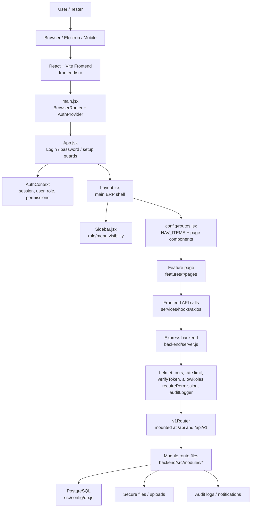

## 2. Main Module Connection Diagram

This is the enterprise-centric view: every business object shown has both an
upstream source and a downstream destination — nothing terminates inside its
own department. Solid arrows are wired in code; dashed arrows are business
connections the flow needs but that are missing or incomplete today (see §18
for the evidence behind each one).

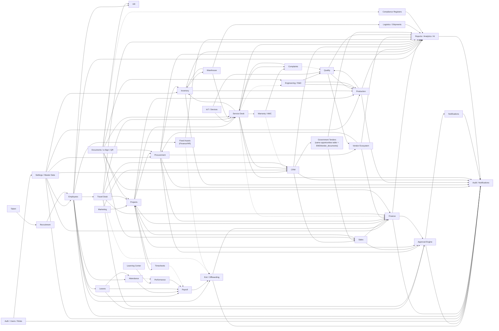

## 3. Best Manual Testing Order

1. Auth, login, password-change, setup wizard
2. Sidebar visibility and role permissions
3. Settings, master data, workflows, access control
4. Employees and HR
5. Attendance, Leaves, Payroll
6. Finance, Fixed Assets
7. Procurement, Vendor, Inventory, Warehouse, Logistics
8. Production, Quality, Engineering, Compliance
9. CRM, Tenders, Sales, Projects, Service Desk
10. Documents, e-Signatures, QR
11. Reports, Analytics, Notifications, Audit Logs, Global Search

## 4. Core System Modules

### Auth / Users / Roles / Permissions

Frontend:

- `/login`
- `/ForcePasswordChange`
- `frontend/src/context/AuthContext`
- `frontend/src/features/admin`
- `frontend/src/features/settings`

Backend:

- `backend/src/auth`
- `backend/src/middlewares`
- `backend/server.js`

Features to test:

- Login with valid credentials
- Login with invalid credentials
- Token/session restore after browser refresh
- Logout
- Forgot password, OTP, reset password
- Forced first-login password change
- Profile update
- Password change
- User preferences
- Role creation/editing
- Menu permissions
- Module permissions
- Direct URL blocking for unauthorized pages

Connections:

- Every module depends on Auth.
- Sidebar visibility depends on role and menu permissions.
- Backend routes depend on `verifyToken`, `allowRoles`, and `requirePermission`.
- Mutating actions should feed Audit Logs.

Manual checks:

- `employee` cannot see admin pages.
- `admin` cannot see super-admin-only pages if restricted.
- `super_admin` can see all modules.
- Hidden menu items are also blocked by direct URL/API permission.

### Settings / Master Data / Setup

Frontend:

- Settings Center
- Setup Center
- Company Profile
- Branch Management
- Access Control
- Workflow Builder
- Integrations
- System Settings
- Product Setup
- Master Setup
- Order Policy
- Asset Maintenance
- Setup Notifications
- Organization Setup

Backend:

- `backend/src/modules/admin`
- `backend/src/modules/master`
- `backend/src/modules/wizard`
- `backend/src/modules/integrations`

Features to test:

- Company setup
- Branch setup
- Department/designation/master setup
- Product setup
- Order policy setup
- Workflow configuration
- Approval workflow setup
- Integration settings
- Setup wizard completion
- Setup progress tracking
- System health for admin/super admin

Connections:

- Employees use company, branch, department, designation.
- Procurement, Inventory, Production, Finance use master records.
- Workflows connect to Approvals.
- Integrations connect to Documents, Finance, Sales, Notifications.

Manual checks:

- New branch appears in employee/project/finance forms.
- Workflow changes affect approval routing.
- Setup wizard redirects only when setup is incomplete.

### Approval Engine

Backend: `backend/src/modules/approvals`

Not a page module in its own right — it is shared infrastructure every other
module routes through, so it was previously undocumented even though it is
one of the most-connected pieces of code in the system. Confirmed in code
(2026-07-27): `approvals.controller.js` calls `logAudit(...)` on every
approve, reject, escalate, and delegate action (12 call sites), and separately
fires notifications on the same actions — so the chain **Approval Engine →
Notifications → Audit Logs** is real and already closed, not aspirational.

Connections:

- Leave, Travel, Procurement (PR/PO), Sales (discounts/quotes), Projects, and
  Finance all raise approval requests into this engine.
- Every decision (approve/reject/escalate/delegate) writes to Audit Logs and
  triggers a Notification — confirmed, not diagram-only.
- The final module (the one that raised the request) is updated by that
  module's own code after the approval callback — the engine itself does not
  mutate source records.

Manual checks:

- Raising a request in any of the modules above creates a row the approver
  can see.
- Approve/reject/escalate/delegate all produce an audit log entry.
- The requester receives a notification on decision.

**Nav-reachability fixed 2026-07-30.** `getPendingApprovals` (the read path
`ApprovalCenter.jsx` actually calls) has no role gate — it shows every
company-wide *unassigned* Leave/OT/PR/Expense/ECN/Payment item to any
authenticated user (`approver_id == null || approver_id === userId`, no role
check). Those 6 categories never populate `approver_id` before a decision is
made, so they always land in the "unassigned" bucket. Acting on an unassigned
item requires `approvals.authz.js`'s `APPROVER_ROLES` membership — so any role
holding the sidebar's `'Approvals'` section without that membership got a
populated-looking queue where every Approve/Reject 403s, surfaced by
`ApprovalCenter.jsx` as a generic "Failed to approve — try again" toast that
can never succeed. Found 9 such roles (`hr_exec`, `accounts_exec`,
`sales_exec`, `procurement_exec`, `store_keeper`, `production_engineer`,
`qc_engineer`, `design_engineer`, `service_engineer`) — removed `'Approvals'`
from their `ROLE_SECTION_ALLOWLIST` entries in `menuCatalog.js`, same pattern
as the existing F16 fix for `project_manager`/`sales_manager`/
`service_manager`. Regularization/probation items assigned by identity
(reporting-manager hierarchy / name lookup, not role) still reach these roles
via notifications regardless of this allowlist entry — the ownership check in
`canActOnApproval` requires no role membership, only `approver_id === me`.
**Separately found, not fixed:** `GET /approvals` (`getAllApprovals`) has no
role or `approver_id` scoping at all (company-scoped only) — unused by the
frontend (`ApprovalCenter.jsx` only calls `/approvals/pending`) but reachable
by any authenticated user via direct API call. Fits the existing tracked
authz-coverage gap; flagged, not yet closed.

**Second, complementary read/write mismatch fixed same day.** The 9-role nav
fix above closes the gap for roles with no `APPROVER_ROLES` membership at all.
A narrower but still-real version of the same "visible but not actionable"
defect remained for roles that **are** approvers: `getPendingApprovals`
decides read-path visibility with `isSupervisor(req)` (`role(req)` —
`req.user.role`, the legacy **singular** primary-role field), which is a wider
set (`super_admin`, `admin`, `manager`, `l1_manager`, `l2_manager`,
`l3_manager`, `hr`) than `approvals.authz.js`'s `OVERRIDE_ROLES`
(`super_admin`, `admin` only). A `manager`/`hr` viewer is `isSupervisor`, so
the ownership filter is skipped entirely for them and they see **every**
company row — including ones `approver_id`-assigned to a specific other
person — with the same live-looking Approve/Reject buttons. Clicking one not
actually theirs 403s via `canActOnApproval`'s ownership check, since `manager`/
`hr` aren't `canOverride`. Live-verified with a real DB row (a regularization
request assigned to a different specific user): `manager` saw it (`can_act:
false`), the actual assignee saw it with working buttons (`can_act: true`).

Fixed by computing `can_act` per row in `getPendingApprovals`
(`approvals.controller.js`) — reusing `canOverride`/`isApproverRole`/
`canClaimCategory` from `approvals.authz.js` (no new authz logic, single
source of truth) — and having `ApprovalCenter.jsx` hide the row checkbox and
Approve/Reject controls (rendering a muted "View only" badge instead) whenever
`can_act === false`, both in the table row and the detail side-panel. Rows
without the field (defensive default) still render live controls, so this
can only ever hide a control, never wrongly show one that used to be hidden.
Does not touch `ROLE_SECTION_ALLOWLIST` or any role list — purely a read-path
annotation + frontend render guard, complementary to (not overlapping with)
the 9-role sidebar fix above.

**Noted, not fixed (separate, pre-existing):** `isSupervisor`'s use of the
singular `req.user.role` instead of the many-to-many `rolesOf(req)` (see
[[project_roles_many_to_many]]) is itself the recurring "never `req.user.role`"
anti-pattern — a user whose *primary* role differs from their functional one
(e.g. every pilot account provisioned by `pilot-provision.mjs`, whose `users.role`
column is left at its `'user'` default while the real role lives only in
`user_roles`) is silently NOT treated as a supervisor by this function. Already
flagged elsewhere as unfixed pilot-data drift; not re-fixed here to avoid
scope creep on an unrelated script.

### Global Search

Frontend: `frontend/src/components/GlobalSearch.jsx`, mounted from
`frontend/src/components/Topbar.jsx`  
Backend: `backend/src/modules/search/global-search.routes.js`

Also not a page module in its own right — it is a shell-level component (like
the Approval Engine, cross-cutting infrastructure rather than a
`features/<module>` page), so it was previously undocumented despite touching
almost every business object in the system.

Connections:

- `GET /global-search?q=` (confirmed in code) queries employees, BOMs,
  production orders, customers, projects, complaints, invoices, and inventory
  items in one call, returning grouped results with deep-link page keys.
- Every module above is a read-only source for Search; Search has no write
  path and creates no downstream record — it is a lookup index, not a
  business-flow step, which is why it is not drawn into §2's flowchart (its
  edges would be a fan-in from nearly every node with no business meaning).

Manual checks:

- Searching a known employee name, BOM code, PO/production order number,
  customer name, project name, complaint ID, invoice number, and inventory
  item code each return a result in the correct group.
- Each result's deep link opens the correct source record.
- Query under 2 characters returns an empty result set rather than erroring.

## 5. People Modules

### Employees

Frontend: `frontend/src/features/employees`  
Backend: `backend/src/employees`

Features to test:

- Employees Dashboard
- All Employees
- Add employee
- Edit employee
- Employee detail
- Ex-Employees
- Employee reports
- Employee analytics
- Employee directory
- Salary revisions
- Status change
- Offboarding
- Rehire
- Employee upload/photo/document where available

Connections:

- Recruitment can create employee records.
- HR extends employee lifecycle.
- Attendance uses employee records for punches and shifts.
- Leaves uses employee records for balances and approvals.
- Payroll uses employee, salary, attendance, and leave data.
- Timesheets use employee/project allocation.
- Org Chart uses reporting hierarchy.
- Travel, Asset allocation, Performance, and Learning all key off the
  employee record — the lifecycle does not stop at Payroll (see §18 Employee
  Lifecycle).
- Exit/Offboarding is the terminal step, and gates on outstanding Travel
  advances and unreturned Assets before Full & Final settlement — **fixed
  2026-07-28** (Exit Clearance Engine, see §18.1 #1/#2): `exit.routes.js`'s
  `computeClearanceBlockers()` now queries `employee_asset_allocations`
  (status != 'returned'), `travel_advances` (amount − settled_amount > 0),
  and `users.is_active` live, and `POST /fnf/:id/pay` 409s with the specific
  blocker list until all clear, alongside the pre-existing Finance/Manager/HR
  NOC sign-offs (now audit-stamped via `finance_noc_by`/`manager_noc_by`/
  `hr_noc_by`).

Manual checks:

- Created employee appears in directory, attendance, leave, payroll, org chart.
- Offboarded employee moves to Ex-Employees.
- Inactive employee should not appear in new payroll/attendance flows.
- Rehired employee returns to active lists.
- Exit an employee with an open travel advance or an allocated asset — F&F
  pay now 409s listing the specific blockers (fixed 2026-07-28, was a known
  gap, §18.1 #1/#2).
- **Workflow Dependency Engine (Priority 7, fixed 2026-07-29)**: closing an
  exit request used to be reachable two ways — the gated `POST /fnf/:id/pay`
  (checks clearance) and the generic `PUT /exit/requests/:id` (`{status:
  'closed'}`, no checks at all — `GET /active` already treats `'closed'` as
  done via `WHERE status NOT IN ('closed','paid')`). The generic endpoint now
  refuses `status:'closed'` unless `fnf_status` is already `'paid'`, i.e. the
  gated path was actually used. Live-verified: direct-close attempt on a
  `fnf_status='draft'` row 409s and leaves the row untouched; other statuses
  (active/rejected/cancelled) are unaffected.

### HR

Frontend: `frontend/src/features/hr`  
Backend: `backend/src/modules/hr`

Features to test:

- Announcements
- Payroll Center entry points
- Employee Directory
- Probation
- Policies
- HR Documents
- Offboarding
- Exit Management
- Employee Documents
- Self Service
- Succession Center
- Asset Management
- Employee skills
- Onboarding
- HR widgets
- HR master data

Connections:

- Employees provide base records.
- Documents stores HR files and policies.
- Payroll consumes employee salary/self-service data.
- Learning and Performance consume skills/competency data.
- Notifications alert employees for HR events.
- Asset Management (HR) allocates assets at hire (`AddEmployee.jsx` /
  `EditEmployee.jsx` POST to `/employee-assets` on save). The return side used
  to be cosmetic (the clearance form's `it_assets_returned` checkbox didn't
  gate anything); **fixed 2026-07-28** — `/fnf/:id/pay` now blocks on a live
  count of `employee_asset_allocations` rows still `status='allocated'` (or
  `'under_maintenance'`) for that employee (the manual checkbox itself is
  left as-is for historical notes, but is no longer what settlement checks),
  matching the sibling `access_revoked` checkbox in the same form, which
  genuinely deactivates the login. **Same day, also built out the rest of the
  Asset Lifecycle** (Priority-1 "Allocation → Transfer → Maintenance → Return
  → Disposal"): `employee-assets.routes.js` gained `POST /:id/transfer`
  (reassigns to another employee, keeps the same row/history via
  `logAudit` rather than a blind return+recreate), `POST /:id/maintenance` +
  `/maintenance/complete` (temporary `status='under_maintenance'`, still
  blocks exit clearance — the asset hasn't left the employee's custody),
  and `PATCH /:id/dispose` (terminal `status='disposed'`, which the Exit
  Clearance query now excludes since a written-off asset isn't anyone's
  outstanding responsibility). New migration
  `20260728000005_employee_asset_lifecycle.js`. See §18.1 #1/#2.

Manual checks:

- Active announcement appears in correct surfaces.
- Uploaded HR document is permission controlled.
- Exit/offboarding changes employee status correctly.
- Mark an asset returned via `PATCH /employee-assets/:id/return` (sets
  `status='returned'`), then check the Exit Clearance Tracker's "Assets"
  column flips to Clear and `/fnf/:id/pay` unblocks once the other five
  blockers are also clear (fixed 2026-07-28, was a known gap, §18.1 #1/#2).

### Recruitment

Frontend: `frontend/src/features/recruitment`  
Backend: `backend/src/modules/recruitment`

Features to test:

- Recruitment Dashboard
- Recruiter Dashboard
- Job Requisitions
- Job Openings
- All Candidates
- Candidate Pipeline
- Interview Scheduler
- Offer Management
- Onboarding Checklist
- Email Templates
- Hiring Forecasts
- Employee Auto-Creation
- Recruitment Settings

Connections:

- Talent provides resumes, pools, agencies, question bank.
- Accepted offer feeds onboarding.
- Onboarding can create Employee record.
- Notifications/email inform candidates and interviewers — **fixed
  2026-07-29 (Priority 8, Business Event Bus pass)**: `services/
  notificationService.js`'s `createNotification()` inserted into columns
  that don't exist (`module`/`record_id` — the real table has `module_name`/
  `reference_id`) and never supplied `title`, which is `NOT NULL`. Every one
  of this module's 7 notify() call sites (new candidate, interview
  scheduled, offer sent, stage change, …) has silently notified nobody since
  this was written — confirmed the only importer app-wide, so the fix's
  blast radius is fully contained to this module. Independently verified
  live: an earlier fix at one call site (line ~433's comment) corrected a
  *different* bug (wrong interviewer-ID lookup) but never traced through to
  this shared root cause, so notifications still silently failed even after
  that fix. **Consolidated 2026-08-03**: rather than keep the standalone,
  once-broken `notificationService.js` alive as a fifth notification
  pathway, `recruitment.routes.js`'s `notify()` wrapper now calls the shared
  `modules/notifications/repositories/notifications.repository.js`'s
  `create()` directly (same external signature, so none of the 7 call sites
  changed). `notificationService.js` had zero other real importers
  (confirmed repo-wide; the two remaining hits were prose comments in
  `eventBus.js` and `signatures.routes.js`, not imports) and has been
  deleted. This also means Recruitment's notifications now mirror to mobile
  push (`notifications.repository.js`'s `create()` calls `sendPushToUser()`
  when configured), which the old service never did.
- **Security fix 2026-08-04**: all 6 `update*()` functions in
  `recruitment.repository.js` (`updateRequisition`/`updateOpening`/
  `updateCandidate`/`updateInterview`/`updateEmailTemplate`/`updateOffer`)
  built their `SET` clause by interpolating `req.body`'s own keys directly
  into the SQL string (`fields.push(`${k} = $${n++}`)`, no allowlist) —
  the same mass-assignment/SQL-injection-via-key shape already fixed
  elsewhere in the codebase via `shared/safeUpdate.js` (see
  [[project_safe_update_repo_guard]]). Any caller with recruitment write
  access could set `company_id` (jump the record to a different tenant),
  `deleted_at` (soft-delete via a normal edit), or a crafted JSON key
  (inject an extra assignment into the same UPDATE). All 6 now use
  `pickUpdatable()` — schema-derived allowlist, `company_id`/`deleted_at`/
  etc. protected — and the 5 tables that have a `company_id` column
  (`job_requisitions`/`job_openings`/`candidates`/`interview_schedules`/
  `offer_letters`; confirmed live against `information_schema` — all true
  except `email_templates`) now also scope the `WHERE` clause by tenant,
  which none of the 6 did before (any authenticated user could update any
  other tenant's requisition/opening/candidate/interview/offer by guessing
  its integer id — a separate, equally real gap in the same code).
  `email_templates` gets the allowlist fix only, matching its existing
  unscoped-everywhere-else shape. Route call sites in
  `recruitment.routes.js` updated to pass `cid(req)`. Verified live: ran
  `pickUpdatable()` against all 6 tables with a payload containing
  `company_id`/`deleted_at`/an injection-shaped key/a fake column — only
  real, unprotected columns survived for every table.
- **Requisition approval wired into the Approval Center (2026-08-04)**:
  `job_requisitions.status` already has a real DB CHECK-constrained
  lifecycle (`draft -> pending_approval -> approved -> open -> closed`) and
  `JobRequisitionPipeline.jsx` already renders it as distinct pipeline
  stages — but nothing previously enforced the `pending_approval ->
  approved` transition or surfaced it to an approver: any recruitment user
  could self-approve via the raw `PUT /requisitions/:id`. Added
  `pendingRequisitions(companyId)` to `approvals.controller.js`'s
  `getPendingApprovals` aggregator (same shape as `pendingPurchaseRequests`/
  `pendingECNs`) and a `case 'requisition':` in both `approveSourceItem`
  and `rejectSourceItem`, so `POST /approvals/requisition:<id>/approve`
  (role-gated by the existing `canActOnApproval`/`APPROVER_ROLES`, no
  changes needed there — `hr`/`hr_manager` are already unscoped approvers,
  same as every other role in `APPROVER_ROLES` not narrowly scoped via
  `APPROVER_CATEGORY_SCOPE`) now does the write, with `logAudit` and
  `notifyWorkflowEvent` for free from the shared `approveRequest`/
  `rejectRequest` wrappers. `job_requisitions` has no `approved_by` column
  (unlike `pr`/`ecn`), so like those two it stays in the shared unassigned
  pool rather than being narrowly scoped — deliberately not narrowed to
  HR-only the way `procurement_manager`→`pr` is, since that would require
  auditing and re-scoping several other already-unscoped roles
  (`manager`/`finance`/`finance_manager`/`payroll_admin`) to avoid
  regressing their existing access elsewhere, a separate and much larger
  change than this pass — see `approvals.authz.js`'s own "PROPOSED MATRIX —
  REVIEW BEFORE EXTENDING TO OTHER MODULES" comment. The raw
  `PUT /requisitions/:id` now 400s if
  `status: 'approved'` is sent directly, closing the bypass. **No
  `rejected` status exists in the CHECK constraint** — reject bounces the
  row back to `draft` for the requester to revise; the rejection comment is
  preserved in the `approvals` history row and `logAudit`, not on
  `job_requisitions` itself (no column for it). Frontend: `moveStatus()`
  now calls the Approval Center endpoint instead of the raw PUT specifically
  for the `approved` transition; a new Reject button + optional reason field
  appears only while a requisition is `pending_approval`. **Offer approval
  was explicitly NOT included in this pass** — `offer_letters.offer_status`
  has no DB-enforced approval stage at all (`draft -> sent -> accepted/
  declined`, confirmed live), so wiring it into the Approval Center the same
  way would mean inventing new status values first, a real product decision
  this session didn't have an answer for.
- **HR Analytics' offer-acceptance/time-to-hire cards fixed at the root cause
  (2026-08-04)**: `analytics.routes.js`'s top-level `/analytics/
  offer-acceptance` and `/analytics/time-to-hire` (consumed by
  `hr-analytics/components/OfferAcceptanceCard.jsx` and `TimeToHireCard.jsx`
  — flagged 80% duplicate of Recruitment's own analytics in the enterprise
  dependency report this pass worked through) independently reimplemented
  both metrics against `candidates.status`/`candidates.stage` — real
  columns, but **nothing in the entire app ever writes to them** (the live
  fields are `overall_status`/`current_stage`; offer status itself lives on
  `offer_letters`, not `candidates`, regardless). Confirmed via a repo-wide
  write-path grep before touching anything: every `candidates` UPDATE in
  `recruitment`/`talent` writes `current_stage`/`overall_status`, never the
  bare `status`/`stage` columns. These two HR Analytics cards have therefore
  shown 0% / "No data yet" since they were built, silently — same
  wrong-column shape as several other bugs already catalogued in
  `PULSE_EVENT_ORCHESTRATION_ARCHITECTURE.md`. Rather than duplicate a
  *correct* copy of the query, both routes now delegate to
  `recruitmentRepository.getOfferAcceptanceRate()`/`getTimeToHire()` — the
  same functions Recruitment's own `/recruitment/analytics/
  offer-acceptance-rate` and `/recruitment/analytics/time-to-hire` already
  used correctly (real source: `offer_letters.offer_status`). Both functions
  extended (not replaced) to return the extra fields the HR Analytics cards
  need (`offered`/`declined`; `min_days`/`max_days`/`matched`) while keeping
  every pre-existing field name, so Recruitment's own
  `HiringForecasts.jsx` — the only other consumer — needed no changes.
  Verified live: inserted a synthetic candidate + one accepted + one
  declined offer, confirmed both functions now return real non-zero
  numbers, cleaned up. **`hiring-trend` (the third component the report
  flagged, `HiringTrendChart.jsx`) was deliberately left alone** — it
  queries `employees.joining_date`, a real, correctly-used field, so unlike
  the other two this one isn't broken; merging it is a genuine
  architecture-ownership question (does "hiring trend" belong to
  candidates-reaching-a-stage or employees-actually-joining — arguably the
  latter, which is what it already uses), not a bug fix, so it wasn't
  touched this pass.
- Reports track funnel, time-to-hire, offer acceptance.

Manual checks:

- Candidate moves through stages correctly.
- Offer acceptance triggers onboarding.
- Employee auto-creation creates correct employee master.
- Schedule an interview with an interviewer set — a real notification row
  should now appear for them (fixed 2026-07-29, was silently a no-op).
- Try editing a requisition/opening/candidate/interview/offer as a non-admin
  — confirm the write still succeeds for legitimate fields and still stays
  scoped to your own company (fixed 2026-08-04).
- Submit a requisition to `pending_approval`, then as an `hr`/`hr_manager`
  (or other unscoped approver role) user open Approval Center — it should
  appear there and Approve/Reject should work; as a non-approver role,
  `PUT /recruitment/requisitions/:id { status: 'approved' }` should 400
  (fixed 2026-08-04).
- Accept an offer letter, then check the HR Analytics dashboard's Offer
  Acceptance and Time to Hire cards — should show real numbers, not 0%/"No
  data yet" (fixed 2026-08-04, was always zero).

### Talent

Frontend: `frontend/src/features/talent`  
Backend: `backend/src/modules/talent`

Features to test:

- Resume Database
- Talent Pools
- Question Bank
- Agencies
- Recruiter sourcing data

Connections:

- Talent feeds Recruitment.
- Question Bank supports interviews/assessments.
- Agencies feed source reporting.

Manual checks:

- Resume/candidate can be moved into Recruitment pipeline.
- Agency attribution appears in recruitment reports.

### Learning Center

Frontend: `frontend/src/features/hr`, `frontend/src/features/talent`  
Backend: `backend/src/modules/hr`

Features to test:

- L&D Command Centre
- Training Calendar
- Learning Paths
- Assessments
- Certifications
- Skill Matrix
- Competency Framework
- Trainer Management
- Training Reports
- L&D Settings
- Knowledge management

Connections:

- Employees are assigned training and skills.
- Performance uses competencies.
- Succession uses skills and certifications.
- Reports show training completion and certification expiry.

Manual checks:

- Training assignment appears for employee.
- Completed certification updates employee profile.
- Expiring certification appears in reports/alerts.

### Performance

Frontend: `frontend/src/features/performance`  
Backend: `backend/src/modules/performance`

Features to test:

- My Reviews
- Goals and KPIs
- 360 Feedback
- Team Performance
- Performance Settings
- Review cycles
- KRA
- OKR
- Calibration
- Increments
- Promotions
- Performance reports

Connections:

- Employees provide review participants and hierarchy.
- Learning provides skills/competency data.
- Payroll can consume increments/promotions.
- HR uses performance history for succession.
- Attendance discipline (punctuality/overtime pattern) is a natural review
  input but is **not wired**: `backend/src/modules/performance` has no
  reference to attendance data. See §18.

Manual checks:

- Review cycle assigns correct employees.
- Manager feedback respects hierarchy.
- Approved increment/promotion updates downstream data where applicable.

## 6. Attendance, Leave, Payroll

### Attendance

Frontend: `frontend/src/features/attendance`  
Backend: `backend/src/modules/attendance`, `backend/src/modules/holidays`

Features to test:

- Live Workforce
- My Attendance
- QR Attendance
- Team Attendance
- Shift Calendar
- Regularization
- Overtime
- Approval Delegation
- Attendance Reports
- Work Centres
- Contract Labour
- Payroll Sync
- Attendance Settings
- Attendance Audit Logs
- Offline punch sync
- Device/biometric settings
- Geo-fencing and face attendance if enabled

Connections:

- Employees provide workforce records.
- Leaves affects absence and payable days.
- Payroll uses attendance, overtime, late marks, unpaid days.
- Reports/Analytics consume attendance data.

Manual checks:

- Punch appears in My Attendance and Team Attendance.
- Regularization request appears for approval.
- Approved overtime is available for payroll sync.
- Leave day is not treated as unapproved absence.

### Leaves

Frontend: `frontend/src/features/leaves`  
Backend: `backend/src/modules/leaves`

Features to test:

- My Leaves
- Apply Leave
- Leave Approvals
- Team Leaves
- Leave Calendar
- Holiday Calendar
- Comp Off
- All Leaves
- Leave Reports
- Encashment
- Leave Settings
- Accruals
- Leave balance
- Leave policies

Connections:

- Employees provide employee and manager hierarchy.
- Attendance consumes approved leave days.
- Payroll consumes unpaid leave, encashment, comp-off.
- Approvals routes approval actions.
- Notifications inform requesters/approvers.

Manual checks:

- Applying leave follows workflow.
- Approved leave reflects in attendance calendar.
- Rejected leave does not affect payroll.
- Encashment posts to payroll/finance if implemented.

### Payroll

Frontend:

- Payroll Center
- My Payslip
- Salary Structure

Backend:

- `backend/src/modules/payroll`
- `backend/src/modules/finance`

Features to test:

- Salary structure setup
- Salary component setup
- Payroll processing
- Payslip generation
- Payslip viewing
- Payroll reports
- Payroll compliance
- Employee self-service tax/IT declarations if enabled
- Attendance sync
- Leave sync
- Overtime sync

Connections:

- Employees provide active employee list.
- Attendance provides payable days and overtime.
- Leaves provides unpaid leave and encashment.
- Performance can feed increments/promotions.
- Finance receives salary accounting/payment postings.

Manual checks:

- Payroll excludes inactive employees.
- Attendance/leave changes affect payable days.
- Payslip matches salary structure.
- Finance posting appears after payroll completion if supported.

## 7. Finance and Commercial Modules

### Finance

Frontend: `frontend/src/features/finance`  
Backend: `backend/src/modules/finance`

Features to test:

- Finance Dashboard
- Accounting Engine
- Chart of Accounts
- Journal Entry
- Period Closing
- Receivables
- Payables
- Payments
- Tax & Compliance
- GST
- TDS
- TCS
- Budget Management
- Fixed Assets
- Forex
- Cost Centers
- Financial Statements
- Financial Reports
- Customers & Suppliers
- Finance Settings

Connections:

- Sales creates receivables.
- Procurement creates payables.
- Payroll creates salary postings.
- Projects create cost/revenue tracking.
- Inventory and Fixed Assets affect valuation.
- Travel/expenses create reimbursements/payments.
- Fixed Assets → Finance is a real, confirmed closed loop:
  `assets.routes.js`'s `POST /run-depreciation` writes
  `asset_depreciation_log` **and** posts a Depreciation journal entry
  (debit Depreciation Expense / credit Accumulated Depreciation) in the same
  request — this is not just a diagram aspiration.
- Service billing → Finance receivables is **not confirmed**: no route file
  under `backend/src/modules/servicedesk` references `invoice`, `receivable`,
  or `finance`. AMC/service revenue does not appear to post to Finance
  through a wired path. See §18.
- Period Closing → journal entries — **fixed 2026-08-04 (§24)**: the endpoint
  `PeriodClosing.jsx` actually calls (`/finance/periods/:id/close`) previously
  had no draft-entry guard and never stored a period summary, unlike the
  equivalent-but-unreached `/accounting/periods/:id/close`. Both checks are
  now in the reachable endpoint.

Manual checks:

- Sales invoice/order appears in receivables if implemented.
- Purchase receipt/bill appears in payables.
- Payment updates payable/receivable status.
- Journal entries affect statements.
- Period closing controls backdated posting — verify by attempting to close a
  period with a draft journal entry inside its date range (should 400) and
  confirming `period_summary` is populated on a successful close (§24).

### Fixed Assets / Asset Register

Frontend: `frontend/src/features/assets/pages/AssetRegister.jsx`  
Backend: `backend/src/modules/assets`

`AssetRegister.jsx` has no curated `NAV_ITEMS` entry in `routes.jsx` — it is
reached through the `autoRouter.js` orphan-page fallback (`FOLDER_CONFIG.assets
= { module: 'assets' }` in `frontend/src/config/autoRouter.js`), gated on the
`assets` module permission seeded by
`20260719000001_seed_role_permission_gaps.js`. This is why it was previously
invisible to this manual even though it is a real, live module — see §16 for
how to recognize other orphan-routed pages.

Features to test:

- Asset register / capitalization
- Employee allocation
- Depreciation run
- Disposal

Connections:

- Procurement/Purchase creates the asset record.
- HR/Employees allocates the asset at hire — confirmed real:
  `AddEmployee.jsx`/`EditEmployee.jsx` POST to `/employee-assets` on save
  (see HR section above).
- Finance receives depreciation postings — confirmed real: `assets.routes.js`'s
  `POST /run-depreciation` writes `asset_depreciation_log` and posts a journal
  entry (debit Depreciation Expense / credit Accumulated Depreciation) in the
  same request.
- Exit/Offboarding requires the asset to be returned before Full & Final —
  **fixed 2026-07-28**: `POST /fnf/:id/pay` now blocks while any
  `employee_asset_allocations` row for that employee is still
  `status='allocated'` (see Employees/HR sections above and §18.1 #1/#2).
- Reports/Analytics reads the register.

Manual checks:

- New asset appears on the allocated employee's profile.
- Running depreciation posts a journal entry visible in Finance.
- Disposing an asset removes it from the active register.
- Exiting an employee with an unreturned asset now blocks Full & Final
  payment with a 409 listing the pending asset(s) (fixed 2026-07-28, was a
  known gap, §18.1 #1/#2).

### CRM

Frontend: `frontend/src/features/crm`  
Backend: `backend/src/modules/crm`

Features to test:

- CRM Dashboard
- Enquiries / Leads
- Accounts
- Contacts
- Opportunities Kanban
- Won/Lost Leads
- CRM Email
- Customer 360
- Customer Health Engine
- Activities
- CRM Reports
- Pipeline Automation
- CRM Settings

Connections:

- CRM feeds Sales quotations/orders.
- Won opportunity can create project.
- Customer records connect to Service Desk and Finance.
- Customer 360 consumes sales, service, project, payment, complaint data.

Manual checks:

- Lead conversion preserves account/contact/opportunity data.
- Opportunity status updates dashboards/reports.
- Customer 360 shows linked sales/project/service data.

### Government Tenders

Frontend: `frontend/src/features/tenders/pages/TenderWorkspace.jsx`  
Backend: `backend/src/modules/tenders/tenders.routes.js`

A tender is not a separate business object — it's an opportunity-typed view:
`tenders.routes.js` is gated on the same `crm` permission as the rest of CRM
(`FOLDER_CONFIG.tenders = { module: 'crm' }` in `autoRouter.js`, "a tender IS
an opportunity" per the `menuCatalog.js` F17-pass comment), and it has no
curated `NAV_ITEMS` entry — like Fixed Assets above, it's reached only through
the `autoRouter.js` orphan fallback (see §16).

Features to test:

- Tender Workspace (opportunity-typed tender view)
- EMD (Earnest Money Deposit) tracking
- Tender Documents

Connections:

- Built directly on the `opportunities` table plus EMD and
  `tender_documents` — **`opportunity_number` is `GENERATED ALWAYS`; never
  insert it directly**, or the row fails.
- Shares CRM's downstream: a won tender converts the same way a won
  opportunity does, into Sales quotation/order (§2).
- Documents/e-Sign stores signed tender submissions.

Manual checks:

- Any role with CRM `view`/`edit` (e.g. `sales_manager`, `sales_exec`) can
  open the Tender Workspace without a dedicated "Tenders" permission existing.
- EMD amount and status track correctly against the tender.
- Tender documents upload/download respects the same permission as other
  CRM documents.
- Creating a tender never sends an explicit `opportunity_number` value.

### Sales

Frontend: `frontend/src/features/sales`  
Backend: `backend/src/modules/sales`

Features to test:

- Sales Command Center
- Quotations
- Sales Orders
- Sales Targets
- Sales Intelligence
- Pricing Engine
- Commission Management
- Fulfilment Tracking
- Sales Playbooks
- Sales Calendar
- Sales Documents
- Subscriptions
- Market Presence
- Partners
- Territories
- Competitors
- Sales Settings

Connections:

- CRM provides accounts, contacts, opportunities.
- Sales orders feed Projects, Production, Fulfilment, Finance.
- Pricing may consume product/inventory setup.
- Commission may feed Payroll/Finance.
- Documents/e-Sign handles signed quotes/contracts.
- Subscriptions is a **second, fully siloed renewal mechanism**: it has its
  own plan/billing-cycle/auto-renew/next-billing-date fields and manual
  pause/cancel/renew endpoints, but is wired to zero cron jobs and not linked
  to `amc_contracts`, sales orders, or Customer 360. Two independent renewal
  tracks exist instead of one pipeline. See §18.

Manual checks:

- Quote conversion creates sales order.
- Sales order links to project or delivery flow.
- Commission calculation matches sales data.
- Sales document appears in vault/signature flow.

### Marketing

Frontend: `frontend/src/features/marketing`  
Backend: `backend/src/modules/marketing`

Features to test:

- Marketing Dashboard
- Campaigns
- Campaign Analytics
- Assign Tasks
- Delivery Tracker
- Pursuit List
- Timesheet Entry
- Marketing Settings

Connections:

- Campaigns feed CRM leads — **confirmed real**: `crm.routes.js` references
  `campaign_id`, so lead-to-campaign attribution is a genuine, not
  aspirational, link.
- Marketing tasks may feed Projects/Timesheets.
- Campaign performance feeds Analytics.

Manual checks:

- Campaign source appears in CRM.
- Assigned task appears for responsible user.
- Marketing timesheet appears in reports.

## 8. Supply Chain, Production, Quality

### Procurement

Frontend: `frontend/src/features/procurement`  
Backend: `backend/src/modules/procurement`

Features to test:

- Purchase Requests
- PO Management
- Purchase Orders
- Goods Receipt
- Vendor Center
- MRP Planning
- Quality Inspection
- Procurement Reports
- Procurement Settings
- RFQ
- Three-way match
- Vendor registration and approval

Connections:

- Inventory receives goods after GRN.
- Warehouse handles inward/storage.
- Finance receives supplier bills/payables.
- Quality handles incoming inspection.
- Vendor ecosystem manages vendor health.
- Projects/Production can create procurement demand.

Manual checks:

- PR approval allows PO creation.
- PO receipt updates inventory/warehouse.
- GRN requiring inspection appears in Quality.
- Supplier bill/payable is generated or traceable.

### Vendor Ecosystem

Frontend: `frontend/src/features/procurement`  
Backend: `backend/src/modules/procurement/routes/vendor*`

Features to test:

- Vendor Master
- Vendor Center
- Vendor Registration Portal
- Vendor Approval
- Vendor 360
- Vendor Health Score
- Vendor Risk
- Vendor Portal
- Vendor Scorecard
- Vendor Pricing Comparison
- Vendor Documents

Connections:

- Procurement consumes approved vendors.
- Finance uses vendor data for payables.
- Quality uses vendor quality scores.
- Inventory uses vendor pricing/supply history.
- Documents stores vendor compliance files.
- Confirmed real: `vendorHealthEngine.js` computes an 8-dimension health
  score (quality, delivery, cost, support, compliance, financial, dependency,
  risk events) with quality weighted directly from NCR/CAPA/rejection data
  and delivery weighted from GRN on-time data — Quality and Procurement
  genuinely feed the Vendor Scorecard, this is not diagram-only.
- **Vendor Registration Portal → anonymous vendor — fixed 2026-07-29 (§18.1
  #15).** `VendorRegistration.jsx`'s 7-step wizard was correctly built and
  correctly public on the backend, but unreachable through the frontend
  router — see §18.1 #15 for detail.

Manual checks:

- Pending vendor cannot be used until approved if rule exists.
- Vendor health reflects PO, delivery, quality, payment data.
- Vendor documents are permission controlled.

### Inventory

Frontend: `frontend/src/features/inventory`  
Backend: `backend/src/modules/inventory`

Features to test:

- Inventory Dashboard
- Advanced Dashboard
- Item Master
- Stock Summary
- Stock Movements
- Batch Tracking
- Stock Alerts
- Reservations
- Material Consumption
- Inventory Intelligence
- Inventory Report
- Warehouse link
- Quality link
- Logistics link
- Stores Dashboard
- Stores Cost Analysis
- Component Pricing
- Inventory Settings

Connections:

- Procurement increases stock through GRN.
- Warehouse stores and dispatches stock.
- Production consumes materials and creates finished goods.
- Quality blocks/releases inspected stock.
- Finance uses valuation/costing.
- Sales/Projects reserve stock.

Manual checks:

- GRN increases stock.
- Production issue reduces raw material stock.
- Finished production increases finished goods stock.
- Reserved stock cannot be over-issued if controls exist.

### Warehouse

Frontend: Inventory > Warehouse  
Backend: `backend/src/modules/warehouse`

Features to test:

- Bins
- Zones
- Bin assignment
- Inward
- Pick lists
- Picking
- Dispatch
- Cycle count
- Inward QC
- Send to Quality
- Bin clear

Connections:

- Inventory owns stock records.
- Procurement creates inward receipts.
- Quality handles inward QC exceptions.
- Sales/Projects/Service request dispatch or issue.

Manual checks:

- Inward receipt creates bin quantity.
- Pick list reduces available stock after pick/dispatch.
- Cycle count variance updates or flags inventory.

### Logistics / Shipments

Frontend: `frontend/src/features/inventory/pages/LogisticsShipping.jsx`
(lives inside the Inventory feature folder, not a standalone one)  
Backend: `backend/src/modules/logistics/logistics.routes.js`

Tracks inbound and outbound `shipments` (courier partner, direction, status),
distinct from Warehouse's bin-level pick/dispatch. This is the module behind
the "Logistics link" bullet already listed under Inventory's features above —
it previously had no path, connections, or diagram node of its own.

**Access-control gap worth verifying**: unlike its Inventory/Procurement
neighbors, the `logistics` entry in `autoRouter.js`'s `FOLDER_CONFIG` has no
`module` key set, and `menuCatalog.js` has zero `logistics` references —
every other orphan-routed module in this manual (Tenders, Assets, Compliance,
IoT, R&D) has an explicit permission gate; this one appears not to.

Connections:

- Warehouse dispatch creates outbound shipments; procurement receipts can
  create inbound shipments.
- Reports/Analytics reads shipment data.

Manual checks:

- Creating a shipment records courier, direction, and status correctly.
- Confirm which role(s) can actually reach this page today, given the
  missing permission gate noted above — this may be broader than intended.

### Production

Frontend: `frontend/src/features/production`  
Backend: `backend/src/modules/production`

Features to test:

- Production Dashboard
- Module Production Batches
- Module Batch Requests
- BOM Builder
- BOM Modeling
- MRP Workbench
- CRP Workbench
- S&OP / RCCP
- Subcontracting
- Batch Genealogy
- Work Centre Planning
- Shop Floor
- Upload BOM
- Production Settings

Connections:

- Sales/Projects create production demand.
- Inventory supplies raw materials.
- Procurement covers shortages via MRP.
- Quality inspects production output.
- Engineering controls BOM/ECN changes.
- Finance receives manufacturing cost data.

Manual checks:

- BOM drives material requirement.
- MRP shortage creates procurement signal.
- Production consumption updates inventory.
- Completed batch creates finished goods/quality record.
- Genealogy traces batch to components.

### Quality

Frontend: `frontend/src/features/quality`  
Backend: `backend/src/modules/quality`

Features to test:

- Quality Dashboard
- NCR Management
- CAPA Management
- Inspection Center
- FAT / SAT
- Equipment Calibration
- Supplier Quality
- Quality Reports
- Quality Settings
- Disturbance events if enabled

Connections:

- Procurement sends incoming inspection.
- Production sends in-process/final inspection.
- Supplier quality updates vendor score (confirmed real — see Vendor
  Ecosystem above).
- Service Desk may create quality feedback/failure analytics — **not
  confirmed**: `backend/src/modules/quality` has zero references to
  `complaint`, `ncr`, or `capa`-linked complaint IDs. Repeated complaints do
  not currently generate an NCR/CAPA signal in code, despite being a natural
  QMS trigger. See §18.
- Engineering handles ECN/root cause changes.

Manual checks:

- Failed inspection blocks stock/production release if configured.
- NCR can trigger CAPA.
- CAPA closure updates status and reports.
- Supplier defect affects supplier quality metrics.

### Engineering / R&D / IoT

Frontend:

- `frontend/src/features/engineering`
- `frontend/src/features/rd`
- `frontend/src/features/iot`

Backend:

- `backend/src/modules/engineering`
- `backend/src/modules/rd`
- `backend/src/modules/iot`

Features to test:

- Engineering Dashboard
- Power Quality Analytics
- R&D Projects
- Prototype Tracker
- Test Plans
- ECN Management
- R&D artifact repository
- Product lifecycle/R&D records where available
- IoT device ingest
- IoT fleet management
- Device telemetry

Connections:

- Engineering updates Production BOM/process via ECN — **confirmed real**:
  `ecn.routes.js`'s implement step promotes any draft BOM version created
  under that ECN to `active` and retires the prior version in the same
  transaction, so ECN approval genuinely changes what Production builds next.
- Quality uses test plans/specifications.
- IoT telemetry feeds Quality, Service, Analytics — **confirmed real for
  Service**: `alertActions.js` auto-raises a `support_tickets` row
  (`ticket_kind='service'`, category `Breakdown`) the moment a critical
  device alert fires, carrying the device's project, serial number, and
  `amc_contract_id` — the IoT → Service Ticket → AMC link is a working closed
  loop, not aspirational.
- R&D can create product/master-data inputs.
- **Missing**: the reverse path — Service/Complaints/Quality CAPA feeding
  back into Engineering to open an ECN or R&D investigation. No route in
  `backend/src/modules/engineering` references `capa`, `ncr`, or
  `complaint`. The improvement loop (Service → Engineering Feedback → R&D →
  ECN → Production) exists as a manual, off-system workflow today, not a
  system connection. See §18.

Manual checks:

- ECN approval affects related production/quality references.
- Device telemetry appears in IoT fleet and analytics.
- Test plans are usable in Quality/Engineering pages.
- A critical IoT alert on a device under AMC creates a service ticket
  carrying the AMC contract reference (confirmed working).
- A CAPA or repeated complaint does not currently open an ECN automatically
  (known gap, §18).

### Compliance Registers

Frontend: `frontend/src/features/compliance/pages/ComplianceRegister.jsx`  
Backend: `backend/src/modules/compliance/compliance.routes.js`
(`compliance_standards`, `compliance_evidence`, `compliance_audits`)

Distinct from HR `certifications` — this tracks organizational compliance
standards, their evidence, and audits against them (e.g. ISO/regulatory
registers), not individual employee certifications. Like Tenders and Fixed
Assets above, it has no curated `NAV_ITEMS` entry (`FOLDER_CONFIG.compliance =
{ module: 'compliance' }`) and is reached via the `autoRouter.js` orphan
fallback — `production_manager` holds VAEDP and `production_engineer` holds
VAE on this module per `menuCatalog.js`.

Features to test:

- Standards register (`GET/POST/PUT/DELETE /standards`)
- Evidence upload per standard (`/standards/:id/evidence`)
- Audits (`/audits`)
- Compliance summary (`/summary`)

Connections:

- Confirmed real: `ceo-intelligence.routes.js` and `ai.routes.js` both read
  compliance data, so Compliance does feed Reports/Analytics/AI today — this
  is not a dead end.
- Evidence files are stored independently of the shared Document Vault
  (`backend/src/modules/documents` has no reference to `compliance`) — same
  permission/audit trail as other stored documents is not guaranteed. Minor
  gap, see §18.1 #12.

Manual checks:

- Standard/evidence/audit CRUD respects the `compliance` module permission.
- Compliance summary numbers appear in CEO Intelligence / AI-driven reports.
- Evidence file access control matches expectations even though it bypasses
  the Document Vault.

## 9. Projects, Service, Operations

### Projects

Frontend: `frontend/src/features/projects`  
Backend: `backend/src/modules/projects`

Features to test:

- Projects Dashboard
- Projects
- Project Master
- Project Pipeline
- Task Board
- Gantt Chart
- Resource Management
- Project Financials
- CEO Command Center
- Project 360
- Issue Management
- Lifecycle: FAT, SAT, AMC, Warranty
- Project Reports
- Installation
- Project Settings
- Project members
- Order history
- Delivery tracker
- Project cost engine
- Project profitability

Connections:

- CRM/Sales creates project demand.
- Timesheets record effort against projects.
- Procurement supplies project material.
- Production fulfills project manufacturing.
- Finance tracks project cost/revenue.
- Service Desk handles installation/warranty/AMC — "Installation" in the
  Projects lifecycle list (FAT, SAT, AMC, Warranty) is represented in code
  only as a checklist category inside Commissioning, not a separate
  lifecycle table/status. `InstallationDashboard.jsx` is unrelated — it is a
  project-geography map view, not a lifecycle step.

Manual checks:

- Project created from sales/order appears in Project Master.
- Project tasks and gantt dates remain consistent.
- Timesheets affect project utilization/cost.
- Project 360 shows sales, production, service, finance data.

### Timesheets

Frontend: `frontend/src/features/timesheets`  
Backend: `backend/src/modules/timesheets`

Features to test:

- My Timesheet
- My Analytics
- All Timesheets
- Timesheet Approvals
- Utilization Report
- Weekly Report
- Timesheet Settings

Connections:

- Employees submit timesheets.
- Projects receive effort/cost.
- Payroll may consume approved time.
- Finance/project costing uses approved hours.

Manual checks:

- Submitted timesheet appears in manager approval.
- Approved timesheet appears in project utilization.
- Rejected timesheet can be corrected/resubmitted if supported.

### Operations

Frontend: `frontend/src/features/operations`  
Backend: `backend/src/modules/operations`

Features to test:

- Workflow Center
- Project Tracker
- Department Workload
- Bottleneck Analytics
- Lifecycle Tracker
- Post-Delivery lifecycle
- Maintenance
- Asset maintenance links

Connections:

- Projects feed operational workload.
- Service Desk handles post-delivery operations.
- Maintenance connects assets/service/production equipment.
- Analytics reports bottlenecks.

Manual checks:

- Project lifecycle status is consistent with Projects and Service.
- Workflow actions update correct source records.

### Service Desk

Frontend: `frontend/src/features/servicedesk`  
Backend: `backend/src/modules/servicedesk`

Features to test:

- Service Dashboard
- All Tickets
- My Tickets
- SLA Management
- Field Service
- Service Engineers
- Knowledge Base
- Contracts
- Warranty
- Spare Parts Stock
- Agent Workload
- Delivery Note
- Service Reviews
- Service Master IPS
- Customer Complaints
- Service Catalog
- Customer Portal
- Commissioning
- Service Intelligence
- Service Desk Settings
- Customer portal auth
- Failure analytics
- Voice of Customer

Connections:

- CRM provides customer/account data.
- Projects hand over installation/warranty/AMC — **fixed 2026-07-29**:
  "Installation" is now a real first-class lifecycle (`installation_requests`
  table + `installation.routes.js`), not just a checklist category inside
  Commissioning — see §18.1 #13. (Commissioning's own "Installation" checklist
  category, `commissioning.routes.js:39-42`, is untouched and still valid —
  it's the on-site checklist for the Commissioning stage itself, a different,
  narrower thing than the new Installation *lifecycle* that precedes it.)
- Inventory supplies spare parts.
- Complaints create service tickets.
- IoT feeds device alerts in as service tickets automatically (confirmed
  real, carries AMC reference — see Engineering / R&D / IoT above).
- Finance handles service billing/payments — **not confirmed in code**, see
  Finance section above and §18.
- Quality/Engineering receive failure feedback — **not confirmed in code**,
  see Quality and Engineering sections above and §18.
- Warranty activation (`POST /commissioning/:id/activate-warranty`) — **fixed
  2026-07-28, Unified Warranty Engine (Priority 3)**. The real three sources
  turned out to be `customer_equipment.warranty_status`, `project_warranties`,
  and `warranty_registrations` — not `product_warranties`, which doesn't
  exist in the live schema (this manual's earlier citation was wrong; always
  re-verify table names against `information_schema.columns`, not a prior
  citation). All three converged on `warranty_registrations` (+ its existing
  `warranty_claims` child table), extended with `project_id`/
  `commissioning_workflow_id`/`equipment_id`/`amc_contract_id` link columns.
  Activation now creates/updates a real `warranty_registrations` row
  (idempotent per `commissioning_workflow_id`) in addition to keeping
  `customer_equipment.warranty_status` in sync as a read-cache for the
  Customer Portal. See §18.1 #6.
- **Workflow Dependency Engine (Priority 7, fixed 2026-07-29)**:
  `POST /commissioning/:id/issue-certificate` now blocks (409, via the new
  `shared/workflowDependency.js`) if the same project (or equipment, when
  the workflow has one) has an Installation Request that isn't yet
  `completed`/`cancelled` — closing the "no step skippable" gap for
  Dispatch→Installation→Commissioning→Warranty. `activate-warranty` needed
  no separate check since it already requires `certificate_issued=true`,
  which this gate now sits in front of. Scoped to projects that actually
  have an Installation Request tracked — commissioning for work that never
  went through one (a small retrofit, a pre-Priority-6 project) is
  unaffected. Live-verified both directions: blocked while installation was
  open, succeeded once it was marked completed.
- **Customer Portal → anonymous customer — fixed 2026-07-29 (§18.1 #15)**:
  `CustomerPortalDashboard.jsx` (its own login form + separate `portal_token`
  JWT, distinct from the ERP session) was correctly built and correctly
  public on the backend (`customer-portal.routes.js`'s `/auth/login`), but
  unreachable through the frontend router — see §18.1 #15 for detail. Company
  selection on that login form is still an open, flagged (not fixed) gap —
  also in §18.1 #15.
- **Business Event Bus (Priority 8, fixed 2026-07-29)**: new
  `shared/eventBus.js` (a real Node `EventEmitter` singleton, not decoration)
  plus `shared/eventReactions.js` as the one place reactions get registered.
  `issue-certificate` now emits `commissioning.certificate_issued`; a
  registered reaction calls the same `activateWarranty()` the manual
  endpoint uses (extracted into a shared exported function for exactly this
  reuse), so "Commissioning completed → Activate warranty" — Priority 8's
  own first example — no longer needs a guaranteed-separate second click.
  The manual `POST /:id/activate-warranty` endpoint still exists for a
  non-default warranty term; both are idempotent per
  `commissioning_workflow_id`, so calling both back-to-back is harmless.
  New `jobs/warrantyExpiry.cron.js` (daily 09:30) detects
  `warranty_registrations` expiring within 30 days and emits
  `warranty.expiring`; a second registered reaction owns notifying
  admin/manager/sales roles — the cron itself doesn't know who cares,
  which is the actual decoupling this priority asked for. Deliberately does
  **not** attempt to consolidate the 5 separate notification pathways
  documented in the companion `PULSE_EVENT_ORCHESTRATION_ARCHITECTURE.md`
  (raw INSERT / `notificationsRepository.create()` / `WorkflowNotificationService`
  / `service_notifications` / the broken `notificationService.js` above) —
  that's a much larger, separate migration this pass doesn't attempt; the
  event bus is the new layer *above* those pathways (deciding what should
  happen), not a replacement for how the reaction is delivered. **Update
  2026-08-03**: one of those 5 pathways is now gone — Recruitment's
  `notify()` was migrated onto `notificationsRepository.create()` and
  `notificationService.js` was deleted (see the Recruitment module section
  above for detail). 4 pathways remain (`WorkflowNotificationService` /
  `service_notifications` / raw INSERT sites / `notificationsRepository`
  itself); still a separate, larger migration, not attempted here.<br><br>
  **Two more previously-undiscovered bugs found live-testing this, both
  fixed**: (1) `activateWarranty()`'s `warranty_registrations` INSERT passed
  `null` for `serial_number` whenever the commissioning workflow had no
  linked equipment — that column is `NOT NULL`, so every such activation has
  silently 500'd since Priority 3 built it (every earlier live test
  happened to use equipment with a serial number, so this never surfaced);
  now falls back to the workflow number. (2) All 5 `logAudit(...)` calls in
  this file passed `pool` as a first positional argument to a function that
  takes one destructured options object — meaning every field inside
  (`userId`, `module`, `recordId`, …) was read off the `pool` object instead
  and came back `undefined`, and a separate `description` field they all
  used doesn't exist on the real schema either. Every Commissioning audit
  log entry has been writing `undefined`/failing a NOT NULL constraint
  (silently, since `logAudit` itself catches and only logs) since this file
  was written. Fixed all 5 call sites to the real signature.
- CSAT feedback request is genuinely automatic:
  `servicedesk.routes.js:604-611` fires a notification the instant a ticket
  transitions to resolved/closed.

Manual checks:

- Complaint can become service ticket.
- Ticket assignment appears for service engineer.
- SLA timers/status update correctly.
- Spare part usage updates inventory.
- Customer portal ticket is visible internally.

### Complaints

Frontend: `frontend/src/features/complaints`  
Backend: `backend/src/modules/complaints`

Features to test:

- Complaints Dashboard
- Complaint Register
- Customer complaint IPCS flow

Connections:

- CRM/customer data identifies complainant.
- Service Desk resolves complaint through tickets.
- Quality uses repeated complaints for NCR/CAPA signals — **aspirational,
  not implemented**: the Quality module has no code path that reads
  Complaints. See §18.
- Reports track complaint trend.

Manual checks:

- New complaint links to customer/account.
- Complaint creates or links service ticket.
- Closed service ticket updates complaint status if flow exists.

### Travel Desk

Frontend: `frontend/src/features/travel`  
Backend: `backend/src/modules/travel`

Features to test:

- Travel Dashboard
- Travel Entry
- Travel Requests
- Expense Claims
- Visit Reports
- Customer Visits
- Travel Approvals
- Expense Review
- Travel Calendar
- Advances
- Payment
- Travel Audit
- Bookings
- Policy Engine
- Travel Reports
- Command Center
- Analytics
- Reimbursement claims
- Travel policy checks

Connections:

- Employees submit travel requests and claims.
- Approvals route travel/expense decisions through a real hierarchy —
  **fixed 2026-07-28 (Travel Approval Hierarchy)**: `travelApprovalAuthz.js`'s
  `authorizeManagerApproval()` now gates `PUT /travel/requests/:id/status`
  (the screen's real approve/reject button), `PUT /travel/advances/:id/manager-review`,
  and `PUT /reimbursement/claims/:id/manager-approve` on reporting manager →
  delegate → HR override → admin override, replacing the old
  `req.user.role === 'manager'` check that let any manager-role user approve
  anyone's request. See §18.1 #3.
- Finance handles advances, payments, reimbursements.
- CRM/Projects link customer visits and project travel.
- Exit/Offboarding checks open advances — **fixed 2026-07-28**, but via a
  new employee-scoped query in `exit.routes.js`, not the pre-existing
  project-scoped `GET /closure-check` (that endpoint filters by
  `project_id`/`po_number`/`opportunity_id`, not `employee_id`, so it wasn't
  actually reusable for this — see §18.1 #1, superseding the manual's
  earlier "reuse closure-check" suggestion).

Manual checks:

- Travel request approval changes status correctly.
- Expense claim follows manager/accounts/payment flow.
- Finance payment status reflects back in Travel.
- A manager who is not the requester's actual reporting manager now gets a
  403 attempting to approve the claim (fixed 2026-07-28, was a known gap,
  #3) — but the requester's real reporting manager, HR, or an admin can,
  even if that manager's own system role is plain `employee`.
- Exit an employee with an outstanding travel advance — F&F pay now 409s
  listing the outstanding amount until it's settled (fixed 2026-07-28).

## 10. Documents, Reports, Audit

### Documents / e-Signatures / QR

Frontend: `frontend/src/features/documents` (QR Code Studio itself lives at
`frontend/src/features/tools/pages/QRCodeStudio.jsx`, not under `documents`)  
Backend: `backend/src/modules/documents`, `backend/src/modules/qrshare`

Features to test:

- Sign & Send
- Public signing by token
- Document Vault
- Document Master
- Document Setup
- QR Code Studio
- Public QR token resolution
- Secure file downloads
- Zoho Sign integration if configured

Connections:

- HR stores policies and employee documents.
- Sales signs quotes/contracts.
- Procurement stores vendor documents.
- Finance stores invoices/tax documents.
- Service stores service documents/sign-offs.
- Compliance registers (`compliance_standards`/`compliance_evidence`/
  `compliance_audits` — a distinct module from HR `certifications`) store
  their own evidence files rather than routing through the shared Document
  Vault: `backend/src/modules/documents` has no reference to `compliance`.
  Minor gap — worth unifying if compliance evidence needs the same
  permission/audit trail as other stored documents. See §18.

Manual checks:

- Public signing works without normal login but only with valid token.
- Expired/invalid token is rejected.
- QR public route reveals only intended data.
- Secure file access requires permission.

### Reports / Analytics / AI

Frontend:

- `frontend/src/features/reports`
- `frontend/src/features/analytics`
- `frontend/src/features/ai`

Backend:

- `backend/src/modules/reports`
- `backend/src/analytics`
- `backend/src/modules/analytics`
- `backend/src/modules/intelligence`
- `backend/src/modules/dashboard` — backs the CEO/CFO/Executive/HR dashboard
  widgets listed below (`getFinanceDashboard`, `getDashboardCashPosition`,
  `getDashboardWorkforce`, `getDashboardSalesPipeline`, etc.); previously
  omitted from this list despite being the primary backend for most of the
  dashboards named under "Features to test" below.

Features to test:

- Report Builder
- Saved Reports
- CEO Intelligence
- CEO Dashboard
- CFO Dashboard
- Ops Command Center
- Executive Dashboard
- HR Dashboard
- HR Benchmarking
- ERP Intelligence
- System Health
- AI insights/anomalies/predictions if configured

Connections:

- Reads data from HR, Finance, Sales, Projects, Service, Production, Quality.
- Sensitive reports depend on role permissions.
- Reports/AI must never be a dead end — every insight should route back into
  an actionable module, not just render. Confirmed gap: `ceo-intelligence.
  routes.js` computes a real `upsell_opportunity` label (AMC Upsell / Expand
  Account) per customer, but its only frontend consumer
  (`CEOIntelligenceDashboard.jsx`) renders it as a plain, unclickable `<div>`.
  Nothing turns the signal into a CRM opportunity, task, or notification.
  See §18.

Manual checks:

- Dashboards load without API errors.
- Counts match source modules.
- Role-based dashboards hide restricted data.
- Saved report can be reopened/exported if supported.

### Notifications / Announcements

Frontend: `frontend/src/features/notifications`  
Backend: `backend/src/modules/notifications`, `backend/src/announcements`

Features to test:

- Notification Center
- Active announcements
- Create/edit/toggle/pin announcements
- Mark as read
- Module action alerts
- Setup notifications

Connections:

- Approvals trigger notifications.
- HR announcements appear on Home/login where intended.
- Leave, travel, procurement, service, documents can notify users.

Manual checks:

- Notification recipient is correct.
- Read/unread count updates.
- Active public announcement appears where intended.

### Audit Logs

Frontend: `frontend/src/features/audit`  
Backend: `backend/src/modules/audit`

Features to test:

- Audit Logs page
- Mutating request audit capture
- Filters by module/user/action/date
- Export if available

Connections:

- All important create/update/delete/approval actions should be traceable.
- Security and compliance depend on audit integrity.

Manual checks:

- Create/edit/delete in a module creates audit record.
- Audit log includes user, action, entity, timestamp, request context where available.

### Org Chart

Frontend: `frontend/src/features/orgchart`  
Backend: `backend/src/modules/orgchart`

Features to test:

- Org chart display
- Reporting hierarchy
- Department hierarchy
- Employee profile links

Connections:

- Employees provide reporting manager and department data.
- Approvals and performance may depend on hierarchy.
- HR analytics uses hierarchy.

Manual checks:

- Manager changes reflect in org chart.
- Inactive employees are handled correctly.

## 11. End-to-End Business Flow Diagrams

Legend used from here on:

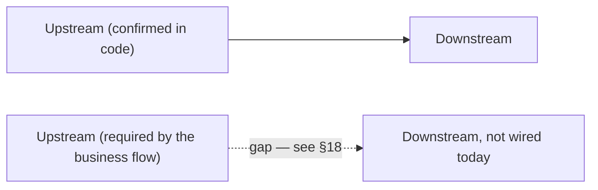

None of the diagrams below terminate inside a single department — every
chain either loops back into an earlier stage (a closed improvement loop) or
ends at a genuine business terminus (Payment, Disposal, Exit). Where the
business flow requires a connection that isn't wired in code, the arrow is
dashed and labeled with the §18 finding it corresponds to.

### Recruitment to Employee to Payroll

Was a dead end at Payroll — extended to Finance and to the rest of the
employee lifecycle (full detail in the dedicated Employee Lifecycle diagram
below).

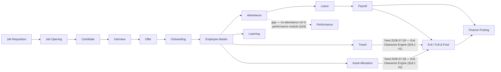

### Attendance and Leave to Payroll and Finance

Added the confirmed encashment path into Payroll, the unconfirmed Performance
link, and closed Finance into Reports instead of stopping there.

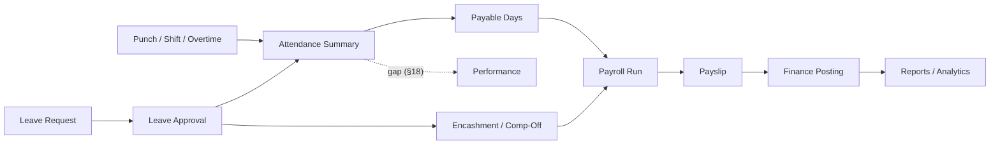

### Procurement to Inventory to Finance

Added the Vendor Health Score loop — confirmed real on the scoring side
(quality/delivery/financial inputs genuinely feed it) but confirmed **not**
consulted back at vendor selection time, so that return edge is a gap, not
the forward edges.

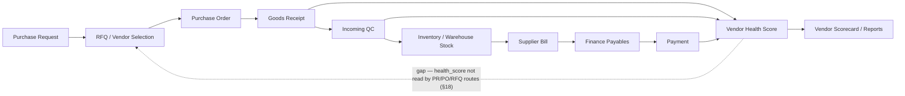

### CRM to Sales to Project to Service

Extended past "Service / Warranty" into the full post-sale loop — Warranty,
AMC, Complaint, and the return path into Engineering that closes the
improvement loop.

```mermaid
flowchart LR
    LEAD["Lead"] --> OPP["Opportunity"] --> QUOTE["Quotation"] --> SO["Sales Order"] --> PROJECT["Project"] --> PROD["Production"] --> QUAL["Quality"] --> DELIVERY["Delivery / Dispatch"] -->|"fixed 2026-07-29 — Installation Module (§18.1 #13)"| INSTALL["Installation Request<br/>(own lifecycle: engineer assignment, travel planning)"] --> COMMISSION["Commissioning"]
    SO --> RECEIVABLE["Finance Receivables"]
    COMMISSION --> WARRANTY["Warranty"] --> AMC["AMC"] --> COMPLAINT["Complaint"] --> SERVICE["Service Ticket"]
    SERVICE -.->|"gap (§18)"| ENGFB["Engineering Feedback"] --> RD["R&D"] --> ECN["ECN"] --> PROD
    AMC -.->|"gap — no invoice/receivable ref found (§18)"| RECEIVABLE
```

### Complaint to Service to Quality

The original chain stopped at a "Quality / CAPA Signal" label with no code
behind it. Extended to show the full closed improvement loop the business
brief requires, with the two confirmed-missing links marked.

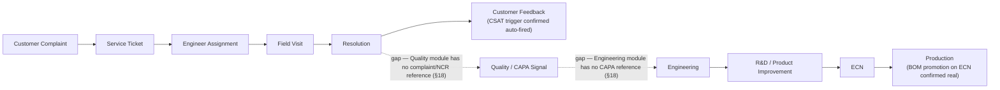

### Project Cost and Utilization

Added Travel and Asset usage against project cost, and closed Finance into
Reports.

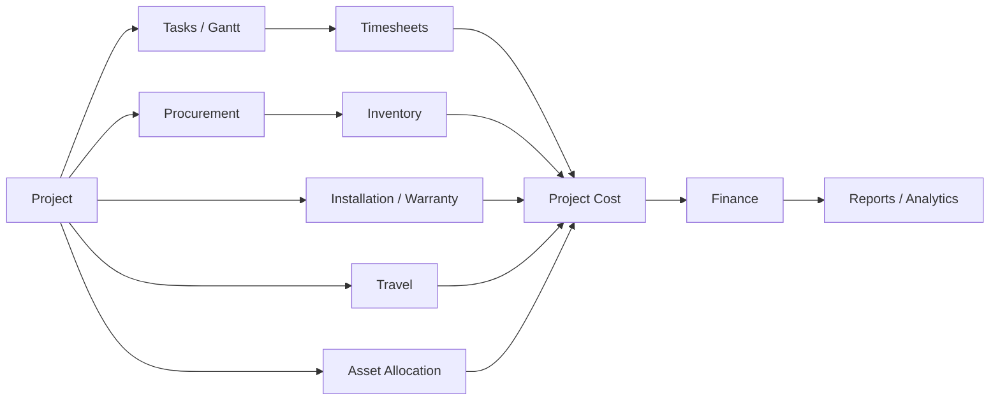

## 12. Lifecycle Diagrams

New diagrams, requested to make sure no module in the manual is a floating
department. Each ends at a genuine business terminus or loops back into an
earlier stage — never into a dead "Reports" leaf.

### Master Business Flow — the complete closed loop

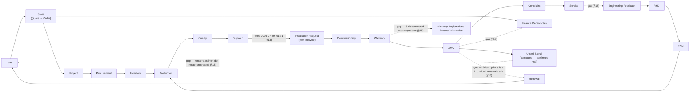

### Employee Lifecycle

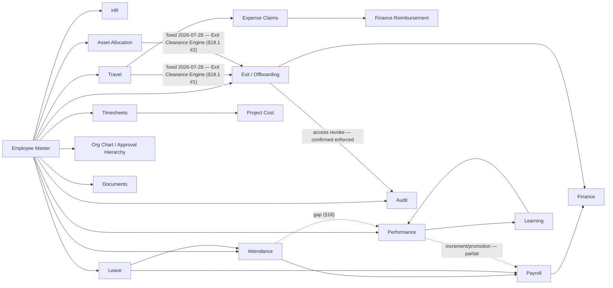

### Procurement Lifecycle

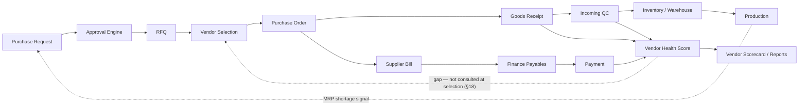

### Finance Lifecycle

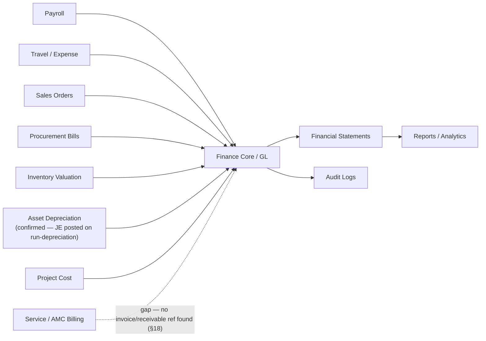

### Asset Lifecycle

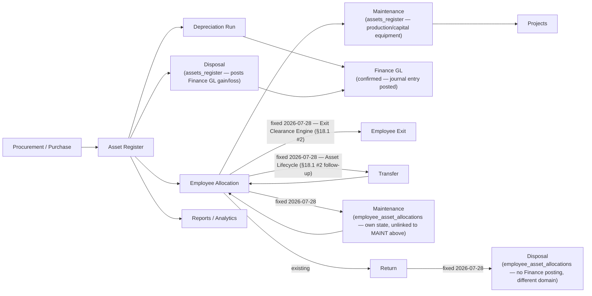

### Document Lifecycle

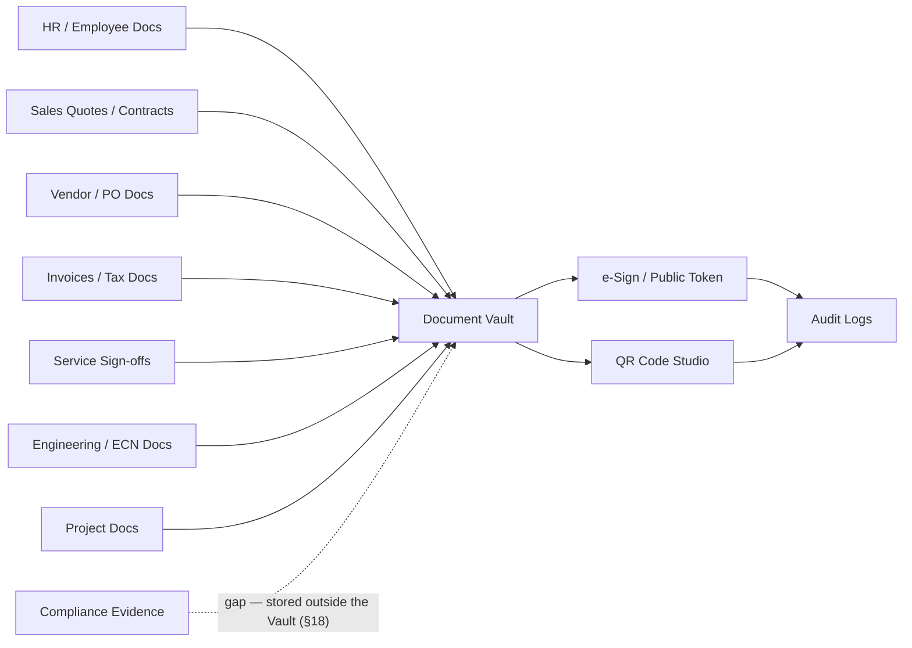

### Customer Lifecycle

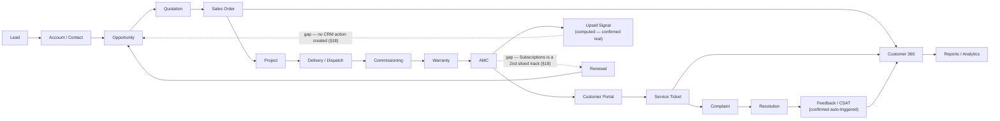

### Vendor Lifecycle

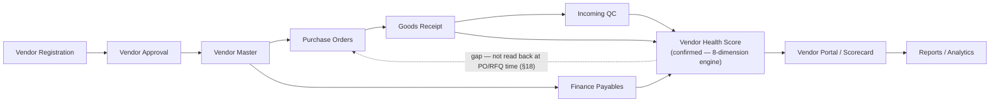

### Service Lifecycle

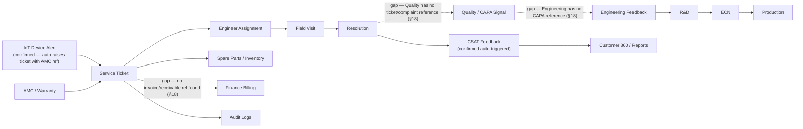

## 13. Role-Based Testing Matrix

| Role | What to verify |
|---|---|
| `super_admin` | Can see all modules and admin-only pages |
| `admin` | Can manage most app setup except super-admin-only pages |
| `employee` | Sees self-service, attendance, leaves, payslip, notifications |
| `manager` | Sees team approvals, team attendance/leaves, projects/timesheets as allowed |
| `hr` / `hr_manager` | Employee, HR, leave/attendance oversight, recruitment where allowed |
| `finance` / `finance_manager` | Finance, payroll finance, payables/receivables, reports |
| `procurement_manager` | Procurement, vendors, PR/PO approvals |
| `store_keeper` | Inventory, warehouse, stock movement |
| `production_manager` | Production, planning, shop floor |
| `qc_manager` | Quality, inspection, NCR/CAPA |
| `sales_manager` | CRM, sales, tenders, customer reports |
| `service_manager` | Service Desk, complaints, engineers, warranty |
| `project_manager` | Projects, tasks, resources, timesheets |

## 14. Per-Module Manual QA Template

```text
Module:
Page:
Role used:
Backend API observed:

Navigation:
[ ] Sidebar item visible only to correct role
[ ] Direct URL works or blocks correctly
[ ] Page title and layout are correct

Data loading:
[ ] Page loads without blank screen
[ ] API returns success
[ ] Empty state works
[ ] Error state works

Actions:
[ ] Create/Add
[ ] Edit/Update
[ ] Delete/Cancel where allowed
[ ] Approve/Reject where applicable
[ ] Upload/Download where applicable
[ ] Export/Print where applicable
[ ] Search/filter/sort/pagination

Connections:
[ ] Upstream record is selectable
[ ] Downstream record is created/updated
[ ] Status is synchronized across modules
[ ] Audit log created for important action
[ ] Notification sent if expected

Result:
Pass/Fail:
Issue ID:
Notes:
```

## 15. Quick Checklist Before Full Testing

- Backend starts without errors.
- Frontend starts without errors.
- `/api/health` returns healthy status.
- Login works for super admin.
- Login works for one normal employee.
- Sidebar renders correctly.
- Direct deep link refresh works.
- Database has seed/master data.
- File upload/download path works.
- Audit log records a test mutation.
- Notifications are visible for a test action.

## 16. Files To Open When A Module Fails

Not every page is registered in `routes.jsx`. Tenders, Fixed Assets,
Compliance, and (already known before this pass) IoT's `FleetMonitor.jsx` and
R&D's `RDHub.jsx` have no curated `NAV_ITEMS` entry — they're picked up by
`frontend/src/config/autoRouter.js`'s zero-config page scan (`FOLDER_CONFIG`
maps their feature folder to a `module` permission key) and gated through
`frontend/src/config/menuCatalog.js`'s per-role orphan-group entries instead
of the normal menu-permission path. If one of these five is "not visible,"
check `autoRouter.js`/`menuCatalog.js` first — `routes.jsx` won't show
anything wrong because the page was never meant to be there.

| Problem | First files to inspect |
|---|---|
| Page not visible | `frontend/src/components/Sidebar.jsx`, `frontend/src/config/routes.jsx`, menu permissions — **or, for Tenders/Assets/Compliance/IoT/R&D specifically, `frontend/src/config/autoRouter.js` + `menuCatalog.js`** (see note above) |
| Page visible but blank | Page component under `frontend/src/features/<module>/pages`, browser console |
| API 401/403 | `backend/server.js`, route file, `verifyToken`, `allowRoles`, `requirePermission` |
| API 404 | Backend route mount in `backend/server.js`, frontend API URL |
| Data not saving | Route controller/service, database table, request payload |
| Downstream module not updated | Source module save logic, integration/service layer, audit log |
| Wrong role access | `menuCatalog.js`, role permissions, menu permissions, route middleware |
| File not opening | Secure file route, upload path, document permissions |
| Reports mismatch | Source module query, report query, date/status filters |

## 17. Best Next Manual Testing Path

1. `super_admin login -> Settings -> Access Control -> Employees`
2. `Employee -> Attendance -> Leave -> Payroll`
3. `Purchase Request -> PO -> GRN -> Inventory -> Payables`
4. `Lead -> Opportunity -> Quote -> Sales Order -> Project`
5. `Project -> Production -> Quality -> Delivery -> Service`
6. `Complaint -> Service Ticket -> Field Visit -> Resolution`
7. `Document Sign -> Public Sign URL -> Document Vault`
8. `Create/edit/delete any record -> Audit Logs -> Notifications`

## 18. Enterprise Connection Gap Analysis

This pass reviewed the whole manual end to end looking for department-centric
dead ends — places where a business object had an upstream source but no
downstream destination (or vice versa). Everything below was checked against
live route/service code on 2026-07-27, not inferred from module names. Two
tables: first the connections that are genuinely missing or incomplete
(these are the dashed arrows throughout §2, §11, §12); second, connections
that looked like they might be diagram-only but turned out to already be
real, working closed loops — worth knowing so nobody "fixes" something that
isn't broken.

### 18.1 Missing or incomplete connections

| # | Lifecycle | Missing connection | Why it's required | Status |
|---|---|---|---|---|
| 1 | Employee | Exit / Full & Final → Travel advances | An employee can be paid out F&F while still owing (or being owed) money against an open travel advance — financial leakage and dispute risk at the exact moment the relationship ends. | **Fixed 2026-07-28 (Exit Clearance Engine).** `exit.routes.js`'s new `computeClearanceBlockers()` sums `travel_advances.amount − settled_amount` per employee and `POST /fnf/:id/pay` 409s while it's > 0. Not via the pre-existing `GET /closure-check` (`travel-reimbursement.routes.js:598`/`travel.routes.js:1162`) — that endpoint is scoped by `project_id`/`po_number`/`opportunity_id`, not `employee_id`, so it doesn't fit this need; a direct query was written instead. **Self-caught follow-up bug, same day:** the first version of this query filtered `travel_advances.employee_id = <employees.id>` directly — but that column actually stores `users.id` (`travel.routes.js`'s own `GET /advances` handler has a comment saying so, and live data confirms it: the one real row has `employee_id=5` pointing at `users.id=5`, a demo login with no `employee_id` link at all — a completely different person from `employees.id=5`). Silently would have reported every employee's advances as settled. Fixed to resolve through `users` first (mirroring the exact resolution `GET /advances` already uses for employee self-scoping), verified by inserting a throwaway advance against a real employee's user account and confirming the blocker fires, then cleaning up. |
| 2 | Employee | Exit / Full & Final → Asset return | `employee_asset_allocations` rows can sit at `status='allocated'` indefinitely after an employee is marked `left`/`terminated` — assets walk out the door untracked. | **Fixed 2026-07-28 (Exit Clearance Engine).** `computeClearanceBlockers()` also checks for `employee_asset_allocations` rows still `status != 'returned'` for the employee and blocks `/fnf/:id/pay` (409, listing the pending assets) until they're returned via `PATCH /employee-assets/:id/return`. The old `it_assets_returned` checkbox is left in place for historical notes but no longer what settlement checks — same closure pattern the sibling `access_revoked` checkbox already had. Also added: Finance/Manager/HR NOC sign-offs (`noc_finance`/`noc_manager`/`noc_hr`) are now hard blockers on the same endpoint too (previously advisory-only), with `finance_noc_by`/`manager_noc_by`/`hr_noc_by` recording who granted each (new migration `20260728000003_exit_clearance_noc_audit.js`). New `GET /exit/clearance/:employee_id/status` powers a live "Clearance Status" panel in `ExitManagement.jsx`'s Clearance Tracker tab and F&F tab. **Same-day follow-up: built the rest of Priority-1's Asset Lifecycle** (`employee-assets.routes.js` gained `POST /:id/transfer`, `POST /:id/maintenance` + `/maintenance/complete`, `PATCH /:id/dispose`; migration `20260728000005_employee_asset_lifecycle.js`) — `status='under_maintenance'` still blocks exit (asset hasn't left custody), `status='disposed'` doesn't (written off, nobody's outstanding responsibility — `computeClearanceBlockers()`'s query updated accordingly). This is a separate, self-contained lifecycle from `assets_register`'s Maintenance/Disposal (capitalized-equipment side, posts Finance GL) — no attempt made to merge the two, consistent with [[project_unified_asset_management]]'s existing "3 unlinked silos, deliberately not merged" call. Live-tested the full chain (allocate→transfer→maintenance→complete→return→dispose, plus both guard rails: can't transfer mid-maintenance, can't dispose twice) end-to-end via real HTTP calls, then cleaned up. |
| 3 | Employee | Travel/Expense approval → Reporting hierarchy | Approval should follow the requester's actual manager, not "any user with the manager role," or approval integrity is meaningless. | **Fixed 2026-07-28 (Travel Approval Hierarchy).** New shared `travelApprovalAuthz.js` (`authorizeManagerApproval()`) replaces the role-only gate on all 3 reachable approval surfaces: `PUT /travel/requests/:id/status` (the one the Travel Approvals screen actually calls — `travel.routes.js:1097`'s multi-level `/level-approve` was fixed too but confirmed **not wired to any frontend page**, so it wasn't the live exploit path), `PUT /travel/advances/:id/manager-review`, and `PUT /reimbursement/claims/:id/manager-approve`. Model: reporting manager (`employees.reporting_manager_id` match) → delegate (new `delegate_approver_id` column, settable only by whoever is already authorized, via new `POST .../delegate` endpoints on all 3) → HR override (`hr`/`hr_manager`/`hr_exec`, any employee) → admin override (`admin`/`super_admin`, any employee) — matches Priority-1's exact ordering. Live-tested end-to-end: an active non-manager account that wasn't the requester's RM got 403'd, then the requester's actual reporting manager — whose account's system role is plain `employee`, not `manager` — was correctly allowed, something the *old* role gate could never have permitted either. **Self-caught bug found mid-fix:** `travel_advances.employee_id` stores `users.id`, not `employees.id` (an existing code comment says so); the manager-review fix resolves the real `employees.id` via the parent `travel_requests.employee_id` instead, falling back to translating through `users` only if that's unavailable. **Deliberately not done:** Levels 2/3 of the (unused) multi-level flow stay role-gated — no per-employee "Department Head" identity exists in the schema to check against; `GET /travel/approvals`' listing still shows every pending request to any manager/HR/admin regardless of whether they're actually authorized to act on it (the Approve/Reject buttons now correctly 403 via the existing generic error-toast in `TravelApprovals.jsx`, but the list itself isn't filtered down to "your queue" — a real follow-up, same proportionality call as other flagged-not-fixed items in this section). |
| 4 | Employee | Attendance → Performance | Punctuality/overtime pattern is a standard review input in most HR systems; without it, Performance reviews are blind to attendance discipline. | **Diagram-only gap.** `backend/src/modules/performance` has no reference to attendance data at all — never built, not a regression. |
| 5 | Procurement / Vendor | Vendor Health Score → PR/PO/RFQ vendor selection | A vendor scored "Critical" or "Watchlist" should influence — or at least warn during — the next PO to that vendor, or the scorecard is just a report nobody acts on. | **Code gap, partial.** The score itself is real and well-built (`vendorHealthEngine.js`, 8 weighted dimensions from real GRN/NCR/CAPA/financial data). But `health_score`/`health_status` is never read back inside any PR/PO/RFQ route — the loop computes but doesn't close. |
| 6 | Customer / Service | Commissioning warranty activation → Warranty visibility | A warranty that doesn't surface anywhere can't be renewed, escalated, or honored correctly. | **Fixed 2026-07-28 (Unified Warranty Engine).** The three real sources were `customer_equipment.warranty_status` (Commissioning/Customer Portal), `project_warranties` (Projects module, its own full CRUD + `WarrantyManagement.jsx`), and `warranty_registrations` (+`warranty_claims`) (Operations/Lifecycle module, its own full CRUD + claims workflow + `WarrantyManagement.jsx` — a *second*, differently-named page with the same name in a different feature folder). `product_warranties`, cited in an earlier pass of this manual, **does not exist in the live schema** — always re-verify table names against `information_schema.columns` before trusting a prior citation. All three tables were confirmed **empty (0 rows)** before this fix — zero data-migration risk, the safest possible time to do this.<br><br>**Design:** `warranty_registrations` designated the canonical engine (most feature-complete — already had a claims workflow and coverage flags). Migrations `20260728000006/7/8` added `project_id`/`commissioning_workflow_id`/`equipment_id`/`amc_contract_id` link columns plus `warranty_months`/`exclusions`/`coverage_description`/`manufacturer_warranty_months`/`extended_warranty_months` (fields the Projects UI already collected that `project_warranties` was missing one of — `coverage_description` — a live 500-on-edit bug, never triggered since the table was always empty). `project_warranties` is left in place, unused, rather than dropped — a table sitting empty is reversible, dropping one isn't.<br><br>**Rewired:** `commissioning.routes.js`'s `activate-warranty` now upserts a real `warranty_registrations` row (idempotent per `commissioning_workflow_id`) alongside keeping `customer_equipment.warranty_status/warranty_expiry` in sync (kept as a read-cache for the Customer Portal's 5+ call sites reading it directly — not worth rewriting all of those for this pass). `projects.routes.js`'s 3 warranty endpoints (`GET/POST /projects/:id/warranties`, `GET /warranties`, `PUT /warranties/:id`) now read/write `warranty_registrations` filtered by `project_id`, with column names aliased to match `WarrantyManagement.jsx`'s existing contract exactly — **zero frontend changes needed**. `customer360.routes.js`'s warranty query (already correctly pointed at `warranty_registrations` via `sales_order_id` from an earlier pass) gained a second join path via `equipment_id → customer_equipment.crm_account_id → accounts.party_id` (the same bridge Priority 2's upsell-to-opportunity fix uses) so commissioning-sourced warranties — which carry `equipment_id`, not `sales_order_id` — now show up there too. AMC contract detail (`GET /lifecycle/amc-contracts/:id`) gained a `LEFT JOIN LATERAL` surfacing the linked warranty's end date/status.<br><br>**Bugs caught by live-testing before they shipped:** the first version of the commissioning/projects INSERTs referenced `warranty_months` and `exclusions` columns that turned out not to exist on `warranty_registrations` (those were `project_warranties`-only columns I'd conflated) — both fixed with two small follow-up migrations. Separately, the Projects `PUT`/`POST` handlers' `RETURNING wr.id, wr.project_id, ...` (reusing the same aliased column list as the `SELECT ... FROM warranty_registrations wr` queries) failed with `missing FROM-clause entry for table "wr"` — an UPDATE/INSERT has no implicit alias the way a SELECT's FROM clause does; fixed by explicitly aliasing the target table (`UPDATE warranty_registrations AS wr SET ...` / `INSERT INTO warranty_registrations AS wr (...) ... RETURNING wr.id`). Full chain (commissioning → engine row → Customer 360 → Projects CRUD → AMC linkage → idempotency) live-tested end-to-end via real HTTP calls, not assumed from reading the code. |
| 7 | Customer / Sales | AMC / CEO Intelligence → CRM Opportunity (Upsell) | An AI-computed upsell signal that nobody can click on is exactly the "Reports as a standalone module" anti-pattern the enterprise-centric review is meant to eliminate. | **Fixed 2026-07-28 (Priority 2/4 — Intelligence-to-Workflow).** New `POST /ceo-intelligence/customers/:partyId/convert-upsell`: resolves (or opportunistically creates) the `accounts` row bridging the Finance `parties` customer to CRM — `accounts.party_id` is a real schema link but was 100% unpopulated in practice (same "empty in practice" pattern as `vendors.party_id`); creates a real `opportunities` row (Assign Salesperson: the account's existing owner if known, else the acting user — no reliable territory/round-robin signal exists for an AI-detected upsell the way it does for inbound leads); populates the opportunity's own `next_step`/`follow_up_date` columns as the "Create Task" step rather than inventing a parallel task system; notifies admin/super_admin/sales_manager/manager roles (Notify Sales Manager); is idempotent (409s on a second attempt while one's still open) so "Track Conversion" is just the opportunity's own normal Kanban/stage lifecycle — no separate tracking needed. `CEOIntelligenceDashboard.jsx`'s `CustomerGrowthView` — the only place this signal was ever rendered — turned the plain label into a real button with loading/success/error states. Live-tested end-to-end (create → verify → duplicate-blocked → cleanup) against a real customer with no prior CRM account; the account got created fresh with `party_id` correctly bridged, a genuine permanent improvement left in place (not test data). |
| 8 | Customer / Sales | AMC ↔ Subscriptions (Renewal) | Two separate renewal mechanisms for the same business concept means revenue can lapse silently on whichever track isn't being watched. | **Fixed 2026-07-29 (Renewal Engine, Priority 5).** AMC and Subscriptions are legitimately different commercial products (service contract vs. SaaS-style recurring billing) — unlike Warranty's 3-way split, forcing them into one table would conflate unrelated concepts, so they stay separate tables but now share the same **Reminder → Approval → Payment → Renewal** shape via a new shared gate, `shared/renewalApproval.js`.<br><br>**Reminder:** new `jobs/subscriptionRenewal.cron.js` (daily 09:15, mirrors `amcRenewal.cron.js`'s pattern) — `subscriptions` had **zero cron jobs**, confirmed live: all 3 real rows in the database had `next_billing_date` already in the past with nothing ever having acted on them. Dedups on message text for the day rather than `reference_id`, since `notifications.reference_id` is `integer` and `subscriptions.id` is `uuid`.<br><br>**Approval:** both `PATCH /sales/subscriptions/:id/renew` and `POST /lifecycle/amc-contracts/:id/renew` now require an `admin`/`super_admin`/`finance`/`finance_manager` role (via `hasRole()`, many-to-many-safe) for renewals above `RENEWAL_APPROVAL_THRESHOLD` (₹2,00,000 default, env-configurable) — neither endpoint had **any** role check before this.<br><br>**Payment:** both now create a real `invoices` row via `invoiceService.createInvoice()` (the same GL-posting path Sales Order/Project invoicing already use) before applying the renewal — if invoicing fails (e.g. credit limit exceeded), the renewal itself does **not** silently proceed, matching the lesson from the Sales-Order-dispatch fix elsewhere in this file (swallowing an invoicing failure while still marking the parent renewed is worse than not automating it). AMC resolves its customer via `sales_order_id → sales_orders.customer_id` (same link `customer360.routes.js` already uses for this table); Subscriptions has its own `customer_id` directly.<br><br>**Renewal:** Subscriptions' `/renew` used to just flip `status` back to `'active'` with no date advance at all — now genuinely advances `next_billing_date` by one real billing cycle. AMC's `/renew` was already the more mature of the two (real `amc_renewal_history`, `renewal_count`, `next_renewal_date`) and needed only the Approval+Payment additions.<br><br>**Live-tested end-to-end** with real credit-limit interaction, not mocked: a renewal against a customer already at their credit limit correctly 422'd without mutating the subscription/contract; the same renewal against a customer with headroom succeeded with a real invoice ID; the approval threshold correctly 403'd a non-finance role and passed for admin. **Found but explicitly not fixed** (different gap, flagged for a future pass): AMC's separate `POST /amc-contracts/:id/generate-invoice` button (periodic in-term billing, a different concept from renewal) has never created a real `invoices` row — it returns a computed object with `status:'draft'` that's never persisted anywhere Finance can see. |
| 9 | Service / Quality | Complaints → Quality NCR/CAPA signal | Repeated complaints against the same product/component are a standard CAPA trigger in any QMS (ISO 9001-style) — without this link, Quality never sees the voice-of-customer failure pattern. | **Diagram-only gap — the manual itself previously claimed this connection existed.** `backend/src/modules/quality` has zero references to `complaint`, `ncr`-from-complaint, or any complaint-linked ID. |
| 10 | Service / Engineering | Service/Quality CAPA → Engineering → R&D → ECN | This is the closed improvement loop the whole business brief is built around (Production → Service → Engineering Feedback → R&D → ECN → Production). Without the entry point, the loop never closes. | **Code gap.** `backend/src/modules/engineering` has zero references to `capa`, `ncr`, or `complaint`. By contrast, the *other half* of this loop — ECN → Production — is real and confirmed (see §18.2 #3): once an ECN exists, it does reach Production. It just never gets triggered by a quality/service signal automatically. |
| 11 | Service / Finance | Service Ticket / AMC → Finance receivables | Service and AMC revenue needs to hit the books like every other revenue stream, or Finance's "receives transactions from Service" connection (as claimed in §7) is aspirational. | **Not confirmed in code.** No route file under `backend/src/modules/servicedesk` references `invoice`, `receivable`, or `finance`. |
| 12 | Documents / Compliance | Compliance evidence → Document Vault | Compliance evidence (`compliance_standards`/`compliance_evidence`/`compliance_audits`) should get the same permission model and audit trail as every other stored document, or it's a second, ungoverned file store. | **Minor code gap.** `backend/src/modules/documents` has no reference to `compliance`; the compliance module appears to manage its own evidence files independently. |
| 13 | Sales / Projects | "Installation" as a distinct lifecycle step | The business brief (and Projects' own lifecycle list: FAT/SAT/AMC/Warranty) names Installation as a stage between Dispatch and Commissioning. | **Fixed 2026-07-29 (Priority 6 — Installation as a First-Class Module).** New `installation_requests` table + `installation.routes.js` (mounted `/installation-requests`) gives Installation its own lifecycle: **Dispatch → Installation Request → Engineer Assignment → Travel Planning → Installation → Commissioning → Customer Acceptance**. Deliberately links to, rather than duplicates, existing systems — Travel Planning creates a real row in `travel_requests` (not a bespoke date field), and completing an installation auto-creates a real `commissioning_workflows` row via a new exported `createCommissioningWorkflow()` helper (extracted from `commissioning.routes.js`'s own POST handler so both flows share one seeding path for the default checklist/readings, not two copies). Auto-creates on Sales-Order dispatch (`PUT /orders/:id/dispatch`) when a project is resolvable via `lifecycle_instances` — the same bridge `autoBootstrapLifecycleOnOrderAccept` already sets up — and is idempotent (a DB partial-unique-index on `sales_order_id` prevents a re-dispatch from creating a duplicate active request, not just an application-level check). `InstallationDashboard.jsx` (a project-geography map) is correctly left alone — new page is `InstallationRequests.jsx`, added to Service Desk's nav. **Found and fixed a real, previously-undiscovered bug while wiring the Dispatch trigger**: `sales_orders.dispatched_at`/`delivered_at` are referenced by the dispatch route and several read-side analytics queries, but don't exist on the live table — the migration that was supposed to add them (`20260609000010`, dated 2026-06-11) shows `[applied]` in the ledger, yet `information_schema` confirms the columns were never actually there. Root cause not fully diagnosed (this project has hit ledger/live-schema drift of this kind before), but the practical effect was severe: **every real call to `PUT /orders/:id/dispatch` 500'd**, meaning Dispatch itself — the very first link in this whole chain, and a core Sales Order action independent of Installation — has likely been broken in practice. Fixed with a new additive migration (`20260729000002`) rather than fighting the ledger. Full chain live-tested end-to-end via real HTTP calls (dispatch → auto-created request → assign → travel → start → complete → auto-created commissioning → customer acceptance), including the dispatch-idempotency check, then cleaned up. |
| 14 | Inventory / Logistics | Logistics/Shipments has no permission module | Every other orphan-routed page (Tenders, Fixed Assets, Compliance, IoT, R&D) has an explicit `module` key in `autoRouter.js`'s `FOLDER_CONFIG` and matching `menuCatalog.js` entries gating who can reach it; Logistics doesn't, which likely means broader-than-intended access rather than a deliberate open policy. | **Code gap — found this pass.** `FOLDER_CONFIG.logistics` in `frontend/src/config/autoRouter.js` has no `module` key, and `menuCatalog.js` has zero references to `logistics`. Worth confirming which roles can actually load `LogisticsShipping.jsx` today. |
| 15 | Vendor / Customer (external stakeholders) | Anonymous external user → Vendor/Customer portal entry point | Both portals exist specifically so an outside party (a prospective vendor, an existing customer) never needs an internal ERP login — if the SPA's own router redirects them to the staff login page before the portal component ever mounts, the entire "external self-service" design point is void regardless of how well-built the component underneath is. | **Fixed 2026-07-29.** `frontend/src/App.jsx`'s router special-cased only 4 paths (`/login`, `/ForcePasswordChange`, `/sign/:token`, `/SetupWizard`) to render without an ERP session; every other path — including `/VendorRegistration` and `/CustomerPortalDashboard` — fell through to the catch-all `/:page?`, which hard-redirects to `/login` whenever `isLoggedIn` is false, before `Layout`/`ROUTES` are ever consulted. `routes.jsx`'s `VendorRegistration` entry carries a `public: true` flag that nothing in the frontend ever reads (confirmed via project-wide grep for `.public`) — dead metadata, not an actual bypass. Both target components were already correctly built and already correctly wired to genuinely public backend routes (`vendor-registration.routes.js`'s `/submit`+OTP flow; `customer-portal.routes.js`'s `/auth/login` issuing a separate `type:'customer_portal'` JWT) — the only missing piece was the SPA-level route. Fixed by adding both as explicit top-level `<Route>` entries in `App.jsx`, mirroring the existing `/sign/:token` pattern (lazy-loaded, `Suspense`-wrapped, before the catch-all). Neither page has ever had an internal link pointing at it (grepped both component names project-wide, zero matches), so this was pure dead-on-arrival, not a regression of something that used to work — meaning neither flow was ever reachable by an actual outside vendor or customer since being built. Browser-verified with Playwright in a fresh cookie-less context: both pages now render correctly for an anonymous visitor (7-step wizard; email/password sign-in), and a regression check confirmed arbitrary unmatched paths (`/`, `/SomeRandomPage`) still correctly redirect to `/login` — the fix is scoped to exactly these two paths. **Flagged, not fixed — a product decision, not a wiring gap:** `CustomerPortalDashboard.jsx`'s login form has no company-selector field; `company_id` is silently sourced from an optional `?company=` query param (defaulting to `1`), so in a genuinely multi-tenant deployment a customer of company 2+ hitting the bare URL would transparently be checked against company 1's `customer_portal_users` table. Needs a decision (subdomain-per-company? invite link with embedded `company_id`? name/GSTIN lookup step?) before it's fixable. |

### 18.2 Connections that looked missing but are already real, working closed loops

Confirmed by reading the actual route/service code, not assumed from naming:

1. **IoT → Service Ticket → AMC.** `iot/alertActions.js`'s `createServiceTicket()` auto-raises a `support_tickets` row (`ticket_kind='service'`, category `Breakdown`) the instant a critical device alert fires, carrying the device's project, serial number, and `amc_contract_id`. Shared by both the live ingest path and the monitor cron, and idempotent (won't flood tickets on repeat breaches). This is a genuine closed loop, not a diagram aspiration.
2. **Vendor Health Score inputs.** `vendorHealthEngine.js` computes an 8-dimension score (quality, delivery, cost, support, compliance, financial, dependency, risk events) with quality weighted directly from NCR/CAPA/rejection data and delivery weighted from GRN on-time data. Quality and Procurement genuinely feed the score — only the *return* path (score back into vendor selection, #5 above) is missing.
3. **Engineering ECN → Production BOM.** `ecn.routes.js`'s implement step promotes any draft BOM version created under that ECN to `active` and retires the prior version, in the same transaction, with an audit event (`bom_promoted`). ECN approval genuinely changes what Production builds next.
4. **Asset Depreciation → Finance GL.** `assets.routes.js`'s `POST /run-depreciation` writes `asset_depreciation_log` **and** posts a real journal entry (debit Depreciation Expense / credit Accumulated Depreciation) in the same request.
5. **Approval Engine → Notifications → Audit Logs.** Every approve/reject/escalate/delegate action in `approvals.controller.js` calls `logAudit(...)` (12 call sites) and separately fires a notification — this three-step chain from the business brief's Approvals example is already closed.
6. **Customer Portal → Service Tickets.** Portal-raised tickets land in the same `support_tickets` table service engineers work from — confirmed in both `customer-portal.routes.js` and `servicedesk.routes.js`.
7. **Ticket resolution → CSAT feedback request.** `servicedesk.routes.js:604-611` auto-fires a feedback notification the instant a ticket transitions to resolved/closed — genuinely automatic, not dependent on an agent remembering to ask.
8. **Marketing campaigns → CRM leads.** `crm.routes.js` references `campaign_id` directly — attribution is real, not aspirational.
9. **Recruitment → Employee → Attendance → Leave → Payroll and CRM → Quotation → Sales Order → Dispatch → Production (quality stop-ship hold).** Both already independently verified and scored in the prior Enterprise Workflow Audit (84/100 and 83/100→90/100 respectively) and re-spot-checked 2026-07-27 — still hold.

### 18.3 What this pass did not change

Per the scope of this review: no module was added, redesigned, or removed,
and no application code was touched. Everything above is a documentation
change to this manual — making existing connections visible where they were
real but undrawn, and making missing connections visible where the manual
previously implied a link the code doesn't back up. Items in §18.1 are
recommended follow-up engineering work, not something this pass fixed.

## 19. Automation Opportunities Pass (2026-07-29)

A separate 12-item backlog was handed over verbatim from a prior automation
audit, framed as "fits that already exist in the architecture — no redesign,
just finishing the wiring." Each item was re-verified against live code
before touching anything (per this manual's own standing rule — audits go
stale fast in this codebase, see `AUTOMATION_OPPORTUNITY_AUDIT.md`'s own
superseded "cheapest fix" claim as a prior example). Result: **11 of 12 were
already fully wired** by the time this pass ran — evidently implemented in
an earlier, uncommitted stretch of work on this same backlog before this
verification pass began. Only one (#6 below) is a genuine, deliberate
partial. Nothing in this section required new code; this section exists
because the standing rule requires an architecture-impact note even when the
finding is "already done," so the next pass doesn't re-attempt closed work.

| # | Item | Status | Evidence |
|---|---|---|---|
| 1 | Collapse the dual ledger (Finance) | **Done — opposite direction from the audit's suggestion.** The audit proposed pointing Trial Balance/P&L/Balance Sheet at `journal_entry_lines`. Live code shows the actual fix went the other way: `journal.repository.js`'s header comment records that two child ledgers existed (`journal_entry_lines`, minimal, written by auto-posting services; `journal_lines`, richer, already read by Trial Balance/P&L/Balance Sheet) and the repository now writes and reads `journal_lines` exclusively. `journal_entry_lines` is dead — grepped project-wide, the only remaining reference is that historical comment. | `backend/src/modules/finance/repositories/journal.repository.js:1-118` (see `getTrialBalance`, `getGeneralLedger`) |
| 2 | Call the existing payroll-GL endpoint (Payroll→Finance) | **Done — via direct service import, not the HTTP endpoint.** Payroll approval imports `postPayrollJournal` from `payrollJournal.service.js` directly rather than calling `POST /finance/accounting/payroll-journal` over HTTP — avoids an unnecessary internal round-trip, same effect. Best-effort/non-blocking: a GL posting failure doesn't undo the already-committed payroll approval. | `backend/src/modules/payroll/payroll.routes.js:139-153` |
| 3 | Real Sales Order→Production (Sales→Production) | **Done.** `autoBootstrapLifecycleOnOrderAccept` now calls the real `createProductionOrderFromSalesOrder` (previously written but only reachable via an endpoint the frontend never called) instead of stopping at the project-stub bootstrap, with best-effort BOM matching by product name so a matched BOM also seeds `production_operations`. | `backend/src/modules/sales/routes/sales.routes.js:15,108-137` calling `backend/src/modules/operations/lifecycle.routes.js`'s exported `createProductionOrderFromSalesOrder` |
| 4 | Route Sales-Order/Project invoices through `invoice.service.js` (Sales & Projects→Finance) | **Done — predates this backlog entirely.** Both call sites already route through `invoiceService.createInvoice`, per an in-code comment dated "2026-07-21 dual-ledger fix." Confirmed present at `HEAD` (not part of any uncommitted change). | `backend/src/modules/sales/routes/sales.routes.js:699-732`, `backend/src/modules/projects/routes/projects.routes.js:552-575` |
| 5 | Dual-write production consumption to `stock_ledger` (Production→Inventory) | **Done — predates this backlog entirely.** `backflushMaterials()` and `receiveFG()` already call the shared `postStock()` (the same helper subcontracting uses), confirmed present at `HEAD`. | `backend/src/modules/production/execution.routes.js` (`backflushMaterials`, `receiveFG`) |
| 6 | Auto-create/remind AMC contracts (Service) | **Deliberately partial — notify, don't auto-create.** `activateWarranty()` sets `amc_eligible=true` and now notifies admin/manager/service/sales roles ("AMC-Eligible — Set Up Contract") — the "remind" half. It does **not** auto-draft an `amc_contracts` row: the in-code reasoning is that pricing/SLA terms are a business decision the system has no basis for, and fabricating them into a real contract row is worse than requiring a human to use the existing `POST /lifecycle/amc-contracts` flow. This mirrors the same proportionality call already made elsewhere in this manual (§18.1 #15's flagged-not-fixed company-selector gap). **Open follow-up if the business wants full auto-creation**: would need a pricing/SLA default source (e.g. a rate card keyed by product/customer tier) before a draft row could be trusted — flagging rather than guessing. | `backend/src/modules/servicedesk/routes/commissioning.routes.js:447-551` (`activateWarranty`) |
| 7 | Fix the timesheet table reference (Projects) | **Done.** `GET /timesheets/my-timesheet` now joins `project_members` (`role_in_project`) instead of the dropped `project_team_members` — restores a page that previously always showed "no project assignments." | `backend/src/modules/timesheets/routes/timesheets.routes.js:22-41` |
| 8 | Auto-sync opportunity stage on conversion (CRM→Sales) | **Done.** Quotation→Sales-Order conversion now flips the source `opportunities.stage` to `Won` (`closed_date`, `probability_percentage=100`) in the same transaction, guarded so an already-Won/Lost opportunity isn't overwritten. | `backend/src/modules/sales/routes/sales.routes.js:442-454` |
| 9 | Persist Field Visit fields (Service) | **Done.** `PUT /servicedesk/field-visits/:id` now accepts and persists `completed_at`, `work_done`, `parts_used`, `labour_hours`, `travel_km`, `cost`, `start_time_actual`, `end_time_actual`, `customer_signature` — previously silently discarded. Parts-used consumption is also now posted through `postStock()` against real `inventory_items` (net-quantity-change per `part_id`), not left as free-text JSON invisible to stock. | `backend/src/modules/servicedesk/routes/servicedesk.routes.js:858-` (PUT handler + parts-used stock posting immediately after) |
| 10 | Populate `project_scurve_data` on a schedule (Projects) | **Done — predates this backlog entirely.** `scurveSnapshot.cron.js` runs daily at 02:00, upserting one row per project per calendar month from `project_cost_summary`'s existing EVM figures plus a linear time-elapsed planned-progress baseline. Registered in `server.js`. Confirmed present at `HEAD`. | `backend/src/jobs/scurveSnapshot.cron.js`, registered `backend/server.js:234,879` |
| 11 | Generate production operations from MRP conversions (Plan to Produce) | **Done — predates this backlog entirely.** Both `POST /mrp/planned-orders/:id/convert` (single) and `/convert-all` (bulk) call `copyRoutingToProductionOperations()` for `make`-type planned orders, so MRP-sourced production orders get a real operations/routing seed instead of being shop-floor dead ends. Confirmed present at `HEAD`. | `backend/src/modules/production/mrp.routes.js:194,239` |
| 12 | Auto-generate the reorder-driven Purchase Request feed (Inventory→Procurement) | **Done.** The reorder-breach check that already raises a `low_stock` alert now also writes a real `purchase_suggestions` row (idempotent — skipped if a pending suggestion already exists for that item/warehouse), with a priority derived from how far below reorder level the stock has fallen. Previously a fully-built, fully-dead UI (`StockAlertsAndSuggestions.jsx`) with nothing ever populating a row. | `backend/src/services/stockAlerts.js:45-69` |

**Architecture impact of this pass**: none — every fix reuses an existing
table, service, or helper already documented elsewhere in this manual
(`postStock`, `invoiceService.createInvoice`, `createProductionOrderFromSalesOrder`,
`copyRoutingToProductionOperations`, `journal_lines`). No new tables, no new
cross-module coupling beyond what §2/§11/§12's diagrams already draw. Item 6
is the one place a future pass could add real architecture (a rate-card
source feeding AMC contract defaults) rather than just verification.

## 20. Home Dashboard → Per-Role Department Dashboard Embed (2026-07-30, REVERTED 2026-08-04)

A cross-role UX audit (the "Role Experience Audit" — see project memory, not committed to this
repo) flagged that `Home.jsx` landed 25 of 26 roles on the same generic company-wide widget grid
(Open Tasks/Approvals/Announcements/Policies/Brand Vault/Celebrations) instead of the domain
dashboard each role actually needed to start their day with. A `ROLE_DASHBOARD` map was built
covering 22 roles, embedding each role's existing sidebar-landing dashboard (HRDashboard,
FinanceDashboard, ProjectsDashboard, SalesCommandCenter, etc.) in place of the generic grid on
Home, reusing existing components with no new pages built.

**Reverted 2026-08-04 on explicit user instruction:** "home screen should be same for all the
roles and employees as there only they will get the necessary docs and celebrations etc." The
department-dashboard embed meant ~22 of 26 roles never actually saw the Policies/Brand
Vault/Celebrations panels that are Home's whole point — their Home was silently swapped for a
different page's content instead. Removed `ROLE_DASHBOARD`, `ROLE_DASHBOARD_NEEDS_SETPAGE`, the
`DeptDashboard` conditional rendering branch, the `hm-root--dept` CSS modifier, and reverted
`HomeBusinessPulse`'s gate back to plain `canSeeFinancials` (from `canSeeFinancials &&
!DeptDashboard`) in `frontend/src/pages/Home.jsx` and `Home.css`. Every role now renders the same
6-slot generic grid; per-role dashboards remain reachable exactly as before via their own sidebar
entries/routes — nothing about those pages themselves changed. Hero KPI content (attendance ring
vs. personal task/approval counters) still differs by employee-vs-management, as it did before
this feature existed — that split was never part of what got reverted.

## 21. Discount-Approval Gate at Quotation → Sales Order (2026-07-30)

The Lead-to-Cash Enterprise Workflow Audit had repeatedly flagged one standing, deliberately-deferred
gap across 7+ passes: no approval gate between Quotation and Sales Order for discounted quotations,
because `discount_approvals` had no FK to a quotation (only loose `lead_id`/`order_id`). Picking this
item up surfaced a deeper root cause and three unrelated, previously-undiscovered live bugs — found
only because this was the first time anyone actually drove the full request→approve→convert cycle
against a real Postgres instance rather than re-reading the code shape.

**Root cause was bigger than "no FK": quotations never persisted a discount at all.**
`Quotations.jsx`'s builder already has a header "Discount %" field, computed into `subtotal`/`total_amount`
client-side and sent to the backend as `discount`, but `quotations` had no matching column —
`quotationsRepository.create()` never destructured it, so the number was silently dropped on every
save. Added `quotations.discount_pct` (migration `20260729000003_discount_approval_gate.js`, same
migration also adds `discount_approvals.quotation_id UUID→INTEGER REFERENCES quotations(id)`); the
frontend now sends it explicitly as `discount_pct` instead of the unmapped `discount` key.

**The gate itself reuses two already-built-but-disconnected systems rather than inventing new ones**
(same "check for existing infrastructure before building" discipline as the GRN quality-gate fix
elsewhere in this file): `discount_rules.requires_approval`/`approval_threshold_pct` (a real per-rule
policy already configurable from `PricingEngine.jsx`'s Discount Rules tab, never read anywhere) and
`discount_approvals`'s full request/pending/approved/rejected workflow with its own live UI
(`PricingEngine.jsx`'s Approvals tab, `PUT /pricing/discount-approvals/:id`) that nothing had ever
triggered. New `checkDiscountApprovalGate()` in `sales.routes.js`: if a quotation's `discount_pct`
meets or exceeds the lowest `approval_threshold_pct` among the company's active
`requires_approval=true` rules, it auto-creates a pending `discount_approvals` row (mirrors the
credit-check gate's auto-detecting style — no separate "request approval" click required) and blocks
with 409; a pending or rejected request keeps blocking; an approved one clears it. Wired into **all
three** live quotation→order conversion endpoints (`PATCH /quotations/:id/accept-and-convert`,
`PATCH /quotations/:id/convert-to-order`, `POST /orders/from-quotation/:quotationId`) — the second of
those had neither this gate nor the pre-existing credit-check gate at all until now, despite being a
real, reachable button (`Quotations.jsx`'s "Convert to Sales Order" for `accepted`-status quotations).
Also added `requirePermission('sales','approve')` to the approve/reject endpoint, previously
unguarded — `role_permissions` already seeds `sales_manager: can_approve=true` /
`sales_exec: can_approve=false` for the `sales` module (the role's own seed description says "full
access including pricing approval" / "no pricing approval"), it just was never enforced on this route.

**Three unrelated, previously-undiscovered live bugs found while verifying end-to-end, all fixed:**
1. **`credit_limits.customer_id` was a legacy `integer`, never migrated to match `parties.id` (uuid)** —
   every quotation-to-order conversion gate's credit-check (`SELECT ... FROM credit_limits WHERE
   customer_id=$1`, passing a real uuid) has been throwing `invalid input syntax for type integer`
   unconditionally on every quotation with a real customer attached, silently caught and reported as a
   generic 500. `finance/routes/extended.routes.js`'s own `GET /credit-limits` already joined
   `cl.customer_id = p.id` against `parties`, confirming uuid was always the intended type. Fixed via
   direct `ALTER COLUMN ... TYPE uuid` (migration `20260730000001`) — safe as a straight type change,
   not an additive bridge column, since the table had 0 live rows and neither of its write endpoints
   has any frontend caller anywhere in the app.
2. **`quotation_items` never got the columns `quotationsRepository.addItem()`/`getItems()` actually
   use** (`item_description`/`rate`/`tax_percentage`/`tax_amount`/`total`) — `POST
   /quotations/:id/items` 500'd on every real call. Root cause: migration `20260609000001` (June 9)
   tried to ALTER these onto `quotation_items`, but the table wasn't `CREATE TABLE`'d until migration
   `20260620000002` (June 20) — a migration-ordering inversion. The June 9 migration wraps every ALTER
   in a savepoint with try/catch+`console.warn` (to survive drift across environments), so "relation
   does not exist" was silently swallowed and logged instead of failing the migration — it shows
   cleanly "applied" in the ledger despite every quotation_items statement inside it having no-op'd.
   Fixed via a new additive migration (`20260730000002`) re-applying the same `ADD COLUMN IF NOT
   EXISTS` statements — safe and idempotent regardless of what the ledger believes already ran, same
   pattern as `20260729000002_sales_orders_dispatch_columns_drift_fix.js`.
3. **`accept-and-convert` had an application-level self-deadlock on every single call, discount-related
   or not** — its `SELECT * FROM quotations ... FOR UPDATE` holds a row lock on `client`'s connection
   for the rest of the request, but `salesOrdersRepository.create()`/`.addItem()`/`.updateTotals()`
   ran on the default `pool` (a *different* connection). `sales_orders.quotation_id` and
   `sales_order_items.order_id` both carry real FK constraints back to the locked/uncommitted rows;
   Postgres's FK check needs a lock the `FOR UPDATE` holder won't release until this same request's
   own JS code — blocked awaiting that exact call — moves on. Not a DB-detectable deadlock cycle
   (each connection is only waiting on the other's *application* progress, not a reciprocal DB lock),
   so it just hangs until `query_timeout` (30s) fires and reports a generic "Query read timeout".
   **This means the "atomic accept + convert" endpoint — independently scored 83/100 and later
   90/100 as part of Lead-to-Cash across 7+ audit passes — had likely never actually completed
   successfully for any quotation in this environment**, since nobody had previously driven it
   against a real Postgres instance with the lock genuinely held end-to-end; every prior "verified"
   claim re-read the code shape (gate exists, transaction wraps it) without confirming the transaction
   could actually commit. Fixed by threading the transactional `client` through all three calls
   (`create(data, client)`, `addItem(data, client)`, `updateTotals(order_id, client)` — all default to
   `pool` when no client is passed, so every other caller of these same repository methods elsewhere
   in the app is unaffected).
4. `PUT /pricing/discount-approvals/:id`'s UPDATE reused `$1` both as a plain column assignment
   (`SET status=$1`) and inside `CASE WHEN $1='approved'` — Postgres couldn't deduce one consistent
   type for the repeated parameter ("inconsistent types deduced for parameter $1"), a live 500 on
   every real call, never caught before because nothing had ever created a real `discount_approvals`
   row for this endpoint to act on until this gate started creating them. Fixed with an explicit
   `$1::varchar` cast in the `CASE` branch. Also fixed `approved_by` always landing `NULL` in practice
   — `PricingEngine.jsx`'s Approvals tab never sends it — now resolved server-side from the acting
   user, same convention as the gate's own `requested_by`.

**Verified via a full live-HTTP round trip** against an isolated second backend instance (not a
rolled-back transaction — `accept-and-convert` and the approve endpoint each commit their own
transactions): created a real 15%-discount quotation against a temporary `requires_approval` rule
(threshold 10%), confirmed the first conversion attempt 409s and auto-creates exactly one pending
`discount_approvals` row (idempotent on retry, no duplicate), approved it via the real endpoint,
confirmed the retried conversion now succeeds (201, real `sales_orders`/`sales_order_items` rows);
separately confirmed `convert-to-order` (previously fully ungated) now blocks the same way, a
rejected request keeps blocking with the rejection reason surfaced, and a below-threshold discount
(5%) converts straight through with zero `discount_approvals` row created. All throwaway rows deleted
after. Full backend suite green throughout (549 passed/9 skipped, no regressions).

**Still deliberately open, unchanged:** `POST /discount-rules/request-approval` (the pre-existing
manual request-creation endpoint) still has no frontend caller — superseded by the automatic gate,
not wired to a UI button, since requiring a salesperson to remember a separate "request approval"
click before the automatic gate already does it for them would be redundant, not complementary.

**Architecture impact**: none — no new components, tables, or endpoints; every embed reuses a
dashboard + backend already documented in §5-§9 of this manual. The one structural finding is
`RequireRole.jsx`'s single-role check (`components/auth/RequireRole.jsx:16`, `roles.includes(role)`)
being one of the last un-swept single-role gates in the frontend (see project memory
`project_frontend_single_role_gate_drift` — the rest of the app's gating already moved to
`hasAnyRole()`/the `roles[]` array). Not fixed here since `department_head` was excluded rather
than granted access, but any future decision to open Executive Dashboard to more roles should fix
this gate properly (add to the array or convert to `hasAnyRole()`) rather than special-case around
it again.

**Separately found, not fixed (flagged for a future pass):** verifying this with real pilot
accounts (`pilot.financemgr@manifest.in`, `pilot.hrmgr@manifest.in`, etc.) surfaced that all
~24 `pilot.*@manifest.in` accounts have `users.role = 'user'` in the database — a generic
placeholder — while their real granular role (finance_manager, hr_manager, …) lives only in the
`user_roles` junction table. Since `auth.service.js`'s login flow sends `role: user.role` (the
same column) as the JWT's primary-role claim, a **real login** for any of these pilot accounts
gets `role='user'`, not their intended granular role — meaning this dashboard feature (and any
other singular-`role` check in the app) silently no-ops for the entire pilot fleet today. This is
a data/seeding gap, not a code bug in this feature, and is out of scope for this pass — see project
memory `project_home_role_dashboard_rollout` for the full detail before the pilot program relies on
per-role behavior being visible to these accounts.

## 22. Recruitment → Employee login provisioning — second creation path fixed (2026-08-03)

Recruitment has **three** separate code paths that insert an `employees` row from a candidate, not
one: `recruitmentRepository.hireCandidate()` (`POST /recruitment/candidates/:id/hire`, the normal
stage-driven hire), a hand-rolled second `INSERT INTO employees` inline in
`recruitment.routes.js`'s `POST /recruitment/auto-creation/:candidateId/trigger` (for candidates
already at the `Hired` stage whose employee record didn't get created), and `employee.service.js`'s
own `addEmployee()` (the direct HR "Add Employee" form — unrelated to recruitment). A prior,
already-uncommitted fix on this branch added login provisioning (`createEmployeeLogin()` — creates
the `users` row, syncs the primary role, sets primary `user_scope`) to `hireCandidate()`, which had
never called it despite being "the more common real-world hire path" per its own code comment. That
fix only covered one of the two recruitment-sourced paths.

**Verified live** that `/auto-creation/:candidateId/trigger` had the identical gap and fixed it the
same way: it now calls `createEmployeeLogin(pool, {...})` right after its own `INSERT INTO
employees` succeeds (non-blocking, same try/catch-and-log pattern already used there for payroll
auto-enrollment), so a candidate auto-created through this second path also gets a real login instead
of an employee record nobody can sign in with. Added a `Login account created` entry to this
endpoint's `checklist_items` response field for parity with the existing `Payroll profile configured`
entry — confirmed via project-wide grep that no frontend page currently reads `checklist_items`, so
this is additive with zero UI risk.

**Also removed while auditing this area**: `frontend/src/services/recruitmentService.js` — a fully
orphaned API wrapper (confirmed via grep: zero importers anywhere in `frontend/src`) that called
`/recruitment/jobs`, an endpoint that has never existed; the live frontend pages call
`/recruitment/openings`/`/recruitment/requisitions` directly via the shared `api` client instead.
Dead code, not a regression — deleted rather than fixed forward.

**Not done, flagged for a future pass**: the two employee-creation paths remain separate
implementations (different transaction handling — `hireCandidate` runs inside the caller's
`BEGIN`/`COMMIT` transaction client, `/auto-creation/trigger` does not — different tracking tables,
and `/auto-creation/trigger` doesn't call `logAudit()`/`triggerEmail()`/`moveResumeOnStageChange()`
the way `/hire` does). Collapsing them into one path was judged out of scope for a login-provisioning
fix — the two have different preconditions (`/hire` moves a candidate to `Hired`; `/auto-creation`
requires the candidate already be `Hired` and is a catch-up mechanism) and merging them risks
changing `/auto-creation/trigger`'s response shape (`employee_code`, `next_steps`,
`recruitment_employee_creation_log` row) that `EmployeeAutoCreation.jsx` depends on.

**Architecture impact**: none — reuses the existing `createEmployeeLogin()` helper already documented
via `hireCandidate()` elsewhere in this manual; no new tables, endpoints, or cross-module coupling.

## 23. Inventory module UI kit — `components/layout` name collision broke all 14 pages (2026-08-04)

A prior, already-uncommitted pass on this branch (2026-08-03, before this entry) built a shared
frontend UI kit — `PageLayout`/`PageHeader`/`ContentCard`/`TableContainer`/`FormCard`/`KPICardGrid`/
`EmptyState`/`LoadingState` — and refactored all 14 Inventory pages (`ItemMaster`, `StockMovements`,
`StockAlertsAndSuggestions`, `StockReservations`, `BatchTracking`, `StockSummary`,
`InventoryIntelligence`, `InventoryReport`, `LogisticsShipping`, `MaterialConsumption`,
`QualityManagement`, `SerialTracking`, `StoresCostAnalysis`, `VendorPriceComparison`,
`WarehouseManagement`) plus `ApprovalCenter` to import from it, all via `import { EmptyState, ... }
from '@/components/layout'`. The kit itself was placed at `frontend/src/components/layout/` (a new
directory). `frontend/src/components/Layout.jsx` — the unrelated, pre-existing app-shell component
(sidebar + topbar, rendered by every page) — already lived in the same folder.

**This is a live production-breaking bug, not just a lint nit.** Windows/NTFS (and default macOS)
resolve paths case-insensitively, so Vite's ESM resolver for the bare specifier `@/components/layout`
collapsed onto `Layout.jsx` (a file) instead of `layout/index.js` (a directory) — `Layout.jsx` only has
`export default function Layout(...)`, no named exports. Every one of the 15 refactored pages threw
`SyntaxError: The requested module '/src/components/layout.jsx' does not provide an export named
'EmptyState'` at import time, which the app's `ErrorBoundary` caught and rendered as a bare "Something
went wrong" — i.e. **the entire Inventory module (9 of the 9 pages Playwright's P0/P1 smoke suite
covers) was down** on this branch before this fix. Caught by running the mandatory Playwright
verification pass (`tests/suites/01-smoke.spec.ts`, project `smoke`) against the live dev server, not
by code reading — the collision is invisible in a diff or on a case-sensitive CI runner, which is
exactly why it shipped this far uncaught.

**Fix**: renamed the kit directory `frontend/src/components/layout/` → `frontend/src/components/
pulse-ui/` (matches the kit's own `pulse-ui.css`, and can no longer collide with `Layout.jsx` on any
filesystem) and updated all 15 importers' `from '@/components/layout'` → `from '@/components/
pulse-ui'`. No component code changed. Re-verified: `esbuild` syntax-check clean on all 15 files +
the kit itself, and the full `smoke` Playwright project re-run green — Inventory production-readiness
score went from failing 9 pages to **100/100** (all 15 Inventory-tagged smoke checks passing).

**Architecture impact**: renames a not-yet-committed directory before its first commit — no import
path outside the 15 files above ever referenced the old location (confirmed via grep for non-alias
relative references, zero found), so there is no migration concern for other code. Establishes
`frontend/src/components/pulse-ui/` as the canonical location for this shared kit; any future page
adopting it should import from there, not recreate a same-named `layout/` folder next to `Layout.jsx`.

## 24. Finance route-alias cleanup + Period Close correctness gap (2026-08-04)

A read-only structural audit of the Finance module (file/API/DB inventory, duplicate-route report)
flagged five duplicate/alias API pairs as needing resolution. Each pair was traced against real
frontend call sites (not assumed from the route table) before touching anything, since this app is
carrying a live pilot (`[[project_phase5_pilot_prep]]`).

**Findings — 2 of 5 pairs were true duplicates, 1 was worse than duplicate (a correctness bug), 2 were
false positives:**

1. **`/finance/gst` (server.js, alias re-mount of `gst.routes.js`) — dead, zero frontend callers.**
   Removed the alias mount. `/gst/*` (the original mount) is unaffected and remains what
   `GSTModule.jsx`/`FinanceDashboard.jsx` actually call.
2. **`/finance/budgets` (`extended.routes.js`, POST + 2×GET) — dead, incomplete stub.** Raw-SQL
   insert/select against `budgets` using hardcoded `jan_amount..dec_amount` columns, with
   `GET /vs-actual` literally `res.json({ message: 'Budget vs Actual comparison' })` — never
   implemented. Zero frontend callers (`BudgetManagement.jsx`/`BudgetVsActuals.jsx`/`FinanceDashboard.jsx`
   all call `/budgets/*`, the real CRUD+variance-analysis+forecast implementation in
   `budget.routes.js`). Removed the stub; `EXTENDED-README.md` (which still advertised the dead
   endpoints) corrected to point at `/budgets/*`.
3. **`/finance/periods/:id/close` (via `finance.controller.js`'s `closePeriod`, what `PeriodClosing.jsx`
   actually calls) vs `/accounting/periods/:id/close` (`accounting.routes.js`, unreachable from the
   frontend) — not a simple duplicate, a correctness gap.** §18.2's own entry on this exact code
   (`accounting.routes.js:704-750`, via `PULSE_EVENT_ORCHESTRATION_ARCHITECTURE.md`) had already
   documented it as "one of the best-built pieces of automation in this document": it refuses to close
   a period while draft journal entries exist in range, and stores a real `period_summary` snapshot
   (total debits/credits/net income) on close. The version the frontend actually reaches had neither
   check — a user could close a period with unposted entries still open in it, with no summary ever
   recorded. Ported both the draft-entry guard and the summary computation into `finance.controller.js`'s
   `closePeriod` (kept its existing company-scoping and `logAudit` call, which the donor version lacked).
   The donor route in `accounting.routes.js` was left in place, unchanged — still functional, still the
   route this manual's architecture doc cites, just no longer the only place with this logic.
4. **`/accounting/*` vs `/finance/accounting/*` — false positive, both genuinely live.** Same router
   mounted twice; `AccountingEngine.jsx`/most of `JournalEntry.jsx` call `/accounting/*`,
   `FinancialStatements.jsx`/part of `JournalEntry.jsx` call `/finance/accounting/*`. Left both mounts
   in place — removing either breaks a real page.
5. **`/finance/reports/*` vs `/statements/*` — false positive, not duplicates at all.** Genuinely
   different data: `/finance/reports/*` derives P&L/BS/cash-flow from the trial balance
   (`reportsService`); `/statements/*` independently derives income-statement/BS/cash-flow from
   AR/AP/invoices/bills/GST-ITC/TDS-payable with FY ranges and trend lines. Both have live callers
   (`Reports.jsx`/`ExecutiveDashboard.jsx` vs. `FinancialStatements.jsx`/`FinancialRatios.jsx`/
   `AccountingEngine.jsx`). No action.

**Verification**: `node --check` clean on all three edited backend files
(`server.js`, `finance.controller.js`, `extended.routes.js`); grepped the full repo (not just
frontend) for every removed path — zero remaining references outside the routes/docs just fixed.
No existing test references any of the removed or changed routes.

**Architecture impact**: no new tables, no new cross-module coupling. Removes two genuinely dead API
surfaces and closes a real correctness gap on period close (a financial-integrity control, not
cosmetic) by making the frontend-reachable endpoint match the rigor the architecture doc already
believed it had. `/accounting/periods/:id/close` remains as a second, functionally-equivalent
entry point to the same now-shared logic — a deliberate non-removal, not an oversight, since it is
still directly reachable and this manual cites it by line number elsewhere.

**Addendum (2026-08-04, same pass) — a companion frontend bug found while auditing this area:**
`App.jsx`'s Finance-consolidation redirects hard-`<Navigate>`'d `/ChartOfAccounts`, `/PeriodClosing`,
and `/CostCenters` to `/AccountingEngine` — but `AccountingEngine.jsx` has no tab covering any of
the three, so all three were real, complete, otherwise-reachable pages made permanently unreachable
by their own redirect. Removed the three redirect entries (routes.jsx's `ROUTES` map now resolves
them normally, same as every other standalone page) and added `CostCenters`/`PeriodClosing` to
`GlobalSearch.jsx`'s `SEARCHABLE_PAGES` and `SettingsCenter.jsx`'s Finance domain tile list —
`ChartOfAccounts` was already present in both, `CostCenters`/`PeriodClosing` were not, presumably
because the dead redirect made them seem covered. No backend change.

## 25. Cron-jobs → notification-repository bypass fixed (2026-08-04)

`AUTOMATION_OPPORTUNITY_AUDIT.md` §0 flagged that most cron jobs wrote reminders with a raw
`INSERT INTO notifications`, bypassing `notifications.repository.js`'s `create()` — the only place
that mirrors an in-app notification to push (FCM/APNs, `pushSender.js`). `probation.cron.js` was
already correct (uses `notificationsRepository.create()`); five more call sites had the same bug and
are now fixed the same way, dedup-check logic untouched (still a direct `pool.query` `SELECT 1 ...`
before the insert — only the write itself moved to the repository):

- `jobs/amcRenewal.cron.js` — `insertReminder()`
- `jobs/overdueReminders.cron.js` — `insertReminder()`
- `jobs/deliveryFollowup.cron.js` — `insertReminder()`
- `jobs/subscriptionRenewal.cron.js` — `insertReminder()`
- `jobs/attendance.cron.js` — monthly freeze reminder (was a single set-based
  `INSERT ... SELECT u.id FROM users WHERE role IN (...)`, no per-user dedup ever existed; converted
  to fetch-the-role-list-then-loop so each user goes through the repository individually)
- `shared/eventReactions.js` — the `warranty.expiring` reaction (`jobs/warrantyExpiry.cron.js` →
  `emitEvent('warranty.expiring', ...)` → this listener). Not itself a cron file, but downstream of
  one and the exact same bug pattern — introduced after the audit was written, since the Business
  Event Bus (`shared/eventBus.js`) postdates it (see `PULSE_EVENT_ORCHESTRATION_ARCHITECTURE.md`).

**What this does and does not fix**: `notifications.repository.js`'s `create()` only mirrors to push
— it does not send email or SMS despite both being real, configured senders elsewhere in the codebase
(`utils/mailer.js`, `utils/sms.js`). So these six reminders now reach in-app + push, matching every
other correctly-wired reminder (e.g. `probation.cron.js`), but still do **not** reach email/SMS —
that would require the `notification_rules` table (declares per-event channel + recipient_roles,
`migrations/20260623000001_notification_rules_rebuild.js`) to gain its first consumer, which is a
separate, larger task the audit also flagged and this pass deliberately left alone.

**Verification**: `node --check` clean on all six edited files; grepped each for `INSERT INTO
notifications` post-edit — zero remaining; confirmed each repository-import path resolves on disk.
No behavior change to receiver-selection SQL, dedup windows, or cron schedules — only how the row
gets written.

**Architecture impact**: no schema change, no new tables. Six existing reminder paths that silently
under-delivered (in-app only, despite users having push-enabled devices) now match the intended
multi-channel behavior for the channels that already exist. Does not touch the still-open gaps in
§0 of the automation audit: manager-hierarchy approval routing, the orphaned WhatsApp sender, zero
event-emitter/DB-trigger usage elsewhere, or the `notification_rules` consumer gap.

## 26. Recruitment frontend architecture refactor — Phase 1 slice 1: date-format + stage-label dedup (2026-08-04)

Start of a planned multi-phase architecture cleanup of the Recruitment module (`frontend/src/features/recruitment` — 24 pages, ~9,700 lines — and `backend/src/modules/recruitment` — two ~1,000-line files). Scope is explicitly refactor-only: no feature, workflow, DB, or route-contract changes. Per the non-negotiable "one phase at a time" rule, this pass covers only the two safest, verifiably-lossless duplication categories out of Phase 1's full list (constants/status/stage/colors/labels/utilities/validators/CSV/search/filter/date-formatting); the remainder is deferred (see below).

**New file**: `frontend/src/features/recruitment/shared/constants.js` — canonical `STAGE_LABELS` (10-key candidate-stage label map), extracted because `CandidateDetail.jsx` and `RecruitmentDashboard.jsx` each defined a byte-identical copy independently. Both now import it.

**Date formatting**: the `.toLocaleDateString('en-GB', { day: '2-digit', month: 'short', year: '2-digit' })` snippet (the project's DD-Mon-YY standard, see `utils/dateFormatter.js`) was locally reimplemented or inlined 20+ times across 11 pages instead of importing the existing canonical `fmtDate`/`formatDate`. Consolidated onto the shared helper in:
`CandidateDetail.jsx`, `RecruitmentDashboard.jsx`, `TalentPoolDetail.jsx`, `TalentPools.jsx`,
`RecruiterDashboard.jsx`, `RecruitmentAgencies.jsx`, `EmployeeAutoCreation.jsx`,
`InterviewFeedback.jsx`, `AllCandidates.jsx`, `InterviewScheduler.jsx` (internal calls only — its
local `fmtDate` returns a `{label, sub, isToday}` object and keeps its own name; only the three
`toLocaleDateString` calls inside it now delegate to the shared helper via an aliased import).
Files whose local fallback was `''` (`TalentPools.jsx`, `RecruiterDashboard.jsx`) import the
`formatDate` alias instead of `fmtDate` to keep that exact fallback string.

**Deliberately left untouched** (would risk a visible behavior change, so deferred rather than forced):
- `JobRequisitionPipeline.jsx`'s local `formatDate` — same formatting, but falls back to `'-'` on
  invalid input where the shared helper returns `'—'`. One-character cosmetic difference on an edge
  case that real DB-backed dates never hit, but not proven zero-risk, so left alone.
- All `STAGE_COLORS` maps (`CandidateDetail`, `RecruitmentDashboard`, `RecruiterDashboard`,
  `RecruitmentAgencies`, `TalentPoolDetail`) — same-shaped objects but genuinely different hex
  values/key sets per file (confirmed by direct comparison, not assumed). Forcing these onto one
  palette would change on-screen colors, which the brief prohibits. A real design-token unification
  here is a legitimate future task but needs an explicit call on which palette wins — user decision,
  not an architecture-refactor default.
- `RecruiterDashboard.jsx`'s own `STAGE_LABELS` (shorter key set, "1st Level" vs the canonical
  "1st Interview") and `RecruitmentAgencies.jsx`'s/`TalentPoolDetail.jsx`'s own stage-color maps
  (different key vocabulary, e.g. `interview` instead of `1st_level`) — genuinely divergent, not
  duplicates.
- `getStatusColor`/`getStageColor` in `AllCandidates.jsx` — return a single color string, not the
  `{bg, color}` shape used elsewhere; different enough shape/call-site to not force-merge here.
- CSV export, search/filter logic, validators, backend `recruitment.routes.js` /
  `recruitment.repository.js` duplication, and the full Phase 2–9 scope (shared UI components, API
  cleanup, route/repository splitting, workflow services, file reorg) — not started.

**Verification**: `npx esbuild` transform check on all 24 recruitment pages — clean. `eslint` on the
10 touched files plus the new `shared/constants.js` — 0 errors (7 pre-existing warnings, all on lines
this pass didn't touch: missing-hook-deps, unused-vars). `vite build` — all 3239 modules transformed
with no import-resolution errors (the build's only failure is a pre-existing, already-committed,
unrelated `lightningcss` minify error in `components/pulse-ui/pulse-ui.css`, confirmed via `git log`/
`git status` to predate this session and be untouched by it). `vitest run` — 292/292 tests passing
across all 16 existing frontend test files (none cover Recruitment specifically). No manual
browser/Playwright pass was run this slice (pure internal refactor, no route/prop/API-contract
changes, so page behavior is expected identical — but this is a text-console verification, not a
substitute for a UI check, and should not be read as one).

**Architecture impact**: no schema, route, or API change. Establishes `frontend/src/features/recruitment/shared/` as the module's first local shared-code location (Phase 8 of the full refactor plan will grow this into `Shared/{Components,Hooks,Constants,Services,Utils,Validation}`). Net: 1 new file, 10 files reduced by one locally-duplicated function/constant each. Remaining Phase 1 categories (CSV export, search/filter, validators, backend constants) and Phases 2–9 are unstarted and awaiting approval to continue.

## 27. Monthly KPI Digest — new automated cron (2026-08-04)

New feature, not a bug fix: leadership (`admin`/`super_admin`/`superadmin`/`department_head`) who
don't log in daily had no way to see last month's headline numbers without opening a dashboard.
`jobs/kpiDigest.cron.js` runs 1st of every month at 07:00, computes the prior calendar month's
revenue (+ MoM growth), attrition rate, open pipeline value, opportunity conversion rate, and active
headcount per company (`invoices`/`employees`/`opportunities`, all scoped by `company_id`), narrates
them via a new shared `intelligence/kpiNarrator.js` (GPT via `OPENAI_API_KEY` if set, else a
rule-based bullet summary — identical logic `POST /api/ai/ceo-insights` already used, extracted so
both share one source instead of drifting into two copies), and delivers one notification per
receiver via `notificationsRepository.create()` (in-app + push, per §25's fix above). Idempotent per
company per calendar month via a `notifications` row check (`module_name='executive'`,
`notification_type='kpi_digest'`, this month) — a re-run or server restart mid-month won't re-send.
Registered in `server.js` (`startKpiDigestCron()`, alongside the other job-scheduling calls at
startup).

**Verification**: `node --check` clean on all touched/new files. No existing test references
`ceo-insights` or the new cron; the extraction preserves `ai.routes.js`'s existing response shape
(`{reply, source}`) exactly, so no caller-side change.

**Architecture impact**: one new cron job, one new shared module (`kpiNarrator.js`), no schema
change, no new tables — reuses `notifications`/`invoices`/`employees`/`opportunities` and the
existing notification pipeline. `ai.routes.js`'s `POST /ceo-insights` now delegates to
`kpiNarrator.narrateKpis()` instead of inlining the same logic, so the two callers (interactive
CEO-dashboard request, monthly cron) can't silently diverge.

## 28. Recruitment backend consolidation — company-scoping gaps + duplicate employee-creation path (2026-08-04)

Companion backend pass to §26's frontend refactor, same module. Two separate problems fixed together
because they were found auditing the same files:

**1. Multiple recruitment write/read endpoints had no `company_id` scoping at all** — any
authenticated user could act on another company's data by guessing/enumerating an id:
`deleteRequisition`, `moveCandidateStage`, `createInterviewNote`/`findInterviewNotes`,
`acceptOffer`, `hireCandidate` (candidate lookup only — the insert side was already scoped via the
passed-in `companyId`), and `POST /interviews/:id/submit-feedback`'s two lookups (interview
schedule, then candidate). Fixed by threading `company_id` through each repository method (default
`null` — a `null` company_id keeps existing unscoped-caller behavior identical, so this is additive,
not a breaking signature change) and having each route pass `cid(req)`. `talent.routes.js`'s legacy
`/interview-questions` endpoints had the same gap (zero company filter) plus wrote to the wrong
column (`tags` instead of `tags_jsonb`, orphaning rows the scoped `/questions` endpoint could never
see) — deduplicated both legacy and canonical endpoints onto one shared `listQuestions()`/
`insertQuestion()` pair instead of fixing two copies separately.

**2. Consolidated the two recruitment-sourced employee-creation paths** that §22 (2026-08-03, this
manual) had already flagged as "not done, out of scope for a login-provisioning fix": `hireCandidate()`
now accepts an optional `options` object (`employmentType`/`offeredSalary`/`sourceCandidateId`), and
`POST /auto-creation/:candidateId/trigger` — which previously reimplemented employee insert, payroll
auto-enrollment, and login provisioning as a second copy — now calls `hireCandidate(candidateId,
companyId, pool, {...})` directly. Any future fix to hire logic (as already happened twice: payroll
enrollment, then login provisioning) now only needs to land in one place. `/auto-creation/trigger`'s
response shape (`employee_code`, `next_steps`, `recruitment_employee_creation_log` row/columns) is
unchanged, so `EmployeeAutoCreation.jsx` needed no changes — the concern §22 raised about not risking
this contract is what shaped how the consolidation was done, not why it was skipped this time.
Employee-code generation also moved from a pre-computed `EMP-####` (racy against `hireCandidate`'s
own independent numbering) to letting `hireCandidate` assign it, then writing the real value back
into `recruitment_employee_creation_log` after.

**3. Two HR Analytics cards were silently dead**, discovered incidentally while consolidating pipeline
queries: `analytics.routes.js`'s `/time-to-hire` and `/offer-acceptance` each reimplemented their own
query against `candidates.stage`/`candidates.status` — columns nothing in the codebase has ever
written (real fields are `current_stage`/`overall_status`, with offer status living on
`offer_letters`, not `candidates`, regardless) — so both always returned zero. Both, plus
`talent.routes.js`'s recruiter-dashboard pipeline block (a third independent copy of the same
group-by), now delegate to `recruitmentRepository.getPipelineSummary()` / `getTimeToHire()` /
`getOfferAcceptanceRate()` — one query per metric instead of three drifting copies, matching this
manual's established "single source of truth" pattern (`postStock`, `invoiceService.createInvoice`,
etc.). `getPipelineSummary()` gained an optional `job_opening_id` filter so it can also replace the
old single-opening-scoped `getCandidatePipeline()`, which is now dead and removed.

**4. Job requisition approval, wired into the existing Approval Center** rather than left as a bare
status edit: `PUT /requisitions/:id` now refuses to set `status='approved'` directly (the enforcement
lives in the API, not just an omitted frontend button), and `approvals.controller.js` gained a new
`pendingRequisitions()` source (job_requisitions with `status='pending_approval'`) plus `requisition`
cases in the shared `approveSourceItem`/`rejectSourceItem` switches — reusing the generic
Approve/Reject/can_act machinery (see §9's approvals fix above) rather than a bespoke requisition-only
flow. `job_requisitions` has no `approved_by`/rejection-reason column, so approve sets `status=
'approved'` (audit trail via the caller's existing `logAudit()`) and reject bounces back to `'draft'`
for revision — the closest fit to the table's real `CHECK` constraint (`draft → pending_approval →
approved → open → closed`), not an invented rejected state.

**Verification**: `node --check` clean on all touched files; full backend suite (549 passed/9
skipped) and full frontend suite (292 passed) both green, no regressions from the scoping/consolidation
changes.

**Architecture impact**: no new tables. `hireCandidate()`'s signature grows an optional 4th
parameter (backward compatible — every existing caller omits it and behaves exactly as before).
`getPipelineSummary()`/`getTimeToHire()`/`getOfferAcceptanceRate()` become cross-module dependencies
of `analytics.routes.js` and `talent.routes.js` (both now import `recruitment.repository.js`
directly) — a new coupling, but eliminating exactly the kind of drifted-triplicate-query problem this
manual's §19 and §25 have both already flagged as the recurring failure mode in this codebase.

**Frontend companion**: `JobRequisitionPipeline.jsx`'s `moveStatus()` special-cases a `nextStatus`
of `'approved'` to call `POST /approvals/requisition:<id>/approve` instead of the now-blocked direct
`PUT /requisitions/:id`, and a new Reject button (shown only while `status='pending_approval'`) calls
the matching `POST /approvals/requisition:<id>/reject` with an optional comment. Without this, item
4 above would have shipped a backend gate with no UI path to actually approve/reject a requisition.
