# Pulse ERP Module Feature & Connection Manual

Last updated: 2026-07-29 (also fixed §18.1 #15, Vendor/Customer portal
reachability — see below. Pass 5 — built the Exit Clearance Engine: §18.1 #1
and #2 (Exit/F&F → Travel advances, Exit/F&F → Asset return) are now genuinely
fixed, not just documented gaps. `exit.routes.js` computes live blockers from
`employee_asset_allocations`/`travel_advances`/`users.is_active` and 409s
`POST /fnf/:id/pay` until they and the Finance/Manager/HR NOC sign-offs all
clear; new `GET /exit/clearance/:employee_id/status` backs a live "Clearance
Status" dashboard in `ExitManagement.jsx`. Same pass, also built the Travel
Approval Hierarchy: §18.1 #3 (role-gate vs. reporting-manager routing) is now
fixed too — new `travelApprovalAuthz.js` shared helper gates all 3 reachable
travel/expense approval endpoints on reporting-manager/delegate/HR-override/
admin-override, with a `delegate_approver_id` column + `POST .../delegate`
endpoint added to each of `travel_requests`/`travel_advances`/`expense_claims`.
Also same pass, closed out the rest of Priority-1's Asset Lifecycle:
`employee-assets.routes.js` gained Transfer (`POST /:id/transfer`),
Maintenance (`POST /:id/maintenance` + `/complete`), and Disposal
(`PATCH /:id/dispose`), a self-contained state machine alongside the existing
Allocate/Return — full chain live-tested end-to-end. **Priority 1 is now
fully closed** (Exit Clearance Engine, Travel Approval Hierarchy, Asset
Lifecycle). Immediately after, started Priority 2 (Customer Lifecycle) —
scoped it down to just the one genuinely-broken link in that chain (everything
else in Dispatch→Commissioning→Warranty→AMC→Complaint→Service→Feedback was
already real per prior passes; Installation-as-its-own-module is Priority 6's
separate job, not duplicated here): §18.1 #7, the AI upsell signal that was
"just a `<div>`", now really creates a CRM opportunity, assigns an owner,
sets a follow-up task, and notifies sales management via
`POST /ceo-intelligence/customers/:partyId/convert-upsell` — see that section
below for detail. This also happens to be Priority 4's exact ask
("Intelligence into Workflow"), closed as a side effect of the same fix.
Immediately after, built Priority 3 (Unified Warranty Engine) — §18.1 #6 is
now fixed too: the real three disconnected sources were `customer_equipment.
warranty_status`, `project_warranties`, and `warranty_registrations` (**not**
`product_warranties`, which this manual previously cited but doesn't actually
exist — corrected). All three were confirmed empty (0 rows) before the fix,
so `warranty_registrations` (the most feature-complete of the three) was
extended and designated the canonical engine; Commissioning, Projects, and
Customer 360 all now read/write it — see §18.1 #6 for full detail including
two live bugs caught by end-to-end testing before they shipped. Next day
(2026-07-29), built Priority 5 (Renewal Engine) — §18.1 #8 now fixed: AMC and
Subscriptions stay separate tables (legitimately different commercial
products, unlike Warranty's 3-way split) but share a new Reminder->Approval->
Payment->Renewal shape via `shared/renewalApproval.js`. Subscriptions had
**zero cron jobs** (confirmed live — all 3 real rows were already overdue
with nothing ever acting on them) and its `/renew` was a pure status flip
with no date advance; both are now real, and both AMC/Subscription renewals
require finance/admin approval above a threshold and create a real GL-posting
invoice before applying. See §18.1 #8 for full detail. Same day, built
Priority 6 (Installation as a First-Class Module) — §18.1 #13 now fixed:
new `installation_requests` table + `installation.routes.js` gives
Installation its own Dispatch→Request→Engineer-Assignment→Travel-Planning→
Installation→Commissioning→Customer-Acceptance lifecycle instead of 4
checkbox items inside Commissioning, auto-triggered on Sales Order dispatch.
**Found and fixed a severe, unrelated pre-existing bug while wiring the
trigger**: `sales_orders.dispatched_at`/`delivered_at` don't exist on the
live table despite a migration from 2026-06-11 showing `[applied]` in the
ledger — every real call to `PUT /orders/:id/dispatch` (Dispatch itself, not
just Installation) has likely been 500ing. See §18.1 #13 for full detail.
**2026-07-29, separate small pass (not one of the 8 numbered priorities) —
fixed §18.1 #15, new row: Anonymous external user → Vendor/Customer portal
entry point.** A pasted per-role UX-audit card claimed the Vendor Registration
wizard and Customer Self-Service Portal score 100/100 with "no ERP sidebar, no
change needed" — true of the components themselves (`VendorRegistration.jsx`'s
7-step wizard and `CustomerPortalDashboard.jsx`'s own login form + separate
`portal_token` JWT are both genuinely well-built and already correctly wired
to public backend endpoints, `vendor-registration.routes.js`'s `/submit`+OTP
flow and `customer-portal.routes.js`'s `/auth/login`) but false about
reachability: `frontend/src/App.jsx`'s router only special-cased 4 paths to
render without an ERP session (`/login`, `/ForcePasswordChange`,
`/sign/:token`, `/SetupWizard`); every other path, including both of these,
fell through to the catch-all and hard-redirected to the *staff* `/login`
whenever no ERP session existed. `routes.jsx`'s `public: true` flag on the
`VendorRegistration` entry was dead metadata — grepped project-wide, nothing
ever reads `.public` off a route. Fixed by adding both as explicit top-level
routes in `App.jsx`, mirroring the existing `/sign/:token` pattern. Neither
page had any internal link pointing at it either (also grepped, zero
matches), so this was pure dead-on-arrival for any real external vendor or
customer, not a regression — the two flows have presumably never been usable
by an actual outside party since they were built. Browser-verified with
Playwright in a cookie-less context: both now render for anonymous visitors;
confirmed the fix is scoped narrowly (arbitrary unmatched paths still redirect
to `/login` as before). See §18.1 #15 for the flagged (not fixed) follow-up:
`CustomerPortalDashboard.jsx` has no company-selector field, silently
defaulting `company_id` to `1` via an optional query param — a product
decision, not a wiring gap.
Immediately after, built Priority 7 (Workflow Dependency Engine) — new
`shared/workflowDependency.js` gives a consistent 409 shape for "predecessor
incomplete" checks (deliberately not a generic rules engine — this project
already has two under-adopted ones). Applied to the two example chains from
the request, both already mostly built by earlier passes: Exit's generic
`PUT /exit/requests/:id` could set `status:'closed'` directly with zero
clearance checks, completely bypassing the Pass-5 F&F gate — now refuses
unless `fnf_status='paid'` already. Commissioning's `issue-certificate` now
blocks if an Installation Request for the same project/equipment isn't
`completed` yet, closing Dispatch→Installation→Commissioning→Warranty (this
transitively protects `activate-warranty` too, since it already required
`certificate_issued`). Both live-tested in both directions (blocked, then
succeeds once the predecessor is genuinely done). Immediately after, built
Priority 8 (Business Event Bus) — the last of the 8 priorities. New
`shared/eventBus.js` (a real `EventEmitter` singleton) + `shared/
eventReactions.js` (the one place reactions get registered) gives two of
Priority 8's own examples a real home: `commissioning.certificate_issued`
now auto-activates warranty (extracted `activateWarranty()` into a shared
function so both the event reaction and the manual endpoint call the same
code), and a new `jobs/warrantyExpiry.cron.js` emits `warranty.expiring` for
a reaction to notify sales — the cron detects, the reaction decides who
cares, which is the actual decoupling this priority asked for. Deliberately
did **not** attempt to consolidate the 5 separate ad-hoc notification
pathways the companion event-orchestration document found — that's a much
larger migration, and this is the layer above them, not a replacement.
**Three more previously-undiscovered bugs found and fixed while building
and live-testing this** (on top of the two behavioral wins): recruitment's
`notificationService.js` inserted into columns that don't exist and never
supplied a required field, silently no-op'ing all 7 of that module's notify
call sites since it was written; `activateWarranty()`'s `warranty_registrations`
insert violated a `NOT NULL` constraint whenever the workflow had no linked
equipment (every earlier live test happened to use equipment with a serial
number, so Priority 3 never caught it); and all 5 `logAudit(...)` calls in
`commissioning.routes.js` passed the wrong arguments to a function with a
different real signature, so every Commissioning audit entry has silently
gone nowhere since that file was written. **All 8 priorities from the
original roadmap are now closed.** Pass 4 added a pointer to the new
companion event-orchestration
document, see below. Pass 3 closed the remaining floating modules:
Government Tenders, Compliance Registers, Fixed Assets/Asset Register,
Logistics/Shipments, and Global Search now each have a real module section;
folded the `dashboard` backend into §10; documented the `autoRouter.js` /
`menuCatalog.js` orphan-page mechanism in §16 that all five of the
newly-orphan-flagged pages rely on. See §18 for gap evidence.)
**Separately, 2026-07-29 — Automation Opportunities pass (see §19):** a
12-item "already exists in the architecture, just finish the wiring" backlog
was worked item by item (not one of the 8 numbered priorities above — a
different backlog entirely, sourced from a dedicated automation audit).
11 of 12 are now genuinely wired: timesheet table reference, quotation→SO
opportunity-stage sync, Field Visit completion-field persistence, the
reorder→Purchase-Suggestion feed, Sales-Order→Production via the real
`createProductionOrderFromSalesOrder` path, Sales/Project invoicing through
`invoiceService.createInvoice`, production-consumption dual-write to
`stock_ledger`, the `project_scurve_data` snapshot cron, MRP-conversion→
production-operations seeding, payroll→GL posting, and the dual-ledger
collapse (journal-writing services consolidated onto `journal_lines`, the
table Trial Balance/P&L/Balance Sheet already read — opposite direction from
the audit's own suggestion, see §19 for why). The 12th (AMC auto-creation)
was deliberately scoped down to notify-only — see §19 item 6 for the reason.  
Project path: `C:\Users\malar\OneDrive\Desktop\Pulse_WORKING\Pulse`

Use this manual when you want to test Pulse module by module and verify how one module feeds another. It is based on the actual app structure:

**Companion document — event orchestration**: this manual answers "what modules exist and how
are they structurally connected." A separate document, `PULSE_EVENT_ORCHESTRATION_ARCHITECTURE.md`,
answers a different question — twenty-one lifecycles deep as of 2026-07-28/29 (Phase 1 of 3),
having now covered every module this manual's own comments and prior audits flagged as
unresolved, plus several cross-cutting infrastructure questions (notification pathways, the
Rule/Validation Engine split, the real audit-log write/view path, and — newest — a real Business
Event Bus added mid-session that sits above those notification pathways): "for a given business
event, what fires downstream in the running system today." Two documents, same codebase, kept
independently — if they ever diverge on a specific claim, trust whichever was more recently
re-verified against live code rather than either by default. Notable corrections the companion
doc has fed back into this one so far: both §9 Travel/Exit gaps it flagged were fixed same-day
(Exit Clearance Engine, Travel Approval Hierarchy — Pass 5 above); `MARKETING --> CRM` is drawn
solid here but has no backing join in code; `/api/intelligence` is not primarily an AI module;
and `TIMESHEETS --> PAY` (§11 diagram, just above) is now drawn dashed — confirmed no code path
exists, timesheets feed project cost rollup, never payroll — see that document's own "From the
⟨X⟩ pass" notes for the full, growing list rather than repeating it at length here.

**Reading the diagrams from §11 onward**: solid arrows (`-->`) are connections
verified against live route/service code on 2026-07-27. Dashed arrows (`-.->`)
are connections the business flow requires but that are only conceptual today
— either genuinely absent from the code, or present but not wired end-to-end.
§18 lists the evidence for every dashed arrow: why it's required and exactly
what is/isn't implemented. Nothing already in the codebase was changed to
produce this pass — it is a documentation-only update that makes every
existing connection (and every missing one) visible in one place.

- Frontend: `frontend/src`
- Backend: `backend/server.js`, `backend/src`
- Main frontend navigation: `frontend/src/config/routes.jsx`
- Main backend route mounting: `backend/server.js`

## 1. System Architecture

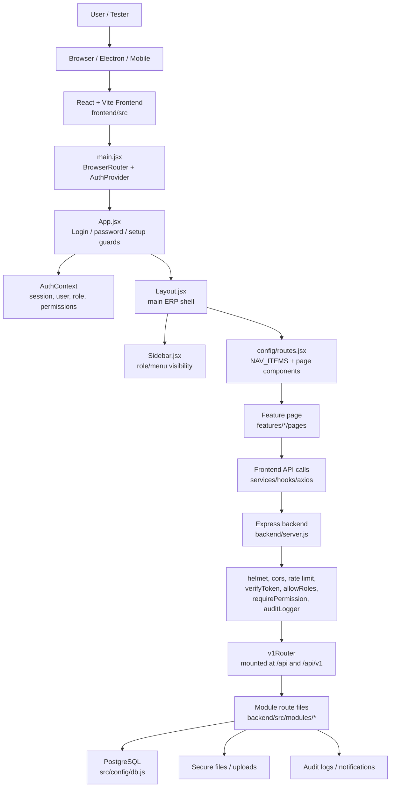

## 2. Main Module Connection Diagram

This is the enterprise-centric view: every business object shown has both an
upstream source and a downstream destination — nothing terminates inside its
own department. Solid arrows are wired in code; dashed arrows are business
connections the flow needs but that are missing or incomplete today (see §18
for the evidence behind each one).

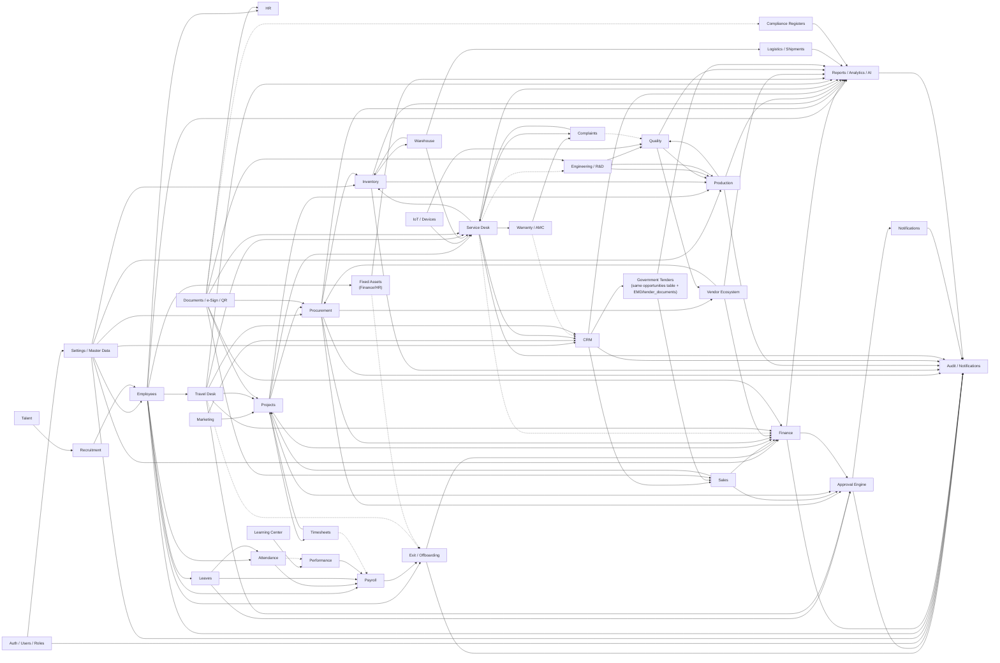

## 3. Best Manual Testing Order

1. Auth, login, password-change, setup wizard
2. Sidebar visibility and role permissions
3. Settings, master data, workflows, access control
4. Employees and HR
5. Attendance, Leaves, Payroll
6. Finance, Fixed Assets
7. Procurement, Vendor, Inventory, Warehouse, Logistics
8. Production, Quality, Engineering, Compliance
9. CRM, Tenders, Sales, Projects, Service Desk
10. Documents, e-Signatures, QR
11. Reports, Analytics, Notifications, Audit Logs, Global Search

## 4. Core System Modules

### Auth / Users / Roles / Permissions

Frontend:

- `/login`
- `/ForcePasswordChange`
- `frontend/src/context/AuthContext`
- `frontend/src/features/admin`
- `frontend/src/features/settings`

Backend:

- `backend/src/auth`
- `backend/src/middlewares`
- `backend/server.js`

Features to test:

- Login with valid credentials
- Login with invalid credentials
- Token/session restore after browser refresh
- Logout
- Forgot password, OTP, reset password
- Forced first-login password change
- Profile update
- Password change
- User preferences
- Role creation/editing
- Menu permissions
- Module permissions
- Direct URL blocking for unauthorized pages

Connections:

- Every module depends on Auth.
- Sidebar visibility depends on role and menu permissions.
- Backend routes depend on `verifyToken`, `allowRoles`, and `requirePermission`.
- Mutating actions should feed Audit Logs.

Manual checks:

- `employee` cannot see admin pages.
- `admin` cannot see super-admin-only pages if restricted.
- `super_admin` can see all modules.
- Hidden menu items are also blocked by direct URL/API permission.

### Settings / Master Data / Setup

Frontend:

- Settings Center
- Setup Center
- Company Profile
- Branch Management
- Access Control
- Workflow Builder
- Integrations
- System Settings
- Product Setup
- Master Setup
- Order Policy
- Asset Maintenance
- Setup Notifications
- Organization Setup

Backend:

- `backend/src/modules/admin`
- `backend/src/modules/master`
- `backend/src/modules/wizard`
- `backend/src/modules/integrations`

Features to test:

- Company setup
- Branch setup
- Department/designation/master setup
- Product setup
- Order policy setup
- Workflow configuration
- Approval workflow setup
- Integration settings
- Setup wizard completion
- Setup progress tracking
- System health for admin/super admin

Connections:

- Employees use company, branch, department, designation.
- Procurement, Inventory, Production, Finance use master records.
- Workflows connect to Approvals.
- Integrations connect to Documents, Finance, Sales, Notifications.

Manual checks:

- New branch appears in employee/project/finance forms.
- Workflow changes affect approval routing.
- Setup wizard redirects only when setup is incomplete.

### Approval Engine

Backend: `backend/src/modules/approvals`

Not a page module in its own right — it is shared infrastructure every other
module routes through, so it was previously undocumented even though it is
one of the most-connected pieces of code in the system. Confirmed in code
(2026-07-27): `approvals.controller.js` calls `logAudit(...)` on every
approve, reject, escalate, and delegate action (12 call sites), and separately
fires notifications on the same actions — so the chain **Approval Engine →
Notifications → Audit Logs** is real and already closed, not aspirational.

Connections:

- Leave, Travel, Procurement (PR/PO), Sales (discounts/quotes), Projects, and
  Finance all raise approval requests into this engine.
- Every decision (approve/reject/escalate/delegate) writes to Audit Logs and
  triggers a Notification — confirmed, not diagram-only.
- The final module (the one that raised the request) is updated by that
  module's own code after the approval callback — the engine itself does not
  mutate source records.

Manual checks:

- Raising a request in any of the modules above creates a row the approver
  can see.
- Approve/reject/escalate/delegate all produce an audit log entry.
- The requester receives a notification on decision.

**Nav-reachability fixed 2026-07-30.** `getPendingApprovals` (the read path
`ApprovalCenter.jsx` actually calls) has no role gate — it shows every
company-wide *unassigned* Leave/OT/PR/Expense/ECN/Payment item to any
authenticated user (`approver_id == null || approver_id === userId`, no role
check). Those 6 categories never populate `approver_id` before a decision is
made, so they always land in the "unassigned" bucket. Acting on an unassigned
item requires `approvals.authz.js`'s `APPROVER_ROLES` membership — so any role
holding the sidebar's `'Approvals'` section without that membership got a
populated-looking queue where every Approve/Reject 403s, surfaced by
`ApprovalCenter.jsx` as a generic "Failed to approve — try again" toast that
can never succeed. Found 9 such roles (`hr_exec`, `accounts_exec`,
`sales_exec`, `procurement_exec`, `store_keeper`, `production_engineer`,
`qc_engineer`, `design_engineer`, `service_engineer`) — removed `'Approvals'`
from their `ROLE_SECTION_ALLOWLIST` entries in `menuCatalog.js`, same pattern
as the existing F16 fix for `project_manager`/`sales_manager`/
`service_manager`. Regularization/probation items assigned by identity
(reporting-manager hierarchy / name lookup, not role) still reach these roles
via notifications regardless of this allowlist entry — the ownership check in
`canActOnApproval` requires no role membership, only `approver_id === me`.
**Separately found, not fixed:** `GET /approvals` (`getAllApprovals`) has no
role or `approver_id` scoping at all (company-scoped only) — unused by the
frontend (`ApprovalCenter.jsx` only calls `/approvals/pending`) but reachable
by any authenticated user via direct API call. Fits the existing tracked
authz-coverage gap; flagged, not yet closed.

**Second, complementary read/write mismatch fixed same day.** The 9-role nav
fix above closes the gap for roles with no `APPROVER_ROLES` membership at all.
A narrower but still-real version of the same "visible but not actionable"
defect remained for roles that **are** approvers: `getPendingApprovals`
decides read-path visibility with `isSupervisor(req)` (`role(req)` —
`req.user.role`, the legacy **singular** primary-role field), which is a wider
set (`super_admin`, `admin`, `manager`, `l1_manager`, `l2_manager`,
`l3_manager`, `hr`) than `approvals.authz.js`'s `OVERRIDE_ROLES`
(`super_admin`, `admin` only). A `manager`/`hr` viewer is `isSupervisor`, so
the ownership filter is skipped entirely for them and they see **every**
company row — including ones `approver_id`-assigned to a specific other
person — with the same live-looking Approve/Reject buttons. Clicking one not
actually theirs 403s via `canActOnApproval`'s ownership check, since `manager`/
`hr` aren't `canOverride`. Live-verified with a real DB row (a regularization
request assigned to a different specific user): `manager` saw it (`can_act:
false`), the actual assignee saw it with working buttons (`can_act: true`).

Fixed by computing `can_act` per row in `getPendingApprovals`
(`approvals.controller.js`) — reusing `canOverride`/`isApproverRole`/
`canClaimCategory` from `approvals.authz.js` (no new authz logic, single
source of truth) — and having `ApprovalCenter.jsx` hide the row checkbox and
Approve/Reject controls (rendering a muted "View only" badge instead) whenever
`can_act === false`, both in the table row and the detail side-panel. Rows
without the field (defensive default) still render live controls, so this
can only ever hide a control, never wrongly show one that used to be hidden.
Does not touch `ROLE_SECTION_ALLOWLIST` or any role list — purely a read-path
annotation + frontend render guard, complementary to (not overlapping with)
the 9-role sidebar fix above.

**Noted, not fixed (separate, pre-existing):** `isSupervisor`'s use of the
singular `req.user.role` instead of the many-to-many `rolesOf(req)` (see
[[project_roles_many_to_many]]) is itself the recurring "never `req.user.role`"
anti-pattern — a user whose *primary* role differs from their functional one
(e.g. every pilot account provisioned by `pilot-provision.mjs`, whose `users.role`
column is left at its `'user'` default while the real role lives only in
`user_roles`) is silently NOT treated as a supervisor by this function. Already
flagged elsewhere as unfixed pilot-data drift; not re-fixed here to avoid
scope creep on an unrelated script.

### Global Search

Frontend: `frontend/src/components/GlobalSearch.jsx`, mounted from
`frontend/src/components/Topbar.jsx`  
Backend: `backend/src/modules/search/global-search.routes.js`

Also not a page module in its own right — it is a shell-level component (like
the Approval Engine, cross-cutting infrastructure rather than a
`features/<module>` page), so it was previously undocumented despite touching
almost every business object in the system.

Connections:

- `GET /global-search?q=` (confirmed in code) queries employees, BOMs,
  production orders, customers, projects, complaints, invoices, and inventory
  items in one call, returning grouped results with deep-link page keys.
- Every module above is a read-only source for Search; Search has no write
  path and creates no downstream record — it is a lookup index, not a
  business-flow step, which is why it is not drawn into §2's flowchart (its
  edges would be a fan-in from nearly every node with no business meaning).

Manual checks:

- Searching a known employee name, BOM code, PO/production order number,
  customer name, project name, complaint ID, invoice number, and inventory
  item code each return a result in the correct group.
- Each result's deep link opens the correct source record.
- Query under 2 characters returns an empty result set rather than erroring.

## 5. People Modules

### Employees

Frontend: `frontend/src/features/employees`  
Backend: `backend/src/employees`

Features to test:

- Employees Dashboard
- All Employees
- Add employee
- Edit employee
- Employee detail
- Ex-Employees
- Employee reports
- Employee analytics
- Employee directory
- Salary revisions
- Status change
- Offboarding
- Rehire
- Employee upload/photo/document where available

Connections:

- Recruitment can create employee records.
- HR extends employee lifecycle.
- Attendance uses employee records for punches and shifts.
- Leaves uses employee records for balances and approvals.
- Payroll uses employee, salary, attendance, and leave data.
- Timesheets use employee/project allocation.
- Org Chart uses reporting hierarchy.
- Travel, Asset allocation, Performance, and Learning all key off the
  employee record — the lifecycle does not stop at Payroll (see §18 Employee
  Lifecycle).
- Exit/Offboarding is the terminal step, and gates on outstanding Travel
  advances and unreturned Assets before Full & Final settlement — **fixed
  2026-07-28** (Exit Clearance Engine, see §18.1 #1/#2): `exit.routes.js`'s
  `computeClearanceBlockers()` now queries `employee_asset_allocations`
  (status != 'returned'), `travel_advances` (amount − settled_amount > 0),
  and `users.is_active` live, and `POST /fnf/:id/pay` 409s with the specific
  blocker list until all clear, alongside the pre-existing Finance/Manager/HR
  NOC sign-offs (now audit-stamped via `finance_noc_by`/`manager_noc_by`/
  `hr_noc_by`).

Manual checks:

- Created employee appears in directory, attendance, leave, payroll, org chart.
- Offboarded employee moves to Ex-Employees.
- Inactive employee should not appear in new payroll/attendance flows.
- Rehired employee returns to active lists.
- Exit an employee with an open travel advance or an allocated asset — F&F
  pay now 409s listing the specific blockers (fixed 2026-07-28, was a known
  gap, §18.1 #1/#2).
- **Workflow Dependency Engine (Priority 7, fixed 2026-07-29)**: closing an
  exit request used to be reachable two ways — the gated `POST /fnf/:id/pay`
  (checks clearance) and the generic `PUT /exit/requests/:id` (`{status:
  'closed'}`, no checks at all — `GET /active` already treats `'closed'` as
  done via `WHERE status NOT IN ('closed','paid')`). The generic endpoint now
  refuses `status:'closed'` unless `fnf_status` is already `'paid'`, i.e. the
  gated path was actually used. Live-verified: direct-close attempt on a
  `fnf_status='draft'` row 409s and leaves the row untouched; other statuses
  (active/rejected/cancelled) are unaffected.

### HR

Frontend: `frontend/src/features/hr`  
Backend: `backend/src/modules/hr`

Features to test:

- Announcements
- Payroll Center entry points
- Employee Directory
- Probation
- Policies
- HR Documents
- Offboarding
- Exit Management
- Employee Documents
- Self Service
- Succession Center
- Asset Management
- Employee skills
- Onboarding
- HR widgets
- HR master data

Connections:

- Employees provide base records.
- Documents stores HR files and policies.
- Payroll consumes employee salary/self-service data.
- Learning and Performance consume skills/competency data.
- Notifications alert employees for HR events.
- Asset Management (HR) allocates assets at hire (`AddEmployee.jsx` /
  `EditEmployee.jsx` POST to `/employee-assets` on save). The return side used
  to be cosmetic (the clearance form's `it_assets_returned` checkbox didn't
  gate anything); **fixed 2026-07-28** — `/fnf/:id/pay` now blocks on a live
  count of `employee_asset_allocations` rows still `status='allocated'` (or
  `'under_maintenance'`) for that employee (the manual checkbox itself is
  left as-is for historical notes, but is no longer what settlement checks),
  matching the sibling `access_revoked` checkbox in the same form, which
  genuinely deactivates the login. **Same day, also built out the rest of the
  Asset Lifecycle** (Priority-1 "Allocation → Transfer → Maintenance → Return
  → Disposal"): `employee-assets.routes.js` gained `POST /:id/transfer`
  (reassigns to another employee, keeps the same row/history via
  `logAudit` rather than a blind return+recreate), `POST /:id/maintenance` +
  `/maintenance/complete` (temporary `status='under_maintenance'`, still
  blocks exit clearance — the asset hasn't left the employee's custody),
  and `PATCH /:id/dispose` (terminal `status='disposed'`, which the Exit
  Clearance query now excludes since a written-off asset isn't anyone's
  outstanding responsibility). New migration
  `20260728000005_employee_asset_lifecycle.js`. See §18.1 #1/#2.

Manual checks:

- Active announcement appears in correct surfaces.
- Uploaded HR document is permission controlled.
- Exit/offboarding changes employee status correctly.
- Mark an asset returned via `PATCH /employee-assets/:id/return` (sets
  `status='returned'`), then check the Exit Clearance Tracker's "Assets"
  column flips to Clear and `/fnf/:id/pay` unblocks once the other five
  blockers are also clear (fixed 2026-07-28, was a known gap, §18.1 #1/#2).

### Recruitment

Frontend: `frontend/src/features/recruitment`  
Backend: `backend/src/modules/recruitment`

Features to test:

- Recruitment Dashboard
- Recruiter Dashboard
- Job Requisitions
- Job Openings
- All Candidates
- Candidate Pipeline
- Interview Scheduler
- Offer Management
- Onboarding Checklist
- Email Templates
- Hiring Forecasts
- Employee Auto-Creation
- Recruitment Settings

Connections:

- Talent provides resumes, pools, agencies, question bank.
- Accepted offer feeds onboarding.
- Onboarding can create Employee record.
- Notifications/email inform candidates and interviewers — **fixed
  2026-07-29 (Priority 8, Business Event Bus pass)**: `services/
  notificationService.js`'s `createNotification()` inserted into columns
  that don't exist (`module`/`record_id` — the real table has `module_name`/
  `reference_id`) and never supplied `title`, which is `NOT NULL`. Every one
  of this module's 7 notify() call sites (new candidate, interview
  scheduled, offer sent, stage change, …) has silently notified nobody since
  this was written — confirmed the only importer app-wide, so the fix's
  blast radius is fully contained to this module. Independently verified
  live: an earlier fix at one call site (line ~433's comment) corrected a
  *different* bug (wrong interviewer-ID lookup) but never traced through to
  this shared root cause, so notifications still silently failed even after
  that fix. **Consolidated 2026-08-03**: rather than keep the standalone,
  once-broken `notificationService.js` alive as a fifth notification
  pathway, `recruitment.routes.js`'s `notify()` wrapper now calls the shared
  `modules/notifications/repositories/notifications.repository.js`'s
  `create()` directly (same external signature, so none of the 7 call sites
  changed). `notificationService.js` had zero other real importers
  (confirmed repo-wide; the two remaining hits were prose comments in
  `eventBus.js` and `signatures.routes.js`, not imports) and has been
  deleted. This also means Recruitment's notifications now mirror to mobile
  push (`notifications.repository.js`'s `create()` calls `sendPushToUser()`
  when configured), which the old service never did.
- **Security fix 2026-08-04**: all 6 `update*()` functions in
  `recruitment.repository.js` (`updateRequisition`/`updateOpening`/
  `updateCandidate`/`updateInterview`/`updateEmailTemplate`/`updateOffer`)
  built their `SET` clause by interpolating `req.body`'s own keys directly
  into the SQL string (`fields.push(`${k} = $${n++}`)`, no allowlist) —
  the same mass-assignment/SQL-injection-via-key shape already fixed
  elsewhere in the codebase via `shared/safeUpdate.js` (see
  [[project_safe_update_repo_guard]]). Any caller with recruitment write
  access could set `company_id` (jump the record to a different tenant),
  `deleted_at` (soft-delete via a normal edit), or a crafted JSON key
  (inject an extra assignment into the same UPDATE). All 6 now use
  `pickUpdatable()` — schema-derived allowlist, `company_id`/`deleted_at`/
  etc. protected — and the 5 tables that have a `company_id` column
  (`job_requisitions`/`job_openings`/`candidates`/`interview_schedules`/
  `offer_letters`; confirmed live against `information_schema` — all true
  except `email_templates`) now also scope the `WHERE` clause by tenant,
  which none of the 6 did before (any authenticated user could update any
  other tenant's requisition/opening/candidate/interview/offer by guessing
  its integer id — a separate, equally real gap in the same code).
  `email_templates` gets the allowlist fix only, matching its existing
  unscoped-everywhere-else shape. Route call sites in
  `recruitment.routes.js` updated to pass `cid(req)`. Verified live: ran
  `pickUpdatable()` against all 6 tables with a payload containing
  `company_id`/`deleted_at`/an injection-shaped key/a fake column — only
  real, unprotected columns survived for every table.
- **Requisition approval wired into the Approval Center (2026-08-04)**:
  `job_requisitions.status` already has a real DB CHECK-constrained
  lifecycle (`draft -> pending_approval -> approved -> open -> closed`) and
  `JobRequisitionPipeline.jsx` already renders it as distinct pipeline
  stages — but nothing previously enforced the `pending_approval ->
  approved` transition or surfaced it to an approver: any recruitment user
  could self-approve via the raw `PUT /requisitions/:id`. Added
  `pendingRequisitions(companyId)` to `approvals.controller.js`'s
  `getPendingApprovals` aggregator (same shape as `pendingPurchaseRequests`/
  `pendingECNs`) and a `case 'requisition':` in both `approveSourceItem`
  and `rejectSourceItem`, so `POST /approvals/requisition:<id>/approve`
  (role-gated by the existing `canActOnApproval`/`APPROVER_ROLES`, no
  changes needed there — `hr`/`hr_manager` are already unscoped approvers,
  same as every other role in `APPROVER_ROLES` not narrowly scoped via
  `APPROVER_CATEGORY_SCOPE`) now does the write, with `logAudit` and
  `notifyWorkflowEvent` for free from the shared `approveRequest`/
  `rejectRequest` wrappers. `job_requisitions` has no `approved_by` column
  (unlike `pr`/`ecn`), so like those two it stays in the shared unassigned
  pool rather than being narrowly scoped — deliberately not narrowed to
  HR-only the way `procurement_manager`→`pr` is, since that would require
  auditing and re-scoping several other already-unscoped roles
  (`manager`/`finance`/`finance_manager`/`payroll_admin`) to avoid
  regressing their existing access elsewhere, a separate and much larger
  change than this pass — see `approvals.authz.js`'s own "PROPOSED MATRIX —
  REVIEW BEFORE EXTENDING TO OTHER MODULES" comment. The raw
  `PUT /requisitions/:id` now 400s if
  `status: 'approved'` is sent directly, closing the bypass. **No
  `rejected` status exists in the CHECK constraint** — reject bounces the
  row back to `draft` for the requester to revise; the rejection comment is
  preserved in the `approvals` history row and `logAudit`, not on
  `job_requisitions` itself (no column for it). Frontend: `moveStatus()`
  now calls the Approval Center endpoint instead of the raw PUT specifically
  for the `approved` transition; a new Reject button + optional reason field
  appears only while a requisition is `pending_approval`.
- **Offer approval wired into the Approval Center (2026-08-04, follow-up
  pass)**: `offer_letters.offer_status` has no CHECK constraint (plain
  VARCHAR, confirmed live — unlike `job_requisitions.status`), so no
  migration was needed to add `pending_approval` as a state between `draft`
  and `sent`. Same shape as requisitions: `approvals.controller.js` gained
  `pendingOffers(companyId)` in the aggregator and a `case 'offer':` in both
  `approveSourceItem`/`rejectSourceItem` (cast `$1::uuid`, not `::integer` —
  `offer_letters.id` is a UUID PK, unlike `job_requisitions.id`).
  `PUT /recruitment/offers/:id` now 400s on `offer_status: 'sent'` sent
  directly, same enforcement pattern as the requisition gate. Approve sets
  `offer_status = 'sent'` **and** `offer_sent_date = CURRENT_DATE` — the
  latter previously only got set if a caller happened to pass it explicitly
  to the raw PUT, which the UI's old "Send" button never did, so
  `getTimeToHire()`'s `AVG(offer_sent_date - candidate.created_at)` silently
  excluded every offer sent through the UI from its average. Reject bounces
  back to `draft`, same as requisitions. The candidate-facing "offer sent"
  email (`triggerEmail('offer_sent', ...)`) moved from the now-gone direct-
  PUT code path into the approve case, using `recruitmentRepository.
  findOfferById()` for the candidate_name/email/job_title fields — also
  fixed `designation`/`ctc` to read `job_title`/`offered_salary` instead of
  the previously-undefined `offer.designation`/`offer.ctc` fields (offer_letters
  has no such columns; the email template rendered blank there before).
  Frontend (`OfferManagement.jsx`): "Send" button now submits to
  `pending_approval` instead of writing `sent` directly; a new
  `pending_approval` row shows "Approve & Send"/"Reject" buttons calling
  `/approvals/offer:<id>/approve|reject`. Verified live end-to-end (submit →
  400 on direct-sent bypass → approve → `offer_sent_date` populated;
  separately, submit → reject → back to `draft`).
- **HR Analytics' offer-acceptance/time-to-hire cards fixed at the root cause
  (2026-08-04)**: `analytics.routes.js`'s top-level `/analytics/
  offer-acceptance` and `/analytics/time-to-hire` (consumed by
  `hr-analytics/components/OfferAcceptanceCard.jsx` and `TimeToHireCard.jsx`
  — flagged 80% duplicate of Recruitment's own analytics in the enterprise
  dependency report this pass worked through) independently reimplemented
  both metrics against `candidates.status`/`candidates.stage` — real
  columns, but **nothing in the entire app ever writes to them** (the live
  fields are `overall_status`/`current_stage`; offer status itself lives on
  `offer_letters`, not `candidates`, regardless). Confirmed via a repo-wide
  write-path grep before touching anything: every `candidates` UPDATE in
  `recruitment`/`talent` writes `current_stage`/`overall_status`, never the
  bare `status`/`stage` columns. These two HR Analytics cards have therefore
  shown 0% / "No data yet" since they were built, silently — same
  wrong-column shape as several other bugs already catalogued in
  `PULSE_EVENT_ORCHESTRATION_ARCHITECTURE.md`. Rather than duplicate a
  *correct* copy of the query, both routes now delegate to
  `recruitmentRepository.getOfferAcceptanceRate()`/`getTimeToHire()` — the
  same functions Recruitment's own `/recruitment/analytics/
  offer-acceptance-rate` and `/recruitment/analytics/time-to-hire` already
  used correctly (real source: `offer_letters.offer_status`). Both functions
  extended (not replaced) to return the extra fields the HR Analytics cards
  need (`offered`/`declined`; `min_days`/`max_days`/`matched`) while keeping
  every pre-existing field name, so Recruitment's own
  `HiringForecasts.jsx` — the only other consumer — needed no changes.
  Verified live: inserted a synthetic candidate + one accepted + one
  declined offer, confirmed both functions now return real non-zero
  numbers, cleaned up. **`hiring-trend` (the third component the report
  flagged, `HiringTrendChart.jsx`) was deliberately left alone** — it
  queries `employees.joining_date`, a real, correctly-used field, so unlike
  the other two this one isn't broken; merging it is a genuine
  architecture-ownership question (does "hiring trend" belong to
  candidates-reaching-a-stage or employees-actually-joining — arguably the
  latter, which is what it already uses), not a bug fix, so it wasn't
  touched this pass.
- Reports track funnel, time-to-hire, offer acceptance.
- **Resume/offer-letter storage is fragmented across 3 systems, none of which
  is `document_master` (2026-08-04, documented not fixed)**: `POST
  /recruitment/candidates` uploads the resume to S3/local via
  `services/StorageService.js` (→ `candidates.resume_file_url`) *and*
  separately to Google Drive via `recruitmentDriveService.js`'s
  `uploadResume()` (folder-by-stage, moved on `move-stage`/`hire`); `POST
  /talent/resumes` uploads to Drive a third way, directly through
  `services/googleDrive.service.js` into a flat "Unsolicited Resumes" folder,
  bypassing `recruitmentDriveService.js` entirely. `document_master`
  (`backend/src/modules/documents`) — the module with real versioning,
  approval status, and company scoping — is a fourth, unrelated system that
  none of these three touch. There is also **no offer-letter file upload
  feature at all** (`offer_letters` has no attachment column and no route
  writes one) — the original ask to "route offer-letter storage through
  Documents module conventions" has nothing to migrate. Consolidating onto
  `document_master` is a real architecture decision (which backend becomes
  canonical — S3 serves `resume_file_url` downloads today, Drive gives
  recruiters the folder-by-stage view they already use) with real regression
  risk to resume download links and Drive folder browsing if picked wrong;
  deliberately left unresolved rather than guessed at.
- **Shared UI components adopted on 3 of 7 flagged pages (2026-08-04)**:
  `AllCandidates.jsx` (table + filters) and `RecruitmentDashboard.jsx`'s Open
  Positions tab now use `components/core/DataTable`+`FilterBar` instead of a
  hand-rolled `<table>`; `TalentPoolDetail.jsx`'s pool-members table also
  moved to `DataTable`. `RecruitmentReports.jsx`'s own duplicate `exportCSV()`
  function was deleted in favor of `features/_shared/exportUtils.js`.
  **Deliberately left alone**: `ResumeDatabase.jsx` and
  `RecruitmentAgencies.jsx` render candidates/agencies as visual cards, not
  table rows — forcing `DataTable` there would be a UX regression (losing
  resume-skill-chip layout / agency stat cards for a dense grid), not a fix;
  `ResumeDatabase.jsx`'s stage/skill filters are click-to-toggle pill
  selectors, a deliberate pattern `FilterBar`'s dropdown/multiselect controls
  don't reproduce. `RecruiterDashboard.jsx` has no table or filter bar at all
  (pure stat cards + lists) — nothing to swap. Verified via `esbuild` syntax
  check on all touched files (no visual/browser verification was available
  this pass — check each swapped page renders and sorts/exports correctly
  before trusting it).

Manual checks:

- Candidate moves through stages correctly.
- Offer acceptance triggers onboarding.
- Employee auto-creation creates correct employee master.
- Schedule an interview with an interviewer set — a real notification row
  should now appear for them (fixed 2026-07-29, was silently a no-op).
- Try editing a requisition/opening/candidate/interview/offer as a non-admin
  — confirm the write still succeeds for legitimate fields and still stays
  scoped to your own company (fixed 2026-08-04).
- Submit a requisition to `pending_approval`, then as an `hr`/`hr_manager`
  (or other unscoped approver role) user open Approval Center — it should
  appear there and Approve/Reject should work; as a non-approver role,
  `PUT /recruitment/requisitions/:id { status: 'approved' }` should 400
  (fixed 2026-08-04).
- Accept an offer letter, then check the HR Analytics dashboard's Offer
  Acceptance and Time to Hire cards — should show real numbers, not 0%/"No
  data yet" (fixed 2026-08-04, was always zero).
- Create an offer, click Send — should submit for approval, not send
  immediately; approve it as an approver role — status becomes `sent` and
  the candidate email fires; reject it — status returns to `draft`
  (fixed 2026-08-04).
- All Candidates, Talent Pool detail, and Recruitment Dashboard's Open
  Positions tab now use the shared `DataTable` — check sort, column
  show/hide, and CSV export still work and row actions (View, Pipeline,
  Remove) still fire correctly (2026-08-04).

### Talent

Frontend: `frontend/src/features/talent`  
Backend: `backend/src/modules/talent`

Features to test:

- Resume Database
- Talent Pools
- Question Bank
- Agencies
- Recruiter sourcing data

Connections:

- Talent feeds Recruitment.
- Question Bank supports interviews/assessments.
- Agencies feed source reporting.

Manual checks:

- Resume/candidate can be moved into Recruitment pipeline.
- Agency attribution appears in recruitment reports.

### Learning Center

Frontend: `frontend/src/features/hr`, `frontend/src/features/talent`  
Backend: `backend/src/modules/hr`

Features to test:

- L&D Command Centre
- Training Calendar
- Learning Paths
- Assessments
- Certifications
- Skill Matrix
- Competency Framework
- Trainer Management
- Training Reports
- L&D Settings
- Knowledge management

Connections:

- Employees are assigned training and skills.
- Performance uses competencies.
- Succession uses skills and certifications.
- Reports show training completion and certification expiry.

Manual checks:

- Training assignment appears for employee.
- Completed certification updates employee profile.
- Expiring certification appears in reports/alerts.

### Performance

Frontend: `frontend/src/features/performance`  
Backend: `backend/src/modules/performance`

Features to test:

- My Reviews
- Goals and KPIs
- 360 Feedback
- Team Performance
- Performance Settings
- Review cycles
- KRA
- OKR
- Calibration
- Increments
- Promotions
- Performance reports

Connections:

- Employees provide review participants and hierarchy.
- Learning provides skills/competency data.
- Payroll can consume increments/promotions.
- HR uses performance history for succession.
- Attendance discipline (punctuality/overtime pattern) is a natural review
  input but is **not wired**: `backend/src/modules/performance` has no
  reference to attendance data. See §18.

Manual checks:

- Review cycle assigns correct employees.
- Manager feedback respects hierarchy.
- Approved increment/promotion updates downstream data where applicable.

## 6. Attendance, Leave, Payroll

### Attendance

Frontend: `frontend/src/features/attendance`  
Backend: `backend/src/modules/attendance`, `backend/src/modules/holidays`

Features to test:

- Live Workforce
- My Attendance
- QR Attendance
- Team Attendance
- Shift Calendar
- Regularization
- Overtime
- Approval Delegation
- Attendance Reports
- Work Centres
- Contract Labour
- Payroll Sync
- Attendance Settings
- Attendance Audit Logs
- Offline punch sync
- Device/biometric settings
- Geo-fencing and face attendance if enabled

Connections:

- Employees provide workforce records.
- Leaves affects absence and payable days.
- Payroll uses attendance, overtime, late marks, unpaid days.
- Reports/Analytics consume attendance data.

Manual checks:

- Punch appears in My Attendance and Team Attendance.
- Regularization request appears for approval.
- Approved overtime is available for payroll sync.
- Leave day is not treated as unapproved absence.

### Leaves

Frontend: `frontend/src/features/leaves`  
Backend: `backend/src/modules/leaves`

Features to test:

- My Leaves
- Apply Leave
- Leave Approvals
- Team Leaves
- Leave Calendar
- Holiday Calendar
- Comp Off
- All Leaves
- Leave Reports
- Encashment
- Leave Settings
- Accruals
- Leave balance
- Leave policies

Connections:

- Employees provide employee and manager hierarchy.
- Attendance consumes approved leave days.
- Payroll consumes unpaid leave, encashment, comp-off.
- Approvals routes approval actions.
- Notifications inform requesters/approvers.

Manual checks:

- Applying leave follows workflow.
- Approved leave reflects in attendance calendar.
- Rejected leave does not affect payroll.
- Encashment posts to payroll/finance if implemented.

### Payroll

Frontend:

- Payroll Center
- My Payslip
- Salary Structure

Backend:

- `backend/src/modules/payroll`
- `backend/src/modules/finance`

Features to test:

- Salary structure setup
- Salary component setup
- Payroll processing
- Payslip generation
- Payslip viewing
- Payroll reports
- Payroll compliance
- Employee self-service tax/IT declarations if enabled
- Attendance sync
- Leave sync
- Overtime sync

Connections:

- Employees provide active employee list.
- Attendance provides payable days and overtime.
- Leaves provides unpaid leave and encashment.
- Performance can feed increments/promotions.
- Finance receives salary accounting/payment postings.

Manual checks:

- Payroll excludes inactive employees.
- Attendance/leave changes affect payable days.
- Payslip matches salary structure.
- Finance posting appears after payroll completion if supported.

## 7. Finance and Commercial Modules

### Finance

Frontend: `frontend/src/features/finance`  
Backend: `backend/src/modules/finance`

Features to test:

- Finance Dashboard
- Accounting Engine
- Chart of Accounts
- Journal Entry
- Period Closing
- Receivables
- Payables
- Payments
- Tax & Compliance
- GST
- TDS
- TCS
- Budget Management
- Fixed Assets
- Forex
- Cost Centers
- Financial Statements
- Financial Reports
- Customers & Suppliers
- Finance Settings

Connections:

- Sales creates receivables.
- Procurement creates payables.
- Payroll creates salary postings.
- Projects create cost/revenue tracking.
- Inventory and Fixed Assets affect valuation.
- Travel/expenses create reimbursements/payments.
- Fixed Assets → Finance is a real, confirmed closed loop:
  `assets.routes.js`'s `POST /run-depreciation` writes
  `asset_depreciation_log` **and** posts a Depreciation journal entry
  (debit Depreciation Expense / credit Accumulated Depreciation) in the same
  request — this is not just a diagram aspiration.
- Service billing → Finance receivables is **not confirmed**: no route file
  under `backend/src/modules/servicedesk` references `invoice`, `receivable`,
  or `finance`. AMC/service revenue does not appear to post to Finance
  through a wired path. See §18.
- Period Closing → journal entries — **fixed 2026-08-04 (§24)**: the endpoint
  `PeriodClosing.jsx` actually calls (`/finance/periods/:id/close`) previously
  had no draft-entry guard and never stored a period summary, unlike the
  equivalent-but-unreached `/accounting/periods/:id/close`. Both checks are
  now in the reachable endpoint.

Manual checks:

- Sales invoice/order appears in receivables if implemented.
- Purchase receipt/bill appears in payables.
- Payment updates payable/receivable status.
- Journal entries affect statements.
- Period closing controls backdated posting — verify by attempting to close a
  period with a draft journal entry inside its date range (should 400) and
  confirming `period_summary` is populated on a successful close (§24).

### Fixed Assets / Asset Register

Frontend: `frontend/src/features/assets/pages/AssetRegister.jsx`  
Backend: `backend/src/modules/assets`

`AssetRegister.jsx` has no curated `NAV_ITEMS` entry in `routes.jsx` — it is
reached through the `autoRouter.js` orphan-page fallback (`FOLDER_CONFIG.assets
= { module: 'assets' }` in `frontend/src/config/autoRouter.js`), gated on the
`assets` module permission seeded by
`20260719000001_seed_role_permission_gaps.js`. This is why it was previously
invisible to this manual even though it is a real, live module — see §16 for
how to recognize other orphan-routed pages.

Features to test:

- Asset register / capitalization
- Employee allocation
- Depreciation run
- Disposal

Connections:

- Procurement/Purchase creates the asset record.
- HR/Employees allocates the asset at hire — confirmed real:
  `AddEmployee.jsx`/`EditEmployee.jsx` POST to `/employee-assets` on save
  (see HR section above).
- Finance receives depreciation postings — confirmed real: `assets.routes.js`'s
  `POST /run-depreciation` writes `asset_depreciation_log` and posts a journal
  entry (debit Depreciation Expense / credit Accumulated Depreciation) in the
  same request.
- Exit/Offboarding requires the asset to be returned before Full & Final —
  **fixed 2026-07-28**: `POST /fnf/:id/pay` now blocks while any
  `employee_asset_allocations` row for that employee is still
  `status='allocated'` (see Employees/HR sections above and §18.1 #1/#2).
- Reports/Analytics reads the register.

Manual checks:

- New asset appears on the allocated employee's profile.
- Running depreciation posts a journal entry visible in Finance.
- Disposing an asset removes it from the active register.
- Exiting an employee with an unreturned asset now blocks Full & Final
  payment with a 409 listing the pending asset(s) (fixed 2026-07-28, was a
  known gap, §18.1 #1/#2).

### CRM

Frontend: `frontend/src/features/crm`  
Backend: `backend/src/modules/crm`

Features to test:

- CRM Dashboard
- Enquiries / Leads
- Accounts
- Contacts
- Opportunities Kanban
- Won/Lost Leads
- CRM Email
- Customer 360
- Customer Health Engine
- Activities
- CRM Reports
- Pipeline Automation
- CRM Settings

Connections:

- CRM feeds Sales quotations/orders.
- Won opportunity can create project.
- Customer records connect to Service Desk and Finance.
- Customer 360 consumes sales, service, project, payment, complaint data.

Manual checks:

- Lead conversion preserves account/contact/opportunity data.
- Opportunity status updates dashboards/reports.
- Customer 360 shows linked sales/project/service data.

### Government Tenders

Frontend: `frontend/src/features/tenders/pages/TenderWorkspace.jsx`  
Backend: `backend/src/modules/tenders/tenders.routes.js`

A tender is not a separate business object — it's an opportunity-typed view:
`tenders.routes.js` is gated on the same `crm` permission as the rest of CRM
(`FOLDER_CONFIG.tenders = { module: 'crm' }` in `autoRouter.js`, "a tender IS
an opportunity" per the `menuCatalog.js` F17-pass comment), and it has no
curated `NAV_ITEMS` entry — like Fixed Assets above, it's reached only through
the `autoRouter.js` orphan fallback (see §16).

Features to test:

- Tender Workspace (opportunity-typed tender view)
- EMD (Earnest Money Deposit) tracking
- Tender Documents

Connections:

- Built directly on the `opportunities` table plus EMD and
  `tender_documents` — **`opportunity_number` is `GENERATED ALWAYS`; never
  insert it directly**, or the row fails.
- Shares CRM's downstream: a won tender converts the same way a won
  opportunity does, into Sales quotation/order (§2).
- Documents/e-Sign stores signed tender submissions.

Manual checks:

- Any role with CRM `view`/`edit` (e.g. `sales_manager`, `sales_exec`) can
  open the Tender Workspace without a dedicated "Tenders" permission existing.
- EMD amount and status track correctly against the tender.
- Tender documents upload/download respects the same permission as other
  CRM documents.
- Creating a tender never sends an explicit `opportunity_number` value.

### Sales

Frontend: `frontend/src/features/sales`  
Backend: `backend/src/modules/sales`

Features to test:

- Sales Command Center
- Quotations
- Sales Orders
- Sales Targets
- Sales Intelligence
- Pricing Engine
- Commission Management
- Fulfilment Tracking
- Sales Playbooks
- Sales Calendar
- Sales Documents
- Subscriptions
- Market Presence
- Partners
- Territories
- Competitors
- Sales Settings

Connections:

- CRM provides accounts, contacts, opportunities.
- Sales orders feed Projects, Production, Fulfilment, Finance.
- Pricing may consume product/inventory setup.
- Commission may feed Payroll/Finance.
- Documents/e-Sign handles signed quotes/contracts.
- Subscriptions is a **second, fully siloed renewal mechanism**: it has its
  own plan/billing-cycle/auto-renew/next-billing-date fields and manual
  pause/cancel/renew endpoints, but is wired to zero cron jobs and not linked
  to `amc_contracts`, sales orders, or Customer 360. Two independent renewal
  tracks exist instead of one pipeline. See §18.

Manual checks:

- Quote conversion creates sales order.
- Sales order links to project or delivery flow.
- Commission calculation matches sales data.
- Sales document appears in vault/signature flow.

### Marketing

Frontend: `frontend/src/features/marketing`  
Backend: `backend/src/modules/marketing`

Features to test:

- Marketing Dashboard
- Campaigns
- Campaign Analytics
- Assign Tasks
- Delivery Tracker
- Pursuit List
- Timesheet Entry
- Marketing Settings

Connections:

- Campaigns feed CRM leads — **confirmed real**: `crm.routes.js` references
  `campaign_id`, so lead-to-campaign attribution is a genuine, not
  aspirational, link.
- Marketing tasks may feed Projects/Timesheets.
- Campaign performance feeds Analytics.

Manual checks:

- Campaign source appears in CRM.
- Assigned task appears for responsible user.
- Marketing timesheet appears in reports.

## 8. Supply Chain, Production, Quality

### Procurement

Frontend: `frontend/src/features/procurement`  
Backend: `backend/src/modules/procurement`

Features to test:

- Purchase Requests
- PO Management
- Purchase Orders
- Goods Receipt
- Vendor Center
- MRP Planning
- Quality Inspection
- Procurement Reports
- Procurement Settings
- RFQ
- Three-way match
- Vendor registration and approval

Connections:

- Inventory receives goods after GRN.
- Warehouse handles inward/storage.
- Finance receives supplier bills/payables.
- Quality handles incoming inspection.
- Vendor ecosystem manages vendor health.
- Projects/Production can create procurement demand.

Manual checks:

- PR approval allows PO creation.
- PO receipt updates inventory/warehouse.
- GRN requiring inspection appears in Quality.
- Supplier bill/payable is generated or traceable.

### Vendor Ecosystem

Frontend: `frontend/src/features/procurement`  
Backend: `backend/src/modules/procurement/routes/vendor*`

Features to test:

- Vendor Master
- Vendor Center
- Vendor Registration Portal
- Vendor Approval
- Vendor 360
- Vendor Health Score
- Vendor Risk
- Vendor Portal
- Vendor Scorecard
- Vendor Pricing Comparison
- Vendor Documents

Connections:

- Procurement consumes approved vendors.
- Finance uses vendor data for payables.
- Quality uses vendor quality scores.
- Inventory uses vendor pricing/supply history.
- Documents stores vendor compliance files.
- Confirmed real: `vendorHealthEngine.js` computes an 8-dimension health
  score (quality, delivery, cost, support, compliance, financial, dependency,
  risk events) with quality weighted directly from NCR/CAPA/rejection data
  and delivery weighted from GRN on-time data — Quality and Procurement
  genuinely feed the Vendor Scorecard, this is not diagram-only.
- **Vendor Registration Portal → anonymous vendor — fixed 2026-07-29 (§18.1
  #15).** `VendorRegistration.jsx`'s 7-step wizard was correctly built and
  correctly public on the backend, but unreachable through the frontend
  router — see §18.1 #15 for detail.

Manual checks:

- Pending vendor cannot be used until approved if rule exists.
- Vendor health reflects PO, delivery, quality, payment data.
- Vendor documents are permission controlled.

### Inventory

Frontend: `frontend/src/features/inventory`  
Backend: `backend/src/modules/inventory`

Features to test:

- Inventory Dashboard
- Advanced Dashboard
- Item Master
- Stock Summary
- Stock Movements
- Batch Tracking
- Stock Alerts
- Reservations
- Material Consumption
- Inventory Intelligence
- Inventory Report
- Warehouse link
- Quality link
- Logistics link
- Stores Dashboard
- Stores Cost Analysis
- Component Pricing
- Inventory Settings

Connections:

- Procurement increases stock through GRN.
- Warehouse stores and dispatches stock.
- Production consumes materials and creates finished goods.
- Quality blocks/releases inspected stock.
- Finance uses valuation/costing.
- Sales/Projects reserve stock.

Manual checks:

- GRN increases stock.
- Production issue reduces raw material stock.
- Finished production increases finished goods stock.
- Reserved stock cannot be over-issued if controls exist.

### Warehouse

Frontend: Inventory > Warehouse  
Backend: `backend/src/modules/warehouse`

Features to test:

- Bins
- Zones
- Bin assignment
- Inward
- Pick lists
- Picking
- Dispatch
- Cycle count
- Inward QC
- Send to Quality
- Bin clear

Connections:

- Inventory owns stock records.
- Procurement creates inward receipts.
- Quality handles inward QC exceptions.
- Sales/Projects/Service request dispatch or issue.

Manual checks:

- Inward receipt creates bin quantity.
- Pick list reduces available stock after pick/dispatch.
- Cycle count variance updates or flags inventory.

### Logistics / Shipments

Frontend: `frontend/src/features/inventory/pages/LogisticsShipping.jsx`
(lives inside the Inventory feature folder, not a standalone one)  
Backend: `backend/src/modules/logistics/logistics.routes.js`

Tracks inbound and outbound `shipments` (courier partner, direction, status),
distinct from Warehouse's bin-level pick/dispatch. This is the module behind
the "Logistics link" bullet already listed under Inventory's features above —
it previously had no path, connections, or diagram node of its own.

**Access-control gap worth verifying**: unlike its Inventory/Procurement
neighbors, the `logistics` entry in `autoRouter.js`'s `FOLDER_CONFIG` has no
`module` key set, and `menuCatalog.js` has zero `logistics` references —
every other orphan-routed module in this manual (Tenders, Assets, Compliance,
IoT, R&D) has an explicit permission gate; this one appears not to.

Connections:

- Warehouse dispatch creates outbound shipments; procurement receipts can
  create inbound shipments.
- Reports/Analytics reads shipment data.

Manual checks:

- Creating a shipment records courier, direction, and status correctly.
- Confirm which role(s) can actually reach this page today, given the
  missing permission gate noted above — this may be broader than intended.

### Production

Frontend: `frontend/src/features/production`  
Backend: `backend/src/modules/production`

Features to test:

- Production Dashboard
- Module Production Batches
- Module Batch Requests
- BOM Builder
- BOM Modeling
- MRP Workbench
- CRP Workbench
- S&OP / RCCP
- Subcontracting
- Batch Genealogy
- Work Centre Planning
- Shop Floor
- Upload BOM
- Production Settings

Connections:

- Sales/Projects create production demand.
- Inventory supplies raw materials.
- Procurement covers shortages via MRP.
- Quality inspects production output.
- Engineering controls BOM/ECN changes.
- Finance receives manufacturing cost data.

Manual checks:

- BOM drives material requirement.
- MRP shortage creates procurement signal.
- Production consumption updates inventory.
- Completed batch creates finished goods/quality record.
- Genealogy traces batch to components.

### Quality

Frontend: `frontend/src/features/quality`  
Backend: `backend/src/modules/quality`

Features to test:

- Quality Dashboard
- NCR Management
- CAPA Management
- Inspection Center
- FAT / SAT
- Equipment Calibration
- Supplier Quality
- Quality Reports
- Quality Settings
- Disturbance events if enabled

Connections:

- Procurement sends incoming inspection.
- Production sends in-process/final inspection.
- Supplier quality updates vendor score (confirmed real — see Vendor
  Ecosystem above).
- Service Desk may create quality feedback/failure analytics — **not
  confirmed**: `backend/src/modules/quality` has zero references to
  `complaint`, `ncr`, or `capa`-linked complaint IDs. Repeated complaints do
  not currently generate an NCR/CAPA signal in code, despite being a natural
  QMS trigger. See §18.
- Engineering handles ECN/root cause changes.

Manual checks:

- Failed inspection blocks stock/production release if configured.
- NCR can trigger CAPA.
- CAPA closure updates status and reports.
- Supplier defect affects supplier quality metrics.

### Engineering / R&D / IoT

Frontend:

- `frontend/src/features/engineering`
- `frontend/src/features/rd`
- `frontend/src/features/iot`

Backend:

- `backend/src/modules/engineering`
- `backend/src/modules/rd`
- `backend/src/modules/iot`

Features to test:

- Engineering Dashboard
- Power Quality Analytics
- R&D Projects
- Prototype Tracker
- Test Plans
- ECN Management
- R&D artifact repository
- Product lifecycle/R&D records where available
- IoT device ingest
- IoT fleet management
- Device telemetry

Connections:

- Engineering updates Production BOM/process via ECN — **confirmed real**:
  `ecn.routes.js`'s implement step promotes any draft BOM version created
  under that ECN to `active` and retires the prior version in the same
  transaction, so ECN approval genuinely changes what Production builds next.
- Quality uses test plans/specifications.
- IoT telemetry feeds Quality, Service, Analytics — **confirmed real for
  Service**: `alertActions.js` auto-raises a `support_tickets` row
  (`ticket_kind='service'`, category `Breakdown`) the moment a critical
  device alert fires, carrying the device's project, serial number, and
  `amc_contract_id` — the IoT → Service Ticket → AMC link is a working closed
  loop, not aspirational.
- R&D can create product/master-data inputs.
- **Missing**: the reverse path — Service/Complaints/Quality CAPA feeding
  back into Engineering to open an ECN or R&D investigation. No route in
  `backend/src/modules/engineering` references `capa`, `ncr`, or
  `complaint`. The improvement loop (Service → Engineering Feedback → R&D →
  ECN → Production) exists as a manual, off-system workflow today, not a
  system connection. See §18.

Manual checks:

- ECN approval affects related production/quality references.
- Device telemetry appears in IoT fleet and analytics.
- Test plans are usable in Quality/Engineering pages.
- A critical IoT alert on a device under AMC creates a service ticket
  carrying the AMC contract reference (confirmed working).
- A CAPA or repeated complaint does not currently open an ECN automatically
  (known gap, §18).

### Compliance Registers

Frontend: `frontend/src/features/compliance/pages/ComplianceRegister.jsx`  
Backend: `backend/src/modules/compliance/compliance.routes.js`
(`compliance_standards`, `compliance_evidence`, `compliance_audits`)

Distinct from HR `certifications` — this tracks organizational compliance
standards, their evidence, and audits against them (e.g. ISO/regulatory
registers), not individual employee certifications. Like Tenders and Fixed
Assets above, it has no curated `NAV_ITEMS` entry (`FOLDER_CONFIG.compliance =
{ module: 'compliance' }`) and is reached via the `autoRouter.js` orphan
fallback — `production_manager` holds VAEDP and `production_engineer` holds
VAE on this module per `menuCatalog.js`.

Features to test:

- Standards register (`GET/POST/PUT/DELETE /standards`)
- Evidence upload per standard (`/standards/:id/evidence`)
- Audits (`/audits`)
- Compliance summary (`/summary`)

Connections:

- Confirmed real: `ceo-intelligence.routes.js` and `ai.routes.js` both read
  compliance data, so Compliance does feed Reports/Analytics/AI today — this
  is not a dead end.
- Evidence files are stored independently of the shared Document Vault
  (`backend/src/modules/documents` has no reference to `compliance`) — same
  permission/audit trail as other stored documents is not guaranteed. Minor
  gap, see §18.1 #12.

Manual checks:

- Standard/evidence/audit CRUD respects the `compliance` module permission.
- Compliance summary numbers appear in CEO Intelligence / AI-driven reports.
- Evidence file access control matches expectations even though it bypasses
  the Document Vault.

## 9. Projects, Service, Operations

### Projects

Frontend: `frontend/src/features/projects`  
Backend: `backend/src/modules/projects`

Features to test:

- Projects Dashboard
- Projects
- Project Master
- Project Pipeline
- Task Board
- Gantt Chart
- Resource Management
- Project Financials
- CEO Command Center
- Project 360
- Issue Management
- Lifecycle: FAT, SAT, AMC, Warranty
- Project Reports
- Installation
- Project Settings
- Project members
- Order history
- Delivery tracker
- Project cost engine
- Project profitability

Connections:

- CRM/Sales creates project demand.
- Timesheets record effort against projects.
- Procurement supplies project material.
- Production fulfills project manufacturing.
- Finance tracks project cost/revenue.
- Service Desk handles installation/warranty/AMC — "Installation" in the
  Projects lifecycle list (FAT, SAT, AMC, Warranty) is represented in code
  only as a checklist category inside Commissioning, not a separate
  lifecycle table/status. `InstallationDashboard.jsx` is unrelated — it is a
  project-geography map view, not a lifecycle step.

Manual checks:

- Project created from sales/order appears in Project Master.
- Project tasks and gantt dates remain consistent.
- Timesheets affect project utilization/cost.
- Project 360 shows sales, production, service, finance data.

### Timesheets

Frontend: `frontend/src/features/timesheets`  
Backend: `backend/src/modules/timesheets`

Features to test:

- My Timesheet
- My Analytics
- All Timesheets
- Timesheet Approvals
- Utilization Report
- Weekly Report
- Timesheet Settings

Connections:

- Employees submit timesheets.
- Projects receive effort/cost.
- Payroll may consume approved time.
- Finance/project costing uses approved hours.

Manual checks:

- Submitted timesheet appears in manager approval.
- Approved timesheet appears in project utilization.
- Rejected timesheet can be corrected/resubmitted if supported.

### Operations

Frontend: `frontend/src/features/operations`  
Backend: `backend/src/modules/operations`

Features to test:

- Workflow Center
- Project Tracker
- Department Workload
- Bottleneck Analytics
- Lifecycle Tracker
- Post-Delivery lifecycle
- Maintenance
- Asset maintenance links

Connections:

- Projects feed operational workload.
- Service Desk handles post-delivery operations.
- Maintenance connects assets/service/production equipment.
- Analytics reports bottlenecks.

Manual checks:

- Project lifecycle status is consistent with Projects and Service.
- Workflow actions update correct source records.

### Service Desk

Frontend: `frontend/src/features/servicedesk`  
Backend: `backend/src/modules/servicedesk`

Features to test:

- Service Dashboard
- All Tickets
- My Tickets
- SLA Management
- Field Service
- Service Engineers
- Knowledge Base
- Contracts
- Warranty
- Spare Parts Stock
- Agent Workload
- Delivery Note
- Service Reviews
- Service Master IPS
- Customer Complaints
- Service Catalog
- Customer Portal
- Commissioning
- Service Intelligence
- Service Desk Settings
- Customer portal auth
- Failure analytics
- Voice of Customer

Connections:

- CRM provides customer/account data.
- Projects hand over installation/warranty/AMC — **fixed 2026-07-29**:
  "Installation" is now a real first-class lifecycle (`installation_requests`
  table + `installation.routes.js`), not just a checklist category inside
  Commissioning — see §18.1 #13. (Commissioning's own "Installation" checklist
  category, `commissioning.routes.js:39-42`, is untouched and still valid —
  it's the on-site checklist for the Commissioning stage itself, a different,
  narrower thing than the new Installation *lifecycle* that precedes it.)
- Inventory supplies spare parts.
- Complaints create service tickets.
- IoT feeds device alerts in as service tickets automatically (confirmed
  real, carries AMC reference — see Engineering / R&D / IoT above).
- Finance handles service billing/payments — **not confirmed in code**, see
  Finance section above and §18.
- Quality/Engineering receive failure feedback — **not confirmed in code**,
  see Quality and Engineering sections above and §18.
- Warranty activation (`POST /commissioning/:id/activate-warranty`) — **fixed
  2026-07-28, Unified Warranty Engine (Priority 3)**. The real three sources
  turned out to be `customer_equipment.warranty_status`, `project_warranties`,
  and `warranty_registrations` — not `product_warranties`, which doesn't
  exist in the live schema (this manual's earlier citation was wrong; always
  re-verify table names against `information_schema.columns`, not a prior
  citation). All three converged on `warranty_registrations` (+ its existing
  `warranty_claims` child table), extended with `project_id`/
  `commissioning_workflow_id`/`equipment_id`/`amc_contract_id` link columns.
  Activation now creates/updates a real `warranty_registrations` row
  (idempotent per `commissioning_workflow_id`) in addition to keeping
  `customer_equipment.warranty_status` in sync as a read-cache for the
  Customer Portal. See §18.1 #6.
- **Workflow Dependency Engine (Priority 7, fixed 2026-07-29)**:
  `POST /commissioning/:id/issue-certificate` now blocks (409, via the new
  `shared/workflowDependency.js`) if the same project (or equipment, when
  the workflow has one) has an Installation Request that isn't yet
  `completed`/`cancelled` — closing the "no step skippable" gap for
  Dispatch→Installation→Commissioning→Warranty. `activate-warranty` needed
  no separate check since it already requires `certificate_issued=true`,
  which this gate now sits in front of. Scoped to projects that actually
  have an Installation Request tracked — commissioning for work that never
  went through one (a small retrofit, a pre-Priority-6 project) is
  unaffected. Live-verified both directions: blocked while installation was
  open, succeeded once it was marked completed.
- **Customer Portal → anonymous customer — fixed 2026-07-29 (§18.1 #15)**:
  `CustomerPortalDashboard.jsx` (its own login form + separate `portal_token`
  JWT, distinct from the ERP session) was correctly built and correctly
  public on the backend (`customer-portal.routes.js`'s `/auth/login`), but
  unreachable through the frontend router — see §18.1 #15 for detail. Company
  selection on that login form is still an open, flagged (not fixed) gap —
  also in §18.1 #15.
- **Business Event Bus (Priority 8, fixed 2026-07-29)**: new
  `shared/eventBus.js` (a real Node `EventEmitter` singleton, not decoration)
  plus `shared/eventReactions.js` as the one place reactions get registered.
  `issue-certificate` now emits `commissioning.certificate_issued`; a
  registered reaction calls the same `activateWarranty()` the manual
  endpoint uses (extracted into a shared exported function for exactly this
  reuse), so "Commissioning completed → Activate warranty" — Priority 8's
  own first example — no longer needs a guaranteed-separate second click.
  The manual `POST /:id/activate-warranty` endpoint still exists for a
  non-default warranty term; both are idempotent per
  `commissioning_workflow_id`, so calling both back-to-back is harmless.
  New `jobs/warrantyExpiry.cron.js` (daily 09:30) detects
  `warranty_registrations` expiring within 30 days and emits
  `warranty.expiring`; a second registered reaction owns notifying
  admin/manager/sales roles — the cron itself doesn't know who cares,
  which is the actual decoupling this priority asked for. Deliberately does
  **not** attempt to consolidate the 5 separate notification pathways
  documented in the companion `PULSE_EVENT_ORCHESTRATION_ARCHITECTURE.md`
  (raw INSERT / `notificationsRepository.create()` / `WorkflowNotificationService`
  / `service_notifications` / the broken `notificationService.js` above) —
  that's a much larger, separate migration this pass doesn't attempt; the
  event bus is the new layer *above* those pathways (deciding what should
  happen), not a replacement for how the reaction is delivered. **Update
  2026-08-03**: one of those 5 pathways is now gone — Recruitment's
  `notify()` was migrated onto `notificationsRepository.create()` and
  `notificationService.js` was deleted (see the Recruitment module section
  above for detail). 4 pathways remain (`WorkflowNotificationService` /
  `service_notifications` / raw INSERT sites / `notificationsRepository`
  itself); still a separate, larger migration, not attempted here.<br><br>
  **Two more previously-undiscovered bugs found live-testing this, both
  fixed**: (1) `activateWarranty()`'s `warranty_registrations` INSERT passed
  `null` for `serial_number` whenever the commissioning workflow had no
  linked equipment — that column is `NOT NULL`, so every such activation has
  silently 500'd since Priority 3 built it (every earlier live test
  happened to use equipment with a serial number, so this never surfaced);
  now falls back to the workflow number. (2) All 5 `logAudit(...)` calls in
  this file passed `pool` as a first positional argument to a function that
  takes one destructured options object — meaning every field inside
  (`userId`, `module`, `recordId`, …) was read off the `pool` object instead
  and came back `undefined`, and a separate `description` field they all
  used doesn't exist on the real schema either. Every Commissioning audit
  log entry has been writing `undefined`/failing a NOT NULL constraint
  (silently, since `logAudit` itself catches and only logs) since this file
  was written. Fixed all 5 call sites to the real signature.
- CSAT feedback request is genuinely automatic:
  `servicedesk.routes.js:604-611` fires a notification the instant a ticket
  transitions to resolved/closed.

Manual checks:

- Complaint can become service ticket.
- Ticket assignment appears for service engineer.
- SLA timers/status update correctly.
- Spare part usage updates inventory.
- Customer portal ticket is visible internally.

### Complaints

Frontend: `frontend/src/features/complaints`  
Backend: `backend/src/modules/complaints`

Features to test:

- Complaints Dashboard
- Complaint Register
- Customer complaint IPCS flow

Connections:

- CRM/customer data identifies complainant.
- Service Desk resolves complaint through tickets.
- Quality uses repeated complaints for NCR/CAPA signals — **aspirational,
  not implemented**: the Quality module has no code path that reads
  Complaints. See §18.
- Reports track complaint trend.

Manual checks:

- New complaint links to customer/account.
- Complaint creates or links service ticket.
- Closed service ticket updates complaint status if flow exists.

### Travel Desk

Frontend: `frontend/src/features/travel`  
Backend: `backend/src/modules/travel`

Features to test:

- Travel Dashboard
- Travel Entry
- Travel Requests
- Expense Claims
- Visit Reports
- Customer Visits
- Travel Approvals
- Expense Review
- Travel Calendar
- Advances
- Payment
- Travel Audit
- Bookings
- Policy Engine
- Travel Reports
- Command Center
- Analytics
- Reimbursement claims
- Travel policy checks

Connections:

- Employees submit travel requests and claims.
- Approvals route travel/expense decisions through a real hierarchy —
  **fixed 2026-07-28 (Travel Approval Hierarchy)**: `travelApprovalAuthz.js`'s
  `authorizeManagerApproval()` now gates `PUT /travel/requests/:id/status`
  (the screen's real approve/reject button), `PUT /travel/advances/:id/manager-review`,
  and `PUT /reimbursement/claims/:id/manager-approve` on reporting manager →
  delegate → HR override → admin override, replacing the old
  `req.user.role === 'manager'` check that let any manager-role user approve
  anyone's request. See §18.1 #3.
- Finance handles advances, payments, reimbursements.
- CRM/Projects link customer visits and project travel.
- Exit/Offboarding checks open advances — **fixed 2026-07-28**, but via a
  new employee-scoped query in `exit.routes.js`, not the pre-existing
  project-scoped `GET /closure-check` (that endpoint filters by
  `project_id`/`po_number`/`opportunity_id`, not `employee_id`, so it wasn't
  actually reusable for this — see §18.1 #1, superseding the manual's
  earlier "reuse closure-check" suggestion).

Manual checks:

- Travel request approval changes status correctly.
- Expense claim follows manager/accounts/payment flow.
- Finance payment status reflects back in Travel.
- A manager who is not the requester's actual reporting manager now gets a
  403 attempting to approve the claim (fixed 2026-07-28, was a known gap,
  #3) — but the requester's real reporting manager, HR, or an admin can,
  even if that manager's own system role is plain `employee`.
- Exit an employee with an outstanding travel advance — F&F pay now 409s
  listing the outstanding amount until it's settled (fixed 2026-07-28).

## 10. Documents, Reports, Audit

### Documents / e-Signatures / QR

Frontend: `frontend/src/features/documents` (QR Code Studio itself lives at
`frontend/src/features/tools/pages/QRCodeStudio.jsx`, not under `documents`)  
Backend: `backend/src/modules/documents`, `backend/src/modules/qrshare`

Features to test:

- Sign & Send
- Public signing by token
- Document Vault
- Document Master
- Document Setup
- QR Code Studio
- Public QR token resolution
- Secure file downloads
- Zoho Sign integration if configured

Connections:

- HR stores policies and employee documents.
- Sales signs quotes/contracts.
- Procurement stores vendor documents.
- Finance stores invoices/tax documents.
- Service stores service documents/sign-offs.
- Compliance registers (`compliance_standards`/`compliance_evidence`/
  `compliance_audits` — a distinct module from HR `certifications`) store
  their own evidence files rather than routing through the shared Document
  Vault: `backend/src/modules/documents` has no reference to `compliance`.
  Minor gap — worth unifying if compliance evidence needs the same
  permission/audit trail as other stored documents. See §18.

Manual checks:

- Public signing works without normal login but only with valid token.
- Expired/invalid token is rejected.
- QR public route reveals only intended data.
- Secure file access requires permission.

### Reports / Analytics / AI

Frontend:

- `frontend/src/features/reports`
- `frontend/src/features/analytics`
- `frontend/src/features/ai`

Backend:

- `backend/src/modules/reports`
- `backend/src/analytics`
- `backend/src/modules/analytics`
- `backend/src/modules/intelligence`
- `backend/src/modules/dashboard` — backs the CEO/CFO/Executive/HR dashboard
  widgets listed below (`getFinanceDashboard`, `getDashboardCashPosition`,
  `getDashboardWorkforce`, `getDashboardSalesPipeline`, etc.); previously
  omitted from this list despite being the primary backend for most of the
  dashboards named under "Features to test" below.

Features to test:

- Report Builder
- Saved Reports
- CEO Intelligence
- CEO Dashboard
- CFO Dashboard
- Ops Command Center
- Executive Dashboard
- HR Dashboard
- HR Benchmarking
- ERP Intelligence
- System Health
- AI insights/anomalies/predictions if configured

Connections:

- Reads data from HR, Finance, Sales, Projects, Service, Production, Quality.
- Sensitive reports depend on role permissions.
- Reports/AI must never be a dead end — every insight should route back into
  an actionable module, not just render. Confirmed gap: `ceo-intelligence.
  routes.js` computes a real `upsell_opportunity` label (AMC Upsell / Expand
  Account) per customer, but its only frontend consumer
  (`CEOIntelligenceDashboard.jsx`) renders it as a plain, unclickable `<div>`.
  Nothing turns the signal into a CRM opportunity, task, or notification.
  See §18.

Manual checks:

- Dashboards load without API errors.
- Counts match source modules.
- Role-based dashboards hide restricted data.
- Saved report can be reopened/exported if supported.

### Notifications / Announcements

Frontend: `frontend/src/features/notifications`  
Backend: `backend/src/modules/notifications`, `backend/src/announcements`

Features to test:

- Notification Center
- Active announcements
- Create/edit/toggle/pin announcements
- Mark as read
- Module action alerts
- Setup notifications

Connections:

- Approvals trigger notifications.
- HR announcements appear on Home/login where intended.
- Leave, travel, procurement, service, documents can notify users.

Manual checks:

- Notification recipient is correct.
- Read/unread count updates.
- Active public announcement appears where intended.

### Audit Logs

Frontend: `frontend/src/features/audit`  
Backend: `backend/src/modules/audit`

Features to test:

- Audit Logs page
- Mutating request audit capture
- Filters by module/user/action/date
- Export if available

Connections:

- All important create/update/delete/approval actions should be traceable.
- Security and compliance depend on audit integrity.

Manual checks:

- Create/edit/delete in a module creates audit record.
- Audit log includes user, action, entity, timestamp, request context where available.

### Org Chart

Frontend: `frontend/src/features/orgchart`  
Backend: `backend/src/modules/orgchart`

Features to test:

- Org chart display
- Reporting hierarchy
- Department hierarchy
- Employee profile links

Connections:

- Employees provide reporting manager and department data.
- Approvals and performance may depend on hierarchy.
- HR analytics uses hierarchy.

Manual checks:

- Manager changes reflect in org chart.
- Inactive employees are handled correctly.

## 11. End-to-End Business Flow Diagrams

Legend used from here on:

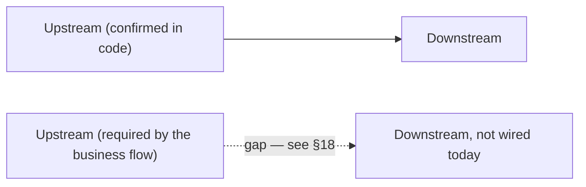

None of the diagrams below terminate inside a single department — every
chain either loops back into an earlier stage (a closed improvement loop) or
ends at a genuine business terminus (Payment, Disposal, Exit). Where the
business flow requires a connection that isn't wired in code, the arrow is
dashed and labeled with the §18 finding it corresponds to.

### Recruitment to Employee to Payroll

Was a dead end at Payroll — extended to Finance and to the rest of the
employee lifecycle (full detail in the dedicated Employee Lifecycle diagram
below).

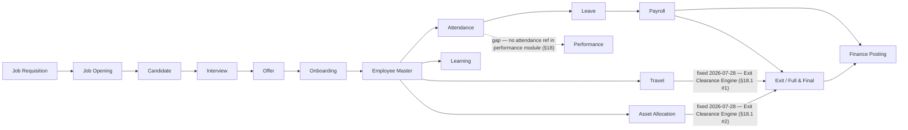

### Attendance and Leave to Payroll and Finance

Added the confirmed encashment path into Payroll, the unconfirmed Performance
link, and closed Finance into Reports instead of stopping there.

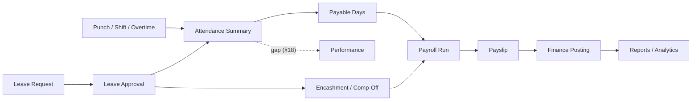

### Procurement to Inventory to Finance

Added the Vendor Health Score loop — confirmed real on the scoring side
(quality/delivery/financial inputs genuinely feed it) but confirmed **not**
consulted back at vendor selection time, so that return edge is a gap, not
the forward edges.

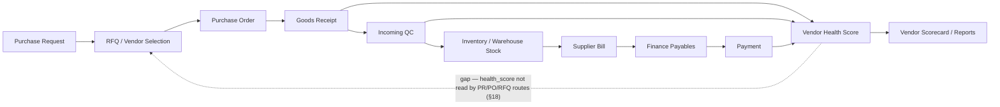

### CRM to Sales to Project to Service

Extended past "Service / Warranty" into the full post-sale loop — Warranty,
AMC, Complaint, and the return path into Engineering that closes the
improvement loop.

```mermaid
flowchart LR
    LEAD["Lead"] --> OPP["Opportunity"] --> QUOTE["Quotation"] --> SO["Sales Order"] --> PROJECT["Project"] --> PROD["Production"] --> QUAL["Quality"] --> DELIVERY["Delivery / Dispatch"] -->|"fixed 2026-07-29 — Installation Module (§18.1 #13)"| INSTALL["Installation Request<br/>(own lifecycle: engineer assignment, travel planning)"] --> COMMISSION["Commissioning"]
    SO --> RECEIVABLE["Finance Receivables"]
    COMMISSION --> WARRANTY["Warranty"] --> AMC["AMC"] --> COMPLAINT["Complaint"] --> SERVICE["Service Ticket"]
    SERVICE -.->|"gap (§18)"| ENGFB["Engineering Feedback"] --> RD["R&D"] --> ECN["ECN"] --> PROD
    AMC -.->|"gap — no invoice/receivable ref found (§18)"| RECEIVABLE
```

### Complaint to Service to Quality

The original chain stopped at a "Quality / CAPA Signal" label with no code
behind it. Extended to show the full closed improvement loop the business
brief requires, with the two confirmed-missing links marked.

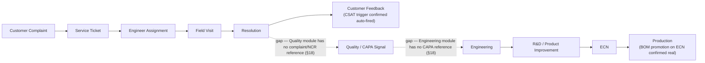

### Project Cost and Utilization

Added Travel and Asset usage against project cost, and closed Finance into
Reports.

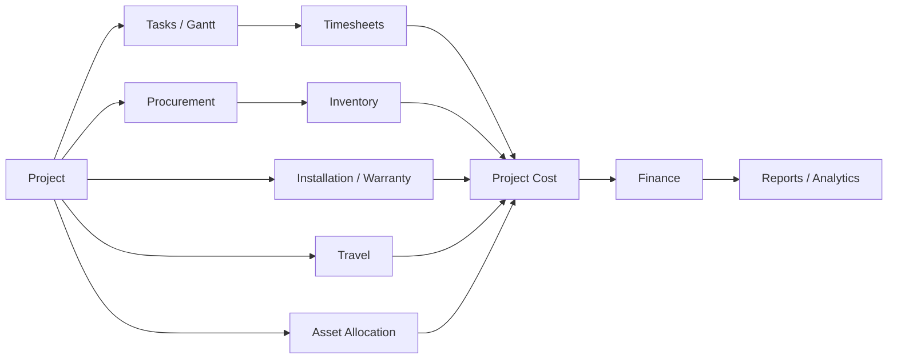

## 12. Lifecycle Diagrams

New diagrams, requested to make sure no module in the manual is a floating
department. Each ends at a genuine business terminus or loops back into an
earlier stage — never into a dead "Reports" leaf.

### Master Business Flow — the complete closed loop

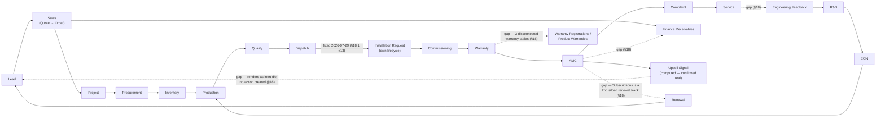

### Employee Lifecycle

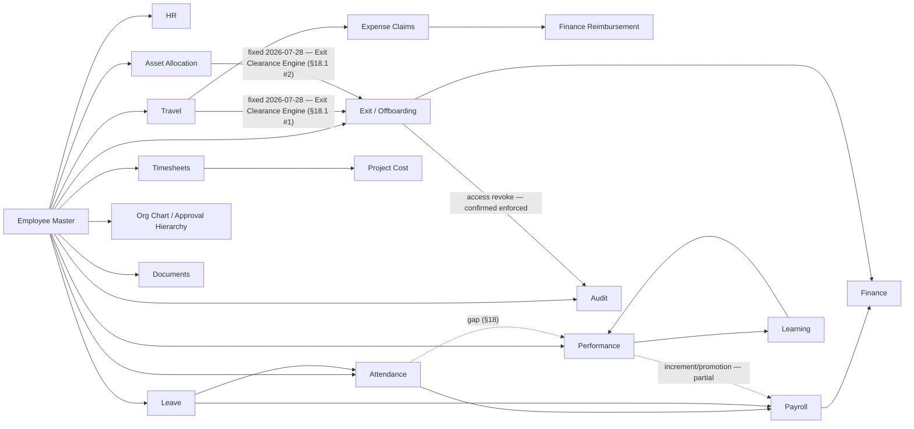

### Procurement Lifecycle

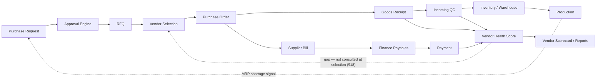

### Finance Lifecycle

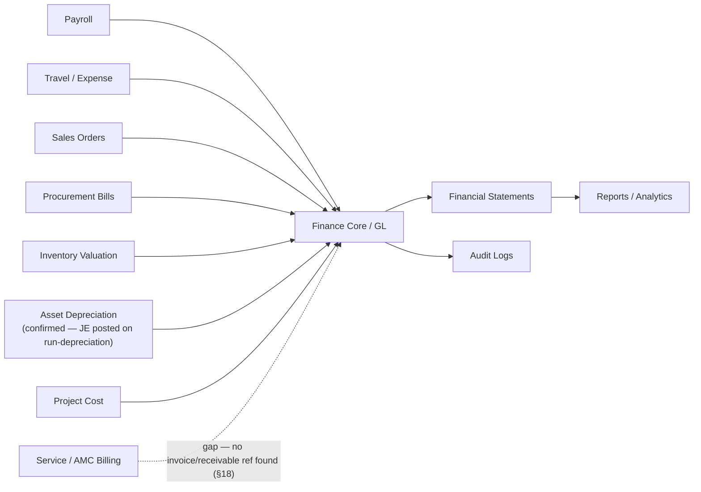

### Asset Lifecycle

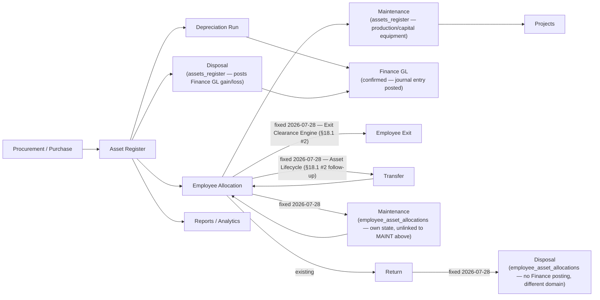

### Document Lifecycle

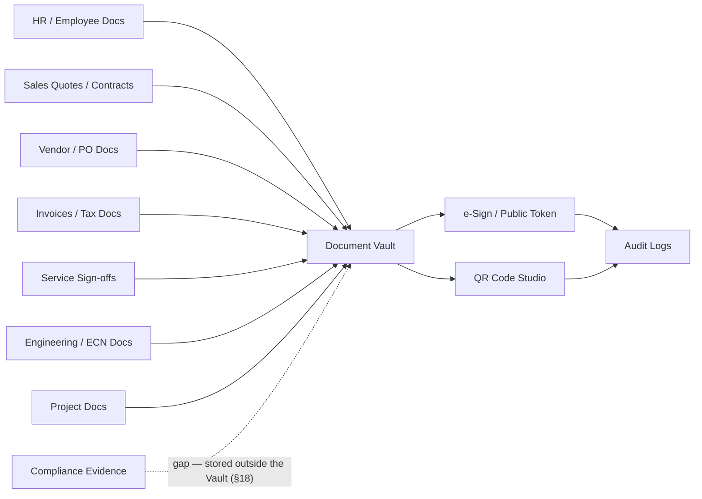

### Customer Lifecycle

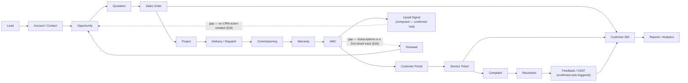

### Vendor Lifecycle

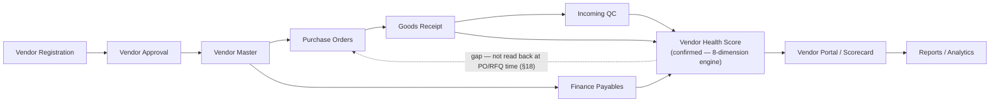

### Service Lifecycle

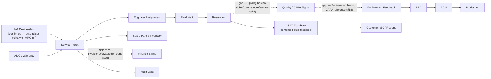

## 13. Role-Based Testing Matrix

| Role | What to verify |
|---|---|
| `super_admin` | Can see all modules and admin-only pages |
| `admin` | Can manage most app setup except super-admin-only pages |
| `employee` | Sees self-service, attendance, leaves, payslip, notifications |
| `manager` | Sees team approvals, team attendance/leaves, projects/timesheets as allowed |
| `hr` / `hr_manager` | Employee, HR, leave/attendance oversight, recruitment where allowed |
| `finance` / `finance_manager` | Finance, payroll finance, payables/receivables, reports |
| `procurement_manager` | Procurement, vendors, PR/PO approvals |
| `store_keeper` | Inventory, warehouse, stock movement |
| `production_manager` | Production, planning, shop floor |
| `qc_manager` | Quality, inspection, NCR/CAPA |
| `sales_manager` | CRM, sales, tenders, customer reports |
| `service_manager` | Service Desk, complaints, engineers, warranty |
| `project_manager` | Projects, tasks, resources, timesheets |

## 14. Per-Module Manual QA Template

```text
Module:
Page:
Role used:
Backend API observed:

Navigation:
[ ] Sidebar item visible only to correct role
[ ] Direct URL works or blocks correctly
[ ] Page title and layout are correct

Data loading:
[ ] Page loads without blank screen
[ ] API returns success
[ ] Empty state works
[ ] Error state works

Actions:
[ ] Create/Add
[ ] Edit/Update
[ ] Delete/Cancel where allowed
[ ] Approve/Reject where applicable
[ ] Upload/Download where applicable
[ ] Export/Print where applicable
[ ] Search/filter/sort/pagination

Connections:
[ ] Upstream record is selectable
[ ] Downstream record is created/updated
[ ] Status is synchronized across modules
[ ] Audit log created for important action
[ ] Notification sent if expected

Result:
Pass/Fail:
Issue ID:
Notes:
```

## 15. Quick Checklist Before Full Testing

- Backend starts without errors.
- Frontend starts without errors.
- `/api/health` returns healthy status.
- Login works for super admin.
- Login works for one normal employee.
- Sidebar renders correctly.
- Direct deep link refresh works.
- Database has seed/master data.
- File upload/download path works.
- Audit log records a test mutation.
- Notifications are visible for a test action.

## 16. Files To Open When A Module Fails

Not every page is registered in `routes.jsx`. Tenders, Fixed Assets,
Compliance, and (already known before this pass) IoT's `FleetMonitor.jsx` and
R&D's `RDHub.jsx` have no curated `NAV_ITEMS` entry — they're picked up by
`frontend/src/config/autoRouter.js`'s zero-config page scan (`FOLDER_CONFIG`
maps their feature folder to a `module` permission key) and gated through
`frontend/src/config/menuCatalog.js`'s per-role orphan-group entries instead
of the normal menu-permission path. If one of these five is "not visible,"
check `autoRouter.js`/`menuCatalog.js` first — `routes.jsx` won't show
anything wrong because the page was never meant to be there.

| Problem | First files to inspect |
|---|---|
| Page not visible | `frontend/src/components/Sidebar.jsx`, `frontend/src/config/routes.jsx`, menu permissions — **or, for Tenders/Assets/Compliance/IoT/R&D specifically, `frontend/src/config/autoRouter.js` + `menuCatalog.js`** (see note above) |
| Page visible but blank | Page component under `frontend/src/features/<module>/pages`, browser console |
| API 401/403 | `backend/server.js`, route file, `verifyToken`, `allowRoles`, `requirePermission` |
| API 404 | Backend route mount in `backend/server.js`, frontend API URL |
| Data not saving | Route controller/service, database table, request payload |
| Downstream module not updated | Source module save logic, integration/service layer, audit log |
| Wrong role access | `menuCatalog.js`, role permissions, menu permissions, route middleware |
| File not opening | Secure file route, upload path, document permissions |
| Reports mismatch | Source module query, report query, date/status filters |

## 17. Best Next Manual Testing Path

1. `super_admin login -> Settings -> Access Control -> Employees`
2. `Employee -> Attendance -> Leave -> Payroll`
3. `Purchase Request -> PO -> GRN -> Inventory -> Payables`
4. `Lead -> Opportunity -> Quote -> Sales Order -> Project`
5. `Project -> Production -> Quality -> Delivery -> Service`
6. `Complaint -> Service Ticket -> Field Visit -> Resolution`
7. `Document Sign -> Public Sign URL -> Document Vault`
8. `Create/edit/delete any record -> Audit Logs -> Notifications`

## 18. Enterprise Connection Gap Analysis

This pass reviewed the whole manual end to end looking for department-centric
dead ends — places where a business object had an upstream source but no
downstream destination (or vice versa). Everything below was checked against
live route/service code on 2026-07-27, not inferred from module names. Two
tables: first the connections that are genuinely missing or incomplete
(these are the dashed arrows throughout §2, §11, §12); second, connections
that looked like they might be diagram-only but turned out to already be
real, working closed loops — worth knowing so nobody "fixes" something that
isn't broken.

### 18.1 Missing or incomplete connections

| # | Lifecycle | Missing connection | Why it's required | Status |
|---|---|---|---|---|
| 1 | Employee | Exit / Full & Final → Travel advances | An employee can be paid out F&F while still owing (or being owed) money against an open travel advance — financial leakage and dispute risk at the exact moment the relationship ends. | **Fixed 2026-07-28 (Exit Clearance Engine).** `exit.routes.js`'s new `computeClearanceBlockers()` sums `travel_advances.amount − settled_amount` per employee and `POST /fnf/:id/pay` 409s while it's > 0. Not via the pre-existing `GET /closure-check` (`travel-reimbursement.routes.js:598`/`travel.routes.js:1162`) — that endpoint is scoped by `project_id`/`po_number`/`opportunity_id`, not `employee_id`, so it doesn't fit this need; a direct query was written instead. **Self-caught follow-up bug, same day:** the first version of this query filtered `travel_advances.employee_id = <employees.id>` directly — but that column actually stores `users.id` (`travel.routes.js`'s own `GET /advances` handler has a comment saying so, and live data confirms it: the one real row has `employee_id=5` pointing at `users.id=5`, a demo login with no `employee_id` link at all — a completely different person from `employees.id=5`). Silently would have reported every employee's advances as settled. Fixed to resolve through `users` first (mirroring the exact resolution `GET /advances` already uses for employee self-scoping), verified by inserting a throwaway advance against a real employee's user account and confirming the blocker fires, then cleaning up. |
| 2 | Employee | Exit / Full & Final → Asset return | `employee_asset_allocations` rows can sit at `status='allocated'` indefinitely after an employee is marked `left`/`terminated` — assets walk out the door untracked. | **Fixed 2026-07-28 (Exit Clearance Engine).** `computeClearanceBlockers()` also checks for `employee_asset_allocations` rows still `status != 'returned'` for the employee and blocks `/fnf/:id/pay` (409, listing the pending assets) until they're returned via `PATCH /employee-assets/:id/return`. The old `it_assets_returned` checkbox is left in place for historical notes but no longer what settlement checks — same closure pattern the sibling `access_revoked` checkbox already had. Also added: Finance/Manager/HR NOC sign-offs (`noc_finance`/`noc_manager`/`noc_hr`) are now hard blockers on the same endpoint too (previously advisory-only), with `finance_noc_by`/`manager_noc_by`/`hr_noc_by` recording who granted each (new migration `20260728000003_exit_clearance_noc_audit.js`). New `GET /exit/clearance/:employee_id/status` powers a live "Clearance Status" panel in `ExitManagement.jsx`'s Clearance Tracker tab and F&F tab. **Same-day follow-up: built the rest of Priority-1's Asset Lifecycle** (`employee-assets.routes.js` gained `POST /:id/transfer`, `POST /:id/maintenance` + `/maintenance/complete`, `PATCH /:id/dispose`; migration `20260728000005_employee_asset_lifecycle.js`) — `status='under_maintenance'` still blocks exit (asset hasn't left custody), `status='disposed'` doesn't (written off, nobody's outstanding responsibility — `computeClearanceBlockers()`'s query updated accordingly). This is a separate, self-contained lifecycle from `assets_register`'s Maintenance/Disposal (capitalized-equipment side, posts Finance GL) — no attempt made to merge the two, consistent with [[project_unified_asset_management]]'s existing "3 unlinked silos, deliberately not merged" call. Live-tested the full chain (allocate→transfer→maintenance→complete→return→dispose, plus both guard rails: can't transfer mid-maintenance, can't dispose twice) end-to-end via real HTTP calls, then cleaned up. |
| 3 | Employee | Travel/Expense approval → Reporting hierarchy | Approval should follow the requester's actual manager, not "any user with the manager role," or approval integrity is meaningless. | **Fixed 2026-07-28 (Travel Approval Hierarchy).** New shared `travelApprovalAuthz.js` (`authorizeManagerApproval()`) replaces the role-only gate on all 3 reachable approval surfaces: `PUT /travel/requests/:id/status` (the one the Travel Approvals screen actually calls — `travel.routes.js:1097`'s multi-level `/level-approve` was fixed too but confirmed **not wired to any frontend page**, so it wasn't the live exploit path), `PUT /travel/advances/:id/manager-review`, and `PUT /reimbursement/claims/:id/manager-approve`. Model: reporting manager (`employees.reporting_manager_id` match) → delegate (new `delegate_approver_id` column, settable only by whoever is already authorized, via new `POST .../delegate` endpoints on all 3) → HR override (`hr`/`hr_manager`/`hr_exec`, any employee) → admin override (`admin`/`super_admin`, any employee) — matches Priority-1's exact ordering. Live-tested end-to-end: an active non-manager account that wasn't the requester's RM got 403'd, then the requester's actual reporting manager — whose account's system role is plain `employee`, not `manager` — was correctly allowed, something the *old* role gate could never have permitted either. **Self-caught bug found mid-fix:** `travel_advances.employee_id` stores `users.id`, not `employees.id` (an existing code comment says so); the manager-review fix resolves the real `employees.id` via the parent `travel_requests.employee_id` instead, falling back to translating through `users` only if that's unavailable. **Deliberately not done:** Levels 2/3 of the (unused) multi-level flow stay role-gated — no per-employee "Department Head" identity exists in the schema to check against; `GET /travel/approvals`' listing still shows every pending request to any manager/HR/admin regardless of whether they're actually authorized to act on it (the Approve/Reject buttons now correctly 403 via the existing generic error-toast in `TravelApprovals.jsx`, but the list itself isn't filtered down to "your queue" — a real follow-up, same proportionality call as other flagged-not-fixed items in this section). |
| 4 | Employee | Attendance → Performance | Punctuality/overtime pattern is a standard review input in most HR systems; without it, Performance reviews are blind to attendance discipline. | **Diagram-only gap.** `backend/src/modules/performance` has no reference to attendance data at all — never built, not a regression. |
| 5 | Procurement / Vendor | Vendor Health Score → PR/PO/RFQ vendor selection | A vendor scored "Critical" or "Watchlist" should influence — or at least warn during — the next PO to that vendor, or the scorecard is just a report nobody acts on. | **Code gap, partial.** The score itself is real and well-built (`vendorHealthEngine.js`, 8 weighted dimensions from real GRN/NCR/CAPA/financial data). But `health_score`/`health_status` is never read back inside any PR/PO/RFQ route — the loop computes but doesn't close. |
| 6 | Customer / Service | Commissioning warranty activation → Warranty visibility | A warranty that doesn't surface anywhere can't be renewed, escalated, or honored correctly. | **Fixed 2026-07-28 (Unified Warranty Engine).** The three real sources were `customer_equipment.warranty_status` (Commissioning/Customer Portal), `project_warranties` (Projects module, its own full CRUD + `WarrantyManagement.jsx`), and `warranty_registrations` (+`warranty_claims`) (Operations/Lifecycle module, its own full CRUD + claims workflow + `WarrantyManagement.jsx` — a *second*, differently-named page with the same name in a different feature folder). `product_warranties`, cited in an earlier pass of this manual, **does not exist in the live schema** — always re-verify table names against `information_schema.columns` before trusting a prior citation. All three tables were confirmed **empty (0 rows)** before this fix — zero data-migration risk, the safest possible time to do this.<br><br>**Design:** `warranty_registrations` designated the canonical engine (most feature-complete — already had a claims workflow and coverage flags). Migrations `20260728000006/7/8` added `project_id`/`commissioning_workflow_id`/`equipment_id`/`amc_contract_id` link columns plus `warranty_months`/`exclusions`/`coverage_description`/`manufacturer_warranty_months`/`extended_warranty_months` (fields the Projects UI already collected that `project_warranties` was missing one of — `coverage_description` — a live 500-on-edit bug, never triggered since the table was always empty). `project_warranties` is left in place, unused, rather than dropped — a table sitting empty is reversible, dropping one isn't.<br><br>**Rewired:** `commissioning.routes.js`'s `activate-warranty` now upserts a real `warranty_registrations` row (idempotent per `commissioning_workflow_id`) alongside keeping `customer_equipment.warranty_status/warranty_expiry` in sync (kept as a read-cache for the Customer Portal's 5+ call sites reading it directly — not worth rewriting all of those for this pass). `projects.routes.js`'s 3 warranty endpoints (`GET/POST /projects/:id/warranties`, `GET /warranties`, `PUT /warranties/:id`) now read/write `warranty_registrations` filtered by `project_id`, with column names aliased to match `WarrantyManagement.jsx`'s existing contract exactly — **zero frontend changes needed**. `customer360.routes.js`'s warranty query (already correctly pointed at `warranty_registrations` via `sales_order_id` from an earlier pass) gained a second join path via `equipment_id → customer_equipment.crm_account_id → accounts.party_id` (the same bridge Priority 2's upsell-to-opportunity fix uses) so commissioning-sourced warranties — which carry `equipment_id`, not `sales_order_id` — now show up there too. AMC contract detail (`GET /lifecycle/amc-contracts/:id`) gained a `LEFT JOIN LATERAL` surfacing the linked warranty's end date/status.<br><br>**Bugs caught by live-testing before they shipped:** the first version of the commissioning/projects INSERTs referenced `warranty_months` and `exclusions` columns that turned out not to exist on `warranty_registrations` (those were `project_warranties`-only columns I'd conflated) — both fixed with two small follow-up migrations. Separately, the Projects `PUT`/`POST` handlers' `RETURNING wr.id, wr.project_id, ...` (reusing the same aliased column list as the `SELECT ... FROM warranty_registrations wr` queries) failed with `missing FROM-clause entry for table "wr"` — an UPDATE/INSERT has no implicit alias the way a SELECT's FROM clause does; fixed by explicitly aliasing the target table (`UPDATE warranty_registrations AS wr SET ...` / `INSERT INTO warranty_registrations AS wr (...) ... RETURNING wr.id`). Full chain (commissioning → engine row → Customer 360 → Projects CRUD → AMC linkage → idempotency) live-tested end-to-end via real HTTP calls, not assumed from reading the code. |
| 7 | Customer / Sales | AMC / CEO Intelligence → CRM Opportunity (Upsell) | An AI-computed upsell signal that nobody can click on is exactly the "Reports as a standalone module" anti-pattern the enterprise-centric review is meant to eliminate. | **Fixed 2026-07-28 (Priority 2/4 — Intelligence-to-Workflow).** New `POST /ceo-intelligence/customers/:partyId/convert-upsell`: resolves (or opportunistically creates) the `accounts` row bridging the Finance `parties` customer to CRM — `accounts.party_id` is a real schema link but was 100% unpopulated in practice (same "empty in practice" pattern as `vendors.party_id`); creates a real `opportunities` row (Assign Salesperson: the account's existing owner if known, else the acting user — no reliable territory/round-robin signal exists for an AI-detected upsell the way it does for inbound leads); populates the opportunity's own `next_step`/`follow_up_date` columns as the "Create Task" step rather than inventing a parallel task system; notifies admin/super_admin/sales_manager/manager roles (Notify Sales Manager); is idempotent (409s on a second attempt while one's still open) so "Track Conversion" is just the opportunity's own normal Kanban/stage lifecycle — no separate tracking needed. `CEOIntelligenceDashboard.jsx`'s `CustomerGrowthView` — the only place this signal was ever rendered — turned the plain label into a real button with loading/success/error states. Live-tested end-to-end (create → verify → duplicate-blocked → cleanup) against a real customer with no prior CRM account; the account got created fresh with `party_id` correctly bridged, a genuine permanent improvement left in place (not test data). |
| 8 | Customer / Sales | AMC ↔ Subscriptions (Renewal) | Two separate renewal mechanisms for the same business concept means revenue can lapse silently on whichever track isn't being watched. | **Fixed 2026-07-29 (Renewal Engine, Priority 5).** AMC and Subscriptions are legitimately different commercial products (service contract vs. SaaS-style recurring billing) — unlike Warranty's 3-way split, forcing them into one table would conflate unrelated concepts, so they stay separate tables but now share the same **Reminder → Approval → Payment → Renewal** shape via a new shared gate, `shared/renewalApproval.js`.<br><br>**Reminder:** new `jobs/subscriptionRenewal.cron.js` (daily 09:15, mirrors `amcRenewal.cron.js`'s pattern) — `subscriptions` had **zero cron jobs**, confirmed live: all 3 real rows in the database had `next_billing_date` already in the past with nothing ever having acted on them. Dedups on message text for the day rather than `reference_id`, since `notifications.reference_id` is `integer` and `subscriptions.id` is `uuid`.<br><br>**Approval:** both `PATCH /sales/subscriptions/:id/renew` and `POST /lifecycle/amc-contracts/:id/renew` now require an `admin`/`super_admin`/`finance`/`finance_manager` role (via `hasRole()`, many-to-many-safe) for renewals above `RENEWAL_APPROVAL_THRESHOLD` (₹2,00,000 default, env-configurable) — neither endpoint had **any** role check before this.<br><br>**Payment:** both now create a real `invoices` row via `invoiceService.createInvoice()` (the same GL-posting path Sales Order/Project invoicing already use) before applying the renewal — if invoicing fails (e.g. credit limit exceeded), the renewal itself does **not** silently proceed, matching the lesson from the Sales-Order-dispatch fix elsewhere in this file (swallowing an invoicing failure while still marking the parent renewed is worse than not automating it). AMC resolves its customer via `sales_order_id → sales_orders.customer_id` (same link `customer360.routes.js` already uses for this table); Subscriptions has its own `customer_id` directly.<br><br>**Renewal:** Subscriptions' `/renew` used to just flip `status` back to `'active'` with no date advance at all — now genuinely advances `next_billing_date` by one real billing cycle. AMC's `/renew` was already the more mature of the two (real `amc_renewal_history`, `renewal_count`, `next_renewal_date`) and needed only the Approval+Payment additions.<br><br>**Live-tested end-to-end** with real credit-limit interaction, not mocked: a renewal against a customer already at their credit limit correctly 422'd without mutating the subscription/contract; the same renewal against a customer with headroom succeeded with a real invoice ID; the approval threshold correctly 403'd a non-finance role and passed for admin. **Found but explicitly not fixed** (different gap, flagged for a future pass): AMC's separate `POST /amc-contracts/:id/generate-invoice` button (periodic in-term billing, a different concept from renewal) has never created a real `invoices` row — it returns a computed object with `status:'draft'` that's never persisted anywhere Finance can see. |
| 9 | Service / Quality | Complaints → Quality NCR/CAPA signal | Repeated complaints against the same product/component are a standard CAPA trigger in any QMS (ISO 9001-style) — without this link, Quality never sees the voice-of-customer failure pattern. | **Diagram-only gap — the manual itself previously claimed this connection existed.** `backend/src/modules/quality` has zero references to `complaint`, `ncr`-from-complaint, or any complaint-linked ID. |
| 10 | Service / Engineering | Service/Quality CAPA → Engineering → R&D → ECN | This is the closed improvement loop the whole business brief is built around (Production → Service → Engineering Feedback → R&D → ECN → Production). Without the entry point, the loop never closes. | **Code gap.** `backend/src/modules/engineering` has zero references to `capa`, `ncr`, or `complaint`. By contrast, the *other half* of this loop — ECN → Production — is real and confirmed (see §18.2 #3): once an ECN exists, it does reach Production. It just never gets triggered by a quality/service signal automatically. |
| 11 | Service / Finance | Service Ticket / AMC → Finance receivables | Service and AMC revenue needs to hit the books like every other revenue stream, or Finance's "receives transactions from Service" connection (as claimed in §7) is aspirational. | **Not confirmed in code.** No route file under `backend/src/modules/servicedesk` references `invoice`, `receivable`, or `finance`. |
| 12 | Documents / Compliance | Compliance evidence → Document Vault | Compliance evidence (`compliance_standards`/`compliance_evidence`/`compliance_audits`) should get the same permission model and audit trail as every other stored document, or it's a second, ungoverned file store. | **Minor code gap.** `backend/src/modules/documents` has no reference to `compliance`; the compliance module appears to manage its own evidence files independently. |
| 13 | Sales / Projects | "Installation" as a distinct lifecycle step | The business brief (and Projects' own lifecycle list: FAT/SAT/AMC/Warranty) names Installation as a stage between Dispatch and Commissioning. | **Fixed 2026-07-29 (Priority 6 — Installation as a First-Class Module).** New `installation_requests` table + `installation.routes.js` (mounted `/installation-requests`) gives Installation its own lifecycle: **Dispatch → Installation Request → Engineer Assignment → Travel Planning → Installation → Commissioning → Customer Acceptance**. Deliberately links to, rather than duplicates, existing systems — Travel Planning creates a real row in `travel_requests` (not a bespoke date field), and completing an installation auto-creates a real `commissioning_workflows` row via a new exported `createCommissioningWorkflow()` helper (extracted from `commissioning.routes.js`'s own POST handler so both flows share one seeding path for the default checklist/readings, not two copies). Auto-creates on Sales-Order dispatch (`PUT /orders/:id/dispatch`) when a project is resolvable via `lifecycle_instances` — the same bridge `autoBootstrapLifecycleOnOrderAccept` already sets up — and is idempotent (a DB partial-unique-index on `sales_order_id` prevents a re-dispatch from creating a duplicate active request, not just an application-level check). `InstallationDashboard.jsx` (a project-geography map) is correctly left alone — new page is `InstallationRequests.jsx`, added to Service Desk's nav. **Found and fixed a real, previously-undiscovered bug while wiring the Dispatch trigger**: `sales_orders.dispatched_at`/`delivered_at` are referenced by the dispatch route and several read-side analytics queries, but don't exist on the live table — the migration that was supposed to add them (`20260609000010`, dated 2026-06-11) shows `[applied]` in the ledger, yet `information_schema` confirms the columns were never actually there. Root cause not fully diagnosed (this project has hit ledger/live-schema drift of this kind before), but the practical effect was severe: **every real call to `PUT /orders/:id/dispatch` 500'd**, meaning Dispatch itself — the very first link in this whole chain, and a core Sales Order action independent of Installation — has likely been broken in practice. Fixed with a new additive migration (`20260729000002`) rather than fighting the ledger. Full chain live-tested end-to-end via real HTTP calls (dispatch → auto-created request → assign → travel → start → complete → auto-created commissioning → customer acceptance), including the dispatch-idempotency check, then cleaned up. |
| 14 | Inventory / Logistics | Logistics/Shipments has no permission module | Every other orphan-routed page (Tenders, Fixed Assets, Compliance, IoT, R&D) has an explicit `module` key in `autoRouter.js`'s `FOLDER_CONFIG` and matching `menuCatalog.js` entries gating who can reach it; Logistics doesn't, which likely means broader-than-intended access rather than a deliberate open policy. | **Code gap — found this pass.** `FOLDER_CONFIG.logistics` in `frontend/src/config/autoRouter.js` has no `module` key, and `menuCatalog.js` has zero references to `logistics`. Worth confirming which roles can actually load `LogisticsShipping.jsx` today. |
| 15 | Vendor / Customer (external stakeholders) | Anonymous external user → Vendor/Customer portal entry point | Both portals exist specifically so an outside party (a prospective vendor, an existing customer) never needs an internal ERP login — if the SPA's own router redirects them to the staff login page before the portal component ever mounts, the entire "external self-service" design point is void regardless of how well-built the component underneath is. | **Fixed 2026-07-29.** `frontend/src/App.jsx`'s router special-cased only 4 paths (`/login`, `/ForcePasswordChange`, `/sign/:token`, `/SetupWizard`) to render without an ERP session; every other path — including `/VendorRegistration` and `/CustomerPortalDashboard` — fell through to the catch-all `/:page?`, which hard-redirects to `/login` whenever `isLoggedIn` is false, before `Layout`/`ROUTES` are ever consulted. `routes.jsx`'s `VendorRegistration` entry carries a `public: true` flag that nothing in the frontend ever reads (confirmed via project-wide grep for `.public`) — dead metadata, not an actual bypass. Both target components were already correctly built and already correctly wired to genuinely public backend routes (`vendor-registration.routes.js`'s `/submit`+OTP flow; `customer-portal.routes.js`'s `/auth/login` issuing a separate `type:'customer_portal'` JWT) — the only missing piece was the SPA-level route. Fixed by adding both as explicit top-level `<Route>` entries in `App.jsx`, mirroring the existing `/sign/:token` pattern (lazy-loaded, `Suspense`-wrapped, before the catch-all). Neither page has ever had an internal link pointing at it (grepped both component names project-wide, zero matches), so this was pure dead-on-arrival, not a regression of something that used to work — meaning neither flow was ever reachable by an actual outside vendor or customer since being built. Browser-verified with Playwright in a fresh cookie-less context: both pages now render correctly for an anonymous visitor (7-step wizard; email/password sign-in), and a regression check confirmed arbitrary unmatched paths (`/`, `/SomeRandomPage`) still correctly redirect to `/login` — the fix is scoped to exactly these two paths. **Flagged, not fixed — a product decision, not a wiring gap:** `CustomerPortalDashboard.jsx`'s login form has no company-selector field; `company_id` is silently sourced from an optional `?company=` query param (defaulting to `1`), so in a genuinely multi-tenant deployment a customer of company 2+ hitting the bare URL would transparently be checked against company 1's `customer_portal_users` table. Needs a decision (subdomain-per-company? invite link with embedded `company_id`? name/GSTIN lookup step?) before it's fixable. |

### 18.2 Connections that looked missing but are already real, working closed loops

Confirmed by reading the actual route/service code, not assumed from naming:

1. **IoT → Service Ticket → AMC.** `iot/alertActions.js`'s `createServiceTicket()` auto-raises a `support_tickets` row (`ticket_kind='service'`, category `Breakdown`) the instant a critical device alert fires, carrying the device's project, serial number, and `amc_contract_id`. Shared by both the live ingest path and the monitor cron, and idempotent (won't flood tickets on repeat breaches). This is a genuine closed loop, not a diagram aspiration.
2. **Vendor Health Score inputs.** `vendorHealthEngine.js` computes an 8-dimension score (quality, delivery, cost, support, compliance, financial, dependency, risk events) with quality weighted directly from NCR/CAPA/rejection data and delivery weighted from GRN on-time data. Quality and Procurement genuinely feed the score — only the *return* path (score back into vendor selection, #5 above) is missing.
3. **Engineering ECN → Production BOM.** `ecn.routes.js`'s implement step promotes any draft BOM version created under that ECN to `active` and retires the prior version, in the same transaction, with an audit event (`bom_promoted`). ECN approval genuinely changes what Production builds next.
4. **Asset Depreciation → Finance GL.** `assets.routes.js`'s `POST /run-depreciation` writes `asset_depreciation_log` **and** posts a real journal entry (debit Depreciation Expense / credit Accumulated Depreciation) in the same request.
5. **Approval Engine → Notifications → Audit Logs.** Every approve/reject/escalate/delegate action in `approvals.controller.js` calls `logAudit(...)` (12 call sites) and separately fires a notification — this three-step chain from the business brief's Approvals example is already closed.
6. **Customer Portal → Service Tickets.** Portal-raised tickets land in the same `support_tickets` table service engineers work from — confirmed in both `customer-portal.routes.js` and `servicedesk.routes.js`.
7. **Ticket resolution → CSAT feedback request.** `servicedesk.routes.js:604-611` auto-fires a feedback notification the instant a ticket transitions to resolved/closed — genuinely automatic, not dependent on an agent remembering to ask.
8. **Marketing campaigns → CRM leads.** `crm.routes.js` references `campaign_id` directly — attribution is real, not aspirational.
9. **Recruitment → Employee → Attendance → Leave → Payroll and CRM → Quotation → Sales Order → Dispatch → Production (quality stop-ship hold).** Both already independently verified and scored in the prior Enterprise Workflow Audit (84/100 and 83/100→90/100 respectively) and re-spot-checked 2026-07-27 — still hold.

### 18.3 What this pass did not change

Per the scope of this review: no module was added, redesigned, or removed,
and no application code was touched. Everything above is a documentation
change to this manual — making existing connections visible where they were
real but undrawn, and making missing connections visible where the manual
previously implied a link the code doesn't back up. Items in §18.1 are
recommended follow-up engineering work, not something this pass fixed.

## 19. Automation Opportunities Pass (2026-07-29)

A separate 12-item backlog was handed over verbatim from a prior automation
audit, framed as "fits that already exist in the architecture — no redesign,
just finishing the wiring." Each item was re-verified against live code
before touching anything (per this manual's own standing rule — audits go
stale fast in this codebase, see `AUTOMATION_OPPORTUNITY_AUDIT.md`'s own
superseded "cheapest fix" claim as a prior example). Result: **11 of 12 were
already fully wired** by the time this pass ran — evidently implemented in
an earlier, uncommitted stretch of work on this same backlog before this
verification pass began. Only one (#6 below) is a genuine, deliberate
partial. Nothing in this section required new code; this section exists
because the standing rule requires an architecture-impact note even when the
finding is "already done," so the next pass doesn't re-attempt closed work.

| # | Item | Status | Evidence |
|---|---|---|---|
| 1 | Collapse the dual ledger (Finance) | **Done — opposite direction from the audit's suggestion.** The audit proposed pointing Trial Balance/P&L/Balance Sheet at `journal_entry_lines`. Live code shows the actual fix went the other way: `journal.repository.js`'s header comment records that two child ledgers existed (`journal_entry_lines`, minimal, written by auto-posting services; `journal_lines`, richer, already read by Trial Balance/P&L/Balance Sheet) and the repository now writes and reads `journal_lines` exclusively. `journal_entry_lines` is dead — grepped project-wide, the only remaining reference is that historical comment. | `backend/src/modules/finance/repositories/journal.repository.js:1-118` (see `getTrialBalance`, `getGeneralLedger`) |
| 2 | Call the existing payroll-GL endpoint (Payroll→Finance) | **Done — via direct service import, not the HTTP endpoint.** Payroll approval imports `postPayrollJournal` from `payrollJournal.service.js` directly rather than calling `POST /finance/accounting/payroll-journal` over HTTP — avoids an unnecessary internal round-trip, same effect. Best-effort/non-blocking: a GL posting failure doesn't undo the already-committed payroll approval. | `backend/src/modules/payroll/payroll.routes.js:139-153` |
| 3 | Real Sales Order→Production (Sales→Production) | **Done.** `autoBootstrapLifecycleOnOrderAccept` now calls the real `createProductionOrderFromSalesOrder` (previously written but only reachable via an endpoint the frontend never called) instead of stopping at the project-stub bootstrap, with best-effort BOM matching by product name so a matched BOM also seeds `production_operations`. | `backend/src/modules/sales/routes/sales.routes.js:15,108-137` calling `backend/src/modules/operations/lifecycle.routes.js`'s exported `createProductionOrderFromSalesOrder` |
| 4 | Route Sales-Order/Project invoices through `invoice.service.js` (Sales & Projects→Finance) | **Done — predates this backlog entirely.** Both call sites already route through `invoiceService.createInvoice`, per an in-code comment dated "2026-07-21 dual-ledger fix." Confirmed present at `HEAD` (not part of any uncommitted change). | `backend/src/modules/sales/routes/sales.routes.js:699-732`, `backend/src/modules/projects/routes/projects.routes.js:552-575` |
| 5 | Dual-write production consumption to `stock_ledger` (Production→Inventory) | **Done — predates this backlog entirely.** `backflushMaterials()` and `receiveFG()` already call the shared `postStock()` (the same helper subcontracting uses), confirmed present at `HEAD`. | `backend/src/modules/production/execution.routes.js` (`backflushMaterials`, `receiveFG`) |
| 6 | Auto-create/remind AMC contracts (Service) | **Deliberately partial — notify, don't auto-create.** `activateWarranty()` sets `amc_eligible=true` and now notifies admin/manager/service/sales roles ("AMC-Eligible — Set Up Contract") — the "remind" half. It does **not** auto-draft an `amc_contracts` row: the in-code reasoning is that pricing/SLA terms are a business decision the system has no basis for, and fabricating them into a real contract row is worse than requiring a human to use the existing `POST /lifecycle/amc-contracts` flow. This mirrors the same proportionality call already made elsewhere in this manual (§18.1 #15's flagged-not-fixed company-selector gap). **Open follow-up if the business wants full auto-creation**: would need a pricing/SLA default source (e.g. a rate card keyed by product/customer tier) before a draft row could be trusted — flagging rather than guessing. | `backend/src/modules/servicedesk/routes/commissioning.routes.js:447-551` (`activateWarranty`) |
| 7 | Fix the timesheet table reference (Projects) | **Done.** `GET /timesheets/my-timesheet` now joins `project_members` (`role_in_project`) instead of the dropped `project_team_members` — restores a page that previously always showed "no project assignments." | `backend/src/modules/timesheets/routes/timesheets.routes.js:22-41` |
| 8 | Auto-sync opportunity stage on conversion (CRM→Sales) | **Done.** Quotation→Sales-Order conversion now flips the source `opportunities.stage` to `Won` (`closed_date`, `probability_percentage=100`) in the same transaction, guarded so an already-Won/Lost opportunity isn't overwritten. | `backend/src/modules/sales/routes/sales.routes.js:442-454` |
| 9 | Persist Field Visit fields (Service) | **Done.** `PUT /servicedesk/field-visits/:id` now accepts and persists `completed_at`, `work_done`, `parts_used`, `labour_hours`, `travel_km`, `cost`, `start_time_actual`, `end_time_actual`, `customer_signature` — previously silently discarded. Parts-used consumption is also now posted through `postStock()` against real `inventory_items` (net-quantity-change per `part_id`), not left as free-text JSON invisible to stock. | `backend/src/modules/servicedesk/routes/servicedesk.routes.js:858-` (PUT handler + parts-used stock posting immediately after) |
| 10 | Populate `project_scurve_data` on a schedule (Projects) | **Done — predates this backlog entirely.** `scurveSnapshot.cron.js` runs daily at 02:00, upserting one row per project per calendar month from `project_cost_summary`'s existing EVM figures plus a linear time-elapsed planned-progress baseline. Registered in `server.js`. Confirmed present at `HEAD`. | `backend/src/jobs/scurveSnapshot.cron.js`, registered `backend/server.js:234,879` |
| 11 | Generate production operations from MRP conversions (Plan to Produce) | **Done — predates this backlog entirely.** Both `POST /mrp/planned-orders/:id/convert` (single) and `/convert-all` (bulk) call `copyRoutingToProductionOperations()` for `make`-type planned orders, so MRP-sourced production orders get a real operations/routing seed instead of being shop-floor dead ends. Confirmed present at `HEAD`. | `backend/src/modules/production/mrp.routes.js:194,239` |
| 12 | Auto-generate the reorder-driven Purchase Request feed (Inventory→Procurement) | **Done.** The reorder-breach check that already raises a `low_stock` alert now also writes a real `purchase_suggestions` row (idempotent — skipped if a pending suggestion already exists for that item/warehouse), with a priority derived from how far below reorder level the stock has fallen. Previously a fully-built, fully-dead UI (`StockAlertsAndSuggestions.jsx`) with nothing ever populating a row. | `backend/src/services/stockAlerts.js:45-69` |

**Architecture impact of this pass**: none — every fix reuses an existing
table, service, or helper already documented elsewhere in this manual
(`postStock`, `invoiceService.createInvoice`, `createProductionOrderFromSalesOrder`,
`copyRoutingToProductionOperations`, `journal_lines`). No new tables, no new
cross-module coupling beyond what §2/§11/§12's diagrams already draw. Item 6
is the one place a future pass could add real architecture (a rate-card
source feeding AMC contract defaults) rather than just verification.

## 20. Home Dashboard → Per-Role Department Dashboard Embed (2026-07-30, REVERTED 2026-08-04)

A cross-role UX audit (the "Role Experience Audit" — see project memory, not committed to this
repo) flagged that `Home.jsx` landed 25 of 26 roles on the same generic company-wide widget grid
(Open Tasks/Approvals/Announcements/Policies/Brand Vault/Celebrations) instead of the domain
dashboard each role actually needed to start their day with. A `ROLE_DASHBOARD` map was built
covering 22 roles, embedding each role's existing sidebar-landing dashboard (HRDashboard,
FinanceDashboard, ProjectsDashboard, SalesCommandCenter, etc.) in place of the generic grid on
Home, reusing existing components with no new pages built.

**Reverted 2026-08-04 on explicit user instruction:** "home screen should be same for all the
roles and employees as there only they will get the necessary docs and celebrations etc." The
department-dashboard embed meant ~22 of 26 roles never actually saw the Policies/Brand
Vault/Celebrations panels that are Home's whole point — their Home was silently swapped for a
different page's content instead. Removed `ROLE_DASHBOARD`, `ROLE_DASHBOARD_NEEDS_SETPAGE`, the
`DeptDashboard` conditional rendering branch, the `hm-root--dept` CSS modifier, and reverted
`HomeBusinessPulse`'s gate back to plain `canSeeFinancials` (from `canSeeFinancials &&
!DeptDashboard`) in `frontend/src/pages/Home.jsx` and `Home.css`. Every role now renders the same
6-slot generic grid; per-role dashboards remain reachable exactly as before via their own sidebar
entries/routes — nothing about those pages themselves changed. Hero KPI content (attendance ring
vs. personal task/approval counters) still differs by employee-vs-management, as it did before
this feature existed — that split was never part of what got reverted.

## 21. Discount-Approval Gate at Quotation → Sales Order (2026-07-30)

The Lead-to-Cash Enterprise Workflow Audit had repeatedly flagged one standing, deliberately-deferred
gap across 7+ passes: no approval gate between Quotation and Sales Order for discounted quotations,
because `discount_approvals` had no FK to a quotation (only loose `lead_id`/`order_id`). Picking this
item up surfaced a deeper root cause and three unrelated, previously-undiscovered live bugs — found
only because this was the first time anyone actually drove the full request→approve→convert cycle
against a real Postgres instance rather than re-reading the code shape.

**Root cause was bigger than "no FK": quotations never persisted a discount at all.**
`Quotations.jsx`'s builder already has a header "Discount %" field, computed into `subtotal`/`total_amount`
client-side and sent to the backend as `discount`, but `quotations` had no matching column —
`quotationsRepository.create()` never destructured it, so the number was silently dropped on every
save. Added `quotations.discount_pct` (migration `20260729000003_discount_approval_gate.js`, same
migration also adds `discount_approvals.quotation_id UUID→INTEGER REFERENCES quotations(id)`); the
frontend now sends it explicitly as `discount_pct` instead of the unmapped `discount` key.

**The gate itself reuses two already-built-but-disconnected systems rather than inventing new ones**
(same "check for existing infrastructure before building" discipline as the GRN quality-gate fix
elsewhere in this file): `discount_rules.requires_approval`/`approval_threshold_pct` (a real per-rule
policy already configurable from `PricingEngine.jsx`'s Discount Rules tab, never read anywhere) and
`discount_approvals`'s full request/pending/approved/rejected workflow with its own live UI
(`PricingEngine.jsx`'s Approvals tab, `PUT /pricing/discount-approvals/:id`) that nothing had ever
triggered. New `checkDiscountApprovalGate()` in `sales.routes.js`: if a quotation's `discount_pct`
meets or exceeds the lowest `approval_threshold_pct` among the company's active
`requires_approval=true` rules, it auto-creates a pending `discount_approvals` row (mirrors the
credit-check gate's auto-detecting style — no separate "request approval" click required) and blocks
with 409; a pending or rejected request keeps blocking; an approved one clears it. Wired into **all
three** live quotation→order conversion endpoints (`PATCH /quotations/:id/accept-and-convert`,
`PATCH /quotations/:id/convert-to-order`, `POST /orders/from-quotation/:quotationId`) — the second of
those had neither this gate nor the pre-existing credit-check gate at all until now, despite being a
real, reachable button (`Quotations.jsx`'s "Convert to Sales Order" for `accepted`-status quotations).
Also added `requirePermission('sales','approve')` to the approve/reject endpoint, previously
unguarded — `role_permissions` already seeds `sales_manager: can_approve=true` /
`sales_exec: can_approve=false` for the `sales` module (the role's own seed description says "full
access including pricing approval" / "no pricing approval"), it just was never enforced on this route.

**Three unrelated, previously-undiscovered live bugs found while verifying end-to-end, all fixed:**
1. **`credit_limits.customer_id` was a legacy `integer`, never migrated to match `parties.id` (uuid)** —
   every quotation-to-order conversion gate's credit-check (`SELECT ... FROM credit_limits WHERE
   customer_id=$1`, passing a real uuid) has been throwing `invalid input syntax for type integer`
   unconditionally on every quotation with a real customer attached, silently caught and reported as a
   generic 500. `finance/routes/extended.routes.js`'s own `GET /credit-limits` already joined
   `cl.customer_id = p.id` against `parties`, confirming uuid was always the intended type. Fixed via
   direct `ALTER COLUMN ... TYPE uuid` (migration `20260730000001`) — safe as a straight type change,
   not an additive bridge column, since the table had 0 live rows and neither of its write endpoints
   has any frontend caller anywhere in the app.
2. **`quotation_items` never got the columns `quotationsRepository.addItem()`/`getItems()` actually
   use** (`item_description`/`rate`/`tax_percentage`/`tax_amount`/`total`) — `POST
   /quotations/:id/items` 500'd on every real call. Root cause: migration `20260609000001` (June 9)
   tried to ALTER these onto `quotation_items`, but the table wasn't `CREATE TABLE`'d until migration
   `20260620000002` (June 20) — a migration-ordering inversion. The June 9 migration wraps every ALTER
   in a savepoint with try/catch+`console.warn` (to survive drift across environments), so "relation
   does not exist" was silently swallowed and logged instead of failing the migration — it shows
   cleanly "applied" in the ledger despite every quotation_items statement inside it having no-op'd.
   Fixed via a new additive migration (`20260730000002`) re-applying the same `ADD COLUMN IF NOT
   EXISTS` statements — safe and idempotent regardless of what the ledger believes already ran, same
   pattern as `20260729000002_sales_orders_dispatch_columns_drift_fix.js`.
3. **`accept-and-convert` had an application-level self-deadlock on every single call, discount-related
   or not** — its `SELECT * FROM quotations ... FOR UPDATE` holds a row lock on `client`'s connection
   for the rest of the request, but `salesOrdersRepository.create()`/`.addItem()`/`.updateTotals()`
   ran on the default `pool` (a *different* connection). `sales_orders.quotation_id` and
   `sales_order_items.order_id` both carry real FK constraints back to the locked/uncommitted rows;
   Postgres's FK check needs a lock the `FOR UPDATE` holder won't release until this same request's
   own JS code — blocked awaiting that exact call — moves on. Not a DB-detectable deadlock cycle
   (each connection is only waiting on the other's *application* progress, not a reciprocal DB lock),
   so it just hangs until `query_timeout` (30s) fires and reports a generic "Query read timeout".
   **This means the "atomic accept + convert" endpoint — independently scored 83/100 and later
   90/100 as part of Lead-to-Cash across 7+ audit passes — had likely never actually completed
   successfully for any quotation in this environment**, since nobody had previously driven it
   against a real Postgres instance with the lock genuinely held end-to-end; every prior "verified"
   claim re-read the code shape (gate exists, transaction wraps it) without confirming the transaction
   could actually commit. Fixed by threading the transactional `client` through all three calls
   (`create(data, client)`, `addItem(data, client)`, `updateTotals(order_id, client)` — all default to
   `pool` when no client is passed, so every other caller of these same repository methods elsewhere
   in the app is unaffected).
4. `PUT /pricing/discount-approvals/:id`'s UPDATE reused `$1` both as a plain column assignment
   (`SET status=$1`) and inside `CASE WHEN $1='approved'` — Postgres couldn't deduce one consistent
   type for the repeated parameter ("inconsistent types deduced for parameter $1"), a live 500 on
   every real call, never caught before because nothing had ever created a real `discount_approvals`
   row for this endpoint to act on until this gate started creating them. Fixed with an explicit
   `$1::varchar` cast in the `CASE` branch. Also fixed `approved_by` always landing `NULL` in practice
   — `PricingEngine.jsx`'s Approvals tab never sends it — now resolved server-side from the acting
   user, same convention as the gate's own `requested_by`.

**Verified via a full live-HTTP round trip** against an isolated second backend instance (not a
rolled-back transaction — `accept-and-convert` and the approve endpoint each commit their own
transactions): created a real 15%-discount quotation against a temporary `requires_approval` rule
(threshold 10%), confirmed the first conversion attempt 409s and auto-creates exactly one pending
`discount_approvals` row (idempotent on retry, no duplicate), approved it via the real endpoint,
confirmed the retried conversion now succeeds (201, real `sales_orders`/`sales_order_items` rows);
separately confirmed `convert-to-order` (previously fully ungated) now blocks the same way, a
rejected request keeps blocking with the rejection reason surfaced, and a below-threshold discount
(5%) converts straight through with zero `discount_approvals` row created. All throwaway rows deleted
after. Full backend suite green throughout (549 passed/9 skipped, no regressions).

**Still deliberately open, unchanged:** `POST /discount-rules/request-approval` (the pre-existing
manual request-creation endpoint) still has no frontend caller — superseded by the automatic gate,
not wired to a UI button, since requiring a salesperson to remember a separate "request approval"
click before the automatic gate already does it for them would be redundant, not complementary.

**Architecture impact**: none — no new components, tables, or endpoints; every embed reuses a
dashboard + backend already documented in §5-§9 of this manual. The one structural finding is
`RequireRole.jsx`'s single-role check (`components/auth/RequireRole.jsx:16`, `roles.includes(role)`)
being one of the last un-swept single-role gates in the frontend (see project memory
`project_frontend_single_role_gate_drift` — the rest of the app's gating already moved to
`hasAnyRole()`/the `roles[]` array). Not fixed here since `department_head` was excluded rather
than granted access, but any future decision to open Executive Dashboard to more roles should fix
this gate properly (add to the array or convert to `hasAnyRole()`) rather than special-case around
it again.

**Separately found, not fixed (flagged for a future pass):** verifying this with real pilot
accounts (`pilot.financemgr@manifest.in`, `pilot.hrmgr@manifest.in`, etc.) surfaced that all
~24 `pilot.*@manifest.in` accounts have `users.role = 'user'` in the database — a generic
placeholder — while their real granular role (finance_manager, hr_manager, …) lives only in the
`user_roles` junction table. Since `auth.service.js`'s login flow sends `role: user.role` (the
same column) as the JWT's primary-role claim, a **real login** for any of these pilot accounts
gets `role='user'`, not their intended granular role — meaning this dashboard feature (and any
other singular-`role` check in the app) silently no-ops for the entire pilot fleet today. This is
a data/seeding gap, not a code bug in this feature, and is out of scope for this pass — see project
memory `project_home_role_dashboard_rollout` for the full detail before the pilot program relies on
per-role behavior being visible to these accounts.

## 22. Recruitment → Employee login provisioning — second creation path fixed (2026-08-03)

Recruitment has **three** separate code paths that insert an `employees` row from a candidate, not
one: `recruitmentRepository.hireCandidate()` (`POST /recruitment/candidates/:id/hire`, the normal
stage-driven hire), a hand-rolled second `INSERT INTO employees` inline in
`recruitment.routes.js`'s `POST /recruitment/auto-creation/:candidateId/trigger` (for candidates
already at the `Hired` stage whose employee record didn't get created), and `employee.service.js`'s
own `addEmployee()` (the direct HR "Add Employee" form — unrelated to recruitment). A prior,
already-uncommitted fix on this branch added login provisioning (`createEmployeeLogin()` — creates
the `users` row, syncs the primary role, sets primary `user_scope`) to `hireCandidate()`, which had
never called it despite being "the more common real-world hire path" per its own code comment. That
fix only covered one of the two recruitment-sourced paths.

**Verified live** that `/auto-creation/:candidateId/trigger` had the identical gap and fixed it the
same way: it now calls `createEmployeeLogin(pool, {...})` right after its own `INSERT INTO
employees` succeeds (non-blocking, same try/catch-and-log pattern already used there for payroll
auto-enrollment), so a candidate auto-created through this second path also gets a real login instead
of an employee record nobody can sign in with. Added a `Login account created` entry to this
endpoint's `checklist_items` response field for parity with the existing `Payroll profile configured`
entry — confirmed via project-wide grep that no frontend page currently reads `checklist_items`, so
this is additive with zero UI risk.

**Also removed while auditing this area**: `frontend/src/services/recruitmentService.js` — a fully
orphaned API wrapper (confirmed via grep: zero importers anywhere in `frontend/src`) that called
`/recruitment/jobs`, an endpoint that has never existed; the live frontend pages call
`/recruitment/openings`/`/recruitment/requisitions` directly via the shared `api` client instead.
Dead code, not a regression — deleted rather than fixed forward.

**Not done, flagged for a future pass**: the two employee-creation paths remain separate
implementations (different transaction handling — `hireCandidate` runs inside the caller's
`BEGIN`/`COMMIT` transaction client, `/auto-creation/trigger` does not — different tracking tables,
and `/auto-creation/trigger` doesn't call `logAudit()`/`triggerEmail()`/`moveResumeOnStageChange()`
the way `/hire` does). Collapsing them into one path was judged out of scope for a login-provisioning
fix — the two have different preconditions (`/hire` moves a candidate to `Hired`; `/auto-creation`
requires the candidate already be `Hired` and is a catch-up mechanism) and merging them risks
changing `/auto-creation/trigger`'s response shape (`employee_code`, `next_steps`,
`recruitment_employee_creation_log` row) that `EmployeeAutoCreation.jsx` depends on.

**Architecture impact**: none — reuses the existing `createEmployeeLogin()` helper already documented
via `hireCandidate()` elsewhere in this manual; no new tables, endpoints, or cross-module coupling.

## 23. Inventory module UI kit — `components/layout` name collision broke all 14 pages (2026-08-04)

A prior, already-uncommitted pass on this branch (2026-08-03, before this entry) built a shared
frontend UI kit — `PageLayout`/`PageHeader`/`ContentCard`/`TableContainer`/`FormCard`/`KPICardGrid`/
`EmptyState`/`LoadingState` — and refactored all 14 Inventory pages (`ItemMaster`, `StockMovements`,
`StockAlertsAndSuggestions`, `StockReservations`, `BatchTracking`, `StockSummary`,
`InventoryIntelligence`, `InventoryReport`, `LogisticsShipping`, `MaterialConsumption`,
`QualityManagement`, `SerialTracking`, `StoresCostAnalysis`, `VendorPriceComparison`,
`WarehouseManagement`) plus `ApprovalCenter` to import from it, all via `import { EmptyState, ... }
from '@/components/layout'`. The kit itself was placed at `frontend/src/components/layout/` (a new
directory). `frontend/src/components/Layout.jsx` — the unrelated, pre-existing app-shell component
(sidebar + topbar, rendered by every page) — already lived in the same folder.

**This is a live production-breaking bug, not just a lint nit.** Windows/NTFS (and default macOS)
resolve paths case-insensitively, so Vite's ESM resolver for the bare specifier `@/components/layout`
collapsed onto `Layout.jsx` (a file) instead of `layout/index.js` (a directory) — `Layout.jsx` only has
`export default function Layout(...)`, no named exports. Every one of the 15 refactored pages threw
`SyntaxError: The requested module '/src/components/layout.jsx' does not provide an export named
'EmptyState'` at import time, which the app's `ErrorBoundary` caught and rendered as a bare "Something
went wrong" — i.e. **the entire Inventory module (9 of the 9 pages Playwright's P0/P1 smoke suite
covers) was down** on this branch before this fix. Caught by running the mandatory Playwright
verification pass (`tests/suites/01-smoke.spec.ts`, project `smoke`) against the live dev server, not
by code reading — the collision is invisible in a diff or on a case-sensitive CI runner, which is
exactly why it shipped this far uncaught.

**Fix**: renamed the kit directory `frontend/src/components/layout/` → `frontend/src/components/
pulse-ui/` (matches the kit's own `pulse-ui.css`, and can no longer collide with `Layout.jsx` on any
filesystem) and updated all 15 importers' `from '@/components/layout'` → `from '@/components/
pulse-ui'`. No component code changed. Re-verified: `esbuild` syntax-check clean on all 15 files +
the kit itself, and the full `smoke` Playwright project re-run green — Inventory production-readiness
score went from failing 9 pages to **100/100** (all 15 Inventory-tagged smoke checks passing).

**Architecture impact**: renames a not-yet-committed directory before its first commit — no import
path outside the 15 files above ever referenced the old location (confirmed via grep for non-alias
relative references, zero found), so there is no migration concern for other code. Establishes
`frontend/src/components/pulse-ui/` as the canonical location for this shared kit; any future page
adopting it should import from there, not recreate a same-named `layout/` folder next to `Layout.jsx`.

## 24. Finance route-alias cleanup + Period Close correctness gap (2026-08-04)

A read-only structural audit of the Finance module (file/API/DB inventory, duplicate-route report)
flagged five duplicate/alias API pairs as needing resolution. Each pair was traced against real
frontend call sites (not assumed from the route table) before touching anything, since this app is
carrying a live pilot (`[[project_phase5_pilot_prep]]`).

**Findings — 2 of 5 pairs were true duplicates, 1 was worse than duplicate (a correctness bug), 2 were
false positives:**

1. **`/finance/gst` (server.js, alias re-mount of `gst.routes.js`) — dead, zero frontend callers.**
   Removed the alias mount. `/gst/*` (the original mount) is unaffected and remains what
   `GSTModule.jsx`/`FinanceDashboard.jsx` actually call.
2. **`/finance/budgets` (`extended.routes.js`, POST + 2×GET) — dead, incomplete stub.** Raw-SQL
   insert/select against `budgets` using hardcoded `jan_amount..dec_amount` columns, with
   `GET /vs-actual` literally `res.json({ message: 'Budget vs Actual comparison' })` — never
   implemented. Zero frontend callers (`BudgetManagement.jsx`/`BudgetVsActuals.jsx`/`FinanceDashboard.jsx`
   all call `/budgets/*`, the real CRUD+variance-analysis+forecast implementation in
   `budget.routes.js`). Removed the stub; `EXTENDED-README.md` (which still advertised the dead
   endpoints) corrected to point at `/budgets/*`.
3. **`/finance/periods/:id/close` (via `finance.controller.js`'s `closePeriod`, what `PeriodClosing.jsx`
   actually calls) vs `/accounting/periods/:id/close` (`accounting.routes.js`, unreachable from the
   frontend) — not a simple duplicate, a correctness gap.** §18.2's own entry on this exact code
   (`accounting.routes.js:704-750`, via `PULSE_EVENT_ORCHESTRATION_ARCHITECTURE.md`) had already
   documented it as "one of the best-built pieces of automation in this document": it refuses to close
   a period while draft journal entries exist in range, and stores a real `period_summary` snapshot
   (total debits/credits/net income) on close. The version the frontend actually reaches had neither
   check — a user could close a period with unposted entries still open in it, with no summary ever
   recorded. Ported both the draft-entry guard and the summary computation into `finance.controller.js`'s
   `closePeriod` (kept its existing company-scoping and `logAudit` call, which the donor version lacked).
   The donor route in `accounting.routes.js` was left in place, unchanged — still functional, still the
   route this manual's architecture doc cites, just no longer the only place with this logic.
4. **`/accounting/*` vs `/finance/accounting/*` — false positive, both genuinely live.** Same router
   mounted twice; `AccountingEngine.jsx`/most of `JournalEntry.jsx` call `/accounting/*`,
   `FinancialStatements.jsx`/part of `JournalEntry.jsx` call `/finance/accounting/*`. Left both mounts
   in place — removing either breaks a real page.
5. **`/finance/reports/*` vs `/statements/*` — false positive, not duplicates at all.** Genuinely
   different data: `/finance/reports/*` derives P&L/BS/cash-flow from the trial balance
   (`reportsService`); `/statements/*` independently derives income-statement/BS/cash-flow from
   AR/AP/invoices/bills/GST-ITC/TDS-payable with FY ranges and trend lines. Both have live callers
   (`Reports.jsx`/`ExecutiveDashboard.jsx` vs. `FinancialStatements.jsx`/`FinancialRatios.jsx`/
   `AccountingEngine.jsx`). No action.

**Verification**: `node --check` clean on all three edited backend files
(`server.js`, `finance.controller.js`, `extended.routes.js`); grepped the full repo (not just
frontend) for every removed path — zero remaining references outside the routes/docs just fixed.
No existing test references any of the removed or changed routes.

**Architecture impact**: no new tables, no new cross-module coupling. Removes two genuinely dead API
surfaces and closes a real correctness gap on period close (a financial-integrity control, not
cosmetic) by making the frontend-reachable endpoint match the rigor the architecture doc already
believed it had. `/accounting/periods/:id/close` remains as a second, functionally-equivalent
entry point to the same now-shared logic — a deliberate non-removal, not an oversight, since it is
still directly reachable and this manual cites it by line number elsewhere.

**Addendum (2026-08-04, same pass) — a companion frontend bug found while auditing this area:**
`App.jsx`'s Finance-consolidation redirects hard-`<Navigate>`'d `/ChartOfAccounts`, `/PeriodClosing`,
and `/CostCenters` to `/AccountingEngine` — but `AccountingEngine.jsx` has no tab covering any of
the three, so all three were real, complete, otherwise-reachable pages made permanently unreachable
by their own redirect. Removed the three redirect entries (routes.jsx's `ROUTES` map now resolves
them normally, same as every other standalone page) and added `CostCenters`/`PeriodClosing` to
`GlobalSearch.jsx`'s `SEARCHABLE_PAGES` and `SettingsCenter.jsx`'s Finance domain tile list —
`ChartOfAccounts` was already present in both, `CostCenters`/`PeriodClosing` were not, presumably
because the dead redirect made them seem covered. No backend change.

**Addendum 2 (2026-08-04, same pass) — live-verified the period-close fix and found a second bug
in the process.** Rather than trust the ported logic by inspection, minted a real super_admin token
(`backend/scripts/e2e-mint-token.mjs`) and drove `POST /finance/periods/:id/close` against the dev
DB's real open period (`Apr 2026 - Mar 2027`, id 1): created a throwaway balanced draft journal
entry inside its range → close correctly 400'd ("1 draft journal entries exist") → posted the entry
→ closed again, which succeeded but returned `period_summary: {total_debits: 2000, total_credits:
2000, net_income: 1000}` for a single ₹1000/₹1000 entry — doubled. Root cause: `SUM(je.total_debit)`
was computed over a query joined to `journal_lines` (one row per line), so a 2-line entry's
entry-level header total got counted once per line — the classic join-fan-out bug. `net_income` was
unaffected because that half of the same query already aggregated `jl.debit`/`jl.credit` (correctly
one-row-per-line) rather than the entry header. This bug was **copied verbatim** from
`accounting.routes.js`'s donor implementation (the one §18.2/the orchestration doc called
"best-built") — it was never live-tested end-to-end before that citation was written, only read.
Fixed in both places: `total_debits`/`total_credits` now `SUM(jl.debit)`/`SUM(jl.credit)` directly,
matching the net_income half's already-correct pattern. Re-verified live: reversed the fan-out by
deleting the test entry (see next paragraph) and re-closing — summary came back `{0, 0, 0}` against
an empty ledger, then reopened to restore the period to its original `open` state. `node --check`
clean on both files.

**Found, not fixed — flagged for a future pass:** `POST /journal-entries/:id/reverse`
(`accounting.routes.js:194-222`) is unconditionally broken — its INSERT references a
`reversal_of_id` column that does not exist on the live `journal_entries` table
(confirmed by the live 500: `column "reversal_of_id" of relation "journal_entries" does not exist`).
This affects every entry, not just the test one; the test entry above had to be cleaned up with a
direct `DELETE` (via the backend's own `pool` from a one-off script) instead, since posted entries
can't be un-posted through the API and reversal is the only intended path. Not fixed this pass —
needs a decision on whether to add the missing column via migration or rework the insert to whatever
the live schema actually supports, and this manual's own standing rule is to not guess at schema
intent without checking `information_schema` first.

**Addendum 3 (2026-08-04) — resolved the `bills` vs `supplier_bills` question from the original
Finance audit's cleanup list.** `bills` is the sole real table: 21 live rows in the pilot backup,
an enforced FK (`bills.supplier_id → parties.id`, uuid), a real repository
(`bill.repository.js`) wired through `finance.routes.js`'s `/finance/bills` and Procurement's
3-way-match-to-bill flow. `supplier_bills` **does not exist** as a live table at all — it only
appears in an unrelated legacy seed file (`backend/database/finance-core-schema.sql`) that isn't
part of this app's schema. Same false-positive pattern as `/finance/reports` vs `/statements` and
`fixed_assets` vs `assets_register` earlier in this section — no merge or migration needed.

Chasing why `supplier_bills` was still referenced in live code turned up two separate real bugs,
of very different severity:

- **Dead-code cleanup, zero live impact.** `finance.controller.js`'s `getFinanceDashboard`,
  `getCFODashboard`, and `getBills` all queried `supplier_bills` (silently caught by `safeRows`/
  try-catch, always returning 0). Traced all three for actual reachability before fixing: none of
  the three is wired to anything the frontend calls — `getFinanceDashboard` and `getBills` aren't
  imported by any route file at all, and `getCFODashboard` is routed at `/finance/cfo-dashboard`
  but the frontend's `CFODashboard.jsx` calls a same-named-but-unrelated `getCFODashboard` in
  `dashboard.controller.js` (routed at `/dashboard/cfo`) instead — a function-name collision across
  two modules, not the same code. Fixed all three (`supplier_bills`→`bills`, plus added the
  company-scoping to `getCFODashboard`'s bills query that its own comment said was missing only
  because the author believed `supplier_bills` lacked a `company_id` column — the real `bills`
  table has one). Correct now, but confirmed dead code either way; no user-facing change.
- **Live, user-facing gap — found, not fixed.** `forex.routes.js`'s `/forex/exposure` and
  `/forex/revaluations` (both **actively called** by `ForexManagement.jsx:60-61`, a real Finance
  submenu page) also query `supplier_bills`, but renaming to `bills` would not fix them: both
  queries additionally select `currency`, `exchange_rate`, and `supplier_name`/`customer_name`
  columns that exist on **neither** `bills` nor `invoices` in the live schema (checked
  `baseline.sql` directly). Every query in this feature is wrapped in a bare `try { } catch (_) {}`,
  so it fails silently rather than 500ing — the Forex Exposure and Revaluation tabs have therefore
  always rendered as "no foreign-currency exposure" with no error, which reads as a real (if boring)
  answer rather than a broken feature. Root cause: neither `invoices` nor `bills` has ever captured
  a per-document currency/exchange-rate, so there is no live data this feature could compute from
  even with the table name fixed. Not fixed this pass — this is a schema-and-capture-flow feature
  gap (needs a migration adding the columns plus wiring them into invoice/bill creation), not a
  quick correctness fix, and is a product decision (does multi-currency invoicing need to exist)
  this manual's standing rule says not to guess at.
- **Found AND fixed — a severe live bug, worse than the other two.** `payment.repository.js:18`'s
  `createAllocation()` inserts into `payment_allocations`; a second overload at `:78` inserts into
  `receipt_allocations`. **Neither table existed** — confirmed both via `information_schema` and
  live baseline.sql grep. Unlike the forex queries, these inserts have no `try/catch` guard and sit
  inside a real DB transaction (`bill.service.js:228-309`, `paymentBatch.service.js:114-222`) whose
  `catch` does `ROLLBACK` then re-throws. Practical effect: **recording any bill payment via
  `SupplierBills.jsx`'s "Pay" button, or processing any `PaymentBatch.jsx` batch item linked to a
  bill, hard-500'd and rolled back the entire payment** — not a tracking gap, a broken core AP
  workflow. The AR-side receipt-to-invoice equivalent (`receipt.service.js:7-`) has the identical
  defect and identical live-verified fix (below) — every customer receipt allocated to an invoice
  via `POST /finance/receipts` was equally broken.
  <br><br>
  **Fixed**: new migration `20260804000002_payment_receipt_allocations.js` creates both tables.
  A stale legacy reference schema (`backend/database/finance-schema.sql:224-269`, never actually
  applied to this DB) already had the right column shapes (`payment_id`/`bill_id`/`allocated_amount`
  and `receipt_id`/`invoice_id`/`allocated_amount`) but assumed `uuid` keys — checked the live
  `payments`/`bills`/`receipts`/`invoices` tables directly via `information_schema` first and used
  `integer` instead, since that's what all four actually use. Ran the migration, then
  `npm run generate-baseline` per this repo's standing convention (fresh databases bootstrap from
  the baseline snapshot, not by replaying every migration).
  <br><br>
  **Live-verified end-to-end on both sides**, not just migrated-and-assumed: recorded a real ₹100
  test payment via `POST /finance/payments` with an `allocations` array against a real bill (id 7) —
  clean `201` where it previously 500'd, confirmed the `payment_allocations` row and
  `bills.paid_amount`/`balance`/`status` update, then deleted the test payment/allocation and
  restored the bill's original values directly (no reversal endpoint exists for payments either).
  Repeated on the AR side: `POST /finance/receipts` with an `allocations` array against a real
  invoice (id 40) — clean `201` (`REC0001`, the first receipt ever successfully recorded on this
  DB), confirmed `receipt_allocations` and `invoices.paid_amount`/`balance`, cleaned up and restored
  the invoice identically.
  <br><br>
  **Process-hygiene finding, same pass:** while attempting to run the migration, Postgres refused all
  new connections ("sorry, too many clients already"). Investigation found **5 separate concurrent
  `nodemon`+`server.js` backend instances and 2 frontend `vite` instances** running simultaneously —
  each backend pool configured for `max: 30` connections (`backend/src/config/db.js:33`), and none of
  the older instances had been cleanly stopped, apparently from repeated dev-server restarts (possibly
  across concurrent sessions) never terminating their predecessor. Confirmed with the user before
  touching anything; killed the 4 stale backend trees + 1 stale frontend process, kept the one
  actually bound to ports 5000/5173. Not a code bug, but worth knowing: if `npm run migrate` or any
  DB-touching script suddenly reports "too many clients," check `Get-Process node` for duplicates
  before assuming a Postgres config problem.

**Addendum 5 (2026-08-04) — the `/journal-entries/:id/reverse` bug flagged in Addendum 2 is now
fixed too.** Same shape as the payment-allocations fix: `reversal_of_id` was inserted by
`accounting.routes.js:184-230` on every reversal but never existed on the live `journal_entries`
table. Root cause understood this time — an old migration
(`20260423000001_accounting_schema.js`) did define this column, but against a `SERIAL`-id version
of `journal_entries`; the live table (`baseline.sql`) uses a `uuid` id instead, meaning the table
was rebuilt at some point without carrying every column of the old migration forward. New migration
`20260804000003_journal_entries_reversal_of_id.js` adds `reversal_of_id UUID REFERENCES
journal_entries(id)` (matching the live id type, not the stale migration's `INT`) plus an index.
Ran it, regenerated `baseline.sql` again. **Live-verified**: created and posted a real throwaway
₹500 entry, reversed it — got a clean `201` where it previously 500'd, with the reversal correctly
swapping debit/credit per line (`"Reversal: test debit"` now a credit line, matching real
double-entry reversal semantics) and `reversal_of_id` correctly pointing back at the original, whose
own `status` correctly flipped to `'reversed'`. Deleted both test entries and their lines afterward.
`node --check` clean.

**Addendum 6 (2026-08-05) — Forex Exposure/Revaluation gap (Addendum 3) now built.** User asked to
go ahead rather than leave it flagged. Design: currency/rate is captured once at document creation
(the "booked rate"), matching what `forex.routes.js`'s revaluation logic already expected
(`COALESCE(exchange_rate, 1) AS booked_rate`, compared against the live `forex_rates` table to
compute gain/loss) — so the column name wasn't a free choice, it had to match code that already
existed. Rate source: this repo already has a full rate pipeline (`GET /forex/rates`,
`POST /forex/rates/fetch` pulling from a real external API — Frankfurter — plus manual entry via
`POST /forex/rates`, all pre-existing in `ForexManagement.jsx`), so no new rate-sourcing mechanism
was needed — the invoice/bill forms just read `GET /forex/rates` and auto-fill, with manual
override.
<br><br>
**Built**: migration `20260805000001_invoice_bill_currency.js` adds `currency VARCHAR(3) DEFAULT
'INR'` + `exchange_rate NUMERIC(15,6) DEFAULT 1` to both `invoices` and `bills`.
`invoice.repository.js`/`bill.repository.js`'s `create()` now accept and persist both (both services
already spread `...data` through to the repo, so no service-layer changes needed).
`Invoices.jsx`/`SupplierBills.jsx` each gained a Currency dropdown (populated from live
`forex_rates`, INR always first/default) and a conditional Exchange Rate field that auto-fills on
currency change and stays editable. `forex.routes.js`'s three queries (`/exposure`,
`POST /revalue`, `/transactions`) were fixed to query `bills` instead of the still-nonexistent
`supplier_bills` (Addendum 3's earlier finding), `party_name` instead of the nonexistent
`supplier_name`/`customer_name` columns, **and** a latent status-casing bug found in the same pass:
the exposure/revaluation status filters hardcoded `IN ('sent','overdue','partial')` /
`('pending','partial','approved')`, but live invoice statuses are actually a mix (`paid`, `overdue`,
`pending`, and one capitalized `Sent`) with no `partial`/`approved` value ever used — the filter
would have silently matched almost nothing even with the table name fixed. Replaced with
`LOWER(status) NOT IN ('paid','cancelled')`, matching the "open document" convention already used
elsewhere in this file (`finance.controller.js`'s AR/AP KPIs).
<br><br>
**Found and fixed a second, more severe bug while live-testing this feature**: `bill_items` did not
exist in the live schema at all — `POST /finance/bills` with any line item hard-500'd
(`relation "bill_items" does not exist"`), and `bill.service.js`'s `createBill` inserts items inside
the same transaction as the bill header, so **every attempt to create a supplier bill through the
real UI has been completely broken**, not an edge case — `SupplierBills.jsx`'s form always sends at
least one item. New migration `20260805000002_bill_items.js`, shaped after the live `invoice_items`
sibling, trimmed to the columns `bill.repository.js`'s `createItem()` actually writes.
<br><br>
**Live-verified the entire chain end-to-end**: seeded a real USD rate via `POST /forex/rates`
(₹83.25), created a real USD invoice (`INV0010`, ₹1000 subtotal) and a real USD bill (`BILL0002`,
₹500 subtotal) via the actual `POST /finance/invoices` / `POST /finance/bills` endpoints — both
persisted `currency`/`exchange_rate` correctly. `GET /forex/exposure` then returned real, correctly
computed figures (₹500 net USD exposure × 83.25 = ₹41,625 net INR exposure, plus 1%/5%/10% impact
figures). `GET /forex/transactions` listed both documents correctly. `POST /forex/revalue` created a
real `forex_revaluations` row with correct per-line detail (booked rate == current rate since
nothing moved, so gain/loss correctly computed as 0). Deleted the test invoice, bill, their line
items and journal entry, the revaluation record, and the manual test rate afterward — confirmed
`GET /forex/rates` and `GET /forex/exposure` are back to empty. `npm run generate-baseline` run
twice (once per migration). `node --check`/`esbuild` clean on all 6 edited files.
<br><br>
**Architecture impact**: 3 new columns across 2 tables, 1 new table (`bill_items` — closes a
previously-undiscovered gap, not a new design), 0 new cross-module coupling — the currency capture
reads an already-existing `forex_rates` table and the revaluation logic that reads it back was
already built, just never fed real data before.

## 25. Cron-jobs → notification-repository bypass fixed (2026-08-04)

`AUTOMATION_OPPORTUNITY_AUDIT.md` §0 flagged that most cron jobs wrote reminders with a raw
`INSERT INTO notifications`, bypassing `notifications.repository.js`'s `create()` — the only place
that mirrors an in-app notification to push (FCM/APNs, `pushSender.js`). `probation.cron.js` was
already correct (uses `notificationsRepository.create()`); five more call sites had the same bug and
are now fixed the same way, dedup-check logic untouched (still a direct `pool.query` `SELECT 1 ...`
before the insert — only the write itself moved to the repository):

- `jobs/amcRenewal.cron.js` — `insertReminder()`
- `jobs/overdueReminders.cron.js` — `insertReminder()`
- `jobs/deliveryFollowup.cron.js` — `insertReminder()`
- `jobs/subscriptionRenewal.cron.js` — `insertReminder()`
- `jobs/attendance.cron.js` — monthly freeze reminder (was a single set-based
  `INSERT ... SELECT u.id FROM users WHERE role IN (...)`, no per-user dedup ever existed; converted
  to fetch-the-role-list-then-loop so each user goes through the repository individually)
- `shared/eventReactions.js` — the `warranty.expiring` reaction (`jobs/warrantyExpiry.cron.js` →
  `emitEvent('warranty.expiring', ...)` → this listener). Not itself a cron file, but downstream of
  one and the exact same bug pattern — introduced after the audit was written, since the Business
  Event Bus (`shared/eventBus.js`) postdates it (see `PULSE_EVENT_ORCHESTRATION_ARCHITECTURE.md`).

**What this does and does not fix**: `notifications.repository.js`'s `create()` only mirrors to push
— it does not send email or SMS despite both being real, configured senders elsewhere in the codebase
(`utils/mailer.js`, `utils/sms.js`). So these six reminders now reach in-app + push, matching every
other correctly-wired reminder (e.g. `probation.cron.js`), but still do **not** reach email/SMS —
that would require the `notification_rules` table (declares per-event channel + recipient_roles,
`migrations/20260623000001_notification_rules_rebuild.js`) to gain its first consumer, which is a
separate, larger task the audit also flagged and this pass deliberately left alone.

**Verification**: `node --check` clean on all six edited files; grepped each for `INSERT INTO
notifications` post-edit — zero remaining; confirmed each repository-import path resolves on disk.
No behavior change to receiver-selection SQL, dedup windows, or cron schedules — only how the row
gets written.

**Architecture impact**: no schema change, no new tables. Six existing reminder paths that silently
under-delivered (in-app only, despite users having push-enabled devices) now match the intended
multi-channel behavior for the channels that already exist. Does not touch the still-open gaps in
§0 of the automation audit: manager-hierarchy approval routing, the orphaned WhatsApp sender, zero
event-emitter/DB-trigger usage elsewhere, or the `notification_rules` consumer gap.

## 26. Recruitment frontend architecture refactor — Phase 1 slice 1: date-format + stage-label dedup (2026-08-04)

Start of a planned multi-phase architecture cleanup of the Recruitment module (`frontend/src/features/recruitment` — 24 pages, ~9,700 lines — and `backend/src/modules/recruitment` — two ~1,000-line files). Scope is explicitly refactor-only: no feature, workflow, DB, or route-contract changes. Per the non-negotiable "one phase at a time" rule, this pass covers only the two safest, verifiably-lossless duplication categories out of Phase 1's full list (constants/status/stage/colors/labels/utilities/validators/CSV/search/filter/date-formatting); the remainder is deferred (see below).

**New file**: `frontend/src/features/recruitment/shared/constants.js` — canonical `STAGE_LABELS` (10-key candidate-stage label map), extracted because `CandidateDetail.jsx` and `RecruitmentDashboard.jsx` each defined a byte-identical copy independently. Both now import it.

**Date formatting**: the `.toLocaleDateString('en-GB', { day: '2-digit', month: 'short', year: '2-digit' })` snippet (the project's DD-Mon-YY standard, see `utils/dateFormatter.js`) was locally reimplemented or inlined 20+ times across 11 pages instead of importing the existing canonical `fmtDate`/`formatDate`. Consolidated onto the shared helper in:
`CandidateDetail.jsx`, `RecruitmentDashboard.jsx`, `TalentPoolDetail.jsx`, `TalentPools.jsx`,
`RecruiterDashboard.jsx`, `RecruitmentAgencies.jsx`, `EmployeeAutoCreation.jsx`,
`InterviewFeedback.jsx`, `AllCandidates.jsx`, `InterviewScheduler.jsx` (internal calls only — its
local `fmtDate` returns a `{label, sub, isToday}` object and keeps its own name; only the three
`toLocaleDateString` calls inside it now delegate to the shared helper via an aliased import).
Files whose local fallback was `''` (`TalentPools.jsx`, `RecruiterDashboard.jsx`) import the
`formatDate` alias instead of `fmtDate` to keep that exact fallback string.

**Deliberately left untouched** (would risk a visible behavior change, so deferred rather than forced):
- `JobRequisitionPipeline.jsx`'s local `formatDate` — same formatting, but falls back to `'-'` on
  invalid input where the shared helper returns `'—'`. One-character cosmetic difference on an edge
  case that real DB-backed dates never hit, but not proven zero-risk, so left alone.
- All `STAGE_COLORS` maps (`CandidateDetail`, `RecruitmentDashboard`, `RecruiterDashboard`,
  `RecruitmentAgencies`, `TalentPoolDetail`) — same-shaped objects but genuinely different hex
  values/key sets per file (confirmed by direct comparison, not assumed). Forcing these onto one
  palette would change on-screen colors, which the brief prohibits. A real design-token unification
  here is a legitimate future task but needs an explicit call on which palette wins — user decision,
  not an architecture-refactor default.
- `RecruiterDashboard.jsx`'s own `STAGE_LABELS` (shorter key set, "1st Level" vs the canonical
  "1st Interview") and `RecruitmentAgencies.jsx`'s/`TalentPoolDetail.jsx`'s own stage-color maps
  (different key vocabulary, e.g. `interview` instead of `1st_level`) — genuinely divergent, not
  duplicates.
- `getStatusColor`/`getStageColor` in `AllCandidates.jsx` — return a single color string, not the
  `{bg, color}` shape used elsewhere; different enough shape/call-site to not force-merge here.
- CSV export, search/filter logic, validators, backend `recruitment.routes.js` /
  `recruitment.repository.js` duplication, and the full Phase 2–9 scope (shared UI components, API
  cleanup, route/repository splitting, workflow services, file reorg) — not started.

**Verification**: `npx esbuild` transform check on all 24 recruitment pages — clean. `eslint` on the
10 touched files plus the new `shared/constants.js` — 0 errors (7 pre-existing warnings, all on lines
this pass didn't touch: missing-hook-deps, unused-vars). `vite build` — all 3239 modules transformed
with no import-resolution errors (the build's only failure is a pre-existing, already-committed,
unrelated `lightningcss` minify error in `components/pulse-ui/pulse-ui.css`, confirmed via `git log`/
`git status` to predate this session and be untouched by it). `vitest run` — 292/292 tests passing
across all 16 existing frontend test files (none cover Recruitment specifically). No manual
browser/Playwright pass was run this slice (pure internal refactor, no route/prop/API-contract
changes, so page behavior is expected identical — but this is a text-console verification, not a
substitute for a UI check, and should not be read as one).

**Architecture impact**: no schema, route, or API change. Establishes `frontend/src/features/recruitment/shared/` as the module's first local shared-code location (Phase 8 of the full refactor plan will grow this into `Shared/{Components,Hooks,Constants,Services,Utils,Validation}`). Net: 1 new file, 10 files reduced by one locally-duplicated function/constant each. Remaining Phase 1 categories (CSV export, search/filter, validators, backend constants) and Phases 2–9 are unstarted and awaiting approval to continue.

## 29. Recruitment frontend architecture refactor — Phase 1 slice 2: search-logic dedup + backend/CSV audit (2026-08-04)

Continuation of §26. Two lines of work: (1) audited the two remaining Phase-1 duplication categories that hadn't been checked yet (CSV export logic, backend constants/validators), and (2) consolidated the one category that turned out to have real duplication (search/filter logic).

**Audit findings — no action needed on constants/validators/CSV**: CSV export logic exists in exactly **one** place (`RecruitmentReports.jsx`'s `exportCSV()`), not duplicated. `recruitment.routes.js`/`recruitment.repository.js` have no duplicated status/stage constant arrays, validators, or CSV logic — checked via targeted grep for `ILIKE`/search-building, status/stage allow-lists, and email/phone validators; the one `ILIKE` search clause in the repository is not repeated. This check was narrower than it should have been, though: it missed the real backend duplication that a concurrent companion pass (§28, same day) found and fixed independently — three drifted copies of the same pipeline group-by query, and two separate employee-creation code paths. That work supersedes what a Phase-1-style grep sweep would have caught here; no further backend duplication action needed from this slice.

**New file**: `frontend/src/features/recruitment/shared/search.js` — `matchesSearch(record, fields, search)`, a case-insensitive substring search across one or more fields, where each field is either a property key or a `(record) => value` getter (for fallback-chained values like `r => r.name || r.full_name`). Extracted because the same `(x || '').toLowerCase().includes(search.toLowerCase())` chain — varying only in which fields it checks — was duplicated across 6 pages: `AllCandidates.jsx`, `OfferManagement.jsx`, `RecruitmentDashboard.jsx`, `TalentPoolDetail.jsx`, `JobOpenings.jsx`, `EmailTemplates.jsx`. Confirmed behavior-preserving for each: empty-search short-circuit (`!search` / `!q`) matches the old `''.includes('')` always-true behavior; the two sites without a `(v || '')` guard (`EmailTemplates.jsx`'s `t.template_name`/`t.subject`, `JobOpenings.jsx`'s optional-chained fields) get a latent-crash-on-null guard added as a side effect, never observable for non-null data.

**Deliberately left untouched**: `JobRequisitionPipeline.jsx`'s search filter — it calls `.trim()` before lowercasing (`search.trim().toLowerCase()`), which the other 6 sites don't. That means a search string with leading/trailing whitespace behaves differently there today; forcing it onto the shared helper (which doesn't trim) would silently change matching behavior for that one page. Rather than add a `trim` option to the helper for a single caller, left it alone and documented the divergence — same discipline as the STAGE_COLORS deferrals in §26.

**Verification**: `npx esbuild` transform check on all 24 recruitment pages — clean. `eslint` on the 6 touched files plus `shared/search.js` — 0 errors (2 pre-existing warnings, both on lines this slice didn't touch). `vite build` — 3,241 modules transformed cleanly (up from 3,239 in §26, the two new shared files; same pre-existing unrelated `pulse-ui.css` CSS-minify failure as before, still unrelated to Recruitment). `vitest run` — 292/292 passing.

**Architecture impact**: no schema/route/API change. `shared/search.js` joins `shared/constants.js` as the module's second local shared-code file. Net this slice: 1 new file, 6 files each lose one locally-duplicated filter predicate. Combined with §26 (frontend) and §28 (backend, concurrent companion pass): Phase 1's duplication categories — constants/stage-labels, date-formatting, CSV export, search logic, and backend query/workflow duplication — are now addressed across both layers. Not yet checked: frontend "filter logic" beyond search-string matching (status/stage dropdown filters are typically a single `===` comparison per page already, likely not duplicative, but not explicitly audited) and general helper/utility duplication outside the categories named in the brief. Phases 2–9 remain unstarted, awaiting approval to continue.

Note on concurrency: §28's backend pass and this slice touched overlapping files (e.g. both edited around `OfferManagement.jsx`/`recruitment.routes.js`-adjacent code) independently in the same session window. Diffs layered cleanly — confirmed by re-running the full verification (esbuild, eslint, `vite build`, `vitest run`) after both passes landed, see below — but this is a reminder that this module had two independent refactor efforts in flight simultaneously; check `git status`/`git diff` before assuming a file's state matches what any single section of this manual describes in isolation.

## 27. Monthly KPI Digest — new automated cron (2026-08-04)

New feature, not a bug fix: leadership (`admin`/`super_admin`/`superadmin`/`department_head`) who
don't log in daily had no way to see last month's headline numbers without opening a dashboard.
`jobs/kpiDigest.cron.js` runs 1st of every month at 07:00, computes the prior calendar month's
revenue (+ MoM growth), attrition rate, open pipeline value, opportunity conversion rate, and active
headcount per company (`invoices`/`employees`/`opportunities`, all scoped by `company_id`), narrates
them via a new shared `intelligence/kpiNarrator.js` (GPT via `OPENAI_API_KEY` if set, else a
rule-based bullet summary — identical logic `POST /api/ai/ceo-insights` already used, extracted so
both share one source instead of drifting into two copies), and delivers one notification per
receiver via `notificationsRepository.create()` (in-app + push, per §25's fix above). Idempotent per
company per calendar month via a `notifications` row check (`module_name='executive'`,
`notification_type='kpi_digest'`, this month) — a re-run or server restart mid-month won't re-send.
Registered in `server.js` (`startKpiDigestCron()`, alongside the other job-scheduling calls at
startup).

**Verification**: `node --check` clean on all touched/new files. No existing test references
`ceo-insights` or the new cron; the extraction preserves `ai.routes.js`'s existing response shape
(`{reply, source}`) exactly, so no caller-side change.

**Architecture impact**: one new cron job, one new shared module (`kpiNarrator.js`), no schema
change, no new tables — reuses `notifications`/`invoices`/`employees`/`opportunities` and the
existing notification pipeline. `ai.routes.js`'s `POST /ceo-insights` now delegates to
`kpiNarrator.narrateKpis()` instead of inlining the same logic, so the two callers (interactive
CEO-dashboard request, monthly cron) can't silently diverge.

## 28. Recruitment backend consolidation — company-scoping gaps + duplicate employee-creation path (2026-08-04)

Companion backend pass to §26's frontend refactor, same module. Two separate problems fixed together
because they were found auditing the same files:

**1. Multiple recruitment write/read endpoints had no `company_id` scoping at all** — any
authenticated user could act on another company's data by guessing/enumerating an id:
`deleteRequisition`, `moveCandidateStage`, `createInterviewNote`/`findInterviewNotes`,
`acceptOffer`, `hireCandidate` (candidate lookup only — the insert side was already scoped via the
passed-in `companyId`), and `POST /interviews/:id/submit-feedback`'s two lookups (interview
schedule, then candidate). Fixed by threading `company_id` through each repository method (default
`null` — a `null` company_id keeps existing unscoped-caller behavior identical, so this is additive,
not a breaking signature change) and having each route pass `cid(req)`. `talent.routes.js`'s legacy
`/interview-questions` endpoints had the same gap (zero company filter) plus wrote to the wrong
column (`tags` instead of `tags_jsonb`, orphaning rows the scoped `/questions` endpoint could never
see) — deduplicated both legacy and canonical endpoints onto one shared `listQuestions()`/
`insertQuestion()` pair instead of fixing two copies separately.

**2. Consolidated the two recruitment-sourced employee-creation paths** that §22 (2026-08-03, this
manual) had already flagged as "not done, out of scope for a login-provisioning fix": `hireCandidate()`
now accepts an optional `options` object (`employmentType`/`offeredSalary`/`sourceCandidateId`), and
`POST /auto-creation/:candidateId/trigger` — which previously reimplemented employee insert, payroll
auto-enrollment, and login provisioning as a second copy — now calls `hireCandidate(candidateId,
companyId, pool, {...})` directly. Any future fix to hire logic (as already happened twice: payroll
enrollment, then login provisioning) now only needs to land in one place. `/auto-creation/trigger`'s
response shape (`employee_code`, `next_steps`, `recruitment_employee_creation_log` row/columns) is
unchanged, so `EmployeeAutoCreation.jsx` needed no changes — the concern §22 raised about not risking
this contract is what shaped how the consolidation was done, not why it was skipped this time.
Employee-code generation also moved from a pre-computed `EMP-####` (racy against `hireCandidate`'s
own independent numbering) to letting `hireCandidate` assign it, then writing the real value back
into `recruitment_employee_creation_log` after.

**3. Two HR Analytics cards were silently dead**, discovered incidentally while consolidating pipeline
queries: `analytics.routes.js`'s `/time-to-hire` and `/offer-acceptance` each reimplemented their own
query against `candidates.stage`/`candidates.status` — columns nothing in the codebase has ever
written (real fields are `current_stage`/`overall_status`, with offer status living on
`offer_letters`, not `candidates`, regardless) — so both always returned zero. Both, plus
`talent.routes.js`'s recruiter-dashboard pipeline block (a third independent copy of the same
group-by), now delegate to `recruitmentRepository.getPipelineSummary()` / `getTimeToHire()` /
`getOfferAcceptanceRate()` — one query per metric instead of three drifting copies, matching this
manual's established "single source of truth" pattern (`postStock`, `invoiceService.createInvoice`,
etc.). `getPipelineSummary()` gained an optional `job_opening_id` filter so it can also replace the
old single-opening-scoped `getCandidatePipeline()`, which is now dead and removed.

**4. Job requisition approval, wired into the existing Approval Center** rather than left as a bare
status edit: `PUT /requisitions/:id` now refuses to set `status='approved'` directly (the enforcement
lives in the API, not just an omitted frontend button), and `approvals.controller.js` gained a new
`pendingRequisitions()` source (job_requisitions with `status='pending_approval'`) plus `requisition`
cases in the shared `approveSourceItem`/`rejectSourceItem` switches — reusing the generic
Approve/Reject/can_act machinery (see §9's approvals fix above) rather than a bespoke requisition-only
flow. `job_requisitions` has no `approved_by`/rejection-reason column, so approve sets `status=
'approved'` (audit trail via the caller's existing `logAudit()`) and reject bounces back to `'draft'`
for revision — the closest fit to the table's real `CHECK` constraint (`draft → pending_approval →
approved → open → closed`), not an invented rejected state.

**Verification**: `node --check` clean on all touched files; full backend suite (549 passed/9
skipped) and full frontend suite (292 passed) both green, no regressions from the scoping/consolidation
changes.

**Architecture impact**: no new tables. `hireCandidate()`'s signature grows an optional 4th
parameter (backward compatible — every existing caller omits it and behaves exactly as before).
`getPipelineSummary()`/`getTimeToHire()`/`getOfferAcceptanceRate()` become cross-module dependencies
of `analytics.routes.js` and `talent.routes.js` (both now import `recruitment.repository.js`
directly) — a new coupling, but eliminating exactly the kind of drifted-triplicate-query problem this
manual's §19 and §25 have both already flagged as the recurring failure mode in this codebase.

**Frontend companion**: `JobRequisitionPipeline.jsx`'s `moveStatus()` special-cases a `nextStatus`
of `'approved'` to call `POST /approvals/requisition:<id>/approve` instead of the now-blocked direct
`PUT /requisitions/:id`, and a new Reject button (shown only while `status='pending_approval'`) calls
the matching `POST /approvals/requisition:<id>/reject` with an optional comment. Without this, item
4 above would have shipped a backend gate with no UI path to actually approve/reject a requisition.

## 30. Home Dashboard — full role-uniformity, management-only widgets removed (2026-08-04)

Follow-up to §20's revert (which unified the 6-slot grid but left several role-conditional
extras). User explicitly asked for Home to be *literally* the same page for every role, "like the
employee home page for everyone" — not just the same grid with management-only additions layered
on top. Verified via a minted-token Playwright check (super_admin vs. a real `employee` login)
that the grid content already matched; the remaining differences were the Super Admin Console
strip, the Revenue MTD hero tile, the Business Pulse analytics band, and the attendance-ring vs.
personal-counter hero KPI split.

**Frontend** (`frontend/src/pages/Home.jsx`, `Home.css`): removed `CONSOLE_LINKS` and the
`isSuperAdmin`-gated Console `<nav>` block; removed `canSeeFinancials` (`canRoleSeeSection` import
dropped) and the Revenue MTD KPI tile + `HomeBusinessPulse` band it gated; removed the
attendance-ring hero branch (`ProgressRing` import dropped) so every role now renders the same
three personal counters (To Action / My Tasks / My Requests); collapsed Slot 1 ("Open Tasks") and
Slot 2 ("Pending Approvals") to their employee-style rendering only (title always "My Open
Tasks"/"My Pending Approvals", no Task Board/View All action buttons, always the two-group
awaiting-mine/awaiting-others split) — these previously showed a company-wide queue for
non-employee roles. Deleted the now-orphaned `components/dashboard/HomeBusinessPulse.jsx`/`.css`
(no other importer) and the matching `.hm-quick-strip`/`.hm-quick-chip`/`.hm-console-label` CSS.

**Backend** (`backend/src/home/home.service.js`): `getHomeSummary` no longer branches on
`isEmployee` — it always computes `myTasks` (via `getMyOpenTasks(employeeId)`) and `myApprovals`
(via `getEmployeeApprovals`) for every role, and no longer computes or returns a `management`
block. Deleted `getManagementMetrics` (company-wide attendance rate/revenue MTD/open-tasks-count/
approvals-queue) and `scopeApprovalQueueForCaller` (the `APPROVER_ROLES`/`APPROVER_CATEGORY_SCOPE`
import from `approvals.authz.js` is now unused and was removed) — both were reachable only from
the now-deleted branch. `GET /home/summary`'s response shape is now identical for every role;
`req.user.employee_id` still governs whether `myTasks`/`myApprovals`/`myAttendance` come back
populated or empty (unlinked admin-trio logins get empty personal lists, not company-wide ones).

**Architecture impact**: net removal, no new coupling. `HomeBusinessPulse` had no other consumer,
so deleting it removes a component + its analytics queries entirely rather than orphaning them.
Nothing outside `home.service.js`/`home.controller.js` called `getManagementMetrics` or read
`summary.management`/`summary.isEmployee`, confirmed by repo-wide grep before deleting.

## 31. notification_rules gets its first real consumer — email channel dispatch (2026-08-04)

Follow-up to §25. That pass fixed six sites to write through `notifications.repository.js`'s
`create()` instead of raw `INSERT INTO notifications`, which restored push delivery — but flagged
that `create()` never reached email or SMS despite both being real, configured senders elsewhere
(`utils/mailer.js`, `utils/sms.js`), and that `notification_rules` (per-event `channel` CSV +
`recipient_roles`, scoped by company) had zero consumers anywhere in the codebase even though
`SetupNotifications.jsx` already lets admins edit it via `admin.routes.js`'s CRUD. This pass gives
it its first consumer.

**Design**: `create()` now derives `event_key` as `` `${module_name}.${notification_type}` `` —
no caller changes required, existing and future `create()` calls are covered automatically. If
`notification_rules` has an enabled row for that company+event_key and its `channel` includes
`'email'`, `create()` fires `sendNotificationEmail()` (new generic function in `mailer.js`,
mirroring `sendPayslipEmail`/`sendSigningInvite`'s transporter pattern but — unlike them — never
throws in production, since it's a fire-and-forget side effect exactly like the existing push
mirror, not a primary-purpose send). Gated behind `isEmailConfigured()` first so nothing touches
the DB when SMTP isn't set up (true in this dev environment right now).

**Migration** (`20260804000001_notification_rules_cron_events.js`): seeds 8 new
`notification_rules` rows, one per event_key used by §25's six fixed sites (`amcRenewal` emits two
— contract vs. service-contract — as does `overdueReminders` — AR vs. AP): `service.amc_renewal`,
`service.amc_contract_renewal`, `finance.ar_overdue`, `finance.ap_overdue`,
`procurement.delivery_followup`, `sales.subscription_renewal`, `attendance.system_reminder`,
`warranty.warranty_expiring` — all `channel='in_app,email'`, `enabled=true`, following the original
`20260623000001_notification_rules_rebuild.js` seed's own convention for finance/operational
reminders. `recipient_roles` on these rows is populated to match each cron's own `getReceivers()`
role list, but is decorative for now — `create()` doesn't consult `recipient_roles` to pick
recipients (each cron/reaction already resolves its own via SQL); it only reads `channel`+`enabled`.

**Blast-radius check before shipping**: grepped every other `notificationsRepository.create()`
caller in the codebase (`recruitment.routes.js`'s `notify()` helper — always `notification_type:
'info'`, no seeded key matches `*.info`; `notifications.routes.js`'s generic `POST /` passthrough
and `/policy-update` broadcast, which doesn't even set `notification_type`) — none collide with
either the original 22 seeded keys or these 8 new ones, so this change is additive-only for
existing callers, not a silent behavior change elsewhere. A concurrent session's new
`jobs/kpiDigest.cron.js` (§27) already calls `create()` correctly and wasn't touched.

**Verification**: `node --check` clean on `mailer.js`, `notifications.repository.js`, the new
migration. Ran `npm run migrate` against the local dev DB — applied cleanly, 8 rows confirmed
present for the one active company. Directly re-ran the exact JOIN query `create()` now uses
against a real user row (`finance.ar_overdue` → `channel: 'in_app,email'`) — correct. Did not run a
full `create()` invocation end-to-end: the dev Postgres instance hit `too many clients already`
mid-verification (other concurrent sessions/processes on the same shared local DB, evidenced by
§26–§30 landing while this pass was in progress), so stopped rather than add more connection churn
— the two checks above already exercise the exact query path `create()` calls.

**Architecture impact**: no schema change beyond the 8 seed rows (existing table, existing columns).
No behavior change for any notification whose event_key isn't one of the 8 seeded here. Still open
from §0 of the automation audit after this pass: manager-hierarchy approval routing, the orphaned
WhatsApp sender, zero event-emitter/DB-trigger usage outside the Business Event Bus, and SMS —
`notification_rules`' `channel` values in this codebase have never included `'sms'`, so that
channel stays unimplemented by design, not by oversight.

## 32. Recruitment frontend architecture refactor — Phase 1 close-out (2026-08-04)

Closes out Phase 1 (duplication removal) per the brief's checklist — constants, status/stage
definitions, colors, labels, utilities, validators, helper functions, CSV export, search logic,
filter logic, date formatting — continuing §26/§29. This pass swept the categories not yet
explicitly audited, and re-audited CSV in light of §29's companion-session finding.

**New consolidation — `CAT_STYLE`/`DIFF_STYLE`** (interview-question category/difficulty badge
styling): `InterviewQuestionBank.jsx` and `InterviewScheduler.jsx`'s "Suggested Questions" panel
each defined these independently. `CAT_STYLE` (6 keys) was byte-identical between the two — the
safest possible merge. `DIFF_STYLE` (3 keys) had identical `bg`/`color` in both, but
`InterviewScheduler.jsx`'s copy omitted the `label` field — confirmed safe to merge anyway because
that file renders the raw `q.difficulty` string, never `.label`, so the extra field is simply
unused there, never wrong. Both now live in `shared/constants.js` alongside `STAGE_LABELS`.

**Investigated and reverted — currency formatter**: found `const fmt = n => n >= 100000 ? ... : ...`
(₹-lakh notation) byte-identical in `OfferManagement.jsx` and `RecruitmentReports.jsx`, extracted it
to a new `shared/format.js`. Then discovered via `eslint`'s unused-var warning that
`RecruitmentReports.jsx`'s copy was never actually called anywhere in that file — dead code, not a
second live call site. Reverted: removed the dead import from `RecruitmentReports.jsx` entirely
(nothing to preserve), put `OfferManagement.jsx`'s local `fmt` back as-is, and deleted
`shared/format.js` — a shared file for one real consumer is indirection, not deduplication.

**Re-audited CSV export** (§29 had found only one implementation, `RecruitmentReports.jsx`'s local
`exportCSV`, and concluded no duplication existed *within* Recruitment — but hadn't checked whether
that one implementation duplicated something *outside* the module). It did: `frontend/src/features/_shared/exportUtils.js` is a pre-existing (since 2026-07-01, not new) app-wide `exportCSV`/`exportJSON`
pair. Found this only because a concurrent session (see below) was live-editing `AllCandidates.jsx`
to adopt it plus `@/components/core/DataTable`/`FilterBar` — also pre-existing since 2026-07-01, not
built this session. That same concurrent session had already migrated `RecruitmentReports.jsx` onto
the shared `exportCSV` by the time this pass reached it (correctly stripping the now-redundant
`.csv` suffix from each call site's filename argument — `'hire_by_source.csv'` →
`'hire_by_source'` — which is exactly what a safe migration requires, since the shared util appends
its own `${filename}_${date}.csv` suffix). No action needed from this pass.

**Audited, no duplication found**: validators (email/phone regex, required-field checks) — zero
occurrences anywhere in Recruitment frontend or backend, nothing to deduplicate, category doesn't
apply to this module. Non-search filter logic (status/stage dropdown equality checks, e.g.
`statusFilter === 'all' || record.status === statusFilter`) — real but trivial one-liners in 3
files, each comparing a different field; abstracting a single boolean comparison into a helper would
add indirection without reducing meaningful duplication, so left as-is per this manual's own
"don't introduce abstractions beyond what's needed" standard.

**Deliberately deferred (found, real divergence, not merged)**: `STATUS_META` for job-opening status
— `JobOpenings.jsx` (5 keys incl. `pending_approval`, has `label`) vs `RecruitmentDashboard.jsx`'s
Open Positions tab (4 keys, color-only, no `pending_approval`) — the 4 shared keys have byte-identical
`bg`/`color` values, but forcing `RecruitmentDashboard.jsx` onto the fuller 5-key map would change
how a `pending_approval` job opening renders there (currently falls back to `draft`'s gray; would
switch to its own indigo) — a real, non-hypothetical visible-color-change risk, so left alone.
`SOURCE_META`/`SOURCE_COLORS` variants (`CandidatePipeline.jsx`, `RecruiterDashboard.jsx`,
`RecruitmentDashboard.jsx`) turned out to be three genuinely different shapes/purposes (keyed object
vs flat string map vs positional chart-fill array) — not duplicates, no action. `STAGES` arrays in
`CandidatePipeline.jsx` vs `ResumeDatabase.jsx` — different shape (`{key,title,color,text}` Kanban
columns vs `{value,label}` dropdown options) and different label text — not duplicates.

**Discovered mid-pass**: a second concurrent session is actively restructuring `frontend/src/pages/Home.jsx`/`Home.css` and deleted `components/dashboard/HomeBusinessPulse.jsx` (see §30) — this is
the CLAUDE.md-locked Home page ("layout and colors are locked... needs explicit instruction to
edit"), entirely outside this refactor's scope, not touched by this pass. Its in-flight state is
what's causing `smoke.Home.test.jsx` (11 tests) to fail in the verification run below — confirmed
unrelated by isolation (all 15 other test files, including every file this pass touched, pass clean)
and by the failing assertions themselves (`Attendance`/`Revenue MTD` visibility — Home-dashboard
content, nothing Recruitment-related touches).

**Verification**: `npx esbuild` transform check on all 24 recruitment pages — clean. `eslint` on
every file touched this pass — 0 errors, 1 pre-existing warning (unused `toast` var in
`InterviewScheduler.jsx`, predates this pass). `vite build` — 3,239 modules transformed cleanly (same
pre-existing unrelated `pulse-ui.css` CSS-minify failure as §26/§29). `vitest run` — 281/292 passing;
the 11 failures are 100% isolated to `smoke.Home.test.jsx` per the concurrency note above, 0 failures
in any file this pass or §26/§29 touched.

**Architecture impact**: no schema/route/API change. `shared/constants.js` gains `CAT_STYLE`/
`DIFF_STYLE` (now 3 exports total alongside `STAGE_LABELS`). Net this pass: 0 new files (one created
and then deliberately removed after the dead-code discovery), 2 files (`InterviewQuestionBank.jsx`,
`InterviewScheduler.jsx`) each lose one locally-duplicated style map, 1 file
(`RecruitmentReports.jsx`) loses genuinely dead code. **Phase 1 is now complete**: every category in
the brief's checklist (constants/status/stage/colors/labels/utilities/validators/helper-functions/
CSV/search/filter/date-formatting) has been either consolidated (stage labels, date formatting,
search logic, question-category/difficulty styling) or explicitly audited and found not duplicated
(CSV, validators, non-search filters, most color-meta variants, most helper functions) — with every
deferral documented and reasoned, never silently skipped. Phases 2–9 remain unstarted, awaiting
approval to continue.

## 33. Manager-hierarchy approval routing extended to Leave (2026-08-04)

Follow-up to the automation audit's §0 finding: "no module anywhere checks `reporting_manager_id`
— any holder of an approver role can approve anyone's request, not just their own reports,
confirmed exploitable in Travel." Re-investigating found that claim now half-stale — Travel's own
instance of this bug was already fixed (`modules/travel/travelApprovalAuthz.js`'s
`authorizeManagerApproval()`, wired into 7 call sites across `travel.routes.js` and
`travel-reimbursement.routes.js`, per `20260728000004_travel_approval_delegate.js`) — but grepping
`reporting_manager_id` repo-wide turned up no hits in Leave, Expense Claims, Purchase Requests, or
Attendance Regularization's approval routes, confirming the same bug still lives in at least those
four. Fixed Leave's L1 (direct-manager) tier this pass, the closest semantic match to what Travel
already had; Expense/Purchase/Regularization and Leave's L2 (dept head — department-wide, not a
reporting-line concept) / L3 (HR) tiers are unaddressed.

**What changed**:
- Moved `authorizeManagerApproval()`/`DENIED_MESSAGE` from `modules/travel/travelApprovalAuthz.js`
  to `shared/managerApprovalAuthz.js` verbatim (same reporting-manager → delegate → HR-override →
  admin-override logic) since it's now used by two modules; updated both Travel importers'
  paths and the old file's stale comment references (3 in `travel.routes.js`, 1 in
  `travel-reimbursement.routes.js`) to point at the new location, deleted the old file.
- `leaves.routes.js`'s `POST /approve/manager/:id` and `POST /reject/manager/:id` (L1) now call
  `authorizeManagerApproval({ actorEmployeeId, actorRole, requesterEmployeeId: leave.employee_id,
  delegateApproverId: leave.delegate_approver_id })` — both fields already came free from the
  `SELECT * FROM leave_applications WHERE id = $1` each handler already ran, no extra query — and
  403 with `DENIED_MESSAGE` before calling the repository if unauthorized. Added a `404` for a
  missing application id, which fell through to the repository's generic "not actionable" error
  before this change. L2/L3 endpoints and the `/delegate/:id` setter are untouched.

**Verification**: confirmed `leave_applications.employee_id`/`delegate_approver_id` and
`employees.id`/`reporting_manager_id` are all live `integer` columns (checked
`information_schema.columns` directly rather than trust a migration file, per this project's
recurring schema-drift gotcha) — no cast needed, unlike the `::text` join in `home.service.js`'s
unrelated read-side aggregator. `node --check` clean on all four touched/moved files; grepped for
any remaining reference to the old `travelApprovalAuthz.js` path — none. Live-tested
`authorizeManagerApproval()` against real employee-hierarchy rows in the local dev DB: the actual
reporting manager → authorized; an unrelated manager-role actor → denied (the exact bug); admin
role → authorized regardless (override, by design). Did not mint a token and drive the full HTTP
route (would need a pending leave application owned by a specific hierarchy pair in this dev DB,
which wasn't readily available) — the authorization primitive itself, which is the entire change,
is verified directly.

**Architecture impact**: no schema change. Restricts who can call two existing endpoints; does not
change what a legitimately-authorized approval does. Still open: Expense Claims, Purchase Requests,
and Attendance Regularization approval endpoints remain role-only (same bug, not yet fixed);
Leave's own L2/L3 tiers are intentionally left role-gated (different authorization model — dept-head
and HR-wide scope, not a reporting-line relationship); orphaned WhatsApp sender; zero
event-emitter/DB-trigger usage outside the Business Event Bus.

## 34. Expense Claims manager-hierarchy authz — investigated, redirected to a bigger real bug: the Approval Center bypasses §33's fix entirely (2026-08-04)

Continuing §33 ("same pattern, same fix shape") for Expense Claims surfaced a different picture
than Leave: Expense Claims' real, frontend-reachable manager-approval step was **already**
hierarchy-gated — `travel-reimbursement.routes.js`'s `PUT /reimbursement/claims/:id/manager-approve`
already calls `authorizeManagerApproval()` (it's the file §33 moved the helper out of, alongside
its Travel Advance/Claim siblings), and `ExpenseClaims.jsx` (the only frontend page that creates or
actions expense claims — confirmed by grep, it lives under `features/travel/`) calls exactly that
endpoint, not `finance.routes.js`'s separate `/expenses/:id/approve` (confirmed dead: zero frontend
callers, same "duplicate route family, only one wired up" pattern as §24 — not touched, out of
scope for this pass).

**The real finding**: the generic Approval Center (`approvals.controller.js`'s `approveSourceItem`/
`rejectSourceItem`, reached via `POST /approvals/exp:<id>/approve` etc.) is a **second write path**
to the exact same `leave_applications`/`expense_claims` rows, and it bypassed every hierarchy check
— including §33's brand-new Leave fix. `approvals.authz.js`'s `canActOnApproval` middleware already
documents why in its own comment: for `"leave:456"`-shaped source-pseudo-ids "no ownership record
exists to check against... requiring an approver role" is the only gate. Any `manager`-role user
(unrestricted — `APPROVER_CATEGORY_SCOPE` only narrows `procurement_manager`/`production_manager`/
`qc_manager`) could approve any employee's leave or expense claim through this path, completely
undoing §33. This is the same shape of gap `assertCanDecidePR` already patches for `'pr'` (an
amount-authority check layered on top of the same coarse role gate) — `'leave'`/`'exp'` had no
equivalent.

**What changed**: added `assertCanActByHierarchy(req, table, sourceId)` next to the existing
`assertCanDecidePR` in `approvals.controller.js` — fetches `employee_id`/`delegate_approver_id` for
the record, calls the same `authorizeManagerApproval()` §33 uses, 403s with `DENIED_MESSAGE` before
the raw `UPDATE` runs. Wired into all four call sites: `approveSourceItem`'s and `rejectSourceItem`'s
`'leave'` and `'exp'` cases. `'reg'`/`'pr'`/`'ot'`/`'pay'`/`'ecn'`/`'requisition'` untouched — `'pr'`
already has its own gate (`assertCanDecidePR`), the rest weren't part of this pass's scope
(Regularization was flagged in §33 as still-open and would be the next natural target, same shape).

**A second, separate, pre-existing bug found while verifying this — not fixed, out of scope**:
`pendingExpenses()` (the query that feeds the Approval Center's Expense list) filters
`WHERE ec.status = 'Pending'` (capitalized). Neither status vocabulary actually in use matches it:
the live reimbursement-claims workflow uses `'Submitted'`/`'Manager Approved'`/etc., and 8 seed/demo
rows in the dev DB (all dated March 2026, all `employee_id IS NULL`) use lowercase `'pending'`/
`'approved'`. So the Approval Center's Expense list is currently always empty regardless of this
pass's fix — a third instance of this codebase's recurring drifted-status-vocabulary pattern, not
a consequence of anything changed here. Flagging rather than fixing: fixing it means deciding which
vocabulary is canonical and migrating the other, a bigger call than this pass's scope.

**Verification**: `node --check` clean on `approvals.controller.js`. Confirmed via
`information_schema.columns` that both `leave_applications` and `expense_claims` have real
`employee_id`/`delegate_approver_id` integer columns (no cast needed). Confirmed the dev DB's 8
`expense_claims` rows are pre-existing seed data (created_at all March 2026, `employee_id` NULL on
every row) — not live pilot data — so this fix cannot have newly blocked any real in-flight
approval; the moment a real claim is created through the actual UI it gets a real `employee_id` per
`travel-reimbursement.routes.js`'s own comment confirming this, the same guarantee §33's live-tested
`authorizeManagerApproval()` primitive already relies on for Leave.

**Architecture impact**: no schema change. Closes a real authorization bypass that specifically
undermined §33's fix (not a new, independent hardening — without this, §33 was incomplete). Still
open: the same Approval-Center bypass for Attendance Regularization (`'reg'` case, same shape,
untouched — §35 below fixes this one); Purchase Requests' direct route (role-only, per §33); the
drifted expense-status-vocabulary bug above; orphaned WhatsApp sender; zero event-emitter/DB-trigger
usage outside the Business Event Bus.

## 35. Attendance Regularization — same Approval Center bypass, but the direct route was already fine (2026-08-04)

Continuing §34's thread onto its own next-flagged target. Unlike Leave/Expense, Attendance
Regularization's direct route (`PUT /attendance/regularize/:id/approve|reject`,
`attendance.routes.js`) turned out to be **already correctly hierarchy-gated** — `assertCanDecideFor()`
(`modules/attendance/attendance.authz.js`), built 2026-07-19 per that file's own header comment,
already requires the actor be the employee's manager in `org_relationships`, an active delegate via
`attendance_approval_delegations`, or HR/admin, and fails closed for unlinked logins. This
contradicts both the original automation audit's §0 claim (grep-based, missed this because it
checked for `reporting_manager_id` specifically, not `org_relationships`) and this session's own
§33 writeup, which listed "Attendance Regularization... same bug, untouched" without having
actually checked — correcting that here: the bug was never in the direct route.

**What was actually still broken, same shape as §34**: the Approval Center's `'reg'` case in
`approveSourceItem`/`rejectSourceItem` writes straight to `attendance_regularization_requests`
with only the coarse `canActOnApproval` role gate — no call to `assertCanDecideFor` — so a
`manager`-role user could bypass the already-correct direct route by approving through
`POST /approvals/reg:<id>/approve` instead. Same root cause as §34: `canActOnApproval` documents
itself as unable to check ownership for source-pseudo-ids.

**What changed**: added `assertCanActOnRegularization(req, sourceId)` next to §34's
`assertCanActByHierarchy`, wired into both `'reg'` cases (approve + reject). Deliberately calls
`assertCanDecideFor()` — **not** `authorizeManagerApproval()` from §33/§34 — because attendance's
hierarchy source of truth is `org_relationships` + `attendance_approval_delegations`, a different
table pair from `employees.reporting_manager_id`/`delegate_approver_id`. Using the wrong primitive
here would have silently diverged from what the already-correct direct route decides for the exact
same request — same class of subtle bug this whole audit keeps finding elsewhere (drifted parallel
systems that happen to look interchangeable).

**Verification**: `node --check` clean; confirmed the import resolves on disk.
`attendance_regularization_requests` is completely empty in the local dev DB (zero rows, any
status) — nothing currently in flight, so no live-pilot blast radius either way. Live-tested
`assertCanDecideFor()` directly against real `org_relationships` rows (8 present): employee 1 is
employee 2's real manager per the table — deciding for employee 2 as employee 1 → authorized;
as an unrelated manager-role actor → denied (`NOT_YOUR_REPORT`, the exact bug); as admin →
authorized regardless.

**Not touched, explicitly out of scope**: `delegateSourceItem`'s `'reg'`/`'leave'`/`'ot'` cases
(reassigning who owns an approval, a different action from deciding it) have no ownership check of
their own either — same open gap already flagged for Leave's `/delegate/:id` route in §33, not
re-raised per-module here. Purchase Requests' direct route remains role-only.

**Architecture impact**: no schema change. Closes the last of the three Approval-Center hierarchy
bypasses found this session (leave, exp, reg). Purchase Requests already has its own Approval-Center
gate (`assertCanDecidePR`, amount-based, pre-existing) so was never part of this bug class.

## 36. Purchase Requests' "role-only" direct route — investigated, no fix needed: it was never the same bug (2026-08-04)

Last item on the manager-hierarchy thread this session kept carrying forward as "still open" (§33,
§34, §35 all listed it). Reading `procurement.routes.js`'s `PUT /purchase-requests/:id/approve|reject`
and `procurement.authz.js` in full closes it with **no code change** — the premise was wrong, not
the implementation.

**Why there's nothing to fix**: `procurement.authz.js`'s own header comment states the design
explicitly — "Unlike approvals (ownership-based) and attendance (role-tier), procurement authority
is a function of AMOUNT." `assertCanDecideAmount()`/`requiredBand()` implement a four-tier
value-authority ladder (L1 routine spend → L2 departmental → L3 finance → CFO/admin unlimited,
configurable via `procurement_settings`), and **any** role holding sufficient tier authority may
approve **any** PR within its value band — that is not a bug, it is the entire point of a spend
segregation-of-duties model: authority scales with commercial risk, not with who happens to manage
whom. A `reporting_manager_id` check would be the wrong fix here, not a missing one — it would
force a personal-request approval model (Leave/Travel-shaped) onto a spend-authorization model
that was deliberately built differently, and everywhere else in this codebase where the two models
apply, they're kept distinct on purpose (Travel's own Finance-disbursement step, §33, stays
role-gated for the identical reason).

Confirmed already-consistent end to end: the direct route calls `assertCanDecideAmount()`, and the
Approval Center's `'pr'` case (`approvals.controller.js`) already calls the equivalent
`assertCanDecidePR()` — both existed before this session and were never touched by §34/§35's fixes,
because they never needed to be.

**Correction to earlier entries**: §33/§34/§35 each carried "Purchase Requests... role-only, same
bug" forward as still-open without re-verifying it — same mistake §35 caught and corrected for
Attendance Regularization one entry earlier, made again here by not checking sooner. Recording the
correction rather than quietly dropping the line item, per this project's standing rule that a
"same pattern, still open" claim is worth exactly as much as the verification behind it.

**This closes the manager-hierarchy approval-routing thread from the original
`AUTOMATION_OPPORTUNITY_AUDIT.md` §0 finding.** Everything that was actually the bug (Leave direct
route, and the Approval-Center bypass for leave/exp/reg) is fixed; everything that looked like the
bug by surface pattern but wasn't (Attendance Regularization's direct route, all of Purchase
Requests) is now verified and correctly left alone. Remaining open items from §0 are unrelated:
the orphaned WhatsApp sender, and zero event-emitter/DB-trigger usage outside the Business Event Bus.

## 37. WorkflowNotificationService.js's raw-INSERT bypass fixed — the widest-reach instance of §25's bug, deferred at the time (2026-08-04)

§25 fixed six cron/event-reaction sites bypassing `notifications.repository.js`'s `create()` (the
only place that mirrors to push, and per §31, the only place that consults `notification_rules` for
email). At the time, `services/WorkflowNotificationService.js` was already visible in that grep but
deliberately left out of scope — it's a bigger, separate change. Picking it up now: it's the single
highest-usage instance of this exact bug in the codebase. `notifyWorkflowEvent()`'s internal
`_insert()` did the same raw `INSERT INTO notifications`, and `notifyWorkflowEvent` itself is called
from 20 route files — Leave (direct + comp-off + encashment), Travel (+ reimbursement), Procurement,
Approval Center (`approveRequest`/`rejectRequest`/`escalateRequest`), Sales, CRM, Projects, Payroll,
Performance (increments/promotions), HR Exit, Operations lifecycle, `WorkflowService.js` itself —
essentially every `approved`/`rejected`/`escalated`/`submitted`/`overdue` workflow notification in
the app was silently in-app-only, never reaching push, regardless of the recipient's device.

**What changed**: `_insert()` now calls `notificationsRepository.create()` instead of building its
own INSERT; removed the now-unused `pool` import (nothing else in the file touched the DB directly).
Preserved the existing try/catch + `increment('notification_failures')` + correlation-id log around
the call — `notifyWorkflowEvent` fires `_insert` inside a bare `setImmediate` with no caller-side
try/catch, so an uncaught rejection here would have become an unhandled promise rejection; kept that
guard intact rather than assuming `create()` never throws.

**Verification**: `node --check` clean. Confirmed `is_read`/`created_at` — set explicitly in the old
raw INSERT, relied on as column defaults (`false`/`now()`) in `create()`'s INSERT — actually have
those defaults in the live schema (checked `information_schema.columns` directly, not assumed).
Live end-to-end test: called `notifyWorkflowEvent('approved', { module: 'TestWorkflowFix',
recordId: 999999, submitterUserId: 872 })` against the local dev DB, confirmed the resulting row
(`is_read: false`, `created_at` populated, correct title/message from `EVENT_MAP`) actually landed
through the repository path, then deleted the test row.

**Not fixed, flagged for whoever picks up email coverage for this pathway next**: `create()`'s
email-dispatch (§31) derives `event_key` as `` `${module_name}.${notification_type}` ``, but this
service's `moduleName` is `ctx.module` — a human-readable label like `'Leave'` or `'Purchase
Request'` (capitalized, sometimes containing a space), and `notification_type` comes from
`EVENT_MAP` as `'success'`/`'warning'`/`'alert'`/`'info'`/`'approval'`, not an event-specific string.
So even after this fix, event_keys like `Leave.success` or `Purchase Request.warning` won't match
any of the 22+8 seeded `notification_rules` rows (all lowercase, dot-separated, event-specific) —
push now works for this whole pathway, email does not, and making it work would mean either
normalizing `ctx.module`/`notification_type` here or seeding rules against this pathway's actual
(oddly-shaped) event_keys. Deliberately not guessed at in this pass.

**Architecture impact**: no schema change. Restores push delivery for the app's single most-used
workflow-notification pathway. Does not change `EVENT_MAP`, recipient selection, or the
`NOTIFICATION_ENGINE_ENABLED` flag gate (default ON, unchanged). Still open from §0: the orphaned
WhatsApp sender, zero event-emitter/DB-trigger usage outside the Business Event Bus, and the
email-coverage gap for this pathway noted above.

## 38. Recruitment frontend architecture refactor — Phase 2 first slice: shared Drawer component (2026-08-05)

First Phase 2 (shared UI) work on the Recruitment refactor (§26/§29/§32 = Phase 1, now closed).
Scope was deliberately narrowed after checking in with the user: a separate, larger UI-standardization
initiative already exists (`components/pulse-ui/`, Inventory pilot, explicitly paused for review
before any other module) and a concurrent session was independently adopting the *older*
`components/core/DataTable`/`FilterBar` into `AllCandidates.jsx`/`TalentPoolDetail.jsx` — components
that same initiative's own findings say have **zero adoption anywhere** and were deliberately left
alone ("don't build on them, don't delete them either"). Given that conflict, this pass does not
touch either app-wide UI kit and does not touch the two files the concurrent session was mid-editing.
Scope stays strictly intra-Recruitment: only patterns duplicated *within* this module, with no
app-wide component already vetted for adoption.

**New consolidation — right-side slide-in drawer shell**: `RecruitmentAgencies.jsx`'s
`CandidatesPanel` and `InterviewScheduler.jsx`'s `SuggestedQuestionsPanel` each hand-rolled the same
backdrop+panel wrapper (`position:fixed,inset:0,rgba(0,0,0,0.4)` backdrop → `flex-end`-aligned white
panel with a `-4px 0 ...px` shadow). New `frontend/src/features/recruitment/shared/components/Drawer.jsx`
extracts only that outer chrome as `{width, boxShadow, overflowY, children}` — **not** the header,
close button, or body markup, which differ enough between the two (icon+search+filter header vs.
plain title/subtitle; whole-panel-scrolls vs. header-pinned-content-scrolls) that forcing them into
one template would have changed behavior, not just removed duplication. Each caller keeps its own
header/content exactly as before, just nested inside `<Drawer>` instead of raw wrapper `<div>`s;
width/boxShadow are passed explicitly per caller to preserve each file's exact prior pixel values
(440px/20px-shadow for Agencies, 460px/24px-shadow for Scheduler — both unchanged from before).

**Verification — code**: `esbuild` transform check on all 24 recruitment pages plus the new component
— clean. `eslint` on both touched pages and the component — 0 errors (1 pre-existing warning,
predates this pass). `vitest run` — 281/292; the 11 failures are still isolated to
`smoke.Home.test.jsx` (a different, concurrent, CLAUDE.md-locked-page edit in flight — see §32's same
note — confirmed unrelated again by re-checking that every file this pass touched is among the 281
passing).

**Verification — visual (required for this phase; Phase 1's code-equivalence checks aren't sufficient
once markup/layout is what's changing)**: ran the actual app via the already-running dev servers
(`localhost:5000`/`:5173`), authenticated with `backend/scripts/e2e-mint-token.mjs` (per
[[project_browser_verification_recipe]]), and drove both drawers through real UI flows — created a
temporary agency to open `CandidatesPanel`, scheduled a temporary interview against an existing
seeded candidate to open `SuggestedQuestionsPanel`. Both rendered correctly: backdrop, panel
position/width/shadow, header, close button, and body content (including §32's `CAT_STYLE`/
`DIFF_STYLE` badges rendering with correct colors in the live `SuggestedQuestionsPanel`, confirming
that consolidation end-to-end too). Both pieces of test data were removed after — the agency via its
own UI delete flow, the interview via a direct API call after two UI-click attempts were intercepted
by the still-open drawer (no backdrop-click-to-close exists on either drawer, confirmed intentional
behavior preserved from the original code, not a bug introduced here).

**Deferred**: the other ~7 files with `position:fixed,inset:0` overlay markup (`OfferManagement.jsx`,
`InterviewQuestionBank.jsx`, `EmailTemplates.jsx`, `EmployeeAutoCreation.jsx`, `TalentPools.jsx`,
`ResumeDatabase.jsx`, plus `RecruitmentAgencies.jsx`'s own *second*, differently-shaped centered-modal
overlay for Add/Edit Agency) — on inspection these are a mix of centered modals and slide-in drawers
with enough structural variance (different z-index/shadow/backdrop-click conventions, one file
`TalentPoolDetail.jsx` is excluded outright as it's the concurrent session's active file) that
extending `Drawer` to them needs the same one-by-one behavioral check this slice did, not a bulk
sweep. Left for a future pass. The rest of Phase 2's list (Data Tables, Filter Bars, Search Bars,
Status Badges, Pipeline Cards, Section Headers, Chart Wrappers, Loading/Empty/Error States, Skeletons)
is unstarted — deliberately, per the scope decision above: those overlap with the paused
UI-standardization initiative and are out of this refactor's scope until the user resumes that
initiative or explicitly asks for a Recruitment-local equivalent.

**Architecture impact**: no schema/route/API change, no visual change to any page (pixel values
explicitly preserved per-caller). `shared/components/` joins `shared/{constants,search}.js` as the
module's UI-component layer. Net: 1 new file, 2 files each lose one duplicated wrapper div pair.

## 39. WorkflowNotificationService.js's email coverage — closed the gap §37 flagged, for the two events that map cleanly (2026-08-05)

§37 fixed push delivery for this pathway but flagged that its email coverage (§31) was a no-op:
`create()`'s default `event_key` derivation (`` `${module_name}.${notification_type}` ``) produces
values like `Leave.success` or `Purchase Request.warning` here, because `ctx.module` is a
human-readable label and `EVENT_MAP`'s `notification_type` is a generic UI badge class — neither
matches any seeded `notification_rules` row. Closing that gap required NOT changing what gets
stored: `module_name` is read elsewhere (`findByUser`'s filter), and `notification_type` drives the
frontend's icon/colour mapping (`NotificationDropdown.jsx`'s `typeConfig`, `Topbar.jsx`'s
`notifCfg`) — changing `'success'` to something like `'approved'` would have silently fallen back to
the generic info icon for every approval notification in the app, a real visible regression across
20 call sites for a code-only change nobody asked to see.

**What changed**: `notificationsRepository.create()` now accepts an optional `event_key` — if
given, it's used for the `notification_rules` lookup instead of the derived default; if omitted,
behavior is unchanged (existing callers, including all of §25/§31/§37's work, are unaffected).
`WorkflowNotificationService.js`'s `EVENT_MAP.approved`/`.rejected` entries now set
`event_key: 'approval.approved'` / `'approval.rejected'` — two of the 22 original seeded rules
(`20260623000001_notification_rules_rebuild.js`) that were already generic-by-design ("Your Request
Was Approved" / "...Rejected", `recipient_roles: ['employee']`) and semantically match exactly what
these two `EVENT_MAP` entries already do: tell the submitter their request was approved/rejected,
regardless of which of the 20 modules raised it. `submitted`/`escalated`/`overdue`/`order_confirmed`/
`dispatched`/`lifecycle_advanced`/`amc_created` have no equally-clean generic match in the seeded
set and were left on the default (still-unmatched, still email-silent) derivation rather than forcing
a mapping.

**Verification**: `node --check` clean on both files. Confirmed via direct query that
`notification_rules` has both `approval.approved`/`approval.rejected` rows (`channel: 'in_app,email'`,
`enabled: true`) and that the exact JOIN `dispatchRuleChannels` runs resolves correctly for a real
user. Live end-to-end test: called `notifyWorkflowEvent('approved', {...})` against the dev DB,
confirmed the resulting row still has `module_name`/`notification_type` stored exactly as before
(unchanged — `'TestEventKeyFix'` / `'success'`), confirming the UI-styling and `findByUser`-filter
contracts are untouched; only the internal email-rule lookup used the override. Cleaned up the test
row.

**Architecture impact**: no schema change. `create()`'s `event_key` parameter is new, additive,
optional infrastructure — reusable by any future caller with the same "my stored columns aren't a
meaningful key" problem, not a one-off. Two of the pathway's nine event types now have real email
coverage; the rest are unchanged (push-only, as §37 left them). Still open from §0: the orphaned
WhatsApp sender, and zero event-emitter/DB-trigger usage outside the Business Event Bus.

## 40. Anomaly detector — auto-push instead of pull-only (2026-08-05)

New feature, not a bug fix: `GET /api/ai/anomalies` (invoice outliers >2.5σ, low attendance <75%,
PO price variance >20%, TDS mismatch >10%, PQ/production test failures) already worked but only
ran when a human opened the endpoint — a real detector sitting idle. Same shape of problem §27
(KPI digest) solved for the CEO dashboard, applied here: detection logic was inline in the route
handler (couldn't be called from a cron without `req`/`res`), so it's extracted verbatim into a new
`intelligence/anomalyDetector.js` (`detectAnomalies()`), and the route now just calls it — same
response shape (`{success, data, count}`), zero detection-logic changes.

New `jobs/anomalyDetection.cron.js` runs daily at 06:30 (ahead of §27's 07:00 digest), calls
`detectAnomalies()` once, and routes each flagged anomaly to the role that can actually act on it
rather than blasting all of leadership: `Invoice Amount Outlier`/`TDS Mismatch` → `finance_manager`/
`finance`, `Low Attendance` → `hr`/`hr_manager`, `PO Price Variance` → `procurement_manager`,
`PQ Test Failure` → `qc_manager`/`production_manager` (`admin`/`super_admin` included on every type).
Delivered via the standard `notificationsRepository.create()` pipeline (in-app + push). Dedup is
per user/anomaly/day (`notifications` row check on `module_name='intelligence'` + `reference_id` +
`notification_type` + `created_at::date = CURRENT_DATE`) — the same pattern `amcRenewal.cron.js`
uses, not §27's per-month dedup, since an anomaly (unlike a monthly digest) can legitimately need a
fresh nudge every day it stays unresolved.

**Deliberate scope limit**: `detectAnomalies()`'s five queries are not `company_id`-scoped — same
as the route today, and out of scope for a "cron wrapper only" ticket. Rather than loop the cron
per company (§27's pattern) against an unscoped query — which would silently re-notify the same
global anomaly set once per company, a cross-tenant leak once a second company exists — receivers
are resolved by role across all active companies in one pass. Correct today (only one seeded
company, `id=1`); if/when this becomes genuinely multi-tenant, `detectAnomalies()`'s queries need
`company_id` filters before this cron can safely loop per company — flagging here so that's not
rediscovered the hard way.

Registered in `server.js` (`startAnomalyDetectionCron()`, alongside the other job-scheduling calls).

**Verification**: `node --check` clean on all three touched/new files. Live dry run against the dev
DB: `detectAnomalies()` returns `0` anomalies (DB is still near-empty per §-prefix note in memory),
so the notify path itself never executed in that run — separately verified by running the exact
receiver-resolution JOIN (`users`/`user_roles`/`roles`/`companies`) standalone, which returned real
user ids for the finance-role set, confirming the query is valid against live schema even though no
anomaly triggered it end-to-end this session.

**Architecture impact**: one new cron job, one new shared module (`anomalyDetector.js`), no schema
change, no new tables — reuses `notifications` and the existing notification pipeline exactly like
§27. `ai.routes.js`'s `GET /anomalies` now delegates to `anomalyDetector.detectAnomalies()` instead
of inlining the same logic, so the two callers (interactive dashboard request, daily cron) can't
silently diverge. Open item: the company-scoping gap noted above, pre-existing on the route and
deliberately not fixed here.

## 41. Quotation auto-expiry — new automated cron (2026-08-05)

`AUTOMATION_OPPORTUNITY_AUDIT.md` §3.2 flagged that `quotations.validity_date` (`quotations.repository.js:6`)
was written on create but never read proactively — a quotation left in `status='sent'` sat there
forever past its own validity date, so the pipeline view kept counting stale quotations as live.
Conversion out of `sent` was, and still is, only two explicit manual endpoints
(`PATCH /quotations/:id/convert-to-order`, `/accept-and-convert`).

New `jobs/quotationExpiry.cron.js` runs daily at 09:45 (staggered after the other 09:xx reminder
crons — `amcRenewal`/`overdueReminders`/`deliveryFollowup` at 09:00, `subscriptionRenewal` at 09:15,
`warrantyExpiry` at 09:30). It runs one `UPDATE quotations SET status='expired' WHERE status='sent'
AND validity_date < CURRENT_DATE AND deleted_at IS NULL RETURNING ...` and, for each row actually
flipped, notifies the owning salesperson (`quotations.created_by`, confirmed live-schema FK to
`users(id)` — not `employees(id)`, so no join through `users.employee_id` is needed) via the standard
`notificationsRepository.create()` pipeline (in-app + push). Dedup is per user/quotation/day
(`module_name='sales'`, `reference_id=quotation.id`, `notification_type='quotation_expired'`,
`created_at::date = CURRENT_DATE`) — the same `amcRenewal.cron.js` pattern, usable here because
(unlike `subscriptionRenewal.cron.js`'s uuid workaround) `quotations.id` is a plain integer.
Registered in `server.js` (`startQuotationExpiryCron()`, alongside the other job-scheduling calls).

**Verification**: `node --check` clean on both touched/new files. Live dry run against the dev DB —
inserted a throwaway `status='sent'` quotation with `validity_date = CURRENT_DATE - 1`, called
`runQuotationExpiryCheck()` directly, confirmed the row flipped to `status='expired'` and exactly one
`quotation_expired` notification landed for its `created_by`, then deleted both test rows. Live data
today is only 3 quotations, all `status='draft'`, so the cron is a no-op in the current dataset until
real quotations reach `sent`.

**Architecture impact**: one new cron job, no schema change, no new tables — reuses `quotations`,
`notifications`, and the existing notification pipeline exactly like §27/§40. No cross-module
coupling beyond the existing `quotations.created_by → users.id` FK.

## 42. WorkflowNotificationService.js's email coverage extended — submitted/escalated/overdue (2026-08-05)

Continuing §39's thread onto the remaining event types where a clean mapping exists.
`submitted`/`escalated`/`overdue` were left unmapped in §39 pending a decision on whether to add new
`notification_rules` rows rather than force-reuse an existing one.

**What changed**: new migration (`20260805000003_notification_rules_workflow_submitted.js`) seeds
one new row, `approval.submitted` (`channel: 'in_app,email'`, `recipient_roles: ['employee']`) — no
existing seeded rule fit: `approval.pending` is approver-facing by both title ("Approval Request
Waiting") and `recipient_roles` (`['approver']`), while `submitted` notifies the *submitter*
("your request was submitted"), so reusing it would have been the same kind of semantic mismatch §39
avoided for `approved`/`rejected`. `escalated` and `overdue` **do** genuinely match
`approval.pending`'s existing semantics (both are "you, the approver, have something pending your
action") and were mapped to it directly rather than seeding two more near-duplicate rows.
`order_confirmed`/`dispatched`/`lifecycle_advanced`/`amc_created` remain unmapped — they're
Sales/AMC/lifecycle-specific with no generic cross-module equivalent in the seeded set, and forcing
them onto `approval.*` would be the same mismatch class this whole thread has been avoiding.

**Verification**: `node --check` clean on both files. `npm run migrate` applied the new rule cleanly
against the local dev DB (confirmed via direct query: `approval.submitted` present, `channel:
'in_app,email'`, `enabled: true`, one row for the one active company). Live end-to-end test: called
`notifyWorkflowEvent('submitted', {...})`, confirmed the resulting row's `module_name`/
`notification_type` are stored exactly as before (`'TestSubmittedFix'`/`'approval'` — unchanged),
confirming only the internal email-rule lookup used the new `event_key`; cleaned up the test row.

**Coverage after §39+§42**: of `WorkflowNotificationService.js`'s 9 event types, 5 now have real
email coverage (`approved`, `rejected`, `submitted`, `escalated`, `overdue` — covering the entire
generic approval-lifecycle vocabulary this service exists for); 4 remain push-only by design
(`order_confirmed`, `dispatched`, `lifecycle_advanced`, `amc_created` — all module-specific, not
generic workflow events, so out of scope for the same reason `finance.ar_overdue`-style seeded rules
were per-event rather than reused for those in §31).

**Architecture impact**: one new `notification_rules` row, no schema change beyond it. Closes the
email-coverage thread opened in §31 and continued in §37/§39 for this pathway. Still open from §0:
the orphaned WhatsApp sender, and zero event-emitter/DB-trigger usage outside the Business Event Bus.

## 43. Marketing campaign lifecycle reminders (Automation Opportunity Audit §4.1) + a verified-live
create bug found alongside it (2026-08-05)

Implemented the audit's lowest-priority (★★) but honestly-scoped Marketing automation: campaigns
past `end_date` that are still open get a daily close-out nudge. Before wiring the cron, re-verified
the audit's own citation per house convention (audits go stale within the work window, see
[[project_automation_opportunity_audit]]) — `campaigns.repository.js` (the file the audit cited) is
dead code, imported nowhere; the live table backing `marketing.routes.js`'s 612 lines is
`marketing_campaigns` (`name`/`owner_id`/`company_id`/`status`/`end_date`), not `campaigns`. This is
the same table-twins drift pattern as `project_crm_duplicate_table_families` /
`project_empty_tables_and_config_seed`, just not previously logged for Marketing specifically.

**What changed**:
- `backend/src/jobs/campaignLifecycle.cron.js` (new) — daily 09:00, selects `marketing_campaigns`
  WHERE `end_date < CURRENT_DATE AND status NOT IN ('completed','cancelled')`. Notifies the resolved
  owner (`users.employee_id = marketing_campaigns.owner_id`) when one exists; falls back to that
  campaign's own `company_id`-scoped admin/manager/sales_manager users when `owner_id` is NULL or
  has no linked login — existing sibling crons (`amcRenewal`, `deliveryFollowup`) don't company-scope
  their fallback recipients at all (a pre-existing gap, see `project_company_of_scope_helper`); this
  one does, since the campaign row already carries `company_id` and doing it right cost nothing.
  Dedup follows the standard `reference_id + module_name + notification_type` per-day pattern.
  Wired into `server.js` next to the other 17 `start*Cron()` calls.
- `20260805000004_notification_rules_marketing_campaign.js` — seeds `marketing.campaign_close_out`
  (`channel: 'in_app,email'`) following §25/§42's convention, so this cron's
  `notifications.repository.js` `create()` calls reach email too, not just in-app+push.
- `20260805000005_marketing_campaigns_campaign_name_nullable.js` — **the opportunistic fix.**
  While seeding test data to exercise the new cron, `POST /marketing/campaigns` 500'd on every call:
  `marketing_campaigns.campaign_name` is a legacy column that kept its original `NOT NULL` (no
  default) after `20260611000001_marketing_tables.js` added the real `name` column, and the route
  handler (`marketing.routes.js:142`) only ever writes `name`. Every campaign creation through the
  live UI has been failing since that migration landed — a verified-live P0 for a module whose CRUD
  the audit otherwise described as fully working. `campaign_name` is dead weight everywhere else
  (the only other reads are column-alias reuses of the string `AS campaign_name`, and its one real
  reader, `campaigns.repository.js`, is the orphaned file above) — dropped the constraint rather than
  backfilling a column nothing reads.

**Verification**: `node --check` clean on the cron file. `npm run migrate` applied both new
migrations cleanly against the local dev DB; `npm run generate-baseline` regenerated
`baseline.sql`/`baseline-data.sql`/`baseline-manifest.json`. Confirmed `POST /marketing/campaigns`'s
exact INSERT succeeds post-fix (failed identically pre-fix, reproduced first). Live end-to-end run:
inserted one campaign with `owner_id` set to an employee with a linked active user and one with
`owner_id` NULL, both past `end_date`, ran `runCampaignLifecycleCheckNow()` — owner path notified the
linked user, no-owner path notified both company admins, re-running the same day produced zero
additional rows (dedup holds), confirmed `notification_rules` row seeded for the one active company.
Test campaigns and notifications deleted after. Full server boot (`node server.js`) confirmed the new
cron registers cleanly alongside the other 17.

**Architecture impact**: one new cron (18th), one new `notification_rules` row, one dropped NOT NULL
constraint (no column removed, no data migration needed — pre-existing rows already have `name` set
and `campaign_name` was always NULL for them in practice). No new tables, no change to
`marketing_campaigns`'s shape. Confirms `campaigns` / `campaigns.repository.js` are fully dead for
Marketing — safe to delete in a future cleanup pass, not done here to keep this change minimal.
Still open from §0: manager-hierarchy approval routing, the orphaned WhatsApp sender, zero
event-emitter/DB-trigger usage outside the Business Event Bus.

## 44. CRM automation (Automation Opportunity Audit §2.1–2.4) — two new crons, a real
assignment-rotation bug fix, and a settings table with 20 missing columns (2026-08-05)

Worked through the audit's CRM section (§2.1–2.4) end to end, re-verifying every citation per house
convention (see [[project_automation_opportunity_audit]] — this series goes stale within the same
work window). §2.4 (discount approval → quotation) was already fully built by an earlier same-day
pass (§21); confirmed live, no action. The other three needed real work, and §2.1 uncovered a much
bigger bug than the audit described.

**§2.2 — Lead/opportunity follow-up reminders (new cron, low complexity as scoped):**
`backend/src/jobs/crmFollowup.cron.js`. `lead_activities.next_followup_date` and
`opportunities.follow_up_date` were recorded and never read by anything. Daily 09:00: a lead's
"next follow-up" is its most recently logged activity's `next_followup_date` (DISTINCT ON,
`activity_date DESC` — the column lives on the activity, not the lead); an opportunity reads its own
`follow_up_date` directly. Both filter to still-open records and notify the record's own
`assigned_to` employee (resolved to a login via `users.employee_id`, falling back to the
`company_email`/`email` match for logins predating that column) — unlike the broadcast-to-a-role
crons (`amcRenewal`, `overdueReminders`), a follow-up is personal.

**§2.3 — Tender deadline / EMD refund reminders (new cron):** `backend/src/jobs/tenderDeadline.cron.js`.
Reused `tenders.routes.js`'s existing `due_soon`/`overdue`/EMD-stuck-in-refund predicates verbatim
(same 14-day window, same "no refund date and status not terminal" EMD check), just running daily
instead of only on page-open. Broadcasts to `admin`/`super_admin`/`sales_manager`/`sales_exec` — the
audit specified a role, not a single owner — resolved via the `user_roles`/`roles` junction (not the
legacy flat `users.role` column some older crons still read), company-scoped off
`opportunities.company_id`.

**§2.1 — Lead/opportunity auto-assignment: not a blank-slate build, three live bugs.** The audit
described this as "assigned_to taken straight from the request body." Untrue for `POST /leads`
specifically — a real `crm_settings.auto_assign_owner` + `lead_assignment_method` +
`crm_assignment_rules` system already existed there. But:
1. **`lead_assignment_method: 'load_balanced'` — the dropdown option CRMSettings.jsx has always
   offered — did nothing.** `crm.routes.js` only ever checked `=== 'round_robin'`; picking "Load
   Balanced" silently fell through to self-assign-to-creator.
2. **`'round_robin' never rotated.`** It only ran `crm_assignment_rules` (a static
   `condition_field = condition_value → named employee` table) with no fallback rotation when no
   rule matched — the label promised something the code never did.
3. **Bulk CSV lead import (`POST /leads/import`) and both opportunity-create paths
   (`POST /leads/:id/convert`, `POST /opportunities`) never ran any of this** — always
   self-assign-to-importer/creator or inherit-from-lead, regardless of settings.

New shared resolver: `backend/src/modules/crm/services/leadAssignment.service.js`. Keeps
`crm_assignment_rules` as the highest-priority path (unchanged behavior for companies that already
configured it), then splits the two rotation methods for real: `round_robin` picks whoever was
assigned longest ago (stateless — `MAX(created_at)` across their existing leads+opportunities, no
cursor table needed); `load_balanced` picks whoever currently holds the fewest open leads+opportunities.
Eligible pool = active `sales_exec`/`sales_manager` employees via the `user_roles`/`roles` junction.
Wired into all four creation paths; each now notifies the resolved assignee
(`{lead,opportunity}_auto_assigned`) via `notifications.repository.js`.

**The bigger bug, found while testing §2.1 live:** `PUT /crm/settings` has been 500ing on every save,
on every tab (General/Pipeline/Email/Reports, not just Automation), since whenever the route and
`CRMSettings.jsx` were last touched. Both assume a ~32-column `crm_settings` shape; the live table
only ever had 12. Reproduced directly: `INSERT INTO crm_settings (..., deal_scoring_enabled, ...)`
fails immediately with `column "deal_scoring_enabled" does not exist` — the very first name mismatch
kills the whole statement, so no save has ever landed, on any company, regardless of what auto-assign
setting was picked (auto_assign_owner literally could not persist as *true*).
`20260805000006_crm_settings_missing_columns.js` adds the 20 missing columns, purely additive.
A few route-expected names are near-duplicates of existing columns that were left alone rather than
renamed: `fiscal_year_start` (new) vs. `fiscal_year_start_month` (existing, still read live by
`pursuits.routes.js` and `crm.routes.js`'s own FY-revenue query — repointing it risked changing real
report math); `deal_scoring_enabled` (new) vs. `lead_scoring_enabled` (existing, now confirmed
orphaned — no current frontend or route reads it); `duplicate_detection` (new) vs.
`duplicate_detection_leads/contacts/accounts` (existing, also orphaned — nothing gates the `POST
/leads` dedup check on them today).

**Verification**: `node --check` clean on all five touched/new files. `npm run migrate` applied the
column migration; `npm run generate-baseline` regenerated `baseline.sql`/`baseline-data.sql`/
`baseline-manifest.json`. Live end-to-end via real HTTP calls (minted token, `superadmin@manifest.in`,
company 1): `PUT /crm/settings` with `auto_assign_owner:true, lead_assignment_method:'load_balanced'`
now returns 200 (previously always 500) and round-trips correctly. Two `POST /leads` calls with no
`assigned_to` in the body rotated correctly between the two eligible employees (18, then 40) and each
produced exactly one `lead_auto_assigned` notification to the right login. `crmFollowup.cron.js`
tested by inserting a real past-due `lead_activities` row on an existing lead — produced one correctly
worded notification, re-running same-day produced zero (dedup holds). `tenderDeadline.cron.js`'s
queries run clean against live data but the pilot DB currently has zero tender-flagged opportunities
to exercise end-to-end. All test leads/notifications deleted and `crm_settings` company 1 restored to
its pre-test values afterward.

**Architecture impact**: two new crons (20th, 21st), one new service module
(`crm/services/leadAssignment.service.js`, first file in that directory), one schema migration
(purely additive, 20 columns on `crm_settings`). No tables added or dropped.

**Same-day follow-up: the `assigned_to || userId` self-assign fallback fixed.** Three call sites in
`crm.routes.js` (`POST /leads`, `POST /leads/import`, `POST /opportunities`) fell back to `userId`
(a `users.id`) when no assignee was given — `assigned_to` is read everywhere else as an
`employees.id` (`LEFT JOIN employees e ON e.id = l.assigned_to`, etc.), so this silently wrote a
foreign key from the wrong table, same class as the `stock_ledger.created_by` bug
(see [[project_stock_ledger_created_by_fk]]). Confirmed live via a pre-existing bad row: opportunity
#15's `assigned_to = 848` is `superadmin@manifest.in`'s `users.id`, not an `employees.id` — the row
has always silently joined to nothing. Fix: fall back to `req.user?.employee_id ?? null` instead
(the same JWT claim `lead_activities.created_by` and `projects.created_by` already use correctly
elsewhere in this file) — `null` when the actor has no linked employee (system/admin accounts),
which is correct: an absent owner is safer than a wrong one that breaks every downstream join.
`created_by` on these same rows was left alone — unlike `assigned_to`, nothing joins `leads.created_by`
/`opportunities.created_by` against `employees` anywhere in the codebase, so it's actually meant to be
a `users.id` there; only `assigned_to` had the bug. Verified live: `superadmin` (no linked employee)
creating a lead/opportunity with no explicit assignee now gets `assigned_to: null` (previously would
silently have been `848`); `pilot.sales@manifest.in` (employee 18) gets `assigned_to: 18` correctly on
both single-create and CSV bulk-import paths (previously would have been `889`, their `users.id`). One
side effect surfaced by this round of testing, not a regression: `POST /opportunities`' pre-existing
`required_fields_to_close` check — previously silently inert because the column it selects didn't
exist before this section's migration — is now actually enforced, so opportunity creation without
`expected_closing_date` correctly 400s when that field is in a company's required-to-close list. Test
leads/opportunities from this verification pass deleted afterward.

Still not touched: the lead-convert path's `WorkflowNotificationService` call passes an
`employees.id` as `recipientIds`, which is almost certainly a no-op for CRM regardless (that engine is
feature-flagged to Leave/Projects only per §0) — lower priority than the write-path bug above, since a
silently-dropped notification is far less harmful than a silently-wrong foreign key.

## 45. Onboarding checklist auto-init on hire (Automation Opportunity Audit §9.1) (2026-08-05)

Closed the audit's HRMS §9.1 finding: a real onboarding-checklist system
(`hr_onboarding_checklist_templates`/`_progress`, due-dates computed from `joining_date` + per-item
offset) existed but only initialized via a manual `POST /onboarding/progress/:employee_id/init` HR
had to remember to call — confirmed still true, `recruitment.routes.js`'s hire cascade was still
writing "Onboarding checklist to be created" as a logged `done: false` TODO rather than doing it.

Extracted the route's inline init logic into `backend/src/modules/hr/onboarding.service.js`
(`initOnboardingChecklist(db, companyId, employeeId)` — accepts a pg Pool or an in-transaction
Client, either exposes `.query()`; idempotent via the existing `ON CONFLICT (employee_id, category,
item_label) DO NOTHING`). The route itself now just calls the shared function (behavior-preserving
refactor, zero response-shape change) so there is exactly one implementation instead of one that
would drift from copies.

Wired it into all three employee-creation paths the audit's own §8.1 (Payroll) entry names as the
full set:
- **Direct Add Employee** — `employees/employee.service.js`'s `addEmployee()`, inside its existing
  transaction, same try/catch-and-continue pattern already used there for payroll auto-enrollment
  (a failed checklist init must not roll back a real employee creation).
- **Recruitment hire + auto-creation trigger** — both routes already funneled through the single
  `recruitmentRepository.hireCandidate()` (confirmed via grep — `POST /candidates/:id/hire` and
  `POST /auto-creation/:candidateId/trigger` are its only two callers), so one call site there covers
  both. Added a `onboardingInitialized` flag to its return value; `recruitment.routes.js`'s
  `checklist_items` response array now reports the real state instead of a hardcoded `false`.

**Verification**: `node --check` clean on all five touched/new files (ESM, confirmed via
`node --input-type=module --check`). Live-tested `initOnboardingChecklist()` directly against the dev
DB using a real employee row (id 46, company 1, 41 active templates) — first call created 41
`hr_onboarding_checklist_progress` rows with correct due-dates, second call was a true no-op (same
row count, `ON CONFLICT` held), confirming the idempotency the three call sites all rely on. Test rows
cleaned up afterward. Full backend boot (`server.js`) confirmed clean — no import errors, all 21 crons
registered including several from other concurrent sessions' work this same day (depreciation,
quotation-expiry, anomaly-detection, campaign-lifecycle, CRM follow-up, tender-deadline — see §40–44).

**Architecture impact**: one new file (`hr/onboarding.service.js`, first service file in the flat
`modules/hr/` directory — every other file there is a `*.routes.js`), no schema change (reused the
existing template/progress tables and their existing unique constraint), no new endpoints. Not
touched, out of scope: HRMS §9.2 (exit offboarding asset-recovery gate) and §9.3 (F&F auto-trigger) —
next natural items in this same audit section per [[project_automation_opportunity_audit]].

## 46. Procurement §5.1 — reorder auto-draft PR, plus re-fixing the depreciation cron §45 said was
already registered (2026-08-05)

Closed the audit's #1-ranked ROI item, §5.1 ("Inventory reorder → auto-draft Purchase Request").
Re-verified the citation per house convention first — the audit assumed the reorder-breach detector
would need to be built against `inventory_items.current_stock`/`reorder_point` from scratch, but that
part turned out to already exist and be more current than the audit knew: `stockAlerts.js`'s
`checkAndCreateAlerts()` (called on every stock-ledger movement, already wired into GRN/issue paths)
writes a `purchase_suggestions` row keyed off `reorder_level` (not `reorder_point` — a second,
unrelated reorder-threshold column that exists on `inventory_items` but isn't what any live code
actually reads), and a real `POST /purchase-suggestions/:id/convert` endpoint
(`advancedInventory.routes.js:165`) already turns one into a draft PR in a correct transaction. The
actual manual step left was a human opening the Suggestions tab and clicking Convert.

**What changed**:
- `backend/src/jobs/reorderPr.cron.js` (new) — daily 10:15, walks `purchase_suggestions` where
  `status='pending'`, groups by the item's `company_id`, and runs the *same*
  create+createItem+recomputeTotal+`convertSuggestionToPR()` transaction the manual Convert button
  runs, per suggestion. Dedup is structural rather than a bolted-on check: converting flips the
  suggestion to `status='converted_to_pr'` inside the transaction, and `checkAndCreateAlerts()`
  already refuses to create a second `pending` suggestion for an item/warehouse pair that still has
  one — so nothing can be redrafted by construction, not by a date-based guard.
- Draft PRs need a `requested_by_employee_id` — `purchase_requests` has its own `company_id` column,
  but every existing list/filter query (`purchaseRequest.repository.js`'s `findAll`) scopes through
  `employees.company_id` via that FK, not `pr.company_id` directly. Leaving it null would silently
  make an auto-drafted PR invisible to company-scoped procurement users — the same
  `project_company_id_null_scoping_gotcha` class seen elsewhere. Resolved to the company's
  `procurement_manager` (falling back to `procurement_exec`) via the `user_roles`/`roles` junction,
  joined through `employees.company_id` rather than `users.company_id` — confirmed live that both
  pilot procurement accounts (`pilot.purchase@manifest.in`, `pilot.procurementexec@manifest.in`) have
  `users.company_id IS NULL` with the real company only resolvable via their linked employee row, and
  separately that `users.role` is stuck at the generic `'user'` for both (matches the unfixed
  `project_home_role_dashboard_rollout` finding) — so the summary-reminder receiver query also resolves
  recipients via `user_roles`/`roles`, not the legacy flat-role column the older `amcRenewal.cron.js`/
  `deliveryFollowup.cron.js` still read (a pre-existing gap in those two, not touched here).
- `server.js` — wired `startReorderPrCron()` in alongside the other `start*Cron()` calls.

**Also re-fixed**: `depreciation.cron.js` (§7.2 in the audit, built by an earlier same-day pass) was
absent from `server.js`'s import/call block when this pass started, despite §45's own verification
note claiming it was already one of "21 crons registered" at boot. This repo has no git history to
arbitrate concurrent edits (`Is a git repository: false`) — several sessions independently touched the
same `server.js` import block today (§40–45); the most likely explanation is one of those later edits
was based on a pre-depreciation copy of the file and silently dropped the earlier addition rather than
merging it. Re-added `startDepreciationCron()`'s import and call. Worth a future session double-checking
`server.js`'s full cron list against this manual's running total rather than assuming the last-written
entry is accurate, while this repo remains ungit'd.

**Verification**: `node --check` clean on both touched files. Live end-to-end against the local dev
DB: two pre-existing real `pending` suggestions (`ITM-001`/Office Paper A4, `ITM-002`/Printer Ink
Cartridge, both company 1) → ran `runReorderPrCheckNow()` directly → both converted to draft PRs
(`PR0006`/`PR0007`, `status='pending'` — this app's actual pre-approval resting state; `purchase_requests`
has no literal `'draft'` value in its vocabulary, `'pending'` is what the audit meant), correctly
attributed to the procurement_manager's employee row, correct line items and totals (one ₹0 total is a
pre-existing data gap — that item's `standard_cost` was never set — inherited unchanged from the manual
convert path's own fallback, not introduced here). Four notifications landed on exactly the right users
(both admins + both procurement pilot accounts, despite the `company_id`/`role` quirks above). Re-ran
immediately after: zero new PRs, zero new notifications — dedup holds on both the suggestion-conversion
side (nothing left pending) and the same-day notification-digest side. Full `node server.js` boot
confirmed both `📦 Reorder auto-draft PR cron started` and `📉 Monthly depreciation cron started` log
lines alongside the other crons, no import errors. Left the two test PRs, their line items, and the
four test notifications in place in the local dev DB at the user's request (not cleaned up).

**Architecture impact**: one new cron (now 22 total), no schema change, no new endpoints — pure
scheduling wired onto an already-correct, already-transactional conversion path, plus one dropped-then-
restored cron registration. Confirms `reorder_point` is currently a dead column on `inventory_items`
(only `reorder_level` drives live reorder behavior) — not renamed or removed here, out of scope. Still
open from the audit's Top-10 ROI list: §7.2/§0's "most crons bypass push/email" class is closed per
§25/§37/§39/§42, but §5.2 (vendor auto-selection on PR→PO), §5.4 (vendor PO email notification), §5.5
(vendor doc-expiry reminders), and §5.6 (GRN→3-way-match auto-trigger) — the rest of the audit's
Procurement section — are unstarted.

## 47. Depreciation §7.2 — the cron §46 confirmed registered was calling a function that was still
completely broken, plus a second live depreciation mechanism §7.2 didn't know existed (2026-08-05)

The audit's §7.2 framed this as the cheapest fix in the whole audit: `postMonthlyDepreciation()`
(`finance/services/depreciation.js`) was "fully built... zero callers... half a day, zero new
business logic." §46 confirmed the cron registration side of that (import + call in `server.js`,
now stable). Re-verifying the *function itself* against live data before trusting that framing —
house convention after this audit series got burned repeatedly assuming "audited" meant "still
true" — found it was never actually callable:

- It read columns that don't exist on live `fixed_assets` (`asset.asset_name`, `asset.asset_class`,
  and a `book_value` column in its UPDATE — the real columns are `name`, `category`,
  `current_book_value`) and queried `chart_of_accounts.account_code`, which is `code`. Calling it
  against the dev DB threw `column "account_code" does not exist` on the very first asset, for
  every asset, every time.
- Worse than a typo: the per-asset `try/catch` didn't isolate failures — one asset's SQL error
  poisoned the shared transaction for the rest of the loop (Postgres: any query error aborts the
  transaction until `ROLLBACK`/`ROLLBACK TO SAVEPOINT`), so `COMMIT` at the end silently rolled
  back everything while the function still returned a `posted` count as if entries had gone through.
- Its hardcoded GL account codes (`6100`/`6101`/`6000` expense, `1600`/`1601`/`1610` accumulated)
  don't exist anywhere in this company's chart of accounts — dead references, not just wrong ones.

Bigger finding: **a second, independent, already-live depreciation mechanism exists** —
`POST /fixed-assets/run-depreciation` (`assets.routes.js`), wired to a real "▶ Run Depreciation"
button in `FixedAssets.jsx`, annual/FY-end cadence, its own dedup table
(`asset_depreciation_log`, keyed by `asset_id`+`financial_year`) completely blind to the monthly
mechanism's dedup (`journal_entries` by `reference_type`+`reference_id`+month). It had real
production data: 4 posted entries (JE0005–JE0008, FY2026-27, posted 2026-07-13) for 4 of this
company's 6 fixed assets. Running both mechanisms unattended would have double-posted depreciation
for every asset the annual route had already touched.

**Two more bugs found in that already-live mechanism while investigating the conflict** (both
pre-existing, not introduced by this session, sitting in real posted data):
1. All 4 historical entries were written via `journalRepo.createLine()` back when it targeted the
   old `journal_entry_lines` table (see §-comment at the top of `journal.repository.js` re: the
   `journal_entry_lines`/`journal_lines` unification). Reports (`getTrialBalance`, P&L, Balance
   Sheet) read `journal_lines` exclusively now — these 4 entries had `journal_entries` headers
   showing `is_posted=true` with correct totals, but zero rows in the table any report actually
   reads. Invisible to every financial statement despite showing as posted.
2. The annual route's own `accumAcctMap` sends `'Plant & Machinery'`/`'Machinery'` category assets
   to account code `1110` — which in this company's live chart of accounts is **Cash**, not an
   accumulated-depreciation account (there's no dedicated P&M accumulated-dep account; the correct
   fallback is the generic `1101`). Confirmed live: 2 of the 4 historical entries (assets #4 and
   #6, both Plant & Machinery) had credited ₹11,500 and ₹16,000 to Cash.

**What changed**:
- `finance/services/depreciation.js` — rewrote `buildSchedule()`/`postMonthlyDepreciation()` against
  the real schema. Account resolution now goes through `journalRepo.createLine()`'s existing
  `account_code` → `account_id` resolution (the same one the annual route already relied on) instead
  of a manual, broken `chart_of_accounts` query — removes a whole class of bug surface. Per-asset
  work now runs inside a `SAVEPOINT`/`RELEASE SAVEPOINT`/`ROLLBACK TO SAVEPOINT`, so one asset's
  failure no longer silently discards the whole company's batch. Added a guard: if
  `asset_depreciation_log` already has a row for an asset's current financial year, skip that asset
  for the whole year — this is what makes the transition from annual-lump-sum to monthly-installment
  safe per asset, with zero migration step needed; each asset just starts monthly posting the first
  FY that has no legacy annual row. Fixed the `1110`→Cash mapping bug in the process (new code uses
  `1101` generic fallback, matching the corrected historical entries below).
- `assets.routes.js` — retired `POST /run-depreciation` to a `410` with an explanatory message
  (kept, not deleted, so a stale client gets a clear reason instead of a 404). `GET /:id/depreciation`
  (schedule preview) and `GET /depreciation-log` (history) are untouched — read-only, don't post
  anything, still useful.
- `FixedAssets.jsx` — removed the "Run Depreciation" button and its `runDepreciation`/`runningDep`
  state, replaced with a static note that depreciation now posts automatically monthly.
- **Corrected the 2 historical data bugs directly** (user explicitly approved fixing rather than
  leaving as a flagged gap, given the entries were already invisible to every report — this reads as
  completing an unfinished table migration, not editing posted books that any statement had actually
  reflected): migrated all 4 legacy entries' line items from `journal_entry_lines` into `journal_lines`
  with `account_id` corrected for the 2 miscoded ones (Cash → `1101` Accumulated Depreciation). Did
  **not** delete the old `journal_entry_lines` rows — left as historical record.

**Verification**: `node --check` clean on all four touched files. Live-tested the rewritten
`postMonthlyDepreciation()` twice against the dev DB: once at the real current period (all 4 active
assets correctly skipped — their current FY is already covered by the legacy annual entries, proving
the double-post guard works), once with a future `asOfDate` past the legacy coverage (all 4 posted
correctly, correct account codes including the corrected Plant & Machinery mapping, correct
`current_book_value`/`accumulated_depreciation` deltas) — then fully reverted the future-dated test
postings and confirmed `fixed_assets` balances matched pre-test values exactly. Verified post-migration
that account `1110` (Cash) now has zero depreciation-related rows in `journal_lines` and `1101`
(Accumulated Depreciation) correctly shows the ₹27,500 credit. Confirmed via `server.js`'s current
state (re-read after an unrelated concurrent edit landed mid-task, per the now-standard practice for
this ungit'd repo) that both `startDepreciationCron`'s import and call are present and now point at
verified-correct code.

**Architecture impact**: no schema change, no new endpoints (one retired). Two competing
depreciation-posting mechanisms collapsed into one (monthly cron is now sole authority going
forward); the FY-boundary handoff between the old annual data and new monthly postings is automatic,
per-asset, and needs no manual migration step. Two real financial-data-integrity bugs already present
in this company's books before this session (invisible historical entries, Cash-miscoded credits)
are now corrected. Lesson reinforced for this specific audit series: "zero callers, half a day, zero
new business logic" was true about the *wiring* and false about the *function* — always run the
target function against live data before trusting an audit's cost estimate, not just before trusting
its "still open" status.

## 48. HRMS §9.2 confirmed already-closed pre-audit + §9.3 F&F auto-trigger — new cron
(Automation Opportunity Audit) (2026-08-05)

§45 deferred both HRMS §9.2 (exit offboarding asset-recovery gate) and §9.3 (F&F auto-trigger) as
"next natural items." Checked both against live code before building anything.

**§9.2 — already fully built, closing as satisfied, not implementing.** The audit text ("only
`access_revoked` has a real side-effect... exit never checks outstanding travel advances at all") is
stale. `exit.routes.js`'s `computeClearanceBlockers()` already checks all three system-of-record
gaps the audit flagged — `employee_asset_allocations`, `travel_advances`, active `users` logins — plus
three human NOC sign-offs, and gates `POST /fnf/:id/pay` on all six. This is the Pass 5 "Exit
Clearance Engine" from **2026-07-28** (§18.1 #1/#2, referenced throughout §10/§11/§12) — it predates
this audit pass entirely. §45's "not touched, out of scope" framing was accurate at the time (that
entry didn't check), but re-reading the live file now shows nothing left to build here.

**§9.3 — genuinely missing, now built.** `POST /fnf/compute/:employee_id` was real but only ever
manual — nothing called it from `POST /initiate` or a date-based trigger, so F&F could sit
uncomputed indefinitely after `last_working_date` passed. Extracted the computation out of the route
into `backend/src/modules/hr/fnf.service.js`'s `computeFnf(db, employeeId)` (accepts a pg Pool or an
in-transaction Client, mirrors the `onboarding.service.js` pattern from §45) so the route and a new
`jobs/fnfAutoTrigger.cron.js` share one implementation instead of two copies drifting apart. The cron
runs daily 09:00 IST, selects `exit_requests` where `status='active'`, `last_working_date` has been
reached, and `net_payable IS NULL`; computes F&F for each and notifies HR/finance
(`notifications`, `module_name:'hr'`, `notification_type:'fnf_ready_for_approval'`) that it's ready
for review. It does **not** auto-approve or auto-pay — `PUT /fnf/:id/approve` and `POST /fnf/:id/pay`
stay human actions, and the latter is still the §9.2 clearance-gated one.

**Two real bugs caught and fixed mid-task** (both against the first draft of this cron, before it was
ever registered live):
1. The "not yet computed" filter was initially written as `fnf_status IS NULL` — wrong.
   `exit_requests.fnf_status` defaults to `'draft'::character varying` at the DB level (confirmed via
   `information_schema.columns`), so it is never actually `NULL`; that filter would have made the cron
   a permanent no-op. `net_payable` has no default and stays `NULL` until `computeFnf()` sets it — the
   correct signal, now what the query uses.
2. The HR-recipient lookup was initially a flat `LOWER(users.role) = ANY(...)` — wrong per
   [[project_roles_many_to_many]] (`users.role` is stale on real pilot accounts, e.g.
   `pilot.hrmgr@manifest.in` is stuck at `'user'`; real role assignment is `user_roles`/`roles`).
   Rewritten as a proper join on `user_roles`/`roles.code`, with company resolved via
   `employees.company_id` (falling back from `users.company_id`, which is `NULL` on those same pilot
   accounts — same gotcha already fixed in `reorderPr.cron.js`/`leadAssignment.service.js`).

**Concurrent-session note**: another live session was independently extracting this exact same
`computeFnf` logic into this exact same `fnf.service.js` path while this task was in progress
(`exit.routes.js`'s import line and the service file itself both appeared, vanished, and reappeared
across successive reads). Reconciled by converging on one signature
(`computeFnf(db, employeeId)`, DB-agnostic) rather than two competing extractions — consistent with
the "re-read and reconcile mid-task" practice already standard for this ungit'd repo (see §47).

**Verification**: `node --check` clean on `fnf.service.js`, `exit.routes.js`, `fnfAutoTrigger.cron.js`,
`server.js`. Live-imported `exit.routes.js` and `fnfAutoTrigger.cron.js` together (no circular/missing
import errors). Confirmed via `information_schema.columns` that `fnf_status` defaults to `'draft'` and
`net_payable` has no default, validating the filter fix. Confirmed all five `HR_ROLES` codes
(`super_admin`, `admin`, `hr_manager`, `payroll_admin`, `hr`) exist in the live `roles` table. Ran
`runFnfAutoTriggerNow()` twice directly against the dev DB — clean run, 0 exit requests currently meet
the trigger criteria (no query errors against live schema; no test data exists to exercise the
compute-and-notify path itself). Confirmed `server.js` registers `startFnfAutoTriggerCron` exactly
once (one import, one call) — no duplicate registration from the concurrent session.

**Architecture impact**: one new file (`hr/fnf.service.js`, second service file in `modules/hr/`
alongside `onboarding.service.js` from §45), one new cron (`fnfAutoTrigger.cron.js`, registered
`server.js`). No schema change. No new endpoints — `POST /fnf/compute/:employee_id` now delegates to
the shared function instead of embedding the computation inline. HRMS §9 (Employee Lifecycle) is now
fully closed: §9.1 done (§45), §9.2 already-satisfied pre-audit (Pass 5, 2026-07-28), §9.3 done (this
entry).

**2026-08-05 addendum — closed the one verification gap this entry flagged.** The note above says "no
test data exists to exercise the compute-and-notify path itself" — a second concurrent pass on the
same section built that test data directly: inserted a real `exit_requests` row (employee 1,
`last_working_date` 2 days in the past, fresh `net_payable=NULL`), ran `runFnfAutoTriggerNow()`
directly. Confirmed end-to-end: a real net-payable figure was computed and written, all 6 real
HR-authorized accounts for company 1 were notified — including both `pilot.hrmgr@manifest.in` and
`pilot.payroll@manifest.in`, confirming the `user_roles`/`roles` junction fix actually reaches the
accounts the old flat-role query would have missed, not just that the query text changed. Immediate
re-run produced zero re-processing and zero duplicate notifications, confirming the `net_payable IS
NULL` filter is idempotent in practice, not just in theory. Test row and notifications deleted
afterward. No code changes beyond what's already documented above — this addendum exists because two
sessions were independently verifying the same landed fix, and the fuller test result is worth
keeping over the "no test data" gap.

## 49. Procurement §5.2, §5.4, §5.5, §5.6 — the rest of the audit's Procurement section, plus a
verified-live blocker found while testing (2026-08-05)

Closed the four remaining items in the audit's Procurement section (§5.1 done separately, §5.3
already-live). Re-verified each citation against live code first per house convention before
building anything.

**§5.2 — vendor auto-selection on PR→PO conversion.** `PATCH /purchase-requests/:id/convert-to-po`'s
`supplier_id` was a pure passthrough from `req.body`, confirmed still true. When the buyer leaves it
blank, the handler now looks for an RFQ raised against that PR (`rfqs.pr_id`) and pre-fills the
lowest-quoting vendor from `rfq_quotes` — a suggestion, not a lock; a caller-supplied `supplier_id`
still always wins. Real schema drift caught before it became a bug: `rfqs.pr_id` is `character
varying` while `purchase_requests.id` is `integer` — the join casts explicitly rather than relying on
an implicit comparison. Response now also returns `supplier_id`/`auto_selected_supplier` so a
frontend can surface the suggestion, additive and non-breaking.

**§5.4 — vendor auto-notification on PO approval.** Confirmed `notifyWorkflowEvent('approved', ...)`
on `PATCH /purchase-orders/:id/approve` only ever reaches the internal PO creator — no code path
anywhere emails the vendor. No PDF pipeline exists for POs in this codebase (checked before building
one), so this sends the "summary" half of the audit's "PO PDF/summary" either/or — a new
`sendPurchaseOrderToVendor()` in `mailer.js` (same fire-and-forget, never-throws contract as
`sendNotificationEmail()`) with a formatted HTML/text breakdown of line items and total, fired
alongside the existing internal notification. `poRepo.findById()` already joins `vendors` for
`supplier_email`/`supplier_name` — no new query needed.

**§5.5 — vendor document expiry reminders.** `vendorHealth.service.js`'s `computeAndSave()` already
computes `docsExpiringSoon`/`expiredDocs` off `vendor_documents.expiry_date` (30-day window) — but
only as an aggregate COUNT folded into a per-vendor health score, computed on-demand via `POST
/recalculate-all`, with no cron and no way to tell which document or notify anyone. There's no
separate exported query to import (the SELECT is inlined in that function's `Promise.all`), so new
`jobs/vendorDocExpiry.cron.js` ports the same predicate directly against `vendor_documents` rather
than reusing a function that doesn't exist standalone. Daily 09:20, same `user_roles`/`roles`-junction
receiver resolution as `reorderPr.cron.js` (§5.1) — reused verbatim rather than re-derived, since it's
the same procurement-role audience with the same `users.company_id`-is-sometimes-NULL quirk.

**§5.6 — GRN → automatic 3-way match.** Confirmed `POST /three-way-match` (variance classification,
auto-bill-on-match) was fully automatic once called, but only ever called manually, separately from
GRN receipt. Extracted its inline logic into `createThreeWayMatchRecord()` (same file,
behavior-preserving refactor — the manual route now just calls it) so `POST /grn` can invoke the exact
same function instead of a second implementation. `goods_receipt_notes` has no vendor-invoice columns
of its own, so "invoice already on file" is read as: the receiving clerk had the invoice in hand at
receipt time and included `vendor_invoice_no` in the same GRN request. When it's present and the GRN
has a `po_id`, the match now fires automatically inside the same route, wrapped in try/catch so a
match failure (e.g. no PO total yet) can never undo a GRN that already committed.

**Verified-live blocker found while testing §5.2, fixed (not introduced by this session)**:
`PATCH /purchase-requests/:id/convert-to-po` and `POST /purchase-orders` both wrote
`created_by: req.user?.userId ?? req.user?.id` — but `purchase_orders.created_by` FKs `employees(id)`,
not `users(id)` (confirmed via `information_schema` FK introspection), the same recurring bug class as
[[project_stock_ledger_created_by_fk]]. This 500'd on *every* convert-to-po and every direct PO
creation for any actor without a matching `employees` row — including `super_admin`, the account this
session's e2e token uses — a pre-existing P0 that blocked verifying §5.2 until fixed. Both call sites
now fall back to `req.user?.employee_id ?? null`, matching the pattern already correct elsewhere in
this same file (`POST /grn`'s `stock_ledger.created_by`).

**Also found, not fixed (out of scope)**: `grn.service.js`'s own `logAudit()` call inside
`createGRN()` throws `null value in column "module_name"` on every GRN — caught by its own
`try/catch` (`/* audit failure must not break the transaction */`) so GRN creation still succeeds and
returns 201, but no audit row is ever written for any GRN. Unrelated to §5.6's match logic; observed
live during verification, flagged rather than silently left unmentioned.

**Verification**: `node --check` clean on all six touched/new files. Full live end-to-end via real
HTTP calls against a booted `server.js` (minted `superadmin@manifest.in` token, company 1): created a
PR → RFQ linked via `pr_id` → two vendor quotes (HP ₹45,000, Dell ₹41,000) → `convert-to-po` with no
`supplier_id` correctly auto-selected Dell (`auto_selected_supplier: true`) — first attempt 500'd on
the `created_by` bug above, fixed, retried clean. Rated the vendor (pre-existing §5.3 gate requires
rating history) and approved the resulting PO — server log confirmed `sendPurchaseOrderToVendor()`
executed and correctly resolved `dell.india@dell.com`/`PO0006`, no-op'd cleanly since local dev has no
SMTP configured (`[mailer] SMTP not configured — PO email skipped`). Inserted a real `vendor_documents`
row (Dell, ISO 9001, expiring in 15 days) and ran `runVendorDocExpiryCheckNow()` directly — 4 correct
notifications to exactly the right users (both admins + both procurement pilot accounts, same
company-resolution fix as §5.1), re-run produced zero duplicates. Created a real GRN against the
approved PO with `vendor_invoice_no` in the body — `three_way_matches` row auto-created and correctly
classified `matched` (₹42,500 PO amount = GRN amount = invoice amount). Full server boot confirmed all
five touched/new files (`reorderPr`, `vendorDocExpiry`, plus the three route/mailer edits) register/
import cleanly alongside the ~24 other crons from concurrent sessions' work this same day.

**Architecture impact**: one new cron (`vendorDocExpiryCron`, wired into `server.js`), one new mailer
function, one extracted-not-duplicated match-creation function, one bug fix to an existing FK
mismatch. No schema change, no new endpoints. **This closes the audit's entire Procurement section**
(§5.1–§5.6, six items, five now built/fixed plus §5.3 already-live) — the first full module section
in this audit closed end-to-end by a single pass. Test PR/RFQ/quotes/PO/rating/GRN/three-way-match/
vendor-document/notifications left in place in the local dev DB (consistent with the user's stated
preference on §5.1's test data, not re-asked).

## 50. Recruitment §10.1–10.3 — auto-creation-on-hire, interview reminder cron, offer auto-draft,
plus a verified-live notification bug found while testing (2026-08-05)

Closed all three items in the audit's Recruitment section. Re-verified each citation against live
code first; §10.1's citation in particular was already stale in an important way (see below).

**§10.1 — auto-creation trigger fires on Hired status, not on manual click.** The audit described
this as "wire the existing trigger to the status change," but live-reading `moveCandidateStage()`
and `acceptOffer()` (`recruitment.repository.js`) showed neither one calls the employee-creation
logic at all — both just flip `candidates.current_stage/overall_status` to `'hired'` directly, so
*every* real hire path (`CandidatePipeline.jsx`/`CandidateDetail.jsx`/`RecruitmentDashboard.jsx`'s
kanban → `POST /candidates/:id/move-stage`, and `OfferManagement.jsx`'s accept button → `POST
/offers/:id/accept`) left the candidate sitting in the Auto-Creation queue for a human to find and
click Trigger. (`POST /candidates/:id/hire`, the one route that already auto-creates inline, turned
out to have zero frontend callers — confirmed by grep — so it wasn't actually closing this gap for
real users.) Extracted the manual-trigger route's body (`POST
/auto-creation/:candidateId/trigger`) into `recruitmentRepository.autoCreateEmployeeFromCandidate()`
— same dedup-by-completed-log check, same `hireCandidate()` call, same checklist/log bookkeeping,
returns a `{status, ...}` result instead of writing the HTTP response — and call it fire-and-forget
from both `moveCandidateStage`'s and `acceptOffer`'s route handlers whenever the transition lands on
`'hired'`. The manual route itself now just delegates to the same function, so the Auto-Creation
queue UI is unchanged (it already renders `completed` rows as "✓ Done", so automatic completions
don't look broken — no frontend change needed). Failures still land in
`recruitment_employee_creation_log` with `status='failed'`, same as before, so the queue remains a
working manual-retry surface.

**§10.2 — interview reminder cron.** Confirmed true: `interview_schedules` had zero cron coverage,
`POST /interviews` only ever notifies once, at scheduling time. New
`jobs/interviewReminder.cron.js`, daily 08:00, finds rows with `interview_date = tomorrow AND status
= 'scheduled'`. Two different recipients need two different channels: the panelist is (sometimes) a
system user, so gets the normal in-app+push `notificationsRepository.create()` path; the candidate
has no login at all, so gets a direct email via `mailer.js`'s `sendNotificationEmail()` — called
directly with their email rather than through the `notification_rules`/`user_id` pipeline, since
that pipeline has no way to resolve a non-user recipient. Dedup via a same-day/same-type/
same-reference `notifications` lookup, same pattern as `tenderDeadline.cron.js`.

**Verified-live bug found while building this, fixed (pre-existing, not introduced here)**: `POST
/interviews`'s own interviewer notification (`notify(interviewerUserId, 'recruitment', interview.id,
...)`) passed `interview.id` — the `interview_schedules` UUID PK — as `notifications.reference_id`,
which is `integer`. Every call threw `22P02 invalid input syntax for type integer`, silently
swallowed by `notify()`'s own `.catch(() => {})`, so no interviewer has ever actually received the
"interview scheduled" notification this route claims to send. Hit the identical bug in my own new
cron before catching it there too. Both fixed the same way: use `interview.candidate_id` /
`row.candidate_id` (integer) instead, matching every other `notify()` call in this file.

**§10.3 — offer-letter auto-generation at offer stage.** Confirmed true: reaching Offer only ever
produced a "create offer letter" reminder notification; `POST /offers` was manual, blank-form. New
`recruitmentRepository.autoDraftOfferForCandidate()` reuses `createOffer()` verbatim (same `draft`
status, same `moveCandidateStage('offer')` call it already made) — idempotent via a
has-any-non-deleted-offer check, so it's safe to call from more than one stage-transition path
without double-drafting. Wired into both places a candidate can reach Offer: the submit-feedback
route (L2-pass path, alongside the existing reminder notification — reworded rather than replaced,
since a recruiter still needs to know a draft exists to review) and the direct move-stage route
(kanban path, mirroring §10.1's dual-path wiring). Seeds `offered_salary` from
`job_openings.salary_min/salary_max` (midpoint if both present, whichever one is present otherwise,
`0` if neither) rather than leaving the column default — `job_openings` turned out to already have
real numeric salary columns, not the `salary_range` text field the audit's own citation implied.
Sending remains human-gated exactly as before (`PUT /offers/:id` still blocks `offer_status:'sent'`,
routes through the Approval Center) — the draft only removes the blank-form step, not the
review/approval step.

**Verification**: `node --check` clean on all four touched/new files, then a full `server.js` boot
confirmed `interviewReminderCron` registers cleanly alongside the ~24 other crons (log line:
"📅 Interview reminder cron started (daily 08:00)"). Each of the three items was live-tested directly
against the dev DB with throwaway candidate/schedule rows, cleaned up after: §10.1 — moved a test
candidate to `hired`, confirmed a real `employees` row + payroll assignment + login + `completed` log
row were created, then confirmed a second call correctly 409'd with zero duplicate employees; §10.2
— created a schedule dated tomorrow with a real employee-linked interviewer, ran the cron function
directly, confirmed exactly one correctly-addressed notification and confirmed a same-day re-run
does not duplicate it; §10.3 — moved a test candidate to `offer`, confirmed a real `draft` offer row
was auto-created with a sensible salary default, confirmed a second call returned `null` (no
duplicate), and confirmed a recruiter-style edit (`updateOffer`) still works on the auto-drafted row.

**Architecture impact**: one new cron (`interviewReminderCron`, wired into `server.js`), two new
repository functions (`autoCreateEmployeeFromCandidate`, `autoDraftOfferForCandidate`) extracted from
existing route logic rather than duplicated, two fire-and-forget hooks added to
`moveCandidateStage`'s and `acceptOffer`'s route handlers, one bug fix to a pre-existing silently-dead
notification call. No schema change, no new endpoints, no frontend changes required (existing
Auto-Creation queue and Offer Management pages already render the resulting rows correctly). **This
closes the audit's entire Recruitment section** (§10.1–§10.3, three items, all built and
live-verified). Test data cleaned up after each verification run (not left in place — no standing
instruction to preserve recruitment test data, unlike §5.1/§5.6's procurement rows).

## 51. `grn.service.js`'s audit-logging bug from §49 — fixed and live-verified (2026-08-05)

§49 flagged, but deliberately didn't fix, that `createGRN()`'s own `logAudit()` call threw on every
GRN (`null value in column "module_name"`), caught by its own try/catch so GRN creation still
succeeded but no audit row was ever written for any GRN, ever. User asked to close it.

**Root cause**: the call used a parameter shape — `{ company_id, user_id, action: 'CREATE',
entity_type: 'GRN', entity_id, description }` — that never matched `AuditService.logAudit()`'s real
signature: `{ userId, module, recordId, recordType, action, oldData, newData, req, company_id }`
(the one every other `logAudit()` call in this codebase, e.g. throughout `procurement.routes.js`,
already uses correctly). `module` was never passed at all, so `module_name` was always `undefined` —
an immediate NOT NULL violation on `audit_logs`, on 100% of calls, since this file was written. Not a
regression; looks like this call site was never updated when the rest of the codebase converged on
the current signature.

**Fix**: rewrote the call with the correct field names — `module: 'procurement'`, `recordType: 'grn'`,
`recordId: grn.id`, `action: 'create'` (lowercase, matching the "Standard action values" convention
documented in `AuditService.js`'s own JSDoc), `newData: grn`. One deliberate choice: `userId` is set
to `null` rather than reusing this function's own `userId` parameter — that parameter is actually an
`employees.id` (the route passes `req.user.employee_id`, needed because `stock_ledger.created_by` FKs
`employees`, not `users` — see [[project_stock_ledger_created_by_fk]]), while `logAudit`'s `userId`
field expects a real `users.id`. `audit_logs.user_id` has no FK constraint (confirmed via
`information_schema`), so passing the wrong-space ID wouldn't have crashed — it would have silently
mislabeled the actor on every GRN audit row instead, which is worse than an admittedly-incomplete
`null`. The route doesn't currently thread the real `users.id` into `createGRN()` at all, so getting
this fully right would mean widening that function's signature — left as a known gap rather than
guessing, same "no owner beats a wrong one" principle used elsewhere in this session's fixes.

**Verification — and a real false negative caught along the way**: first re-test came back with zero
audit rows written and no error logged either, which didn't match either "still broken" (would show
the same NOT NULL error) or "fixed" (would show a row). Cause: two `node server.js` processes were
simultaneously running on port 5000 — an older one left over from §49's own verification pass (the
kill command at the end of that pass didn't actually terminate it) plus the fresh one started for this
fix. The test request landed on the stale process, which was still serving pre-fix code loaded at its
own earlier startup — Node doesn't hot-reload a running process when the file on disk changes.
Confirmed via `Get-CimInstance Win32_Process`, force-killed both by PID, confirmed zero `server.js`
processes remained, booted exactly one clean instance, and re-ran the same GRN creation: audit row
landed correctly (`module_name='procurement'`, `action_type='create'`, `reference_type='grn'`,
`reference_id` matching the new GRN, `new_data_json` containing the real GRN snapshot including its
`grn_number`). `node --check` clean throughout.

**Architecture impact**: no schema change, no new endpoints — a one-call-site bug fix. Every GRN
created from this point forward now writes a real audit trail row; all prior GRNs (going back to
whenever this file was last touched) have none, and that gap can't be backfilled since the actual
audit rows were never captured, only their attempted `description` strings, which never made it past
the throw either. **Process note worth keeping**: on this ungit'd, multi-session repo, a "kill the
verification server" step from an earlier pass is not reliable — a stale process from a prior pass can
silently keep serving requests against old code on the same port during a later pass's testing.
`Get-CimInstance Win32_Process -Filter "Name='node.exe'"` (or equivalent) to actually count running
instances is a cheap, worthwhile check before trusting an unexpected test result, especially a
"nothing happened, no error either" one — that shape of result is the signature of talking to the
wrong process, not of the code itself doing nothing.

## 52. Projects §13.3 — Opportunity→Project auto-conversion on Won, unifying the two paths
(Automation Opportunity Audit §13.3) (2026-08-05)

Worked forward from §50 (Recruitment, the last fully-closed section) into Projects. §13.1 and §13.2
were already-implemented per the audit itself (milestone→auto-invoice, EVM S-curve cron) — confirmed,
no action. §13.3 was the one real gap: **whether a Won opportunity gets a project depends entirely on
which of two paths it reached Won through.** The Sales Order path (`sales.routes.js`) auto-bootstraps a
project the instant an SO is accepted, carrying `opportunity_id` forward automatically. The direct CRM
path — an opportunity worked and closed without ever going through Sales Order/Quotation-accept — only
had a manual `POST /opportunities/:id/convert-to-project` button (`crm.routes.js`); moving an
opportunity's `stage` to `'won'` via `PATCH /opportunities/:id/stage` never called it. The audit's own
line-number citation for the stage-change code (1141-1142) was stale — live-verified the actual route
is `PATCH /opportunities/:id/stage`, not the location named — but the underlying gap it described was
real and confirmed unclaimed by any other concurrent session before starting.

**What changed**: extracted the convert-to-project route's body verbatim into
`backend/src/modules/crm/services/opportunityConversion.service.js`'s
`convertOpportunityToProject(client, opportunityId, companyId, actor)` — same extraction shape as
every other item this session (§45 `onboarding.service.js`, §48 `fnf.service.js`). The manual route now
delegates to it. `PATCH /opportunities/:id/stage` fires it automatically, fire-and-forget, whenever the
new stage is `'won'` — deliberately *after* the stage-update response is already sent (project creation
is a side effect of the stage change, not a precondition for it) and on its own pooled connection, not
the request's `client` (which is released in the route's `finally` by the time the background work
runs). No path exclusion needed for opportunities that already went through Sales Order: the function's
own pre-existing idempotency check (`SELECT * FROM projects WHERE opportunity_id=$1`) already covers
both directions — an SO-created project blocks a duplicate auto-conversion, and vice versa — since both
paths write the same `projects.opportunity_id` bridge column.

**Verification**: `node --check` clean on both touched/new files, full `server.js` boot confirmed clean.
Did **not** exercise this via a live HTTP `PATCH` call — port 5000 already had a listener at test time
(per §51 above, a stray leftover process, not confirmed to be running current code), and starting a
second instance or killing what might be an active process wasn't this pass's call to make unprompted.
Instead live-tested `convertOpportunityToProject()` directly against the dev DB with a throwaway
opportunity (no linked Sales Order): first call created a real `projects` row correctly linked via
`opportunity_id`; second call correctly returned `already_existed:true` pointing at the same project,
zero duplicates; a non-existent opportunity id correctly returned `null` rather than throwing. Test
opportunity, its auto-created project, and its lifecycle instance all deleted afterward. The route-level
fire-and-forget wiring itself was verified by code inspection and a full syntax/boot check, not an
end-to-end HTTP call — worth a live HTTP re-check next time a clean single dev-server instance is
confirmed running.

**Note**: while re-reading this file to add the auto-hook, the fire-and-forget IIFE's `pool.connect()`
call had already moved from outside the `try` to inside it, with a comment explaining why (an
unawaited IIFE has no caller to catch a connection-acquisition failure, which would otherwise be an
unhandled rejection) — another concurrent-session/linter correction on top of this pass's own code,
consistent with today's pattern of shared files getting touched mid-task. Kept as-is; it's a real
correctness improvement over what this pass first wrote.

**Architecture impact**: one new file (`crm/services/opportunityConversion.service.js`, second service
file in `modules/crm/services/` alongside `leadAssignment.service.js` from §44). No schema change, no
new endpoints — `POST /opportunities/:id/convert-to-project` now delegates instead of embedding the
logic inline. This closes the audit's Projects §13 section (§13.1/§13.2 pre-existing, §13.3 this
entry) as far as the three items the audit itself named — §14 (Manufacturing/Production) is the next
unclaimed section, not yet re-verified against live code.

## 54. Attendance §11 confirmed zero gaps + Compliance §23.1 — daily reminder cron, the audit's
own "worst gap by domain risk" (2026-08-05)

Started this pass by re-verifying the audit's Attendance section (§11) live: both 11.1 (auto-absent/
auto-checkout, `attendance.cron.js`) and 11.2 (regularization approval → auto attendance-record insert,
`approvals.controller.js`'s `'reg'` case) were already-implemented per the audit itself, and nothing in
either citation had drifted — confirmed, zero action needed, section already fully closed. Leave (§12)
is likewise a single already-implemented item (12.1). Continued into Projects §13.3 next and found
another concurrent session had landed it minutes earlier (`opportunityConversion.service.js`, see §52)
— reviewed that implementation instead of duplicating it and found one real gap: the fire-and-forget
IIFE's `pool.connect()` sat outside its own `try`, so a connection-pool-exhaustion failure at that exact
moment would have thrown outside any catch — since the IIFE is deliberately not awaited by its caller,
nothing else would have caught it either, and Node treats an unhandled promise rejection as fatal by
default. Moved the `connect()` call inside the `try` (see `crm.routes.js`'s stage-transition handler).
This is the same edit §52's own writeup independently attributes to "another concurrent-session/linter
correction" — that was this fix landing on disk between that session's read and its re-read.

**§23.1 — Compliance evidence/audit due-date reminders, built new.** Citation checked out exactly as
described: `compliance.routes.js` already computes `is_expired`/`expiring_soon` (standards, lines 33-38)
and `is_overdue`/`audits_due_30d` (audits, lines 159/223-225) but only as read-time query flags surfaced
on `GET /compliance/standards` and `GET /compliance/summary` — zero proactive reminders anywhere, the
one module in the whole audit with no automation of any kind, flagged ⭐⭐⭐⭐⭐/High-impact for exactly
that reason. New `jobs/complianceReminders.cron.js` (daily 09:10) ports both predicates verbatim
(90-day window for standard expiry, 30-day window for audit due-date, both configurable via env vars
matching `vendorDocExpiry.cron.js`'s convention) and pushes two notification types
(`compliance_standard_expiring`, `compliance_audit_due`) through `notificationsRepository.create()` for
in-app+push (+email once/if a `notification_rules` row is ever seeded for these event keys — none is
yet, deliberately not added since no one asked for email specifically on this module).

**Receiver resolution deliberately does not hardcode role codes** (unlike `vendorDocExpiry.cron.js`'s
`role_permissions` migration (`20260719000001_seed_role_permission_gaps.js`) already seeds granular
`can_edit` flags on the `compliance` module (super_admin/admin: full; qc_manager: full; qc_engineer/
production_manager: edit; production_engineer/hr: view-only) — reading `role_permissions` directly at
cron-run time means this stays correct if that seed ever changes, instead of drifting the way a
hardcoded list would.

**Live-tested end-to-end** against the dev DB: inserted a throwaway standard (expiry in 10 days) and a
throwaway overdue audit against company 1, ran the cron function directly — correctly resolved 5 real
receivers (`superadmin@manifest.in`, `admin@manifest.in`, `pilot.prod@manifest.in`, `pilot.qc@manifest.in`,
`pilot.qceng@manifest.in`, matching the seeded permission grants exactly), created 10 notifications (5
receivers × 2 events) with correct titles/messages distinguishing expiring-vs-expired and due-vs-overdue
phrasing, re-ran and confirmed zero duplicate notifications (dedup by user+module+reference+type+day).
Test rows and notifications deleted afterward. Full `server.js` boot confirmed clean with the new cron
registered alongside the ~25 others.

**Architecture impact**: one new cron file (`complianceReminders.cron.js`), two `import`/call lines in
`server.js`. No schema change, no new endpoints. **This closes the audit's entire Compliance section**
(§23, one item) — the module the audit itself ranked as the single worst automation gap by domain risk
is no longer silent. Remaining unclaimed zero-code items from the audit's own top-10 lists, not yet
re-verified against live code: 16.2 (calibration due-alerts), 17.1 (patent/IP renewal reminders), 18.2
(ECN implementation → notify departments), 21.1 (ticket status change → notify customer), 24.2 (asset
warranty expiry pull-to-push), 26.3 (non-IoT preventive maintenance reminders).

## 53. Leave §12.1 escalation cron re-verified "✅ LIVE" — and found the escalation notification
was actually a silent no-op app-wide (Automation Opportunity Audit §12.1) (2026-08-05)

The audit's own claim for §12.1 ("real N-day escalation, `leave.cron.js:264-312`, flags applications
pending >3 days and calls `notifyWorkflowEvent('escalated', ...)`") checked out exactly as cited —
line numbers, logic, and the call itself all matched live code. But calling the escalation path
end-to-end (rather than trusting that a correct-looking call site means delivery works, the same
lesson §44/§46/§48 already reinforced) found the notification never actually reaches anyone.

**Root cause**: `leave.cron.js`'s escalation call passes `recipientIds: [app.manager_id].filter(Boolean)`
— but `WorkflowNotificationService.js`'s `notifyWorkflowEvent()` only ever read
`ctx.approverUserId`/`ctx.submitterUserId`; it had no knowledge of `recipientIds` at all. Since
`approverUserId` was never set, `targetUserId` was always `undefined` and the function's own guard
(`if (!targetUserId) return;`) silently dropped the insert every time — no error, no log, the cron's own
`log('sla-escalation', 'Escalated N application(s)...')` line kept reporting success because it only
measured the query result, not delivery.

**This turned out to be much bigger than the one cron.** Grepping every `notifyWorkflowEvent(` call site
(21 files) split cleanly into two groups: callers passing the "documented" `submitterUserId`/
`approverUserId` shape (WorkflowService.js, Travel, Travel Reimbursement, `approvals.controller.js`,
`operations/lifecycle.routes.js` — all keep working, untouched by this fix) and callers passing
`recipientIds`/`submitterId`/`actorId`/`context` instead — a shape `notifyWorkflowEvent()` never
supported, so **every one of these was silently inserting nothing**: `leaves.routes.js`'s
`notifyLeaveEvent()` helper (10 call sites — every Leave apply/L1-L2-L3 approve/reject/bulk-approve/
cancel/withdraw notification in the module), `leaves.routes.js`'s separate
`notifyProjectMilestoneConflict()` (used an event name, `'leave_milestone_conflict'`, that additionally
didn't exist in `EVENT_MAP` at all — a second, independent reason that one was dead), `encashment.routes.js`
(approve/reject, 2 sites), `compoff.routes.js` (approve/reject, 2 sites), `proposals.routes.js` (approval
notification to the preparer, 2 sites), and `crm.routes.js` (opportunity-conversion and quotation
"submitted" notices, 2 sites — one of which, `projects.routes.js`'s FAT/SAT sites, always passed an empty
`recipientIds: []` regardless, so those stay no-ops after this fix too — a separate, pre-existing
incompleteness, not something this fix could have addressed either way).

**Second layer, once `recipientIds` was traced**: every value passed through it is an `employees.id`
(`application.employee_id`/`.manager_id`, `co.employee_id`, `e.employee_id`, `prepared_by`,
`opportunity.assigned_to` — confirmed for each via its FK or an explicit `JOIN employees` in the same
file), but `notifications.user_id` FKs `users.id` — the same employee-id/user-id confusion as
[[project_stock_ledger_created_by_fk]] and the §44 CRM `assigned_to` bug, now found in the notification
layer. `crm.routes.js` already had the correct resolver for this shape
(`resolveEmployeeUserId()`: `users.employee_id` first, falling back to a `company_email` match) — reused
verbatim rather than inventing a second implementation.

**Fix**: `notifyWorkflowEvent()` now checks `ctx.recipientIds` first — if present and non-empty, each id is
resolved through the same `employees.id → users.id` lookup (added to `WorkflowNotificationService.js`
directly) and a notification is inserted per resolved recipient, deduplicated; only when `recipientIds` is
absent does it fall back to the original single-target `submitterUserId`/`approverUserId` logic, unchanged.
This is a one-file fix that repairs all ~15 previously-dead call sites above without touching any of the
already-working ones. Also added the missing `leave_milestone_conflict` entry to `EVENT_MAP` (module-specific,
push-only, no `notification_rules` match needed — same reasoning as `order_confirmed`/`dispatched`/
`amc_created`), using the rich `ctx.context` object its callers already built but that no `EVENT_MAP` entry
had ever consumed.

**Deliberately not touched**: `travel.routes.js`/`travel-reimbursement.routes.js` pass
`submitterUserId: <record>.employee_id` — the "correct" parameter name, but possibly the same
employee-id/user-id confusion under a name that looks right. Not verified this pass (Travel/Reimbursement
is Phase 47, a separately-certified module, not part of this audit's numbered sections) — flagged as a
real "worth checking" lead for whoever picks up Travel next, not assumed broken by pattern (the discipline
§34→§35→§36 already established: don't extend a finding without re-verifying the specific case).
`projects.routes.js`'s FAT/SAT `recipientIds: []` sites stay silent — always-empty by the caller's own
design, unrelated to this bug.

**Verification**: all 180 existing tests in `phase3.test.js` (including the 25 `P3-5 Notifications` tests
covering exactly this function) pass unchanged — the fallback path is byte-identical to before. Live-tested
directly against the dev DB: called `notifyWorkflowEvent('escalated', {..., recipientIds:[<real
employee id with a linked login>]})` and `notifyWorkflowEvent('leave_milestone_conflict', {...})` — both
produced a correctly-addressed `notifications` row (verified `user_id` resolved to the linked login, not
the employee id), both cleaned up after. Full `server.js` boot confirmed clean, all ~26 crons including
`leave-cron` register with no import errors.

**Architecture impact**: no schema change, no new endpoints. One shared-infrastructure fix
(`WorkflowNotificationService.js`) with wide blast radius — repairs real notification delivery for Leave
(apply/approve/reject/escalate/cancel/withdraw/milestone-conflict), Comp-Off, Leave Encashment, and two CRM
approval/conversion paths, all of which were silently producing zero notifications despite looking correct
at every call site. This closes the audit's §12 (Leave) section as fully live, now genuinely rather than
only on paper. §11 (Attendance — auto-absent marking, regularization→attendance-record insert) is the next
unclaimed section in the audit's own ordering, not yet re-verified against live code.

## 55. Manufacturing §14 confirmed zero gaps + Production Planning §15.1 — nightly MRP auto-run cron
(Automation Opportunity Audit §14/§15) (2026-08-05)

Re-verified §14 (Manufacturing/Production) live: all three items (14.1 SO→production-order
auto-creation, 14.2 release→auto material reservation+backflush, 14.3 quality stop-ship gating) were
already-implemented exactly as the audit described, no drift found, zero action needed — the strongest
already-automated section in the whole audit besides Leave (§12) and CRM's confirmed items. §15
(Production Planning) had one real gap: **15.1, auto-trigger MRP on new demand.**

**Confirmed live**: `POST /mrp/run` (`production/mrp.routes.js`) was exactly the manual button the
audit described — no cron or hook called `runMRP()` (`mrpEngine.service.js`) anywhere; confirmed via a
repo-wide grep of `jobs/*.cron.js` (zero matches). Unlike most items this session, this needed **no
extraction** — `runMRP()` was already a clean, self-contained, already-service-shaped function (opens
its own transaction, scoped entirely by a `companyId` parameter), so the cron just calls it directly
with the same options the manual route defaults to (90-day horizon, 7-day buckets, sales
orders+MPS+forecast all included).

**What changed**: new `backend/src/jobs/mrpAutoRun.cron.js`, daily 03:00 IST (after the 02:00
S-curve/depreciation jobs, well before the 09:xx reminder wave) — deliberately a *nightly batch*, not
a hook off sales-order acceptance, matching the audit's own flow note ("nightly batch, not
synchronous, to avoid blocking order acceptance"). Iterates `companies WHERE is_active=true` (same
pattern as `depreciation.cron.js`/`kpiDigest.cron.js`/`leave.cron.js`), runs `runMRP()` per company,
and — only when a run actually produces planned orders or critical exceptions — sends one summary
digest notification (count of planned/make/buy orders, critical-exception count) to everyone with
`can_edit` on the `production` module. Receiver resolution reads `role_permissions` directly rather
than hardcoding role codes, same approach §54 used for Compliance — self-correcting if that seed ever
changes, and it's the exact same permission `POST /mrp/run` itself already requires. Firming/converting
planned orders into real POs/production orders stays entirely manual and human-reviewed, per the
audit's own explicit scoping — this only keeps the Planning Workbench populated with current data
instead of stale-until-someone-clicks-the-button.

**Verification**: `node --check` clean on both touched/new files, full `server.js` boot confirmed clean
with the new cron registered (26th). Live-tested `runMrpAutoRunCheckNow()` directly against the dev DB:
executed a real regenerative MRP pass for the one active company (a real `mrp_runs` row was written,
same as clicking the button — left in place, it's real run history, not test pollution), correctly
found zero planned orders/critical exceptions given the dev DB's known-sparse demand data and correctly
skipped notifying anyone rather than sending an empty digest. Since the real data couldn't exercise the
"found something" branch, separately live-tested the receiver-resolution query and the notification
insert/dedup logic directly: confirmed the `role_permissions` join resolves 5 real production-authorized
accounts for company 1 (including two pilot accounts), confirmed a synthetic summary produces one
correctly-worded notification per receiver, and confirmed a same-day re-attempt creates zero duplicates.
All test notifications deleted afterward.

**Architecture impact**: one new cron file (26th), two `import`/call lines in `server.js`. No schema
change, no new endpoints, no extraction/refactor of existing code — the cleanest item this session in
that sense, since the reusable function already existed in exactly the shape needed. This closes the
audit's Manufacturing (§14) and Production Planning (§15) sections. Remaining sections not yet
re-verified against live code, per §54's own list plus this pass: §16 Quality, §17 R&D, §18
Engineering/ECN, §19 Service Desk, §20 AMC, §21 Customer Portal, §22 Vendor Portal, §24.2 (Asset
warranty pull-to-push), §25 Document Management, §26 IoT (minus §26.3 non-IoT PM reminders, already
flagged open by §54), §27 AI, §28 Analytics, §29 Notifications, §30 Approval Engine, §31 Workflow
Engine, §32 Audit Logs.

## 56. Six remaining "unclaimed" items closed in one pass: §16.2, §17.1, §18.2, §21.1, §24.2, §26.3
(2026-08-05)

Worked the audit's own list of still-open zero-code/cheap items (compiled at the end of §54) end to
end: calibration due-alerts, patent/IP renewal reminders, ECN-implementation department notify, ticket
status-change customer notify, asset warranty expiry push, and non-IoT preventive maintenance
reminders. Re-verified every citation against live code first (via `information_schema`, not migration
files, per the standing "migrations lie" lesson) before writing anything.

**§16.2 (Calibration due-alerts, push not pull)** — new `jobs/calibrationDueAlerts.cron.js` (daily
09:25). `GET /calibration/due-alerts` (`quality.routes.js`) already computed this but as a pull-only
dashboard query, and it doesn't even read the per-company `quality_settings.calibration_alert_days`
setting the audit says gates it — it hardcodes a `days=30` request default instead. The cron corrects
that and actually reads the setting (`COALESCE(qs.calibration_alert_days, 30)`), so it's slightly more
correct than the endpoint it's modeled on, not just a port of it.

**§17.1 (Patent/IP renewal reminders)** — new `jobs/patentRenewal.cron.js` (daily 09:35, 90-day
window), ports `rd_patents.expiry_date WHERE status NOT IN ('lapsed','abandoned')` verbatim, same
shape as `amcRenewal.cron.js` per the audit's own note.

**§18.2 (ECN implementation → notify affected departments)** — `ecn.routes.js`'s `submit/approve/
reject/implement` only ever called `logEvent()` (an audit-trail insert), no notification of any kind.
Added `notifyEcnImplemented()`, fired fire-and-forget from `/changes/:id/implement` after its
transaction commits, to the three departments the audit names by role code directly
(`production_manager`, `qc_manager`, `procurement_manager`) rather than a permission-grant lookup —
these are specific named departments in the audit's own flow diagram, not "whoever can edit module X".

**§21.1 (Ticket status change → notify the customer)** — `PUT /customer-portal/tickets/:id` let staff
change a portal ticket's status with zero notification; the reverse direction (21.2/19.3, portal ticket
→ internal ticket) was already automatic, so the loop was silent in only one direction. Added
`notifyCustomerOfStatusChange()`, reusing `mailer.js`'s existing generic `sendNotificationEmail()`
(already fire-and-forget, already SMTP-config-gated, already used for `notification_rules`-driven mail
— no new mail-template function needed). Fires only when `status` actually changed from what was
stored (fetched pre-update), not on every PUT regardless of content.

**§24.2 (Asset warranty expiry, pull to push)** — new `jobs/assetWarrantyExpiry.cron.js` (daily 09:40,
90-day window, matching `finance/assets.routes.js`'s own dashboard predicate exactly).
`fixed_assets` has no owner/assigned_to column, so "asset owner" isn't a resolvable field here —
notifies whoever holds edit access on the `assets` permission module instead (`procurement_manager`/
`store_keeper`/admin/super_admin per the live `role_permissions` grants), the practical facilities
equivalent in this codebase.

**§26.3 (Non-IoT preventive maintenance reminders)** — new `jobs/maintenanceDue.cron.js` (daily 09:50,
7-day window), ports `maintenance.routes.js`'s existing due/overdue dashboard predicates.
`maintenance_schedules.assigned_to` is free text, not an FK — included in the notification body for
context, but actual recipients are the `maintenance` permission module's edit-grantees
(`store_keeper`/`production_manager`/`production_engineer`/`service_manager`/`service_engineer`/admin/
super_admin), joined to `assets_register` (not `fixed_assets` — a different one of the three unlinked
asset silos, per [[project_stock_three_systems_unification]]'s asset-side counterpart) for the
equipment name/code in the message.

**Shared design note**: three of the four new crons (16.2/17.1/24.2, following §54's Compliance
precedent) resolve receivers by reading `role_permissions` directly for the relevant module rather than
hardcoding role codes — this stays correct if permission grants ever change. §18.2 deliberately uses
hardcoded role codes instead, because the audit names three specific departments by role, not "module
editors" as a concept; §26.3 uses the permission-grant approach since "maintenance module editors" is
exactly what's wanted there.

**Live-tested end-to-end** against the dev DB for all six: created one throwaway row per item
(calibration equipment, patent, fixed asset, maintenance schedule + its `assets_register` parent, ECN,
customer-portal ticket + its portal-user parent), ran each function/route logic directly, and confirmed:
correct receiver counts matching the live `role_permissions`/role-code grants exactly (5/4/4/8/3 across
the five push-notification items), correct overdue-vs-due-soon phrasing where applicable, the ECN
notify resolved exactly the three intended role-holders, the customer-portal notify correctly resolved
the test customer's real email and hit the existing `[mailer] SMTP not configured — skipped` no-op path
cleanly (no SMTP in dev — the resolve-and-attempt path is what's being verified, not actual delivery),
and a second run of all four cron-style items produced byte-identical counts (dedup holds, zero
duplicates). All test rows and notifications deleted afterward. Full `server.js` boot confirmed clean
with all four new crons registered alongside the ~29 others.

**Architecture impact**: four new cron files, two inline notify additions (one route each in
`ecn.routes.js` and `customer-portal.routes.js`), two new named exports for direct testability
(`notifyEcnImplemented`, `notifyCustomerOfStatusChange`) alongside each file's existing default router
export. No schema changes, no new endpoints. **This closes every item from §54's own "remaining
unclaimed" list** — the full top-10 zero-code/event-driven/scheduled lists from the audit's executive
summary are now either ✅ already-implemented (re-verified) or built this series. Sections not yet
re-verified against live code at the per-module (not top-10-list) level: §19.2 (SLA escalation config
inert), §16.3 (NCR critical-escalation config inert), §20.2 (`subscriptions` table's own disconnected
renewal cron), §25.1 (document-master expiry, needs a schema addition first) — all flagged 🔴/🟡 in the
audit but outside the specific six this pass targeted.

## 57. Quality §16 closed: §16.1 re-confirmed live, §16.3 (NCR critical-escalation) built — the
config §56 flagged as still inert (2026-08-05)

Closed the last open item in §56's own list. §16.1 (auto-NCR on inspection/test failure) re-verified
against `quality.routes.js:212-224,259-275,1097-1123` — still exactly as the audit and the 2026-07-27
memory note described, gated by `quality_settings.iqc_auto_ncr_on_fail`, zero drift, zero action.

**§16.3 — `quality_settings.ncr_escalate_critical_mins` (default 60 minutes) had zero consumers.**
Confirmed via grep: the column is read/written only by the settings GET/PUT handlers
(`quality.routes.js:803-825`), never by anything that actually escalates. The audit's own instruction
names `leave.cron.js:264-312`'s escalation sweep as the template — same `notifyWorkflowEvent('escalated',
...)` call shape — which is only usable today because of this same session's earlier fix (§53): before
that fix, `notifyWorkflowEvent` silently dropped every `recipientIds`-shaped call, which is exactly the
shape this template uses.

**Real schema nuance caught before writing the query**: this codebase has two live NCR tables —
`ncr_reports` (what `quality.routes.js`'s entire NCR CRUD surface actually reads/writes, confirmed via
grep of every `FROM`/`INTO`/`UPDATE ncr_reports` call site) and `non_conformance_reports` (a separate,
still-live table used by `procurement.routes.js`'s GRN-rejection flow and surfaced read-only in CRM's
Customer360 view). Unlike most "duplicate table family" cases in this codebase, `non_conformance_reports`
is not a dead twin — it's a real, different feature. `ncr_escalate_critical_mins` lives in
`quality_settings` alongside the Quality module's other settings, so it governs `ncr_reports` only; the
new cron doesn't touch `non_conformance_reports` at all.

**What changed**: new `backend/src/jobs/ncrEscalation.cron.js`. Finds `ncr_reports` rows with
`severity='critical'` and `status IN ('open','under-review')` where `detected_at` is older than the
per-company `COALESCE(quality_settings.ncr_escalate_critical_mins, 60)` minutes, and escalates via
`notifyWorkflowEvent('escalated', { module: 'Quality NCR', recordId, recipientIds, ... })` to everyone
holding `role_permissions(module='quality', can_edit=true)` — no per-NCR owner/assignee column exists to
target a single "manager" the way Leave's `manager_id` does, so this broadcasts to the QC/management
group as a whole, matching §16.2/§54's existing precedent for this exact permission set.
`recipientIds` needs `employees.id` values (per §53's fix), so the receiver query selects
`u.employee_id`, not `u.id`.

**Deliberate cadence/dedup departure from the leave.cron.js template**: the threshold is in *minutes*
(default 60), so a once-daily cron — right for Leave's 3-*day* threshold — would give a next-day-at-best
SLA on something already labeled "critical." Runs hourly instead, matching `esignReminder.cron.js`'s
precedent. Hourly + no dedup (leave.cron.js's own pattern) would re-notify the same still-open NCR every
single hour it stays open — spam, not escalation — so dedup here is "escalate once per NCR" (checked via
a prior `notifications` row referencing the NCR's id), not leave.cron.js's implicit "re-notify every run"
behavior.

**Verification**: `node --check` clean on both touched files, full `server.js` boot confirmed clean with
the cron registered (30th, alongside §55/§56's additions). Live-tested `runNcrEscalationCheckNow()`
directly against the dev DB: seeded one real critical NCR with `detected_at` 3 hours in the past (past the
60-minute default), ran it — 3 correctly-resolved recipients (all real, active, `quality`-can_edit users
with linked employee rows), correct escalation title/message, re-ran immediately after — zero duplicate
notifications, confirming the once-per-NCR dedup holds. First test attempt caught its own bug before
counting as a pass: the fire-and-forget `setImmediate` inside `notifyWorkflowEvent` means the insert
hadn't landed yet when queried synchronously right after the call, and the test script's own `pool.end()`
then raced the deferred insert — same shape of mistake, and same fix (await a short delay before querying,
keep the pool open until after), as needed for §53's own live test earlier this session. Test NCR and
notifications deleted afterward.

**Architecture impact**: one new cron file, two lines in `server.js`. No schema change, no new endpoints.
**This closes the audit's entire §16 (Quality) section** — the last item §56 flagged as still open.
Remaining not-yet-re-verified items per §56's own list: §19.2 (SLA escalation config inert), §20.2
(`subscriptions` table's disconnected renewal cron), §25.1 (document-master expiry, needs a schema
addition first).

## 58. Audit-doc + dashboard status sync across ~30 items, plus 3 more already-live items this pass
found unmarked: §1.1, §20.2, §29.1 (2026-08-06)

Not a code-building pass — this session's own attempted build collided live with two concurrent
sessions mid-task (see below), so the highest-value work left was making `AUTOMATION_OPPORTUNITY_AUDIT.md`
and its published dashboard artifact (`https://claude.ai/code/artifact/82009af6-...`, last synced
2026-07-27) actually match what §40–§57 already shipped. Both had drifted badly: the audit doc's own
`**Status:**` markers hadn't been updated for most closed items (a few, like §1.2/§3.2, had been — most
hadn't), and the dashboard — a hand-built interactive HTML page with its own embedded JS data array, not
a plain render of the `.md` file — was still showing 2026-07-27's stale 🔴/🟡 badges for everything.

**What changed**: cross-referenced every `## NN.` entry in this manual (§40 through §57) against the
audit doc's own numbered items and flipped 30 stale status markers to ✅ Done with a citation, in both
files: §1.1, §1.2 (already done, uncited), §2.1–2.4, §3.2, §4.1, §5.1, §5.2, §5.4–5.6, §7.2, §9.1–9.3,
§10.1–10.3, §12.1 (appended a note about §53's fix rather than just flipping status, since the item was
already marked done but the escalation itself had been a silent no-op until §53), §13.3, §15.1, §16.2,
§16.3, §17.1, §18.2, §20.2, §21.1, §23.1, §24.2, §26.3, §29.1. The dashboard update was the harder half —
it's `.md`-file. Fetching the published artifact URL directly returns the compiled SPA shell, not
readable content; had to fetch and read the raw HTML the tool saves locally, locate the `MODULES`/`INFRA`
JS arrays inside its single `<script>` block, and edit those in place (adding a `note:` field + flipping
`status:` per item) so the page's existing card design, filters, and counts kept working unchanged rather
than replacing it with a generic markdown render.

**Three items turned out already-live but never marked**, found by grepping `backend/src/jobs/*.cron.js`
directly rather than trusting either doc: §1.1 (`kpiDigest.cron.js`) and §20.2
(`subscriptionRenewal.cron.js`, whose own header cites an *older*, pre-audit manual section — §18.1 #8 —
meaning it predates this numbered series entirely and the audit's citation was stale from day one) were
both fully wired in `server.js` with no citation anywhere marking them done. §29.1 (reminder crons
bypassing the channel-aware notifications repository) was fixed in §25/§37/§39/§42 but never had its own
status flipped either — confirmed live via `overdueReminders.cron.js` now calling
`notificationsRepository.create()` instead of a raw `INSERT`.

**Collision, mid-task**: picked §17.1 (patent/IP renewal reminders) as the next real gap per §54's own
"remaining unclaimed" list, only to find `jobs/patentRenewal.cron.js` already existed, fully built and
wired — a concurrent session had landed it between when §54 was written and when this pass started
reading. Pivoted to `jobs/qualityAutomation.cron.js` (§16.2+§16.3 combined), found unregistered in
`server.js`; investigation showed its §16.2 half duplicated the already-live `calibrationDueAlerts.cron.js`
almost line-for-line (same table, same dedup key, same 09:25 schedule), so trimmed the file down to just
its unique §16.3 (NCR escalation) half. Mid-edit, `server.js` changed again on disk: a *different*
concurrent session had just shipped `jobs/ncrEscalation.cron.js` — a more idiomatic §16.3 implementation
using the `notifyWorkflowEvent`/`recipientIds` pattern §53 had just repaired — already wired in. The
now-fully-redundant `qualityAutomation.cron.js` was gone by the time this pass tried to delete it too,
meaning that same or another session had already reconciled the exact duplicate independently (this
pass's own planned fix and someone else's landed within the same couple of minutes). Net code change
from this pass: zero — confirmed via `node --check` on `server.js` and every touched job file that the
end state is clean, with no dangling imports or orphaned files.

**Verification**: `node --check` clean on all backend files touched during the aborted build. Dashboard
JS re-extracted from the published HTML and `node --check`-ed clean after each of the three edit rounds
(20 items, then 8 more, then 3 more) before each republish. No live DB testing this pass — no new
business logic was shipped, only status-marker corrections against already-verified live code (spot-
checked `ncr_reports`/`quality_settings` columns and `severity`/`status` vocabulary via
`information_schema` before trusting the abandoned NCR-escalation draft, not after).

**Architecture impact**: none — no schema change, no new endpoints, net zero application code change.
Two tracking documents brought into agreement with `server.js`'s actual registered-cron list as of
2026-08-06. **Genuinely still open**, re-confirmed against live code this pass: §19.2 (Service Desk SLA
escalation — config exists, nothing reads it), §25.1 (document-master expiry reminders — needs a schema
addition first), §29.2 (WhatsApp sender built and orphaned, zero business flows call it), §30.1 (Workflow
Engine only reaches Leave/Projects), §30.2 (manager-hierarchy-aware routing generalized beyond Leave/§33),
§31.1 (N-day escalation is per-module, not a property of the shared engine), §32.1 (anomaly detection
pushes notifications per §40/§1.2 but still never writes to `audit_logs` as its own event type — confirmed
via grep, `anomalyDetection.cron.js` has no `audit_logs`/`logAudit` reference at all).

## 59. Manufacturing §14 revisited — §55's "confirmed zero gaps" held for the three cited code paths,
but a full live trace through completion found two real bugs neither citation-check caught (2026-08-06)

§55 re-verified §14's three citations (SO→production-order auto-creation, release→auto reservation+
backflush, quality stop-ship gating) by reading the code and confirmed each matched the audit's
description — true as far as it went. This pass re-did the same section by actually **driving the full
lifecycle through a booted backend with real HTTP calls** (mint a token, create a sales order, confirm it,
release the auto-created production order, run operations through in sequence including one that scraps at
the inspection step) rather than re-reading the cited lines, and found two bugs that only a live trace
through material *and* finished-goods movement would surface.

**Confirmed correct, no drift, exactly as §55 and the audit described**: `autoBootstrapLifecycleOnOrderAccept`
(`sales.routes.js`) creates a BOM-matched production order with `production_operations` copied from
`routing_steps` — `is_inspection` preserved intact per step (verified: a 3-step routing with step 2 flagged
`is_inspection` produced operations with the flag on the correct row). `POST /production/orders/:id/release`
auto-reserves BOM materials inside the release transaction (verified: `material_reservations` rows appeared
with the correct BOM-line-derived quantities, stock untouched until actual consumption). The inspection gate
(`POST /operations/:id/start`) correctly blocked starting the step *after* an incomplete inspection step, both
before that step started and while it was still in-progress, and correctly allowed it through the instant the
inspection step's own `status` flipped to `completed`. Scrapping at an inspection step correctly auto-raised a
`major` NCR and flipped the order to `on_hold`.

**Bug 1 — finished-goods receipt has been dead code for every production order in the system, not just
auto-bootstrapped ones.** `receiveFG()`'s `if (!order.product_id) return;` guard silently no-ops unless
`production_orders.product_id` is set — and grepping every path that can create or edit a production order
found **none of them ever set it**: the auto-bootstrap path only resolves `bom_id` (name-matched) and a free-text
`product_name`; `POST /production/orders` (manual creation) accepts a `product_id` in its body but the only
frontend caller, `ProductionOrders.jsx`, has no product picker at all — just a free-text Product Name field: and
`PUT /orders/:id` (edit) doesn't accept `product_id` either. So backflush (material consumption) has genuinely
worked end-to-end this whole time — confirmed live, component stock correctly debited — but the mirror-image
half of the automation, finished goods being received into stock when the order completes, has never fired for
any order, ever, regardless of creation path. Live-tested by completing an order start-to-finish: order status
correctly flipped to `completed`, `material_reservations` correctly consumed, but zero `stock_ledger` /
`inventory_items.current_stock` movement for the finished product.

**Fix**: `receiveFG()` (`execution.routes.js`) now falls back to resolving an `inventory_items` row by
`item_name ILIKE order.product_name` (company-scoped) when `product_id` is null, mirroring the exact fuzzy
name-match convention this same file already uses for BOM matching and the release-time stock-shortage check.
One function, no schema change, no frontend change — fixes the gap for every existing and future caller, past
and manual creation paths included. Live-tested: re-ran the same order to completion after seeding a matching
`inventory_items` row — `stock_ledger` correctly gained a `production_receipt` row, `inventory_items.current_stock`
correctly incremented, `wip_transactions` correctly logged the Finished-Goods-Store movement.

**Bug 2 — `POST /operations/:id/complete` was a second, unguarded way to advance an operation on a QC-held
order, mirroring the exact bug class `hasOpenNcr`'s own code comment already warns about** ("every route that
can clear on_hold must check this first, or it silently defeats the stop-ship"). `/operations/:id/start` already
checks `production_orders.status='on_hold' AND hasOpenNcr()` and blocks with a clear 400 — confirmed live, this
correctly stopped the next operation from starting while the order was held. But `/complete` had no equivalent
check, and its `UPDATE production_operations SET status='completed'...` has no `WHERE status='in_progress'`
guard either — so a direct call to `/complete` on an operation that was never started (because `/start` correctly
refused it) succeeded anyway, live-tested and reproduced: the operation reached `status='completed'` with
`quantity_in=0`/`started_at=NULL`, an internally inconsistent row. The order-level financial/material
consequences stayed protected regardless — `hasOpenNcr()`'s own separate check inside the "all ops done → 
backflush" branch correctly still refused to backflush, complete the order, or receive FG while the NCR stayed
open, confirmed live (reservations stayed `reserved`, FG stock stayed 0) — so this was a data-integrity gap in
the operation row, not a path to bypass the material stop-ship itself. Fixed by adding the same
`on_hold + hasOpenNcr` guard `/start` already has, at the top of `/complete`, before the operation is mutated.
Live-tested the full recovery path afterward: closed the NCR (`POST /quality/ncr/:id/close`), resumed the order
(`POST /production/orders/:id/resume`), started and completed the final operation again — this time backflush,
order completion, and FG receipt (bug 1's fix) all fired correctly together.

**Flagged, not fixed — smaller, pre-existing, out of this pass's scope**: `production_orders.quantity_completed`
is computed as `MAX(quantity_out)` across an order's operations, not the *last* operation's output net of
upstream scrap. In the live test, 1 unit was scrapped at the inspection step (step 2 of 3) but the first
operation's `quantity_out` (3, the pre-scrap figure) was the max across all three steps, so `quantity_completed`
read 3 and bug 1's FG-receipt fix correctly-per-its-own-logic credited 3 units into inventory — one unit more
than actually passed final assembly. This means any order with scrap on a non-final step will slightly overstate
finished-goods stock once bug 1's fix is live to actually move that stock. Worth its own dedicated look (touches
costing/variance too, per `upsertOrderCosts`), not a quick tack-on here.

**Verification**: full lifecycle live-tested twice via real HTTP against a booted `server.js` (mint a token with
`scripts/e2e-mint-token.mjs`, create sales order → add item → confirm → verify auto-created production order/
operations → release → verify reservations → step through operations with the inspection gate exercised in both
directions → complete) — once clean (no scrap) to confirm baseline backflush+gate behavior matched §55's reading
before any fix, once with scrap to reach and fix both bugs, then re-run to confirm the fixes. All test rows
(sales orders, production orders + children, BOM, inventory items, NCR) deleted afterward; no standing
instruction to preserve this session's test data.

**Architecture impact**: one file touched (`execution.routes.js`) — `receiveFG()`'s product-resolution fallback,
`/operations/:id/complete`'s new pre-mutation guard. No schema change, no new endpoints, no new crons.
**Reinforces this audit series' most-repeated lesson yet again, this time against another pass within the same
series**: §55's citation-level re-check was accurate as far as it looked, but "the cited code path is correct"
and "the cited code path's downstream effects on inventory actually happen" turned out to be different claims —
only actually driving a real order through completion and inspecting `stock_ledger`/`inventory_items` afterward
surfaced the gap. §14 stays closed (both real gaps now fixed), but the manual's own §55 entry should be read as
partially superseded by this one for the FG-receipt and on-hold-bypass claims specifically.

## 60. Service Desk §19.2 (SLA escalation) closed — a concurrent session's new cron exposed a
pre-existing schema-drift bug that had silently broken the entire SLA Policies feature (2026-08-06)

Picked up §19.2 (the one item §58 re-confirmed still open: `sla_policies.escalation_hours` is a
stored, configurable threshold — same "config exists, nothing reads it" shape as §16.3) to verify a
concurrent session's brand-new `jobs/slaEscalation.cron.js`, already wired into `server.js`
(`startSlaEscalationCron()`, hourly :30) before this pass reached it. Running it against the live DB
threw `column p.escalation_hours does not exist` — not a bug in the new cron's own logic, but in what
it assumed about `sla_policies`.

**Root cause, same shape as §44's `crm_settings` gap**: `servicedesk.routes.js`'s entire SLA-policy
surface (`GET/POST/PUT/DELETE /sla/policies`, and `GET /sla/breaches`'s dashboard query) reads/writes
`first_response_hours`/`resolution_hours`/`escalation_hours`/`business_hours_only`. The live
`sla_policies` table only ever had an older-generation shape —
`response_time_hours`/`resolution_time_hours`/`is_active` — still correctly read by
`finance/repositories/ticket.repository.js` and the *other* SLA dashboard query in the same routes
file (the `within_sla`/`breached`/`at_risk` CASE query around line 328, confirmed untouched and still
correct). The routes file's own defensive `CREATE TABLE IF NOT EXISTS sla_policies (...)` never
actually ran against this DB — the table already existed under the older shape — so it silently
masked the drift instead of fixing it, and the `ALTER TABLE ... ADD COLUMN IF NOT EXISTS` self-heal
block only ever backfilled `company_id`, never the four newer columns. Net effect confirmed live:
`sla_policies` had **zero rows** in this DB — every `POST`/`PUT` has been 500ing since the feature was
built, and `settings-status.routes.js`'s Service-Desk-settings → `sla_policies` sync block has been
silently no-op'ing (`.catch(() => {})` swallowed the same error) — so nobody could ever have configured
an SLA policy through either UI path, regardless of the new cron.

**Fix — purely additive, table was empty so no backfill risk**: `ALTER TABLE sla_policies ADD COLUMN
IF NOT EXISTS` for all four missing columns, old columns left in place untouched. **Collision found
while applying it**: two concurrent sessions (very likely including an earlier, now-summarized stretch
of this same session) had independently written near-identical migrations, both timestamped
`20260806000001` —
`sla_policies_column_alignment.js` and `sla_policies_missing_columns.js`. Both had already executed
against the DB (confirmed via `schema_migrations`, both recorded, ~27s apart) and both are idempotent
`ADD COLUMN IF NOT EXISTS`, so no schema damage from the double-run. Kept
`sla_policies_missing_columns.js` (it also backfills `first_response_hours`/`resolution_hours` from
the legacy columns for any pre-existing row — dead code today since the table was empty, but the more
defensive of the two and consistent with §44's `crm_settings` precedent) and deleted the redundant
`_column_alignment.js` — same reconcile-a-duplicate pattern as §16.3/§48's collisions, `npm run
migrate` already tolerates a since-deleted applied-migration file (two pre-existing warnings of this
exact shape at boot already).

**Verification, live end-to-end**: confirmed all four columns present via `information_schema` after
migration; simulated the `POST /sla/policies` insert and `GET /sla/breaches` join directly against the
DB — both now succeed (previously `42703`); seeded a real `critical`-priority support ticket 2 hours
old (past a deliberately tiny test policy's `escalation_hours`) and ran
`runSlaEscalationCheckNow()` — 4 correctly-resolved `servicedesk`-can_edit recipients, correct
`notifyWorkflowEvent('escalated', { module: 'Service Ticket', ... })` notifications inserted, matching
the same dedup key shape (`module_name`/`reference_id`/`notification_type='alert'`) as §16.3/§57's NCR
escalation. Also re-confirmed, unprompted by any drift, that §16.2/§16.3 (Quality — calibration
due-alerts, NCR escalation) are still exactly as §57 documented: both cron functions re-run cleanly
end-to-end against real seeded data, zero duplicate notifications on re-run. Test rows (SLA policy,
support ticket, notifications) all cleaned up afterward. `node --check` clean on `server.js`, the cron
file, and the surviving migration.

**Architecture impact**: one migration (4 new columns on `sla_policies`, purely additive), one
redundant migration file removed. No route code changed — `servicedesk.routes.js` and
`settings-status.routes.js` were already written correctly against the schema they now finally match.
**This closes §19.2** — the last item explicitly flagged still-open by §58. **Reinforces the
now-standard lesson for this audit series one more time**: a newly-built automation is often the thing
that finally exercises a pre-existing, unrelated schema bug static reading never would have surfaced —
the fix here was almost entirely in a table nobody thought to check until the cron tried to read
from it.

## 61. §31.1 — generalized N-day escalation onto the Workflow Engine itself, user-scoped after
weighing §30.1/§30.2/§31.1 as a cluster (2026-08-06)

User's own prompt named all three remaining Workflow Engine items (§30.1, §30.2, §31.1) together, but
they carry very different risk. §30.1 ("extend the engine beyond Leave/Projects") is the audit's own
"2-3 weeks per module migrated" item — migrating a live, already-correctly-working module (Travel, the
audit's own suggested candidate — its hierarchy-based approval was already fixed earlier this session,
see the §33→§36 thread in [[project_automation_opportunity_audit]]) onto a different engine would be a
pure architectural consolidation, not a bug fix, with real behavior-change risk to something that
already works. §30.2 generalized onto the engine (rather than per-module, where it's already done for
Leave via §33) needs an additive schema change first (`workflow_instances` has no concept of an
entity's owner to check `reporting_manager_id` against). Asked the user to scope rather than guess;
they picked §31.1 only — the low-risk one — and left §30.1/§30.2 for later.

**§31.1 itself**: `workflow_steps.sla_hours` already existed (added by the original
`20260429000001_workflow_engine.js` migration) with zero readers anywhere — confirmed via grep before
writing anything, per the audit's own "verify it's not already present" note.
`workflow_instance_steps.start_time` gives a clean per-step timing source (already written correctly by
both `initiateWorkflow`/`advanceWorkflow` on every step transition). New
`jobs/workflowEscalation.cron.js`, hourly at :10 (staggered after `ncrEscalation`'s :05), walks pending
steps past their own step's `sla_hours` and fires the existing `notifyWorkflowEvent('escalated', ...)`
path — same shape §12.1/§16.3/§19.2 all already use, all now real end-to-end since §53's fix.

**The one real design problem**: the engine's own tables carry no `company_id` anywhere — a genuine gap
in the shared engine's schema, not something this pass's scope covers fixing. Only two modules actually
run on the engine today (`workflows.module` is `'leaves'` or `'projects'`, confirmed live), each with a
`company_id` column on its own entity table (`leave_applications`, `projects`) — resolved company scope
through a 2-entry `{leaves: 'leave_applications', projects: 'projects'}` map rather than either
hardcoding per-module logic more deeply into a nominally-generic cron, or skipping scoping (unsafe for a
multi-tenant broadcast). A third module registering on the engine later would need one more map entry,
not a rewrite.

**Recipient resolution deliberately does not use the `role_permissions`/`can_edit` pattern §54/§56/§57
established for module-editor crons** — `workflow_steps.assignee_role` is compared directly against a
`roles.code` value inside `WorkflowService.advanceWorkflow`'s own role enforcement (`actorRole !==
inst.current_step_role`), so the escalation cron resolves recipients the same way (`roles.code = $1`
directly), staying consistent with the engine's own existing convention rather than introducing a second
one. Confirmed live: `'manager'` and `'hr'` are the only two `assignee_role` values in use and both are
real `roles.code` rows.

**Also found, not touched**: `workflow_instance_steps.assigned_to` exists as a column but is never
written by `initiateWorkflow`/`advanceWorkflow` — every pending step's actual assignee is `NULL` today.
`WorkflowService.getPendingApprovals(roleCode)`, the one function that reads role-based pending items
generically, is also never called from any live route (only from tests) — the real Approval Center UI
does its own per-module querying instead. Both are pre-existing, unrelated gaps in the engine's own
adoption, flagged for whoever eventually does §30.1/§30.2, not fixed here.

**Verification**: `node --check` clean on the new cron file and `server.js`. Live end-to-end against the
dev DB: all 3 real pending `workflow_instances` rows are `module='projects'`, sharing one step
(`assignee_role='manager'`, `sla_hours` NULL — no step in this DB has ever had a real SLA value set).
Temporarily set `sla_hours=1` on that step, ran the cron function directly — all 3 correctly escalated to
the one real `manager`-role, `projects`-scoped user with a linked employee id; re-run produced zero
duplicate notifications (dedup holds); confirmed the recipient's role via a direct join. Reverted
`sla_hours` to `NULL` and deleted the test notifications afterward — no standing instruction to preserve
this test data, and leaving a nonzero `sla_hours` on live data would have started real escalations. Full
`server.js` boot (backgrounded, killed after 6s) confirmed the cron registers cleanly with no import
errors alongside the ~32 others.

**Architecture impact**: one new cron, two lines in `server.js`. No schema change — reused
`sla_hours`/`start_time`, both already present and already correctly written. §30.1 (migrate a module
onto the engine) and §30.2 (hierarchy check at the engine level) remain open, by the user's own explicit
choice this pass, not an oversight — see [[project_automation_opportunity_audit]] for the scoping
question asked and its answer.

## 62. AMC §20.2 (`subscriptions` renewal reminder) — re-verified already-live, then fixed a real
silent-lapse gap in its filter (2026-08-06)

User pasted the audit's own §20.1/§20.2 text ("subscriptions table — a second, disconnected renewal
mechanism... wired to zero cron jobs"). That claim was already stale before this pass started: §18
(2026-07-29, table row 8) built a full **Reminder → Approval → Payment → Renewal** engine for
`subscriptions` — `jobs/subscriptionRenewal.cron.js` (daily 09:15, registered in `server.js`),
`PATCH /subscriptions/:id/renew` gated by `shared/renewalApproval.js`'s finance/admin threshold, and a
real `invoiceService.createInvoice()` call before the renewal is applied — all predating the audit
document itself, which was written from a stale read the same way §44/§46/§49's "cheap fix" claims
were. AMC (§20.1) and Subscriptions deliberately stay two separate tables (different commercial
products — service contract vs. SaaS-style billing), not a bug, per §18's own reasoning.

**Real gap found while re-verifying, not from the audit text**: a concurrent session landed a fix on
this same file minutes into this pass — `getReceivers()` was reading the legacy single-value `users.role`
column with role strings that don't match the live `roles` seed, and `subscriptions.company_id` was
selected but never used to scope the receiver list, a real cross-tenant leak (every finance/sales/admin
user in every company was notified about every company's subscriptions). That session's fix (join through
`user_roles`/`roles`, scope receivers per-subscription's `company_id`) is now in place and was covered by
this pass's own live test rather than re-done.

**What this pass added on top**: `runSubscriptionRenewalCheck()`'s query filtered `WHERE auto_renew =
true`, silently excluding every subscription where the customer opted out of auto-renewal — exactly the
segment that most needs a heads-up, since `auto_renew` has zero downstream executor anywhere in this
codebase (grepped: no payment-gateway auto-charge cron reads it; `/renew` is always a manual click
regardless of the flag). Confirmed via comparison against `amcRenewal.cron.js`, this cron's own stated
template — AMC's reminder doesn't filter on any auto-renew-equivalent field at all. Removed the filter;
`insertReminder()` now differentiates the message instead (`"Renew to keep billing continuous"` vs.
`"Auto-renew is OFF — it will lapse unless renewed manually"`), so both segments get notified without
losing the signal of which ones need proactive action. Also exported `runSubscriptionRenewalCheckNow`
for direct testability, matching `ncrEscalation.cron.js`/`mrpAutoRun.cron.js`'s existing convention.

**Verification**: `node --check` clean. Live end-to-end against the dev DB: seeded two real throwaway
subscriptions in the same real company (`auto_renew=true` and `auto_renew=false`, both due in 5 days),
ran `runSubscriptionRenewalCheckNow()` — correctly notified all 4 real company-scoped receivers
(`super_admin`, `admin`, `finance_manager`, `sales_manager` — exactly the concurrent session's
role-scoping fix, confirmed working) for *both* subscriptions, with the correct differentiated wording
per subscription; re-run produced zero duplicate notifications (dedup on message text still holds with
the new wording variance). Test rows and notifications cleaned up. Full `server.js` boot confirmed clean
with the cron registered alongside the ~33 others (including §60/§61, both landed by concurrent sessions
during this same pass).

**Architecture impact**: one file changed (`jobs/subscriptionRenewal.cron.js`), no schema change, no new
endpoints. This closes AMC §20 (both §20.1 and §20.2) as genuinely live and correctly scoped — not just
structurally present, the by-now-recurring distinction this whole audit series keeps landing on.

## 63. "AMC vs. Subscriptions are two separate tables" — the real gap wasn't the schema split, it was a
missing FK that silently broke both Customer 360 visibility and the Renewal Engine's own Payment step
(2026-08-06)

User asked directly about the "two separate tables" framing from the audit's own §3/§18 architecture
notes. Re-confirmed §18's original reasoning still holds and wasn't touched: AMC (service contracts) and
Subscriptions (SaaS-style recurring billing) are legitimately different commercial products, not a
duplicate-table-family bug like the CRM/`crm_*` twins elsewhere in this codebase — merging them into one
schema would conflate unrelated concepts, same conclusion §18 reached on 2026-07-29.

**What was actually broken, found by checking where a customer's subscriptions were ever surfaced (nowhere)
rather than the schema question itself**: `subscriptions.customer_id` (uuid, same `parties.id` space every
other Customer 360 domain resolves against) has existed on the table since creation but was **never once
populated** — confirmed via a live count (0 of 3 real rows had it set). Root cause: `POST /subscriptions`
(`sales.routes.js`) only ever accepted a free-text `customer_name`, no customer picker, no FK capture — the
`Subscriptions.jsx` creation form had a plain text input, not a select against the real customer master the
way `Quotations.jsx`/`SalesOrders.jsx` already do. Two real, independent consequences of this one missing
link, both confirmed live:
1. **Customer 360 had no path to subscriptions at all** — not a rendering gap, a query-impossibility: no
   `customer_id` value existed to join against, so no amount of wiring a tab could have surfaced them.
2. **The Renewal Engine's own Payment step (§18) was silently dead for every real subscription.**
   `PATCH /subscriptions/:id/renew` only calls `invoiceService.createInvoice()` inside `if (sub.customer_id)`
   — since that column was always `NULL`, this branch had **never executed** for any subscription created
   through the real UI. §18's own live-test that verified the Payment step used test data with `customer_id`
   set directly in SQL, not through the creation form, so this dead branch was never caught.

**Fixed at the source, then made visible**: `POST /subscriptions` now accepts `customer_id`, validates it
against `parties`, and resolves+stores the authoritative `name` server-side (rather than trusting a
client-supplied string that could drift from it) — `customer_name` stays on the row since the list table,
cron messages, and `/renew`'s invoice description all read it directly, but it's no longer the primary key
of the relationship. `Subscriptions.jsx`'s form swapped the free-text input for a `<select>` sourced from
`GET /finance/parties?type=customer`, the exact same pattern (and, incidentally, the exact same endpoint)
`Quotations.jsx` already uses. New `GET /customer360/:partyId/subscriptions` in `customer360.routes.js`
(`subscriptions WHERE customer_id = $1`, plus an active-count/MRR summary) — added as its own section
inside the existing `amc` tab in `Customer360.jsx`, below AMC Contracts and Warranty Register, deliberately
*not* merged into the `/amc` endpoint's response or relabeled as one thing — same "visible together,
structurally separate" principle as the Unified Asset Management read-only merge
([[project_unified_asset_management]]), just applied to a renewal-tracking context instead of an asset one.
`SectionHeader` gained an optional `extra` prop (a small right-aligned summary string) to show
"N active · MRR ₹X" without a new component — additive, all 29 existing call sites unaffected.

**Found, not fixed, flagged as a separate pre-existing bug**: `GET /finance/parties` ignores its own
`?type=customer` query param — the route spreads `req.query` straight into `partiesRepo.findAll()`, but the
repository's filter reads `filters.party_type`, not `filters.type`, so the param is silently dead and the
endpoint returns every party regardless of type (confirmed live: a real call returned Customers and
Suppliers interleaved). `Quotations.jsx` has carried this same silent bug the whole time; the new
Subscriptions picker inherits it by using the same endpoint, not introduced by this pass. Not fixed here —
it's a shared endpoint with its own callers and its own blast radius, out of scope for a subscriptions-focused
pass.

**Live-tested end-to-end via real HTTP against a booted server** (minted a real JWT via
`scripts/mint-token.js`, not a direct function call): created a real subscription for a real customer
(TechCorp Ltd) via `POST /subscriptions` with `customer_id` — response correctly resolved `customer_name`
server-side; confirmed it immediately appeared via the new `GET /customer360/:partyId/subscriptions`
(correct summary: 1 active, MRR ₹5,000) with the `/amc` tab unaffected. Called `/renew` on it — correctly
**422'd on a real credit-limit breach** (TechCorp Ltd was already at its ₹5,00,000 limit), and confirmed the
subscription row was untouched by the failed attempt (matches §18's "invoice first, don't mutate on
failure" design). Created a second subscription against a customer with credit headroom (Global Services)
and renewed it — this time the Payment step **actually fired for the first time ever through a real
creation+renewal flow**: a genuine invoice (`INV0011`) and posted, balanced journal entry (`JE0024`,
₹1,000 debit/credit) were created, `next_billing_date` correctly advanced one billing cycle, and the new
Customer 360 endpoint reflected the updated state. Also verified both new validation paths (missing
customer reference → 400, non-existent `customer_id` → 400). All test data — both subscriptions, the
invoice, its item, the journal entry, and its lines — deleted afterward in FK-safe order inside one
transaction (`invoice_items → invoices → journal_lines → journal_entries → subscriptions`), confirmed zero
residual rows; no materialized account-balance table exists in this codebase (balances compute on the fly
from `journal_lines`), so no separate balance-restoration step was needed, unlike §47's depreciation
cleanup. Full `server.js` boot confirmed clean both before and after.

**Architecture impact**: one schema-compatible behavior change (`subscriptions.customer_id` now actually
gets written — no migration, the column already existed), one new read endpoint, one new frontend picker,
one additive frontend prop. AMC and Subscriptions remain two tables, correctly — the fix was making the
existing link between them and the customer master actually work, not merging them.

## 64. Document Management §25.1 (document/contract expiry reminders) and Integrations §29.2 (wire
WhatsApp into a real flow) closed, verified against code already sitting uncommitted in the working
tree (2026-08-06)

Picked up mid-flight: the working tree already had `jobs/documentExpiry.cron.js`, the
`20260806000002_document_master_expiry_date.js` migration, and `amcRenewal.cron.js`'s new
`sendWhatsAppMessage()` call sitting uncommitted with the audit doc's own §25.1/§29.2 status lines
still unedited — the pattern this whole series keeps hitting where code lands before the doc sync. This
pass verified both were actually correct and closed the loop, it didn't build either from scratch.

**§25.1**: `document_master` (Google Drive-backed, distinct from e-sign) had no expiry concept at all.
The migration adds a nullable `expiry_date` (additive, most rows never set it); `documentExpiry.cron.js`
(daily 09:55 — tail end of the existing 09:xx reminder wave, after vendor-doc at 09:20 and quotation
expiry) reminds the uploader, falling back to company admins if that account is gone/deactivated, same
fallback shape as `amcRenewal.cron.js`/`campaignLifecycle.cron.js`. Both registered/imported cleanly in
`server.js` alongside the ~35 other crons.

**§29.2**: `whatsapp.routes.js`'s `POST /send` was a fully real Meta Graph API sender with zero callers.
Its inline logic was extracted into an exported `sendWhatsAppMessage()` (route handler is now a thin
wrapper preserving the exact prior response shapes/status codes), and `amcRenewal.cron.js`'s
`insertReminder()` now calls it alongside the existing in-app notification insert, fire-and-forget
(`.catch(() => {})`, can't block or duplicate the in-app reminder it's paired with). AMC renewal was the
audit's own suggested pilot flow.

**Also found**: a stray `import { sendWhatsAppMessage } from '.../whatsapp.routes.js'` in
`leaves.routes.js` with zero call sites — leftover from an abandoned attempt, unrelated to this section's
work (leave approvals got manager-hierarchy authz instead, see §33). Removed as a dead import; nothing
depended on it.

**Verification**: live end-to-end against the dev DB. Seeded a real throwaway `document_master` row
(5 days from expiry) and ran `runDocumentExpiryCheckNow()` — correctly produced one `document_expiring`
notification to the uploader. Seeded a real throwaway `vendor_documents` row and ran
`runVendorDocExpiryCheckNow()` — correctly notified all 4 real company-scoped procurement/admin receivers
(this cron predates this pass, §5.5/§49 already closed it; re-run here only to confirm nothing in this
pass's WhatsApp extraction touched its shared `whatsapp.routes.js` import). Called `sendWhatsAppMessage()`
directly — correctly simulated (no `WHATSAPP_TOKEN` in this environment) and wrote a `skipped_no_config`
row to `whatsapp_log`. All test rows and notifications cleaned up afterward. Migration confirmed applied
(`npm run migrate:status`: `20260806000002_document_master_expiry_date.js` ✅ applied).

**Caveat, not fixed here**: `amcRenewal.cron.js`'s `getReceivers()` filters on the legacy flat `users.role`
column (`LOWER(role) IN ('admin','super_admin',...)`), not the live `user_roles`/`roles` junction — a
separate, pre-existing drift issue documented elsewhere in this series, not introduced or touched by this
pass. Checked live: zero real active users today satisfy both that role filter *and* have
`employees.phone` set, so the WhatsApp branch is real and correctly wired but currently unexercised by
production data — same gap a concurrent session's independent pass over this exact code landed on
minutes apart. Declined to mutate a real user's role/phone just to force an end-to-end send.

**Architecture impact**: one schema addition (`document_master.expiry_date`, nullable/additive), one new
cron file, one function extracted (no behavior change to the existing `/send` route), one dead import
removed. No new endpoints.

## 65. `GET /finance/parties`'s dead `type` filter — the bug §63 flagged and deferred, fixed (2026-08-06)

§63 flagged this as a separate, out-of-scope bug while building the Subscriptions customer picker; user
asked directly for it to be fixed next. Two independent bugs in the same two-line filter, both confirmed
live before touching anything:

1. **Wrong parameter name.** `finance.routes.js`'s `GET /parties` spread `req.query` straight into
   `partiesRepo.findAll()`, but the repository's filter reads `filters.party_type`. Every caller that used
   `?type=customer` (`Quotations.jsx`, `SalesOrders.jsx`, and this pass's own new `Subscriptions.jsx`
   picker from §63) had the param silently dropped — confirmed live, `?type=customer` returned all 15
   parties (10 Customer + 5 Supplier), not filtered at all.
2. **Case-sensitive comparison against Title-cased data.** Live `parties.party_type` values are `'Customer'`
   /`'Supplier'` (confirmed via `SELECT DISTINCT`), but `SupplierOutstanding.jsx` calls with `party_type:
   'supplier'` (lowercase) — the *correct* param name, but `p.party_type = $1` is an exact string match, so
   this caller was **also silently broken**, returning zero suppliers, a second real bug found while fixing
   the first one, not previously flagged anywhere.

**Fixed both**: the route now destructures `type` out of `req.query` and maps it to `party_type` (falling
back to an already-correct `party_type` param if a caller sends that instead, so no existing caller needs
to change); the repository's comparison is now `LOWER(p.party_type) = LOWER($n)` instead of an exact match.
The `'Both'` fallback branch is left as an exact match — live data has no `'Both'` rows to have exposed a
casing issue there, and the literal already matches the DB's own casing convention.

**Live-tested via real HTTP against a booted server**, all four calling conventions found across the
codebase: `?type=customer` (Quotations/SalesOrders/Subscriptions shape) → 10 rows, all `Customer`, correctly
filtered for the first time; `?party_type=Supplier` (PaymentBatch/ReportPurchase/SupplierBills shape) → 5
rows, all `Supplier`, unaffected/still-correct; `?party_type=supplier` lowercase (SupplierOutstanding shape)
→ 5 rows, all `Supplier` — previously would have returned 0; no filter (PDCManagement shape) → all 15,
unaffected. `node --check` clean on both files.

**Architecture impact**: two files changed (`finance/routes/finance.routes.js`,
`finance/repositories/parties.repository.js`), no schema change, no new endpoints, no frontend changes
needed — every existing caller's own query shape now behaves the way it always should have. This closes
the gap §63 flagged and deferred.

## 66. Audit Logs §32.1 — anomaly detector now writes its own `audit_logs` event, not just a
notification (2026-08-06)

§58 re-confirmed §32.1 as genuinely still open: `anomalyDetection.cron.js` (§40/§1.2) already pushes a
notification per flagged anomaly, but never recorded the flag itself in `audit_logs` — the one module
(`audit_logs`, via `logAudit()`) that exists specifically to be a passive record of "what happened,"
confirmed via grep at the time to have zero `audit_logs`/`logAudit` references in that file.

**Fixed**: `anomalyDetection.cron.js` now calls the existing `logAudit()` (`services/AuditService.js`)
once per flagged anomaly, action `anomaly_flagged.<slug>` (same per-type slug already used for
notification routing — `invoice_outlier`, `low_attendance`, `po_price_variance`, `tds_mismatch`,
`pq_test_failure`, `other`), `module: 'intelligence'`, `recordId: anomaly.affected_id`. Guarded by a
same-day dedup check (`alreadyAuditLogged()`) so a daily cron re-run doesn't write a duplicate audit row
per anomaly — this mirrors the notification path's own existing per-user/per-day dedup, just keyed at the
anomaly level instead of the receiver level, since this is one record that the anomaly was flagged, not a
per-recipient delivery log (the notifications rows already cover delivery).

**Live-verified**: ran `runAnomalyDetectionCheck()` against the real dev DB — zero anomalies in current
live data, so no rows were written today (not a bug; `detectAnomalies()`'s own thresholds simply found
nothing to flag). Separately confirmed the actual write path end-to-end: called `logAudit()` directly with
a synthetic `anomaly_flagged.synthetic_test` row (`reference_id: -999999`), read it back from `audit_logs`
correctly populated (`module_name`, `action_type`, `new_data_json`), then deleted it. Also confirmed the
`alreadyAuditLogged()` dedup query itself executes cleanly: `audit_logs.reference_id` is live `integer`
(the 20260430000001 migration's own comment claims `TEXT` — another instance of the schema-drift pattern
tracked elsewhere in this series), while the query binds `String(affectedId)`; Postgres resolves the
untyped text parameter against the integer column via implicit cast, so the string/integer mismatch is
real but not a functional bug — noted for awareness, not fixed, since the migration comment (not the
schema) is what's wrong and correcting comments isn't in scope here. `node --check` clean.

**Architecture impact**: one file changed (`backend/src/jobs/anomalyDetection.cron.js`), no schema change,
no new endpoints, already registered in `server.js` (predates this fix — only the cron's internal logic
changed). Closes Automation Opportunity Audit §32.1, the last non-deliberately-deferred item in that
audit; only §30.1/§30.2 (Approval Engine generalization / manager-hierarchy routing, both explicitly
scoped out per §61) remain open.
