# Pulse ERP — Event Orchestration Architecture

**Status:** Phase 1 of 3 — twenty-one lifecycles so far, all added in the same continuous session
starting 2026-07-28: Employee, Customer, CRM Pipeline, Production, Finance, Procurement/Vendor,
Quality, Fixed Assets, Service/Complaints/Feedback, Payroll, Expense Claims, Compliance,
Recruitment, Finance Ledger Posting & Close, Learning & Development, Engineering/R&D, Marketing,
AI/Intelligence, Voice-of-Customer, Audit Logs, and Projects. Each extension
pass's specific findings — corrections to earlier sections, confirmed/refuted prior-audit claims,
notification-pathway count as it grew from three to five — are recorded inline in that
lifecycle's own section and in the "From the ⟨X⟩ pass" notes near the end of this document,
rather than re-summarized here each time; see those for the full history. Three running threads
worth knowing before reading further: (1) at least three different employee-creation code paths
exist across Employee/Recruitment, with diverging completeness (login provisioning, payroll
enrollment, `source_candidate_id` linkage) — see both those sections; (2) the "a correct
is-this-due query exists, nothing proactively notifies anyone" gap has now been confirmed
independently in four modules (Quality, Fixed Assets, Service, Compliance) and is flagged as one
systemic fix rather than four separate ones; (3) automation completeness varies a lot even
within one domain — CRM's lead-scoring/assignment rules genuinely fire on lead creation, while
Service's near-identical-looking `auto_assignment_rules` never does — don't assume a pattern from
one module's finding generalizes to a similarly-named one elsewhere; (4) a real Business Event
Bus (`shared/eventBus.js`/`eventReactions.js`) was added mid-session by a concurrent session,
sitting above the five notification pathways below rather than replacing them — see the Projects
Lifecycle's last row and check for it before assuming a new lifecycle pass needs to invent its
own wiring.
**Companion to:** `MODULE_FEATURE_CONNECTION_MANUAL.md` (module/table/route architecture —
the single source of truth for *structure*) and `AUTOMATION_OPPORTUNITY_AUDIT.md` (the
33-module gap analysis this document's cross-cutting-infra section reconciles against).
This document answers a different question than either: **for a given business event, what
actually fires next in the running system today** — who gets notified, what tables update,
which of the two approval engines (if either) engages, which cron or AI code touches it, and
where the chain silently dead-ends.

## Rigor bar and how to read the ✅/🟡/🔴/⚪ marks

Every claim below was checked against live code on **2026-07-28** — file:line citations are
real, not inferred. Where a fact was carried forward from `AUTOMATION_OPPORTUNITY_AUDIT.md`
(2026-07-27) without being independently re-opened this session, it is marked ⚪ and should be
re-verified before being relied on for a build decision — code moves, and this session already
caught one such drift (see [Correction](#correction-to-the-prior-audit) below).

| Mark | Meaning |
|---|---|
| ✅ | Verified this session — real, working automation |
| 🟡 | Verified this session — automation exists but is partial, opt-in, or silently degraded |
| 🔴 | Verified this session — **no automation exists**, pure manual/CRUD dead-end |
| ⚪ | Not re-opened this session — carried from the prior audit or memory, confirm before citing |

Do **not** cite the ~300 generic `*_AUDIT.md` files at the repo root (one level above `Pulse/`)
as evidence for anything in this document — they are templated/unverified (see
`AUTOMATION_OPPORTUNITY_AUDIT.md`'s own caveat, which this document inherits).

---

## Cross-cutting infrastructure (the "nervous system")

Every lifecycle below reuses the same small set of primitives. Understanding these once here
avoids repeating them at every event.

### At least five notification pathways exist — four that work, one that doesn't

1. **`notificationsRepository.create()`** — `backend/src/modules/notifications/repositories/notifications.repository.js:5-22`.
   Inserts the `notifications` row, then fires `sendPushToUser()` fire-and-forget if
   `isPushConfigured()`. **Correction to the prior audit:** this function's body does **not**
   itself call email or SMS — only push. The audit's "fans out to email/SMS/push" claim
   describes channels that exist elsewhere in the codebase (nodemailer, Twilio/MSG91), not
   something `create()` triggers automatically. Only `probation.cron.js` (lines 60-65, 98-103,
   129-134) was confirmed this session to route through this function.
2. **Raw `INSERT INTO notifications`** — the majority pattern. DB row only; no push, no email,
   no SMS. Confirmed in `attendance.cron.js:161-171`, `overdueReminders.cron.js:30-35`,
   `deliveryFollowup.cron.js:32-42`, `amcRenewal.cron.js:32-43`.
3. **`WorkflowNotificationService.notifyWorkflowEvent()`** — `backend/src/services/WorkflowNotificationService.js:87-135`.
   A *third*, independent raw-insert path (its own `_insert()`, not the repository). Two
   properties worth flagging:
   - Gated by `flags.NOTIFICATION_ENGINE_ENABLED` (`config/featureFlags.js:20`) — defaults to
     **on** (`isEnabled()` treats anything except the literal string `'false'` as true,
     `config/featureFlags.js:12-13`), but if that env var is ever set, every event in
     `EVENT_MAP` (submitted/approved/rejected/escalated/overdue/order_confirmed/dispatched/
     lifecycle_advanced/amc_created) goes silent with no error anywhere.
   - Used by `leave.cron.js:290-305` (SLA escalation) and `sales.routes.js:679,845,885`
     (Sales Order confirmed/dispatched).
4. **`service_notifications`** — a *fourth*, structurally different table found during the
   Service/Complaints/Feedback pass (`baseline.sql:18331-18342`), written directly by
   `servicedesk.routes.js:604-611`. Unlike the other three, it has **no `user_id`/`employee_id`
   column at all** — `GET /servicedesk/notifications` reads it scoped only by `company_id`, so
   it behaves as a shared team feed rather than a personal notification. Confirmed used for
   `csat_request` events on ticket resolution; see the Service lifecycle section for detail.
5. **`services/notificationService.js`'s `createNotification()`** — a *fifth* pathway found during
   the Recruitment pass, and the only one of the five that **does not work at all**. Its `INSERT
   INTO notifications (user_id, module, record_id, message)` (`:1-6`) targets columns —
   `module`, `record_id` — that don't exist on the real table (they're `module_name`,
   `reference_id`), and omits `title`, which the schema requires `NOT NULL`. Every call throws;
   every call site swallows it (`recruitment.routes.js:16-19`'s `notify()` wrapper ends in
   `.catch(() => {})`). Confirmed used only within `modules/recruitment` (repo-wide search found
   no other importer), so the blast radius is contained, but every "notify HR" call in that
   module — new hire, offer sent, employee auto-created — has always silently done nothing. This
   is the **second** independently-found instance this session of "notification INSERT targets
   columns that don't exist, wrapped in a silent catch" (the first was Quality's CAPA-assignment
   notification) — two unrelated modules, the identical mistake, both invisible without reading
   the code.

   **Update 2026-08-03**: this pathway no longer exists. `recruitment.routes.js`'s `notify()` was
   repointed at pathway #2 (`notificationsRepository.create()`, same call signature, no call sites
   touched), and `services/notificationService.js` — confirmed to still have zero real importers —
   was deleted. Recruitment notifications now also mirror to mobile push, which this pathway never
   did. 4 pathways remain.

**Net effect:** none of the cron-driven or workflow-driven notifications observed this session
reach email/SMS — only the one hand-built `probation.cron.js` path does, via push. If a pilot
user reports "I never got an email about X," this table is why — the answer is almost always
"that event uses pathway 2 or 3, which are DB-row-only."

### Two approval mechanisms coexist — role-tier, not org-hierarchy

- **`WorkflowService.js` + `workflow_instances`** ⚪ — feature-flagged generic engine, used by
  Leave and Projects (per prior audit; not re-opened this session).
- **Value-tier authorization** (Procurement) ✅ — `backend/src/modules/procurement/procurement.authz.js:1-58`.
  Authority is a function of PO/PR amount against `procurement_settings` thresholds, not role
  alone: `ROLE_LEVEL` map (lines 35-51) scores every role 0-4, `approvalLevelOf()` (lines 57-58)
  takes the **maximum** across all roles a user holds (many-to-many aware). The file's own
  header documents three defects it fixed: primary-role-only evaluation locked out multi-role
  users, half the L3 role table (`senior_manager`/`cfo`/`finance_head`) referenced roles that
  don't exist as rows in `roles`, and the configured `cfo_approval_above` band was being
  ignored. This is one of the more solid pieces of authorization logic in the codebase today.
- **Leave approval is role-permission-gated, not manager-gated** ✅ (re-verified this session,
  corrects/refines the prior audit's claim) — see [Employee Lifecycle](#employee-lifecycle) below.

### The 11 cron jobs (`backend/src/jobs/*.cron.js`) — confirmed complete inventory

| Job | Schedule | What it does | Notification path |
|---|---|---|---|
| `attendance.cron.js` | 23:45 daily (auto-absent) / every 30min (auto-checkout) / 1st@09:00 (freeze reminder) | Marks unmarked active employees absent (skips holidays/non-working-days/approved leave); force-checks-out anyone past `auto_checkout_time` | Raw insert (freeze reminder only) |
| `leave.cron.js` | 5 schedules — see file | Monthly accrual, year-end carry-forward, carry-forward expiry, comp-off expiry, SLA escalation (>3 days pending) | `WorkflowNotificationService` (escalation only) |
| `probation.cron.js` | Daily 09:00 | Day-165 warning + day-180 due reminder to manager + all super_admins, deduped via `reference_id`+`notification_type` | `notificationsRepository.create()` (full push fanout) |
| `overdueReminders.cron.js` | Daily 09:00 | AR (`invoices`) + AP (`bills`) overdue-balance sweep | Raw insert |
| `deliveryFollowup.cron.js` | Daily 09:00 | POs due in 7 days (`PO_DELIVERY_REMINDER_DAYS`) | Raw insert |
| `amcRenewal.cron.js` | Daily 09:00 | Checks **two disconnected AMC stores** (`service_contracts` manual-entry + `amc_contracts` lifecycle-driven) separately, 30-day window | Raw insert |
| `esignReminder.cron.js` | Hourly | Re-emails pending signers per `reminder_interval_days`, sequential-mode aware | Direct email (`sendSigningReminder`, bypasses `notifications` table entirely) |
| `iotMonitor.cron.js` | Every 5 min | Ages device `connection_state` (online→stale→offline); fires `raiseAlert()` on stale-rule breach, which auto-opens a `device_alerts` row and, if `severity='critical'`, a service ticket | Via `raiseAlert()` → service ticket creation, not `notifications` |
| `backup.cron.js` | 02:00 IST daily | `pg_dump` → local → S3 if configured, prunes by `BACKUP_RETAIN_DAYS` | Webhook only (`ALERT_WEBHOOK_URL`), on failure |
| `healthMonitor.cron.js` | Every 5 min | DB ping latency, memory RSS, workflow/notification failure-rate spikes; state-transition-only alerting (no repeat spam) | Webhook only |
| `scurveSnapshot.cron.js` | 02:00 daily | Upserts one EVM S-curve point per project per month from `project_cost_summary` | None (pure data population) |

**No cron in this list touches**: monthly depreciation, employee exit/offboarding, lead
follow-up staleness, quotation expiry, or CSAT/feedback prompting — see the gap call-outs in
each lifecycle below.

### Correction to the prior audit

`AUTOMATION_OPPORTUNITY_AUDIT.md` (2026-07-27) stated *"no module anywhere checks
`reporting_manager_id` — approval routing is role-only."* One day later, that's now half true:
`employees.reporting_manager_id` is a real FK (`migrations/20260608000001_employees_reporting_manager_id.js`)
and **is** resolved and used — but only to populate `manager_id` on the leave application for
notification-targeting and history display, not as an authorization gate. See
[Employee Lifecycle → Leave approval](#employee-lifecycle) for the precise mechanism. Treat any
memory or prior-audit claim about this as time-sensitive; this document's own claims will drift
the same way.

---

## Employee Lifecycle

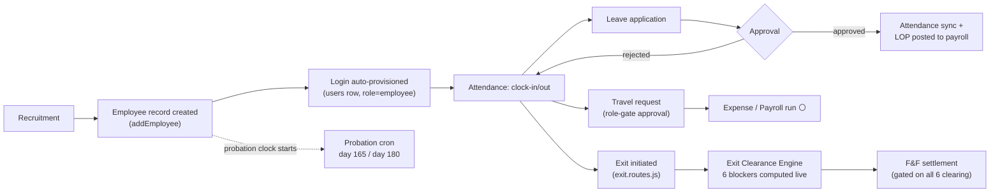

| Event | Trigger (file:line) | Downstream today | Notification | Status |
|---|---|---|---|---|
| Employee record created | `employees/employee.controller.js` (add) | `employees` row inserted | — | ✅ |
| Login auto-provisioned | `employees/employee.service.js:8-60` `createLoginForEmployee` | `INSERT INTO users` (role=`employee`, bcrypt hash of `DEFAULT_EMPLOYEE_PASSWORD` env / `Welcome@123` default, `must_change_password=true`), then `syncPrimaryRole()` writes `user_roles`. **Scope correction from the Recruitment pass**: this is one of three separate `employees`-row-creation code paths in the codebase, and the only one of the three that provisions a login — see the Recruitment Lifecycle section below for the other two (both hire-a-candidate paths), neither of which calls this function | None sent to the new employee (password is returned in the API response only) | ✅ but 🟡 — no email/SMS delivers the credential; whoever calls the add-employee API must relay it out-of-band; also 🟡 — doesn't apply to recruitment-sourced hires at all |
| Probation tracking | `jobs/probation.cron.js` full file | Day-165: warns reporting manager + all `super_admin`s. Day-180: due-reminder to same. Deduped via `reference_id`+`module_name`+`notification_type` on `notifications` | `notificationsRepository.create()` — full push fanout | ✅ — the best-built notification path in the audit |
| Daily attendance | `jobs/attendance.cron.js:22-92` (auto-absent), `:95-144` (auto-checkout) | Auto-marks `absent` for anyone with no record and no approved leave that day (respects working-days + holidays config); force-checks-out anyone past `auto_checkout_time`, computing OT hours | — | ✅ |
| Monthly attendance freeze | `jobs/attendance.cron.js:154-173` | Reminds `hr`/`hr_admin`/`hr_manager`/`admin` on the 1st | Raw insert | ✅ but 🟡 — DB-only |
| Leave apply | `modules/leaves/routes/leaves.routes.js:795-1005` `handleApplyLeave` | Balance-validated against `leave_balances`; `manager_id` auto-resolved via `reporting_manager_id` FK first, name-match fallback (`resolveManagerEmployeeId`, lines 245-260). Also fires `evaluateRules('leaves', application)` (`:987`) — real call, but see the AI/Intelligence section's rule-engine finding: `rules_master` has never had a `module='leaves'` row, so this always evaluates against zero rules in practice | — | ✅ |
| Leave approve (L1/L2/HR) | `leaves.routes.js:1012-1101` (`/approve/manager`, `/approve/l2`, `/approve/hr`) | Gate is `requirePermission('leaves','approve')` — **role only**. `leavesRepository.approveByManager()` (`repositories/leaves.repository.js:213-227`) writes the actor's own `employee_id` into `manager_id` via `COALESCE(manager_id, $3)` — it never checks the actor **equals** the pre-resolved `manager_id`. Net: any user holding leave-approve permission can approve any employee's leave, not just their direct reports. Same shape as the Travel gap the prior audit flagged (⚪ not re-checked this session, plausibly identical) | notify submitter via `notifyLeaveEvent` | 🟡 — FK exists and is used for targeting/display, not enforcement |
| Leave approved | same handler, then `syncLeaveToAttendance()` (`leaves.routes.js:19-83`) + `postLopToPayroll()` (`:108`, called at `:1022,1058,1093`) | Writes `attendance_records` for each leave day (respects existing present/late records); posts LOP for probation/clubbing cases straight into payroll | — | ✅ — genuinely wired end to end |
| Leave SLA breach | `jobs/leave.cron.js:268-312` | Escalates applications pending >3 days to `manager_id` | `WorkflowNotificationService` (flag-gated, DB-only) | ✅ but 🟡 |
| Travel request → level-approve | `modules/travel/travel.routes.js:1199-1217` `PUT /requests/:id/level-approve`, using new `travelApprovalAuthz.js` (added by a concurrent session later the same day this section was first written — re-verified against current code, not carried from the earlier draft of this row) | **Now genuinely fixed for Level 1**: `authorizeManagerApproval()` checks `employees.reporting_manager_id` against the actor's `employee_id`, with delegate (`delegate_approver_id`)/HR/admin override paths — no longer role-only. Levels 2/3 (Department Head/Management) remain role-gated (`LEVEL_23_ROLES`, `:1198,1215-1216`) by explicit design, since the schema has no per-employee identity to check at those tiers. **Leave approval (above) has the identical old role-only shape and was not similarly fixed as of this check** — worth watching whether the same `travelApprovalAuthz.js` pattern gets applied there too | `notifyWorkflowEvent('rejected'/'approved', ...)` | ✅ — genuinely fixed, corrects the 🟡 first recorded in this document |
| Expense/Reimbursement | — | ⚪ not investigated this session | ⚪ | ⚪ |
| Payroll run | see [Payroll Lifecycle](#payroll-lifecycle) below — now traced in depth, including a refinement of the LOP-feed claim above (it's order-dependent on whether the run already exists) | — | — | ✅ (moved) |
| Exit initiated | `modules/hr/exit.routes.js:185-218` `POST /initiate` | Real module (not a gap — corrects an earlier draft of this document that missed it by searching the wrong path). Inserts `exit_requests`, immediately updates `employees.status` to `terminated`/`left`/`resigned` per `separation_type`, inside one transaction | — | ✅ |
| Exit clearance | `exit.routes.js:49-103` `computeClearanceBlockers` | Computes 6 blockers **live** against source-of-truth tables — assets pending return (`employee_asset_allocations`), unsettled travel advances (`travel_advances`), active logins (`users.is_active`) are all queried fresh, not read from a stale checkbox; finance/manager/HR NOC are human sign-offs stored in `exit_clearance` | — | ✅ |
| IT access revoke | `exit.routes.js:574-591` `PUT /clearance/:employee_id`, `if (access_revoked)` block | **Real automation, but the trigger is a manual HR action, not automatic on exit-initiation or status change**: only when HR explicitly ticks `access_revoked=true` in the clearance form does `UPDATE users SET is_active=false ... WHERE employee_id=$1` fire, audit-logged via `logAudit`. The route's own comment confirms this used to be cosmetic ("nothing ever set `users.is_active`") and was fixed. So: initiating exit or changing status to `Left`/`terminated` alone does **not** deactivate the login — a human must complete the clearance step first | — | 🟡 — real, but not automatic; a terminated employee whose HR clearance step is delayed keeps an active login in the interim |
| F&F settlement | `exit.routes.js:337-438` (compute, with gratuity/PF/leave-encashment formulas) and `:467-508` `POST /fnf/:id/pay` | Payment is **hard-gated** on all 6 clearance blockers clearing (`can_settle`) — cannot mark F&F paid with outstanding assets/advances/access/NOCs. On pay, bridges `employees.status='left'` + `exit_date` | `notifyWorkflowEvent('approved', ...)` on F&F approval (`:454-461`) — flag-gated, DB-only | ✅ — the strongest-gated automation found in this lifecycle |
| Exit ↔ Travel-closure integration | — | `MODULE_FEATURE_CONNECTION_MANUAL.md` §18 documents that a `GET /closure-check` endpoint already exists and is used to gate project/PO closure, but is confirmed **not called from Exit** — the exit clearance engine re-implements its own travel-advance check (above) rather than reusing it. Not re-verified independently this session; cited from the manual | — | ⚪ (manual-sourced) |

---

## Customer Lifecycle

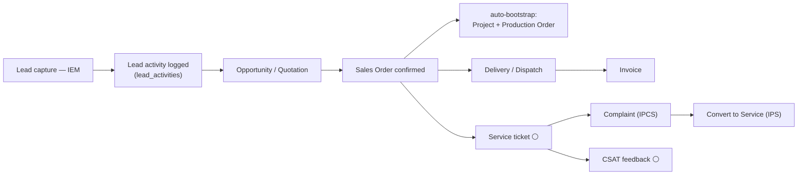

| Event | Trigger (file:line) | Downstream today | Notification | Status |
|---|---|---|---|---|
| Lead capture, scoring, conversion | see [CRM Pipeline Lifecycle](#crm-pipeline-lifecycle) below — now traced in full depth, including a positive contrast with Service's dead `auto_assignment_rules` | — | — | ✅ (moved) |
| Sales Order confirmed | `modules/sales/routes/sales.routes.js` (autoBootstrap block, ~lines 60-150; confirm/accept handlers at `:675-679`, `:841-845`) | Creates `lifecycle_instances` row, then **best-effort** auto-creates a `projects` row (`planning` status, `EPC` type) and a `production_orders` row via `createProductionOrderFromSalesOrder`, matching a `bom_headers` row by `product_name ILIKE` the first order line's description. Each step is individually try/caught as non-fatal; a hard failure rolls back the whole bootstrap | `notifyWorkflowEvent('order_confirmed', ...)` — flag-gated, DB-only | ✅ — real cross-module automation, with an honest "best-effort BOM match" caveat baked into the code itself |
| Order dispatched | `sales.routes.js:885` | — | `notifyWorkflowEvent('dispatched', ...)` | ✅ but 🟡 (DB-only) |
| Service ticket raised | see [Service/Complaints/Feedback Lifecycle](#servicecomplaintsfeedback-lifecycle) below — now traced in depth | — | — | ✅ (moved) |
| Complaint (IPCS) → Service (IPS) conversion | see [Service/Complaints/Feedback Lifecycle](#servicecomplaintsfeedback-lifecycle) below — **confirmed the linkage fix actually landed**: `POST /servicedesk/tickets` now writes `complaint_id` at creation (was 0/14 populated at last audit) | — | — | ✅ (moved, upgraded from "intent confirmed" to fully verified) |
| CSAT / feedback (`csat_responses`) | see [Service/Complaints/Feedback Lifecycle](#servicecomplaintsfeedback-lifecycle) below | — | — | ✅ (moved) |
| Stale-lead / quotation-expiry reminders | — | **No cron job in the 11-job inventory touches this** (confirmed by the complete cron list above) | none | 🔴 |

---

## CRM Pipeline Lifecycle

The front half of the Customer Lifecycle above, which previously jumped straight from a bare
mention of `lead_activities` to Sales Order confirmation. Traces Lead → Opportunity → Quotation
→ Project, the handoff point into the Sales Order flow already documented.

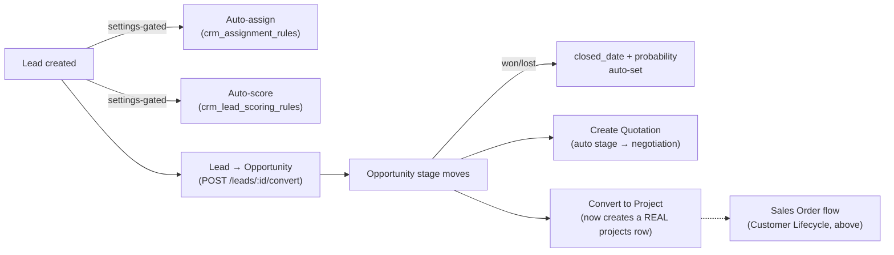

| Event | Trigger (file:line) | Downstream today | Notification | Status |
|---|---|---|---|---|
| Lead created | `crm.routes.js:523-608` `POST /leads` | Duplicate-email check (409) within the company. **Two settings-gated automations, both genuinely invoked** (not just configured) — contrast this directly with Service's `auto_assignment_rules`, which is configured but never called: (1) if `crm_settings.auto_assign_owner` and `lead_assignment_method='round_robin'`, queries `crm_assignment_rules` ordered by priority, matches each rule's `condition_field`/`condition_value` against the submitted lead data, and assigns to the first matching active employee found by name; (2) if `crm_settings.auto_score_on_create`, queries `crm_lead_scoring_rules` and additively applies each matching rule's `score_delta` (operators: `equals`/`contains`/`not_empty`), clamped 0-100 | — | ✅ — real automation, opt-in via company settings |
| Lead → Opportunity conversion | `crm.routes.js:778-915` `POST /leads/:id/convert` | Row-locked (`FOR UPDATE`) against concurrent double-conversion; blocks if the lead is already `converted` or an opportunity already exists for it. Carries `expected_value`/`probability`/`zone→region` forward from the lead rather than requiring re-entry — the route's own comment documents this as a fix for a real prior bug ("opportunities.region was left NULL on every converted enquiry, which silently broke regional reporting"). Writes an immutable `lead_activities` conversion record with the correct employee-id actor (avoiding the `stock_ledger.created_by`-style users/employees mixup elsewhere in this codebase) | `notifyWorkflowEvent('submitted', ...)` to the assigned user | ✅ |
| Opportunity stage change | `crm.routes.js:1121-1179` `PATCH /opportunities/:id/stage` | Moving to `won`/`lost` auto-sets `closed_date` and `probability_percentage` (100/0) in the same update; writes `opportunity_stage_history` (gracefully no-ops if that table doesn't exist yet, rather than failing the stage change). **No notification fires on stage change itself** — unlike lead-convert and create-quotation, both of which do | none | ✅ automation; 🟡 silent to anyone watching for it |
| Opportunity → Quotation | `crm.routes.js:1199-1269` `POST /opportunities/:id/create-quotation` | Row-locked, blocks duplicate quotation creation per opportunity (409 with the existing `quotation_id` if one exists). Auto-generates a sequential `QT-{year}-{seq}` number, creates the quotation in `draft` status pre-filled from the opportunity, and **auto-advances the opportunity's own stage to `negotiation`** in the same transaction | `notifyWorkflowEvent('submitted', ...)` | ✅ |
| **Opportunity → Project — a real, recently-fixed bug** | `crm.routes.js:1271-1349` `POST /opportunities/:id/convert-to-project` | The route's own comment states the prior behavior precisely: *"previously only created an Operations `lifecycle_instances` stub (project_id always null) — no row was ever written to `projects`, so Sales saw a success toast but nothing existed for Projects/Finance to act on."* Now genuinely creates a `projects` row (status `planning`, linked via `opportunity_id`) before still creating the `lifecycle_instances` record for Operations tracking, this time correctly linked to the new project. Idempotent — re-invoking against an opportunity that already has a project returns the existing one (`200`, `already_existed: true`) rather than creating a duplicate. This is the entry point into the already-documented Sales Order / auto-bootstrap flow in the Customer Lifecycle above, for opportunities that go through Projects rather than a pure Sales Order | — | ✅ — confirmed fixed, not just claimed |
| Win-loss reasons / analysis | `pipeline.routes.js:271-361` (`win-loss-reasons` CRUD, `win-loss-analysis`) | Existence-confirmed CRUD + reporting; not traced into whether reasons are enforced (e.g. required on marking an opportunity `lost`) | — | ✅ existence confirmed, not traced in depth |

---

## Marketing Lifecycle

The module manual's own diagram carries the comment `%% Marketing was not connected to anything`
next to solid `MARKETING --> CRM` / `MARKETING --> PROJECTS` edges. This pass checks whether that
note is stale or still true. **It's still true**, specifically for lead attribution — verified
directly rather than assumed from the comment.

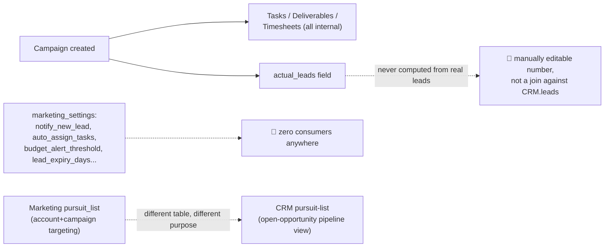

| Event | Trigger (file:line) | Downstream today | Notification | Status |
|---|---|---|---|---|
| Campaign created / managed | `marketing.routes.js:142-190` (`POST /campaigns`, status patch, delete) | Real CRUD with budget/spend tracking, own status lifecycle. Scoped entirely within the marketing module | — | ✅ existence confirmed |
| Campaign tasks / deliverables / timesheets | `marketing.routes.js:208-332,432-486` | Self-contained sub-tables (`marketing_tasks`, `marketing_deliverables`, `marketing_timesheets`) — real CRUD, all four `campaign_id` foreign keys in this module point **only to these three internal tables plus `marketing_pursuit_list`**, confirmed by reading the full schema (`baseline.sql:11180-11274`). None reference `leads`, `opportunities`, or any other CRM table | — | ✅ existence confirmed; genuinely self-contained |
| **Campaign → lead attribution — confirmed still not connected** | `marketing.routes.js:534-546` `GET /analytics/leads-by-campaign` | This is the manual's exact claim, checked directly: the endpoint reads `marketing_campaigns.actual_leads` — a plain integer column, editable via the generic campaign `PUT` (`:158` lists it in the allowed-fields array) — and **never joins against the real `leads` table**. Confirmed no `campaign_id` column or equivalent exists anywhere in `modules/crm` (repo-wide search). So "leads by campaign" reporting is only ever as accurate as whoever manually typed a number into the campaign record; a real lead created through the CRM Pipeline Lifecycle above has no way to credit a marketing campaign at all | — | 🔴 — the manual's "not connected" comment is still accurate today, specifically here |
| **`marketing_settings` — fourth confirmed instance of settings-without-automation** | `marketing.routes.js:549-608`, `marketing_settings` table (`notify_new_lead`, `notify_campaign_end`, `notify_budget_alert` all default **false**; `auto_assign_tasks` default false; `auto_close_days` default 90; `lead_expiry_days` default 30; `budget_alert_threshold` default 80%) | All seven fields are referenced **only inside the settings GET/PUT handlers themselves** — repo-wide search found no other consumer. Joins Procurement's (`alert_vendor_rating_drop`/`alert_overdue_delivery`) and L&D's (`lnd_settings` reminders) as the same shape, now confirmed a fourth time. Notably these default **off** rather than L&D's default-**on** — a smaller blast radius if a company assumes they're active, but the underlying gap (feature implied, feature absent) is identical | none, ever | 🔴 — fourth confirmed instance this session |
| "Pursuit list" — two unrelated features sharing a name | `marketing.routes.js:372-426` (`marketing_pursuit_list`: `account_id`+`campaign_id`, status `targeted`, priority) vs `crm.routes.js:1754-1773` (`GET /pursuit-list`: open, non-won/lost `opportunities` sorted by value) | **Not a duplicate-table bug** — checked precisely because the codebase has a known history of genuine duplicate CRM table families (see memory on `crm_*` twins). These two are legitimately different: Marketing's is a pre-sales account-targeting worklist tied to a campaign; CRM's is a live "which open deals matter most" pipeline view. Worth documenting the distinction explicitly so a future reader doesn't conflate them or assume one feeds the other — neither does | — | ✅ — verified as coincidental naming, not a bug |
| Orders won-lost / user-performance | `marketing.routes.js:332-372,486-514` | Existence-confirmed reporting endpoints; not traced into whether they read live CRM opportunity data or another `marketing_*`-local snapshot | — | ⚪ not traced this pass |

---

## Production Lifecycle

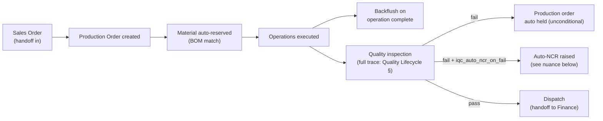

| Event | Trigger (file:line) | Downstream today | Notification | Status |
|---|---|---|---|---|
| Production Order created (from Sales Order) | `sales.routes.js` autoBootstrap → `createProductionOrderFromSalesOrder` | Seeds `production_operations` when a BOM match is found | see Customer lifecycle | ✅ |
| Material auto-reservation | `modules/production/execution.routes.js:73-91` `autoReserveMaterials`, called at order creation (`:905`) | Inserts `material_reservations` rows against the matched BOM and planned quantity | — | ✅ (re-verified this session) |
| Backflush on operation complete | `execution.routes.js:99+` `backflushMaterials` | Consumes `material_reservations` (updates `qty_issued`/status) when an operation is marked complete; feeds finished-goods receipt | — | ✅ (re-verified this session) |
| Quality inspection | `modules/quality/quality.routes.js` `POST /inspect` (`:229-276`), `PUT /inspect/:id` (`:192-225`), `PUT /tests/:id` (`:1071-1134`) | Full event chain — checklist inspections, discrete test-runs, auto-eval, auto-NCR, and the settings-default inconsistency behind "opt-in" — now traced in depth in the [Quality Lifecycle](#quality-lifecycle) section below. Superseded here to avoid duplicating that detail | — | ✅ — see Quality Lifecycle |
| Stop-ship / order hold on NCR | `quality.routes.js:25-38` `holdProductionOrderOnQcFail`, called unconditionally (not settings-gated) on any test failure via `PUT /tests/:id` (`:1108-1110`) | Sets `production_orders.status='on_hold'` directly — **this part is unconditional**, unlike the auto-NCR creation next to it which is settings-gated (see Quality Lifecycle). Re-verified this session, resolves the prior ⚪ | — | ✅ |
| Subcontracting / batch genealogy | `modules/production/subcontracting.routes.js`, `genealogy.routes.js` | ⚪ not re-traced this session (prior audit: `inventory_batches.warehouse_id NOT NULL` constraint noted) | — | ⚪ |
| Dispatch → Finance handoff | see Finance lifecycle (milestone/delivery-driven invoice) | — | — | ✅ (Finance side confirmed below) |
| Predictive maintenance / IoT failure scoring | `iotMonitor.cron.js` + `raiseAlert()` → auto service ticket on critical stale devices | Confirmed this session (see cron table) — this is IoT-equipment monitoring, distinct from production-line QC | via `raiseAlert()` | ✅ |
| Engineering Change → BOM revision | see [Engineering/R&D Lifecycle](#engineeringrd-lifecycle) below — a genuinely strong finding: implementing an ECN doesn't just flip a status flag, it promotes a draft BOM to active and retires the old one | — | ✅ (moved) |

---

## Finance Lifecycle

Two chains: **Accounts Payable** (PO → GRN → vendor payment) and **Accounts Receivable /
Assets** (invoice → payment → depreciation → reports).

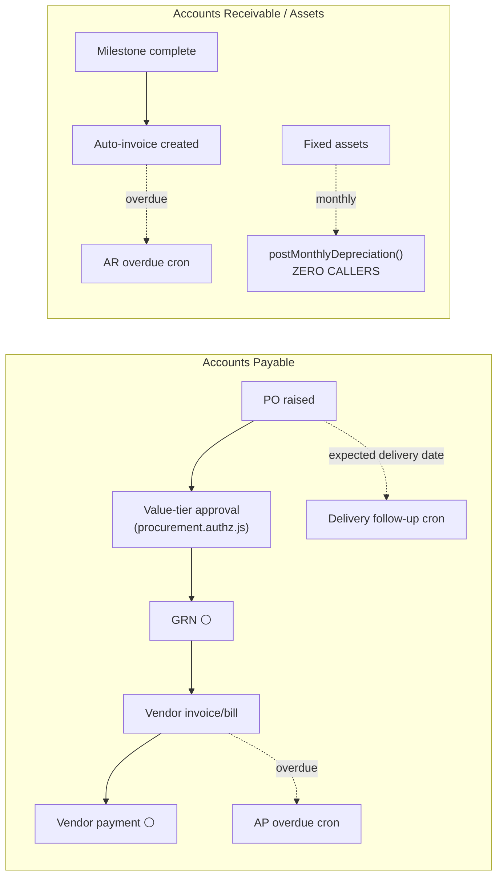

| Event | Trigger (file:line) | Downstream today | Notification | Status |
|---|---|---|---|---|
| PO value-tier approval | `modules/procurement/procurement.authz.js:1-58` | `approvalLevelOf()` takes the max role-level across all roles a user holds; 4 bands (`auto`/`l1`/`l2`/`l3`/`cfo`) mapped against `procurement_settings` limits. File's own header documents 3 defects it fixed (multi-role scoring, missing L3 role rows, ignored `cfo_approval_above` band) | ⚪ | ✅ — one of the most carefully-built pieces of authorization in the codebase |
| Vendor-rating gate on PO | see [Procurement/Vendor Lifecycle](#procurementvendor-lifecycle) below — now ✅ verified | — | — | ✅ (moved) |
| 4-stage vendor-approval workflow | see [Procurement/Vendor Lifecycle](#procurementvendor-lifecycle) below — now ✅ verified | — | — | ✅ (moved) |
| PO delivery follow-up | `jobs/deliveryFollowup.cron.js` full file | Reminds admin/manager/procurement roles 7 days (`PO_DELIVERY_REMINDER_DAYS`) before `expected_delivery_date`, deduped per PO/user/day | Raw insert | ✅ but 🟡 |
| GRN | see [Procurement/Vendor Lifecycle](#procurementvendor-lifecycle) below — now ✅ verified | — | — | ✅ (moved) |
| Vendor payment / AP bill creation | see [Procurement/Vendor Lifecycle](#procurementvendor-lifecycle) below — now ✅ verified (3-way-match approval auto-creates the AP bill) | — | — | ✅ (moved) |
| AP overdue (`bills`) | `jobs/overdueReminders.cron.js:61-83` | Daily 09:00 sweep of unpaid bills past `due_date` with `balance>0` | Raw insert | ✅ but 🟡 |
| Milestone → invoice | `modules/projects/routes/projects.routes.js` `PUT /milestones/:id/complete` (~lines 548-607) | Creates a **real** `invoices` row and links it back via `project_milestones.invoice_id`/`invoice_created`. Route's own comment (line 548-550) states this used to just flag "invoiced" with no real invoice — confirms a previously-fixed gap, not a still-open one | — | ✅ — genuinely wired |
| AR overdue (`invoices`) | `jobs/overdueReminders.cron.js:37-59` | Same pattern as AP, mirrored for `invoices` | Raw insert | ✅ but 🟡 |
| **Monthly depreciation posting** | `modules/finance/services/depreciation.js:100,214` `postMonthlyDepreciation` | **Corrected in the Fixed Assets lifecycle pass** — see that section below for the full picture. Short version: zero callers is still true, but the function also has its own bug (`UPDATE fixed_assets SET book_value=...` — the real column is `current_book_value`, confirmed against `baseline.sql:7883-7908`), and a *second*, separately-implemented, manually-triggered depreciation mechanism already exists and works (`POST /finance/assets/run-depreciation`). "Just wire it into a cron" is not the right fix as originally stated here | none | 🔴 — real gap, but see Fixed Assets lifecycle for the accurate fix |
| Ledger posting & period/year-end close | see [Finance Ledger Posting & Close Lifecycle](#finance-ledger-posting--close-lifecycle) below — now traced in depth | — | — | ✅ (moved) |
| Cash-flow forecasting / fraud detection (AI) | — | No `/api/intelligence` or `/api/ai` endpoint was found wired into any event in this lifecycle this session | — | 🔴 (as far as verified) |

---

## Finance Ledger Posting & Close Lifecycle

`modules/finance/accounting.routes.js` is the central accounting engine every other lifecycle's
journal-entry citations point back to — Payroll's `postPayrollJournal()`, Fixed Assets'
depreciation/disposal, Procurement's 3-way-match-to-bill. This section covers the engine itself:
how an entry gets created, validated, posted, and how a period or fiscal year closes.

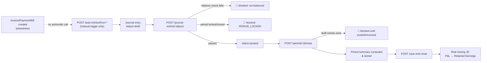

| Event | Trigger (file:line) | Downstream today | Notification | Status |
|---|---|---|---|---|
| **"Auto"-entries from invoice/payment/bill — manual-trigger only, despite the name** | `accounting.routes.js:847-1054` `POST /auto-entries/from-invoice/:id`, `/from-payment/:id`, `/from-bill/:id` | Repo-wide search found these three endpoints referenced **only within this file** — no route in `modules/sales` or elsewhere calls them when an invoice/payment/bill is actually created. Same shape as Fixed Assets' `run-depreciation`: real, correct logic (validates debit=credit balance via `validateBalance()` before allowing the insert, builds proper AR/Revenue/GST-payable lines for the invoice case using **yet another distinct chart-of-accounts code set**, `1002`/`4001`/`2002`) — but "auto" in the name is aspirational; a human or the frontend must explicitly call these per-record. Creates the entry in `draft`, not `posted` | — | ✅ logic; 🔴 the "auto" is not automatic |
| **Journal entry posting — the best-enforced gate found in this document** | `accounting.routes.js:139-181` `POST /journal-entries/:id/post` | Three real checks, none of them decorative: (1) entry must be `status='draft'` (can't double-post); (2) `checkLockDate()` blocks posting into a locked period (`403 PERIOD_LOCKED`); (3) `validateBalance()` rejects unbalanced entries outright — not a warning, a hard `400`. A fourth check — an `accounting_periods` row must exist and be `open` for the entry's date — is **only enforced if the company has configured periods at all**, a deliberate graceful-degradation choice (companies that never set up period tracking aren't blocked by a feature they didn't opt into) | — | ✅ — genuinely rigorous |
| Journal entry reverse | `accounting.routes.js:184-235` `POST /journal-entries/:id/reverse` | Existence-confirmed counterpart to posting; not traced into its own balance/period logic this pass | — | ✅ existence confirmed |
| **Period close** | `accounting.routes.js:704-750` `POST /periods/:id/close` | Real gate: refuses to close (`400`) if any `draft` journal entries fall within the period's date range — forces everything to be posted or reversed first, not just marked closed over an inconsistent ledger. On success, computes and **stores** a real period summary (total debits, total credits, net income via `SUM(Revenue credit-debit) − SUM(Expense debit-credit)` joined against `chart_of_accounts.account_type`) as a JSON snapshot on the period row, not just flipping a status flag | — | ✅ |
| **Year-end close — genuinely textbook-correct** | `accounting.routes.js:1055-1130+` `POST /year-end-close` | Computes real net P&L for the fiscal year (Apr 1–Mar 31, Indian FY convention) from posted entries only; blocks if any draft entries exist anywhere in the FY; **creates a real closing journal entry** transferring the P&L into Retained Earnings (chart-of-accounts code `3002`) via Current-Year-P&L (`3004`), correctly reversing debit/credit direction depending on profit vs. loss; posts the entry directly (`status='posted'`, not left in draft, unlike the auto-entries above). This is double-entry bookkeeping done properly, not approximated | — | ✅ — one of the best-built pieces of automation in this entire document |
| **GL account-code scheme count, updated** | cross-reference: this file's `1002`/`4001`/`2002` (invoice auto-entry), `3002`/`3004` (year-end close) | Combined with the three already found in Fixed Assets (`postMonthlyDepreciation`'s lookup, `run-depreciation`'s hardcoded map, `dispose`'s hardcoded set) and Payroll's `postPayrollJournal` (`5010`/`5011`/`5012`/`2040`), this document has now found **at least six independent, uncoordinated GL-account-code references** across the codebase, none sharing a common lookup helper. None is individually wrong in isolation, but there is no single source of truth for "which chart-of-accounts code means what" — a company whose seeded chart of accounts doesn't happen to include all six sets' codes will see some automations silently no-op (several of these routes explicitly check for account existence and return a clean error rather than crash, which is the one mitigating factor) | — | 🟡 — works today, fragile by construction |
| Trial balance / P&L / balance sheet / general ledger / day-book / cash-bank-book | `accounting.routes.js:236-676`, `1598-1751` | Read-only reports over posted entries — existence-confirmed, not individually traced; these are the consumers of the posting discipline above, not automation themselves | — | ✅ existence confirmed |
| Recurring vouchers | `accounting.routes.js:2033-2141` `GET/POST /recurring-vouchers`, `POST /recurring-vouchers/:id/generate` | A real recurring-entry template mechanism exists, but `/generate` is (by its name and route shape) another manual-trigger endpoint, not cron-driven — no cron in the confirmed 11-job inventory targets it | — | 🟡 — same "auto-named, manually-triggered" shape as the auto-entries above |

---

## Procurement/Vendor Lifecycle

Two chains: **sourcing/onboarding** (new vendor → 4-stage approval) and **buy-to-pay**
(requisition → PO → GRN → 3-way match → AP bill → vendor rating, feeding back into the next PO).

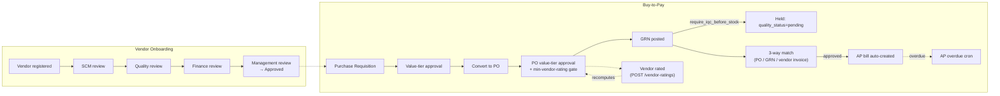

| Event | Trigger (file:line) | Downstream today | Notification | Status |
|---|---|---|---|---|
| Vendor onboarding — 4-stage approval | `modules/procurement/routes/vendor-approval.routes.js` — SCM (`:86`), Quality (`:117`), Finance (`:147`), Management (`:177`) reviews | Sequential, each stage gated by `allowRoles(...)` for the relevant department (procurement/scm → quality → finance → manager/director). Management approval is the terminal step (`mgmt_approved_by`/`mgmt_approved_at`, `:191`) | not traced | ✅ — confirms the prior audit's "4-stage vendor-approval workflow" claim |
| Purchase Requisition (PR) approval | `modules/procurement/routes/procurement.routes.js:162-223` `PUT /purchase-requests/:id/approve` | Uses the **same** value-tier engine as PO (`requiredBand`/`assertCanDecideAmount` imported from `procurement.authz.js:14`, not a duplicate) — one consistent authz engine for both PR and PO. Amount is derived live from line items if the stored header total is zero/missing, specifically so a stale total can't silently downgrade a high-value PR past the role gate (`:172-183`). `approved_by` correctly stores `req.user.employee_id`, not `users.id` — the route's own comment documents this was previously FK-violating for every admin account with no matching `employees` row, 500'ing approval for the only users able to clear high-value requests | `notifyWorkflowEvent('approved', ...)` (flag-gated, DB-only) | ✅ |
| PR → PO conversion | `procurement.routes.js:262` `PATCH /purchase-requests/:id/convert-to-po` | — | — | ✅ (existence confirmed; conversion logic not individually traced) |
| PO value-tier approval | `procurement.authz.js:1-58` (see Finance lifecycle above) | Same engine as PR | — | ✅ |
| **Vendor-rating gate on PO approval** | `procurement.routes.js:515-523`, inside `PATCH /purchase-orders/:id/approve` | Checks `procurement_settings.min_vendor_rating` (default **3**, out of an implied 0-5 scale) against the average of the vendor's `quality_rating`+`delivery_rating`+`price_rating` on the `vendors` row. Blocks approval with HTTP 400 if below threshold — but **only for vendors that already have a rating**; a brand-new, never-rated vendor (`avgRating === 0`) bypasses the gate entirely (`avgRating > 0 &&` condition, `:519`) | — | ✅ but 🟡 — real gate, silently skipped for unrated vendors |
| GRN posted | `modules/procurement/services/grn.service.js:9-60+` `createGRN`, called from `procurement.routes.js:568-596` | Checks `quality_settings.require_iqc_before_stock` (**default true**) — if true, immediately sets the new GRN's `quality_status='pending'`, holding it for Quality clearance rather than making stock available on receipt. Updates the PO line's received quantity (accepted qty only: `received - rejected`). Creates an `inventory_batches` row per accepted line for genealogy, numbered `GRN-{number}-{itemId}` if no batch number supplied. Fires `checkAndCreateAlerts()` per received item — low-stock alerting is wired directly off receipt, not a separate cron. `req.user.employee_id` is correctly passed as the actor (avoids the `stock_ledger.created_by` FK-to-employees trap noted elsewhere in this codebase) | `notifyWorkflowEvent('received', ...)` **only if** `procurement_settings.notify_grn_receipt` is true — **defaults to false** | ✅ but 🟡 — silent by default |
| 3-way match (PO / GRN / vendor invoice) | `procurement.routes.js:962-996` `POST /three-way-match` | Manually submitted (someone keys in the vendor invoice number/date/amount against a `po_id`/`grn_id`) — not auto-triggered by bill receipt. GRN leg is derived live from `grn_items` (accepted qty × rate), explicitly **not** swallowed on error per the route's own comment (a prior silent catch pinned `grn_amount` at 0 and made every match falsely read as a discrepancy — now fixed). Classifies `matched` vs `discrepancy` at a flat 1% tolerance against the PO amount | — | ✅ but 🟡 — real matching logic, but nothing pushes vendor invoices in automatically |
| 3-way match enforcement | `procurement_settings.enforce_3way_match` / `block_payment_on_mismatch` | Both **default false** — a discrepancy is recorded but does not block anything downstream unless a company explicitly opts in | — | 🟡 — opt-in, not enforced out of the box |
| **3-way match approval → AP bill auto-created** | `procurement.routes.js:1184-1244` `PATCH /three-way-match/:id/approve` (`allowRoles('super_admin','admin','finance','finance_manager','procurement_manager')`) | Genuinely wired cross-module automation: approving a match inserts a real `bills` row (`status='unpaid'`, `notes='Auto-created from 3-way match approval'`, `:1215-1231`) — this is what actually feeds the AP overdue cron documented in the Finance lifecycle above. Ships with its own already-fixed bug: `vendors.id` and `parties.id` are different keyspaces with no FK between them (`parties.id` is uuid per prior audit), so the route resolves the bill's `party_name`/party link by **case-insensitive name match** against `parties`, falling back to a name-only bill (never blank) if no match is found | — | ✅ — the concrete link from Procurement into the Finance AP chain |
| Vendor rating submitted | `procurement.routes.js:1049-1074` `POST /vendor-ratings` | Inserts a `vendor_ratings` row, then immediately recomputes and writes `AVG(quality_score)`/`AVG(delivery_score)`/`AVG(price_score)` back onto the `vendors` row's `quality_rating`/`delivery_rating`/`price_rating` columns — so the very next PO approval's rating gate reads the update instantly | — | ✅ — closes the loop back into the PO approval gate above |
| Vendor-rating-drop / overdue-delivery alerts | `procurement_settings.alert_vendor_rating_drop`, `alert_overdue_delivery` | **Confirmed dead settings**: both columns exist in `procurement_settings`, are exposed and editable via `GET`/`PUT /settings`, but a repo-wide search found no cron, route, or service anywhere that reads either value to decide whether to fire an alert — same "declared, zero consumers" shape as the `notification_rules` table flagged in the prior audit | none | 🔴 — a toggle in the Settings UI that does nothing |
| RFQ → vendor award | `procurement.routes.js:710-935` (`/rfqs`, `send-to-vendors`, `responses`, `award`) | Pre-PO sourcing flow — exists and is routed | — | ✅ (existence confirmed; scoring/comparison logic not individually traced) |
| Return to Vendor (RTV) | `procurement.routes.js:1777-1805` | — | — | ✅ (existence confirmed, not traced in depth) |
| Approved Vendor List (AVL) block/unblock | `procurement.routes.js:1823-1887` | Separate from the 4-stage onboarding approval above — an AVL entry can be blocked independently | — | ✅ (existence confirmed) |

---

## Quality Lifecycle

One unified engine (`modules/quality/quality.routes.js`) serves inspections triggered from both
Production (operation checklists) and Procurement (incoming GRN tests) — this section is what
the Production and Procurement sections above point to rather than duplicate.

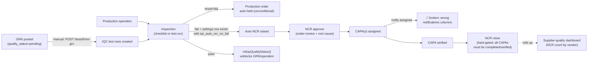

| Event | Trigger (file:line) | Downstream today | Notification | Status |
|---|---|---|---|---|
| GRN → IQC test creation | `quality.routes.js:1037-1068` `POST /tests/from-grn/:grnId` | **Not automatic on GRN post** — a separate, manual call. Creates one `quality_tests` row per received GRN line (stage=`IQC`) unless custom tests are supplied; re-sets `goods_receipt_notes.quality_status='pending'`. Compare to `grn.service.js`'s `createGRN()` (Procurement lifecycle), which already flags the GRN `pending` on receipt itself — that hold is automatic, but the actual test *tasks* for QC to work through require this separate call | — | 🟡 — the block is automatic, generating the work queue is not |
| Test result recorded | `quality.routes.js:1071-1134` `PUT /tests/:id` | Auto-evaluates `result` from `actual_value` vs `spec_min`/`spec_max`/`expected_value` via `evaluateTestResult()` when the caller doesn't set it explicitly; auto-sets `status='completed'`. Same auto-eval pattern likely applies to the checklist-based `POST/PUT /inspect` routes (Production lifecycle, not re-diffed against this one this session) | — | ✅ |
| **Production order hold on fail** | `quality.routes.js:25-38` `holdProductionOrderOnQcFail`, invoked at `:1108-1110` | Sets `production_orders.status='on_hold'` (guarded against already-terminal statuses). **Unconditional** — fires on every `result='fail'` transition regardless of any setting | — | ✅ |
| **Auto-NCR on fail — the "opt-in" nuance, precisely** | `quality.routes.js:1111-1128` (test-run path), `:213-222` / `:264-273` (checklist `/inspect` path) | All three call sites check `quality_settings.iqc_auto_ncr_on_fail` via a raw `SELECT ... WHERE company_id=$1` with **no fallback** if the row doesn't exist (`settings.rows[0]?.iqc_auto_ncr_on_fail`, undefined → falsy). **The only place a `quality_settings` row is ever inserted is `PUT /settings` itself** (repo-wide search confirms zero other writers) — no migration or company-creation hook seeds one. So: the Settings *page* advertises `iqc_auto_ncr_on_fail: true` as the default (`quality.routes.js:803`, the in-memory fallback object `GET /settings` returns when no row exists), but the *enforcement* code path behaves as **false** until a human has actually opened Quality Settings and saved once. This is a materially different mechanism than `require_iqc_before_stock` in `grn.service.js`, which was written with an explicit `settings ? settings.require_iqc_before_stock !== false : true` fallback — that one really does default to enforcing, with no row needed | — | 🟡 — the UI's stated default and the code's actual default disagree for any company that hasn't visited Settings |
| Quality status rollup | `quality.routes.js:1130` `rollupQualityStatus({ grn_id, operation_id })`, called after every test result | Recomputes the aggregate quality status on the parent GRN/operation once all its tests are in — the mechanism that actually lifts the `quality_status='pending'` hold set at GRN receipt | — | ✅ |
| NCR approve | `quality.routes.js:407-421` `POST /ncr/:id/approve` | Sets `status='under-review'`, captures `root_cause`, records approver | — | ✅ |
| CAPA assigned | `quality.routes.js:476-494` `POST /capa` | Inserts `capa_actions` row correctly. **The notification alongside it is broken**: `INSERT INTO notifications (employee_id, type, title, message, module, link)` (`:488`) references four columns — `employee_id`, `type`, `module`, `link` — that **do not exist** on the `notifications` table (real schema per `baseline.sql:12173-12185` is `user_id`/`title`/`message`/`module_name`/`reference_id`/`notification_type`; no `employee_id`, `type`, `module`, or `link` column at all). The query is wrapped in `.catch(() => {})` (`:490`), so it fails on every single call with zero visible error, anywhere, ever | none (silently) | 🔴 — a confirmed, concrete bug: CAPA assignees are never notified, and nothing surfaces the failure |
| CAPA verified | `quality.routes.js:510-527` `POST /capa/:id/verify` | Sets `status='verified'`, records verifier + effectiveness rating | — | ✅ |
| NCR close | `quality.routes.js:423-442` `POST /ncr/:id/close` | **Hard-gated**: counts `capa_actions WHERE ncr_id=$1 AND status NOT IN ('completed','verified')`; returns HTTP 400 listing the open count if any remain. Requires a `disposition` on close | — | ✅ — a real enforced quality gate, not just a status field |
| Calibration due-alerts | `quality.routes.js:625-639` `GET /calibration/due-alerts` | Query-only — returns equipment due within N days (`calibration_alert_days` setting, default 30) when called. **No cron in the 11-job inventory pushes this** — confirmed against the complete cron list in this document's cross-cutting section — so it only surfaces if a human opens the relevant dashboard | none | 🔴 — no proactive reminder exists despite the setting implying one |
| Supplier-quality (vendor feedback loop) | `quality.routes.js:759-782` `GET /supplier-quality` | Real live join of `vendors.quality_rating/delivery_rating/price_rating` against `COUNT(ncr_reports)` by `vendor_id` (total/critical/open). **But `total_grns` and `ppm` (defect parts-per-million) are hardcoded to `0 as total_grns, 0 as ppm` directly in the SQL** (`:771-772`) — not computed, not `NULL`, literally zero for every vendor, every time | — | 🟡 — half real, half a dashboard silently lying with zeroes |
| FAT/SAT punch points & dispatch gate — **resolved in the Projects pass** | `quality_settings.fat_dispatch_gate` (default true per `:803`) implies FAT punch-point closure blocks dispatch | **Confirmed dead**: the only dispatch-transition route, `PATCH /projects/:id/stage` (Projects Lifecycle, `projects.routes.js:204-223`), accepts any `production_stage` including `dispatched` with no check against `fat_trackers`/`sat_trackers` punch-point status whatsoever — it validates the stage name against an enum and nothing else. **Fifth confirmed instance this session** of a settings field implying automation that doesn't exist (after Procurement, L&D, Marketing, and the Rule Engine's admin surface) | — | 🔴 — resolved: the setting is decorative |
| Vendor-onboarding "Quality review" stage | see [Procurement/Vendor Lifecycle](#procurementvendor-lifecycle) above — `vendor-approval.routes.js:117` | Cross-referenced, not duplicated | — | ✅ (moved) |

---

## Fixed Assets Lifecycle

Assets are fragmented across **three unlinked source tables**, confirmed still accurate this
session (a prior finding from [[project_unified_asset_management]]-equivalent work, re-verified
against live route code rather than trusted from memory): `fixed_assets` (Finance — depreciation),
`assets_register` (Maintenance — serviceable equipment), `employee_asset_allocations` (HR —
laptop/SIM issue-and-return). A read-only consolidation layer at `modules/assets/assets.routes.js`
merges rows sharing a `serial_number` for display; it does not change what each source module does.

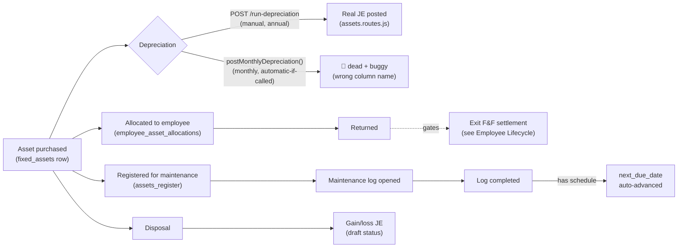

| Event | Trigger (file:line) | Downstream today | Notification | Status |
|---|---|---|---|---|
| **Depreciation — two non-integrated implementations exist** | (1) `finance/services/depreciation.js:100-212` `postMonthlyDepreciation` (2) `finance/routes/assets.routes.js:394-501` `POST /run-depreciation` | Neither is a shared library — `computeSchedule()` in the route file (`:14`) is a locally-defined SLM/WDV calculator, entirely separate from `buildSchedule()` in the service file. **(1)** is monthly-cadence, would run automatically if ever called, dedupes via `journal_entries` lookup by `reference_type='depreciation'`+month, resolves GL accounts by querying `chart_of_accounts` for codes `6100`/`6101`/`6000` (expense) and `1600`/`1601`/`1610`(accum. dep) — **and has a real bug**: its final `UPDATE fixed_assets SET book_value=...` targets a column that does not exist (the real column, confirmed against `baseline.sql:7883-7908`, is `current_book_value`). Every asset's per-row `catch` would swallow this as a logged error and move on, so even wiring this into a cron today would silently post zero successful depreciation entries. **(2)** is annual-cadence (once per financial year), dedupes via a dedicated `asset_depreciation_log` table, uses **hardcoded** account codes (`5040` for expense, a category-keyed map `1110`-`1114` for accumulated dep) rather than a `chart_of_accounts` lookup, correctly targets `current_book_value`, and **actually posts** the journal entry (`journalRepo.postEntry()`, not left in draft) — this one works, but only when a human calls the endpoint; no cron calls it either | none | 🔴 for (1); ✅ but 🟡 for (2) — real automation exists and works, it's just manual-trigger-only and duplicates rather than replaces the broken one |
| Asset disposal | `finance/routes/assets.routes.js:299-391` `POST /:id/dispose` | Computes gain/loss vs `current_book_value`, builds a full multi-line journal entry (bank/cash, accumulated depreciation, asset cost, gain-or-loss balancing line) via a **third**, again-locally-hardcoded set of account codes (`1001`/`1110`/`1100`/`4100`/`5800`, via a local `acctId()` helper querying `chart_of_accounts.code`) — a third independent GL-account-mapping scheme alongside the two depreciation ones above. Creates the journal entry in `status='draft'`, unlike `run-depreciation`'s auto-post — a human must separately approve/post it | — | ✅ but 🟡 — real double-entry logic, three inconsistent account-code schemes across three related functions |
| Employee asset allocation | `hr/employee-assets.routes.js:57-80` `POST /` | Plain insert into `employee_asset_allocations`, `status='allocated'`. No FK to `fixed_assets`/`assets_register` — only linked at read-time by `serial_number` match in the unified consolidation view | — | ✅ (existence + real write path confirmed) |
| **HR-side asset state machine expanded** | `hr/employee-assets.routes.js:134-232` — `POST /:id/transfer` (`:134`), `POST /:id/maintenance` + `/:id/maintenance/complete` (`:160,184`), `PATCH /:id/dispose` (`:209`) | **New since this document's Fixed Assets section was first written** — added by a concurrent session later the same day (confirmed present on re-check, not traced in depth: route bodies exist but their internal logic wasn't individually read this pass). This gives `employee_asset_allocations` its own Transfer/Maintenance/Dispose lifecycle, independent of `assets_register`'s maintenance flow and `fixed_assets`'s disposal flow documented above — a fourth place an "asset lifecycle" now lives, on top of the three-silo situation this section opened with | — | ⚪ existence confirmed, internals not traced this pass |
| Asset returned | `employee-assets.routes.js:110-129` `PATCH /:id/return` | Sets `status='returned'`, records `return_date`/`condition_out`/`returned_to`. **This is exactly the query the Exit Clearance Engine reads** (`exit.routes.js`'s `computeClearanceBlockers`, documented in the Employee Lifecycle above) — confirmed this session that the two routes agree on the same table and status value, so the loop genuinely closes: returning an asset here really does clear that exit blocker | — | ✅ |
| Maintenance log opened / completed | `modules/maintenance/maintenance.routes.js:299-349` `PUT /logs/:id/complete` | Computes `downtime_hrs` from start/end time, restores `assets_register.status='active'`, and — **if the log is tied to a recurring `maintenance_schedules` entry** — auto-advances `next_due_date` by `frequency_days` (default 90). A real recurring-maintenance auto-scheduler, not just a log | — | ✅ |
| Maintenance due notifications | `maintenance.routes.js:693-706` `GET/PUT /notifications` | Read/mark-read endpoints only — a repo-wide search found **no `INSERT` into whatever table backs this** anywhere in this file, and no cron in the confirmed 11-job inventory targets maintenance due-dates. Whether something elsewhere populates it was not resolved this session; behaves, as far as traced, like a dashboard with nothing feeding it | none confirmed | 🔴 (as far as verified) |
| Unified consolidation read layer | `modules/assets/assets.routes.js:85-176` `GET /unified`, `/unified/:source/:id`, `/summary` | Read-only UNION across all three source tables, merged by `serial_number`, source-tagged (finance/maintenance/hr). Gated by `requirePermission('assets', a)` (`:26`) — **correction, resolved during the Compliance pass**: `requirePermission()` itself (`middlewares/auth.middleware.js:226-320`) now fails **closed** by default (HTTP 403 `PERMISSION_NOT_CONFIGURED` when no permission row matches), confirmed by reading the middleware directly. The function's own code comment documents that it used to fail open and names `assets` as one of five modules (alongside `maintenance`, `iot`, `rd`, `compliance`) that shipped with zero permission rows and were reachable by any authenticated user as a result — fixed by migration `20260719000001` completing the permission matrix, inverted to fail-closed by default, with `PERMISSION_FAIL_OPEN=true` left as a loud, logged emergency-only escape hatch. The prior-session finding this row carried forward was accurate as of when it was made, but is now stale | — | ✅ — the fail-open gap this row described is fixed |

---

## Service/Complaints/Feedback Lifecycle

One `support_tickets` table serves both the internal IT/HR helpdesk (`ticket_kind='helpdesk'`,
numbered `TKT-####`) and field service (`ticket_kind='service'`, numbered `IPS-#####`) — a
discriminator design, not a fork, specifically so the CSAT→ticket→complaint FK chain never
splits across twin tables.

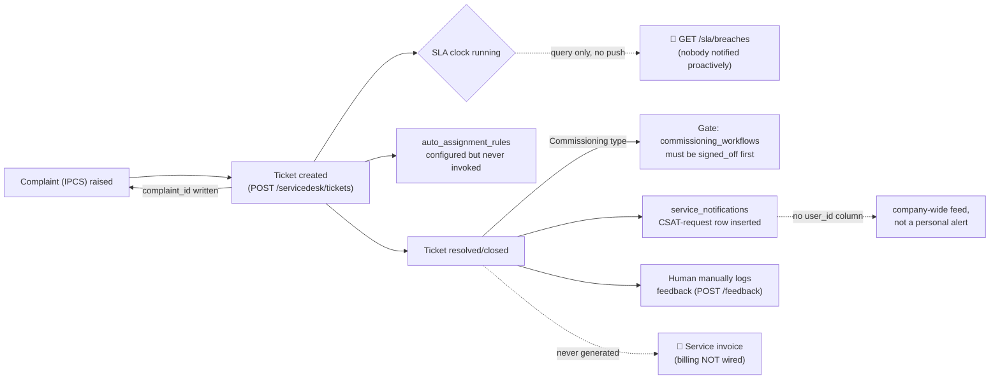

| Event | Trigger (file:line) | Downstream today | Notification | Status |
|---|---|---|---|---|
| Ticket created | `modules/servicedesk/routes/servicedesk.routes.js:460-522` `POST /tickets` | **The IPCS→IPS→IPP linkage gap is confirmed fixed**, re-verified directly against current code (not trusted from memory): `complaint_id`, `project_id`, `site_id`, `customer_id` are all written at creation (`:488-513`) — a prior state where only 10 of 34 columns were written (0/14 tickets linked) is not the current state. Linkage fields are staff-only (`isServiceStaff` gate) so a self-service requester can't attach their ticket to an arbitrary project/complaint. `ticket_kind` picks the numbering sequence (`nextServiceTicketNumber()` vs `nextTicketNumber()`) and is permanently fixed at creation (not updatable). Fires `evaluateRules('service', ticket)` (`:516`) via `RuleEngineService.js`, same call shape as Leave apply's `evaluateRules('leaves', application)` (`leaves.routes.js:987`) — **correction, resolved in the AI/Intelligence section's rule-engine finding**: this call is real code that always returns `[]` in practice, because `rules_master` has never had a `module='service'` (or `'leaves'`) row written to the column set this function reads — the only seeded rows target `module='inventory'`. Not a broken call, just one permanently evaluating against no data | — | 🟡 — real call, structurally empty rule set (see AI/Intelligence section) |
| SLA clock | `servicedesk.routes.js:1082-1129` `GET /sla/breaches` | Computes elapsed time live per ticket against `sla_policies` (or hardcoded priority-tier defaults — critical 0.5h/4h, high 1h/8h, medium 4h/24h, low 8h/72h — if no policy row matches). Returns breached/at-risk tickets **only when called**. No cron in the confirmed 11-job inventory targets service SLA — same "query exists, push doesn't" shape as Quality's calibration alerts and the Fixed-Assets maintenance notifications | none | 🔴 — no proactive SLA breach alert exists, despite policy infrastructure being real |
| Auto-assignment | `servicedesk.routes.js:1265-1352`, `auto_assignment_rules` table (`:134-210`) | A real rules table exists (`conditions`, `assign_to_team`, `assign_to_user_id`, `round_robin_group`, `priority`) and a `POST /tickets/auto-assign/preview` endpoint can simulate matching. **But `POST /tickets` never calls it** — re-read the full ticket-creation handler this session and confirmed `assigned_to` is only set if explicitly passed in the request body. The rule engine is configured and previewable but not wired into the event that would make it useful | — | 🔴 — configured automation that doesn't fire |
| Ticket resolved/closed | `servicedesk.routes.js:539-611` (status transition inside `PUT /tickets/:id`) | **Real enforced gate**: closing a `service_type='Commissioning'` ticket linked to a project blocks with HTTP 400 unless the project's latest `commissioning_workflows.status` is `signed_off`/`completed` (`:548-565`) — Service can't let a commissioning job close without customer sign-off on file. On first transition into Resolved/Closed, auto-inserts a `service_notifications` row (`notification_type='csat_request'`, `:604-611`) | see next two rows | ✅ for the commissioning gate |
| CSAT-request "notification" | `service_notifications` table (`baseline.sql:18331-18342`) | **A fourth, structurally distinct notification mechanism**, alongside the three already documented in this file's cross-cutting section. This table has **no `user_id` or `employee_id` column at all** — `GET /notifications` (`:2036-2046`) reads it filtered only by `company_id`, so every service-desk viewer sees every company-wide event, not a personally-targeted alert. That's a defensible design for a shared ops feed, but it means "CSAT Requested" is an internal staff notice, not anything sent to the actual customer | none reaches the customer | 🟡 — real, but it notifies staff that a survey *should* go out, not the customer that one *has* |
| CSAT/feedback capture | `servicedesk.routes.js:1791-1855` `POST /feedback` (backed by `csat_responses`, extended with `product_rating`/`engineer_rating`/`visited_on_time`/`resolved` per a prior migration) | **Entirely manual** — a staff member opens a "Log Feedback" modal and enters what the customer said; nothing automatically prompts the customer themselves (no outbound email/SMS/link), and nothing links the `csat_request` service_notification row above to a specific `POST /feedback` call. The two are related by convention (both happen after resolution) but not by any code path | — | 🟡 — capture mechanism is real and well-built (KPI split by product/engineer rating), the *solicitation* of the customer is not automated at all |
| Voice-of-Customer (NPS) — genuinely distinct, not a duplicate of CSAT | see [Voice-of-Customer Lifecycle](#voice-of-customer-lifecycle) below | Not the same system as CSAT above — separate NPS-based (0-10, promoter/passive/detractor) methodology under `modules/servicedesk/routes/voc.routes.js`. Traced fully in its own section rather than duplicated here | — | ✅ (moved) |
| Service → Finance billing | — | **Confirmed not wired**, independently re-verified this session (not just carried from the concurrent module-manual pass that first flagged it): a case-insensitive search for `invoice`/`billing`/`bill` across the entire `modules/servicedesk` directory returns zero matches. AMC/service contracts, field visits, and resolved tickets have no code path that creates a Finance invoice or bill anywhere | none | 🔴 — a full revenue-adjacent event with no automation and no manual bridge documented in code either |
| AMC contract renewal reminder | see cross-cutting cron table above — `jobs/amcRenewal.cron.js` | Already documented; not re-covered here | Raw insert | ✅ (already covered) |

---

## Payroll Lifecycle

The module manual's diagram draws `ATT --> PAY`, `LEAVE --> PAY`, `LEAVE --> ATT`, `TIMESHEETS
--> PAY`, and `PERF --> PAY` as solid (claimed-verified) edges. This pass confirms two of those
five hold in the actual payroll-generation code and finds no trace of the other two.

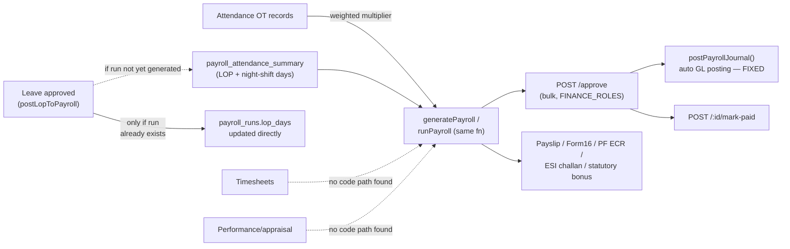

| Event | Trigger (file:line) | Downstream today | Notification | Status |
|---|---|---|---|---|
| Attendance → payroll OT | `payroll.service.js:341-345` (query against `attendance_ot_records`) | Real: sums `ot_hours` and computes a weighted multiplier per employee for the month/year being run, feeding directly into `generatePayroll`'s per-slip `overtime_pay`/`overtime_hours` | — | ✅ |
| Leave (LOP) → payroll — **refined this pass** | `leaves.routes.js:108-153` `postLopToPayroll` | **Order-dependent, more precise than previously recorded**: this function only `UPDATE`s an **already-existing** `payroll_runs` row for that employee/month/year (`WHERE ... LIMIT 1`, no insert if none found) — adding to `lop_days`/`lop_amount` directly, computed at `basic_salary/26` per day (same daily-rate convention as the Exit F&F computation elsewhere in this codebase). If payroll for that month **hasn't been generated yet** when the leave is approved, this UPDATE silently matches zero rows and does nothing — the LOP would need to already be reflected in `payroll_attendance_summary` (read separately by `generatePayroll`, `:352-359`) by whatever process populates that table, which was not traced this session. So: approve-leave-after-generate-payroll updates the run directly; approve-leave-before-generate-payroll depends on an unverified upstream reconciliation step (plausibly the "Attendance Freeze Reminder" cron documented in the Employee lifecycle, which exists specifically to tell HR to freeze attendance *before* processing payroll — but that link wasn't traced code-to-code) | — | 🟡 — real for one ordering, unverified for the other |
| Timesheets → payroll | — | **No code path found.** A case-insensitive search for "timesheet" anywhere in `modules/payroll` returns zero matches, despite the module manual's diagram drawing `TIMESHEETS --> PAY` as a solid/verified edge. Either this connection is genuinely missing, or it exists indirectly through a route this search didn't reach (e.g. project timesheets feeding billing rather than employee payroll) — worth reconciling with whoever maintains that diagram rather than treating either document as automatically correct | — | 🔴 as far as this module is concerned; possible manual-diagram inaccuracy worth flagging rather than a confirmed code gap |
| Performance/appraisal → payroll | — | **Same shape as Timesheets above.** `bonus` is a field payroll writes (`payroll.service.js:450,491,506`) but its value is passed through from the request/slip data, not derived from any `performance_rating`/appraisal source found in this module. The manual draws `PERF --> PAY` as solid; this session found nothing backing it inside payroll generation itself | — | 🔴 as far as this module is concerned; same reconciliation caveat as Timesheets |
| Payroll approval | `payroll.routes.js:104-170` `POST /approve` (`FINANCE_ROLES`) | Bulk-approves all pending `payroll_runs` for a month/year, correctly scoped through `employees.company_id` (the route's own comment documents a previously-fixed bug: it used to filter on a nonexistent `payroll_runs.company_id` column, failing every call). Fires `notifyWorkflowEvent('approved', ...)` (flag-gated, DB-only, consistent with every other use of this pathway in this document) | `notifyWorkflowEvent` | ✅ |
| **Payroll → General Ledger posting** | `finance/services/payrollJournal.service.js` `postPayrollJournal`, called automatically from `payroll.routes.js:145-161` inside `POST /approve` | **A genuinely well-built positive example — read this against the Fixed Assets depreciation mess as the counterfactual.** The service's own header comment states plainly: *"Extracted from accounting.routes.js's POST /payroll-journal handler so the same posting logic can be triggered automatically when Payroll approves a period... Previously nothing ever called this — payroll's biggest expense line never reached the books."* That is the exact same failure shape as `postMonthlyDepreciation()` (dead code, real financial consequence) — but here it was actually fixed: extracted into one shared function, called both automatically (on approval) and still available for manual posting, idempotent (checks `journal_entries` for an existing `reference_type='payroll_run'` row before posting again), looks up GL accounts by code from `chart_of_accounts` (5010 Salaries/5011 PF Employer/5012 ESI Employer/2040 Salary Payable) and **gracefully skips with a reason string** if the required accounts aren't seeded, rather than failing loudly or silently corrupting data. GL failure is non-blocking relative to payroll approval (approval commits regardless; posting failure is logged) | none (accounting-internal) | ✅ — the standard the Fixed Assets and CAPA fixes should be held to |
| Mark paid | `payroll.routes.js:180` `POST /:id/mark-paid` | Separate explicit action after approval + GL posting | — | ✅ (existence confirmed) |
| Statutory outputs (PF ECR, ESI challan, statutory bonus, Form16) | `payroll.routes.js:293-488` | All query/report endpoints over already-generated payroll data — India-specific statutory formats (PF Electronic Challan cum Return, ESI challan, Form 16 summary). No automation to file these with authorities; they're export/print surfaces, not submissions | — | ✅ existence confirmed as reporting; no filing automation, which is expected — these are typically filed outside the ERP |
| Loan/advances | `payroll.routes.js:599-640` | `loan_advances` table with create + close actions | — | ✅ (existence confirmed, not traced in depth) |

---

## Expense Claims Lifecycle

Lives under `modules/travel/travel-reimbursement.routes.js`, not a standalone `expense` module —
worth knowing if searching the codebase for it. Shares `travelApprovalAuthz.js` with Travel
(documented in the Employee Lifecycle above), and the manual's claim that the same-day fix
covers "all 3 reachable travel/expense approval endpoints" is confirmed accurate here too.

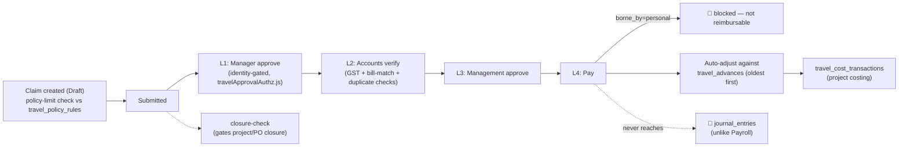

| Event | Trigger (file:line) | Downstream today | Notification | Status |
|---|---|---|---|---|
| Claim created | `travel-reimbursement.routes.js:152-231` `POST /claims` | Real policy-compliance check: looks up `travel_policy_rules` by the employee's grade/role/department, compares the claimed amount against the matching per-category limit (hotel/meal/local-conveyance/miscellaneous), and stores `policy_compliant`/`over_policy` on the row rather than just accepting whatever is submitted. `cost_type` is derived from the linked `travel_request.travel_type` when present. `borne_by` defaults to `'company'` for any unrecognised value — the reimbursable default, not a fail-closed one | — | ✅ — real policy enforcement, not just data capture |
| Claim submitted | `:277-307` `POST /claims/:id/submit` | Self-service ownership check (an employee can only submit their own claim, checked against both `employee_id` and `created_by`); seeds the Level-1 `expense_claim_approvals` row | `notifyWorkflowEvent('submitted', ...)` | ✅ |
| **L1 Manager approve — confirms the manual's claim** | `:309-350` `PUT /claims/:id/manager-approve` | Uses the same `authorizeManagerApproval()` from `travelApprovalAuthz.js` documented in the Employee Lifecycle's Travel row — genuinely identity-gated (reporting manager / delegate / HR / admin), not a bare role check. The route's own comment notes `claim.employee_id` is a real `employees.id` here, contrasting it with a caveat about `travel_advances` elsewhere in the same file (not itself re-verified this pass). Advancing state seeds the Level-2 row | — | ✅ |
| Delegate approval | `:352-377` `POST /claims/:id/delegate` | Re-uses the same authz check to decide who may set a `delegate_approver_id` — a user can't delegate a claim they aren't themselves authorized to approve | — | ✅ |
| L2 Accounts verify | `:379-413` `PUT /claims/:id/accounts-verify` (role-gated: admin/super_admin/finance) | Captures three explicit fraud/compliance flags — `gst_verified`, `bill_match_verified`, `duplicate_checked` — as real stored booleans, not just a rubber-stamp status flip. Enforces prior-state (`claim.status !== 'Manager Approved'` rejected) before allowing the transition | — | ✅ |
| L3 Management approve | `:415-446` `PUT /claims/:id/mgmt-approve` (role-gated: admin/super_admin) | Same prior-state enforcement pattern; seeds the Level-4 (Finance Payment) row on approval | — | ✅ |
| **L4 Pay** | `:448-530` `PUT /claims/:id/pay` (role-gated: admin/super_admin/finance) | Genuinely sophisticated: blocks payment outright if `borne_by='personal'` (prevents reimbursing a line the claim itself marked as not company-payable); auto-adjusts the claim against any outstanding `travel_advances` for the same `travel_request_id`, **oldest advance first**, updating each advance's `settled_amount`/status (`Settled`/`Partially Settled`) as it goes, then computes `net_payable` as the remainder Finance actually pays. Posts a row to `travel_cost_transactions` for project/customer cost tracking when a `project_id`/`customer_id` is present | `notifyWorkflowEvent('paid', ...)` | ✅ but 🟡 — see next row |
| **Payment never reaches the General Ledger** | same route, re-checked specifically for this | A full-file search for `journal_entries`/`journalRepo`/any posting call in `travel-reimbursement.routes.js` returns nothing. Compare directly to Payroll's `postPayrollJournal()` (previous section): that flow now properly posts approved payroll to `journal_entries`. Expense-claim reimbursement — money Finance is actually disbursing — updates `travel_cost_transactions` (a project-costing table) and the claim's own status, but never creates a journal entry. Whether reimbursement expense reaches the books through some other route entirely (e.g. bank-reconciliation import) was not checked this pass | none | 🔴 — a real gap, more surprising here than in Service given how carefully everything else in this flow was built |
| Project/opportunity closure gate | `:624-647` `GET /reimbursement/closure-check` | Independently re-verified this session (previously only cited from the Fixed Assets/Exit section's reference to it): computes `canClose` by counting `expense_claims` linked to the given `project_id`/`opportunity_id` still outside a terminal status (`Paid`/`Closed`/any `*Rejected`). Real, callable logic — the earlier-documented gap was never that this endpoint doesn't work, only that Exit doesn't call it | — | ✅ (endpoint itself); see Employee Lifecycle for the "not called from Exit" gap |

---

## Compliance Lifecycle

Confirms, rather than merely repeats, `AUTOMATION_OPPORTUNITY_AUDIT.md`'s claim that "Compliance
has zero automation — worst gap by domain risk." Distinct from HR's person-level
`certifications`/`employee_certifications` tables (individual credentials) — this module tracks
the *company's* certification to a standard (ISO 9001, IEC 61000, RoHS, CE, etc.), a different
grain entirely.

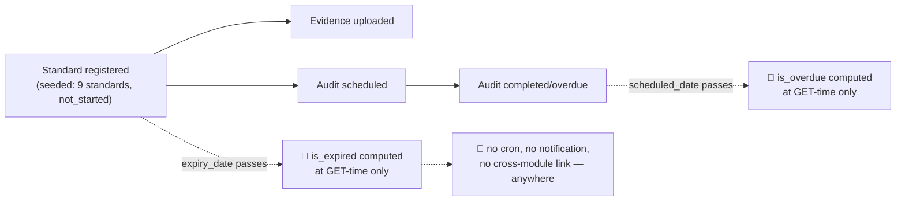

| Event | Trigger (file:line) | Downstream today | Notification | Status |
|---|---|---|---|---|
| Full route inventory | `modules/compliance/compliance.routes.js` (12 routes: standards CRUD, evidence add/list/delete, audits list/create/update, summary) | **Every single route is plain CRUD or a read query.** No route in this file calls `notifyWorkflowEvent`, does a raw `INSERT INTO notifications`, or references `notificationsRepository` — confirmed by a full-file search that returned zero matches for any of the three known notification pathways. No cron in the complete 11-job inventory documented in this file's cross-cutting section targets compliance. This is a cleaner, more total absence than most other gaps in this document, which usually have *some* broken or partial automation underneath — here there is none to be broken | none, anywhere | 🔴 confirmed |
| Expiry / overdue-audit detection | `compliance.routes.js:33,35,159,220,223` — `is_expired`, `expiring_soon` (standards), `is_overdue` (audits), and the `/summary` KPI aggregates | All computed **live, at query time**, as SQL boolean expressions against `CURRENT_DATE` — no stored flag, no trigger, nothing proactive. Identical shape to the "query exists, push doesn't" pattern already found in Quality (calibration due-alerts), Fixed Assets (maintenance notifications), and Service (SLA breaches) — this is now the **fourth** module in this document with exactly this gap, which makes it a systemic pattern worth naming once rather than four unrelated findings: Pulse has several well-built "is this thing due/expired/overdue" queries and no scheduler anywhere that proactively surfaces any of them | none | 🔴 — same recurring pattern, fourth confirmed instance |
| Cross-module connections | — | A repo-wide search for `compliance_standards`/`compliance_evidence`/`compliance_audits` outside this module's own route file returns **zero matches**. Not linked from Quality's NCR/audit trail, not linked from vendor document verification (`vendor-approval.routes.js`, Procurement/Vendor Lifecycle above), not linked from Exit Clearance's NOC checks (Employee Lifecycle above) despite all three being conceptually adjacent (quality certifications, vendor compliance docs, HR compliance sign-off). This module is a structural island, not merely an under-automated one | — | 🔴 — isolated by design or by omission, not distinguishable from code alone |
| Permission gate — **resolved a two-section-old open question** | `requirePermission('compliance', a)` (`compliance.routes.js:19`), via `middlewares/auth.middleware.js:226-320` | Read the middleware directly rather than carrying a prior finding forward again: **fails closed by default.** The middleware's own code comment documents that `compliance` was one of five modules (with `maintenance`, `iot`, `rd`, `assets`) that previously shipped with zero permission rows and were reachable by any authenticated user as a result (`SECURITY_AUDIT_2026-07-18.md` H-2 — the same H-2 already tracked in this project's memory as fixed). Migration `20260719000001` completed the permission matrix and inverted the default to fail-closed (`403 PERMISSION_NOT_CONFIGURED`); `PERMISSION_FAIL_OPEN=true` remains as a loud, logged emergency-only escape hatch, not a silent default | — | ✅ — the access-control gap is fixed; the automation gap above is not |

---

## Recruitment Lifecycle

Bookends the Employee Lifecycle at the front — that section starts at "Employee record
created"; this one traces what happens before that point, and turns up a genuine surprise: a
**third** independent employee-creation code path, alongside the two (`employee.service.js`'s
direct-add flow, already documented) this document previously knew about.

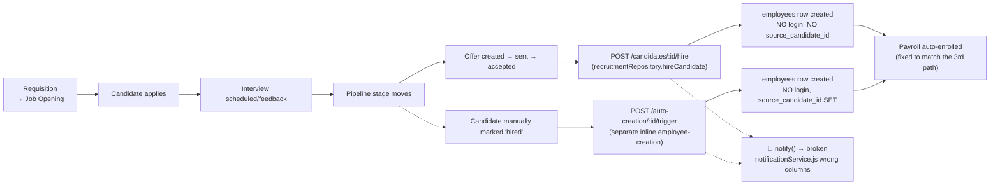

| Event | Trigger (file:line) | Downstream today | Notification | Status |
|---|---|---|---|---|
| Requisition → Job Opening → Candidate applies | `recruitment.routes.js:129-282` | Real CRUD pipeline with stage history (`candidate_stage_history`); resume upload integrates with Google Drive folder structure (`recruitmentDriveService.js` — `createJobFolderStructure`/`uploadResume`/`moveResumeOnStageChange`), not just local storage | — | ✅ (existence + Drive integration confirmed, not traced in full depth) |
| Interview scheduling — **a real, now-fixed type bug** | `recruitment.routes.js:23-32` (bootstrap comment) | `interview_schedules`/`offer_letters` originally typed `candidate_id`/`job_opening_id` as UUID while `candidates.id`/`job_openings.id` are `integer` — every insert against a real candidate would fail ("invalid input syntax for type uuid"), and every join would throw ("operator does not exist: uuid = integer"). The route file's own comment documents this in past tense and the live `CREATE TABLE IF NOT EXISTS` now correctly types both columns `INTEGER` — fixed | — | ✅ — a genuinely fixed bug, not a live one |
| **Hire path 1 — atomic** | `recruitment.repository.js:674-758` `hireCandidate()`, called from `POST /candidates/:id/hire` | Single transaction: inserts `employees`, auto-enrolls `employee_salary_assignments` against the default `salary_structures` row, marks the candidate `hired` + logs stage history, and marks the parent `job_openings` `closed` with `positions_filled` incremented. Does **not** set `employees.source_candidate_id` | `notify()` (broken, see below) | ✅ automation; 🟡 no login, no source linkage |
| **Hire path 2 — deferred/queued** | `recruitment.routes.js:792-948` `POST /auto-creation/:candidateId/trigger`, fed by `GET /auto-creation/pending` | Assumes the candidate is **already** in `hired` stage (400 if not) — a separate entry point for creating the employee record later, idempotent via `recruitment_employee_creation_log` (checks for an existing `completed` row before proceeding, so it can't double-create). Inserts `employees` with `source_candidate_id` set (unlike path 1), auto-enrolls payroll the same way, and builds an explicit checklist of what's still manual: official email request, onboarding checklist, attendance profile, leave profile, document folder, org-chart node — **all listed as `done: false`**, i.e. the code itself documents these as known follow-ups, not silent gaps | `notify()` (broken, see below) | ✅ automation; 🟡 same no-login gap, but at least self-documenting about what's left |
| **Three employee-creation paths, one still login-blind** | cross-reference: `employee.service.js:8-60` (Employee Lifecycle, direct HR "Add Employee"), plus the two hire paths above | Only the direct-add path calls `createLoginForEmployee` (bcrypt `Welcome@123`, `users` row, `syncPrimaryRole`). **Neither recruitment-sourced path provisions a login at all** — confirmed by absence of any call to that function or any `INSERT INTO users` in either hire route. A recruitment-hired employee has an `employees` row and (as of a recent fix, see next row) a payroll enrollment, but no way to log in until someone manually runs the direct-add flow or another unseen process creates one | — | 🔴 — a real, confirmed gap: recruitment is the more common real-world hiring path per the code's own comments, and it's the one that doesn't grant access |
| **Payroll auto-enrollment — a real fix, cross-referenced across all three paths** | comments in both `recruitment.repository.js:715-720` and `recruitment.routes.js:883-890` | Both hire paths' comments explicitly name all three employee-creation paths and state this enrollment step was added to bring the third one in line with the other two ("This was the one of three still missing it, so recruitment-sourced auto-created employees were payroll-invisible until someone manually added an assignment"). A genuine, deliberate consistency fix across independently-written code paths — the kind of cross-file coordination this document doesn't often get to confirm directly from comments | — | ✅ — confirmed via the code's own paper trail, not inferred |
| Offer sent / accepted | `recruitment.routes.js:649-678` `PUT /offers/:id` (status→'sent'), `POST /offers/:id/accept` | Sending an offer fires both `notify()` (broken) and `triggerEmail('offer_sent', ...)` — a real transactional email call, existence-confirmed but not traced into `emailTrigger.js` this pass | `notify()` broken; `triggerEmail` existence-confirmed | 🟡 |
| **`notify()` → `createNotification()` — the fifth notification pathway, and the one that doesn't work** | `recruitment.routes.js:16-19` wraps `services/notificationService.js:1-6` | See this document's cross-cutting section for the full detail: `INSERT INTO notifications (user_id, module, record_id, message)` targets columns that don't exist (`module_name`/`reference_id` are the real names) and omits the required `title`. Every call throws; `.catch(() => {})` at the call site swallows it. Confirmed used only in this module (repo-wide search). Every "notify HR" call in Recruitment — new hire, employee auto-created, offer sent — has always silently done nothing | none, silently, always | 🔴 — confirmed broken, second instance of this exact bug shape this session |

---

## Learning & Development Lifecycle

Built as a full enterprise rebuild (17 tables, 9 route files) per prior project memory — this
pass re-verifies the automation claims rather than trusting that record. Continues the HR
cluster from Employee/Recruitment/Payroll.

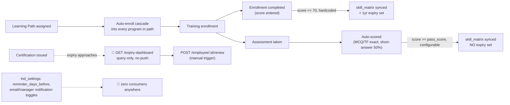

| Event | Trigger (file:line) | Downstream today | Notification | Status |
|---|---|---|---|---|
| Learning path assigned | `learning-paths.routes.js:137-165` `POST /:id/assign` | Real cascade: for each employee, upserts `employee_learning_paths`, then **auto-enrolls them into every program in the path** by inserting `training_enrollments` for each `learning_path_items` row — a genuine one-click bulk enrollment, not just a tracking record | — | ✅ |
| Training enrollment completed | `training.routes.js:169-212` `PUT /enrollments/:id/complete` | If `score >= 70` (**hardcoded** threshold, not read from any setting), auto-upserts `skill_matrix` — `proficiency_level=4` (or `GREATEST` with existing), `certified=true`, and sets `expiry_date = CURRENT_DATE + INTERVAL '1 year'` | — | ✅ |
| Assessment submitted | `assessments.routes.js:149-211` `POST /attempts/:id/submit` | Real auto-scoring: MCQ/true-false marked by exact case-insensitive match against `correct_answer`; short-answer questions get a **flat 50% of the question's marks for any non-empty answer** (no content grading — a deliberate simplification, not a bug, but worth knowing when reading assessment results as a quality signal). On pass (against the assessment's own **configurable** `pass_score`, not the training module's hardcoded 70) and if linked to an enrollment, **also** auto-upserts `skill_matrix` — `proficiency_level=4`, `certified=true` — but **does not set an `expiry_date`** | — | ✅ |
| **Two skill_matrix sync paths, two different rules** | cross-reference: the two rows above | Training-completion and assessment-pass are independently-implemented paths to the same table, with genuinely different semantics: one uses a hardcoded 70% pass bar and sets a 1-year skill expiry, the other uses the assessment's configurable pass score and never expires the skill. An employee whose skill came from an assessment shows as permanently certified in a way one whose skill came from training completion does not, for what a viewer would reasonably expect to be the same kind of event | — | 🟡 — both individually correct, jointly inconsistent |
| Certification expiry detection | `certifications.routes.js:175-194` `GET /expiry-dashboard` | Live `COUNT()` aggregates for 30/60/90-day expiry windows plus expired/active totals, computed at query time — **no stored flag, no cron, no push**. This is the **sixth** confirmed instance in this document of the "a correct is-this-due query exists, nothing proactively notifies anyone" pattern (after Quality, Fixed Assets, Service, Compliance, and now this) | none | 🔴 — sixth confirmed instance |
| Certification renewal | `certifications.routes.js:197-220` `POST /employee/:id/renew` | Real: marks the old record `renewed`, clones a new `active` record forward with the new expiry date — but manual-trigger-only per certification, same as the expiry dashboard has no push feeding into it | — | ✅ automation; 🔴 nothing prompts anyone to call it |
| **`lnd_settings` reminder/notification toggles — confirmed dead** | `lnd-settings.routes.js` (`reminder_days_before` default 7, `cert_expiry_reminder_days` default 30, `enable_email_notifications`/`enable_manager_notifications` both default **true**) | Repo-wide search found these four fields referenced **only in this file's own CRUD** — no cron, no route anywhere else reads any of them. A fully-built settings UI with sensible, enabled-by-default values implying an active reminder system that does not exist in code. Same shape as Procurement's `alert_vendor_rating_drop`/`alert_overdue_delivery` | none, ever | 🔴 — the settings imply automation that was never built |
| Competency framework / gap analysis | `competency.routes.js` | Existence-confirmed CRUD + department gap-analysis reporting; not traced into whether gaps auto-generate training assignments (plausible next-step automation that would close a real loop, unconfirmed either way) | — | ⚪ not traced this pass |

---

## Engineering/R&D Lifecycle

Three genuinely separate sub-systems live under "Engineering": ECN (`ecn.routes.js`, engineering
change control tied directly into Production's BOM), R&D/PLM (`rd.routes.js`, artifact
versioning + patents + product-lifecycle stage), and IPD (`development.routes.js`, a distinct
new-product-development tracker). A naming trap worth stating up front: `lifecycle_instances`
(referenced throughout the Customer/Production lifecycles above) is the **order→commissioning**
flow, not product PLM — `product_lifecycle` is the actual PLM table, a completely different
thing that happens to share the word "lifecycle."

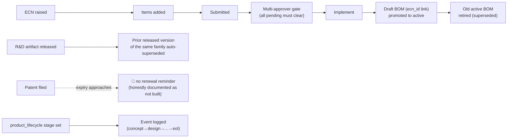

| Event | Trigger (file:line) | Downstream today | Notification | Status |
|---|---|---|---|---|
| ECN submitted | `ecn.routes.js:190-222` `POST /changes/:id/submit` | Existence-confirmed transition into the approval gate below; not traced in isolation | — | ✅ existence confirmed |
| **ECN approval — real multi-approver consensus, not a role check** | `ecn.routes.js:223-259` `POST /changes/:id/approve` | Each approver's individual decision is recorded in `engineering_change_approvals`; the parent `engineering_changes` row only flips to `approved` once the count of remaining `pending` approvals for that change reaches zero. A genuine parallel-consensus gate — approving doesn't just need *a* privileged user, it needs *all* assigned approvers | — | ✅ |
| **ECN implementation → real BOM promotion, the standout finding of this section** | `ecn.routes.js:295-351` `POST /changes/:id/implement` | Only callable on `status='approved'` changes. Finds any `bom_headers` row drafted under this ECN (`WHERE ecn_id=$1 AND status='draft'`) and **promotes it to `active`**, simultaneously retiring whatever BOM was previously active for the same product (`status='superseded'`) — matched by `product_name` or `product_id`, scoped by company. The route's own comment states the intent precisely: *"This is what makes 'implement' actually change production data instead of just flipping a status flag — production keeps building to the old spec otherwise."* This is the concrete link from Engineering into the already-documented Production Lifecycle's BOM-matching logic | — | ✅ — one of the strongest pieces of cross-module automation found in this document |
| R&D artifact release → auto-supersede | `rd.routes.js:91-98` (on create with `status='released'`) and `:117-127` (on update to `released`) | Confirmed on **both** code paths (re-verified, not just trusted from prior memory): releasing a new version of an artifact family (`company_id`+`product_line_id`+`artifact_type`+`name`) automatically flips the prior `released` version of that same family to `superseded`. Auto-versions `v{n+1}` when no version is supplied | — | ✅ |
| Patent/IP tracking | `rd.routes.js` patents CRUD | Full lifecycle status tracking (idea→drafting→filed→published→granted→rejected→lapsed→abandoned) with filing/grant/expiry dates. **No renewal reminder exists** — but unlike L&D's `lnd_settings` or Procurement's dead alert toggles, this is not a settings page implying a feature that isn't there: prior project memory explicitly lists "patent renewal reminders" under "NOT built (future)," an honest gap statement rather than a misleading one | none | 🔴 — same absence as elsewhere in this document, but honestly documented rather than silently implied |
| Product lifecycle stage | `rd.routes.js` `/lifecycle`, `/lifecycle/:plid/set-stage` | One row per `product_line` (stages concept→design→prototype→validation→production→maintenance→eol), each transition logged to `product_lifecycle_events`. Untracked product lines correctly show as "not tracked" via a `LEFT JOIN` rather than being defaulted into a false starting stage — a small but deliberate honesty choice in the query design | — | ✅ |
| Permission gate — **resolved without re-reading the middleware, from the Compliance pass's own finding** | `requirePermission('rd', a)` (`rd.routes.js:20`) | The Compliance Lifecycle section above already read `middlewares/auth.middleware.js:226-320` directly and found it fails **closed** by default since migration `20260719000001` — and `rd` is explicitly one of the five modules the middleware's own comment names as having been vulnerable and since fixed (`maintenance`/`iot`/`rd`/`compliance`/`assets`). A 10-day-old memory describing `rd`'s permission as "fails open" is therefore stale, the same way the equivalent Fixed-Assets claim was | — | ✅ — fixed, not open; not re-derived a third time, cited from the earlier finding instead |
| IPD (`eng_development`) — separate new-product tracker | `development.routes.js`, `eng_development` table + `seq_ipd` numbering | Distinct from both ECN and R&D/PLM — its own status flow (design→procurement→assembly→testing→validation→closed→cancelled). `eng_development.project_id → projects(id)` is a live, nullable FK link into the already-documented Projects/Sales-Order world | — | ✅ existence + linkage confirmed, not traced in full depth |

---

## AI/Intelligence Lifecycle

Every prior section in this document independently noted "no AI endpoint confirmed wired here"
without anyone directly opening `/api/intelligence` or `/api/ai`. This section resolves that,
and the answer is more interesting than a simple yes/no.

**The name is misleading — split the two files first.** `intelligence.routes.js` is *not*
primarily an AI module: it's the admin/config surface for the shared Rule Engine, Workflow
Engine, permissions, SLA config, and notification-rules infrastructure this document has cited
by service name in a dozen places (`evaluateRules`, `validate`, workflow instances) without ever
having traced where their configuration lives. `ai.routes.js` is where the actually-AI-labeled
functionality is, and it turns out to be a genuine mix — some of it real and well-built, some of
it "predict"-named SQL with no predictive math behind it at all.

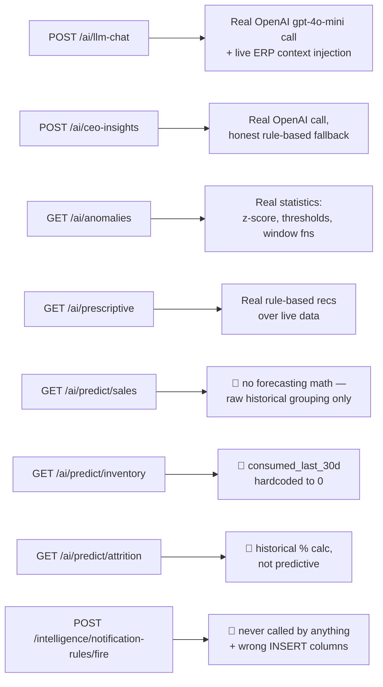

| Event | Trigger (file:line) | Downstream today | Notification | Status |
|---|---|---|---|---|
| **LLM chat — genuinely real, one of the best-built features in this document** | `ai.routes.js:85-171` `POST /llm-chat` | Real OpenAI `gpt-4o-mini` call, not a stub — graceful `503` with an admin-actionable message if `OPENAI_API_KEY` is unset rather than crashing. Rate-limited server-side (20 messages/user/day, in-memory). Injects **real live ERP context** into the system prompt before calling out: the requesting user's leave balances, a pending-leave-approval count for admin/hr/manager roles, and the user's name. The route's own comment documents an already-fixed bug: the leave-balance subquery used to join through `employees.user_id`, a column that doesn't exist, so leave context silently never appeared — fixed to go via `users.employee_id` directly | — | ✅ — real, working, context-aware |
| **CEO insights — honest hybrid, not fake data dressed as AI** | `ai.routes.js:7-72` `POST /ceo-insights` | Tries a real OpenAI call first; if the key is unset or the call fails, falls back to a **rule-based narrative generator** that only narrates numbers the caller's own `dashboardData` payload already contained — the route's own comment states this explicitly: *"No operational data is invented here — all numbers come from the caller's payload."* Worth contrasting directly with `predict/inventory` below, in the same file, which does invent a number | — | ✅ |
| **Anomaly detection — real statistics, not a "predict" label on nothing** | `ai.routes.js:350-409+` `GET /anomalies` | Three genuine checks computed from live data: invoice amounts flagged past 2.5 standard deviations from the 90-day mean (real `mean`/`stdDev` computation); employees under 75% attendance this month; PO line items priced >20% above the 3-month average **via a real SQL window function** (`AVG() OVER (PARTITION BY item_name)`). Simple math, not machine learning, but genuinely computed — the strongest "AI-adjacent" feature in this file after the two LLM-backed ones | — | ✅ |
| **Prescriptive recommendations — real, correctly labeled** | `ai.routes.js:846+` `GET /prescriptive` | Rule-based recommendations from live data — inventory items at/below reorder point, overdue receivables total, revenue decline vs. prior month — each with a rationale and stated business impact. Correctly calls itself rule-based territory (`prescriptive`), doesn't claim to be predictive or ML | — | ✅ |
| **`predict/attrition` — not predictive** | `ai.routes.js:623-643` `GET /predict/attrition` | Computes the historical percentage of employees who resigned/were terminated in the last 90 days, grouped by department. A real, correct query — but a backward-looking rate calculation, not a forecast or risk model, despite living under `/predict/` | — | 🟡 — real number, misleading name |
| **`predict/sales` — comment overstates the code** | `ai.routes.js:646-663` `GET /predict/sales` | The route's own comment says *"Simple moving-average forecast from actual sales orders"* — the SQL underneath is a plain `GROUP BY` of weekly order count and revenue over the trailing window; no averaging, smoothing, or extrapolation is computed anywhere. It returns real historical data, accurately, but does not forecast anything, contrary to what its own comment claims | — | 🔴 — the comment describes a feature the code doesn't contain |
| **`predict/inventory` — hardcoded fake field, same pattern as Quality's supplier dashboard** | `ai.routes.js:666-687` `GET /predict/inventory` | Real reorder-point risk classification (critical/warning/ok) — but `consumed_last_30d` is **hardcoded to `0` directly in the SQL** (`0 AS consumed_last_30d`), not computed from any consumption-history table, and returned to the client indistinguishably from a real zero. Independently confirms the same "dashboard returns a fabricated number" shape already found in Quality's `GET /supplier-quality` (`total_grns`/`ppm`) | — | 🔴 — third confirmed instance of this exact pattern (fake field returned as real data) |
| Device-failure prediction | `ai.routes.js:783-845` `GET /predict/device-failure[/:id]` | Already confirmed real in the Production Lifecycle section above (IoT predictive maintenance scoring) — not re-verified here, cross-referenced to avoid duplicating that finding | — | ✅ (see Production Lifecycle) |
| Insights cache | `intelligence.routes.js:686-756+` `GET /insights`, `POST /insights/refresh` | Real: `insights_cache` table computed from live queries (e.g. most-delayed department by average open-task age) and cached; `GET` reads the cache, `POST /refresh` recomputes it. Refresh is caller-triggered, not cron-driven — no cron in the confirmed 11-job inventory targets it, so the cache is only as fresh as whoever last called refresh | — | ✅ automation; 🟡 no proactive refresh |
| **`notification-rules/fire` — the actual implementation behind the audit's "declared, zero consumers" finding, and a third instance of the wrong-column bug** | `intelligence.routes.js:332-380` `POST /notification-rules/fire` | Confirmed referenced **only within its own file** — no other backend code calls it, so the original automation audit's "zero consumers" verdict on the `notification_rules` table holds precisely: the reader exists (this route), but nothing ever triggers it. Separately, and independently of that: its own `INSERT INTO notifications (user_id, message, module, record_id, is_read, created_at)` uses `module`/`record_id` instead of the real schema's `module_name`/`reference_id`, and never supplies the `NOT NULL` `title` column — the **third** independent instance this session of the identical notifications-schema mistake (after Quality's CAPA insert and Recruitment's `notificationService.js`). The one meaningful difference: this handler's `catch` returns a real `500` with the Postgres error message rather than silently swallowing it, so if this route were ever actually called, the failure would be visible, not silent | none — unreachable in practice | 🔴 — dead AND broken, but the broken part would announce itself if the dead part ever stopped being dead |
| **Rule Engine admin CRUD is disconnected from the real rule engine — resolved, and the most consequential finding in this document** | `intelligence.routes.js:16-90` (`/rules` CRUD, `/rules/evaluate`) vs. `services/RuleEngineService.js` (imported directly by Leave, Service tickets, and cited by name throughout this document) | Both read/write the same `rules_master` table, which — per `baseline.sql:16807-16826` — carries **two full, parallel column sets** from two independently-evolved schemas: `module_name`/`condition_json`/`action_json`/`rule_name` (older) and `module`/`condition_expr`/`action_expr`/`code`/`name` (newer). `intelligence.routes.js`'s admin CRUD **only ever reads/writes the `module_name` set** — confirmed by reading every handler in the block, none references `module`/`condition_expr`. `RuleEngineService.js`'s `evaluateRules()` — the function actually called by Leave/Service/etc. — **only ever reads the `module`/`condition_expr` set** (`RuleEngineService.js:57-65`). **These two column sets are never cross-populated by anything.** A repo-wide search for `INSERT INTO rules_master` found exactly one writer to the `module`/`condition_expr` columns: a single one-time migration seed (`20260429000002_rule_validation.js:76-99`) with **two example rules, both scoped to `module='inventory'`**, and nothing else — ever. Consequence: every `evaluateRules('leaves', ...)`, `evaluateRules('service', ...)` call documented elsewhere in this file queries `rules_master WHERE module='leaves'` (or `'service'`) against a column that has never once been populated for those modules, and returns `[]` every time — not because a flag is off, but because the data has never existed. And the admin-facing "Rule Engine" UI a company would actually use to configure a business rule writes to the *other* column set entirely — an admin diligently building rules through it would have every one of them silently do nothing, forever, because the enforcement code was never looking at the columns that UI writes to | — | 🔴 — resolved: not the same execution path, and the disconnect means the admin UI for this feature is functionally inert |
| **Validation Engine — same investigation, a genuinely different and more nuanced outcome** | `intelligence.routes.js:757-800+` (`/validation-rules` CRUD) vs. `services/ValidationEngineService.js` (imported by Leave and other modules as `validate()`) | Checked immediately after the Rule Engine finding above precisely because they look identical in shape — they aren't. **The read side agrees**: `GET /validation-rules` filters `WHERE module=$1` and `ValidationEngineService.validate()` filters `WHERE module = $1 AND is_active = true` — same column, same table (`validation_rules`, real schema per `baseline.sql:21650-21662`: `module`/`field_name`/`rule_type`/`rule_expr`/`error_message`). **The admin create side is broken differently**: `POST /validation-rules` (`:770-782`) inserts `(module, field_name, rule_type, rule_value, error_message, priority)` — `rule_value` and `priority` are not columns on this table at all (the real column is `rule_expr jsonb NOT NULL`, which this INSERT never supplies), so this call fails outright with a `500` on every attempt, not a silent no-op. **But real data already exists**: the same migration that seeded `rules_master`'s two inventory rows (`20260429000002_rule_validation.js:106-160+`) also seeded genuine `validation_rules` for `leaves` ("Leave Reason Required" — min 10 characters; a days-minimum rule) and `projects` (name required, budget must be positive) modules. So unlike `evaluateRules('leaves', ...)`, Leave apply's `validate('leaves', data)` call (Employee Lifecycle, `leaves.routes.js`) **does** have real rules to enforce today — just no working admin UI to add more | — | 🟡 — read+enforce path genuinely works with real seed data; only the admin create endpoint is broken, and differently from its Rule-Engine sibling |

---

## Voice-of-Customer Lifecycle

Resolves the question left open in the Service/Complaints/Feedback section above: is this a
sixth notification pathway or a real duplicate of the CSAT mechanism already documented there?
Neither — it's a genuinely distinct, complementary feedback system (NPS methodology vs CSAT's
1-5 product/engineer split), living at `modules/servicedesk/routes/voc.routes.js`. The file's own
header comment claims more automation than the code delivers, in a now-familiar shape.

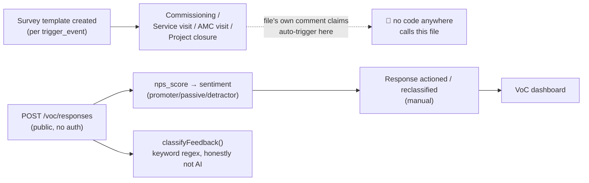

| Event | Trigger (file:line) | Downstream today | Notification | Status |
|---|---|---|---|---|
| Survey template defined | `voc.routes.js:22-63` (`voc_surveys` CRUD) | Real per-`trigger_event` question sets — `defaultQuestions()` (`:197-214`) tailors extra questions for `commissioning` (engineer professionalism, site cleanliness, documentation quality) vs `service_visit` (first-visit resolution, response speed) when the caller doesn't supply custom ones. `TRIGGER_EVENTS` enum: `commissioning`/`service_visit`/`amc_visit`/`project_closure`/`manual` | — | ✅ existence confirmed |
| **"Auto-trigger" — the file's own header comment overstates the code, same shape as this session's other findings** | file header (`:1-5`): *"Auto-trigger after: commissioning / service visit / AMC visit / project closure"* | Repo-wide search for any reference to `voc.routes.js`'s endpoints, `voc_responses`, or a VoC-triggering call found **nothing outside this file itself** — no commissioning-workflow completion, service-ticket resolution, AMC-visit closure, or project-closure code path calls `POST /voc/responses` or creates a survey prompt. The trigger-event taxonomy is real and used to select question sets, but nothing actually fires when those business events occur; a human (or an external portal flow this session didn't trace) has to initiate it | none | 🔴 — the doc comment describes intended behavior the code doesn't implement, joining `predict/sales`'s comment as the second instance this session of a code comment overstating what's actually there |
| Response submitted | `voc.routes.js:87-116` `POST /responses` — **deliberately unauthenticated**, no `verifyToken` | Real NPS methodology, correctly implemented: `sentiment` is computed inline from `nps_score` (`>=9` promoter, `>=7` passive, else detractor) — the standard NPS band definitions, not approximated. `classification` auto-derives from free-text (`suggestions`/`improvement_ideas`/`new_feature_requests`) via `classifyFeedback()` (`:187-195`) — a plain keyword-regex categorizer (Product/Service/Documentation/Training/Software/General) that makes no claim to be AI, unlike some of the `/predict/*` endpoints covered in the AI/Intelligence section. Lack of auth is a deliberate design choice (comment: "can be called internally or from portal"), consistent with an external customer-facing survey link | — | ✅ — the core capture mechanism is genuinely well-built |
| Response actioned / reclassified | `voc.routes.js:119-143` `PUT /responses/:id/action`, `PUT /responses/:id/classify` | Manual follow-up tools — mark a response as actioned (records actor + timestamp), or override the auto-classification | — | ✅ existence confirmed |
| VoC dashboard | `voc.routes.js:149+` `GET /dashboard` | Existence-confirmed aggregation endpoint; not traced into its specific metrics this pass | — | ⚪ not traced this pass |

---

## Audit Logs Lifecycle

`logAudit(...)` has been cited by name dozens of times across every lifecycle in this document
without ever being opened. This section verifies the write path those citations depend on, and
turns up a genuinely well-architected system — with one contained, low-severity instance of this
session's recurring wrong-column bug sitting on top of it, not inside it.

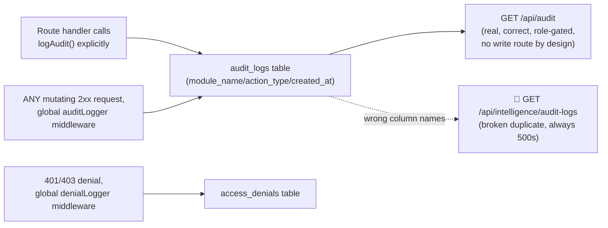

| Event | Trigger (file:line) | Downstream today | Notification | Status |
|---|---|---|---|---|
| Manual audit write | `services/AuditService.js:30-53` `logAudit()`, called explicitly throughout every module cited in this document | Real, well-designed: fire-and-forget (`.catch()` logs to console, never throws into the caller), captures full before/after JSON snapshots, IP, user-agent, and company scope. Delegates to `auditRepository.create()` (`modules/audit/repositories/audit.repository.js:4-15`), confirmed writing exactly the columns the real `audit_logs` table has (`baseline.sql:1487-1500`: `user_id`/`module_name`/`action_type`/`reference_id`/`reference_type`/`old_data_json`/`new_data_json`/`ip_address`/`user_agent`/`created_at`/`company_id`) | — | ✅ — every citation of this function elsewhere in this document is confirmed accurate |
| **Global automatic audit — a genuine architectural strength, not previously known to this document** | `middlewares/auditLogger.js`, applied via `v1Router.use(auditLogger)` (`server.js:454`) | Every successful (2xx) `POST`/`PUT`/`PATCH`/`DELETE` across the **entire API** gets audited automatically, even in routes that never call `logAudit()` themselves — module and entity type are derived from the URL path, record ID best-effort extracted from the response body or params, wrapping `res.json` to intercept without changing behavior. An explicit skip-list (`/auth/login`, `/audit`, `/ai`, `/global-search`) avoids noise/double-logging on routes handled separately. This means the manual `logAudit()` calls cited throughout this document are the *detailed* layer (rich before/after snapshots for specific business events), sitting on top of a *blanket* layer that catches everything else — genuine defense-in-depth, not a gap this document needed to find | — | ✅ — a real safety net, not aspirational |
| Denial logging | `denialLogger` (`server.js:409-411`) | Separate middleware, writes 401/403 responses to a distinct `access_denials` table — the route comment explains why: `auditLogger` only fires on 2xx, so a refused request would otherwise leave no trace, which the memory record [[project_pilot_hypotheses]] elsewhere describes as needed for testing an RBAC hypothesis | — | ✅ existence + purpose confirmed |
| **Real audit viewer** | `modules/audit/routes/audit.routes.js`, mounted at `/api/audit` (`server.js:622`) | Correctly built against the real schema (uses `auditRepository.findAll()`/`getStats()`/`findByReference()`, all confirmed matching `module_name`/`action_type`/`created_at`). Role-gated to `super_admin`/`admin`/`hr`/`manager`. **Deliberately has no POST/PUT/DELETE route** — the file's own header comment states the reasoning directly: "Any attempt to write directly through a route would bypass the server-side integrity layer, so that surface is simply absent." A genuine, considered immutability design, not an oversight | — | ✅ — well-designed on every axis checked |
| **Duplicate broken viewer — fourth confirmed instance of this session's wrong-column bug, but the lowest-severity one** | `intelligence.routes.js:477-524` `GET /audit-logs`, `POST /audit-logs`, `GET /audit-logs/summary`, mounted at `/api/intelligence/audit-logs` (`server.js:672`) | Queries `al.module`/`al.action`/`al.timestamp` — **none of these columns exist on `audit_logs` at all** (confirmed against the same schema read above); every call to any of these three endpoints throws a hard Postgres error, not a silent empty result. `POST /audit-logs` additionally tries to insert into `user_name`/`user_role`/`module`/`record_id`/`action`/`old_data`/`new_data`/`changed_fields` — also none real, and omits the `NOT NULL` `module_name`, so it fails outright too. **This is the fourth instance this session of the wrong-column-reference bug** (after Quality's CAPA insert, Recruitment's `notificationService.js`, and `notification-rules/fire`) — but unlike those three, where the broken path was the *only* path, here a fully correct, real, working alternative (`/api/audit`, above) already exists and is properly wired. Practical severity is low: this is dead, redundant, broken code sitting next to its own working replacement, not a missing capability | — | 🔴 — confirmed broken; genuinely low-stakes because the real thing already exists elsewhere |

---

## Projects Lifecycle

Projects don't get created by a single "Add Project" form in practice — two independent
automatic paths (already documented from the *other* module's side of the handoff, in
Production and CRM Pipeline above) do almost all real-world project creation, and both
**bypass the workflow/rule-engine hooks** that the rarely-used manual form triggers. This
section picks up from there: what happens once the `projects` row exists, and — the headline
finding — a real, currently-reachable bug in how timesheet approval interacts with the cost
rollup engine.

```mermaid
flowchart TD
    A["Sales Order confirmed\n(sales.routes.js autoBootstrap)"] --> P["projects row created\n(raw INSERT, no workflow/rules)"]
    B["Opportunity → Project\n(crm.routes.js convert-to-project)"] --> P
    C["Manual POST /projects\n(rarely used)"] --> P2["projects row created\nvia projectRepository.create()"]
    P2 --> W["initiateWorkflow + evaluateRules\n(ONLY this path gets them)"]
    P --> S["PATCH /projects/:id/stage\n(pipeline kanban)"]
    S -->|"dispatched"| S2["🔴 no FAT/SAT punch-point\ngate check at all"]
    P --> M["Milestone completed"]
    M -->|billing_milestone| INV["Real invoice created\n(see Finance Lifecycle)"]
    P --> T["Timesheet entry logged"]
    T --> APR["POST /timesheets/approve"]
    APR --> ULC["projectCostRepository.updateLabourCost()\n→ upsert(only labour_cost)"]
    ULC -->|"🔴 total_cost/profit/margin_pct\nsilently overwritten"| PCS["project_cost_summary"]
    P -->|status → completed, or manual button| RC["recalculateProjectCost()\n11-source engine"]
    RC --> PCS
    PCS --> SC["scurveSnapshot.cron.js\n(02:00 daily, EVM S-curve)"]
```

| Event | Trigger (file:line) | Downstream today | Notification | Status |
|---|---|---|---|---|
| Project creation — Sales Order path | `sales.routes.js:19-106` `autoBootstrapLifecycleOnOrderAccept`, called from `PATCH /orders/:id/confirm` (`:675`) and a second status transition (`:842`) — already partly documented in the [Production Lifecycle](#production-lifecycle) row above for its Production Order half | The same function also does a raw `INSERT INTO projects` (`:85-96`, `ON CONFLICT DO NOTHING`), carrying `opportunity_id` forward through the SO's `quotation_id` so the IPM↔IPP Delivery Tracker link (see [[project_delivery_tracker]]) needs no manual step. Wrapped in its own `try/catch` — a project-creation failure is logged and swallowed, non-fatal to confirming the order | none on project creation itself | ✅ real, but 🟡 silent |
| Project creation — Opportunity convert path | `crm.routes.js:1271-1349` `POST /opportunities/:id/convert-to-project` — fully documented already in the [CRM Pipeline Lifecycle](#crm-pipeline-lifecycle) row above (a confirmed-fixed prior bug, idempotent) | Same destination table, same raw-INSERT pattern | see CRM Pipeline row | ✅ (see CRM Pipeline) |
| **Both real creation paths skip the workflow/rule engine — only the unused manual path gets it** | Repo-wide `grep` for `initiateWorkflow\|evaluateRules` in `sales.routes.js` and `crm.routes.js`: zero matches in either file. Compare `projects.routes.js:170-173`, where `POST /projects` (`projectRepository.create()`) explicitly calls both `initiateWorkflow('projects', ...)` and `evaluateRules('projects', ...)` right after insert | The hooks exist and work — they're just wired to the one project-creation code path that real users almost never hit (SO-confirm and Opportunity-convert both do their own raw `INSERT INTO projects`, not `projectRepository.create()`). Any `rules_master`/workflow config targeting `'projects'` silently never fires for the vast majority of actual projects | — | 🔴 — hooks present, unreachable in practice |
| Pipeline stage move / dispatch gate — **resolves the Quality Lifecycle's prior ⚪** | `projects.routes.js:204-223` `PATCH /projects/:id/stage`, deliberately lightweight (skips full `validate('projects', …)` by the route's own comment, `:199-202`) | Accepts any of 7 `PIPELINE_STAGES` including `dispatched`, auto-stamps `actual_delivery_date` on first arrival there — but performs **no check whatsoever** against `fat_trackers`/`sat_trackers` completion status. `quality_settings.fat_dispatch_gate` (Quality Lifecycle) implies FAT punch-point closure should block dispatch; nothing reads that setting anywhere in this route or elsewhere in the codebase. Fifth confirmed dead-Settings-toggle instance this session | — | 🔴 confirmed dead — corrected the Quality section's prior ⚪ |
| FAT / SAT tracker CRUD | `projects.routes.js:808-836` `POST /projects/:id/fat`, `:838+` `PUT /projects/fat/:id`, mirrored for SAT at `:899-944` | Plain, correctly-scoped CRUD against real `fat_trackers`/`sat_trackers` tables (serial number, test parameters, punch points, certificate fields) — genuinely used for record-keeping, but confirmed to trigger nothing downstream: no notification, no workflow, no gate. `logAudit()` only | none | ✅ real record-keeping; 🟡 fully inert otherwise |
| Milestone completion → invoice | `projects.routes.js` `PUT /milestones/:id/complete` — already fully documented in the [Finance Lifecycle](#finance-lifecycle) `Milestone → invoice` row (a confirmed-fixed prior bug: used to only flag "invoiced" with no real `invoices` row) | — | — | ✅ (see Finance Lifecycle) |
| **Project cost rollup — genuinely the most sophisticated automation traced this entire session** | `modules/projects/services/projectCostRollup.service.js` `recalculateProjectCost()` (`:309-414`) | Not 5 sources as a prior pass of this investigation assumed before re-verifying — **eleven**: material (`rm_issues`), labour (`timesheet_entries`), travel (`travel_requests`), manufacturing (`production_orders`), procurement overhead (`purchase_orders`), quality (`quality_ncrs` + `quality_inspections`), installation + commissioning + service (three different `support_tickets`/`commissioning_reports` slices), AMC revenue, and milestone/budget revenue — each guarded by its own `information_schema` existence check (`tableExists`/`columnExists` helpers, `:26-47`) so a missing table degrades to `0` instead of throwing. Writes the full `project_cost_summary` row (margin, profit, per-category breakdown) in one transaction-safe upsert. Only two call sites trigger it: project status transitioning to `completed` (`projects.routes.js:188-192`) and the manual `POST /projects/:id/costs/recalculate` button (`:353-359`). **No cron ever calls it** — an in-progress project's cost summary is only as fresh as the last manual click or its eventual completion | — | ✅ — the best-built piece of automation found this session |
| **Timesheet approval silently corrupts the cost summary it just fed — a real, currently-reachable bug** | `modules/timesheets/routes/timesheets.routes.js:249-265` `POST /timesheets/approve` → `projectCostRepository.updateLabourCost(projectId)` (`projectCost.repository.js:107-127`) → `upsert(project_id, { labour_cost })` (`:4-45`) | `updateLabourCost` passes **only** `labour_cost` into `upsert()`; every other field (`material_cost`, `expense_cost`, `travel_cost`, `manufacturing_cost`, `subcontractor_cost`, `revenue`, …) arrives `undefined`. `upsert()`'s `ON CONFLICT` branch correctly `COALESCE`s those individual columns against their prior values — but `total_cost` (`:36`) and `profit`/`margin_pct` are computed fresh from the four fields passed in (`parseFloat(undefined‖0)` → `0` for the rest) and written **unconditionally, no `COALESCE`**. Net effect: every time a manager approves a batch of timesheets, `project_cost_summary.total_cost` collapses to roughly just that project's labour cost, `profit` becomes `revenue(0) − total ≈ −labour_cost`, and `margin_pct` follows — silently overwriting whatever correct 11-source total the row above's `recalculateProjectCost()` had computed, until someone re-triggers a full recalculation. This is the same shape of bug as the two-non-integrated-implementations pattern first found in Fixed Assets depreciation, but here the corruption is **automatic and routine** (timesheet approval is a weekly action), not merely dormant | — | 🔴 confirmed via direct code read, not assumed |
| Labour cost vs. payroll — **definitive answer to a question this document left open earlier** | Repo-wide `grep -i timesheet` across `modules/finance/`: **zero matches** | Confirms what the Payroll Lifecycle and Expense Claims passes both suspected but hadn't closed: `timesheet_entries` has no relationship whatsoever to payroll/pay-run generation — `TIMESHEETS --> PAY` is not real at any code path. The *actual* real destination of timesheet data is project cost rollup, both automatically (the corrupting path above) and on-demand (`GET /projects/:id/timesheets`, `:1122-1142`, a read-only billable-hours view) | — | ✅ confirmed absent (payroll side) / ✅ confirmed present (project-cost side) |
| EVM S-curve snapshot | `scurveSnapshot.cron.js` (already in the cross-cutting cron table above) | Reads `project_cost_summary` — meaning its accuracy directly inherits both the good automation and the corruption bug in the two rows above. `GET /projects/:id/scurve` (`projects.routes.js:1211`) serves the resulting series to the frontend S-Curve chart | none (pure data population) | ✅ existence confirmed; inherits upstream data-quality risk |
| Project-linked warranties → new Business Event Bus | `projects.routes.js:1011-1075` (`Unified Warranty Engine`, writes real `warranty_registrations`) feeding `warrantyExpiry.cron.js` → `emitEvent('warranty.expiring', …)` → `eventReactions.js:29-52` | **Not previously known to this document**: a genuine pub/sub layer (`shared/eventBus.js`, `shared/eventReactions.js`) was added this same day, explicitly scoped (per its own header comment) to sit *above* the five notification pathways this document already catalogued rather than replace them. Its `warranty.expiring` reaction does its own raw `INSERT INTO notifications` (`eventReactions.js:42-50`, pathway-2-shaped) but — unlike this session's four other wrong-column instances — uses the real schema correctly (`module_name`/`reference_id`/`title`) and is dedup-guarded per user/day before inserting. Its other registered reaction, `commissioning.certificate_issued` → auto-activate warranty, is idempotent on `commissioning_workflow_id`. Only two reactions exist so far, but the mechanism itself is sound | real: correct-schema DB row (no push/email/SMS — same pathway-2 ceiling as most of the codebase) | ✅ — new infrastructure, worth using for future automation rather than a sixth ad-hoc pathway |

---

## What this document does not yet cover

Phase 1 scope was deliberately limited to twenty-one lifecycles, verified in depth rather than
sketched shallowly across all 33 modules (per the tradeoff the user chose over a full-sweep
first draft). Each covered lifecycle's own remaining gaps are noted inline in that section
(search for 🔴/🟡/⚪ rows) rather than re-listed here.

**Every item originally listed here as "not yet mapped at all" is now covered, and both open
technical questions raised along the way have since been resolved**: the Rule Engine /
Validation Engine relationship (see those rows in the AI/Intelligence section — confirmed not
the same execution path, with two different consequences), and — new this pass — the actual
audit-log write/read path behind every `logAudit()` citation in this document (see the Audit
Logs section — confirmed real and well-architected, with one contained, low-severity duplicate
viewer bug). The Projects pass added one more: whether project creation reaches the workflow/
rule engine at all (it doesn't, in practice — see that section's second row). What remains, if
extending this document further, is breadth rather than depth: a genuine full-sweep second pass
across the remaining ~12 of Pulse's 33 named modules this document hasn't touched at all, at the
same rigor bar as everything above.

**To extend this document**: pick the next lifecycle, trace it event-by-event against live
code exactly as done above (not against the root-level `*_AUDIT.md` files), and append a new
`## <Name> Lifecycle` section in this same format — mermaid chain diagram + event table with
file:line citations and a ✅/🟡/🔴/⚪ status per row. Update the "Rigor bar" date and the
"What this document does not yet cover" list when a new lifecycle is added.

**Highest-value single fix, corrected after the Fixed Assets pass**: depreciation is not "one
dead function away from working" as first stated here — it is two non-integrated
implementations, one broken (`postMonthlyDepreciation`, wrong column name) and one working but
manual-only (`POST /finance/assets/run-depreciation`). The real fix is a product decision first
(monthly vs annual cadence — pick one), then either wire the working annual one to a
fiscal-year-end cron, or fix the column bug in the monthly one and retire the other — not both
in production, since nothing stops them double-posting against the same `fixed_assets` rows if
both were ever active. Second-highest, unchanged: decide whether the three notification
pathways above should be consolidated (only `probation.cron.js` currently reaches push/email/
SMS; everything else is DB-row-only, meaning most "notifications" in Pulse today are invisible
unless the user is actively looking at the notification bell).

**From the Procurement/Vendor pass**: `alert_vendor_rating_drop` and `alert_overdue_delivery` are
Settings-UI toggles that do nothing — no code anywhere reads either value. Either wire them or
remove them from Settings; a toggle a user can switch "on" that silently changes nothing is worse
than not offering the toggle. Also worth a product decision: `notify_po_approval` and
`notify_grn_receipt` both default to **false** — every company starts with PO-approval and
goods-receipt notifications silently off until someone finds the Settings page and opts in.

**From the Quality pass**: two concrete bugs, both cheap to fix. (1) `POST /capa`
(`quality.routes.js:488`) inserts into `notifications` columns that don't exist
(`employee_id`/`type`/`module`/`link` instead of the real `user_id`/`notification_type`/
`module_name`/nothing-like-`link`) — every CAPA assignment silently fails to notify its
assignee; fix is a one-line column rename to match the real schema. (2) `GET /supplier-quality`
(`:771-772`) hardcodes `total_grns` and `ppm` to `0` in the SQL rather than computing them —
the vendor quality dashboard is showing fabricated zeroes for two of its columns on every load.
Also worth the same "Settings page lies about the default" pattern check performed here for
`iqc_auto_ncr_on_fail`: anywhere else in Pulse that reads a `*_settings` table with `rows[0]?.x`
and no explicit fallback, and separately advertises a `true` default in its own `GET /settings`
response, has the identical bug — the two should never disagree.

**From the Fixed Assets pass**: beyond the depreciation duplication above, count the independent
GL-account-code mappings found across just three related functions in one file family —
`postMonthlyDepreciation` looks accounts up in `chart_of_accounts` by code; `run-depreciation`
hardcodes a category-keyed map; `dispose` hardcodes a third, different set of codes. None of the
three agree with each other, and none is guaranteed to match what's actually seeded in a given
company's chart of accounts — worth consolidating into one lookup helper before any of them is
trusted to run automatically. Separately, `GET/PUT /maintenance/notifications` (`maintenance.
routes.js:693-706`) appears to be a dashboard with no confirmed writer — worth a quick check
before assuming it ever shows anything.

**From the Service/Complaints/Feedback pass**: the notification-pathway count is now **four**,
not three — `service_notifications` (no `user_id` column, company-wide feed) joins
`notifications`-via-repository, raw `INSERT INTO notifications`, and `WorkflowNotificationService`.
Before building anything new on top of "notify someone," settle how many of these four should
exist going forward; right now which one fires depends entirely on which module the code happens
to live in. Two other findings worth a product conversation rather than a code fix: (1)
`auto_assignment_rules` is a fully-built, previewable rule engine that ticket creation never
actually calls — either wire it in or stop showing it as configurable. (2) Service→Finance
billing has no code path at all — every AMC contract, field visit, and resolved ticket in Pulse
today generates zero revenue-recognition automatically; this is worth flagging above the
depreciation and CAPA-notification bugs, since unlike those it isn't a broken implementation to
fix, it's a build-from-scratch decision about how service revenue should reach the ledger.

**From the Payroll pass**: the good news first, for once — `postPayrollJournal()` is what
`postMonthlyDepreciation()` should have been: a single shared function, extracted specifically
to serve both a manual endpoint and an automatic trigger, idempotent, and gracefully skipping
(not crashing or silently corrupting) when its required chart-of-accounts rows are missing. Point
whoever eventually fixes the depreciation duplication at this file as the template. Two open
questions this pass could not resolve and flags for whoever extends this document into HR next:
(1) does Timesheets or Performance genuinely feed Payroll anywhere in the codebase, or does the
module manual's diagram need its `TIMESHEETS --> PAY`/`PERF --> PAY` edges corrected to dashed —
this document found no code for either inside the payroll module itself, but didn't rule out an
indirect path; (2) what actually populates `payroll_attendance_summary` before a payroll run is
generated, since that's where LOP lands when leave is approved *before* payroll exists for the
month, and this pass only confirmed `generatePayroll` reads it, not what writes it.

**From the Expense Claims pass**: the concurrent session's Travel Approval Hierarchy fix
genuinely extends to this module too — `authorizeManagerApproval()` is reused, not
reimplemented, for both the Level-1 approve and the delegate action. The 4-level workflow
(Manager → Accounts with GST/bill-match/duplicate flags → Management → Pay) with automatic
oldest-first travel-advance adjustment is some of the most carefully built logic found in this
whole document. Which makes the one gap more notable by contrast: **payment never posts to
`journal_entries`** — reimbursement money that Finance is actually disbursing doesn't reach the
general ledger through this code path, unlike Payroll's `postPayrollJournal()` a section above.
Worth checking whether `travel_cost_transactions` (which payment *does* write to) feeds the
ledger through some other job before concluding this is a gap rather than an intentional
two-step design — this pass didn't trace that far.

**From the Compliance pass**: two things worth carrying forward. First, the automation gap is
real and total — confirmed, not just repeated from the audit — but that's the expected outcome
for a small module seeded 10 days ago; it isn't surprising the way the CAPA-notification or
depreciation bugs were. Second, and more useful going forward: this is the **fourth** module in
this document (after Quality's calibration, Fixed Assets' maintenance notifications, and
Service's SLA breaches) with the identical "a correct is-this-overdue query exists, nothing ever
pushes it" shape. At four independent confirmations, this stops being four separate findings and
starts being a single architectural gap worth fixing once, centrally — e.g. one daily cron that
walks a registered list of "check these queries, notify these roles" rather than reinventing the
push half of the pattern in a fifth, sixth, and seventh module. Third: the permission-fail-open
question this document had been carrying forward unresolved since the Fixed Assets section is
now closed — `requirePermission()` fails closed by default, confirmed by reading the middleware
directly rather than trusting an earlier note. Same lesson as the Travel line-number issue
earlier in this document: re-derive from the current source before repeating a carried-forward
claim a third time, because the third repetition is exactly when it's most likely to have gone
stale without anyone noticing.

**From the Recruitment pass**: the standout finding is structural, not a single bug — **three
independent code paths create an `employees` row** (direct HR add, atomic hire, deferred
auto-creation-trigger), and only one of the three provisions a login. Recruitment is described in
the code's own comments as the more common real-world path new hires come through, which means
the *more common* path is the one that leaves a new employee unable to log in until someone
separately runs the direct-add flow. Worth a product decision — either the direct-add path's
`createLoginForEmployee()` should be called from both hire paths too, or login provisioning
should move to a shared post-employee-creation hook all three paths call, rather than living
inside just one of three siblings. Second: `services/notificationService.js` is now a confirmed
second instance of the exact same bug shape as Quality's CAPA notification — wrong INSERT
columns, silently swallowed. Two unrelated files, two different engineers (most likely), the
identical mistake. That repetition is itself worth flagging to whoever owns this codebase:
notification-insert code needs either a shared, type-checked helper or a smoke test that would
have caught both before the second one shipped.

**From the CRM Pipeline pass**: the useful finding here is a methodology reminder, not a bug.
Before opening `crm.routes.js`, the safe-looking bet was that `crm_assignment_rules` and
`crm_lead_scoring_rules` would turn out to be another instance of Service's dead
`auto_assignment_rules` — similarly-named, similarly-shaped configuration tables. They aren't:
both are genuinely queried and applied at lead-creation time, gated behind real `crm_settings`
flags. Two modules can build the identical-looking "rules table + CRUD" pattern and land on
opposite outcomes — one wired, one not — so a finding in one module is a hypothesis to check in
the next, never a fact to assume. Separately, the opportunity→project fix (real `projects` row
now created, previously just a null-project_id stub) is the same "silently broken, now properly
fixed" shape as the payroll GL posting and the interview-schedule UUID bug — worth noting only
because it's the third such confirmed-fixed instance, suggesting the codebase is actively being
hardened in exactly the seams this document keeps finding, not just accumulating new gaps.

**From the Finance Ledger Posting & Close pass**: this closes the loop every other lifecycle's
journal-entry citations pointed back to, and the core engine itself is genuinely well-built —
`POST /journal-entries/:id/post` is the most rigorously enforced gate in this whole document
(balance validation, lock-date check, period-open check), and `POST /year-end-close` does real,
correct double-entry P&L-to-Retained-Earnings closing. The gap is at the edges, not the center:
the routes literally named "auto-entries" require a human to call them per invoice/payment/bill —
nothing in `modules/sales` ever does — so AR/AP records don't reach the ledger unless someone
remembers to trigger it, the same "named automatic, actually manual" shape already found in
Fixed Assets' `run-depreciation` and now also this file's own `recurring-vouchers/:id/generate`.
And the GL-account-code count is now at **six** independent, uncoordinated schemes across
Payroll, three in Fixed Assets, and two in this file — worth a single shared lookup helper before
a seventh module reinvents it a seventh way. If one fix had to be picked from this entire
document as the highest-leverage single change, it's this: wire the three `auto-entries` routes
to fire automatically from invoice/payment/bill creation, the same way Payroll's journal posting
was fixed to fire from approval — the destination code already exists and is trustworthy, it's
only the trigger that's missing.

**From the L&D pass**: two things, one bug-shaped and one architecture-shaped. First, training
completion and assessment-pass are two independently-built paths that both write `skill_matrix`
but disagree on pass threshold (hardcoded 70% vs the assessment's own configurable `pass_score`)
and on whether the resulting skill ever expires (one sets a 1-year expiry, the other sets none) —
neither is wrong in isolation, but an employee's certified-skill record now means something
subtly different depending on which door they came through, and nothing reconciles the two.
Second, `lnd_settings` is this document's **third** confirmed instance of a fully-built settings
UI — sensible defaults, notification toggles defaulted **on** — implying a feature that has zero
consumers anywhere in the code (after Procurement's `alert_vendor_rating_drop`/
`alert_overdue_delivery`, and arguably the `notification_rules` table from the original
automation audit). At three confirmed instances, "ship a Settings page for a feature before
building the feature" reads as a house style in this codebase, not a one-off oversight — worth
raising as a process point (build the automation first, or build the toggle and the automation
in the same PR) rather than filing three separate tickets.

**From the Engineering/R&D pass**: the best-built automation found in this entire session.
ECN-implement doesn't stop at a status flag — it promotes a draft BOM to active and retires the
old one, and the code says exactly why in its own comment. Read that route
(`ecn.routes.js:295-351`) as the reference example for what "implement" should mean anywhere else
in this codebase that currently just flips a status and calls it done. Two smaller notes: (1)
patent renewal reminders are absent, same as five other reminder gaps found this session, but
this is the one case where the absence is honestly documented in the code's own history rather
than implied by a dead settings toggle — worth distinguishing "known gap, prioritized against
other work" from "looks built, isn't" when triaging all these findings together. (2) Resolved the
`rd`-permission-fails-open question without re-reading the middleware a third time, by citing the
Compliance section's own finding instead — the middleware comment names `rd` explicitly among the
five fixed modules. This is the payoff of writing that finding down precisely the first time:
every subsequent lifecycle that touches one of those five modules gets the correction for free.

**From the Marketing pass**: the module manual's `%% Marketing was not connected to anything`
comment, sitting right next to solid `MARKETING --> CRM`/`MARKETING --> PROJECTS` arrows, turned
out to be the accurate half of that contradiction — checked directly rather than trusting either
the comment or the diagram. `actual_leads` is a manually-typed number on the campaign record,
never joined against real `leads` data; a lead generated through the CRM Pipeline today has no
way to credit a marketing campaign at all. If those diagram edges are meant to represent this
document's rigor bar (solid = verified), they should be dashed until that join exists. Second:
`marketing_settings` is the **fourth** confirmed instance this session of a settings page
implying automation that was never built (after Procurement, L&D, and now this) — at four, this
isn't a coincidence worth four separate tickets, it's a codebase-wide pattern worth one process
fix: don't ship the Settings toggle in the same PR as a feature stub, ship it in the same PR as
the feature. Third, a useful negative result: what looked like a possible duplicate-table-family
bug ("pursuit list" exists in both modules) checked out clean — two genuinely different features
that happen to share a name, not a repeat of the known `crm_*` twin-table problem. Worth
recording the negative finding too, so nobody re-investigates the same non-bug later.

**From the AI/Intelligence pass**: the most consequential finding of the entire session is a
naming problem, not a code problem. This document — and, going by the repeated "no AI endpoint
confirmed" refrain in section after section, presumably other analysis of this codebase too —
treated "AI/intelligence" as one open question because the two route files share a directory and
a vague label. They aren't one thing. `ai.routes.js` alone contains real, working OpenAI
integration (`llm-chat`, `ceo-insights`) sitting directly next to endpoints that share its
`/predict/` prefix but contain no predictive logic at all — one has a code comment claiming
"moving-average forecast" over SQL that computes no average, another returns a hardcoded `0` as
if it were measured consumption data. Grouping all of that under one mental bucket ("is there AI
here, yes/no") obscures a real, useful distinction between "predictive/AI-labeled but isn't" and
"genuinely AI-powered and well-engineered." The practical lesson for reading the rest of this
codebase: a route's name and its directory are not evidence of what it does — `predict/sales` and
`llm-chat` live four lines apart in the same file and could not be more different in what's
actually behind them. Separately, the notification-rules "fire" bug is this session's third
independent instance of the wrong-column INSERT mistake, and the first one that fails loudly
instead of silently — worth noting as the shape a fix pattern should take everywhere else: not
just correcting the columns, but making sure whichever fix lands also makes the other five silent
instances loud, since a loud failure during development is what would have caught all of them
before shipping.

**From the Voice-of-Customer pass**: this closes the last item on the original "not yet mapped"
list, and the answer to its own framing question is clean — VoC and CSAT are genuinely different
systems (NPS vs. 1-5 product/engineer rating), not a duplicate or a sixth notification pathway,
so no correction needed to the Service section. What this pass adds instead is the **second**
confirmed instance this session of a code comment overstating what the code does (after
`predict/sales`'s "moving-average forecast" claim) — `voc.routes.js`'s own header says "Auto-
trigger after: commissioning / service visit / AMC visit / project closure," and a repo-wide
search confirms nothing anywhere calls this file from any of those four events. Worth stating the
distinction plainly for whoever reads this document next: a *route name* implying automation
("auto-entries", "run-depreciation") and a *code comment* implying automation are the same
underlying failure mode — someone described the intended behavior once, either in the identifier
or the documentation, and the wiring to make it true never followed. Grep for both, not just one.
One genuinely good sign, though: `classifyFeedback()` is a plain keyword classifier that makes no
claim to be AI, sitting in the same general feature area as several endpoints that do overclaim —
proof the restraint is available in this codebase when someone chooses to exercise it.

**From resolving the Rule/Validation Engine question**: this is the single highest-value
correction made to this document after the fact — it doesn't just add a new finding, it revises
the confidence behind every prior citation of `evaluateRules()` (Leave apply, Service ticket
creation) from "real automation exists" to "real code runs, against a rule set that has never
had data for these modules." The mechanism is a schema that grew two full parallel column sets
(`module_name`/`condition_json` and `module`/`condition_expr`) without either side ever being
told about the other, and an admin CRUD surface that only ever learned to write to one of them.
The Validation Engine sibling investigation, checked immediately after because it looked like it
would tell the identical story, told a different one instead — real seeded data, a broken create
endpoint, a working read/enforce path — which is itself the clearest demonstration all session of
why "this looks like that other bug" has to be checked, not assumed, every single time, even
when the two things sit in the same file investigated back to back. If this document is used to
prioritize fixes, this pairing is worth reading as one unit: the Rule Engine needs its admin UI
either pointed at the right columns or retired, and the Validation Engine just needs its `POST`
handler's column list corrected to match a schema that was already right everywhere else.

**From the Audit Logs pass**: picked because `logAudit()` is the single most-cited service in
this entire document and had never once been opened. The payoff was mostly reassurance rather
than another bug to add to the pile — `logAudit()` and the global `auditLogger` middleware
together form a genuine defense-in-depth system (explicit per-event logging layered on blanket
automatic coverage for every mutating request, with a separate `denialLogger` catching what the
2xx-only layer can't), and the real viewer at `/api/audit` was deliberately built with no write
route at all, for a stated integrity reason rather than by omission. This is worth holding up
next to the Rule/Validation Engine finding as the other end of the same spectrum: not every
frequently-cited service in this codebase is secretly broken, and checking is what tells the two
cases apart, not a prior — assuming everything is broken would have been just as wrong as
assuming everything works. The one bug found — a duplicate audit-log viewer in
`intelligence.routes.js` referencing columns that don't exist — is this session's fourth instance
of the wrong-column pattern, but its lowest-stakes: dead, redundant code sitting next to a
correct implementation, not a missing capability. Between this and the two prior "checked expecting
one outcome, found the opposite" results (CRM vs. Service assignment rules; Rule vs. Validation
Engine), the pattern worth carrying forward is the checking itself, not any particular verdict
about this codebase's overall reliability.

**From the Projects pass**: picked because Projects sits at the intersection of nearly every
other lifecycle in this document (Sales, CRM, Production, Finance, Timesheets, Quality, Service)
and several of them had already left a loose thread pointing here — the Production Lifecycle's
autoBootstrap row, the CRM Pipeline's opportunity-convert row, and the still-open TIMESHEETS→PAY
question from the Payroll/Expense Claims passes. All three resolved cleanly: the two real
project-creation paths both bypass `initiateWorkflow`/`evaluateRules` entirely (only the
practically-unused manual form gets them), and timesheets feed project cost, never payroll, full
stop. The pass also turned up something none of the prior twenty were looking for: a genuinely
new piece of shared infrastructure, a Business Event Bus (`shared/eventBus.js` +
`eventReactions.js`) added the same day by a concurrent session, whose own code comments cite
this very document by name and deliberately position it as a layer *above* the five ad-hoc
notification pathways already catalogued here rather than a sixth one — worth watching in any
future pass, since it's the first new piece of cross-cutting infrastructure to appear since this
document's cross-cutting section was first written. The headline finding, though, is the
`POST /timesheets/approve` → `updateLabourCost` → `upsert()` bug: unlike this session's four
prior wrong-column-name bugs, which are all silent no-ops, this one silently *succeeds* at
writing wrong data into a real, user-facing report (project margin/profitability) every time a
manager does the ordinary, expected action of approving a week's timesheets — the most
routine-triggered, hardest-to-notice-by-symptom bug found all session, precisely because nothing
throws and nothing looks broken until someone cross-checks the number against a fresh manual
recalculation.
